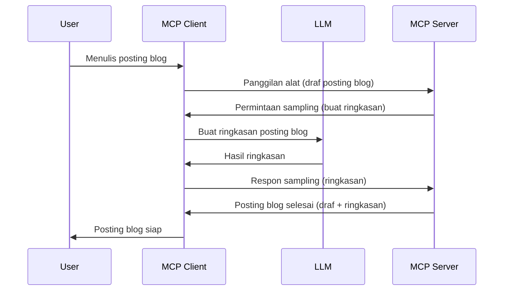

# Sampling - mendelegasikan fitur ke Klien

Terkadang, Anda perlu Klien MCP dan Server MCP berkolaborasi untuk mencapai tujuan bersama. Anda mungkin memiliki kasus di mana Server memerlukan bantuan LLM yang berada di klien. Untuk situasi ini, sampling adalah yang harus Anda gunakan.

Mari kita jelajahi beberapa kasus penggunaan dan cara membangun solusi yang melibatkan sampling.

## Ikhtisar

Dalam pelajaran ini, kami fokus menjelaskan kapan dan di mana menggunakan Sampling serta cara mengkonfigurasinya.

## Tujuan Pembelajaran

Dalam bab ini, kita akan:

- Menjelaskan apa itu Sampling dan kapan menggunakannya.
- Menunjukkan cara mengkonfigurasi Sampling di MCP.
- Memberikan contoh Sampling dalam tindakan.

## Apa itu Sampling dan mengapa menggunakannya?

Sampling adalah fitur lanjutan yang bekerja dengan cara berikut:



### Permintaan Sampling

Oke, sekarang kita memiliki gambaran luas tentang skenario yang kredibel, mari kita bicarakan tentang permintaan sampling yang dikirim server kembali ke klien. Berikut ini contoh permintaan dalam format JSON-RPC:

```json
{
  "jsonrpc": "2.0",
  "id": 1,
  "method": "sampling/createMessage",
  "params": {
    "messages": [
      {
        "role": "user",
        "content": {
          "type": "text",
          "text": "Create a blog post summary of the following blog post: <BLOG POST>"
        }
      }
    ],
    "modelPreferences": {
      "hints": [
        {
          "name": "claude-3-sonnet"
        }
      ],
      "intelligencePriority": 0.8,
      "speedPriority": 0.5
    },
    "systemPrompt": "You are a helpful assistant.",
    "maxTokens": 100
  }
}
```

Ada beberapa hal di sini yang patut disebutkan:

- Prompt, di bawah content -> text, adalah prompt kita yang berupa instruksi untuk LLM merangkum isi postingan blog.

- **modelPreferences**. Bagian ini adalah preferensi, rekomendasi konfigurasi apa yang digunakan dengan LLM. Pengguna dapat memilih apakah mengikuti rekomendasi ini atau mengubahnya. Dalam kasus ini ada rekomendasi pada model yang digunakan dan prioritas kecepatan serta kecerdasan.
- **systemPrompt**, ini adalah prompt sistem biasa yang memberi LLM kepribadian dan berisi instruksi panduan.
- **maxTokens**, ini adalah properti lain yang digunakan untuk menyatakan berapa banyak token yang direkomendasikan digunakan untuk tugas ini.

### Respon Sampling

Respon ini adalah apa yang akhirnya dikirimkan MCP Client kembali ke MCP Server dan merupakan hasil dari klien memanggil LLM, menunggu respon itu lalu membangun pesan ini. Berikut contoh dalam JSON-RPC:

```json
{
  "jsonrpc": "2.0",
  "id": 1,
  "result": {
    "role": "assistant",
    "content": {
      "type": "text",
      "text": "Here's your abstract <ABSTRACT>"
    },
    "model": "gpt-5",
    "stopReason": "endTurn"
  }
}
```

Perhatikan bagaimana respon adalah abstrak dari postingan blog seperti yang kita minta. Juga perhatikan bahwa `model` yang digunakan bukan yang kita minta melainkan "gpt-5" dibanding "claude-3-sonnet". Ini untuk mengilustrasikan bahwa pengguna dapat mengubah pilihan mereka tentang apa yang digunakan dan permintaan sampling Anda adalah sebuah rekomendasi.

Oke, sekarang kita paham alur utamanya, dan tugas yang berguna untuk menggunakannya adalah "pembuatan postingan blog + abstrak", mari kita lihat apa yang perlu kita lakukan agar ini bekerja.

### Jenis Pesan

Pesan Sampling tidak terbatas hanya pada teks tetapi Anda juga dapat mengirim gambar dan audio. Berikut bagaimana JSON-RPC terlihat berbeda:

**Teks**

```json
{
  "type": "text",
  "text": "The message content"
}
```

**Konten gambar**

```json
{
  "type": "image",
  "data": "base64-encoded-image-data",
  "mimeType": "image/jpeg"
}
```

**Konten audio**

```json
{
  "type": "audio",
  "data": "base64-encoded-audio-data",
  "mimeType": "audio/wav"
}
```

> NOTE: untuk informasi lebih detail tentang Sampling, lihat [dokumentasi resmi](https://modelcontextprotocol.io/specification/2025-11-25/client/sampling)

## Cara Mengkonfigurasi Sampling di Klien

> Catatan: jika Anda hanya membangun server, Anda tidak perlu banyak melakukan di sini.

Di klien, Anda harus menentukan fitur berikut seperti ini:

```json
{
  "capabilities": {
    "sampling": {}
  }
}
```

Ini kemudian akan dipilih saat klien yang Anda pilih menginisialisasi dengan server.

## Contoh Sampling dalam Tindakan - Membuat Postingan Blog

Mari kita buat server sampling bersama, kita perlu melakukan hal berikut:

1. Membuat alat di Server.
1. Alat tersebut harus membuat permintaan sampling.
1. Alat harus menunggu jawaban dari permintaan sampling klien.
1. Kemudian hasil alat tersebut harus diproduksi.

Mari kita lihat kodenya langkah demi langkah:

### -1- Membuat alat

**python**

```python
@mcp.tool()
async def create_blog(title: str, content: str, ctx: Context[ServerSession, None]) -> str:
    """Create a blog post and generate a summary"""

```

### -2- Membuat permintaan sampling

Perluas alat Anda dengan kode berikut:

**python**

```python
post = BlogPost(
        id=len(posts) + 1,
        title=title,
        content=content,
        abstract=""
    )

prompt = f"Create an abstract of the following blog post: title: {title} and draft: {content} "

result = await ctx.session.create_message(
        messages=[
            SamplingMessage(
                role="user",
                content=TextContent(type="text", text=prompt),
            )
        ],
        max_tokens=100,
)

```

### -3- Menunggu respon dan mengembalikan respon

**python**

```python
post.abstract = result.content.text

posts.append(post)

# mengembalikan produk lengkap
return json.dumps({
    "id": post.title,
    "abstract": post.abstract
})
```

### -4- Kode lengkap

**python**

```python
from starlette.applications import Starlette
from starlette.routing import Mount, Host

from mcp.server.fastmcp import Context, FastMCP

from mcp.server.session import ServerSession
from mcp.types import SamplingMessage, TextContent

import json


from uuid import uuid4
from typing import List
from pydantic import BaseModel


mcp = FastMCP("Blog post generator")

# app = FastAPI()

posts = []

class BlogPost(BaseModel):
    id: int
    title: str
    content: str
    abstract: str

posts: List[BlogPost] = []

@mcp.tool()
async def create_blog(title: str, content: str, ctx: Context[ServerSession, None]) -> str:
    """Create a blog post and generate a summary"""

    post = BlogPost(
        id=len(posts) + 1,
        title=title,
        content=content,
        abstract=""
    )

    prompt = f"Create an abstract of the following blog post: title: {title} and draft: {content} "

    result = await ctx.session.create_message(
        messages=[
            SamplingMessage(
                role="user",
                content=TextContent(type="text", text=prompt),
            )
        ],
        max_tokens=100,
    )

    post.abstract = result.content.text

    posts.append(post)

    # mengembalikan posting blog lengkap
    return json.dumps({
        "id": post.title,
        "abstract": post.abstract
    })

if __name__ == "__main__":
    print("Starting server...")
    # mcp.run()
    mcp.run(transport="streamable-http")

# jalankan app dengan: python server.py
```

### -5- Mengujinya di Visual Studio Code

Untuk menguji ini di Visual Studio Code, lakukan hal berikut:

1. Mulai server di terminal
1. Tambahkan di *mcp.json* (dan pastikan servernya sudah berjalan) misalnya seperti ini:

   ```json
   "servers": {
      "blog-server": {
        "type": "http",
        "url": "http://localhost:8000/mcp"
      }
   }
   ```

1. Ketik prompt:

   ```text
   create a blog post named "Where Python comes from", the content is "Python is actually named after Monty Python Flying Circus"
   ```

1. Izinkan sampling berjalan. Pertama kali Anda menguji ini Anda akan disajikan dialog tambahan yang harus Anda terima, kemudian Anda akan melihat dialog normal yang meminta Anda menjalankan alat

1. Periksa hasil. Anda akan melihat hasil yang dirender dengan baik di GitHub Copilot Chat tapi Anda juga bisa memeriksa respon JSON mentahnya.

**Bonus**. Alat Visual Studio Code memiliki dukungan hebat untuk sampling. Anda dapat mengkonfigurasi akses Sampling pada server yang Anda instal dengan cara:

1. Navigasi ke bagian ekstensi.
1. Pilih ikon roda gigi untuk server yang terpasang di bagian "MCP SERVERS - INSTALLED".
1 Pilih "Configure Model Access", di sini Anda dapat memilih model mana yang boleh digunakan GitHub Copilot saat melakukan sampling. Anda juga dapat melihat semua permintaan sampling yang terjadi baru-baru ini dengan memilih "Show Sampling requests".

## Tugas

Dalam tugas ini, Anda akan membangun Sampling yang sedikit berbeda yaitu integrasi sampling yang mendukung pembuatan deskripsi produk. Berikut skenarionya:

**Skenario**: Pekerja back office di e-commerce membutuhkan bantuan, mereka butuh waktu terlalu lama membuat deskripsi produk. Oleh karena itu, Anda harus membangun solusi di mana Anda dapat memanggil alat "create_product" dengan argumen "title" dan "keywords" dan alat tersebut harus menghasilkan produk lengkap termasuk field "description" yang harus diisi oleh LLM klien.

TIP: gunakan apa yang Anda pelajari sebelumnya untuk membangun server ini dan alatnya menggunakan permintaan sampling.

## Solusi

[Solusi](./solution/README.md)

## Kesimpulan Utama

Sampling adalah fitur hebat yang memungkinkan server mendelegasikan tugas ke klien ketika membutuhkan bantuan LLM.

## Selanjutnya

- [Bab 4 - Implementasi Praktis](../../04-PracticalImplementation/README.md)

---

<!-- CO-OP TRANSLATOR DISCLAIMER START -->
**Penafian**:
Dokumen ini telah diterjemahkan menggunakan layanan terjemahan AI [Co-op Translator](https://github.com/Azure/co-op-translator). Meskipun kami berupaya untuk mencapai akurasi, harap diketahui bahwa terjemahan otomatis mungkin mengandung kesalahan atau ketidakakuratan. Dokumen asli dalam bahasa aslinya harus dianggap sebagai sumber yang sah. Untuk informasi penting, disarankan menggunakan terjemahan profesional oleh manusia. Kami tidak bertanggung jawab atas kesalahpahaman atau penafsiran yang keliru yang timbul dari penggunaan terjemahan ini.
<!-- CO-OP TRANSLATOR DISCLAIMER END -->