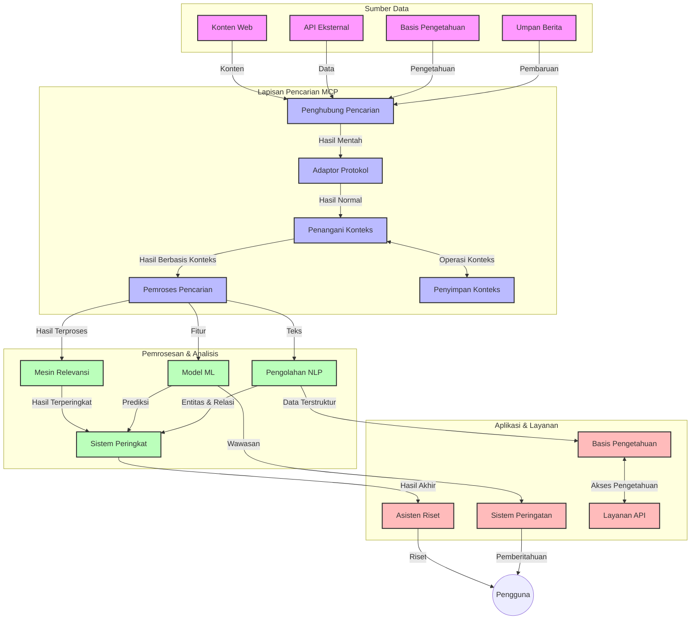
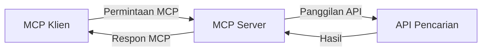
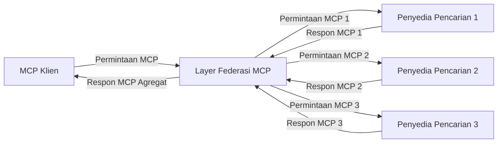
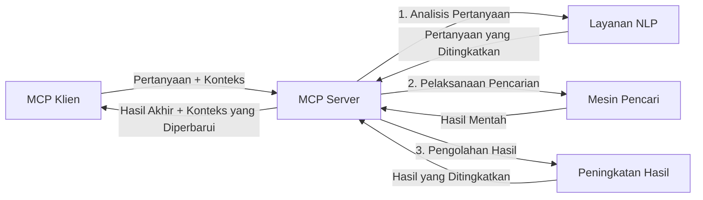

# Protokol Konteks Model untuk Pencarian Web Waktu Nyata

## Ikhtisar

Pencarian web waktu nyata telah menjadi esensial dalam lingkungan yang dipenuhi informasi saat ini, di mana aplikasi membutuhkan akses langsung ke informasi terbaru di seluruh internet untuk memberikan respons yang relevan dan tepat waktu. Protokol Konteks Model (MCP) merupakan kemajuan signifikan dalam mengoptimalkan proses pencarian waktu nyata ini, meningkatkan efisiensi pencarian, menjaga keutuhan konteks, dan memperbaiki kinerja sistem secara keseluruhan.

Modul ini mengeksplorasi bagaimana MCP mengubah pencarian web waktu nyata dengan menyediakan pendekatan standar untuk manajemen konteks di seluruh model AI, mesin pencari, dan aplikasi.

### Apa yang Akan Anda Pelajari

Dalam panduan komprehensif ini, Anda akan menemukan:

- Bagaimana MCP menciptakan jembatan mulus antara model AI dan kemampuan pencarian web waktu nyata
- Pola arsitektural untuk menerapkan solusi pencarian yang efisien dan skalabel dengan MCP
- Teknik untuk mempertahankan konteks pencarian di banyak kueri dan interaksi
- Implementasi kode praktis dalam Python dan JavaScript untuk berbagai skenario pencarian
- Metode untuk menyeimbangkan relevansi, kebaruan, dan kinerja dalam sistem pencarian bertenaga MCP

## Pengenalan Pencarian Web Waktu Nyata

Pencarian web waktu nyata adalah pendekatan teknologi yang memungkinkan kueri, pemrosesan, dan analisis informasi berbasis web secara terus-menerus saat dipublikasikan atau diperbarui, memungkinkan sistem menyediakan informasi segar dan relevan dengan latensi minimal. Berbeda dengan sistem pencarian tradisional yang beroperasi pada data terindeks yang mungkin sudah berjam-jam atau berhari-hari, pencarian waktu nyata memproses data hidup dari web, menghadirkan wawasan dan informasi yang mencerminkan keadaan konten online saat ini.

### Konsep Inti Pencarian Web Waktu Nyata:

- **Pemrosesan Kueri Berkelanjutan**: Kueri pencarian diproses terhadap sumber data yang terus diperbarui
- **Prioritas Kebaruan**: Sistem dirancang untuk memprioritaskan informasi segar
- **Penyeimbangan Relevansi**: Menjaga keseimbangan antara relevansi dan kebaruan
- **Arsitektur Skalabel**: Sistem harus mampu menangani beban kueri dan volume data yang bervariasi
- **Pemahaman Kontekstual**: Mempertahankan konteks pengguna sepanjang iterasi pencarian sangat penting untuk hasil bermakna
- **Reformulasi Kueri Dinamis**: Memodifikasi kueri dengan adaptif berdasarkan konteks dan hasil sebelumnya
- **Integrasi Multi-Sumber**: Menggabungkan hasil dari berbagai penyedia pencarian dan sumber web
- **Pemahaman Semantik**: Memproses kueri dan konten berdasarkan makna, bukan hanya kata kunci
- **Peringkat Waktu Nyata**: Menyesuaikan peringkat hasil secara berkelanjutan saat informasi baru tersedia

### Protokol Konteks Model dan Pencarian Web Waktu Nyata

Protokol Konteks Model (MCP) mengatasi beberapa tantangan kritis dalam lingkungan pencarian web waktu nyata:

1. **Pemusatan Konteks Pencarian**: MCP menstandardisasi bagaimana konteks dipertahankan di seluruh komponen pencarian yang terdistribusi, memastikan model AI dan node pemrosesan memiliki akses ke riwayat kueri yang relevan dan preferensi pengguna.

2. **Manajemen Kueri yang Efisien**: Dengan menyediakan mekanisme terstruktur untuk transmisi konteks, MCP mengurangi overhead pengulangan konteks di setiap iterasi pencarian.

3. **Interoperabilitas**: MCP menciptakan bahasa umum untuk berbagi konteks antara teknologi pencarian dan model AI yang beragam, memungkinkan arsitektur yang lebih fleksibel dan dapat dikembangkan.

4. **Konteks yang Dioptimalkan untuk Pencarian**: Implementasi MCP dapat memprioritaskan elemen konteks yang paling relevan untuk pencarian yang efektif, mengoptimalkan kinerja dan akurasi.

5. **Pemrosesan Pencarian Adaptif**: Dengan manajemen konteks yang tepat melalui MCP, sistem pencarian dapat menyesuaikan pemrosesan secara dinamis berdasarkan kebutuhan pengguna yang berkembang dan lanskap informasi.

Dalam aplikasi modern mulai dari agregasi berita hingga asisten penelitian, integrasi MCP dengan teknologi pencarian web memungkinkan pencarian yang lebih cerdas dan sadar konteks yang dapat memberikan hasil yang semakin relevan seiring interaksi pengguna berlanjut.

## Tujuan Pembelajaran

Pada akhir pelajaran ini, Anda akan bisa:

- Memahami dasar-dasar pencarian web waktu nyata dan tantangannya dalam aplikasi modern
- Menjelaskan bagaimana Protokol Konteks Model (MCP) meningkatkan kemampuan pencarian web waktu nyata
- Mengimplementasikan solusi pencarian berbasis MCP menggunakan kerangka kerja dan API populer
- Merancang dan menerapkan arsitektur pencarian yang skalabel dan berkinerja tinggi dengan MCP
- Menerapkan konsep MCP pada berbagai kasus penggunaan termasuk pencarian semantik, bantuan penelitian, dan browsing yang diperkuat AI
- Mengevaluasi tren muncul dan inovasi masa depan dalam teknologi pencarian berbasis MCP
- Mengembangkan sistem pencarian sadar konteks yang belajar dari interaksi pengguna
- Mengintegrasikan kemampuan pencarian web ke dalam asisten AI menggunakan protokol MCP yang distandarisasi
- Membuat pipeline pencarian multi-tahap yang secara progresif menyempurnakan hasil berdasarkan konteks
- Mengoptimalkan kinerja pencarian sambil menjaga kesadaran konteks yang komprehensif

### Definisi dan Signifikansi

Pencarian web waktu nyata melibatkan kueri, pengambilan, dan penyampaian informasi berbasis web secara berkelanjutan dengan latensi minimal. Berbeda dengan mesin pencari tradisional yang secara berkala meng-crawl dan mengindeks web, pencarian waktu nyata bertujuan menampilkan informasi segera setelah tersedia, memungkinkan akses langsung ke konten terkini.

Karakteristik utama pencarian web waktu nyata meliputi:

- **Kebaruan**: Memprioritaskan konten dan pembaruan terbaru
- **Pemrosesan Berkelanjutan**: Terus memantau informasi baru
- **Adaptasi Kueri**: Menyempurnakan kueri pencarian berdasarkan konteks dan masukan
- **Pengiriman Langsung**: Menyediakan hasil pencarian dengan keterlambatan minimal
- **Retensi Konteks**: Membangun di atas kueri sebelumnya untuk meningkatkan relevansi

### Tantangan dalam Pencarian Web Tradisional

Pendekatan pencarian web tradisional menghadapi beberapa keterbatasan saat diterapkan pada skenario waktu nyata:

1. **Fragmentasi Konteks**: Kesulitan mempertahankan konteks pencarian di antar banyak kueri
2. **Kebaruan Informasi**: Tantangan dalam mengakses dan memprioritaskan informasi terbaru
3. **Kompleksitas Integrasi**: Masalah interoperabilitas antara sistem pencarian dan aplikasi
4. **Masalah Latensi**: Menyeimbangkan pencarian komprehensif dengan kebutuhan waktu respons
5. **Penyesuaian Relevansi**: Menjamin akurasi dan relevansi sambil memprioritaskan kebaruan

## Memahami Protokol Konteks Model (MCP) untuk Pencarian

### Apa itu MCP dalam Konteks Pencarian?

Protokol Konteks Model (MCP) adalah protokol komunikasi yang distandarisasi yang dirancang untuk memfasilitasi interaksi efisien antara model AI dan aplikasi. Dalam konteks pencarian web waktu nyata, MCP menyediakan kerangka kerja untuk:

- Mempertahankan konteks pencarian sepanjang urutan kueri
- Menstandarisasi format kueri pencarian dan hasil
- Mengoptimalkan transmisi parameter dan hasil pencarian
- Meningkatkan komunikasi antara model dan mesin pencari

### Komponen Inti dan Arsitektur

Arsitektur MCP untuk pencarian web waktu nyata terdiri dari beberapa komponen kunci:

1. **Pengelola Konteks Kueri**: Mengelola dan mempertahankan konteks pencarian di banyak kueri
2. **Pemroses Pencarian**: Memproses permintaan pencarian yang masuk menggunakan teknik sadar konteks
3. **Adapter Protokol**: Mengonversi antar API pencarian berbeda sambil mempertahankan konteks
4. **Penyimpanan Konteks**: Menyimpan dan mengambil riwayat pencarian serta preferensi secara efisien
5. **Konektor Pencarian**: Menghubungkan ke berbagai mesin pencari dan API web



### Bagaimana MCP Meningkatkan Pencarian Web Waktu Nyata

MCP mengatasi tantangan pencarian web tradisional melalui:

- **Kontinuitas Kontekstual**: Mempertahankan hubungan antara kueri sepanjang sesi pencarian
- **Transmisi Teroptimasi**: Mengurangi redundansi parameter pencarian melalui manajemen konteks cerdas
- **Antarmuka Standar**: Menyediakan API yang konsisten untuk komponen pencarian
- **Pengurangan Latensi**: Meminimalkan overhead pemrosesan melalui penanganan konteks yang efisien
- **Peningkatan Relevansi**: Meningkatkan relevansi pencarian dengan mempertahankan maksud pengguna di banyak kueri

## Integrasi dan Implementasi

Sistem pencarian web waktu nyata memerlukan desain arsitektur dan implementasi yang hati-hati untuk menjaga baik kinerja maupun integritas konteks. Protokol Konteks Model menawarkan pendekatan standar untuk mengintegrasikan model AI dan teknologi pencarian, memungkinkan pipeline pencarian yang lebih canggih dan sadar konteks.

### Ikhtisar Integrasi MCP dalam Arsitektur Pencarian

Mengimplementasikan MCP dalam lingkungan pencarian web waktu nyata melibatkan beberapa pertimbangan utama:

1. **Serialisasi Konteks Pencarian**: MCP menyediakan mekanisme efisien untuk encoding informasi kontekstual dalam permintaan pencarian, memastikan konteks penting mengikuti kueri sepanjang pipeline pemrosesan. Ini termasuk format serialisasi standar yang dioptimalkan untuk metadata terkait pencarian.

2. **Pemrosesan Pencarian Berstatus**: MCP memungkinkan pemrosesan berstatus yang lebih cerdas dengan mempertahankan representasi konteks yang konsisten di seluruh iterasi pencarian. Ini sangat berharga dalam pipeline pencarian multi-tahap di mana penyempurnaan konteks memperbaiki hasil.

3. **Perluasan dan Penyempurnaan Kueri**: Implementasi MCP dalam sistem pencarian dapat memfasilitasi perluasan dan penyempurnaan kueri yang canggih berdasarkan konteks yang terkumpul, memungkinkan hasil yang semakin relevan seiring sesi pencarian berjalan.

4. **Caching dan Prioritas Hasil**: Dengan menstandarisasi penanganan konteks, MCP membantu mengelola caching dan prioritas hasil, memungkinkan komponen beradaptasi berdasarkan konteks pencarian yang berkembang.

5. **Federasi dan Agregasi Pencarian**: MCP memfasilitasi federasi pencarian yang lebih canggih di banyak backend dengan menyediakan representasi kontekstual terstruktur, memungkinkan agregasi hasil yang lebih bermakna dari sumber yang beragam.

Implementasi MCP di berbagai teknologi pencarian menciptakan pendekatan terpadu untuk manajemen konteks, mengurangi kebutuhan kode integrasi khusus sekaligus meningkatkan kemampuan sistem dalam mempertahankan konteks bermakna saat kueri pencarian berkembang.

### MCP dalam Berbagai Implementasi Pencarian Web

Contoh-contoh ini mengikuti spesifikasi MCP saat ini yang berfokus pada protokol berbasis JSON-RPC dengan mekanisme transportasi yang berbeda. Kode ini menunjukkan bagaimana Anda dapat mengimplementasikan integrasi pencarian khusus sambil mempertahankan kompatibilitas penuh dengan protokol MCP.

<details>
<summary>Implementasi Python dengan API Pencarian Umum</summary>

```python
import asyncio
import json
import aiohttp
from typing import Dict, Any, Optional, List
from contextlib import asynccontextmanager
from collections.abc import AsyncIterator

# Impor pustaka MCP standar
from mcp.client.session import ClientSession
from mcp.client.streamable_http import streamablehttp_client
from mcp.types import TextContent, CreateMessageRequestParams, CreateMessageResult
from mcp.server.fastmcp import FastMCP

# Buat server FastMCP untuk pencarian web
search_server = FastMCP("WebSearch")

# Kelas untuk menangani operasi pencarian web
class WebSearchHandler:
    def __init__(self, api_endpoint: str, api_key: str):
        self.api_endpoint = api_endpoint
        self.api_key = api_key
        self.session = None
        
    async def initialize(self):
        """Initialize the HTTP session"""
        self.session = aiohttp.ClientSession(
            headers={"Authorization": f"Bearer {self.api_key}"}
        )
    
    async def close(self):
        """Close the HTTP session"""
        if self.session:
            await self.session.close()
            
    async def perform_search(self, query: str, max_results: int = 5, 
                           include_domains: List[str] = None, 
                           exclude_domains: List[str] = None,
                           time_period: str = "any") -> Dict[str, Any]:
        """Perform web search using the search API"""
        # Bangun parameter pencarian
        search_params = {
            "q": query,
            "limit": max_results,
            "time": time_period
        }
        
        if include_domains:
            search_params["site"] = ",".join(include_domains)
            
        if exclude_domains:
            search_params["exclude_site"] = ",".join(exclude_domains)
        
        # Lakukan permintaan pencarian
        try:
            async with self.session.get(
                self.api_endpoint,
                params=search_params
            ) as response:
                if response.status != 200:
                    error_text = await response.text()
                    raise Exception(f"Search API error: {response.status} - {error_text}")
                
                search_data = await response.json()
                
                # Ubah respons spesifik API ke format standar
                results = []
                for item in search_data.get("results", []):
                    results.append({
                        "title": item.get("title", ""),
                        "url": item.get("url", ""),
                        "snippet": item.get("snippet", ""),
                        "date": item.get("published_date", ""),
                        "source": item.get("source", "")
                    })
                
                return {
                    "query": query,
                    "totalResults": len(results),
                    "results": results
                }
        except Exception as e:
            print(f"Search API request error: {e}")
            raise

# Inisialisasi pengelola pencarian
search_handler = WebSearchHandler(
    api_endpoint="https://api.search-service.example/search",
    api_key="your-api-key-here"
)

# Atur lifespan untuk mengelola pengelola pencarian
@asyncio.asynccontextmanager
async def app_lifespan(server: FastMCP):
    """Manage application lifecycle"""
    await search_handler.initialize()
    try:
        yield {"search_handler": search_handler}
    finally:
        await search_handler.close()

# Tetapkan lifespan untuk server
search_server = FastMCP("WebSearch", lifespan=app_lifespan)

# Daftarkan alat pencarian web
@search_server.tool()
async def web_search(query: str, max_results: int = 5, 
                   include_domains: List[str] = None,
                   exclude_domains: List[str] = None,
                   time_period: str = "any") -> Dict[str, Any]:
    """
    Search the web for information
    
    Args:
        query: The search query
        max_results: Maximum number of results to return (default: 5)
        include_domains: List of domains to include in search results
        exclude_domains: List of domains to exclude from search results
        time_period: Time period for results ("day", "week", "month", "any")
        
    Returns:
        Dictionary containing search results
    """
    ctx = search_server.get_context()
    search_handler = ctx.request_context.lifespan_context["search_handler"]
    
    results = await search_handler.perform_search(
        query=query,
        max_results=max_results,
        include_domains=include_domains,
        exclude_domains=exclude_domains,
        time_period=time_period
    )
    
    return results

# Contoh penggunaan klien
async def client_example():
    # Sambungkan ke server pencarian menggunakan transport HTTP Streamable
    async with streamablehttp_client("http://localhost:8000/mcp") as (read, write, _):
        async with ClientSession(read, write) as session:
            # Inisialisasi koneksi
            await session.initialize()
            
            # Panggil alat pencarian web
            search_results = await session.call_tool(
                "web_search", 
                {
                    "query": "latest developments in AI and Model Context Protocol",
                    "max_results": 5,
                    "time_period": "day",
                    "include_domains": ["github.com", "microsoft.com"]
                }
            )
            
            print(f"Search results: {search_results}")

# Contoh eksekusi server
if __name__ == "__main__":
    # Jalankan server dengan transport HTTP Streamable
    search_server.run(transport="streamable-http")
```
</details> 

<details>
<summary>Implementasi JavaScript dengan Pencarian Berbasis Browser</summary>

```javascript
// Implementasi server MCP untuk pencarian web
import { McpServer, ResourceTemplate } from '@modelcontextprotocol/sdk/server/mcp.js';
import { StreamableHTTPServerTransport } from '@modelcontextprotocol/sdk/server/streamableHttp.js';
import { z } from 'zod';

// Buat server MCP untuk pencarian web
const searchServer = new McpServer({
    name: "BrowserSearch",
    description: "A server that provides web search capabilities"
});

// Kelas layanan pencarian
class SearchService {
    constructor(searchApiUrl, apiKey) {
        this.searchApiUrl = searchApiUrl;
        this.apiKey = apiKey;
    }

    async performSearch(parameters) {
        const {
            query = '',
            maxResults = 5,
            includeDomains = [],
            excludeDomains = [],
            timePeriod = 'any'
        } = parameters;
        
        // Buat URL pencarian dengan parameter
        const url = new URL(this.searchApiUrl);
        url.searchParams.append('q', query);
        url.searchParams.append('limit', maxResults);
        url.searchParams.append('time', timePeriod);
        
        if (includeDomains.length > 0) {
            url.searchParams.append('site', includeDomains.join(','));
        }
        
        if (excludeDomains.length > 0) {
            url.searchParams.append('exclude_site', excludeDomains.join(','));
        }
        
        try {
            const response = await fetch(url.toString(), {
                method: 'GET',
                headers: {
                    'Authorization': `Bearer ${this.apiKey}`,
                    'Content-Type': 'application/json'
                }
            });
            
            if (!response.ok) {
                const errorText = await response.text();
                throw new Error(`Search API error: ${response.status} - ${errorText}`);
            }
            
            const searchData = await response.json();
            
            // Ubah respons spesifik API ke format standar
            const results = searchData.results?.map(item => ({
                title: item.title || '',
                url: item.url || '',
                snippet: item.snippet || '',
                date: item.published_date || '',
                source: item.source || ''
            })) || [];
            
            return {
                query,
                totalResults: results.length,
                results
            };
        } catch (error) {
            console.error('Search API request error:', error);
            throw error;
        }
    }
}

// Inisialisasi layanan pencarian
const searchService = new SearchService(
    'https://api.search-service.example/search',
    'your-api-key-here'
);

// Atur penyedia konteks untuk server
searchServer.setContextProvider(() => {
    return {
        searchService
    };
});

// Daftarkan alat pencarian web
searchServer.tool({
    name: 'web_search',
    description: 'Search the web for information',
    parameters: {
        type: 'object',
        properties: {
            query: {
                type: 'string',
                description: 'The search query'
            },
            maxResults: {
                type: 'integer',
                description: 'Maximum number of results to return',
                default: 5
            },
            includeDomains: {
                type: 'array',
                items: { type: 'string' },
                description: 'List of domains to include in search results'
            },
            excludeDomains: {
                type: 'array',
                items: { type: 'string' },
                description: 'List of domains to exclude from search results'
            },
            timePeriod: {
                type: 'string',
                description: 'Time period for results',
                enum: ['day', 'week', 'month', 'any'],
                default: 'any'
            }
        },
        required: ['query']
    },
    handler: async (params, context) => {
        const { searchService } = context;
        return await searchService.performSearch(params);
    }
});

// Contoh kode klien untuk terhubung ke server pencarian
import { Client } from '@modelcontextprotocol/sdk/client/index.js';
import { StreamableHTTPClientTransport } from '@modelcontextprotocol/sdk/client/streamableHttp.js';

async function connectToSearchServer() {
    // Terhubung ke server pencarian
    const transport = new StreamableHTTPClientTransport(
        new URL('http://localhost:8000/mcp')
    );
    
    const client = new Client({
        name: 'search-client',
        version: '1.0.0'
    });
    
    await client.connect(transport);
    
    // Jalankan alat pencarian
    const searchResults = await client.callTool({
        name: 'web_search',
        arguments: {
            query: 'Model Context Protocol implementation examples',
            maxResults: 10,
            timePeriod: 'week',
            includeDomains: ['github.com', 'docs.microsoft.com']
        }
    });
    
    console.log('Search results:', searchResults);
    
    // Bersihkan
    await client.disconnect();
}

// Mulai server
const transport = new StreamableHTTPServerTransport();
await searchServer.connect(transport);
console.log('Search server running at http://localhost:8000/mcp');

// Dalam proses terpisah atau setelah server dimulai
// connectToSearchServer().catch(console.error);
```
</details> 

## Penafian Contoh Kode

> **Catatan Penting**: Contoh kode di bawah ini menunjukkan integrasi Protokol Konteks Model (MCP) dengan fungsionalitas pencarian web. Walaupun mereka mengikuti pola dan struktur SDK MCP resmi, contoh ini telah disederhanakan untuk tujuan edukasi.
> 
> Contoh-contoh ini menunjukkan:
> 
> 1. **Implementasi Python**: Implementasi server FastMCP yang menyediakan alat pencarian web dan terhubung ke API pencarian eksternal. Contoh ini menunjukkan manajemen siklus hidup yang tepat, penanganan konteks, dan implementasi alat mengikuti pola dari [SDK MCP Python resmi](https://github.com/modelcontextprotocol/python-sdk). Server menggunakan transportasi HTTP Streamable yang direkomendasikan dan telah menggantikan transportasi SSE lama untuk deployment produksi.
> 
> 2. **Implementasi JavaScript**: Implementasi TypeScript/JavaScript menggunakan pola FastMCP dari [SDK MCP TypeScript resmi](https://github.com/modelcontextprotocol/typescript-sdk) untuk membuat server pencarian dengan definisi alat yang benar dan koneksi klien. Ini mengikuti pola terbaru yang direkomendasikan untuk manajemen sesi dan pemeliharaan konteks.
> 
> Contoh-contoh ini memerlukan penanganan kesalahan tambahan, otentikasi, dan kode integrasi API spesifik untuk penggunaan produksi. Endpoint API pencarian yang ditampilkan (`https://api.search-service.example/search`) adalah placeholder dan harus diganti dengan endpoint layanan pencarian yang sesungguhnya.
> 
> Untuk detail implementasi lengkap dan pendekatan terbaru, silakan merujuk ke [spesifikasi MCP resmi](https://spec.modelcontextprotocol.io/) dan dokumentasi SDK.

## Konsep Inti

### Kerangka Kerja Protokol Konteks Model (MCP)

Pada dasarnya, Protokol Konteks Model menyediakan cara standar bagi model AI, aplikasi, dan layanan untuk bertukar konteks. Dalam pencarian web waktu nyata, kerangka ini penting untuk menciptakan pengalaman pencarian multi-langkah yang koheren. Komponen kunci meliputi:

1. **Arsitektur Klien-Server**: MCP menetapkan pemisahan jelas antara klien pencarian (peminta) dan server pencarian (penyedia), memungkinkan model deployment yang fleksibel.

2. **Komunikasi JSON-RPC**: Protokol menggunakan JSON-RPC untuk pertukaran pesan, membuatnya kompatibel dengan teknologi web dan mudah diimplementasikan di berbagai platform.

3. **Manajemen Konteks**: MCP mendefinisikan metode terstruktur untuk memelihara, memperbarui, dan memanfaatkan konteks pencarian di banyak interaksi.

4. **Definisi Alat**: Kemampuan pencarian diekspos sebagai alat standar dengan parameter dan nilai kembalian yang terdefinisi dengan baik.

5. **Dukungan Streaming**: Protokol mendukung hasil streaming, penting untuk pencarian waktu nyata di mana hasil dapat tiba secara bertahap.

### Pola Integrasi Pencarian Web

Saat mengintegrasikan MCP dengan pencarian web, beberapa pola muncul:

#### 1. Integrasi Penyedia Pencarian Langsung



Dalam pola ini, server MCP langsung berinteraksi dengan satu atau lebih API pencarian, menerjemahkan permintaan MCP menjadi panggilan spesifik API dan memformat hasil sebagai respons MCP.

#### 2. Pencarian Federasi dengan Pemeliharaan Konteks



Pola ini mendistribusikan kueri pencarian ke beberapa penyedia pencarian kompatibel MCP, masing-masing mungkin mengkhususkan diri dalam jenis konten atau kemampuan pencarian yang berbeda, sambil menjaga konteks yang terpadu.

#### 3. Rantai Pencarian yang Ditingkatkan Konteks



Dalam pola ini, proses pencarian dibagi menjadi beberapa tahap, dengan konteks diperluas di setiap langkah, menghasilkan hasil yang semakin relevan secara bertahap.

### Komponen Konteks Pencarian

Dalam pencarian web berbasis MCP, konteks biasanya mencakup:

- **Riwayat Kueri**: Kueri pencarian sebelumnya dalam sesi
- **Preferensi Pengguna**: Bahasa, wilayah, pengaturan pencarian aman
- **Riwayat Interaksi**: Hasil mana yang diklik, waktu yang dihabiskan pada hasil
- **Parameter Pencarian**: Filter, urutan sortir, dan modifikasi pencarian lain
- **Pengetahuan Domain**: Konteks spesifik subjek yang relevan dengan pencarian
- **Konteks Temporal**: Faktor relevansi berbasis waktu
- **Preferensi Sumber**: Sumber informasi yang dipercaya atau diutamakan

## Kasus Penggunaan dan Aplikasi

### Penelitian dan Pengumpulan Informasi

MCP meningkatkan alur kerja penelitian dengan:

- Mempertahankan konteks penelitian di seluruh sesi pencarian
- Memungkinkan kueri yang lebih canggih dan relevan secara kontekstual
- Mendukung federasi pencarian multi-sumber
- Memfasilitasi ekstraksi pengetahuan dari hasil pencarian

### Pemantauan Berita dan Tren Waktu Nyata

Pencarian bertenaga MCP menawarkan keunggulan untuk pemantauan berita:

- Penemuan cerita berita yang muncul hampir secara waktu nyata
- Penyaringan kontekstual informasi relevan
- Pelacakan topik dan entitas dari berbagai sumber
- Pemberitahuan berita personal berdasarkan konteks pengguna

### Browsing dan Penelitian yang Diperkuat AI

MCP menciptakan kemungkinan baru untuk browsing yang diperkuat AI:

- Saran pencarian kontekstual berdasarkan aktivitas browser saat ini
- Integrasi mulus antara pencarian web dan asisten bertenaga LLM
- Penyempurnaan pencarian multi-langkah dengan konteks terjaga
- Peningkatan pemeriksaan fakta dan verifikasi informasi

## Tren dan Inovasi Masa Depan

### Evolusi MCP dalam Pencarian Web

Ke depan, kami memperkirakan MCP akan berkembang untuk mengatasi:
- **Pencarian Multimodal**: Mengintegrasikan pencarian teks, gambar, audio, dan video dengan konteks yang dipertahankan  
- **Pencarian Terdesentralisasi**: Mendukung ekosistem pencarian terdistribusi dan federasi  
- **Privasi Pencarian**: Mekanisme pencarian yang melindungi privasi berbasis konteks  
- **Pemahaman Query**: Parsing semantik mendalam dari query pencarian bahasa alami  

### Kemajuan Potensial dalam Teknologi  

Teknologi yang muncul yang akan membentuk masa depan pencarian MCP:  

1. **Arsitektur Pencarian Neural**: Sistem pencarian berbasis embedding yang dioptimalkan untuk MCP  
2. **Konteks Pencarian Personalisasi**: Mempelajari pola pencarian pengguna individu dari waktu ke waktu  
3. **Integrasi Knowledge Graph**: Pencarian kontekstual yang ditingkatkan dengan knowledge graph spesifik domain  
4. **Konteks Lintas Modalitas**: Mempertahankan konteks di berbagai modalitas pencarian  

## Latihan Praktis  

### Latihan 1: Menyiapkan Pipeline Pencarian MCP Dasar  

Dalam latihan ini, Anda akan belajar cara:  
- Mengonfigurasi lingkungan pencarian MCP dasar  
- Mengimplementasikan pengelola konteks untuk pencarian web  
- Menguji dan memvalidasi pemeliharaan konteks di seluruh iterasi pencarian  

### Latihan 2: Membangun Asisten Riset dengan Pencarian MCP  

Buat aplikasi lengkap yang:  
- Memproses pertanyaan riset berbahasa alami  
- Melakukan pencarian web yang sadar konteks  
- Mensintesis informasi dari berbagai sumber  
- Menyajikan temuan riset yang terorganisir  

### Latihan 3: Mengimplementasikan Federasi Pencarian Multi-Sumber dengan MCP  

Latihan lanjutan yang mencakup:  
- Pengiriman query sadar konteks ke berbagai mesin pencari  
- Peringkat dan agregasi hasil  
- Deduplicasi hasil pencarian secara kontekstual  
- Menangani metadata spesifik sumber  

## Sumber Daya Tambahan  

- [Model Context Protocol Specification](https://spec.modelcontextprotocol.io/) - Spesifikasi resmi MCP dan dokumentasi protokol terperinci  
- [Model Context Protocol Documentation](https://modelcontextprotocol.io/) - Tutorial terperinci dan panduan implementasi  
- [MCP Python SDK](https://github.com/modelcontextprotocol/python-sdk) - Implementasi Python resmi protokol MCP  
- [MCP TypeScript SDK](https://github.com/modelcontextprotocol/typescript-sdk) - Implementasi TypeScript resmi protokol MCP  
- [MCP Reference Servers](https://github.com/modelcontextprotocol/servers) - Implementasi referensi server MCP  
- [Bing Web Search API Documentation](https://learn.microsoft.com/en-us/bing/search-apis/bing-web-search/overview) - API pencarian web Microsoft  
- [Google Custom Search JSON API](https://developers.google.com/custom-search/v1/overview) - Mesin pencari programatik Google  
- [SerpAPI Documentation](https://serpapi.com/search-api) - API halaman hasil mesin pencari  
- [Meilisearch Documentation](https://www.meilisearch.com/docs) - Mesin pencari open-source  
- [Elasticsearch Documentation](https://www.elastic.co/guide/index.html) - Mesin pencarian dan analitik terdistribusi  
- [LangChain Documentation](https://python.langchain.com/docs/get_started/introduction) - Membangun aplikasi dengan LLM  

## Hasil Pembelajaran  

Dengan menyelesaikan modul ini, Anda akan dapat:  

- Memahami dasar-dasar pencarian web real-time dan tantangannya  
- Menjelaskan bagaimana Model Context Protocol (MCP) meningkatkan kemampuan pencarian web real-time  
- Mengimplementasikan solusi pencarian berbasis MCP menggunakan framework dan API populer  
- Merancang dan menerapkan arsitektur pencarian yang skalabel dan berperforma tinggi dengan MCP  
- Menerapkan konsep MCP untuk berbagai use case termasuk pencarian semantik, asisten riset, dan browsing yang ditingkatkan AI  
- Mengevaluasi tren yang muncul dan inovasi masa depan dalam teknologi pencarian berbasis MCP  

### Pertimbangan Kepercayaan dan Keamanan  

Saat mengimplementasikan solusi pencarian web berbasis MCP, ingat prinsip penting berikut dari spesifikasi MCP:  

1. **Persetujuan dan Kontrol Pengguna**: Pengguna harus secara eksplisit menyetujui dan memahami semua akses data dan operasi. Ini sangat penting untuk implementasi pencarian web yang mungkin mengakses sumber data eksternal.  

2. **Privasi Data**: Pastikan penanganan yang tepat terhadap query dan hasil pencarian, terutama yang mungkin mengandung informasi sensitif. Terapkan kontrol akses yang sesuai untuk melindungi data pengguna.  

3. **Keamanan Alat**: Terapkan otorisasi dan validasi yang tepat pada alat pencarian, karena alat ini berpotensi menjadi risiko keamanan melalui eksekusi kode arbitrer. Deskripsi perilaku alat harus dianggap tidak terpercaya kecuali diperoleh dari server yang dipercaya.  

4. **Dokumentasi yang Jelas**: Berikan dokumentasi yang jelas tentang kemampuan, keterbatasan, dan pertimbangan keamanan dari implementasi pencarian berbasis MCP Anda, sesuai pedoman implementasi dari spesifikasi MCP.  

5. **Alur Persetujuan yang Kuat**: Bangun alur persetujuan dan otorisasi yang kuat yang dengan jelas menjelaskan fungsi setiap alat sebelum mengotorisasi penggunaannya, terutama untuk alat yang berinteraksi dengan sumber daya web eksternal.  

Untuk detail lengkap mengenai keamanan dan pertimbangan kepercayaan MCP, lihat [dokumentasi resmi](https://modelcontextprotocol.io/specification/2025-11-25/basic/security_best_practices).  

## Apa Selanjutnya  

- [5.12 Autentikasi Entra ID untuk Server Model Context Protocol](../mcp-security-entra/README.md)

---

<!-- CO-OP TRANSLATOR DISCLAIMER START -->
**Penafian**:
Dokumen ini telah diterjemahkan menggunakan layanan terjemahan AI [Co-op Translator](https://github.com/Azure/co-op-translator). Meskipun kami berupaya untuk mencapai akurasi, harap diketahui bahwa terjemahan otomatis mungkin mengandung kesalahan atau ketidakakuratan. Dokumen asli dalam bahasa aslinya harus dianggap sebagai sumber yang sah. Untuk informasi penting, disarankan menggunakan terjemahan profesional oleh manusia. Kami tidak bertanggung jawab atas kesalahpahaman atau penafsiran yang keliru yang timbul dari penggunaan terjemahan ini.
<!-- CO-OP TRANSLATOR DISCLAIMER END -->