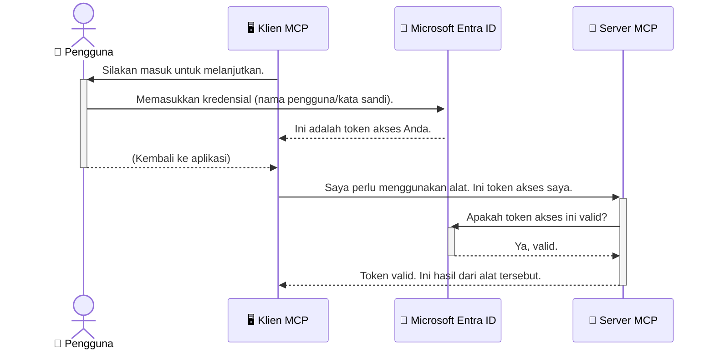

# Mengamankan Alur Kerja AI: Otentikasi Entra ID untuk Server Protokol Konteks Model

## Pendahuluan
Mengamankan server Model Context Protocol (MCP) Anda sama pentingnya dengan mengunci pintu depan rumah Anda. Membiarkan server MCP Anda terbuka mengekspos alat dan data Anda ke akses yang tidak sah, yang dapat menyebabkan pelanggaran keamanan. Microsoft Entra ID menyediakan solusi pengelolaan identitas dan akses berbasis cloud yang kuat, membantu memastikan bahwa hanya pengguna dan aplikasi yang berwenang yang dapat berinteraksi dengan server MCP Anda. Dalam bagian ini, Anda akan mempelajari cara melindungi alur kerja AI Anda menggunakan otentikasi Entra ID.

## Tujuan Pembelajaran
Pada akhir bagian ini, Anda akan dapat:

- Memahami pentingnya mengamankan server MCP.
- Menjelaskan dasar-dasar Microsoft Entra ID dan otentikasi OAuth 2.0.
- Mengenali perbedaan antara klien publik dan rahasia.
- Mengimplementasikan otentikasi Entra ID baik pada skenario server MCP lokal (klien publik) maupun jarak jauh (klien rahasia).
- Menerapkan praktik keamanan terbaik saat mengembangkan alur kerja AI.

## Keamanan dan MCP

Sama seperti Anda tidak akan membiarkan pintu depan rumah Anda tidak terkunci, Anda juga tidak boleh membiarkan server MCP Anda terbuka untuk siapa saja mengaksesnya. Mengamankan alur kerja AI Anda sangat penting untuk membangun aplikasi yang kuat, dapat dipercaya, dan aman. Bab ini akan memperkenalkan Anda pada penggunaan Microsoft Entra ID untuk mengamankan server MCP Anda, memastikan bahwa hanya pengguna dan aplikasi yang berwenang yang dapat berinteraksi dengan alat dan data Anda.

## Mengapa Keamanan Penting untuk Server MCP

Bayangkan server MCP Anda memiliki alat yang dapat mengirim email atau mengakses database pelanggan. Server yang tidak aman berarti siapa saja berpotensi dapat menggunakan alat tersebut, yang dapat mengarah pada akses data tanpa izin, spam, atau aktivitas berbahaya lainnya.

Dengan menerapkan otentikasi, Anda memastikan bahwa setiap permintaan ke server Anda diverifikasi, mengonfirmasi identitas pengguna atau aplikasi yang membuat permintaan. Ini adalah langkah pertama dan yang paling penting dalam mengamankan alur kerja AI Anda.

## Pengenalan Microsoft Entra ID

[**Microsoft Entra ID**](https://adoption.microsoft.com/microsoft-security/entra/) adalah layanan pengelolaan identitas dan akses berbasis cloud. Anggaplah ini sebagai penjaga keamanan universal untuk aplikasi Anda. Ini menangani proses kompleks verifikasi identitas pengguna (otentikasi) dan menentukan apa yang mereka boleh lakukan (otorisasi).

Dengan menggunakan Entra ID, Anda dapat:

- Mengaktifkan masuk aman untuk pengguna.
- Melindungi API dan layanan.
- Mengelola kebijakan akses dari satu lokasi pusat.

Untuk server MCP, Entra ID menyediakan solusi yang kuat dan terpercaya secara luas untuk mengelola siapa yang dapat mengakses kemampuan server Anda.

---

## Memahami Cara Kerja: Bagaimana Otentikasi Entra ID Bekerja

Entra ID menggunakan standar terbuka seperti **OAuth 2.0** untuk menangani otentikasi. Meskipun detailnya bisa rumit, konsep inti sederhana dan dapat dipahami dengan analogi.

### Pengenalan Ringan ke OAuth 2.0: Kunci Valet

Bayangkan OAuth 2.0 seperti layanan valet untuk mobil Anda. Saat Anda tiba di restoran, Anda tidak memberikan kunci utama Anda ke valet. Sebaliknya, Anda memberikan **kunci valet** yang memiliki izin terbatas—kunci tersebut dapat menyalakan mobil dan mengunci pintu, tapi tidak dapat membuka bagasi atau kompartemen sarung tangan.

Dalam analogi ini:

- **Anda** adalah **Pengguna**.
- **Mobil Anda** adalah **Server MCP** dengan alat dan data berharga.
- **Valet** adalah **Microsoft Entra ID**.
- **Petugas Parkir** adalah **Klien MCP** (aplikasi yang mencoba mengakses server).
- **Kunci Valet** adalah **Token Akses**.

Token akses adalah string teks aman yang diterima klien MCP dari Entra ID setelah Anda masuk. Klien kemudian menyajikan token ini ke server MCP dengan setiap permintaan. Server dapat memverifikasi token untuk memastikan permintaan tersebut sah dan bahwa klien memiliki izin yang diperlukan, tanpa perlu menangani kredensial Anda yang sebenarnya (seperti kata sandi Anda).

### Alur Otentikasi

Berikut cara kerja proses ini dalam praktik:



### Memperkenalkan Microsoft Authentication Library (MSAL)

Sebelum kita masuk ke kode, penting untuk memperkenalkan komponen kunci yang akan Anda lihat dalam contoh: **Microsoft Authentication Library (MSAL)**.

MSAL adalah perpustakaan yang dikembangkan oleh Microsoft yang memudahkan pengembang dalam menangani otentikasi. Alih-alih Anda harus menulis semua kode rumit untuk menangani token keamanan, manajemen masuk, dan penyegaran sesi, MSAL mengurusi pekerjaan berat tersebut.

Menggunakan perpustakaan seperti MSAL sangat disarankan karena:

- **Aman:** Mengimplementasikan protokol standar industri dan praktik keamanan terbaik, mengurangi risiko kerentanan dalam kode Anda.
- **Mempermudah Pengembangan:** Mengabstraksi kompleksitas protokol OAuth 2.0 dan OpenID Connect, memungkinkan Anda menambahkan otentikasi yang kuat ke aplikasi Anda hanya dengan beberapa baris kode.
- **Dipelihara:** Microsoft secara aktif memelihara dan memperbarui MSAL untuk mengatasi ancaman keamanan baru dan perubahan platform.

MSAL mendukung beragam bahasa dan kerangka kerja aplikasi, termasuk .NET, JavaScript/TypeScript, Python, Java, Go, dan platform seluler seperti iOS dan Android. Ini berarti Anda dapat menggunakan pola otentikasi yang konsisten di seluruh tumpukan teknologi Anda.

Untuk mempelajari lebih lanjut tentang MSAL, Anda dapat melihat dokumentasi resmi [gambaran MSAL](https://learn.microsoft.com/entra/identity-platform/msal-overview).

---

## Mengamankan Server MCP Anda dengan Entra ID: Panduan Langkah demi Langkah

Sekarang, mari kita melalui cara mengamankan server MCP lokal (yang berkomunikasi melalui `stdio`) menggunakan Entra ID. Contoh ini menggunakan **klien publik**, yang cocok untuk aplikasi yang berjalan di mesin pengguna, seperti aplikasi desktop atau server pengembangan lokal.

### Skenario 1: Mengamankan Server MCP Lokal (dengan Klien Publik)

Dalam skenario ini, kita akan melihat server MCP yang berjalan secara lokal, berkomunikasi melalui `stdio`, dan menggunakan Entra ID untuk mengautentikasi pengguna sebelum mengizinkan akses ke alatnya. Server akan memiliki satu alat yang mengambil informasi profil pengguna dari Microsoft Graph API.

#### 1. Menyiapkan Aplikasi di Entra ID

Sebelum menulis kode, Anda perlu mendaftarkan aplikasi Anda di Microsoft Entra ID. Ini memberi tahu Entra ID tentang aplikasi Anda dan memberikan izin untuk menggunakan layanan otentikasi.

1. Buka **[portal Microsoft Entra](https://entra.microsoft.com/)**.
2. Masuk ke **App registrations** dan klik **New registration**.
3. Beri nama aplikasi Anda (misalnya, "My Local MCP Server").
4. Pada **Supported account types**, pilih **Accounts in this organizational directory only**.
5. Anda dapat membiarkan **Redirect URI** kosong untuk contoh ini.
6. Klik **Register**.

Setelah terdaftar, catat **Application (client) ID** dan **Directory (tenant) ID**. Anda akan membutuhkannya dalam kode Anda.

#### 2. Kode: Penjelasan

Mari kita lihat bagian kunci kode yang menangani otentikasi. Kode lengkap untuk contoh ini tersedia di folder [Entra ID - Local - WAM](https://github.com/Azure-Samples/mcp-auth-servers/tree/main/src/entra-id-local-wam) dalam repositori [mcp-auth-servers GitHub](https://github.com/Azure-Samples/mcp-auth-servers).

**`AuthenticationService.cs`**

Kelas ini bertanggung jawab menangani interaksi dengan Entra ID.

- **`CreateAsync`**: Metode ini menginisialisasi `PublicClientApplication` dari MSAL (Microsoft Authentication Library). Dikustomisasi dengan `clientId` dan `tenantId` aplikasi Anda.
- **`WithBroker`**: Ini mengaktifkan penggunaan broker (seperti Windows Web Account Manager), yang menyediakan pengalaman single sign-on yang lebih aman dan mulus.
- **`AcquireTokenAsync`**: Ini adalah metode inti. Pertama mencoba mengambil token secara senyap (berarti pengguna tidak perlu masuk lagi jika mereka sudah memiliki sesi yang valid). Jika tidak dapat mengambil token secara senyap, akan meminta pengguna untuk masuk secara interaktif.

```csharp
// Simplified for clarity
public static async Task<AuthenticationService> CreateAsync(ILogger<AuthenticationService> logger)
{
    var msalClient = PublicClientApplicationBuilder
        .Create(_clientId) // Your Application (client) ID
        .WithAuthority(AadAuthorityAudience.AzureAdMyOrg)
        .WithTenantId(_tenantId) // Your Directory (tenant) ID
        .WithBroker(new BrokerOptions(BrokerOptions.OperatingSystems.Windows))
        .Build();

    // ... cache registration ...

    return new AuthenticationService(logger, msalClient);
}

public async Task<string> AcquireTokenAsync()
{
    try
    {
        // Try silent authentication first
        var accounts = await _msalClient.GetAccountsAsync();
        var account = accounts.FirstOrDefault();

        AuthenticationResult? result = null;

        if (account != null)
        {
            result = await _msalClient.AcquireTokenSilent(_scopes, account).ExecuteAsync();
        }
        else
        {
            // If no account, or silent fails, go interactive
            result = await _msalClient.AcquireTokenInteractive(_scopes).ExecuteAsync();
        }

        return result.AccessToken;
    }
    catch (Exception ex)
    {
        _logger.LogError(ex, "An error occurred while acquiring the token.");
        throw; // Optionally rethrow the exception for higher-level handling
    }
}
```

**`Program.cs`**

Di sinilah server MCP diatur dan layanan otentikasi diintegrasikan.

- **`AddSingleton<AuthenticationService>`**: Mendaftarkan `AuthenticationService` ke kontainer injeksi dependensi, sehingga dapat digunakan oleh bagian lain aplikasi (seperti alat kami).
- Alat **`GetUserDetailsFromGraph`**: Alat ini membutuhkan instance dari `AuthenticationService`. Sebelum melakukan apa pun, alat memanggil `authService.AcquireTokenAsync()` untuk mendapatkan token akses yang valid. Jika otentikasi berhasil, token tersebut digunakan untuk memanggil Microsoft Graph API dan mengambil detail pengguna.

```csharp
// Simplified for clarity
[McpServerTool(Name = "GetUserDetailsFromGraph")]
public static async Task<string> GetUserDetailsFromGraph(
    AuthenticationService authService)
{
    try
    {
        // This will trigger the authentication flow
        var accessToken = await authService.AcquireTokenAsync();

        // Use the token to create a GraphServiceClient
        var graphClient = new GraphServiceClient(
            new BaseBearerTokenAuthenticationProvider(new TokenProvider(authService)));

        var user = await graphClient.Me.GetAsync();

        return System.Text.Json.JsonSerializer.Serialize(user);
    }
    catch (Exception ex)
    {
        return $"Error: {ex.Message}";
    }
}
```

#### 3. Cara Kerja Keseluruhan

1. Ketika klien MCP mencoba menggunakan alat `GetUserDetailsFromGraph`, alat ini pertama memanggil `AcquireTokenAsync`.
2. `AcquireTokenAsync` memicu perpustakaan MSAL untuk memeriksa token yang valid.
3. Jika tidak ada token, MSAL melalui broker akan meminta pengguna untuk masuk menggunakan akun Entra ID mereka.
4. Setelah pengguna masuk, Entra ID mengeluarkan token akses.
5. Alat menerima token dan menggunakannya untuk memanggil Microsoft Graph API secara aman.
6. Detail pengguna dikembalikan ke klien MCP.

Proses ini memastikan hanya pengguna yang terautentikasi yang dapat menggunakan alat tersebut, secara efektif mengamankan server MCP lokal Anda.

### Skenario 2: Mengamankan Server MCP Jarak Jauh (dengan Klien Rahasia)

Ketika server MCP Anda berjalan di mesin jarak jauh (seperti server cloud) dan berkomunikasi melalui protokol seperti HTTP Streaming, persyaratan keamanannya berbeda. Dalam kasus ini, Anda harus menggunakan **klien rahasia** dan **Authorization Code Flow**. Ini adalah metode yang lebih aman karena rahasia aplikasi tidak pernah terekspos ke browser.

Contoh ini menggunakan server MCP berbasis TypeScript yang menggunakan Express.js untuk menangani permintaan HTTP.

#### 1. Menyiapkan Aplikasi di Entra ID

Pengaturan di Entra ID mirip dengan klien publik, tetapi dengan satu perbedaan utama: Anda perlu membuat **client secret**.

1. Buka **[portal Microsoft Entra](https://entra.microsoft.com/)**.
2. Pada pendaftaran aplikasi Anda, buka tab **Certificates & secrets**.
3. Klik **New client secret**, beri deskripsi, dan klik **Add**.
4. **Penting:** Salin nilai secret segera. Anda tidak akan bisa melihatnya lagi.
5. Anda juga perlu mengonfigurasi **Redirect URI**. Buka tab **Authentication**, klik **Add a platform**, pilih **Web**, dan masukkan URI redirect untuk aplikasi Anda (misalnya, `http://localhost:3001/auth/callback`).

> **⚠️ Catatan Keamanan Penting:** Untuk aplikasi produksi, Microsoft sangat menyarankan menggunakan metode otentikasi tanpa rahasia seperti **Managed Identity** atau **Workload Identity Federation** daripada client secrets. Client secrets berisiko keamanan karena bisa terekspos atau dikompromikan. Managed identities memberikan pendekatan lebih aman dengan menghilangkan kebutuhan menyimpan kredensial dalam kode atau konfigurasi Anda.
>
> Untuk informasi lebih lanjut tentang managed identities dan cara mengimplementasikannya, lihat [Gambaran Managed identities untuk sumber daya Azure](https://learn.microsoft.com/entra/identity/managed-identities-azure-resources/overview).

#### 2. Kode: Penjelasan

Contoh ini menggunakan pendekatan berbasis sesi. Ketika pengguna mengotentikasi, server menyimpan token akses dan token penyegaran dalam sesi dan memberikan token sesi kepada pengguna. Token sesi ini lalu digunakan untuk permintaan berikutnya. Kode lengkap untuk contoh ini tersedia di folder [Entra ID - Confidential client](https://github.com/Azure-Samples/mcp-auth-servers/tree/main/src/entra-id-cca-session) dalam repositori [mcp-auth-servers GitHub](https://github.com/Azure-Samples/mcp-auth-servers).

**`Server.ts`**

File ini menyiapkan server Express dan lapisan transport MCP.

- **`requireBearerAuth`**: Ini adalah middleware yang melindungi endpoint `/sse` dan `/message`. Ini memeriksa token bearer yang valid di header `Authorization` dari permintaan.
- **`EntraIdServerAuthProvider`**: Ini adalah kelas kustom yang mengimplementasikan antarmuka `McpServerAuthorizationProvider`. Bertanggung jawab menangani alur OAuth 2.0.
- **`/auth/callback`**: Endpoint ini menangani pengalihan dari Entra ID setelah pengguna mengotentikasi. Ia menukar authorization code dengan token akses dan token penyegaran.

```typescript
// Disederhanakan untuk kejelasan
const app = express();
const { server } = createServer();
const provider = new EntraIdServerAuthProvider();

// Lindungi endpoint SSE
app.get("/sse", requireBearerAuth({
  provider,
  requiredScopes: ["User.Read"]
}), async (req, res) => {
  // ... sambungkan ke transport ...
});

// Lindungi endpoint pesan
app.post("/message", requireBearerAuth({
  provider,
  requiredScopes: ["User.Read"]
}), async (req, res) => {
  // ... tangani pesan ...
});

// Tangani callback OAuth 2.0
app.get("/auth/callback", (req, res) => {
  provider.handleCallback(req.query.code, req.query.state)
    .then(result => {
      // ... tangani keberhasilan atau kegagalan ...
    });
});
```

**`Tools.ts`**

File ini mendefinisikan alat yang disediakan oleh server MCP. Alat `getUserDetails` mirip dengan yang ada pada contoh sebelumnya, tetapi mendapatkan token akses dari sesi.

```typescript
// Disederhanakan untuk kejelasan
server.setRequestHandler(CallToolRequestSchema, async (request) => {
  const { name } = request.params;
  const context = request.params?.context as { token?: string } | undefined;
  const sessionToken = context?.token;

  if (name === ToolName.GET_USER_DETAILS) {
    if (!sessionToken) {
      throw new AuthenticationError("Authentication token is missing or invalid. Ensure the token is provided in the request context.");
    }

    // Dapatkan token Entra ID dari penyimpanan sesi
    const tokenData = tokenStore.getToken(sessionToken);
    const entraIdToken = tokenData.accessToken;

    const graphClient = Client.init({
      authProvider: (done) => {
        done(null, entraIdToken);
      }
    });

    const user = await graphClient.api('/me').get();

    // ... kembalikan detail pengguna ...
  }
});
```

**`auth/EntraIdServerAuthProvider.ts`**

Kelas ini menangani logika untuk:

- Mengarahkan pengguna ke halaman masuk Entra ID.
- Menukarkan authorization code dengan token akses.
- Menyimpan token dalam `tokenStore`.
- Menyegarkan token akses saat kedaluwarsa.

#### 3. Cara Kerja Keseluruhan

1. Ketika pengguna pertama kali mencoba terhubung ke server MCP, middleware `requireBearerAuth` akan melihat bahwa mereka tidak memiliki sesi yang valid dan akan mengarahkan mereka ke halaman masuk Entra ID.
2. Pengguna masuk dengan akun Entra ID mereka.
3. Entra ID mengalihkan pengguna kembali ke endpoint `/auth/callback` dengan kode otorisasi.
4. Server menukar kode tersebut dengan token akses dan token penyegaran, menyimpannya, dan membuat token sesi yang dikirim ke klien.
5. Klien sekarang dapat menggunakan token sesi ini di header `Authorization` untuk semua permintaan masa depan ke server MCP.
6. Saat alat `getUserDetails` dipanggil, alat ini menggunakan token sesi untuk mencari token akses Entra ID dan kemudian menggunakan itu untuk memanggil Microsoft Graph API.

Alur ini lebih kompleks dibandingkan alur klien publik, tetapi diperlukan untuk endpoint yang berhadapan dengan internet. Karena server MCP jarak jauh dapat diakses melalui internet publik, mereka memerlukan langkah keamanan yang lebih kuat untuk melindungi dari akses tidak sah dan potensi serangan.


## Praktik Terbaik Keamanan

- **Selalu gunakan HTTPS**: Enkripsi komunikasi antara klien dan server untuk melindungi token dari penyadapan.
- **Implementasikan Kontrol Akses Berbasis Peran (RBAC)**: Jangan hanya memeriksa *apakah* pengguna sudah terotentikasi; periksa *apa* yang mereka diizinkan untuk lakukan. Anda dapat mendefinisikan peran di Entra ID dan memeriksanya di server MCP Anda.
- **Pantau dan audit**: Catat semua kejadian autentikasi agar Anda dapat mendeteksi dan merespons aktivitas yang mencurigakan.
- **Tangani pembatasan dan pengaturan laju (rate limiting dan throttling)**: Microsoft Graph dan API lainnya menerapkan pembatasan laju untuk mencegah penyalahgunaan. Terapkan logika backoff eksponensial dan pengulangan di server MCP Anda untuk menangani respons HTTP 429 (Terlalu Banyak Permintaan) dengan elegan. Pertimbangkan caching data yang sering diakses untuk mengurangi panggilan API.
- **Penyimpanan token yang aman**: Simpan token akses dan token penyegaran dengan aman. Untuk aplikasi lokal, gunakan mekanisme penyimpanan aman sistem. Untuk aplikasi server, pertimbangkan menggunakan penyimpanan terenkripsi atau layanan manajemen kunci yang aman seperti Azure Key Vault.
- **Penanganan masa berlaku token**: Token akses memiliki masa berlaku terbatas. Terapkan pembaruan token otomatis menggunakan token penyegaran agar pengalaman pengguna tetap mulus tanpa perlu otentikasi ulang.
- **Pertimbangkan menggunakan Azure API Management**: Meskipun mengimplementasikan keamanan secara langsung di server MCP Anda memberi kontrol granular, API Gateway seperti Azure API Management dapat menangani banyak masalah keamanan ini secara otomatis, termasuk autentikasi, otorisasi, pembatasan laju, dan pemantauan. Mereka menyediakan lapisan keamanan terpusat di antara klien Anda dan server MCP Anda. Untuk detail lebih lanjut tentang menggunakan API Gateway dengan MCP, lihat [Azure API Management Your Auth Gateway For MCP Servers](https://techcommunity.microsoft.com/blog/integrationsonazureblog/azure-api-management-your-auth-gateway-for-mcp-servers/4402690).


## Poin Penting

- Mengamankan server MCP Anda sangat penting untuk melindungi data dan alat Anda.
- Microsoft Entra ID menyediakan solusi yang kuat dan skalabel untuk autentikasi dan otorisasi.
- Gunakan **klien publik** untuk aplikasi lokal dan **klien rahasia** untuk server jarak jauh.
- **Authorization Code Flow** adalah opsi yang paling aman untuk aplikasi web.


## Latihan

1. Pikirkan tentang server MCP yang mungkin Anda bangun. Apakah itu server lokal atau server jarak jauh?
2. Berdasarkan jawaban Anda, apakah Anda akan menggunakan klien publik atau rahasia?
3. Izin apa yang akan diminta server MCP Anda untuk melakukan tindakan terhadap Microsoft Graph?


## Latihan Praktis

### Latihan 1: Daftarkan Aplikasi di Entra ID  
Buka portal Microsoft Entra.  
Daftarkan aplikasi baru untuk server MCP Anda.  
Catat Application (client) ID dan Directory (tenant) ID.

### Latihan 2: Amankan Server MCP Lokal (Klien Publik)  
- Ikuti contoh kode untuk mengintegrasikan MSAL (Microsoft Authentication Library) untuk autentikasi pengguna.  
- Uji alur autentikasi dengan memanggil alat MCP yang mengambil detail pengguna dari Microsoft Graph.

### Latihan 3: Amankan Server MCP Jarak Jauh (Klien Rahasia)  
- Daftarkan klien rahasia di Entra ID dan buat rahasia klien.  
- Konfigurasikan server MCP Express.js Anda untuk menggunakan Authorization Code Flow.  
- Uji endpoint yang dilindungi dan konfirmasi akses berbasis token.

### Latihan 4: Terapkan Praktik Terbaik Keamanan  
- Aktifkan HTTPS untuk server lokal atau jarak jauh Anda.  
- Terapkan kontrol akses berbasis peran (RBAC) dalam logika server Anda.  
- Tambahkan penanganan masa berlaku token dan penyimpanan token yang aman.

## Sumber Daya

1. **Dokumentasi Ikhtisar MSAL**  
   Pelajari bagaimana Microsoft Authentication Library (MSAL) memungkinkan perolehan token yang aman lintas platform:  
   [MSAL Overview on Microsoft Learn](https://learn.microsoft.com/en-gb/entra/msal/overview)

2. **Repo GitHub Azure-Samples/mcp-auth-servers**  
   Implementasi referensi server MCP yang menunjukkan alur autentikasi:  
   [Azure-Samples/mcp-auth-servers on GitHub](https://github.com/Azure-Samples/mcp-auth-servers)

3. **Ikhtisar Managed Identities untuk Azure Resources**  
   Memahami cara menghilangkan rahasia dengan menggunakan identitas terkelola sistem atau pengguna:  
   [Managed Identities Overview on Microsoft Learn](https://learn.microsoft.com/en-us/entra/identity/managed-identities-azure-resources/)

4. **Azure API Management: Gerbang Otentikasi Anda untuk Server MCP**  
   Penjelajahan mendalam cara menggunakan APIM sebagai gerbang OAuth2 yang aman untuk server MCP:  
   [Azure API Management Your Auth Gateway For MCP Servers](https://techcommunity.microsoft.com/blog/integrationsonazureblog/azure-api-management-your-auth-gateway-for-mcp-servers/4402690)

5. **Referensi Izin Microsoft Graph**  
   Daftar lengkap izin penyerahan dan aplikasi untuk Microsoft Graph:  
   [Microsoft Graph Permissions Reference](https://learn.microsoft.com/zh-tw/graph/permissions-reference)


## Hasil Pembelajaran  
Setelah menyelesaikan bagian ini, Anda akan dapat:

- Menjelaskan mengapa autentikasi kritikal untuk server MCP dan alur kerja AI.  
- Mengatur dan mengonfigurasi autentikasi Entra ID untuk skenario server MCP lokal dan jarak jauh.  
- Memilih tipe klien yang tepat (publik atau rahasia) berdasarkan penyebaran server Anda.  
- Menerapkan praktik pengkodean aman, termasuk penyimpanan token dan otorisasi berbasis peran.  
- Melindungi server MCP dan alatnya dari akses tidak sah dengan percaya diri.

## Selanjutnya

- [5.13 Integrasi Model Context Protocol (MCP) dengan Microsoft Foundry](../mcp-foundry-agent-integration/README.md)

---

<!-- CO-OP TRANSLATOR DISCLAIMER START -->
**Penafian**:
Dokumen ini telah diterjemahkan menggunakan layanan terjemahan AI [Co-op Translator](https://github.com/Azure/co-op-translator). Meskipun kami berupaya untuk mencapai akurasi, harap diketahui bahwa terjemahan otomatis mungkin mengandung kesalahan atau ketidakakuratan. Dokumen asli dalam bahasa aslinya harus dianggap sebagai sumber yang sah. Untuk informasi penting, disarankan menggunakan terjemahan profesional oleh manusia. Kami tidak bertanggung jawab atas kesalahpahaman atau penafsiran yang keliru yang timbul dari penggunaan terjemahan ini.
<!-- CO-OP TRANSLATOR DISCLAIMER END -->