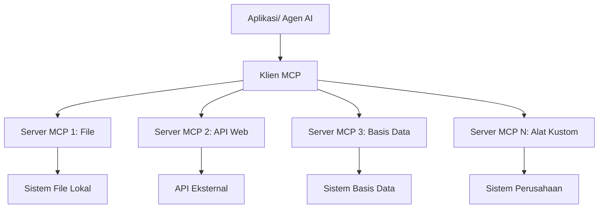

# 🌐 Modul 2: MCP dengan Dasar-dasar Microsoft Foundry Toolkit

[]()
[]()
[]()

## 📋 Tujuan Pembelajaran

Pada akhir modul ini, Anda akan dapat:
- ✅ Memahami arsitektur dan manfaat Model Context Protocol (MCP)
- ✅ Menjelajahi ekosistem server MCP Microsoft
- ✅ Mengintegrasikan server MCP dengan Microsoft Foundry Toolkit Agent Builder
- ✅ Membangun agen otomatisasi browser fungsional menggunakan Playwright MCP
- ✅ Mengonfigurasi dan menguji alat MCP dalam agen Anda
- ✅ Mengekspor dan menerapkan agen bertenaga MCP untuk penggunaan produksi

## 🎯 Melanjutkan dari Modul 1

Di Modul 1, kita menguasai dasar-dasar Microsoft Foundry Toolkit dan membuat Agen Python pertama kita. Sekarang kita akan **menguatkan** agen Anda dengan menghubungkannya ke alat dan layanan eksternal melalui **Model Context Protocol (MCP)** yang revolusioner.

Anggap ini seperti meng-upgrade dari kalkulator dasar ke komputer penuh - agen AI Anda akan mendapatkan kemampuan untuk:
- 🌐 Menjelajah dan berinteraksi dengan situs web
- 📁 Mengakses dan memanipulasi file
- 🔧 Mengintegrasikan dengan sistem enterprise
- 📊 Memproses data waktu nyata dari API

## 🧠 Memahami Model Context Protocol (MCP)

### 🔍 Apa itu MCP?

Model Context Protocol (MCP) adalah **"USB-C untuk aplikasi AI"** - standar terbuka revolusioner yang menghubungkan Large Language Models (LLM) ke alat eksternal, sumber data, dan layanan. Sama seperti USB-C menghilangkan kekacauan kabel dengan menyediakan satu konektor universal, MCP menghilangkan kompleksitas integrasi AI dengan satu protokol standar.

### 🎯 Masalah yang Diselesaikan MCP

**Sebelum MCP:**
- 🔧 Integrasi khusus untuk setiap alat
- 🔄 Terikat vendor dengan solusi proprietari
- 🔒 Kerentanan keamanan akibat koneksi ad-hoc
- ⏱️ Berbulan-bulan pengembangan untuk integrasi dasar

**Dengan MCP:**
- ⚡ Integrasi alat plug-and-play
- 🔄 Arsitektur vendor-agnostik
- 🛡️ Praktik keamanan terbaik bawaan
- 🚀 Beberapa menit untuk menambahkan kemampuan baru

### 🏗️ Pendalaman Arsitektur MCP

MCP mengikuti arsitektur **client-server** yang menciptakan ekosistem aman dan dapat diskalakan:



**🔧 Komponen Inti:**

| Komponen | Peran | Contoh |
|-----------|------|----------|
| **MCP Hosts** | Aplikasi yang menggunakan layanan MCP | Claude Desktop, VS Code, Microsoft Foundry Toolkit |
| **MCP Clients** | Penangkap protokol (1:1 dengan server) | Terintegrasi dalam aplikasi host |
| **MCP Servers** | Mengekspos kemampuan melalui protokol standar | Playwright, Files, Azure, GitHub |
| **Layer Transportasi** | Metode komunikasi | stdio, HTTP, WebSockets |


## 🏢 Ekosistem Server MCP Microsoft

Microsoft memimpin ekosistem MCP dengan rangkaian server tingkat enterprise yang komprehensif yang mengatasi kebutuhan bisnis dunia nyata.

### 🌟 Server MCP Microsoft Unggulan

#### 1. ☁️ Azure MCP Server
**🔗 Repository**: [azure/azure-mcp](https://github.com/azure/azure-mcp)
**🎯 Tujuan**: Manajemen sumber daya Azure komprehensif dengan integrasi AI

**✨ Fitur Utama:**
- Penyediaan infrastruktur deklaratif
- Pemantauan sumber daya waktu nyata
- Rekomendasi optimasi biaya
- Pemeriksaan kepatuhan keamanan

**🚀 Kasus Penggunaan:**
- Infrastruktur-sebagai-Kode dengan bantuan AI
- Pengaturan skala sumber daya otomatis
- Optimasi biaya cloud
- Otomatisasi alur kerja DevOps

#### 2. 📊 Microsoft Dataverse MCP
**📚 Dokumentasi**: [Microsoft Dataverse Integration](https://go.microsoft.com/fwlink/?linkid=2320176)
**🎯 Tujuan**: Antarmuka bahasa alami untuk data bisnis

**✨ Fitur Utama:**
- Query database dalam bahasa alami
- Pemahaman konteks bisnis
- Template prompt kustom
- Tata kelola data enterprise

**🚀 Kasus Penggunaan:**
- Pelaporan intelijen bisnis
- Analisis data pelanggan
- Wawasan pipeline penjualan
- Query data kepatuhan

#### 3. 🌐 Playwright MCP Server
**🔗 Repository**: [microsoft/playwright-mcp](https://github.com/microsoft/playwright-mcp)
**🎯 Tujuan**: Otomatisasi browser dan kemampuan interaksi web

**✨ Fitur Utama:**
- Otomatisasi lintas browser (Chrome, Firefox, Safari)
- Deteksi elemen cerdas
- Generasi tangkapan layar dan PDF
- Pemantauan trafik jaringan

**🚀 Kasus Penggunaan:**
- Alur kerja pengujian otomatis
- Web scraping dan ekstraksi data
- Pemantauan UI/UX
- Otomatisasi analisis kompetitif

#### 4. 📁 Files MCP Server
**🔗 Repository**: [microsoft/files-mcp-server](https://github.com/microsoft/files-mcp-server)
**🎯 Tujuan**: Operasi sistem file cerdas

**✨ Fitur Utama:**
- Manajemen file deklaratif
- Sinkronisasi konten
- Integrasi kontrol versi
- Ekstraksi metadata

**🚀 Kasus Penggunaan:**
- Manajemen dokumentasi
- Organisasi repositori kode
- Alur kerja penerbitan konten
- Penanganan file pipeline data

#### 5. 📝 MarkItDown MCP Server
**🔗 Repository**: [microsoft/markitdown](https://github.com/microsoft/markitdown)
**🎯 Tujuan**: Pemrosesan dan manipulasi Markdown lanjutan

**✨ Fitur Utama:**
- Parsing Markdown kaya fitur
- Konversi format (MD ↔ HTML ↔ PDF)
- Analisis struktur konten
- Pemrosesan template

**🚀 Kasus Penggunaan:**
- Alur kerja dokumentasi teknis
- Sistem manajemen konten
- Generasi laporan
- Otomasi basis pengetahuan

#### 6. 📈 Clarity MCP Server
**📦 Paket**: [@microsoft/clarity-mcp-server](https://www.npmjs.com/package/@microsoft/clarity-mcp-server)
**🎯 Tujuan**: Analitik web dan wawasan perilaku pengguna

**✨ Fitur Utama:**
- Analisis data heatmap
- Rekaman sesi pengguna
- Metrik performa
- Analisis funnel konversi

**🚀 Kasus Penggunaan:**
- Optimasi website
- Riset pengalaman pengguna
- Analisis A/B testing
- Dasbor intelijen bisnis

### 🌍 Ekosistem Komunitas

Selain server Microsoft, ekosistem MCP juga meliputi:
- **🐙 GitHub MCP**: Manajemen repositori dan analisis kode
- **🗄️ Database MCP**: Integrasi PostgreSQL, MySQL, MongoDB
- **☁️ Cloud Provider MCP**: Alat AWS, GCP, Digital Ocean
- **📧 Komunikasi MCP**: Integrasi Slack, Teams, Email

## 🛠️ Lab Praktik: Membangun Agen Otomatisasi Browser

**🎯 Tujuan Proyek**: Membuat agen otomatisasi browser cerdas menggunakan server Playwright MCP yang dapat menavigasi situs web, mengekstrak informasi, dan melakukan interaksi web yang kompleks.

### 🚀 Fase 1: Persiapan Dasar Agen

#### Langkah 1: Inisialisasi Agen Anda
1. **Buka Microsoft Foundry Toolkit Agent Builder**
2. **Buat Agen Baru** dengan konfigurasi berikut:
   - **Nama**: `BrowserAgent`
   - **Model**: Pilih GPT-4o


### 🔧 Fase 2: Alur Kerja Integrasi MCP

#### Langkah 3: Tambahkan Integrasi Server MCP
1. **Navigasi ke Bagian Tools** di Agent Builder
2. **Klik "Add Tool"** untuk membuka menu integrasi
3. **Pilih "MCP Server"** dari opsi yang tersedia


**🔍 Memahami Jenis Alat:**
- **Built-in Tools**: Fungsi Microsoft Foundry Toolkit yang telah dikonfigurasi
- **MCP Servers**: Integrasi layanan eksternal
- **Custom APIs**: Endpoint layanan Anda sendiri
- **Function Calling**: Akses fungsi model langsung

#### Langkah 4: Pemilihan Server MCP
1. **Pilih opsi "MCP Server"** untuk melanjutkan


2. **Jelajahi Katalog MCP** untuk mengeksplorasi integrasi yang tersedia


### 🎮 Fase 3: Konfigurasi Playwright MCP

#### Langkah 5: Pilih dan Konfigurasi Playwright
1. **Klik "Use Featured MCP Servers"** untuk mengakses server terverifikasi Microsoft
2. **Pilih "Playwright"** dari daftar unggulan
3. **Terima MCP ID Default** atau sesuaikan untuk lingkungan Anda


#### Langkah 6: Aktifkan Kemampuan Playwright
**🔑 Langkah Krusial**: Pilih **SEMUA** metode Playwright yang tersedia untuk fungsionalitas maksimal


**🛠️ Alat Playwright Esensial:**
- **Navigasi**: `goto`, `goBack`, `goForward`, `reload`
- **Interaksi**: `click`, `fill`, `press`, `hover`, `drag`
- **Ekstraksi**: `textContent`, `innerHTML`, `getAttribute`
- **Validasi**: `isVisible`, `isEnabled`, `waitForSelector`
- **Tangkap**: `screenshot`, `pdf`, `video`
- **Jaringan**: `setExtraHTTPHeaders`, `route`, `waitForResponse`

#### Langkah 7: Verifikasi Keberhasilan Integrasi
**✅ Indikator Keberhasilan:**
- Semua alat muncul di antarmuka Agent Builder
- Tidak ada pesan kesalahan pada panel integrasi
- Status server Playwright menunjukkan "Connected"


**🔧 Pemecahan Masalah Umum:**
- **Koneksi Gagal**: Periksa konektivitas internet dan pengaturan firewall
- **Alat Hilang**: Pastikan semua kemampuan dipilih saat konfigurasi
- **Kesalahan Izin**: Verifikasi VS Code memiliki izin sistem yang diperlukan

### 🎯 Fase 4: Rekayasa Prompt Lanjutan

#### Langkah 8: Rancang Prompt Sistem Cerdas
Buat prompt canggih yang memanfaatkan kemampuan penuh Playwright:

```markdown
# Web Automation Expert System Prompt

## Core Identity
You are an advanced web automation specialist with deep expertise in browser automation, web scraping, and user experience analysis. You have access to Playwright tools for comprehensive browser control.

## Capabilities & Approach
### Navigation Strategy
- Always start with screenshots to understand page layout
- Use semantic selectors (text content, labels) when possible
- Implement wait strategies for dynamic content
- Handle single-page applications (SPAs) effectively

### Error Handling
- Retry failed operations with exponential backoff
- Provide clear error descriptions and solutions
- Suggest alternative approaches when primary methods fail
- Always capture diagnostic screenshots on errors

### Data Extraction
- Extract structured data in JSON format when possible
- Provide confidence scores for extracted information
- Validate data completeness and accuracy
- Handle pagination and infinite scroll scenarios

### Reporting
- Include step-by-step execution logs
- Provide before/after screenshots for verification
- Suggest optimizations and alternative approaches
- Document any limitations or edge cases encountered

## Ethical Guidelines
- Respect robots.txt and rate limiting
- Avoid overloading target servers
- Only extract publicly available information
- Follow website terms of service
```

#### Langkah 9: Buat Prompt Pengguna Dinamis
Rancang prompt yang menunjukkan berbagai kemampuan:

**🌐 Contoh Analisis Web:**
```markdown
Navigate to github.com/kinfey and provide a comprehensive analysis including:
1. Repository structure and organization
2. Recent activity and contribution patterns  
3. Documentation quality assessment
4. Technology stack identification
5. Community engagement metrics
6. Notable projects and their purposes

Include screenshots at key steps and provide actionable insights.
```


### 🚀 Fase 5: Eksekusi dan Pengujian

#### Langkah 10: Jalankan Otomatisasi Pertama Anda
1. **Klik "Run"** untuk memulai rangkaian otomatisasi
2. **Pantau Eksekusi Waktu Nyata**:
   - Browser Chrome terbuka otomatis
   - Agen menavigasi situs target
   - Tangkapan layar diambil pada setiap langkah utama
   - Hasil analisis mengalir waktu nyata


#### Langkah 11: Analisis Hasil dan Wawasan
Tinjau analisis komprehensif di antarmuka Agent Builder:


### 🌟 Fase 6: Kemampuan Lanjutan dan Penerapan

#### Langkah 12: Ekspor dan Penerapan Produksi
Agent Builder mendukung berbagai opsi penerapan:


## 🎓 Ringkasan Modul 2 & Langkah Selanjutnya

### 🏆 Pencapaian Dibuka: Master Integrasi MCP

**✅ Keterampilan yang Dikuasai:**
- [ ] Memahami arsitektur dan manfaat MCP
- [ ] Menavigasi ekosistem server MCP Microsoft
- [ ] Mengintegrasikan Playwright MCP dengan Microsoft Foundry Toolkit
- [ ] Membangun agen otomatisasi browser canggih
- [ ] Rekayasa prompt lanjutan untuk otomatisasi web

### 📚 Sumber Tambahan

- **🔗 Spesifikasi MCP**: [Dokumentasi Protokol Resmi](https://modelcontextprotocol.io/)
- **🛠️ API Playwright**: [Referensi Metode Lengkap](https://playwright.dev/docs/api/class-playwright)
- **🏢 Server MCP Microsoft**: [Panduan Integrasi Enterprise](https://github.com/microsoft/mcp-servers)
- **🌍 Contoh Komunitas**: [Galeri Server MCP](https://github.com/modelcontextprotocol/servers)

**🎉 Selamat!** Anda telah berhasil menguasai integrasi MCP dan kini dapat membangun agen AI siap produksi dengan kemampuan alat eksternal!


### 🔜 Lanjut ke Modul Berikutnya

Siap meningkatkan keterampilan MCP Anda ke level berikutnya? Lanjutkan ke **[Modul 3: Pengembangan MCP Lanjutan dengan Microsoft Foundry Toolkit](../lab3/README.md)** di mana Anda akan belajar bagaimana:
- Membuat server MCP kustom Anda sendiri
- Mengonfigurasi dan menggunakan SDK Python MCP terbaru
- Menyiapkan MCP Inspector untuk debugging
- Menguasai alur kerja pengembangan server MCP lanjutan
- Membangun Server MCP Cuaca dari nol

---

<!-- CO-OP TRANSLATOR DISCLAIMER START -->
**Penafian**:
Dokumen ini telah diterjemahkan menggunakan layanan terjemahan AI [Co-op Translator](https://github.com/Azure/co-op-translator). Meskipun kami berupaya untuk mencapai akurasi, harap diketahui bahwa terjemahan otomatis mungkin mengandung kesalahan atau ketidakakuratan. Dokumen asli dalam bahasa aslinya harus dianggap sebagai sumber yang sah. Untuk informasi penting, disarankan menggunakan terjemahan profesional oleh manusia. Kami tidak bertanggung jawab atas kesalahpahaman atau penafsiran yang keliru yang timbul dari penggunaan terjemahan ini.
<!-- CO-OP TRANSLATOR DISCLAIMER END -->