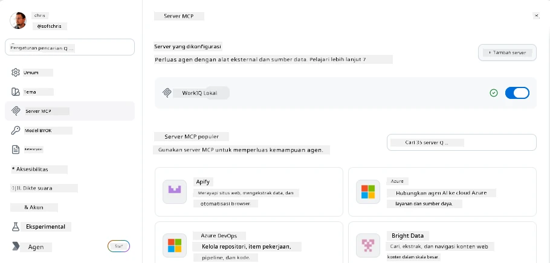
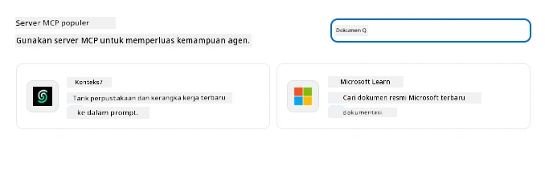
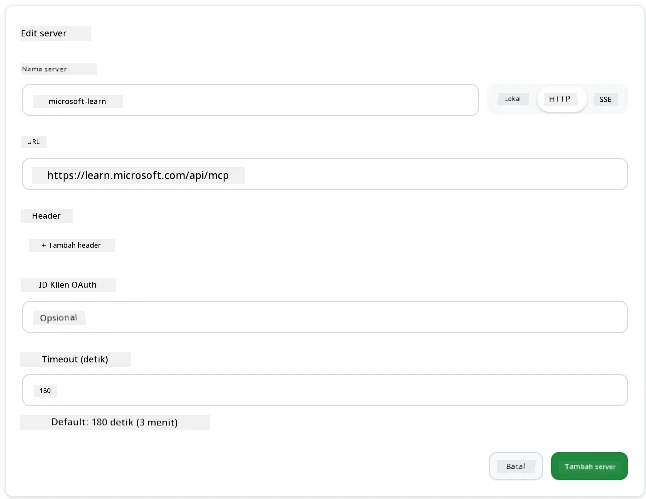
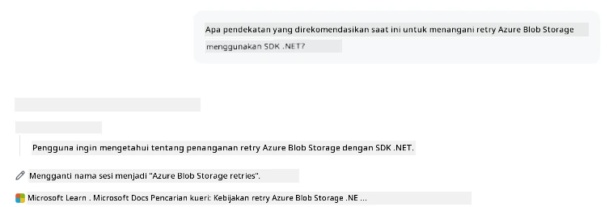
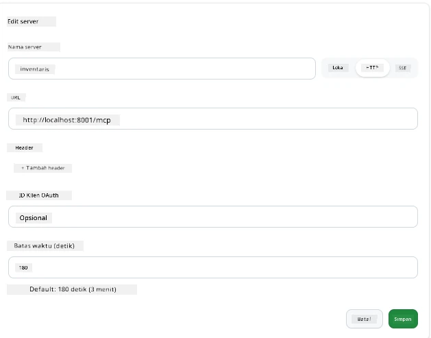
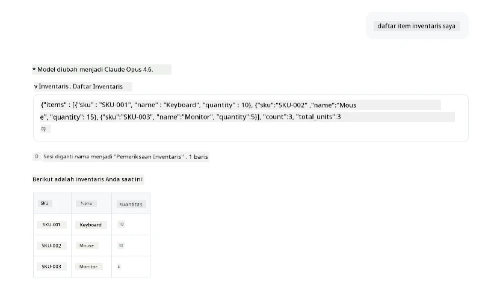
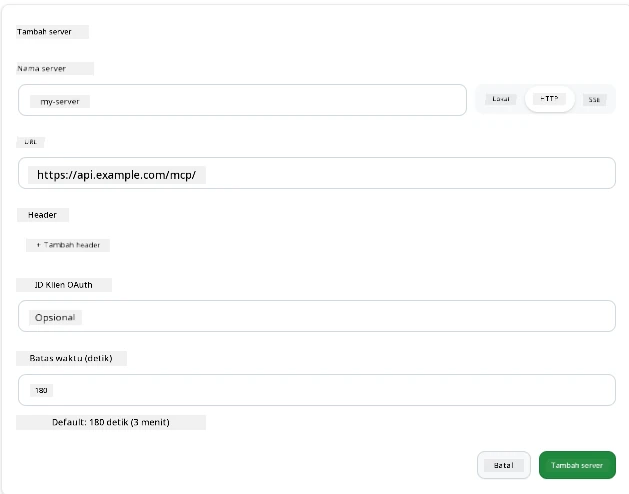
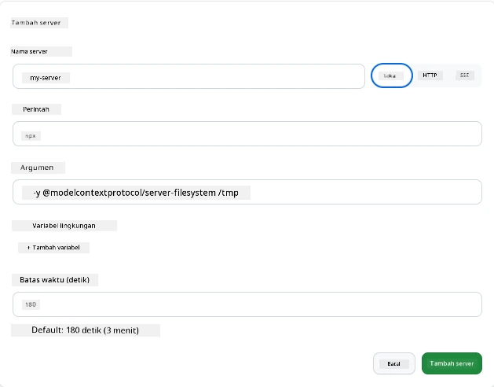

# Menggunakan Server MCP di Aplikasi GitHub Copilot

Sekarang Anda sudah tahu bagaimana MCP bekerja. Anda telah membangun server, mendefinisikan alat dan sumber daya, serta menghubungkan klien. Yang belum kita lakukan adalah membalik perspektif: alih-alih Anda yang membangun server, bagaimana jika Anda berada di sisi *konsumen*—sebagai pengguna aplikasi bertenaga AI yang mendukung MCP?

[GitHub Copilot App](https://github.com/github/app) adalah aplikasi desktop yang dapat menggunakan Server MCP. Dengan menghubungkan server MCP ke aplikasi ini, Anda membuka tingkat baru: Copilot kini bisa mengakses dokumentasi Anda, memanggil API internal Anda, menanyakan basis data Anda, atau berinteraksi dengan layanan apa pun yang Anda bungkus dalam sebuah server. Aplikasi ini menjadi host; server MCP Anda menjadi alat-alatnya.

Pelajaran ini akan memandu Anda melalui pengalaman tersebut dari awal hingga akhir—mulai dari menemukan panel pengaturan MCP hingga menghubungkan server dokumentasi nyata dan kemudian menghubungkan server kustom buatan Anda sendiri.

## Tujuan Pembelajaran

Pada akhir pelajaran ini, Anda akan bisa:

- Menemukan dan menavigasi panel Server MCP di pengaturan Copilot App.
- Menghubungkan server dokumentasi yang dihosting dan menggunakannya dalam sesi.
- Mendaftarkan server kustom dan memverifikasi Copilot dapat memanggil alat-alatnya.
- Mengonfigurasi bagaimana server dipanggil dengan menyediakan variabel lingkungan atau header kustom (jika HTTP).

## Aplikasi Copilot sebagai Host MCP

Ini ide dasarnya: **agen Copilot itu cerdas, tapi mereka hanya tahu apa yang Anda beritahu.** Secara bawaan, agen dapat membaca file di ruang kerja Anda dan menjalankan perintah terminal, tetapi mereka tidak bisa menanyakan basis data Anda, melihat kalender Anda, atau memanggil API kustom tanpa bantuan. Di sinilah server MCP berperan. Mereka bertindak sebagai jembatan antara Copilot dan sistem Anda—basis data, kontrol versi, API, alat desain—memberikan akses kepada agen terhadap informasi dan tindakan yang mereka butuhkan untuk menyelesaikan pekerjaan.

Mari mulai dengan menemukan pengaturan tersebut untuk mengelola Server MCP aplikasi Anda.

## Langkah 1: Menemukan Panel Pengaturan MCP

Buka Copilot App dan temukan ikon roda gigi di kiri bawah lalu klik.


Pastikan Anda memilih "MCP Servers" dan Anda sekarang akan melihat server-server yang sudah Anda konfigurasikan di bagian atas, marketplace server populer di bagian bawah, serta tombol "Add Server" di bagian atas seperti ini:



Ini adalah pusat kendali Anda. Anda bisa menambah, menghapus, mengaktifkan, dan menonaktifkan server di sini. Perubahan berlaku untuk sesi baru; jika Anda memiliki sesi yang sedang berjalan, Anda perlu memulai sesi baru setelah mengubah daftar ini.

## Langkah 2: Menghubungkan Server Dokumentasi

Mari lakukan sesuatu yang langsung berguna. Server MCP Microsoft Docs memberi Copilot akses ke dokumentasi resmi Microsoft. Ini mencakup Azure, .NET, TypeScript, dan banyak lagi. Alih-alih agen mengandalkan data pelatihannya (yang memiliki tanggal cutoff), ia bisa menarik dokumentasi terbaru saat waktu permintaan.

Berikut cara menambahkannya:

1. Di bagian server populer, ketik **learn** dan pilih server bernama "Microsoft Learn".

   

   Setelah diklik, akan muncul formulir dengan nama, tipe transportasi, dan URL yang sudah terisi, cukup klik "Add Server".

2. Klik "Add Server", butuh beberapa detik untuk menghubungkan ke server.

   

   Setelah ditambahkan, server tersebut akan muncul di area atas sebagai server yang dikonfigurasi. Mari coba sekarang.

3. Tutup dialog dan pilih Quick chat.

4. Ketik prompt di bawah ini untuk menjalankan alat di server Microsoft Learn.

   ```text
   What's the current recommended approach for handling Azure Blob Storage 
   retries using the .NET SDK?
   ```

   

Anda akan melihat bagaimana ia merujuk ke Server MCP yang baru saja ditambahkan.

## Langkah 3: Menghubungkan Server stdio Kustom

Preset yang ada memang praktis, tapi kekuatan sebenarnya adalah menghubungkan server Anda sendiri. Katakanlah Anda membangun server (atau diberi satu) yang mengekspos API internal atau basis pengetahuan perusahaan Anda. Dalam contoh ini, kita akan gunakan server MCP yang kita buat sendiri yang menangani manajemen inventaris perusahaan.

1. Klik roda gigi dan pilih "MCP servers" lagi.

2. Pilih tombol "Add Server" dan "+ Add Custom server", lalu isi nilai berikut:

   - Nama: `Inventory Server`
   - Pilih transport (di kanan), **http**

   Pilih "Add Server" dan server akan muncul di daftar server yang sudah dikonfigurasi.

   

4. Untuk mengujinya, jalankan prompt seperti ini:

    ```
    list inventory
    ```

   

   Sekarang Anda akan melihat daftar item inventaris yang dikembalikan dari server kustom Anda.

Bagus, sekarang Anda sudah cukup mengerti cara menambahkan server eksternal maupun server MCP milik Anda sendiri ke Copilot App. Selanjutnya, mari bahas cara menangani rahasia dan variabel lingkungan.

## Langkah 4: Pengaturan Lanjutan

Sejauh ini, Anda sudah melihat cara menambahkan Server MCP hanya dengan menyediakan nama dan URL. Tapi bagaimana jika server Anda perlu kunci API atau nilai lain? Nah, tergantung tipe transport, kita bisa memberikannya kebutuhan tersebut.

- **transport http atau SSE**: Di sini kita bisa mengatur header sesuai kebutuhan.

   Untuk otentikasi, Anda bisa menentukan header Authorization, misalnya. Nilainya bisa berupa string statis. Jika Anda menggunakan OAuth, Anda juga bisa memberikan client ID OAuth.

   

- **transport stdio**: Variabel lingkungan dapat diatur.

   Di sini Anda bisa menentukan sejumlah variabel lingkungan yang perlu diteruskan ke server saat Anda memulainya.

   

## Ringkasan

Copilot App memperlakukan server MCP sebagai ekstensi kelas utama dari kemampuan agen. Anda telah melihat seluruh proses dalam pelajaran ini mulai dari menambahkan server MCP hingga menggunakannya dalam sesi. Sekarang Anda bisa menghubungkan ke server publik, API internal, dan alat kustom, memberikan agen kemampuan untuk mengakses informasi dan tindakan yang mereka butuhkan untuk menyelesaikan tugas secara mandiri.

## 📚 Sumber Daya Tambahan

### Dokumentasi resmi

- [GitHub Copilot App](https://github.com/github/app)
- [Spesifikasi MCP](https://modelcontextprotocol.io/specification/2025-03-26) - Spesifikasi Model Context Protocol

### Komunitas
- [Discord MCP Community](https://discord.com/invite/ByRwuEEgH4) - Diskusi langsung
- [GitHub Discussions](https://github.com/microsoft/MCP-Server-and-PostgreSQL-Sample-Retail/discussions) - Tanya jawab dan berbagi
- [Stack Overflow](https://stackoverflow.com/questions/tagged/model-context-protocol) - Pertanyaan teknis

---

<!-- CO-OP TRANSLATOR DISCLAIMER START -->
**Penafian**:
Dokumen ini telah diterjemahkan menggunakan layanan terjemahan AI [Co-op Translator](https://github.com/Azure/co-op-translator). Meskipun kami berupaya untuk mencapai akurasi, harap diketahui bahwa terjemahan otomatis mungkin mengandung kesalahan atau ketidakakuratan. Dokumen asli dalam bahasa aslinya harus dianggap sebagai sumber yang sah. Untuk informasi penting, disarankan menggunakan terjemahan profesional oleh manusia. Kami tidak bertanggung jawab atas kesalahpahaman atau penafsiran yang keliru yang timbul dari penggunaan terjemahan ini.
<!-- CO-OP TRANSLATOR DISCLAIMER END -->