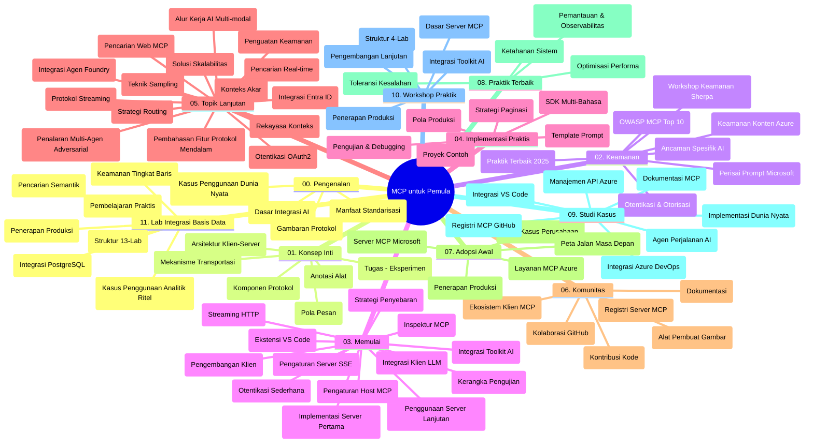

# Protokol Konteks Model (MCP) untuk Pemula - Panduan Studi

Panduan studi ini memberikan gambaran tentang struktur dan isi repositori untuk kurikulum "Protokol Konteks Model (MCP) untuk Pemula". Gunakan panduan ini untuk menavigasi repositori secara efisien dan memanfaatkan sumber daya yang tersedia.

## Ikhtisar Repositori

Protokol Konteks Model (MCP) adalah kerangka kerja standar untuk interaksi antara model AI dan aplikasi klien. Awalnya dibuat oleh Anthropic, MCP kini dikelola oleh komunitas MCP yang lebih luas melalui organisasi resmi GitHub. Repositori ini menyediakan kurikulum komprehensif dengan contoh kode langsung dalam C#, Java, JavaScript, Python, dan TypeScript, dirancang untuk pengembang AI, arsitek sistem, dan insinyur perangkat lunak.

## Peta Kurikulum Visual

## Struktur Repositori

Repositori ini disusun menjadi sebelas bagian utama, masing-masing fokus pada aspek berbeda dari MCP:

1. **Pendahuluan (00-Introduction/)**
   - Gambaran umum Protokol Konteks Model
   - Mengapa standarisasi penting dalam pipeline AI
   - Kasus penggunaan praktis dan manfaat

2. **Konsep Inti (01-CoreConcepts/)**
   - Arsitektur klien-server
   - Komponen utama protokol
   - Pola pengiriman pesan dalam MCP

3. **Keamanan (02-Security/)**
   - Ancaman keamanan dalam sistem berbasis MCP
   - Praktik terbaik untuk mengamankan implementasi
   - Strategi otentikasi dan otorisasi
   - **Dokumentasi Keamanan Komprehensif**:
     - Praktik Terbaik Keamanan MCP 2025
     - Panduan Implementasi Keamanan Konten Azure
     - Kontrol dan Teknik Keamanan MCP
     - Referensi Cepat Praktik Terbaik MCP
   - **Topik Utama Keamanan**:
     - Serangan injeksi prompt dan racun alat
     - Pembajakan sesi dan masalah deputi bingung
     - Kerentanan token passthrough
     - Izin berlebihan dan kontrol akses
     - Keamanan rantai pasok untuk komponen AI
     - Integrasi Microsoft Prompt Shields

4. **Memulai (03-GettingStarted/)**
   - Pengaturan dan konfigurasi lingkungan
   - Membuat server dan klien MCP dasar
   - Integrasi dengan aplikasi yang sudah ada
   - Termasuk bagian untuk:
     - Implementasi server pertama
     - Pengembangan klien
     - Integrasi klien LLM
     - Integrasi VS Code
     - Server Server-Sent Events (SSE)
     - Penggunaan server lanjutan
     - Streaming HTTP
     - Integrasi AI Toolkit
     - Strategi pengujian
     - Panduan penyebaran

5. **Implementasi Praktis (04-PracticalImplementation/)**
   - Menggunakan SDK di berbagai bahasa pemrograman
   - Teknik debugging, pengujian, dan validasi
   - Membuat template prompt dan alur kerja yang dapat digunakan ulang
   - Proyek contoh dengan contoh implementasi

6. **Topik Lanjutan (05-AdvancedTopics/)**
   - Teknik rekayasa konteks
   - Integrasi agen Foundry
   - Alur kerja AI multi-modal
   - Demo otentikasi OAuth2
   - Kecakapan pencarian real-time
   - Streaming real-time
   - Implementasi konteks root
   - Strategi routing
   - Teknik sampling
   - Pendekatan scaling
   - Pertimbangan keamanan
   - Integrasi keamanan Entra ID
   - Integrasi pencarian web
   - Penalaran multi-agen adversarial (pola debat)

7. **Kontribusi Komunitas (06-CommunityContributions/)**
   - Cara berkontribusi kode dan dokumentasi
   - Kolaborasi melalui GitHub
   - Peningkatan dan umpan balik yang didorong komunitas
   - Menggunakan berbagai klien MCP (Claude Desktop, Cline, VSCode)
   - Bekerja dengan server MCP populer termasuk generasi gambar

8. **Pelajaran dari Adopsi Awal (07-LessonsfromEarlyAdoption/)**
   - Implementasi nyata dan kisah sukses
   - Membangun dan menyebarkan solusi berbasis MCP
   - Tren dan peta jalan masa depan
   - **Panduan Server MCP Microsoft**: Panduan komprehensif untuk 10 server MCP Microsoft siap produksi termasuk:
     - Microsoft Learn Docs MCP Server
     - Azure MCP Server (15+ konektor khusus)
     - GitHub MCP Server
     - Azure DevOps MCP Server
     - MarkItDown MCP Server
     - SQL Server MCP Server
     - Playwright MCP Server
     - Dev Box MCP Server
     - Microsoft Foundry MCP Server
     - Microsoft 365 Agents Toolkit MCP Server

9. **Praktik Terbaik (08-BestPractices/)**
   - Penyempurnaan kinerja dan optimasi
   - Merancang sistem MCP tahan gagal
   - Strategi pengujian dan ketahanan

10. **Studi Kasus (09-CaseStudy/)**
    - **Tujuh studi kasus komprehensif** yang menunjukkan fleksibilitas MCP di berbagai skenario:
    - **Agen Perjalanan AI Azure**: Orkestrasi multi-agen dengan Azure OpenAI dan AI Search
    - **Integrasi Azure DevOps**: Otomatisasi proses alur kerja dengan pembaruan data YouTube
    - **Pengambilan Dokumentasi Real-Time**: Klien konsol Python dengan streaming HTTP
    - **Generator Rencana Studi Interaktif**: Aplikasi web Chainlit dengan AI percakapan
    - **Dokumentasi dalam Editor**: Integrasi VS Code dengan alur kerja GitHub Copilot
    - **Manajemen API Azure**: Integrasi API perusahaan dengan pembuatan server MCP
    - **Registri MCP GitHub**: Pengembangan ekosistem dan platform integrasi agen
    - Contoh implementasi yang mencakup integrasi perusahaan, produktivitas pengembang, dan pengembangan ekosistem

11. **Workshop Praktis (10-StreamliningAIWorkflowsBuildingAnMCPServerWithAIToolkit/)**
    - Workshop praktis lengkap menggabungkan MCP dengan AI Toolkit
    - Membangun aplikasi cerdas yang menghubungkan model AI dengan alat dunia nyata
    - Modul praktis mencakup dasar-dasar, pengembangan server kustom, dan strategi penyebaran produksi
    - **Struktur Lab**:
      - Lab 1: Dasar Server MCP
      - Lab 2: Pengembangan Server MCP Lanjutan
      - Lab 3: Integrasi AI Toolkit
      - Lab 4: Penyebaran Produksi dan Scaling
    - Pendekatan pembelajaran berbasis lab dengan instruksi langkah-demi-langkah

12. **Lab Integrasi Database Server MCP (11-MCPServerHandsOnLabs/)**
    - **Jalur pembelajaran 13-lab komprehensif** untuk membangun server MCP siap produksi dengan integrasi PostgreSQL
    - **Implementasi analitik ritel nyata** menggunakan studi kasus Zava Retail
    - **Pola kelas perusahaan** termasuk Keamanan Level Baris (RLS), pencarian semantik, dan akses data multi-penyewa
    - **Struktur Lab Lengkap**:
      - **Lab 00-03: Dasar** - Pendahuluan, Arsitektur, Keamanan, Pengaturan Lingkungan
      - **Lab 04-06: Membangun Server MCP** - Desain Database, Implementasi Server MCP, Pengembangan Alat
      - **Lab 07-09: Fitur Lanjutan** - Pencarian Semantik, Pengujian & Debugging, Integrasi VS Code
      - **Lab 10-12: Produksi & Praktik Terbaik** - Penyebaran, Pemantauan, Optimasi
    - **Teknologi yang Dicakup**: Kerangka kerja FastMCP, PostgreSQL, Azure OpenAI, Azure Container Apps, Application Insights
    - **Hasil Pembelajaran**: Server MCP siap produksi, pola integrasi database, analitik berbasis AI, keamanan perusahaan

## Sumber Daya Tambahan

Repositori ini menyertakan sumber daya pendukung:

- **Folder gambar**: Berisi diagram dan ilustrasi yang digunakan di seluruh kurikulum
- **Terjemahan**: Dukungan multi-bahasa dengan terjemahan otomatis dokumentasi
- **Sumber Daya MCP Resmi**:
  - [Dokumentasi MCP](https://modelcontextprotocol.io/)
  - [Spesifikasi MCP](https://spec.modelcontextprotocol.io/)
  - [Repositori MCP GitHub](https://github.com/modelcontextprotocol)

## Cara Menggunakan Repositori Ini

1. **Pembelajaran Berurutan**: Ikuti bab secara berurutan (00 hingga 11) untuk pengalaman belajar terstruktur.
2. **Fokus Bahasa Tertentu**: Jika tertarik dengan bahasa pemrograman tertentu, jelajahi direktori sampel untuk implementasi dalam bahasa pilihan Anda.
3. **Implementasi Praktis**: Mulai dengan bagian "Memulai" untuk mengatur lingkungan Anda dan membuat server serta klien MCP pertama Anda.
4. **Eksplorasi Lanjutan**: Setelah nyaman dengan dasar-dasar, pelajari topik lanjutan untuk memperluas pengetahuan.
5. **Keterlibatan Komunitas**: Bergabunglah dengan komunitas MCP melalui diskusi GitHub dan saluran Discord untuk terhubung dengan pakar dan sesama pengembang.

## Klien dan Alat MCP

Kurikulum mencakup berbagai klien dan alat MCP:

1. **Klien Resmi**:
   - Visual Studio Code
   - MCP di Visual Studio Code
   - Claude Desktop
   - Claude di VSCode
   - Claude API

2. **Klien Komunitas**:
   - Cline (berbasis terminal)
   - Cursor (editor kode)
   - ChatMCP
   - Windsurf

3. **Alat Manajemen MCP**:
   - MCP CLI
   - MCP Manager
   - MCP Linker
   - MCP Router

## Server MCP Populer

Repositori memperkenalkan berbagai server MCP, termasuk:

1. **Server MCP Microsoft Resmi**:
   - Microsoft Learn Docs MCP Server
   - Azure MCP Server (15+ konektor khusus)
   - GitHub MCP Server
   - Azure DevOps MCP Server
   - MarkItDown MCP Server
   - SQL Server MCP Server
   - Playwright MCP Server
   - Dev Box MCP Server
   - Microsoft Foundry MCP Server
   - Microsoft 365 Agents Toolkit MCP Server

2. **Server Referensi Resmi**:
   - Filesystem
   - Fetch
   - Memory
   - Sequential Thinking

3. **Generasi Gambar**:
   - Azure OpenAI DALL-E 3
   - Stable Diffusion WebUI
   - Replicate

4. **Alat Pengembangan**:
   - Git MCP
   - Terminal Control
   - Code Assistant

5. **Server Khusus**:
   - Salesforce
   - Microsoft Teams
   - Jira & Confluence

## Kontribusi

Repositori ini menyambut kontribusi dari komunitas. Lihat bagian Kontribusi Komunitas untuk panduan tentang cara berkontribusi secara efektif ke ekosistem MCP.

----

*Panduan studi ini terakhir diperbarui pada 5 Februari 2026, mencerminkan Spesifikasi MCP terbaru tanggal 25 November 2025, dan memberikan gambaran tentang repositori hingga tanggal tersebut. Isi repositori dapat diperbarui setelah tanggal ini.*

---

<!-- CO-OP TRANSLATOR DISCLAIMER START -->
**Penafian**:
Dokumen ini telah diterjemahkan menggunakan layanan terjemahan AI [Co-op Translator](https://github.com/Azure/co-op-translator). Meskipun kami berupaya untuk mencapai akurasi, harap diketahui bahwa terjemahan otomatis mungkin mengandung kesalahan atau ketidakakuratan. Dokumen asli dalam bahasa aslinya harus dianggap sebagai sumber yang sah. Untuk informasi penting, disarankan menggunakan terjemahan profesional oleh manusia. Kami tidak bertanggung jawab atas kesalahpahaman atau penafsiran yang keliru yang timbul dari penggunaan terjemahan ini.
<!-- CO-OP TRANSLATOR DISCLAIMER END -->