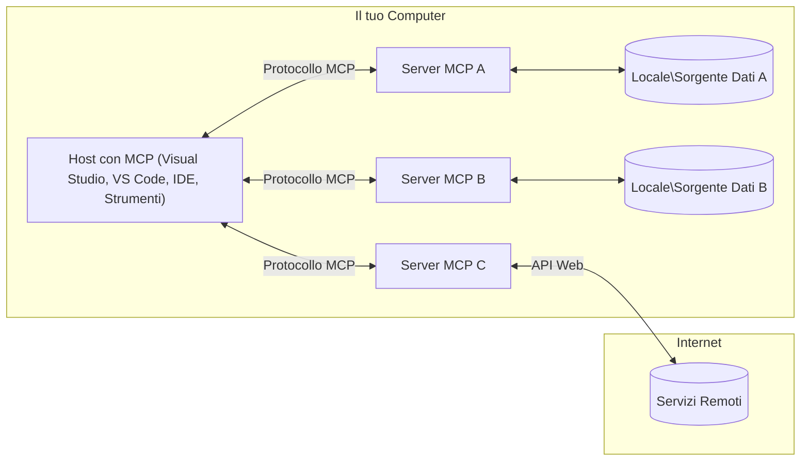

# Concetti Fondamentali di MCP: Padroneggiare il Model Context Protocol per l'Integrazione dell'IA

[](https://youtu.be/earDzWGtE84)

_(Clicca sull'immagine sopra per vedere il video di questa lezione)_

Il [Model Context Protocol (MCP)](https://github.com/modelcontextprotocol) è un potente framework standardizzato che ottimizza la comunicazione tra Large Language Models (LLM) e strumenti esterni, applicazioni e fonti di dati.  
Questa guida ti accompagnerà attraverso i concetti fondamentali di MCP. Imparerai a conoscere la sua architettura client-server, i componenti essenziali, la meccanica della comunicazione e le migliori pratiche di implementazione.

- **Consenso Esplicito dell’Utente**: Tutti gli accessi ai dati e le operazioni richiedono l'approvazione esplicita dell’utente prima dell’esecuzione. Gli utenti devono comprendere chiaramente quali dati saranno accessibili e quali azioni saranno eseguite, con un controllo granulare su permessi e autorizzazioni.

- **Protezione della Privacy dei Dati**: I dati degli utenti sono esposti solo con consenso esplicito e devono essere protetti da robusti controlli di accesso per tutta la durata dell’interazione. Le implementazioni devono prevenire trasmissioni di dati non autorizzate e mantenere rigidi confini di privacy.

- **Sicurezza nell’Esecuzione degli Strumenti**: Ogni invocazione di uno strumento richiede consenso esplicito dell’utente con una chiara comprensione della funzionalità dello strumento, dei parametri e dell’impatto potenziale. Confini di sicurezza solidi devono prevenire esecuzioni non intenzionali, pericolose o malevoli.

- **Sicurezza del Livello di Trasporto**: Tutti i canali di comunicazione dovrebbero utilizzare adeguati meccanismi di crittografia e autenticazione. Le connessioni remote devono implementare protocolli di trasporto sicuri e una corretta gestione delle credenziali.

#### Linee Guida per l’Implementazione:

- **Gestione dei Permessi**: Implementare sistemi di permessi dettagliati che consentano agli utenti di controllare quali server, strumenti e risorse sono accessibili  
- **Autenticazione & Autorizzazione**: Usare metodi di autenticazione sicuri (OAuth, chiavi API) con una corretta gestione e scadenza dei token  
- **Validazione degli Input**: Validare tutti i parametri e gli input dati secondo gli schemi definiti per prevenire attacchi di injection  
- **Audit Logging**: Mantenere log completi di tutte le operazioni per il monitoraggio della sicurezza e la conformità

## Panoramica

Questa lezione esplora l'architettura fondamentale e i componenti che costituiscono l’ecosistema del Model Context Protocol (MCP). Imparerai l’architettura client-server, i componenti chiave e i meccanismi di comunicazione che alimentano le interazioni MCP.

## Obiettivi Chiave di Apprendimento

Al termine di questa lezione, sarai in grado di:

- Comprendere l’architettura client-server di MCP.  
- Identificare ruoli e responsabilità di Host, Client e Server.  
- Analizzare le caratteristiche principali che rendono MCP un livello di integrazione flessibile.  
- Apprendere il flusso di informazioni all’interno dell’ecosistema MCP.  
- Ottenere approfondimenti pratici tramite esempi di codice in .NET, Java, Python e JavaScript.

## Architettura MCP: Uno Sguardo Approfondito

L’ecosistema MCP è costruito su un modello client-server. Questa struttura modulare consente alle applicazioni AI di interagire efficientemente con strumenti, database, API e risorse contestuali. Suddividiamo questa architettura nei suoi componenti fondamentali.

Alla base, MCP segue un’architettura client-server in cui un’applicazione host può connettersi a più server:


- **Host MCP**: Programmi come VSCode, Claude Desktop, IDE o strumenti AI che vogliono accedere ai dati tramite MCP  
- **Client MCP**: Client di protocollo che mantengono connessioni 1:1 con i server  
- **Server MCP**: Programmi leggeri che espongono specifiche capacità tramite il Model Context Protocol standardizzato  
- **Fonti Dati Locali**: File, database e servizi del computer che i server MCP possono accedere in modo sicuro  
- **Servizi Remoti**: Sistemi esterni disponibili tramite internet cui i server MCP possono connettersi tramite API.

Il Protocollo MCP è uno standard in evoluzione con versionamento basato sulla data (formato YYYY-MM-DD). La versione attuale del protocollo è **2025-11-25**. Puoi vedere gli ultimi aggiornamenti alla [specifica del protocollo](https://modelcontextprotocol.io/specification/2025-11-25/)

### 1. Host

Nel Model Context Protocol (MCP), gli **Host** sono applicazioni AI che fungono da interfaccia primaria attraverso cui gli utenti interagiscono con il protocollo. Gli host coordinano e gestiscono le connessioni a più server MCP creando client MCP dedicati per ogni connessione server. Esempi di Host includono:

- **Applicazioni AI**: Claude Desktop, Visual Studio Code, Claude Code  
- **Ambienti di Sviluppo**: IDE e editor di codice con integrazione MCP  
- **Applicazioni Personalizzate**: Agenti AI appositamente costruiti e strumenti specifici

Gli **Host** sono applicazioni che coordinano le interazioni con i modelli AI. Loro:

- **Orchestrano i Modelli AI**: Eseguono o interagiscono con LLM per generare risposte e coordinare i flussi di lavoro AI  
- **Gestiscono le Connessioni Client**: Creano e mantengono un client MCP per ogni connessione MCP server  
- **Controllano l’Interfaccia Utente**: Gestiscono il flusso di conversazione, le interazioni utente e la presentazione delle risposte  
- **Implementano la Sicurezza**: Controllano permessi, vincoli di sicurezza e autenticazione  
- **Gestiscono il Consenso Utente**: Amministrano l’approvazione utente per la condivisione dati e l’esecuzione degli strumenti

### 2. Client

I **Client** sono componenti essenziali che mantengono connessioni dedicate uno-a-uno tra Host e server MCP. Ogni client MCP è istanziato dall’Host per connettersi a uno specifico server MCP, assicurando canali di comunicazione organizzati e sicuri. Molteplici client consentono agli host di connettersi contemporaneamente a più server.

I **Client** sono componenti connettori all’interno dell’applicazione host. Loro:

- **Comunicano con il Protocollo**: Invia richieste JSON-RPC 2.0 ai server con prompt e istruzioni  
- **Negoziano le Capacità**: Negoziano feature supportate e versioni del protocollo con i server durante l’inizializzazione  
- **Esecuzione degli Strumenti**: Gestiscono le richieste di esecuzione strumenti da modelli e processano le risposte  
- **Aggiornamenti in Tempo Reale**: Gestiscono notifiche e aggiornamenti in tempo reale dai server  
- **Elaborazione Risposte**: Elaborano e formattano le risposte del server per la visualizzazione agli utenti

### 3. Server

I **Server** sono programmi che forniscono contesto, strumenti e funzionalità ai client MCP. Possono essere eseguiti localmente (nello stesso computer dell’Host) o remotamente (su piattaforme esterne), e sono responsabili di gestire le richieste dei client e fornire risposte strutturate. I server espongono specifiche funzionalità tramite il Model Context Protocol standardizzato.

I **Server** sono servizi che offrono contesto e capacità. Loro:

- **Registrano le Funzionalità**: Registrano ed espongono primitive disponibili (risorse, prompt, strumenti) ai client  
- **Processano le Richieste**: Ricevono ed eseguono chiamate a strumenti, richieste di risorse e prompt dai client  
- **Forniscono Contesto**: Forniscono informazioni contestuali e dati per arricchire le risposte del modello  
- **Gestiscono lo Stato**: Mantengono lo stato della sessione e gestiscono interazioni stateful se necessario  
- **Inviano Notifiche in Tempo Reale**: Spediscono notifiche su cambiamenti di capacità e aggiornamenti ai client connessi

I server possono essere sviluppati da chiunque per estendere le capacità del modello con funzionalità specializzate, e supportano scenari di distribuzione sia locale che remota.

### 4. Primitive Server

I server nel Model Context Protocol (MCP) forniscono tre primitive fondamentali che definiscono i blocchi edilizi per interazioni avanzate tra client, host e modelli linguistici. Queste primitive specificano i tipi di informazioni contestuali e azioni disponibili tramite il protocollo.

I server MCP possono esporre qualsiasi combinazione delle seguenti tre primitive fondamentali:

#### Risorse

Le **Risorse** sono fonti di dati che forniscono informazioni contestuali alle applicazioni AI. Rappresentano contenuti statici o dinamici che possono migliorare la comprensione e il processo decisionale del modello:

- **Dati Contestuali**: Informazioni strutturate e contesto per il consumo da parte del modello AI  
- **Basi di Conoscenza**: Reperti documentali, articoli, manuali e pubblicazioni scientifiche  
- **Fonti Dati Locali**: File, database e informazioni di sistema locali  
- **Dati Esterni**: Risposte API, servizi web e dati di sistemi remoti  
- **Contenuti Dinamici**: Dati in tempo reale che si aggiornano in base a condizioni esterne  

Le risorse sono identificate da URI e supportano la scoperta tramite i metodi `resources/list` e il recupero tramite `resources/read`:

```text
file://documents/project-spec.md
database://production/users/schema
api://weather/current
```

#### Prompt

I **Prompt** sono modelli riutilizzabili che aiutano a strutturare le interazioni con i modelli linguistici. Forniscono schemi di interazione standardizzati e flussi di lavoro predefiniti:

- **Interazioni Basate su Modelli**: Messaggi pre-strutturati e spunti di conversazione  
- **Template di Flusso di Lavoro**: Sequenze standardizzate per compiti e interazioni comuni  
- **Esempi Few-shot**: Template basati su esempi per l’istruzione del modello  
- **Prompt di Sistema**: Prompt fondamentali che definiscono comportamento e contesto del modello  
- **Template Dinamici**: Prompt parametrizzati che si adattano a contesti specifici

I prompt supportano la sostituzione di variabili e possono essere scoperti tramite `prompts/list` e recuperati con `prompts/get`:

```markdown
Generate a {{task_type}} for {{product}} targeting {{audience}} with the following requirements: {{requirements}}
```

#### Strumenti

Gli **Strumenti** sono funzioni eseguibili che i modelli AI possono invocare per compiere azioni specifiche. Rappresentano i “verbi” dell’ecosistema MCP, permettendo ai modelli di interagire con sistemi esterni:

- **Funzioni Eseguibili**: Operazioni discrete che i modelli possono richiamare con parametri specifici  
- **Integrazione Sistemi Esterni**: Chiamate API, query a database, operazioni su file, calcoli  
- **Identità Unica**: Ogni strumento ha un nome distinto, descrizione e schema di parametri  
- **I/O Strutturato**: Gli strumenti accettano parametri validati e restituiscono risposte strutturate e tipizzate  
- **Capacità di Azione**: Permettono ai modelli di compiere azioni reali e recuperare dati live

Gli strumenti sono definiti con JSON Schema per la validazione dei parametri, scoperti tramite `tools/list` ed eseguiti con `tools/call`. Possono includere anche **icone** come metadati addizionali per una migliore presentazione UI.

**Annotazioni degli Strumenti**: Gli strumenti supportano annotazioni comportamentali (es. `readOnlyHint`, `destructiveHint`) che descrivono se uno strumento è di sola lettura o distruttivo, aiutando i client a prendere decisioni informate sull’esecuzione.

Esempio di definizione di uno strumento:

```typescript
server.tool(
  "search_products", 
  {
    query: z.string().describe("Search query for products"),
    category: z.string().optional().describe("Product category filter"),
    max_results: z.number().default(10).describe("Maximum results to return")
  }, 
  async (params) => {
    // Esegui la ricerca e restituisci risultati strutturati
    return await productService.search(params);
  }
);
```

## Primitive Client

Nel Model Context Protocol (MCP), i **client** possono esporre primitive che consentono ai server di richiedere capacità aggiuntive dall’applicazione host. Queste primitive lato client permettono implementazioni server più ricche e interattive in grado di accedere a capacità di modelli AI e interazioni utente.

### Sampling

Il **Sampling** permette ai server di richiedere completamenti del modello linguistico dall’app AI del client. Questa primitiva consente ai server di utilizzare le capacità LLM senza incorporare le proprie dipendenze di modello:

- **Accesso Indipendente dal Modello**: I server possono richiedere completamenti senza includere SDK LLM o gestire direttamente l’accesso al modello  
- **IA Iniziata dal Server**: Permette ai server di generare autonomamente contenuti usando il modello AI del client  
- **Interazioni LLM Ricorsive**: Supporta scenari complessi dove i server necessitano di assistenza AI per l’elaborazione  
- **Generazione Dinamica di Contenuti**: Consente ai server di creare risposte contestuali usando il modello dell’host  
- **Supporto per Chiamata Strumenti**: I server possono includere parametri `tools` e `toolChoice` per permettere al modello client di invocare strumenti durante il sampling

Il sampling viene avviato tramite il metodo `sampling/complete`, dove i server inviano richieste di completamento ai client.

### Roots

Le **Roots** forniscono un modo standardizzato per i client di esporre i limiti del filesystem ai server, aiutando i server a capire quali directory e file possono accedere:

- **Confini del Filesystem**: Definiscono i limiti entro cui i server possono operare nel filesystem  
- **Controllo degli Accessi**: Aiutano i server a comprendere a quali directory e file hanno permessi di accesso  
- **Aggiornamenti Dinamici**: I client possono notificare ai server quando la lista delle roots cambia  
- **Identificazione Basata su URI**: Le roots usano URI `file://` per identificare directory e file accessibili

Le roots sono scoperte tramite il metodo `roots/list`, con i client che inviano notifiche `notifications/roots/list_changed` in caso di modifiche.

### Elicitation

L’**Elicitation** consente ai server di richiedere informazioni aggiuntive o conferme dagli utenti tramite l’interfaccia client:

- **Richiesta di Input Utente**: I server possono chiedere informazioni aggiuntive se necessarie all’esecuzione di uno strumento  
- **Dialoghi di Conferma**: Richiedono l’approvazione dell’utente per operazioni sensibili o impattanti  
- **Flussi di Lavoro Interattivi**: Permettono ai server di creare interazioni utente passo-passo  
- **Raccolta Dinamica di Parametri**: Ottenere parametri mancanti o opzionali durante l’esecuzione dello strumento

Le richieste di elicitation sono effettuate tramite il metodo `elicitation/request` per raccogliere input utente attraverso l’interfaccia client.

**Elicitation in Modalità URL**: I server possono anche richiedere interazioni utente basate su URL, permettendo di indirizzare l’utente a pagine web esterne per autenticazione, conferma o inserimento dati.

### Logging

Il **Logging** permette ai server di inviare messaggi di log strutturati ai client per debugging, monitoraggio e visibilità operativa:

- **Supporto al Debugging**: Consente ai server di fornire log di esecuzione dettagliati per il troubleshooting  
- **Monitoraggio Operativo**: Invia aggiornamenti di stato e metriche di performance ai client  
- **Segnalazione Errori**: Fornisce dettagli contestuali sugli errori e informazioni diagnostiche  
- **Tracce di Audit**: Crea log completi delle operazioni e decisioni del server

I messaggi di logging sono inviati ai client per fornire trasparenza sulle operazioni server e facilitare il debugging.

## Flusso Informativo in MCP

Il Model Context Protocol (MCP) definisce un flusso strutturato di informazioni tra host, client, server e modelli. Comprendere questo flusso aiuta a chiarire come vengono processate le richieste utente e come strumenti e dati esterni sono integrati nelle risposte del modello.
- **Host avvia la connessione**  
  L'applicazione host (come un IDE o un’interfaccia di chat) stabilisce una connessione a un server MCP, tipicamente tramite STDIO, WebSocket o un altro trasporto supportato.

- **Negoziazione delle capacità**  
  Il client (incorporato nell’host) e il server scambiano informazioni sulle funzionalità, gli strumenti, le risorse e le versioni del protocollo supportati. Questo assicura che entrambe le parti comprendano quali capacità sono disponibili per la sessione.

- **Richiesta utente**  
  L’utente interagisce con l’host (ad esempio, inserisce un prompt o un comando). L’host raccoglie questo input e lo passa al client per l’elaborazione.

- **Uso di risorse o strumenti**  
  - Il client può richiedere ulteriori contesti o risorse dal server (come file, voci di database o articoli della knowledge base) per arricchire la comprensione del modello.  
  - Se il modello determina che è necessario uno strumento (ad esempio, per recuperare dati, eseguire un calcolo o chiamare un’API), il client invia una richiesta di invocazione dello strumento al server, specificando il nome dello strumento e i parametri.

- **Esecuzione del server**  
  Il server riceve la richiesta di risorsa o strumento, esegue le operazioni necessarie (ad esempio, eseguire una funzione, interrogare un database o recuperare un file) e restituisce i risultati al client in un formato strutturato.

- **Generazione della risposta**  
  Il client integra le risposte del server (dati delle risorse, output degli strumenti, ecc.) nell’interazione corrente con il modello. Il modello utilizza queste informazioni per generare una risposta completa e contestuale.

- **Presentazione del risultato**  
  L’host riceve l’output finale dal client e lo presenta all’utente, spesso includendo sia il testo generato dal modello sia eventuali risultati derivanti dall’esecuzione di strumenti o dal recupero di risorse.

Questo flusso consente a MCP di supportare applicazioni AI avanzate, interattive e consapevoli del contesto collegando senza soluzione di continuità modelli con strumenti esterni e fonti di dati.

## Architettura e Livelli del Protocollo

MCP è costituito da due distinti livelli architetturali che lavorano insieme per fornire un framework di comunicazione completo:

### Livello Dati

Il **Livello Dati** implementa il protocollo MCP di base utilizzando come fondamento il **JSON-RPC 2.0**. Questo livello definisce la struttura dei messaggi, la semantica e i modelli di interazione:

#### Componenti Chiave:

- **Protocollo JSON-RPC 2.0**: tutta la comunicazione utilizza il formato standardizzato dei messaggi JSON-RPC 2.0 per chiamate di metodo, risposte e notifiche  
- **Gestione del ciclo di vita**: gestisce l’inizializzazione della connessione, la negoziazione delle capacità e la terminazione della sessione tra client e server  
- **Primitive server**: consente ai server di fornire funzionalità principali tramite strumenti, risorse e prompt  
- **Primitive client**: consente ai server di richiedere campionamenti da LLM, acquisire input utente e inviare messaggi di log  
- **Notifiche in tempo reale**: supporta notifiche asincrone per aggiornamenti dinamici senza polling

#### Caratteristiche principali:

- **Negoziazione della versione del protocollo**: utilizza versioni basate su date (YYYY-MM-DD) per assicurare compatibilità  
- **Scoperta delle capacità**: client e server scambiano informazioni sulle funzionalità supportate durante l’inizializzazione  
- **Sessioni con stato**: mantiene lo stato della connessione attraverso più interazioni per continuità del contesto

### Livello Trasporto

Il **Livello Trasporto** gestisce i canali di comunicazione, l’incapsulamento dei messaggi e l’autenticazione tra i partecipanti MCP:

#### Meccanismi di trasporto supportati:

1. **Trasporto STDIO**:
   - Usa flussi di input/output standard per la comunicazione diretta tra processi  
   - Ottimale per processi locali sulla stessa macchina senza overhead di rete  
   - Comunemente usato per implementazioni locali di server MCP

2. **Trasporto HTTP Streaming**:
   - Usa HTTP POST per messaggi da client a server  
   - Eventi inviati dal server (Server-Sent Events, SSE) opzionali per streaming da server a client  
   - Abilita comunicazione con server remoti attraverso la rete  
   - Supporta autenticazione HTTP standard (token bearer, API key, header personalizzati)  
   - MCP raccomanda OAuth per un’autenticazione sicura basata su token

#### Astrazione del trasporto:

Il livello trasporto astrae i dettagli della comunicazione dal livello dati, permettendo di utilizzare lo stesso formato messaggi JSON-RPC 2.0 su tutti i meccanismi di trasporto. Questa astrazione consente alle applicazioni di passare agevolmente tra server locali e remoti.

### Considerazioni sulla sicurezza

Le implementazioni MCP devono rispettare diversi principi critici di sicurezza per garantire interazioni sicure, affidabili e protette in tutte le operazioni del protocollo:

- **Consenso e Controllo dell’Utente**: gli utenti devono fornire consenso esplicito prima che qualsiasi dato venga accesso o che vengano eseguite operazioni. Devono avere un controllo chiaro su quali dati vengono condivisi e quali azioni sono autorizzate, supportato da interfacce intuitive per la revisione e l’approvazione delle attività.

- **Privacy dei dati**: i dati degli utenti devono essere esposti solo con consenso esplicito e devono essere protetti da controlli di accesso appropriati. Le implementazioni MCP devono salvaguardare da trasmissioni non autorizzate e assicurare che la privacy sia mantenuta in tutte le interazioni.

- **Sicurezza degli strumenti**: prima di invocare uno strumento è richiesto consenso esplicito dell’utente. Gli utenti devono comprendere chiaramente la funzionalità di ogni strumento e devono essere applicati confini di sicurezza robusti per evitare esecuzioni accidentali o pericolose.

Seguendo questi principi di sicurezza, MCP garantisce fiducia, privacy e sicurezza per gli utenti in tutte le interazioni del protocollo, pur abilitando potenti integrazioni AI.

## Esempi di Codice: Componenti Chiave

Di seguito alcuni esempi di codice in diverse lingue popolari che illustrano come implementare componenti chiave del server MCP e strumenti.

### Esempio .NET: Creare un semplice server MCP con strumenti

Ecco un esempio pratico di codice .NET che dimostra come implementare un semplice server MCP con strumenti personalizzati. L’esempio mostra come definire e registrare strumenti, gestire richieste e connettere il server usando il Model Context Protocol.

```csharp
using System;
using System.Threading.Tasks;
using ModelContextProtocol.Server;
using ModelContextProtocol.Server.Transport;
using ModelContextProtocol.Server.Tools;

public class WeatherServer
{
    public static async Task Main(string[] args)
    {
        // Create an MCP server
        var server = new McpServer(
            name: "Weather MCP Server",
            version: "1.0.0"
        );
        
        // Register our custom weather tool
        server.AddTool<string, WeatherData>("weatherTool", 
            description: "Gets current weather for a location",
            execute: async (location) => {
                // Call weather API (simplified)
                var weatherData = await GetWeatherDataAsync(location);
                return weatherData;
            });
        
        // Connect the server using stdio transport
        var transport = new StdioServerTransport();
        await server.ConnectAsync(transport);
        
        Console.WriteLine("Weather MCP Server started");
        
        // Keep the server running until process is terminated
        await Task.Delay(-1);
    }
    
    private static async Task<WeatherData> GetWeatherDataAsync(string location)
    {
        // This would normally call a weather API
        // Simplified for demonstration
        await Task.Delay(100); // Simulate API call
        return new WeatherData { 
            Temperature = 72.5,
            Conditions = "Sunny",
            Location = location
        };
    }
}

public class WeatherData
{
    public double Temperature { get; set; }
    public string Conditions { get; set; }
    public string Location { get; set; }
}
```

### Esempio Java: Componenti server MCP

Questo esempio dimostra lo stesso server MCP e la registrazione degli strumenti come nell’esempio .NET sopra, ma implementato in Java.

```java
import io.modelcontextprotocol.server.McpServer;
import io.modelcontextprotocol.server.McpToolDefinition;
import io.modelcontextprotocol.server.transport.StdioServerTransport;
import io.modelcontextprotocol.server.tool.ToolExecutionContext;
import io.modelcontextprotocol.server.tool.ToolResponse;

public class WeatherMcpServer {
    public static void main(String[] args) throws Exception {
        // Crea un server MCP
        McpServer server = McpServer.builder()
            .name("Weather MCP Server")
            .version("1.0.0")
            .build();
            
        // Registra uno strumento meteo
        server.registerTool(McpToolDefinition.builder("weatherTool")
            .description("Gets current weather for a location")
            .parameter("location", String.class)
            .execute((ToolExecutionContext ctx) -> {
                String location = ctx.getParameter("location", String.class);
                
                // Ottieni i dati meteorologici (semplificato)
                WeatherData data = getWeatherData(location);
                
                // Restituisci la risposta formattata
                return ToolResponse.content(
                    String.format("Temperature: %.1f°F, Conditions: %s, Location: %s", 
                    data.getTemperature(), 
                    data.getConditions(), 
                    data.getLocation())
                );
            })
            .build());
        
        // Connetti il server usando il trasporto stdio
        try (StdioServerTransport transport = new StdioServerTransport()) {
            server.connect(transport);
            System.out.println("Weather MCP Server started");
            // Mantieni il server attivo finché il processo non viene terminato
            Thread.currentThread().join();
        }
    }
    
    private static WeatherData getWeatherData(String location) {
        // L'implementazione chiamerebbe un'API meteo
        // Semplificato per scopi esemplificativi
        return new WeatherData(72.5, "Sunny", location);
    }
}

class WeatherData {
    private double temperature;
    private String conditions;
    private String location;
    
    public WeatherData(double temperature, String conditions, String location) {
        this.temperature = temperature;
        this.conditions = conditions;
        this.location = location;
    }
    
    public double getTemperature() {
        return temperature;
    }
    
    public String getConditions() {
        return conditions;
    }
    
    public String getLocation() {
        return location;
    }
}
```

### Esempio Python: Costruire un server MCP

Questo esempio usa fastmcp, quindi assicurati di installarlo prima:

```python
pip install fastmcp
```
Codice di esempio:

```python
#!/usr/bin/env python3
import asyncio
from fastmcp import FastMCP
from fastmcp.transports.stdio import serve_stdio

# Crea un server FastMCP
mcp = FastMCP(
    name="Weather MCP Server",
    version="1.0.0"
)

@mcp.tool()
def get_weather(location: str) -> dict:
    """Gets current weather for a location."""
    return {
        "temperature": 72.5,
        "conditions": "Sunny",
        "location": location
    }

# Approccio alternativo usando una classe
class WeatherTools:
    @mcp.tool()
    def forecast(self, location: str, days: int = 1) -> dict:
        """Gets weather forecast for a location for the specified number of days."""
        return {
            "location": location,
            "forecast": [
                {"day": i+1, "temperature": 70 + i, "conditions": "Partly Cloudy"}
                for i in range(days)
            ]
        }

# Registra gli strumenti della classe
weather_tools = WeatherTools()

# Avvia il server
if __name__ == "__main__":
    asyncio.run(serve_stdio(mcp))
```

### Esempio JavaScript: Creare un server MCP

Questo esempio mostra la creazione di un server MCP in JavaScript e come registrare due strumenti relativi al meteo.

```javascript
// Usando l'SDK ufficiale del Model Context Protocol
import { McpServer } from "@modelcontextprotocol/sdk/server/mcp.js";
import { StdioServerTransport } from "@modelcontextprotocol/sdk/server/stdio.js";
import { z } from "zod"; // Per la convalida dei parametri

// Creare un server MCP
const server = new McpServer({
  name: "Weather MCP Server",
  version: "1.0.0"
});

// Definire uno strumento meteo
server.tool(
  "weatherTool",
  {
    location: z.string().describe("The location to get weather for")
  },
  async ({ location }) => {
    // Normalmente questo chiamerebbe un'API meteo
    // Semplificato per la dimostrazione
    const weatherData = await getWeatherData(location);
    
    return {
      content: [
        { 
          type: "text", 
          text: `Temperature: ${weatherData.temperature}°F, Conditions: ${weatherData.conditions}, Location: ${weatherData.location}` 
        }
      ]
    };
  }
);

// Definire uno strumento di previsione
server.tool(
  "forecastTool",
  {
    location: z.string(),
    days: z.number().default(3).describe("Number of days for forecast")
  },
  async ({ location, days }) => {
    // Normalmente questo chiamerebbe un'API meteo
    // Semplificato per la dimostrazione
    const forecast = await getForecastData(location, days);
    
    return {
      content: [
        { 
          type: "text", 
          text: `${days}-day forecast for ${location}: ${JSON.stringify(forecast)}` 
        }
      ]
    };
  }
);

// Funzioni di supporto
async function getWeatherData(location) {
  // Simulare la chiamata all'API
  return {
    temperature: 72.5,
    conditions: "Sunny",
    location: location
  };
}

async function getForecastData(location, days) {
  // Simulare la chiamata all'API
  return Array.from({ length: days }, (_, i) => ({
    day: i + 1,
    temperature: 70 + Math.floor(Math.random() * 10),
    conditions: i % 2 === 0 ? "Sunny" : "Partly Cloudy"
  }));
}

// Collegare il server usando il trasporto stdio
const transport = new StdioServerTransport();
server.connect(transport).catch(console.error);

console.log("Weather MCP Server started");
```
  
Questo esempio JavaScript dimostra come creare un server MCP che registra strumenti per il meteo e si connette usando il trasporto stdio per gestire le richieste client in arrivo.

## Sicurezza e Autorizzazione

MCP include diversi concetti e meccanismi integrati per gestire sicurezza e autorizzazione attraverso tutto il protocollo:

1. **Controllo delle autorizzazioni sugli strumenti**  
  I client possono specificare quali strumenti un modello è autorizzato a usare durante una sessione. Questo assicura che siano accessibili solo strumenti esplicitamente autorizzati, riducendo il rischio di operazioni accidentali o pericolose. Le autorizzazioni possono essere configurate dinamicamente in base alle preferenze dell’utente, alle politiche organizzative o al contesto dell’interazione.

2. **Autenticazione**  
  I server possono richiedere autenticazione prima di concedere accesso a strumenti, risorse o operazioni sensibili. Ciò può coinvolgere API key, token OAuth o altri schemi di autenticazione. Una corretta autenticazione garantisce che solo client e utenti di fiducia possano invocare capacità lato server.

3. **Validazione**  
  La validazione dei parametri è applicata per tutte le invocazioni di strumenti. Ogni strumento definisce i tipi, formati e vincoli attesi per i suoi parametri, e il server valida di conseguenza le richieste in ingresso. Questo previene input malformati o malevoli che possano raggiungere le implementazioni degli strumenti e aiuta a mantenere l’integrità delle operazioni.

4. **Limitazione di velocità (Rate Limiting)**  
  Per prevenire abusi e garantire un uso equo delle risorse server, i server MCP possono implementare limitazioni di velocità per chiamate agli strumenti e accesso alle risorse. I limiti possono essere applicati per utente, per sessione o globalmente, aiutando a proteggere da attacchi denial-of-service o consumi eccessivi.

Combinando questi meccanismi, MCP fornisce una base sicura per integrare modelli linguistici con strumenti e fonti di dati esterni, garantendo agli utenti e agli sviluppatori un controllo granulare sull’accesso e l’uso.

## Messaggi del Protocollo e Flusso di Comunicazione

La comunicazione MCP utilizza messaggi strutturati **JSON-RPC 2.0** per facilitare interazioni chiare e affidabili tra host, client e server. Il protocollo definisce schemi di messaggi specifici per diversi tipi di operazioni:

### Tipi di messaggi fondamentali:

#### **Messaggi di inizializzazione**
- Richiesta `initialize`: stabilisce la connessione e negozia versione del protocollo e capacità  
- Risposta `initialize`: conferma le funzionalità supportate e le informazioni del server  
- `notifications/initialized`: segnala che l’inizializzazione è completa e la sessione è pronta

#### **Messaggi di scoperta**
- Richiesta `tools/list`: scopre gli strumenti disponibili dal server  
- Richiesta `resources/list`: elenca le risorse disponibili (fonti dati)  
- Richiesta `prompts/list`: recupera i template di prompt disponibili

#### **Messaggi di esecuzione**  
- Richiesta `tools/call`: esegue uno strumento specifico con i parametri forniti  
- Richiesta `resources/read`: recupera il contenuto da una risorsa specifica  
- Richiesta `prompts/get`: preleva un template di prompt con parametri opzionali

#### **Messaggi lato client**
- Richiesta `sampling/complete`: il server richiede il completamento LLM dal client  
- `elicitation/request`: il server richiede un input utente attraverso l’interfaccia client  
- Messaggi di log: server invia messaggi di log strutturati al client

#### **Messaggi di notifica**
- `notifications/tools/list_changed`: il server notifica il client di modifiche agli strumenti  
- `notifications/resources/list_changed`: il server notifica il client di modifiche alle risorse  
- `notifications/prompts/list_changed`: il server notifica il client di modifiche ai prompt

### Struttura dei Messaggi:

Tutti i messaggi MCP seguono il formato JSON-RPC 2.0 con:  
- Messaggi di richiesta: includono `id`, `method` e parametri opzionali `params`  
- Messaggi di risposta: includono `id` e uno tra `result` o `error`  
- Messaggi di notifica: includono `method` e parametri opzionali `params` (senza `id` e senza risposta prevista)

Questa comunicazione strutturata assicura interazioni affidabili, tracciabili ed estendibili, supportando scenari avanzati come aggiornamenti in tempo reale, concatenamento di strumenti e robusta gestione degli errori.

### Task (Sperimentale)

Le **Task** sono una funzionalità sperimentale che fornisce wrapper di esecuzione durevoli per consentire recupero differito dei risultati e monitoraggio dello stato delle richieste MCP:

- Operazioni di lunga durata: monitoraggio di calcoli costosi, automazione di workflow e elaborazioni batch  
- Risultati differiti: polling per lo stato della task e recupero dei risultati al completamento  
- Monitoraggio dello stato: controllo del progresso delle task attraverso stati di ciclo di vita definiti  
- Operazioni multi-step: supporto a workflow complessi che spaziano su più interazioni

Le task incapsulano richieste MCP standard per abilitare schemi di esecuzione asincrona per operazioni che non possono completarsi immediatamente.

## Punti Chiave

- **Architettura**: MCP utilizza un’architettura client-server dove gli host gestiscono molteplici connessioni client verso i server  
- **Partecipanti**: l’ecosistema include host (applicazioni AI), client (connettori protocollo) e server (fornitori di capacità)  
- **Meccanismi di trasporto**: la comunicazione supporta STDIO (locale) e HTTP streaming con SSE opzionale (remoto)  
- **Primitive core**: i server espongono strumenti (funzioni eseguibili), risorse (fonti dati) e prompt (template)  
- **Primitive client**: i server possono richiedere campionamento (completamenti LLM con supporto chiamata strumenti), elicitation (input utente inclusa modalità URL), roots (limiti filesystem) e logging dai client  
- **Funzionalità sperimentali**: le task forniscono wrapper di esecuzione durevoli per operazioni di lunga durata  
- **Fondamento protocollo**: basato su JSON-RPC 2.0 con versionamento basato su data (attuale: 2025-11-25)  
- **Capacità in tempo reale**: supporta notifiche per aggiornamenti dinamici e sincronizzazione in tempo reale  
- **Sicurezza al primo posto**: consenso esplicito utente, protezione della privacy dei dati e trasporto sicuro sono requisiti fondamentali  

## Esercizio

Progetta un semplice strumento MCP che sarebbe utile nel tuo dominio. Definisci:  
1. Il nome dello strumento  
2. I parametri che accetterebbe  
3. L’output che restituirebbe  
4. Come un modello potrebbe utilizzare questo strumento per risolvere problemi utente  

---

## Prossimi passi

Successivo: [Capitolo 2: Sicurezza](../02-Security/README.md)

---

<!-- CO-OP TRANSLATOR DISCLAIMER START -->
**Disclaimer**:  
Questo documento è stato tradotto utilizzando il servizio di traduzione automatica [Co-op Translator](https://github.com/Azure/co-op-translator). Pur impegnandoci per garantire l’accuratezza, si prega di notare che le traduzioni automatiche possono contenere errori o imprecisioni. Il documento originale nella lingua nativa deve essere considerato la fonte autorevole. Per informazioni critiche si consiglia una traduzione professionale effettuata da un esperto umano. Non ci assumiamo alcuna responsabilità per eventuali malintesi o interpretazioni errate derivanti dall’uso di questa traduzione.
<!-- CO-OP TRANSLATOR DISCLAIMER END -->