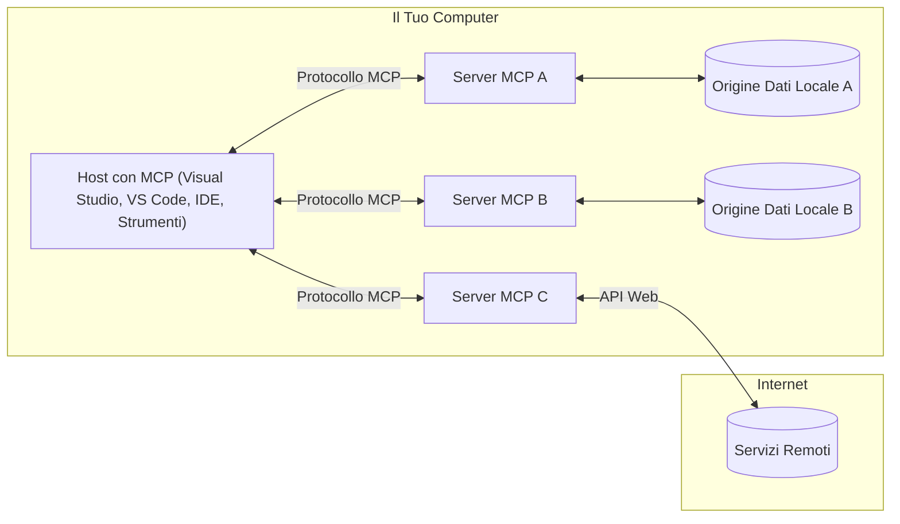

# Concetti Fondamentali MCP: Padroneggiare il Model Context Protocol per l'Integrazione AI

[](https://youtu.be/earDzWGtE84)

_(Clicca sull'immagine sopra per vedere il video di questa lezione)_

Il [Model Context Protocol (MCP)](https://github.com/modelcontextprotocol) è un potente framework standardizzato che ottimizza la comunicazione tra Large Language Models (LLM) e strumenti esterni, applicazioni e fonti di dati.  
Questa guida ti accompagnerà attraverso i concetti fondamentali dell'MCP. Imparerai la sua architettura client-server, i componenti essenziali, i meccanismi di comunicazione e le migliori pratiche di implementazione.

- **Consenso Esplicito dell'Utente**: Tutto l'accesso ai dati e le operazioni richiedono l'approvazione esplicita dell'utente prima dell'esecuzione. Gli utenti devono comprendere chiaramente quali dati saranno accessibili e quali azioni verranno eseguite, con un controllo granulare su permessi e autorizzazioni.

- **Protezione della Privacy dei Dati**: I dati degli utenti sono esposti solo con consenso esplicito e devono essere protetti da robusti controlli di accesso per tutta la durata dell'interazione. Le implementazioni devono prevenire trasmissioni non autorizzate di dati e mantenere rigide barriere di privacy.

- **Sicurezza nell'Esecuzione degli Strumenti**: Ogni invocazione di strumenti richiede consenso esplicito dell'utente con chiara comprensione della funzionalità dello strumento, dei parametri e dell'impatto potenziale. Devono esserci barriere di sicurezza robuste per prevenire esecuzioni non intenzionali, pericolose o dannose.

- **Sicurezza del Livello di Trasporto**: Tutti i canali di comunicazione devono utilizzare meccanismi appropriati di crittografia e autenticazione. Le connessioni remote devono implementare protocolli di trasporto sicuri e una corretta gestione delle credenziali.

#### Linee Guida di Implementazione:

- **Gestione dei Permessi**: Implementa sistemi di permesso granulare che consentano agli utenti di controllare quali server, strumenti e risorse sono accessibili  
- **Autenticazione e Autorizzazione**: Usa metodi sicuri di autenticazione (OAuth, chiavi API) con gestione adeguata dei token e scadenza  
- **Validazione degli Input**: Valida tutti i parametri e input dati secondo gli schemi definiti per prevenire attacchi di injection  
- **Audit Logging**: Mantieni registri completi di tutte le operazioni per monitoraggio della sicurezza e conformità  

## Panoramica

Questa lezione esplora l'architettura fondamentale e i componenti che costituiscono l'ecosistema del Model Context Protocol (MCP). Imparerai l'architettura client-server, i componenti chiave e i meccanismi di comunicazione che alimentano le interazioni MCP.

## Obiettivi Chiave di Apprendimento

Al termine di questa lezione, sarai in grado di:

- Comprendere l'architettura client-server dell'MCP.  
- Identificare i ruoli e le responsabilità di Host, Client e Server.  
- Analizzare le caratteristiche principali che rendono MCP un livello di integrazione flessibile.  
- Imparare come fluisce l'informazione all'interno dell'ecosistema MCP.  
- Ottenere intuizioni pratiche attraverso esempi di codice in .NET, Java, Python e JavaScript.  

## Architettura MCP: Uno Sguardo Approfondito

L'ecosistema MCP si basa su un modello client-server. Questa struttura modulare consente alle applicazioni AI di interagire in modo efficiente con strumenti, database, API e risorse contestuali. Suddividiamo questa architettura nei suoi componenti fondamentali.

Alla base, MCP segue un'architettura client-server in cui un'applicazione host può connettersi a più server:


- **Host MCP**: Programmi come VSCode, Claude Desktop, IDE o strumenti AI che vogliono accedere ai dati tramite MCP  
- **Client MCP**: Client del protocollo che mantengono connessioni 1:1 con i server  
- **Server MCP**: Programmi leggeri che espongono singole capacità tramite il Model Context Protocol standardizzato  
- **Fonti di Dati Locali**: File, database e servizi del tuo computer cui i server MCP possono accedere in modo sicuro  
- **Servizi Remoti**: Sistemi esterni accessibili via internet a cui i server MCP possono connettersi tramite API.  

Il Protocollo MCP è uno standard in evoluzione che utilizza versioni basate sulla data (formato YYYY-MM-DD). La versione corrente del protocollo è **2025-11-25**. Puoi consultare gli ultimi aggiornamenti alla [specifica del protocollo](https://modelcontextprotocol.io/specification/2025-11-25/)

### 1. Host

Nel Model Context Protocol (MCP), gli **Host** sono applicazioni AI che fungono da interfaccia primaria attraverso cui gli utenti interagiscono con il protocollo. Gli Host coordinano e gestiscono le connessioni a più server MCP creando client MCP dedicati per ogni connessione server. Esempi di Host includono:

- **Applicazioni AI**: Claude Desktop, Visual Studio Code, Claude Code  
- **Ambienti di Sviluppo**: IDE e editor di codice con integrazione MCP  
- **Applicazioni Personalizzate**: Agenti AI e strumenti creati appositamente  

Gli **Host** sono applicazioni che coordinano le interazioni con i modelli AI. Essi:

- **Orchestrano i Modelli AI**: Eseguono o interagiscono con LLM per generare risposte e coordinare flussi di lavoro AI  
- **Gestiscono le Connessioni Client**: Creano e mantengono un client MCP per ogni connessione a server MCP  
- **Controllano l'Interfaccia Utente**: Gestiscono il flusso della conversazione, le interazioni utente e la presentazione delle risposte  
- **Applicano la Sicurezza**: Controllano permessi, vincoli di sicurezza e autenticazione  
- **Gestiscono il Consenso Utente**: Amministrano l'approvazione dell'utente per la condivisione dati e l'esecuzione degli strumenti  

### 2. Client

I **Client** sono componenti essenziali che mantengono connessioni one-to-one dedicate tra Host e server MCP. Ogni client MCP è istanziato dall'Host per connettersi a un server MCP specifico, assicurando canali di comunicazione organizzati e sicuri. Molti client permettono agli Host di connettersi simultaneamente a più server.

I **Client** sono componenti connettori all'interno dell'applicazione host. Essi:

- **Comunicazione Protocollo**: Invia richieste JSON-RPC 2.0 ai server con prompt e istruzioni  
- **Negoziazione delle Capacità**: Negoziano funzionalità supportate e versioni del protocollo con i server durante l'inizializzazione  
- **Esecuzione Strumenti**: Gestiscono le richieste di esecuzione degli strumenti dai modelli e processano le risposte  
- **Aggiornamenti in Tempo Reale**: Gestiscono notifiche e aggiornamenti in tempo reale dai server  
- **Elaborazione Risposte**: Elaborano e formattano le risposte del server per la visualizzazione agli utenti  

### 3. Server

I **Server** sono programmi che forniscono contesto, strumenti e capacità ai client MCP. Possono essere eseguiti localmente (sulla stessa macchina dell'Host) o da remoto (su piattaforme esterne), e sono responsabili di gestire le richieste client e fornire risposte strutturate. I server espongono funzionalità specifiche tramite il Model Context Protocol standardizzato.

I **Server** sono servizi che forniscono contesto e funzionalità. Essi:

- **Registrazione Funzionalità**: Registrano ed espongono primitive disponibili (risorse, prompt, strumenti) ai client  
- **Elaborazione Richieste**: Ricevono ed eseguono chiamate di strumenti, richieste di risorse e prompt dai client  
- **Fornitura del Contesto**: Forniscono informazioni e dati contestuali per migliorare le risposte dei modelli  
- **Gestione Stato**: Mantengono lo stato della sessione e gestiscono interazioni con stato quando necessario  
- **Notifiche in Tempo Reale**: Invianno notifiche sui cambiamenti delle capacità e aggiornamenti ai client connessi  

I server possono essere sviluppati da chiunque per estendere le capacità dei modelli con funzionalità specializzate, e supportano sia scenari di distribuzione locale che remota.

### 4. Primitive del Server

I server nel Model Context Protocol (MCP) forniscono tre **primitive** core che definiscono i blocchi costitutivi fondamentali per interazioni ricche tra client, host e modelli linguistici. Queste primitive specificano i tipi di informazioni contestuali e azioni disponibili tramite il protocollo.

I server MCP possono esporre qualsiasi combinazione delle seguenti tre primitive core:

#### Risorse

Le **Risorse** sono fonti di dati che forniscono informazioni contestuali ad applicazioni AI. Rappresentano contenuti statici o dinamici che possono migliorare la comprensione del modello e il processo decisionale:

- **Dati Contestuali**: Informazioni strutturate e contesto per il consumo da parte del modello AI  
- **Basi di Conoscenza**: Repositori di documenti, articoli, manuali e pubblicazioni di ricerca  
- **Fonti di Dati Locali**: File, database e informazioni del sistema locale  
- **Dati Esterni**: Risposte API, web service e dati di sistemi remoti  
- **Contenuti Dinamici**: Dati in tempo reale che si aggiornano in base a condizioni esterne  

Le risorse sono identificate da URI e supportano la scoperta tramite i metodi `resources/list` e il recupero con `resources/read`:

```text
file://documents/project-spec.md
database://production/users/schema
api://weather/current
```

#### Prompt

I **Prompt** sono template riutilizzabili che aiutano a strutturare le interazioni con i modelli linguistici. Forniscono schemi di interazione standardizzati e flussi predefiniti:

- **Interazioni Basate su Template**: Messaggi pre-strutturati e introduzioni alle conversazioni  
- **Template di Flusso di Lavoro**: Sequenze standardizzate per compiti e interazioni comuni  
- **Esempi Few-shot**: Template basati su esempi per l'istruzione del modello  
- **Prompt di Sistema**: Prompt fondamentali che definiscono comportamento e contesto del modello  
- **Template Dinamici**: Prompt parametrizzati che si adattano a contesti specifici  

I prompt supportano la sostituzione di variabili e possono essere scoperti tramite `prompts/list` e recuperati con `prompts/get`:

```markdown
Generate a {{task_type}} for {{product}} targeting {{audience}} with the following requirements: {{requirements}}
```

#### Strumenti

Gli **Strumenti** sono funzioni eseguibili che i modelli AI possono invocare per eseguire azioni specifiche. Rappresentano i "verbi" dell'ecosistema MCP, permettendo ai modelli di interagire con sistemi esterni:

- **Funzioni Eseguibili**: Operazioni discrete che i modelli possono invocare con parametri specifici  
- **Integrazione con Sistemi Esterni**: Chiamate API, query a database, operazioni su file, calcoli  
- **Identità Unica**: Ogni strumento ha un nome distinto, descrizione e schema parametri  
- **I/O Strutturato**: Gli strumenti accettano parametri validati e restituiscono risposte strutturate e tipizzate  
- **Capacità di Azione**: Permettono ai modelli di eseguire azioni nel mondo reale e recuperare dati live  

Gli strumenti sono definiti con JSON Schema per la validazione dei parametri e vengono scoperti tramite `tools/list` ed eseguiti con `tools/call`. Possono anche includere **icone** come metadati aggiuntivi per una migliore presentazione UI.

**Annotazioni degli Strumenti**: Gli strumenti supportano annotazioni comportamentali (es. `readOnlyHint`, `destructiveHint`) che descrivono se uno strumento è in sola lettura o distruttivo, aiutando i client a prendere decisioni informate sull'esecuzione dello strumento.

Esempio di definizione di uno strumento:

```typescript
server.tool(
  "search_products", 
  {
    query: z.string().describe("Search query for products"),
    category: z.string().optional().describe("Product category filter"),
    max_results: z.number().default(10).describe("Maximum results to return")
  }, 
  async (params) => {
    // Esegui la ricerca e restituisci risultati strutturati
    return await productService.search(params);
  }
);
```

## Primitive Client

Nel Model Context Protocol (MCP), i **client** possono esporre primitive che permettono ai server di richiedere capacità aggiuntive dall'applicazione host. Queste primitive lato client consentono implementazioni server più ricche e interattive che possono accedere a capacità del modello AI e alle interazioni utente.

### Campionamento

Il **Campionamento** consente ai server di richiedere completamenti dei modelli linguistici dall'app AI del client. Questa primitiva permette ai server di accedere alle capacità LLM senza includere dipendenze proprie del modello:

- **Accesso Indipendente dal Modello**: I server possono richiedere completamenti senza includere SDK LLM o gestire l'accesso al modello  
- **AI Iniziata dal Server**: Permette ai server di generare autonomamente contenuti usando il modello AI del client  
- **Interazioni LLM Ricorsive**: Supporta scenari complessi dove i server necessitano di assistenza AI per l'elaborazione  
- **Generazione Dinamica di Contenuti**: Consente ai server di creare risposte contestuali usando il modello dell'host  
- **Supporto per Chiamata Strumenti**: I server possono includere parametri `tools` e `toolChoice` per abilitare il modello del client a invocare strumenti durante il campionamento  

Il campionamento è avviato tramite il metodo `sampling/complete`, dove i server inviano richieste di completamento ai client.

### Radici (Roots)

Le **Radici** forniscono un modo standardizzato per i client di esporre ai server i confini del filesystem, aiutando i server a capire quali directory e file possono accedere:

- **Confini del Filesystem**: Definiscono i limiti entro cui i server possono operare nel filesystem  
- **Controllo Accessi**: Aiutano i server a comprendere quali directory e file sono autorizzati ad accedere  
- **Aggiornamenti Dinamici**: I client possono notificare ai server quando cambia la lista delle radici  
- **Identificazione basata su URI**: Le radici usano URI `file://` per identificare directory e file accessibili  

Le radici sono scoperte con il metodo `roots/list`, mentre i client inviano `notifications/roots/list_changed` quando le radici cambiano.

### Elicitazione

L'**Elicitazione** permette ai server di richiedere informazioni aggiuntive o conferme agli utenti tramite l'interfaccia del client:

- **Richieste di Input Utente**: I server possono chiedere informazioni aggiuntive quando necessarie per eseguire uno strumento  
- **Dialoghi di Conferma**: Richiedono l'approvazione dell'utente per operazioni sensibili o impattanti  
- **Flussi di Lavoro Interattivi**: Permettono ai server di creare interazioni passo-passo con l'utente  
- **Raccolta Dinamica dei Parametri**: Raccoglie parametri mancanti o opzionali durante l'esecuzione dello strumento  

Le richieste di elicitazione vengono effettuate tramite il metodo `elicitation/request` per raccogliere input utente tramite l'interfaccia client.

**Modalità Elicitazione URL**: I server possono anche richiedere interazioni utente basate su URL, permettendo di indirizzare gli utenti a pagine web esterne per autenticazione, conferma o inserimento dati.

### Logging

Il **Logging** consente ai server di inviare messaggi di log strutturati ai client per debugging, monitoraggio e visibilità operativa:

- **Supporto per il Debugging**: Permette ai server di fornire log di esecuzione dettagliati per risoluzione dei problemi  
- **Monitoraggio Operativo**: Invia aggiornamenti di stato e metriche di performance ai client  
- **Segnalazione Errori**: Fornisce contesto dettagliato sugli errori e informazioni diagnostiche  
- **Traccia degli Audit**: Crea registri completi delle operazioni e decisioni del server  

I messaggi di logging vengono inviati ai client per fornire trasparenza nelle operazioni del server e facilitare il debugging.

## Flusso di Informazioni in MCP

Il Model Context Protocol (MCP) definisce un flusso strutturato di informazioni tra host, client, server e modelli. Comprendere questo flusso aiuta a chiarire come le richieste degli utenti vengono processate e come strumenti esterni e dati sono integrati nelle risposte dei modelli.
- **Host Avvia la Connessione**  
  L'applicazione host (come un IDE o un'interfaccia di chat) stabilisce una connessione a un server MCP, tipicamente tramite STDIO, WebSocket o un altro trasporto supportato.

- **Negoziazione delle Capacità**  
  Il client (incorporato nell'host) e il server si scambiano informazioni sulle funzionalità, strumenti, risorse e versioni del protocollo supportate. Questo garantisce che entrambe le parti comprendano quali capacità sono disponibili per la sessione.

- **Richiesta dell'Utente**  
  L'utente interagisce con l'host (ad esempio inserendo un prompt o un comando). L'host raccoglie questo input e lo passa al client per l'elaborazione.

- **Utilizzo di Risorse o Strumenti**  
  - Il client può richiedere ulteriore contesto o risorse dal server (come file, voci di database o articoli di knowledge base) per arricchire la comprensione del modello.  
  - Se il modello determina che è necessario uno strumento (ad esempio per recuperare dati, effettuare un calcolo o chiamare un'API), il client invia una richiesta di invocazione dello strumento al server, specificando il nome dello strumento e i parametri.

- **Esecuzione sul Server**  
  Il server riceve la richiesta di risorsa o strumento, esegue le operazioni necessarie (come eseguire una funzione, interrogare un database o recuperare un file) e restituisce i risultati al client in un formato strutturato.

- **Generazione della Risposta**  
  Il client integra le risposte del server (dati delle risorse, output degli strumenti, ecc.) nell'interazione in corso con il modello. Il modello utilizza queste informazioni per generare una risposta completa e contestualmente rilevante.

- **Presentazione del Risultato**  
  L'host riceve l'output finale dal client e lo presenta all'utente, spesso includendo sia il testo generato dal modello che i risultati delle esecuzioni degli strumenti o delle ricerche nelle risorse.

Questo flusso consente a MCP di supportare applicazioni AI avanzate, interattive e consapevoli del contesto collegando senza interruzioni i modelli con strumenti esterni e fonti di dati.

## Architettura del Protocollo e Livelli

MCP è composto da due distinti livelli architetturali che lavorano insieme per fornire un framework di comunicazione completo:

### Livello Dati

Il **Livello Dati** implementa il protocollo core MCP usando come base **JSON-RPC 2.0**. Questo livello definisce la struttura dei messaggi, la semantica e i modelli di interazione:

#### Componenti principali:

- **Protocollo JSON-RPC 2.0**: Tutte le comunicazioni utilizzano il formato standardizzato JSON-RPC 2.0 per chiamate di metodo, risposte e notifiche  
- **Gestione del Ciclo di Vita**: Gestisce l'inizializzazione della connessione, la negoziazione delle capacità e la terminazione della sessione tra client e server  
- **Primitive Server**: Permette ai server di fornire funzionalità fondamentali tramite strumenti, risorse e prompt  
- **Primitive Client**: Permette ai server di richiedere campionamenti da LLM, elicità input utente e inviare messaggi di log  
- **Notifiche in tempo reale**: Supporta notifiche asincrone per aggiornamenti dinamici senza polling

#### Caratteristiche chiave:

- **Negoziazione della versione del protocollo**: Usa versioni basate sulla data (AAAA-MM-GG) per garantire compatibilità  
- **Scoperta delle capacità**: Client e server si scambiano informazioni sulle funzionalità supportate durante l'inizializzazione  
- **Sessioni stateful**: Mantiene lo stato della connessione attraverso più interazioni per la continuità del contesto

### Livello Trasporto

Il **Livello Trasporto** gestisce i canali di comunicazione, l'inquadramento dei messaggi e l'autenticazione tra i partecipanti MCP:

#### Meccanismi di trasporto supportati:

1. **Trasporto STDIO**:  
   - Usa gli stream standard di input/output per la comunicazione diretta tra processi  
   - Ottimale per processi locali sulla stessa macchina senza overhead di rete  
   - Comunemente usato per implementazioni locali di server MCP

2. **Trasporto HTTP Streamabile**:  
   - Usa HTTP POST per i messaggi da client a server  
   - Eventi Server-Sent (SSE) opzionali per streaming da server a client  
   - Permette comunicazione con server remoti attraverso reti  
   - Supporta autenticazione HTTP standard (token bearer, chiavi API, header personalizzati)  
   - MCP raccomanda OAuth per un’autenticazione sicura basata su token

#### Astrazione del Trasporto:

Il livello di trasporto astrae i dettagli di comunicazione dal livello dati, permettendo lo stesso formato di messaggi JSON-RPC 2.0 su tutti i meccanismi di trasporto. Questa astrazione consente alle applicazioni di passare facilmente da server locali a remoti senza interruzioni.

### Considerazioni sulla Sicurezza

Le implementazioni MCP devono aderire a diversi principi critici di sicurezza per garantire interazioni sicure, affidabili e protette in tutte le operazioni del protocollo:

- **Consenso e Controllo dell'Utente**: Gli utenti devono fornire consenso esplicito prima che qualsiasi dato venga accesso o che operazioni siano eseguite. Devono avere un controllo chiaro su quali dati sono condivisi e quali azioni sono autorizzate, supportati da interfacce utente intuitive per rivedere e approvare le attività.

- **Privacy dei Dati**: I dati degli utenti dovrebbero essere esposti solo con consenso esplicito e protetti da adeguati controlli di accesso. Le implementazioni MCP devono prevenire la trasmissione non autorizzata dei dati e garantire la privacy durante tutte le interazioni.

- **Sicurezza degli Strumenti**: Prima di invocare qualsiasi strumento, è richiesto il consenso esplicito dell'utente. Gli utenti devono comprendere chiaramente la funzionalità di ciascuno strumento, e devono essere imposte robuste barriere di sicurezza per prevenire esecuzioni involontarie o non sicure degli strumenti.

Seguendo questi principi di sicurezza, MCP garantisce che fiducia, privacy e sicurezza dell’utente siano mantenute in tutte le interazioni del protocollo, abilitando al contempo potenti integrazioni AI.

## Esempi di Codice: Componenti Chiave

Di seguito esempi di codice in diversi linguaggi popolari che mostrano come implementare componenti chiave di server MCP e strumenti.

### Esempio .NET: Creare un Server MCP Semplice con Strumenti

Ecco un esempio pratico in .NET che dimostra come implementare un server MCP semplice con strumenti personalizzati. Questo esempio mostra come definire e registrare strumenti, gestire richieste e connettere il server usando il Model Context Protocol.

```csharp
using System;
using System.Threading.Tasks;
using ModelContextProtocol.Server;
using ModelContextProtocol.Server.Transport;
using ModelContextProtocol.Server.Tools;

public class WeatherServer
{
    public static async Task Main(string[] args)
    {
        // Create an MCP server
        var server = new McpServer(
            name: "Weather MCP Server",
            version: "1.0.0"
        );
        
        // Register our custom weather tool
        server.AddTool<string, WeatherData>("weatherTool", 
            description: "Gets current weather for a location",
            execute: async (location) => {
                // Call weather API (simplified)
                var weatherData = await GetWeatherDataAsync(location);
                return weatherData;
            });
        
        // Connect the server using stdio transport
        var transport = new StdioServerTransport();
        await server.ConnectAsync(transport);
        
        Console.WriteLine("Weather MCP Server started");
        
        // Keep the server running until process is terminated
        await Task.Delay(-1);
    }
    
    private static async Task<WeatherData> GetWeatherDataAsync(string location)
    {
        // This would normally call a weather API
        // Simplified for demonstration
        await Task.Delay(100); // Simulate API call
        return new WeatherData { 
            Temperature = 72.5,
            Conditions = "Sunny",
            Location = location
        };
    }
}

public class WeatherData
{
    public double Temperature { get; set; }
    public string Conditions { get; set; }
    public string Location { get; set; }
}
```

### Esempio Java: Componenti Server MCP

Questo esempio dimostra lo stesso server MCP e la registrazione degli strumenti come l’esempio .NET sopra, ma implementato in Java.

```java
import io.modelcontextprotocol.server.McpServer;
import io.modelcontextprotocol.server.McpToolDefinition;
import io.modelcontextprotocol.server.transport.StdioServerTransport;
import io.modelcontextprotocol.server.tool.ToolExecutionContext;
import io.modelcontextprotocol.server.tool.ToolResponse;

public class WeatherMcpServer {
    public static void main(String[] args) throws Exception {
        // Crea un server MCP
        McpServer server = McpServer.builder()
            .name("Weather MCP Server")
            .version("1.0.0")
            .build();
            
        // Registra uno strumento meteo
        server.registerTool(McpToolDefinition.builder("weatherTool")
            .description("Gets current weather for a location")
            .parameter("location", String.class)
            .execute((ToolExecutionContext ctx) -> {
                String location = ctx.getParameter("location", String.class);
                
                // Ottieni dati meteo (semplificati)
                WeatherData data = getWeatherData(location);
                
                // Restituisci risposta formattata
                return ToolResponse.content(
                    String.format("Temperature: %.1f°F, Conditions: %s, Location: %s", 
                    data.getTemperature(), 
                    data.getConditions(), 
                    data.getLocation())
                );
            })
            .build());
        
        // Collega il server usando il trasporto stdio
        try (StdioServerTransport transport = new StdioServerTransport()) {
            server.connect(transport);
            System.out.println("Weather MCP Server started");
            // Mantieni il server attivo finché il processo non viene terminato
            Thread.currentThread().join();
        }
    }
    
    private static WeatherData getWeatherData(String location) {
        // L'implementazione chiamerebbe un'API meteo
        // Semplificato a scopo di esempio
        return new WeatherData(72.5, "Sunny", location);
    }
}

class WeatherData {
    private double temperature;
    private String conditions;
    private String location;
    
    public WeatherData(double temperature, String conditions, String location) {
        this.temperature = temperature;
        this.conditions = conditions;
        this.location = location;
    }
    
    public double getTemperature() {
        return temperature;
    }
    
    public String getConditions() {
        return conditions;
    }
    
    public String getLocation() {
        return location;
    }
}
```

### Esempio Python: Costruire un Server MCP

Questo esempio utilizza fastmcp, quindi assicurati di installarlo prima:

```python
pip install fastmcp
```
Esempio di Codice:

```python
#!/usr/bin/env python3
import asyncio
from fastmcp import FastMCP
from fastmcp.transports.stdio import serve_stdio

# Crea un server FastMCP
mcp = FastMCP(
    name="Weather MCP Server",
    version="1.0.0"
)

@mcp.tool()
def get_weather(location: str) -> dict:
    """Gets current weather for a location."""
    return {
        "temperature": 72.5,
        "conditions": "Sunny",
        "location": location
    }

# Approccio alternativo usando una classe
class WeatherTools:
    @mcp.tool()
    def forecast(self, location: str, days: int = 1) -> dict:
        """Gets weather forecast for a location for the specified number of days."""
        return {
            "location": location,
            "forecast": [
                {"day": i+1, "temperature": 70 + i, "conditions": "Partly Cloudy"}
                for i in range(days)
            ]
        }

# Registra gli strumenti della classe
weather_tools = WeatherTools()

# Avvia il server
if __name__ == "__main__":
    asyncio.run(serve_stdio(mcp))
```

### Esempio JavaScript: Creare un Server MCP

Questo esempio mostra la creazione di un server MCP in JavaScript e come registrare due strumenti relativi al meteo.

```javascript
// Utilizzo dell'SDK ufficiale del Model Context Protocol
import { McpServer } from "@modelcontextprotocol/sdk/server/mcp.js";
import { StdioServerTransport } from "@modelcontextprotocol/sdk/server/stdio.js";
import { z } from "zod"; // Per la validazione dei parametri

// Crea un server MCP
const server = new McpServer({
  name: "Weather MCP Server",
  version: "1.0.0"
});

// Definisci uno strumento meteo
server.tool(
  "weatherTool",
  {
    location: z.string().describe("The location to get weather for")
  },
  async ({ location }) => {
    // Normalmente chiamerebbe un'API meteo
    // Semplificato per la dimostrazione
    const weatherData = await getWeatherData(location);
    
    return {
      content: [
        { 
          type: "text", 
          text: `Temperature: ${weatherData.temperature}°F, Conditions: ${weatherData.conditions}, Location: ${weatherData.location}` 
        }
      ]
    };
  }
);

// Definisci uno strumento di previsione
server.tool(
  "forecastTool",
  {
    location: z.string(),
    days: z.number().default(3).describe("Number of days for forecast")
  },
  async ({ location, days }) => {
    // Normalmente chiamerebbe un'API meteo
    // Semplificato per la dimostrazione
    const forecast = await getForecastData(location, days);
    
    return {
      content: [
        { 
          type: "text", 
          text: `${days}-day forecast for ${location}: ${JSON.stringify(forecast)}` 
        }
      ]
    };
  }
);

// Funzioni di supporto
async function getWeatherData(location) {
  // Simula una chiamata API
  return {
    temperature: 72.5,
    conditions: "Sunny",
    location: location
  };
}

async function getForecastData(location, days) {
  // Simula una chiamata API
  return Array.from({ length: days }, (_, i) => ({
    day: i + 1,
    temperature: 70 + Math.floor(Math.random() * 10),
    conditions: i % 2 === 0 ? "Sunny" : "Partly Cloudy"
  }));
}

// Connetti il server usando il trasporto stdio
const transport = new StdioServerTransport();
server.connect(transport).catch(console.error);

console.log("Weather MCP Server started");
```

Questo esempio JavaScript dimostra come creare un server MCP usando il Model Context Protocol SDK. Mostra come registrare due strumenti chiamati `weatherTool` e `forecastTool` e renderli disponibili ai client MCP tramite `StdioServerTransport`.

## Sicurezza e Autorizzazione

MCP include diversi concetti e meccanismi integrati per gestire sicurezza e autorizzazione in tutto il protocollo:

1. **Controllo dei Permessi sugli Strumenti**:  
  I client possono specificare quali strumenti un modello è autorizzato a usare durante una sessione. Questo garantisce che solo gli strumenti esplicitamente autorizzati siano accessibili, riducendo il rischio di operazioni non volute o pericolose. I permessi possono essere configurati dinamicamente in base a preferenze utente, politiche organizzative o al contesto dell’interazione.

2. **Autenticazione**:  
  I server possono richiedere l'autenticazione prima di concedere accesso a strumenti, risorse o operazioni sensibili. Questo può coinvolgere chiavi API, token OAuth o altri schemi di autenticazione. Un’adeguata autenticazione garantisce che solo client e utenti affidabili possano invocare capacità server-side.

3. **Validazione**:  
  Viene applicata la validazione dei parametri per tutte le invocazioni degli strumenti. Ogni strumento definisce i tipi attesi, formati e vincoli per i parametri, e il server valida di conseguenza le richieste in ingresso. Questo evita input malformati o malevoli che possano raggiungere le implementazioni degli strumenti e aiuta a mantenere l’integrità delle operazioni.

4. **Limitazioni di Frequenza**:  
  Per prevenire abusi e garantire un uso equo delle risorse server, MCP può implementare limitazioni di frequenza per chiamate a strumenti e accesso a risorse. I limiti possono essere applicati per utente, per sessione o globalmente, e aiutano a proteggere da attacchi denial-of-service o da consumo eccessivo di risorse.

Combinando questi meccanismi, MCP fornisce una base sicura per integrare modelli di linguaggio con strumenti esterni e fonti di dati, offrendo agli utenti e sviluppatori un controllo granulare su accessi e utilizzi.

## Messaggi del Protocollo e Flusso di Comunicazione

La comunicazione MCP usa messaggi strutturati **JSON-RPC 2.0** per facilitare interazioni chiare e affidabili tra host, client e server. Il protocollo definisce schemi specifici per diversi tipi di operazioni:

### Tipi di Messaggi Core:

#### **Messaggi di Inizializzazione**
- Richiesta **`initialize`**: Stabilisce la connessione e negozia versione del protocollo e capacità  
- Risposta **`initialize`**: Conferma le funzionalità supportate e informazioni del server  
- **`notifications/initialized`**: Segnala che l'inizializzazione è completa e la sessione è pronta

#### **Messaggi di Scoperta**
- Richiesta **`tools/list`**: Scopre gli strumenti disponibili dal server  
- Richiesta **`resources/list`**: Elenca le risorse disponibili (fonti dati)  
- Richiesta **`prompts/list`**: Recupera i modelli di prompt disponibili

#### **Messaggi di Esecuzione**  
- Richiesta **`tools/call`**: Esegue uno strumento specifico con parametri forniti  
- Richiesta **`resources/read`**: Recupera il contenuto da una risorsa specifica  
- Richiesta **`prompts/get`**: Ottiene un modello di prompt con parametri opzionali

#### **Messaggi lato Client**
- Richiesta **`sampling/complete`**: Il server richiede completamento LLM dal client  
- **`elicitation/request`**: Il server richiede input utente tramite interfaccia client  
- Messaggi di logging: Il server invia messaggi di log strutturati al client

#### **Messaggi di Notifica**
- **`notifications/tools/list_changed`**: Il server notifica al client modifiche agli strumenti  
- **`notifications/resources/list_changed`**: Il server notifica al client modifiche alle risorse  
- **`notifications/prompts/list_changed`**: Il server notifica al client modifiche ai prompt

### Struttura dei Messaggi:

Tutti i messaggi MCP seguono il formato JSON-RPC 2.0 con:  
- **Messaggi di richiesta**: includono `id`, `method` e parametri opzionali `params`  
- **Messaggi di risposta**: includono `id` e `result` oppure `error`  
- **Messaggi di notifica**: includono `method` e parametri opzionali `params` (nessun `id` o risposta attesa)

Questa comunicazione strutturata garantisce interazioni affidabili, tracciabili ed estensibili, supportando scenari avanzati come aggiornamenti in tempo reale, concatenamento di strumenti e robusta gestione degli errori.

### Attività (Sperimentale)

Le **Attività** sono una funzionalità sperimentale che fornisce wrapper di esecuzione duraturi consentendo il recupero differito dei risultati e il monitoraggio dello stato per le richieste MCP:

- **Operazioni a lungo termine**: Monitoraggio di calcoli costosi, automazioni di flusso di lavoro e elaborazioni batch  
- **Risultati differiti**: Polling sullo stato dell’attività e recupero dei risultati al completamento  
- **Monitoraggio dello stato**: Controllo del progresso tramite stati definiti nel ciclo di vita  
- **Operazioni multi-step**: Supporta workflow complessi che si estendono su più interazioni

Le attività incapsulano le richieste MCP standard per abilitare modelli di esecuzione asincrona per operazioni che non possono concludersi immediatamente.

## Punti Chiave da Ricordare

- **Architettura**: MCP usa un’architettura client-server dove gli host gestiscono più connessioni client verso i server  
- **Partecipanti**: L’ecosistema include host (applicazioni AI), client (connettori del protocollo) e server (fornitori di capacità)  
- **Meccanismi di Trasporto**: La comunicazione supporta STDIO (locale) e HTTP streamabile con SSE opzionale (remoto)  
- **Primitive Core**: I server espongono strumenti (funzioni eseguibili), risorse (fonti dati) e prompt (modelli)  
- **Primitive Client**: I server possono richiedere campionamenti (completamenti LLM con supporto chiamata strumenti), elicità (input utente inclusa modalità URL), radici (confini del filesystem) e logging dai client  
- **Funzionalità Sperimentali**: Le attività forniscono wrapper di esecuzione duraturi per operazioni a lungo termine  
- **Fondamento del Protocollo**: Basato su JSON-RPC 2.0 con versionamento basato su data (attuale: 2025-11-25)  
- **Capacità in Tempo Reale**: Supporta notifiche per aggiornamenti dinamici e sincronizzazione in tempo reale  
- **Sicurezza Prima di Tutto**: Consenso esplicito dell’utente, protezione della privacy dei dati e trasporto sicuro sono requisiti fondamentali

## Esercizio

Progetta un semplice strumento MCP che sarebbe utile nel tuo dominio. Definisci:
1. Come si chiamerebbe lo strumento  
2. Quali parametri accetterebbe  
3. Quale risultato restituirebbe  
4. Come un modello potrebbe usare questo strumento per risolvere problemi degli utenti


---

## Cosa c'è dopo

Successivo: [Capitolo 2: Sicurezza](../02-Security/README.md)

---

<!-- CO-OP TRANSLATOR DISCLAIMER START -->
**Disclaimer**:  
Questo documento è stato tradotto utilizzando il servizio di traduzione automatica AI [Co-op Translator](https://github.com/Azure/co-op-translator). Pur impegnandoci per garantire l’accuratezza, si prega di notare che le traduzioni automatiche possono contenere errori o inesattezze. Il documento originale nella sua lingua nativa deve essere considerato la fonte autorevole. Per informazioni critiche si raccomanda la traduzione professionale eseguita da un traduttore umano. Non siamo responsabili per eventuali fraintendimenti o interpretazioni errate derivanti dall’uso di questa traduzione.
<!-- CO-OP TRANSLATOR DISCLAIMER END -->