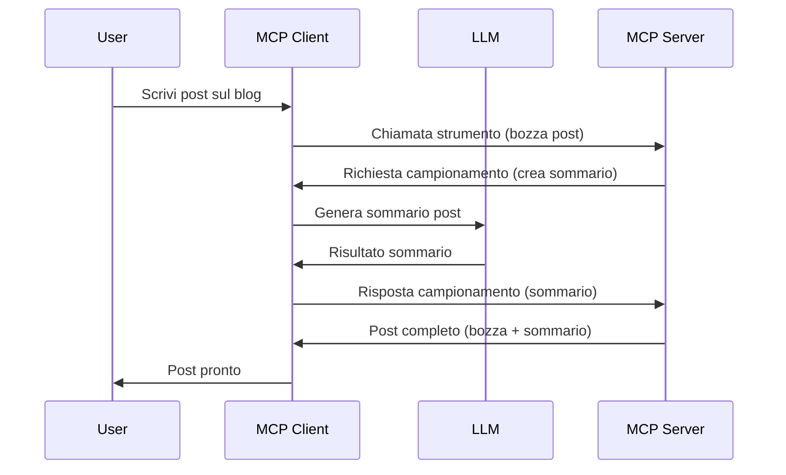

# Sampling - delegare le funzionalità al Client

A volte, è necessario che il Client MCP e il Server MCP collaborino per raggiungere un obiettivo comune. Potresti avere un caso in cui il Server necessita dell’aiuto di un LLM che risiede sul client. In questa situazione, sampling è ciò che dovresti usare.

Esploriamo alcuni casi d’uso e come costruire una soluzione che coinvolge il sampling.

## Panoramica

In questa lezione, ci concentriamo sul spiegare quando e dove usare il Sampling e come configurarlo.

## Obiettivi di apprendimento

In questo capitolo, vedremo:

- Spiegare cos’è il Sampling e quando usarlo.
- Mostrare come configurare il Sampling in MCP.
- Fornire esempi di Sampling in azione.

## Cos’è il Sampling e perché usarlo?

Sampling è una funzionalità avanzata che funziona nel seguente modo:



### Richiesta di Sampling

Ok, ora abbiamo una visione dall’alto di un possibile scenario, parliamo della richiesta di sampling che il server invia al client. Ecco come può apparire una tale richiesta in formato JSON-RPC:

```json
{
  "jsonrpc": "2.0",
  "id": 1,
  "method": "sampling/createMessage",
  "params": {
    "messages": [
      {
        "role": "user",
        "content": {
          "type": "text",
          "text": "Create a blog post summary of the following blog post: <BLOG POST>"
        }
      }
    ],
    "modelPreferences": {
      "hints": [
        {
          "name": "claude-3-sonnet"
        }
      ],
      "intelligencePriority": 0.8,
      "speedPriority": 0.5
    },
    "systemPrompt": "You are a helpful assistant.",
    "maxTokens": 100
  }
}
```

Ci sono alcune cose qui da sottolineare:

- Prompt, sotto content -> text, è il nostro prompt che è un’istruzione per l’LLM di riassumere il contenuto di un post sul blog.

- **modelPreferences**. Questa sezione è esattamente questo, una preferenza, una raccomandazione su quale configurazione usare con l’LLM. L’utente può scegliere se accettare queste raccomandazioni o modificarle. In questo caso ci sono raccomandazioni sul modello da usare e priorità di velocità e intelligenza.
- **systemPrompt**, questo è il tuo normale prompt di sistema che dà alla tua LLM una personalità e contiene istruzioni guida.
- **maxTokens**, questa è un’altra proprietà usata per indicare quanti token si raccomanda di usare per questo compito.

### Risposta di Sampling

Questa risposta è ciò che il Client MCP finisce per inviare indietro al Server MCP ed è il risultato della chiamata del client all’LLM, l’attesa di quella risposta, e poi la costruzione di questo messaggio. Ecco come può apparire in JSON-RPC:

```json
{
  "jsonrpc": "2.0",
  "id": 1,
  "result": {
    "role": "assistant",
    "content": {
      "type": "text",
      "text": "Here's your abstract <ABSTRACT>"
    },
    "model": "gpt-5",
    "stopReason": "endTurn"
  }
}
```

Nota come la risposta sia un abstract del post del blog proprio come abbiamo richiesto. Nota anche che il `model` usato non è quello che abbiamo chiesto ma "gpt-5" anziché "claude-3-sonnet". Questo serve a illustrare che l’utente può cambiare idea su cosa usare e che la tua richiesta di sampling è una raccomandazione.

Ok, ora che abbiamo capito il flusso principale, e un utile compito per cui usarlo “creazione di post sul blog + abstract”, vediamo cosa dobbiamo fare per farlo funzionare.

### Tipi di messaggi

I messaggi di sampling non sono limitati solo al testo ma puoi anche inviare immagini e audio. Ecco come appare diverso il JSON-RPC:

**Testo**

```json
{
  "type": "text",
  "text": "The message content"
}
```

**Contenuto immagine**

```json
{
  "type": "image",
  "data": "base64-encoded-image-data",
  "mimeType": "image/jpeg"
}
```

**Contenuto audio**

```json
{
  "type": "audio",
  "data": "base64-encoded-audio-data",
  "mimeType": "audio/wav"
}
```

> NOTE: per informazioni più dettagliate sul Sampling, consulta la [documentazione ufficiale](https://modelcontextprotocol.io/specification/2025-11-25/client/sampling)

## Come configurare il Sampling nel Client

> Nota: se stai costruendo solo un server, non devi fare molto qui.

In un client, devi specificare la seguente funzionalità in questo modo:

```json
{
  "capabilities": {
    "sampling": {}
  }
}
```

Questo verrà poi rilevato quando il client scelto si inizializzerà con il server.

## Esempio di Sampling in Azione - Creare un Post sul Blog

Codifichiamo insieme un server di sampling, dovremo fare quanto segue:

1. Creare uno strumento sul Server.
1. Questo strumento dovrebbe creare una richiesta di sampling
1. Lo strumento deve attendere la risposta alla richiesta di sampling inviata al client.
1. Quindi lo strumento dovrebbe produrre il risultato.

Vediamo il codice passo dopo passo:

### -1- Creare lo strumento

**python**

```python
@mcp.tool()
async def create_blog(title: str, content: str, ctx: Context[ServerSession, None]) -> str:
    """Create a blog post and generate a summary"""

```

### -2- Creare una richiesta di sampling

Estendi il tuo strumento con il seguente codice:

**python**

```python
post = BlogPost(
        id=len(posts) + 1,
        title=title,
        content=content,
        abstract=""
    )

prompt = f"Create an abstract of the following blog post: title: {title} and draft: {content} "

result = await ctx.session.create_message(
        messages=[
            SamplingMessage(
                role="user",
                content=TextContent(type="text", text=prompt),
            )
        ],
        max_tokens=100,
)

```

### -3- Attendere la risposta e restituirla

**python**

```python
post.abstract = result.content.text

posts.append(post)

# restituisce il prodotto completo
return json.dumps({
    "id": post.title,
    "abstract": post.abstract
})
```

### -4- Codice completo

**python**

```python
from starlette.applications import Starlette
from starlette.routing import Mount, Host

from mcp.server.fastmcp import Context, FastMCP

from mcp.server.session import ServerSession
from mcp.types import SamplingMessage, TextContent

import json


from uuid import uuid4
from typing import List
from pydantic import BaseModel


mcp = FastMCP("Blog post generator")

# app = FastAPI()

posts = []

class BlogPost(BaseModel):
    id: int
    title: str
    content: str
    abstract: str

posts: List[BlogPost] = []

@mcp.tool()
async def create_blog(title: str, content: str, ctx: Context[ServerSession, None]) -> str:
    """Create a blog post and generate a summary"""

    post = BlogPost(
        id=len(posts) + 1,
        title=title,
        content=content,
        abstract=""
    )

    prompt = f"Create an abstract of the following blog post: title: {title} and draft: {content} "

    result = await ctx.session.create_message(
        messages=[
            SamplingMessage(
                role="user",
                content=TextContent(type="text", text=prompt),
            )
        ],
        max_tokens=100,
    )

    post.abstract = result.content.text

    posts.append(post)

    # ritorna il post completo del blog
    return json.dumps({
        "id": post.title,
        "abstract": post.abstract
    })

if __name__ == "__main__":
    print("Starting server...")
    # mcp.run()
    mcp.run(transport="streamable-http")

# esegui l'app con: python server.py
```

### -5- Testarlo in Visual Studio Code

Per testarlo in Visual Studio Code, fai quanto segue:

1. Avvia il server nel terminale
1. Aggiungilo a *mcp.json* (e assicurati che sia avviato) ad esempio così:

   ```json
   "servers": {
      "blog-server": {
        "type": "http",
        "url": "http://localhost:8000/mcp"
      }
   }
   ```

1. Digita un prompt:

   ```text
   create a blog post named "Where Python comes from", the content is "Python is actually named after Monty Python Flying Circus"
   ```

1. Permetti che il sampling avvenga. La prima volta che testate questo vi sarà presentata una finestra di dialogo aggiuntiva che dovrete accettare, poi vedrete la normale finestra di dialogo per chiedervi di eseguire uno strumento.

1. Ispeziona i risultati. Vedrai i risultati sia ben resi in GitHub Copilot Chat sia potrai ispezionare la risposta JSON grezza.

**Bonus**. Gli strumenti di Visual Studio Code offrono un ottimo supporto per il sampling. Puoi configurare l’accesso al Sampling sul server che hai installato navigando così:

1. Vai alla sezione delle estensioni.
1. Seleziona l’icona dell’ingranaggio per il server installato nella sezione "MCP SERVERS - INSTALLED".
1. Seleziona "Configure Model Access", qui puoi scegliere quali Modelli GitHub Copilot può usare durante il sampling. Puoi anche vedere tutte le richieste di sampling recenti selezionando "Show Sampling requests".

## Compito

In questo compito, costruirai un sampling leggermente diverso, ovvero un’integrazione di sampling che supporta la generazione di una descrizione prodotto. Ecco il tuo scenario:

**Scenario**: L’addetto al back office di un e-commerce ha bisogno di aiuto, ci vuole troppo tempo per generare descrizioni prodotto. Pertanto, devi costruire una soluzione dove puoi chiamare uno strumento "create_product" con "title" e "keywords" come argomenti e che dovrebbe produrre un prodotto completo incluso un campo "description" popolato dall’LLM del client.

TIP: usa quello che hai imparato in precedenza per costruire questo server e il suo strumento usando una richiesta di sampling.

## Soluzione

[Solution](./solution/README.md)

## Punti chiave

Sampling è una funzionalità potente che permette al server di delegare compiti al client quando necessita dell’aiuto di un LLM.

## Cosa c’è dopo

- [Capitolo 4 - Implementazione pratica](../../04-PracticalImplementation/README.md)

---

<!-- CO-OP TRANSLATOR DISCLAIMER START -->
**Disclaimer**:
Questo documento è stato tradotto utilizzando il servizio di traduzione AI [Co-op Translator](https://github.com/Azure/co-op-translator). Sebbene ci impegniamo per garantire la precisione, si prega di notare che le traduzioni automatizzate possono contenere errori o imprecisioni. Il documento originale nella sua lingua nativa deve essere considerato la fonte autorevole. Per informazioni critiche, si raccomanda una traduzione professionale effettuata da un essere umano. Non siamo responsabili per eventuali malintesi o interpretazioni errate derivanti dall’uso di questa traduzione.
<!-- CO-OP TRANSLATOR DISCLAIMER END -->