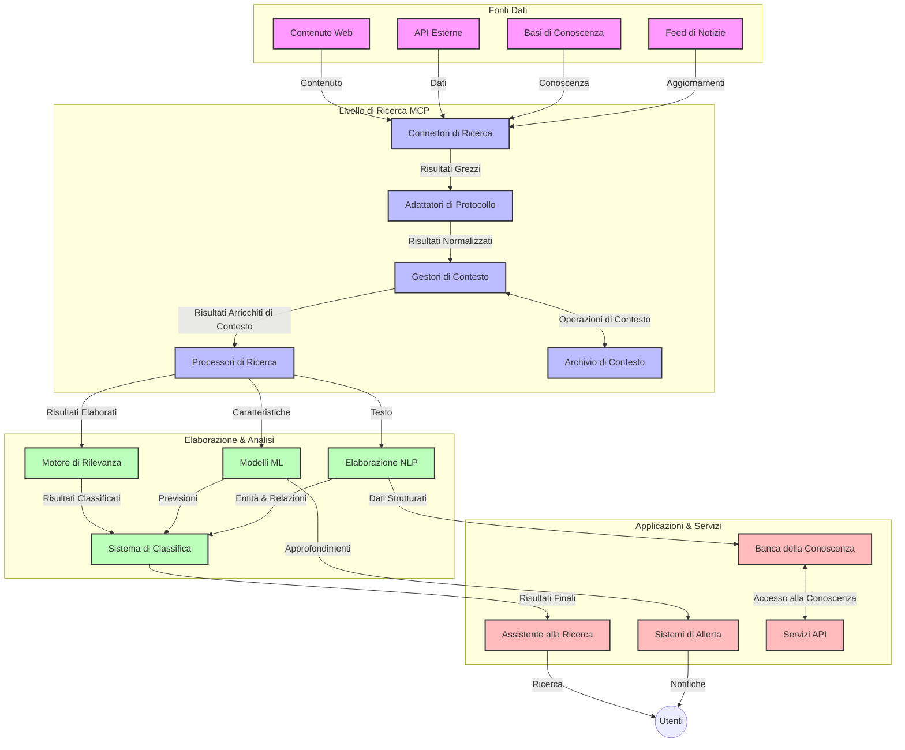
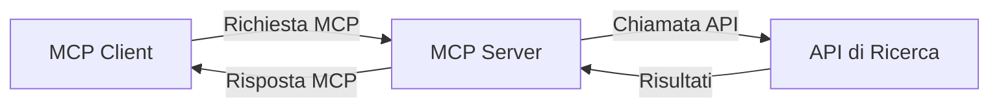
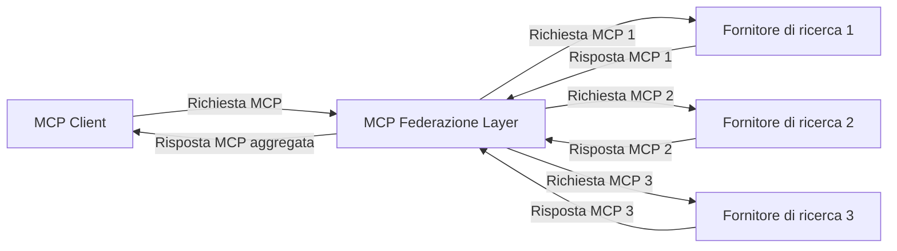
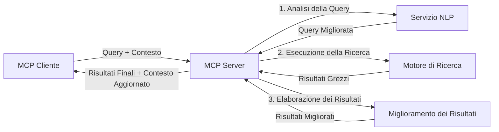

# Protocollo Model Context per la Ricerca Web in Tempo Reale

## Panoramica

La ricerca web in tempo reale è diventata essenziale nell'ambiente attuale guidato dall'informazione, dove le applicazioni necessitano di accesso immediato a informazioni aggiornate su Internet per fornire risposte rilevanti e tempestive. Il Protocollo Model Context (MCP) rappresenta un significativo avanzamento nell'ottimizzazione di questi processi di ricerca in tempo reale, migliorando l'efficienza della ricerca, mantenendo l'integrità contestuale e migliorando le prestazioni complessive del sistema.

Questo modulo esplora come MCP trasformi la ricerca web in tempo reale fornendo un approccio standardizzato alla gestione del contesto tra modelli AI, motori di ricerca e applicazioni.

### Cosa Imparerai

In questa guida completa, scoprirai:

- Come MCP crea un ponte fluido tra modelli AI e capacità di ricerca web in tempo reale
- Pattern architetturali per implementare soluzioni di ricerca efficienti e scalabili con MCP
- Tecniche per preservare il contesto di ricerca attraverso molteplici query e interazioni
- Implementazioni di codice pratiche in Python e JavaScript per vari scenari di ricerca
- Metodi per bilanciare rilevanza, attualità e prestazioni nei sistemi di ricerca basati su MCP

## Introduzione alla Ricerca Web in Tempo Reale

La ricerca web in tempo reale è un approccio tecnologico che consente l'interrogazione, l'elaborazione e l'analisi continue delle informazioni basate sul web man mano che vengono pubblicate o aggiornate, permettendo ai sistemi di fornire informazioni fresche e pertinenti con una latenza minima. A differenza dei sistemi di ricerca tradizionali che operano su dati indicizzati che possono avere ore o giorni di ritardo, la ricerca in tempo reale elabora dati "live" dal web, offrendo insight e informazioni che riflettono lo stato attuale dei contenuti online.

### Concetti Chiave della Ricerca Web in Tempo Reale:

- **Elaborazione Continua delle Query**: Le query vengono processate su fonti dati in costante aggiornamento
- **Priorità all'Attualità**: I sistemi sono progettati per privilegiare informazioni fresche
- **Bilanciamento della Rilevanza**: Mantenimento di un equilibrio tra rilevanza e attualità
- **Architettura Scalabile**: I sistemi devono gestire carichi di query e volumi di dati variabili
- **Comprensione Contestuale**: Mantenere il contesto dell'utente attraverso iterazioni di ricerca è cruciale per risultati significativi
- **Riformulazione Dinamica delle Query**: Modifica adattativa delle query basata su contesto e risultati precedenti
- **Integrazione Multi-Sorgente**: Combinazione di risultati da molteplici fornitori di ricerca e fonti web
- **Comprensione Semantica**: Elaborazione di query e contenuti basata sul significato e non solo sulle parole chiave
- **Classifica in Tempo Reale**: Regolazione continua delle classifiche dei risultati man mano che arrivano nuove informazioni

### Il Protocollo Model Context e la Ricerca Web in Tempo Reale

Il Protocollo Model Context (MCP) affronta diverse sfide critiche negli ambienti di ricerca web in tempo reale:

1. **Preservazione del Contesto di Ricerca**: MCP standardizza come il contesto viene mantenuto tra componenti di ricerca distribuiti, garantendo che modelli AI e nodi di elaborazione abbiano accesso alla cronologia rilevante delle query e alle preferenze utente.

2. **Gestione Efficiente delle Query**: Fornendo meccanismi strutturati per la trasmissione del contesto, MCP riduce l'overhead di ripetere il contesto in ogni iterazione di ricerca.

3. **Interoperabilità**: MCP crea un linguaggio comune per la condivisione del contesto tra tecnologie di ricerca diverse e modelli AI, abilitando architetture più flessibili ed estendibili.

4. **Contesto Ottimizzato per la Ricerca**: Le implementazioni MCP possono dare priorità agli elementi contestuali più rilevanti per una ricerca efficace, ottimizzando sia prestazioni che accuratezza.

5. **Elaborazione di Ricerca Adattativa**: Con una gestione adeguata del contesto tramite MCP, i sistemi di ricerca possono modificare dinamicamente l'elaborazione in base alle esigenze evolutive dell'utente e al panorama informativo.

Nelle applicazioni moderne che vanno dall'aggregazione di notizie agli assistenti per la ricerca, l'integrazione di MCP con le tecnologie di ricerca web consente ricerche più intelligenti e consapevoli del contesto che possono fornire risultati sempre più rilevanti con il proseguire delle interazioni utente.

## Obiettivi di Apprendimento

Al termine di questa lezione, sarai in grado di:

- Comprendere i fondamenti della ricerca web in tempo reale e le sue sfide nelle applicazioni moderne
- Spiegare come il Protocollo Model Context (MCP) migliori le capacità della ricerca web in tempo reale
- Implementare soluzioni di ricerca basate su MCP utilizzando framework e API popolari
- Progettare e distribuire architetture di ricerca scalabili e ad alte prestazioni con MCP
- Applicare i concetti MCP a vari casi d'uso tra cui ricerca semantica, assistenza alla ricerca e navigazione potenziata da AI
- Valutare tendenze emergenti e innovazioni future nelle tecnologie di ricerca basate su MCP
- Sviluppare sistemi di ricerca consapevoli del contesto che apprendono dalle interazioni utente
- Integrare capacità di ricerca web in assistenti AI utilizzando protocolli MCP standardizzati
- Creare pipeline di ricerca a più fasi che affinano progressivamente i risultati basandosi sul contesto
- Ottimizzare le prestazioni della ricerca mantenendo una consapevolezza completa del contesto

### Definizione e Importanza

La ricerca web in tempo reale coinvolge la continua interrogazione, il recupero e la consegna di informazioni web con latenza minima. A differenza dei motori di ricerca tradizionali che eseguono regolarmente la scansione e l'indicizzazione del web, la ricerca in tempo reale mira a far emergere informazioni appena diventano disponibili, consentendo l'accesso immediato ai contenuti più aggiornati.

Caratteristiche chiave della ricerca web in tempo reale includono:

- **Freschezza**: Priorità ai contenuti e aggiornamenti recenti
- **Elaborazione Continua**: Monitoraggio costante di nuove informazioni
- **Adattamento della Query**: Raffinamento delle query di ricerca basato su contesto e feedback
- **Consegna Immediata**: Fornitura dei risultati di ricerca con ritardo minimo
- **Ritenzione del Contesto**: Costruzione su query precedenti per migliorare la rilevanza

### Sfide nella Ricerca Web Tradizionale

Gli approcci tradizionali alla ricerca web affrontano diverse limitazioni quando applicati a scenari in tempo reale:

1. **Frammentazione del Contesto**: Difficoltà nel mantenere il contesto di ricerca attraverso più query
2. **Freschezza dell'Informazione**: Sfide nell'accesso e nella prioritizzazione delle informazioni più recenti
3. **Complessità di Integrazione**: Problemi di interoperabilità tra sistemi di ricerca e applicazioni
4. **Problemi di Latenza**: Bilanciamento tra ricerca esaustiva e tempi di risposta richiesti
5. **Regolazione della Rilevanza**: Garantire accuratezza e rilevanza mentre si dà priorità all'attualità

## Comprendere il Protocollo Model Context (MCP) per la Ricerca

### Cos'è MCP nei Contesti di Ricerca?

Il Protocollo Model Context (MCP) è un protocollo di comunicazione standardizzato progettato per facilitare l'interazione efficiente tra modelli AI e applicazioni. Nel contesto della ricerca web in tempo reale, MCP fornisce una struttura per:

- Preservare il contesto di ricerca attraverso sequenze di query
- Standardizzare i formati di query di ricerca e di risultati
- Ottimizzare la trasmissione di parametri di ricerca e risultati
- Migliorare la comunicazione tra modelli e motori di ricerca

### Componenti Core e Architettura

L'architettura MCP per la ricerca web in tempo reale consiste di diversi componenti chiave:

1. **Gestori del Contesto di Query**: Gestiscono e mantengono il contesto di ricerca attraverso molteplici query
2. **Processori di Ricerca**: Elaborano le richieste di ricerca in arrivo usando tecniche consapevoli del contesto
3. **Adattatori del Protocollo**: Convertono tra diverse API di ricerca preservando il contesto
4. **Archivio del Contesto**: Memorizzano e recuperano in modo efficiente la cronologia di ricerca e le preferenze
5. **Connettori di Ricerca**: Collegano a vari motori di ricerca e API web



### Come MCP Migliora la Ricerca Web in Tempo Reale

MCP affronta le sfide della ricerca web tradizionale attraverso:

- **Continuità Contestuale**: Mantenere le relazioni tra query durante tutta la sessione di ricerca
- **Trasmissione Ottimizzata**: Ridurre la ridondanza nei parametri di ricerca tramite una gestione intelligente del contesto
- **Interfacce Standardizzate**: Fornire API coerenti per i componenti di ricerca
- **Latenza Ridotta**: Minimizzare l'overhead di elaborazione tramite una gestione efficiente del contesto
- **Rilevanza Migliorata**: Aumentare la rilevanza della ricerca preservando l'intento dell'utente attraverso diverse query

## Integrazione e Implementazione

I sistemi di ricerca web in tempo reale richiedono una progettazione e implementazione architetturale accurata per mantenere sia le prestazioni sia l'integrità contestuale. Il Protocollo Model Context offre un approccio standardizzato per integrare modelli AI e tecnologie di ricerca, permettendo pipeline di ricerca più sofisticate e consapevoli del contesto.

### Panoramica dell'Integrazione MCP nelle Architetture di Ricerca

Implementare MCP in ambienti di ricerca web in tempo reale implica diverse considerazioni chiave:

1. **Serializzazione del Contesto di Ricerca**: MCP fornisce meccanismi efficienti per codificare le informazioni contestuali all’interno delle richieste di ricerca, garantendo che il contesto essenziale accompagni la query lungo tutta la pipeline di elaborazione. Questo include formati di serializzazione standardizzati ottimizzati per i metadati relativi alla ricerca.

2. **Elaborazione di Ricerca Statoful**: MCP abilita un'elaborazione più intelligente e statoful mantenendo una rappresentazione consistente del contesto tra le iterazioni di ricerca. Ciò è particolarmente prezioso in pipeline di ricerca a più fasi dove il raffinamento del contesto migliora i risultati.

3. **Espansione e Raffinamento delle Query**: Le implementazioni MCP nei sistemi di ricerca possono facilitare sofisticate espansioni e raffinamenti delle query basati sul contesto accumulato, consentendo risultati sempre più rilevanti man mano che la sessione di ricerca avanza.

4. **Caching e Prioritizzazione dei Risultati**: Standardizzando la gestione del contesto, MCP aiuta a gestire il caching e la prioritizzazione dei risultati, permettendo ai componenti di adattarsi in base al contesto di ricerca in evoluzione.

5. **Federazione e Aggregazione della Ricerca**: MCP facilita una federazione più sofisticata delle ricerche attraverso molteplici backend fornendo rappresentazioni strutturate del contesto di ricerca, permettendo un’aggregazione più significativa dei risultati da fonti diverse.

L’implementazione di MCP attraverso differenti tecnologie di ricerca crea un approccio unificato alla gestione del contesto, riducendo la necessità di codice di integrazione personalizzato e migliorando la capacità del sistema di mantenere un contesto significativo mentre le query evolvono.

### MCP in Diverse Implementazioni di Ricerca Web

Questi esempi seguono la specifica MCP attuale che si basa su un protocollo JSON-RPC con meccanismi di trasporto distinti. Il codice mostra come è possibile implementare integrazioni di ricerca personalizzate mantenendo la piena compatibilità con il protocollo MCP.


<details>
<summary>Implementazione Python con API di Ricerca Generica</summary>

```python
import asyncio
import json
import aiohttp
from typing import Dict, Any, Optional, List
from contextlib import asynccontextmanager
from collections.abc import AsyncIterator

# Importa le librerie standard MCP
from mcp.client.session import ClientSession
from mcp.client.streamable_http import streamablehttp_client
from mcp.types import TextContent, CreateMessageRequestParams, CreateMessageResult
from mcp.server.fastmcp import FastMCP

# Crea un server FastMCP per la ricerca web
search_server = FastMCP("WebSearch")

# Classe per gestire le operazioni di ricerca web
class WebSearchHandler:
    def __init__(self, api_endpoint: str, api_key: str):
        self.api_endpoint = api_endpoint
        self.api_key = api_key
        self.session = None
        
    async def initialize(self):
        """Initialize the HTTP session"""
        self.session = aiohttp.ClientSession(
            headers={"Authorization": f"Bearer {self.api_key}"}
        )
    
    async def close(self):
        """Close the HTTP session"""
        if self.session:
            await self.session.close()
            
    async def perform_search(self, query: str, max_results: int = 5, 
                           include_domains: List[str] = None, 
                           exclude_domains: List[str] = None,
                           time_period: str = "any") -> Dict[str, Any]:
        """Perform web search using the search API"""
        # Costruisci i parametri di ricerca
        search_params = {
            "q": query,
            "limit": max_results,
            "time": time_period
        }
        
        if include_domains:
            search_params["site"] = ",".join(include_domains)
            
        if exclude_domains:
            search_params["exclude_site"] = ",".join(exclude_domains)
        
        # Esegui la richiesta di ricerca
        try:
            async with self.session.get(
                self.api_endpoint,
                params=search_params
            ) as response:
                if response.status != 200:
                    error_text = await response.text()
                    raise Exception(f"Search API error: {response.status} - {error_text}")
                
                search_data = await response.json()
                
                # Trasforma la risposta specifica dell'API in un formato standard
                results = []
                for item in search_data.get("results", []):
                    results.append({
                        "title": item.get("title", ""),
                        "url": item.get("url", ""),
                        "snippet": item.get("snippet", ""),
                        "date": item.get("published_date", ""),
                        "source": item.get("source", "")
                    })
                
                return {
                    "query": query,
                    "totalResults": len(results),
                    "results": results
                }
        except Exception as e:
            print(f"Search API request error: {e}")
            raise

# Inizializza il gestore di ricerca
search_handler = WebSearchHandler(
    api_endpoint="https://api.search-service.example/search",
    api_key="your-api-key-here"
)

# Configura la durata per gestire il gestore di ricerca
@asyncio.asynccontextmanager
async def app_lifespan(server: FastMCP):
    """Manage application lifecycle"""
    await search_handler.initialize()
    try:
        yield {"search_handler": search_handler}
    finally:
        await search_handler.close()

# Imposta la durata per il server
search_server = FastMCP("WebSearch", lifespan=app_lifespan)

# Registra uno strumento di ricerca web
@search_server.tool()
async def web_search(query: str, max_results: int = 5, 
                   include_domains: List[str] = None,
                   exclude_domains: List[str] = None,
                   time_period: str = "any") -> Dict[str, Any]:
    """
    Search the web for information
    
    Args:
        query: The search query
        max_results: Maximum number of results to return (default: 5)
        include_domains: List of domains to include in search results
        exclude_domains: List of domains to exclude from search results
        time_period: Time period for results ("day", "week", "month", "any")
        
    Returns:
        Dictionary containing search results
    """
    ctx = search_server.get_context()
    search_handler = ctx.request_context.lifespan_context["search_handler"]
    
    results = await search_handler.perform_search(
        query=query,
        max_results=max_results,
        include_domains=include_domains,
        exclude_domains=exclude_domains,
        time_period=time_period
    )
    
    return results

# Esempio di utilizzo lato client
async def client_example():
    # Connettiti al server di ricerca usando il trasporto HTTP Streamable
    async with streamablehttp_client("http://localhost:8000/mcp") as (read, write, _):
        async with ClientSession(read, write) as session:
            # Inizializza la connessione
            await session.initialize()
            
            # Chiama lo strumento web_search
            search_results = await session.call_tool(
                "web_search", 
                {
                    "query": "latest developments in AI and Model Context Protocol",
                    "max_results": 5,
                    "time_period": "day",
                    "include_domains": ["github.com", "microsoft.com"]
                }
            )
            
            print(f"Search results: {search_results}")

# Esempio di esecuzione del server
if __name__ == "__main__":
    # Esegui il server con trasporto HTTP Streamable
    search_server.run(transport="streamable-http")
```
</details> 

<details>
<summary>Implementazione JavaScript con Ricerca Basata su Browser</summary>


```javascript
// Implementazione del server MCP per la ricerca web
import { McpServer, ResourceTemplate } from '@modelcontextprotocol/sdk/server/mcp.js';
import { StreamableHTTPServerTransport } from '@modelcontextprotocol/sdk/server/streamableHttp.js';
import { z } from 'zod';

// Crea un server MCP per la ricerca web
const searchServer = new McpServer({
    name: "BrowserSearch",
    description: "A server that provides web search capabilities"
});

// Classe del servizio di ricerca
class SearchService {
    constructor(searchApiUrl, apiKey) {
        this.searchApiUrl = searchApiUrl;
        this.apiKey = apiKey;
    }

    async performSearch(parameters) {
        const {
            query = '',
            maxResults = 5,
            includeDomains = [],
            excludeDomains = [],
            timePeriod = 'any'
        } = parameters;
        
        // Costruisci l'URL di ricerca con i parametri
        const url = new URL(this.searchApiUrl);
        url.searchParams.append('q', query);
        url.searchParams.append('limit', maxResults);
        url.searchParams.append('time', timePeriod);
        
        if (includeDomains.length > 0) {
            url.searchParams.append('site', includeDomains.join(','));
        }
        
        if (excludeDomains.length > 0) {
            url.searchParams.append('exclude_site', excludeDomains.join(','));
        }
        
        try {
            const response = await fetch(url.toString(), {
                method: 'GET',
                headers: {
                    'Authorization': `Bearer ${this.apiKey}`,
                    'Content-Type': 'application/json'
                }
            });
            
            if (!response.ok) {
                const errorText = await response.text();
                throw new Error(`Search API error: ${response.status} - ${errorText}`);
            }
            
            const searchData = await response.json();
            
            // Trasforma la risposta specifica dell'API in un formato standard
            const results = searchData.results?.map(item => ({
                title: item.title || '',
                url: item.url || '',
                snippet: item.snippet || '',
                date: item.published_date || '',
                source: item.source || ''
            })) || [];
            
            return {
                query,
                totalResults: results.length,
                results
            };
        } catch (error) {
            console.error('Search API request error:', error);
            throw error;
        }
    }
}

// Inizializza il servizio di ricerca
const searchService = new SearchService(
    'https://api.search-service.example/search',
    'your-api-key-here'
);

// Configura il provider di contesto per il server
searchServer.setContextProvider(() => {
    return {
        searchService
    };
});

// Registra lo strumento di ricerca web
searchServer.tool({
    name: 'web_search',
    description: 'Search the web for information',
    parameters: {
        type: 'object',
        properties: {
            query: {
                type: 'string',
                description: 'The search query'
            },
            maxResults: {
                type: 'integer',
                description: 'Maximum number of results to return',
                default: 5
            },
            includeDomains: {
                type: 'array',
                items: { type: 'string' },
                description: 'List of domains to include in search results'
            },
            excludeDomains: {
                type: 'array',
                items: { type: 'string' },
                description: 'List of domains to exclude from search results'
            },
            timePeriod: {
                type: 'string',
                description: 'Time period for results',
                enum: ['day', 'week', 'month', 'any'],
                default: 'any'
            }
        },
        required: ['query']
    },
    handler: async (params, context) => {
        const { searchService } = context;
        return await searchService.performSearch(params);
    }
});

// Codice esempio del client per connettersi al server di ricerca
import { Client } from '@modelcontextprotocol/sdk/client/index.js';
import { StreamableHTTPClientTransport } from '@modelcontextprotocol/sdk/client/streamableHttp.js';

async function connectToSearchServer() {
    // Connetti al server di ricerca
    const transport = new StreamableHTTPClientTransport(
        new URL('http://localhost:8000/mcp')
    );
    
    const client = new Client({
        name: 'search-client',
        version: '1.0.0'
    });
    
    await client.connect(transport);
    
    // Esegui lo strumento di ricerca
    const searchResults = await client.callTool({
        name: 'web_search',
        arguments: {
            query: 'Model Context Protocol implementation examples',
            maxResults: 10,
            timePeriod: 'week',
            includeDomains: ['github.com', 'docs.microsoft.com']
        }
    });
    
    console.log('Search results:', searchResults);
    
    // Pulizia
    await client.disconnect();
}

// Avvia il server
const transport = new StreamableHTTPServerTransport();
await searchServer.connect(transport);
console.log('Search server running at http://localhost:8000/mcp');

// In un processo separato o dopo che il server è stato avviato
// connectToSearchServer().catch(console.error);
```
</details> 


## Disclaimer sugli Esempi di Codice

> **Nota Importante**: Gli esempi di codice sottostanti dimostrano l’integrazione del Protocollo Model Context (MCP) con funzionalità di ricerca web. Sebbene seguano i modelli e le strutture degli SDK ufficiali MCP, sono stati semplificati per scopi didattici.
> 
> Questi esempi mostrano:
> 
> 1. **Implementazione Python**: Un’implementazione del server FastMCP che fornisce uno strumento di ricerca web e si collega a un’API di ricerca esterna. Questo esempio dimostra una gestione corretta del ciclo di vita, la gestione del contesto e l’implementazione dello strumento seguendo i modelli dell’[SDK Python MCP ufficiale](https://github.com/modelcontextprotocol/python-sdk). Il server utilizza il trasporto Streamable HTTP raccomandato, che ha sostituito il precedente trasporto SSE per le distribuzioni in produzione.
> 
> 2. **Implementazione JavaScript**: Un’implementazione TypeScript/JavaScript che usa il pattern FastMCP dell’[SDK TypeScript MCP ufficiale](https://github.com/modelcontextprotocol/typescript-sdk) per creare un server di ricerca con definizioni corrette degli strumenti e connessioni client. Segue gli ultimi pattern raccomandati per la gestione della sessione e la conservazione del contesto.
> 
> Questi esempi richiederebbero gestione degli errori aggiuntiva, autenticazione e codice specifico di integrazione API per un uso in produzione. Gli endpoint API di ricerca mostrati (`https://api.search-service.example/search`) sono segnaposto e dovrebbero essere sostituiti con endpoint reali di servizi di ricerca.
> 
> Per dettagli completi sull’implementazione e sugli approcci più aggiornati, si prega di consultare la [specifica MCP ufficiale](https://spec.modelcontextprotocol.io/) e la documentazione SDK.

## Concetti Fondamentali

### Il Framework Protocollo Model Context (MCP)

Alla base, il Protocollo Model Context fornisce un modo standardizzato per lo scambio di contesto tra modelli AI, applicazioni e servizi. Nella ricerca web in tempo reale, questo framework è essenziale per creare esperienze di ricerca coerenti e multi-turn. I componenti chiave includono:

1. **Architettura Client-Server**: MCP stabilisce una chiara separazione tra client di ricerca (richiedenti) e server di ricerca (fornitori), consentendo modelli di distribuzione flessibili.

2. **Comunicazione JSON-RPC**: Il protocollo utilizza JSON-RPC per lo scambio di messaggi, rendendolo compatibile con le tecnologie web e facile da implementare tra diverse piattaforme.

3. **Gestione del Contesto**: MCP definisce metodi strutturati per mantenere, aggiornare e sfruttare il contesto di ricerca attraverso molteplici interazioni.

4. **Definizione degli Strumenti**: Le capacità di ricerca sono esposte come strumenti standardizzati con parametri e valori di ritorno ben definiti.

5. **Supporto allo Streaming**: Il protocollo supporta lo streaming dei risultati, essenziale per la ricerca in tempo reale dove i risultati possono arrivare progressivamente.

### Pattern di Integrazione nella Ricerca Web

Nel integrare MCP con la ricerca web, emergono diversi pattern:

#### 1. Integrazione Diretta del Fornitore di Ricerca



In questo pattern, il server MCP interagisce direttamente con una o più API di ricerca, traducendo le richieste MCP in chiamate specifiche all’API e formattando i risultati come risposte MCP.

#### 2. Ricerca Federata con Preservazione del Contesto



Questo pattern distribuisce le query di ricerca tra molteplici fornitori di ricerca compatibili MCP, ognuno potenzialmente specializzato in diversi tipi di contenuti o capacità di ricerca, mantenendo un contesto unificato.

#### 3. Catena di Ricerca Arricchita dal Contesto



In questo pattern, il processo di ricerca è diviso in più fasi, con il contesto che viene arricchito ad ogni passaggio, producendo risultati sempre più rilevanti.

### Componenti del Contesto di Ricerca

Nella ricerca web basata su MCP, il contesto tipicamente include:

- **Cronologia delle Query**: Query di ricerca precedenti nella sessione
- **Preferenze Utente**: Lingua, regione, impostazioni di ricerca sicura
- **Cronologia delle Interazioni**: Quali risultati sono stati cliccati, tempo trascorso sui risultati
- **Parametri di Ricerca**: Filtri, ordinamenti e altri modificatori di ricerca
- **Conoscenze di Dominio**: Contesto specifico del soggetto rilevante per la ricerca
- **Contesto Temporale**: Fattori di rilevanza basati sul tempo
- **Preferenze delle Fonti**: Fonti di informazione affidabili o preferite

## Casi d'Uso e Applicazioni

### Ricerca e Raccolta di Informazioni

MCP migliora i flussi di lavoro di ricerca:

- Preservando il contesto della ricerca tra sessioni
- Consentendo query più sofisticate e contestualmente rilevanti
- Supportando la federazione di ricerca multi-sorgente
- Facilitando l’estrazione di conoscenza dai risultati di ricerca

### Monitoraggio di Notizie e Tendenze in Tempo Reale

La ricerca basata su MCP offre vantaggi per il monitoraggio delle notizie:

- Scoperta quasi in tempo reale di storie emergenti
- Filtraggio contestuale delle informazioni rilevanti
- Tracciamento di temi ed entità su più fonti
- Avvisi personalizzati di notizie basati sul contesto utente

### Navigazione e Ricerca Potenziate dall’AI

MCP apre nuove possibilità per la navigazione potenziata da AI:

- Suggerimenti di ricerca contestuali basati sull’attività corrente del browser
- Integrazione fluida della ricerca web con assistenti LLM
- Raffinamento multi-turn della ricerca mantenendo il contesto
- Miglioramento del fact-checking e della verifica delle informazioni

## Tendenze Future e Innovazioni

### Evoluzione di MCP nella Ricerca Web

Guardando al futuro, prevediamo che MCP evolverà per affrontare:
- **Ricerca Multimodale**: integrazione di ricerca testuale, immagini, audio e video con contesto preservato  
- **Ricerca Decentralizzata**: supporto a ecosistemi di ricerca distribuiti e federati  
- **Privacy nella Ricerca**: meccanismi di ricerca che preservano la privacy e sono consapevoli del contesto  
- **Comprensione della Query**: analisi semantica profonda delle query di ricerca in linguaggio naturale  

### Potenziali Progressi nella Tecnologia

Tecnologie emergenti che plasmeranno il futuro della ricerca MCP:

1. **Architetture di Ricerca Neurale**: sistemi di ricerca basati su embedding ottimizzati per MCP  
2. **Contesto di Ricerca Personalizzato**: apprendimento nel tempo dei modelli di ricerca degli utenti individuali  
3. **Integrazione di Knowledge Graph**: ricerca contestuale migliorata da knowledge graph specifici per dominio  
4. **Contesto Cross-Modale**: mantenimento del contesto attraverso diverse modalità di ricerca  

## Esercizi Pratici

### Esercizio 1: Configurazione di una Pipeline Base di Ricerca MCP

In questo esercizio imparerai a:  
- Configurare un ambiente di ricerca MCP di base  
- Implementare gestori di contesto per la ricerca sul web  
- Testare e validare la preservazione del contesto attraverso le iterazioni di ricerca  

### Esercizio 2: Costruire un Assistente alla Ricerca con MCP

Crea un’applicazione completa che:  
- Processa domande di ricerca in linguaggio naturale  
- Esegue ricerche web consapevoli del contesto  
- Sintetizza informazioni da più fonti  
- Presenta risultati di ricerca organizzati  

### Esercizio 3: Implementare una Federazione di Ricerca Multi-Sorgente con MCP

Esercizio avanzato che copre:  
- Dispatch consapevole del contesto a più motori di ricerca  
- Classifica e aggregazione dei risultati  
- Duplicazione contestuale dei risultati di ricerca  
- Gestione dei metadati specifici delle sorgenti  

## Risorse Aggiuntive

- [Model Context Protocol Specification](https://spec.modelcontextprotocol.io/) - Specifica ufficiale MCP e documentazione dettagliata del protocollo  
- [Model Context Protocol Documentation](https://modelcontextprotocol.io/) - Tutorial dettagliati e guide all’implementazione  
- [MCP Python SDK](https://github.com/modelcontextprotocol/python-sdk) - Implementazione Python ufficiale del protocollo MCP  
- [MCP TypeScript SDK](https://github.com/modelcontextprotocol/typescript-sdk) - Implementazione TypeScript ufficiale del protocollo MCP  
- [MCP Reference Servers](https://github.com/modelcontextprotocol/servers) - Implementazioni di riferimento dei server MCP  
- [Bing Web Search API Documentation](https://learn.microsoft.com/en-us/bing/search-apis/bing-web-search/overview) - API di ricerca web di Microsoft  
- [Google Custom Search JSON API](https://developers.google.com/custom-search/v1/overview) - Motore di ricerca programmabile di Google  
- [SerpAPI Documentation](https://serpapi.com/search-api) - API per le pagine dei risultati dei motori di ricerca  
- [Meilisearch Documentation](https://www.meilisearch.com/docs) - Motore di ricerca open source  
- [Elasticsearch Documentation](https://www.elastic.co/guide/index.html) - Motore di ricerca e analisi distribuito  
- [LangChain Documentation](https://python.langchain.com/docs/get_started/introduction) - Creazione di applicazioni con LLM  

## Risultati di Apprendimento

Completando questo modulo sarai in grado di:

- Comprendere i fondamenti della ricerca web in tempo reale e le sue sfide  
- Spiegare come il Model Context Protocol (MCP) migliori le capacità della ricerca web in tempo reale  
- Implementare soluzioni di ricerca basate su MCP utilizzando framework e API popolari  
- Progettare e distribuire architetture di ricerca scalabili e ad alte prestazioni con MCP  
- Applicare i concetti MCP a vari casi d’uso tra cui ricerca semantica, assistenza alla ricerca e navigazione potenziata dall’AI  
- Valutare le tendenze emergenti e le innovazioni future nelle tecnologie di ricerca basate su MCP  

### Considerazioni su Fiducia e Sicurezza

Quando implementi soluzioni di ricerca web basate su MCP, ricorda questi principi importanti dalla specifica MCP:

1. **Consenso e Controllo dell’Utente**: gli utenti devono dare consenso esplicito e comprendere tutte le operazioni e gli accessi ai dati. Questo è particolarmente importante per implementazioni di ricerca web che possono accedere a fonti dati esterne.  

2. **Privacy dei Dati**: garantisci una gestione appropriata delle query di ricerca e dei risultati, specialmente quando contengono informazioni sensibili. Implementa adeguati controlli di accesso per proteggere i dati degli utenti.  

3. **Sicurezza degli Strumenti**: implementa autorizzazione e validazione corrette per gli strumenti di ricerca, poiché rappresentano rischi potenziali per la sicurezza a causa dell’esecuzione arbitraria di codice. Le descrizioni del comportamento degli strumenti dovrebbero essere considerate non fidate a meno che non provengano da un server attendibile.  

4. **Documentazione Chiara**: fornisci una documentazione chiara sulle capacità, limitazioni e considerazioni di sicurezza della tua implementazione di ricerca basata su MCP, secondo le linee guida della specifica MCP.  

5. **Flussi di Consenso Robusti**: costruisci flussi di consenso e autorizzazione robusti che spieghino chiaramente cosa fa ogni strumento prima di autorizzarne l’uso, specialmente per strumenti che interagiscono con risorse web esterne.  

Per dettagli completi su sicurezza e considerazioni di fiducia di MCP, consulta la [documentazione ufficiale](https://modelcontextprotocol.io/specification/2025-11-25/basic/security_best_practices).  

## Cosa aspettarsi dopo  

- [5.12 Autenticazione Entra ID per i Server Model Context Protocol](../mcp-security-entra/README.md)

---

<!-- CO-OP TRANSLATOR DISCLAIMER START -->
**Disclaimer**:
Questo documento è stato tradotto utilizzando il servizio di traduzione AI [Co-op Translator](https://github.com/Azure/co-op-translator). Sebbene ci impegniamo per garantire la precisione, si prega di notare che le traduzioni automatizzate possono contenere errori o imprecisioni. Il documento originale nella sua lingua nativa deve essere considerato la fonte autorevole. Per informazioni critiche, si raccomanda una traduzione professionale effettuata da un essere umano. Non siamo responsabili per eventuali malintesi o interpretazioni errate derivanti dall’uso di questa traduzione.
<!-- CO-OP TRANSLATOR DISCLAIMER END -->