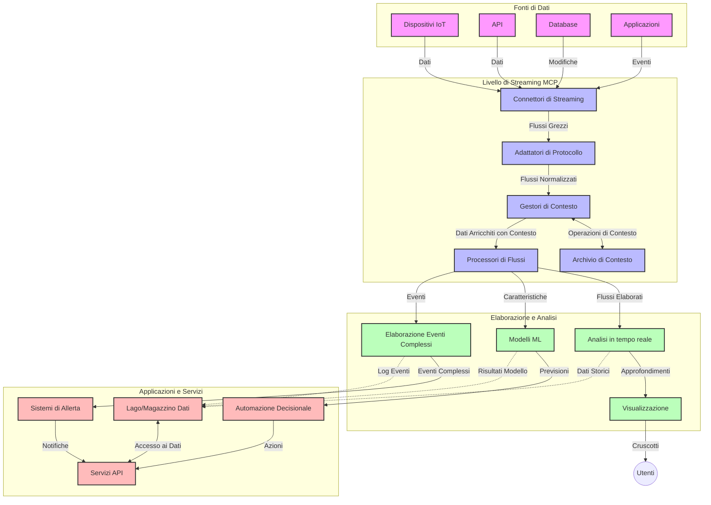

# Protocollo Model Context per lo Streaming di Dati in Tempo Reale

## Panoramica

Lo streaming di dati in tempo reale è diventato essenziale nel mondo odierno guidato dai dati, dove aziende e applicazioni richiedono accesso immediato alle informazioni per prendere decisioni tempestive. Il Protocollo Model Context (MCP) rappresenta un significativo avanzamento nell'ottimizzazione di questi processi di streaming in tempo reale, migliorando l'efficienza del trattamento dei dati, mantenendo l'integrità contestuale e migliorando le prestazioni complessive del sistema.

Questo modulo esplora come MCP trasformi lo streaming di dati in tempo reale offrendo un approccio standardizzato alla gestione del contesto tra modelli AI, piattaforme di streaming e applicazioni.

## Introduzione allo Streaming di Dati in Tempo Reale

Lo streaming di dati in tempo reale è un paradigma tecnologico che consente il trasferimento, l'elaborazione e l'analisi continui dei dati mentre vengono generati, permettendo ai sistemi di reagire immediatamente a nuove informazioni. A differenza del tradizionale batch processing che opera su dataset statici, lo streaming elabora dati in movimento, fornendo approfondimenti e azioni con minima latenza.

### Concetti Fondamentali dello Streaming di Dati in Tempo Reale:

- **Flusso Continuo di Dati**: I dati sono processati come un flusso continuo e infinito di eventi o record.
- **Elaborazione a Bassa Latenza**: I sistemi sono progettati per minimizzare il tempo tra la generazione e l'elaborazione dei dati.
- **Scalabilità**: Le architetture di streaming devono gestire volumi e velocità di dati variabili.
- **Tolleranza ai Guasti**: I sistemi devono essere resilienti contro i malfunzionamenti per assicurare un flusso dati ininterrotto.
- **Elaborazione Stateful**: Mantenere il contesto tra gli eventi è cruciale per analisi significative.

### Il Protocollo Model Context e lo Streaming in Tempo Reale

Il Protocollo Model Context (MCP) affronta molteplici sfide critiche negli ambienti di streaming in tempo reale:

1. **Continuità Contestuale**: MCP standardizza il modo in cui il contesto viene mantenuto tra componenti di streaming distribuiti, garantendo che modelli AI e nodi di elaborazione abbiano accesso al contesto storico e ambientale rilevante.

2. **Gestione Efficiente dello Stato**: Fornendo meccanismi strutturati per la trasmissione del contesto, MCP riduce il sovraccarico nella gestione dello stato nelle pipeline di streaming.

3. **Interoperabilità**: MCP crea un linguaggio comune per la condivisione del contesto tra diverse tecnologie di streaming e modelli AI, permettendo architetture più flessibili ed estendibili.

4. **Contesto Ottimizzato per lo Streaming**: Le implementazioni MCP possono dare priorità agli elementi di contesto più rilevanti per le decisioni in tempo reale, ottimizzando sia le prestazioni che l'accuratezza.

5. **Elaborazione Adattiva**: Con una gestione corretta del contesto tramite MCP, i sistemi di streaming possono adattare dinamicamente l'elaborazione in base a condizioni e schemi in evoluzione nei dati.

Nelle applicazioni moderne che spaziano dalle reti di sensori IoT alle piattaforme di trading finanziario, l'integrazione di MCP con tecnologie di streaming permette processi più intelligenti e consapevoli del contesto, capaci di rispondere appropriatamente a situazioni complesse ed in evoluzione in tempo reale.

## Obiettivi di Apprendimento

Al termine di questa lezione, sarai in grado di:

- Comprendere le basi dello streaming di dati in tempo reale e le sue sfide
- Spiegare come il Protocollo Model Context (MCP) migliori lo streaming di dati in tempo reale
- Implementare soluzioni di streaming basate su MCP utilizzando framework popolari come Kafka e Pulsar
- Progettare e distribuire architetture di streaming tolleranti ai guasti e ad alte prestazioni con MCP
- Applicare i concetti MCP a casi d'uso IoT, trading finanziario e analisi AI-driven
- Valutare le tendenze emergenti e le innovazioni future nelle tecnologie di streaming basate su MCP


### Definizione e Importanza

Lo streaming di dati in tempo reale coinvolge la generazione continua, l'elaborazione e la consegna di dati con latenza minima. A differenza del batch processing, dove i dati vengono raccolti e processati in gruppi, i dati in streaming sono processati incrementalmene al loro arrivo, abilitando approfondimenti e azioni immediate.

Le caratteristiche chiave dello streaming di dati in tempo reale includono:

- **Bassa Latenza**: Elaborare e analizzare dati entro millisecondi o secondi
- **Flusso Continuo**: Flussi ininterrotti di dati da varie fonti
- **Elaborazione Immediata**: Analizzare i dati man mano che arrivano e non a gruppi
- **Architettura Event-Driven**: Rispondere agli eventi non appena si verificano

### Sfide nello Streaming di Dati Tradizionale

Gli approcci tradizionali allo streaming dati presentano diverse limitazioni:

1. **Perdita di Contesto**: Difficoltà nel mantenere il contesto tra sistemi distribuiti
2. **Problemi di Scalabilità**: Sfide nel gestire dati ad alto volume e alta velocità
3. **Complessità di Integrazione**: Problemi di interoperabilità tra sistemi diversi
4. **Gestione della Latenza**: Bilanciare throughput e tempo di elaborazione
5. **Consistenza dei Dati**: Garantire accuratezza e completezza dei dati nel flusso

## Comprendere il Protocollo Model Context (MCP)

### Cos'è MCP?

Il Protocollo Model Context (MCP) è un protocollo di comunicazione standardizzato progettato per facilitare l'interazione efficiente tra modelli AI e applicazioni. Nel contesto dello streaming di dati in tempo reale, MCP fornisce un framework per:

- Preservare il contesto lungo tutta la pipeline di dati
- Standardizzare formati di scambio dati
- Ottimizzare la trasmissione di grandi dataset
- Migliorare la comunicazione modello-a-modello e modello-a-applicazione

### Componenti Chiave e Architettura

L’architettura MCP per lo streaming in tempo reale include vari componenti fondamentali:

1. **Context Handlers**: Gestiscono e mantengono informazioni contestuali lungo la pipeline di streaming
2. **Stream Processors**: Elaborano i flussi di dati in ingresso usando tecniche a consapevolezza contestuale
3. **Protocol Adapters**: Convertitori tra diversi protocolli di streaming preservando il contesto
4. **Context Store**: Memorizza e recupera efficientemente informazioni contestuali
5. **Streaming Connectors**: Connettono a diverse piattaforme di streaming (Kafka, Pulsar, Kinesis, ecc.)



### Come MCP Migliora la Gestione dei Dati in Tempo Reale

MCP affronta le sfide tradizionali dello streaming tramite:

- **Integrità Contestuale**: Mantenendo le relazioni tra punti dati lungo tutta la pipeline
- **Trasmissione Ottimizzata**: Riducendo la ridondanza nello scambio dati tramite gestione intelligente del contesto
- **Interfacce Standardizzate**: Fornendo API coerenti per i componenti di streaming
- **Latenza Ridotta**: Minimizzando il sovraccarico di elaborazione attraverso una gestione efficiente del contesto
- **Scalabilità Migliorata**: Supportando lo scaling orizzontale mantenendo il contesto

## Integrazione e Implementazione

I sistemi di streaming di dati in tempo reale richiedono una progettazione architetturale attenta e implementazioni specifiche per mantenere sia le prestazioni che l'integrità contestuale. Il Protocollo Model Context offre un approccio standardizzato per integrare modelli AI e tecnologie di streaming, permettendo pipeline di elaborazione più sofisticate e consapevoli del contesto.

### Panoramica sull’Integrazione MCP nelle Architetture di Streaming

Implementare MCP in ambienti di streaming in tempo reale implica considerazioni chiave:

1. **Serializzazione e Trasporto del Contesto**: MCP fornisce meccanismi efficienti per codificare informazioni contestuali all’interno dei pacchetti di dati in streaming, assicurando che il contesto essenziale accompagni i dati lungo tutta la pipeline di elaborazione. Ciò include formati di serializzazione standardizzati e ottimizzati per il trasporto in streaming.

2. **Elaborazione Stateful dei Flussi**: MCP abilita un’elaborazione stateful più intelligente mantenendo una rappresentazione del contesto coerente tra nodi di elaborazione. Questo è particolarmente prezioso nelle architetture di streaming distribuite dove la gestione dello stato è tradizionalmente difficile.

3. **Tempo Evento vs Tempo Elaborazione**: Le implementazioni MCP nei sistemi di streaming devono affrontare la comune sfida di differenziare quando sono avvenuti gli eventi e quando vengono elaborati. Il protocollo può incorporare contesto temporale che preserva la semantica del tempo evento.

4. **Gestione del Backpressure**: Standardizzando la gestione del contesto, MCP aiuta a gestire il backpressure nei sistemi di streaming, permettendo ai componenti di comunicare le proprie capacità di elaborazione e regolare il flusso di conseguenza.

5. **Windowing e Aggregazione del Contesto**: MCP facilita operazioni di windowing più sofisticate fornendo rappresentazioni strutturate di contesti temporali e relazionali, abilitando aggregazioni più significative su flussi di eventi.

6. **Elaborazione Exactly-Once**: Nei sistemi di streaming che richiedono semantica exactly-once, MCP può incorporare metadati di processo per aiutare a tracciare e verificare lo stato di elaborazione tra componenti distribuiti.

L’implementazione di MCP nelle diverse tecnologie di streaming crea un approccio unificato alla gestione del contesto, riducendo la necessità di codice di integrazione personalizzato e migliorando la capacità del sistema di mantenere un contesto significativo durante il flusso dati.

### MCP in Vari Framework di Streaming Dati

Questi esempi seguono la specifica MCP attuale che si concentra su un protocollo basato su JSON-RPC con meccanismi di trasporto distinti. Il codice dimostra come implementare trasporti personalizzati che integrano piattaforme di streaming come Kafka e Pulsar mantenendo piena compatibilità con il protocollo MCP.

Gli esempi sono progettati per mostrare come piattaforme di streaming possano essere integrate con MCP per fornire elaborazione dati in tempo reale mantenendo la consapevolezza contestuale centrale per MCP. Questo approccio assicura che i campioni di codice riflettano accuratamente lo stato attuale della specifica MCP a giugno 2025.

MCP può essere integrato con framework di streaming popolari tra cui:

#### Integrazione Apache Kafka

```python
import asyncio
import json
from typing import Dict, Any, Optional
from confluent_kafka import Consumer, Producer, KafkaError
from mcp.client import Client, ClientCapabilities
from mcp.core.message import JsonRpcMessage
from mcp.core.transports import Transport

# Classe di trasporto personalizzata per collegare MCP con Kafka
class KafkaMCPTransport(Transport):
    def __init__(self, bootstrap_servers: str, input_topic: str, output_topic: str):
        self.bootstrap_servers = bootstrap_servers
        self.input_topic = input_topic
        self.output_topic = output_topic
        self.producer = Producer({'bootstrap.servers': bootstrap_servers})
        self.consumer = Consumer({
            'bootstrap.servers': bootstrap_servers,
            'group.id': 'mcp-client-group',
            'auto.offset.reset': 'earliest'
        })
        self.message_queue = asyncio.Queue()
        self.running = False
        self.consumer_task = None
        
    async def connect(self):
        """Connect to Kafka and start consuming messages"""
        self.consumer.subscribe([self.input_topic])
        self.running = True
        self.consumer_task = asyncio.create_task(self._consume_messages())
        return self
        
    async def _consume_messages(self):
        """Background task to consume messages from Kafka and queue them for processing"""
        while self.running:
            try:
                msg = self.consumer.poll(1.0)
                if msg is None:
                    await asyncio.sleep(0.1)
                    continue
                
                if msg.error():
                    if msg.error().code() == KafkaError._PARTITION_EOF:
                        continue
                    print(f"Consumer error: {msg.error()}")
                    continue
                
                # Analizza il valore del messaggio come JSON-RPC
                try:
                    message_str = msg.value().decode('utf-8')
                    message_data = json.loads(message_str)
                    mcp_message = JsonRpcMessage.from_dict(message_data)
                    await self.message_queue.put(mcp_message)
                except Exception as e:
                    print(f"Error parsing message: {e}")
            except Exception as e:
                print(f"Error in consumer loop: {e}")
                await asyncio.sleep(1)
    
    async def read(self) -> Optional[JsonRpcMessage]:
        """Read the next message from the queue"""
        try:
            message = await self.message_queue.get()
            return message
        except Exception as e:
            print(f"Error reading message: {e}")
            return None
    
    async def write(self, message: JsonRpcMessage) -> None:
        """Write a message to the Kafka output topic"""
        try:
            message_json = json.dumps(message.to_dict())
            self.producer.produce(
                self.output_topic,
                message_json.encode('utf-8'),
                callback=self._delivery_report
            )
            self.producer.poll(0)  # Attiva le callback
        except Exception as e:
            print(f"Error writing message: {e}")
    
    def _delivery_report(self, err, msg):
        """Kafka producer delivery callback"""
        if err is not None:
            print(f'Message delivery failed: {err}')
        else:
            print(f'Message delivered to {msg.topic()} [{msg.partition()}]')
    
    async def close(self) -> None:
        """Close the transport"""
        self.running = False
        if self.consumer_task:
            self.consumer_task.cancel()
            try:
                await self.consumer_task
            except asyncio.CancelledError:
                pass
        self.consumer.close()
        self.producer.flush()

# Esempio di utilizzo del trasporto Kafka MCP
async def kafka_mcp_example():
    # Crea il client MCP con trasporto Kafka
    client = Client(
        {"name": "kafka-mcp-client", "version": "1.0.0"},
        ClientCapabilities({})
    )
    
    # Crea e connetti il trasporto Kafka
    transport = KafkaMCPTransport(
        bootstrap_servers="localhost:9092",
        input_topic="mcp-responses",
        output_topic="mcp-requests"
    )
    
    await client.connect(transport)
    
    try:
        # Inizializza la sessione MCP
        await client.initialize()
        
        # Esempio di esecuzione di uno strumento tramite MCP
        response = await client.execute_tool(
            "process_data",
            {
                "data": "sample data",
                "metadata": {
                    "source": "sensor-1",
                    "timestamp": "2025-06-12T10:30:00Z"
                }
            }
        )
        
        print(f"Tool execution response: {response}")
        
        # Spegnimento pulito
        await client.shutdown()
    finally:
        await transport.close()

# Esegui l'esempio
if __name__ == "__main__":
    asyncio.run(kafka_mcp_example())
```

#### Implementazione Apache Pulsar

```python
import asyncio
import json
import pulsar
from typing import Dict, Any, Optional
from mcp.core.message import JsonRpcMessage
from mcp.core.transports import Transport
from mcp.server import Server, ServerOptions
from mcp.server.tools import Tool, ToolExecutionContext, ToolMetadata

# Crea un trasporto MCP personalizzato che utilizza Pulsar
class PulsarMCPTransport(Transport):
    def __init__(self, service_url: str, request_topic: str, response_topic: str):
        self.service_url = service_url
        self.request_topic = request_topic
        self.response_topic = response_topic
        self.client = pulsar.Client(service_url)
        self.producer = self.client.create_producer(response_topic)
        self.consumer = self.client.subscribe(
            request_topic,
            "mcp-server-subscription",
            consumer_type=pulsar.ConsumerType.Shared
        )
        self.message_queue = asyncio.Queue()
        self.running = False
        self.consumer_task = None
    
    async def connect(self):
        """Connect to Pulsar and start consuming messages"""
        self.running = True
        self.consumer_task = asyncio.create_task(self._consume_messages())
        return self
    
    async def _consume_messages(self):
        """Background task to consume messages from Pulsar and queue them for processing"""
        while self.running:
            try:
                # Ricezione non bloccante con timeout
                msg = self.consumer.receive(timeout_millis=500)
                
                # Elabora il messaggio
                try:
                    message_str = msg.data().decode('utf-8')
                    message_data = json.loads(message_str)
                    mcp_message = JsonRpcMessage.from_dict(message_data)
                    await self.message_queue.put(mcp_message)
                    
                    # Conferma il messaggio
                    self.consumer.acknowledge(msg)
                except Exception as e:
                    print(f"Error processing message: {e}")
                    # Negativa la conferma se si è verificato un errore
                    self.consumer.negative_acknowledge(msg)
            except Exception as e:
                # Gestisci timeout o altre eccezioni
                await asyncio.sleep(0.1)
    
    async def read(self) -> Optional[JsonRpcMessage]:
        """Read the next message from the queue"""
        try:
            message = await self.message_queue.get()
            return message
        except Exception as e:
            print(f"Error reading message: {e}")
            return None
    
    async def write(self, message: JsonRpcMessage) -> None:
        """Write a message to the Pulsar output topic"""
        try:
            message_json = json.dumps(message.to_dict())
            self.producer.send(message_json.encode('utf-8'))
        except Exception as e:
            print(f"Error writing message: {e}")
    
    async def close(self) -> None:
        """Close the transport"""
        self.running = False
        if self.consumer_task:
            self.consumer_task.cancel()
            try:
                await self.consumer_task
            except asyncio.CancelledError:
                pass
        self.consumer.close()
        self.producer.close()
        self.client.close()

# Definisci uno strumento MCP di esempio che elabora dati in streaming
@Tool(
    name="process_streaming_data",
    description="Process streaming data with context preservation",
    metadata=ToolMetadata(
        required_capabilities=["streaming"]
    )
)
async def process_streaming_data(
    ctx: ToolExecutionContext,
    data: str,
    source: str,
    priority: str = "medium"
) -> Dict[str, Any]:
    """
    Process streaming data while preserving context
    
    Args:
        ctx: Tool execution context
        data: The data to process
        source: The source of the data
        priority: Priority level (low, medium, high)
        
    Returns:
        Dict containing processed results and context information
    """
    # Esempio di elaborazione che utilizza il contesto MCP
    print(f"Processing data from {source} with priority {priority}")
    
    # Accedi al contesto della conversazione da MCP
    conversation_id = ctx.conversation_id if hasattr(ctx, 'conversation_id') else "unknown"
    
    # Restituisci i risultati con contesto migliorato
    return {
        "processed_data": f"Processed: {data}",
        "context": {
            "conversation_id": conversation_id,
            "source": source,
            "priority": priority,
            "processing_timestamp": ctx.get_current_time_iso()
        }
    }

# Esempio di implementazione server MCP utilizzando il trasporto Pulsar
async def run_mcp_server_with_pulsar():
    # Crea il server MCP
    server = Server(
        {"name": "pulsar-mcp-server", "version": "1.0.0"},
        ServerOptions(
            capabilities={"streaming": True}
        )
    )
    
    # Registra il nostro strumento
    server.register_tool(process_streaming_data)
    
    # Crea e connetti il trasporto Pulsar
    transport = PulsarMCPTransport(
        service_url="pulsar://localhost:6650",
        request_topic="mcp-requests",
        response_topic="mcp-responses"
    )
    
    try:
        # Avvia il server con il trasporto Pulsar
        await server.run(transport)
    finally:
        await transport.close()

# Esegui il server
if __name__ == "__main__":
    asyncio.run(run_mcp_server_with_pulsar())
```

### Best Practices per il Deployment

Quando si implementa MCP per lo streaming in tempo reale:

1. **Progetta per la Tolleranza ai Guasti**:
   - Implementa una gestione corretta degli errori
   - Usa code dead-letter per messaggi falliti
   - Progetta processori idempotenti

2. **Ottimizza le Prestazioni**:
   - Configura dimensioni buffer appropriate
   - Usa batching ove opportuno
   - Implementa meccanismi di backpressure

3. **Monitora e Osserva**:
   - Traccia metriche di elaborazione stream
   - Monitora la propagazione del contesto
   - Imposta alert per anomalie

4. **Metti in Sicurezza i Tuoi Stream**:
   - Implementa crittografia per dati sensibili
   - Usa autenticazione e autorizzazione
   - Applica controlli di accesso adeguati


### MCP in IoT e Edge Computing

MCP migliora lo streaming IoT:

- Preservando il contesto dei dispositivi lungo la pipeline di elaborazione
- Abilitando streaming dati efficienti da edge a cloud
- Supportando analisi in tempo reale sui flussi dati IoT
- Facilitando comunicazioni device-to-device con contesto

Esempio: Reti di Sensori della Smart City
```
Sensors → Edge Gateways → MCP Stream Processors → Real-time Analytics → Automated Responses
```

### Ruolo nelle Transazioni Finanziarie e High-Frequency Trading

MCP offre vantaggi significativi per lo streaming di dati finanziari:

- Elaborazione a latenza ultra-bassa per decisioni di trading
- Mantenimento del contesto di transazione durante l’elaborazione
- Supporto a complessi processi event-driven con consapevolezza contestuale
- Garanzia di consistenza dati in sistemi distribuiti di trading

### Potenziare l’Analitica AI-Driven

MCP apre nuove possibilità per l’analitica in streaming:

- Addestramento e inferenza modelli in tempo reale
- Apprendimento continuo da dati in streaming
- Estrazione di feature consapevole del contesto
- Pipeline di inferenza multi-modello con contesto preservato

## Tendenze Future e Innovazioni

### Evoluzione di MCP negli Ambienti in Tempo Reale

Guardando al futuro, ci aspettiamo che MCP evolva per affrontare:

- **Integrazione con il Calcolo Quantistico**: Prepararsi a sistemi di streaming basati su quantum computing
- **Elaborazione Edge-Native**: Spostare più elaborazioni contestuali sui dispositivi edge
- **Gestione Autonoma dei Flussi**: Pipeline di streaming auto-ottimizzanti
- **Streaming Federato**: Elaborazione distribuita preservando la privacy

### Possibili Progressi Tecnologici

Tecnologie emergenti che plasmeranno il futuro dello streaming MCP:

1. **Protocolli di Streaming Ottimizzati per AI**: Protocolli personalizzati specifici per carichi AI
2. **Integrazione con Calcolo Neuromorfico**: Elaborazione ispirata al cervello per streaming
3. **Streaming Serverless**: Streaming event-driven scalabile senza gestione infrastrutturale
4. **Context Store Distribuiti**: Gestione del contesto globalmente distribuita ma altamente consistente

## Esercizi Pratici

### Esercizio 1: Configurare una Pipeline di Streaming MCP Base

In questo esercizio imparerai a:
- Configurare un ambiente base di streaming MCP
- Implementare context handler per l'elaborazione stream
- Testare e validare la preservazione del contesto

### Esercizio 2: Costruire una Dashboard di Analytics in Tempo Reale

Crea un’applicazione completa che:
- Ingesta dati in streaming usando MCP
- Processa lo stream mantenendo il contesto
- Visualizza i risultati in tempo reale

### Esercizio 3: Implementare una Elaborazione Complessa di Eventi con MCP

Esercizio avanzato che copre:
- Rilevamento di pattern nei flussi
- Correlazione contestuale tra molteplici stream
- Generazione di eventi complessi con contesto preservato

## Risorse Aggiuntive

- [Model Context Protocol Specification](https://modelcontextprotocol.io) - Specifica ufficiale MCP e documentazione
- [Apache Kafka Documentation](https://kafka.apache.org/documentation/) - Informazioni su Kafka per l'elaborazione stream
- [Apache Pulsar](https://pulsar.apache.org/) - Piattaforma unificata di messaggistica e streaming
- [Streaming Systems: The What, Where, When, and How of Large-Scale Data Processing](https://www.oreilly.com/library/view/streaming-systems/9781491983867/) - Libro esaustivo sulle architetture di streaming
- [Microsoft Azure Event Hubs](https://learn.microsoft.com/azure/event-hubs/event-hubs-about) - Servizio gestito di streaming eventi
- [MLflow Documentation](https://mlflow.org/docs/latest/index.html) - Per il tracking e deployment di modelli ML
- [Real-Time Analytics with Apache Storm](https://storm.apache.org/releases/current/index.html) - Framework per il calcolo in tempo reale
- [Flink ML](https://nightlies.apache.org/flink/flink-ml-docs-master/) - Libreria di machine learning per Apache Flink
- [LangChain Documentation](https://python.langchain.com/docs/get_started/introduction) - Costruire applicazioni con LLM


## Risultati di Apprendimento

Completando questo modulo, sarai in grado di:

- Comprendere i fondamenti dello streaming di dati in tempo reale e le sue sfide
- Spiegare come il Protocollo Model Context (MCP) migliori lo streaming di dati in tempo reale
- Implementare soluzioni di streaming basate su MCP utilizzando framework popolari come Kafka e Pulsar
- Progettare e distribuire architetture di streaming tolleranti ai guasti e ad alte prestazioni con MCP
- Applicare i concetti MCP a casi d’uso IoT, trading finanziario e analisi AI-driven
- Valutare tendenze emergenti e innovazioni future nelle tecnologie di streaming basate su MCP

## Cosa c'è dopo

- [5.11 Realtime Search](../mcp-realtimesearch/README.md)

---

<!-- CO-OP TRANSLATOR DISCLAIMER START -->
**Disclaimer**:
Questo documento è stato tradotto utilizzando il servizio di traduzione AI [Co-op Translator](https://github.com/Azure/co-op-translator). Sebbene ci impegniamo per garantire la precisione, si prega di notare che le traduzioni automatizzate possono contenere errori o imprecisioni. Il documento originale nella sua lingua nativa deve essere considerato la fonte autorevole. Per informazioni critiche, si raccomanda una traduzione professionale effettuata da un essere umano. Non siamo responsabili per eventuali malintesi o interpretazioni errate derivanti dall’uso di questa traduzione.
<!-- CO-OP TRANSLATOR DISCLAIMER END -->