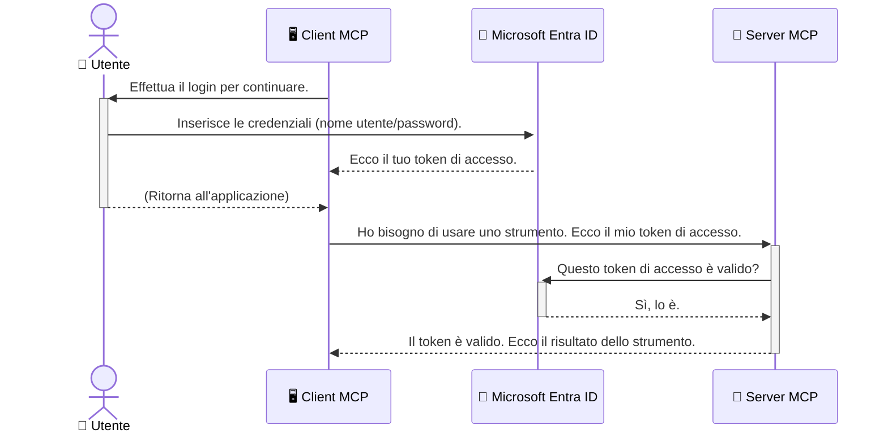

# Protezione dei Workflow AI: Autenticazione Entra ID per i Server del Protocollo Model Context

## Introduzione
Proteggere il tuo server Model Context Protocol (MCP) è importante quanto chiudere la porta di casa a chiave. Lasciare il tuo server MCP aperto espone i tuoi strumenti e dati ad accessi non autorizzati, che possono portare a violazioni di sicurezza. Microsoft Entra ID offre una soluzione robusta di gestione delle identità e degli accessi basata sul cloud, aiutando a garantire che solo utenti e applicazioni autorizzati possano interagire con il tuo server MCP. In questa sezione imparerai come proteggere i tuoi workflow AI utilizzando l’autenticazione Entra ID.

## Obiettivi di Apprendimento
Al termine di questa sezione, sarai in grado di:

- Comprendere l’importanza di proteggere i server MCP.
- Spiegare le basi di Microsoft Entra ID e l’autenticazione OAuth 2.0.
- Riconoscere la differenza tra client pubblici e client riservati.
- Implementare l’autenticazione Entra ID sia in scenari con server MCP locale (client pubblico) sia remoto (client riservato).
- Applicare le migliori pratiche di sicurezza nello sviluppo di workflow AI.

## Sicurezza e MCP

Proprio come non lasceresti la porta di casa aperta, non dovresti lasciare il tuo server MCP accessibile a chiunque. Proteggere i tuoi workflow AI è essenziale per costruire applicazioni robuste, affidabili e sicure. Questo capitolo ti introdurrà all’uso di Microsoft Entra ID per proteggere i tuoi server MCP, assicurando che solo utenti e applicazioni autorizzati possano interagire con i tuoi strumenti e dati.

## Perché la Sicurezza è Importante per i Server MCP

Immagina che il tuo server MCP abbia uno strumento che può inviare email o accedere a un database clienti. Un server non protetto significherebbe che chiunque potrebbe potenzialmente usare quello strumento, portando ad accessi non autorizzati ai dati, spam o altre attività dannose.

Implementando l’autenticazione, garantisci che ogni richiesta al tuo server venga verificata, confermando l’identità dell’utente o dell’applicazione che fa la richiesta. Questo è il primo e più critico passo per proteggere i tuoi workflow AI.

## Introduzione a Microsoft Entra ID

[**Microsoft Entra ID**](https://adoption.microsoft.com/microsoft-security/entra/) è un servizio cloud per la gestione delle identità e degli accessi. Pensalo come una guardia di sicurezza universale per le tue applicazioni. Gestisce il complesso processo di verifica delle identità degli utenti (autenticazione) e determina cosa sono autorizzati a fare (autorizzazione).

Usando Entra ID, puoi:

- Abilitare l’accesso sicuro per gli utenti.
- Proteggere API e servizi.
- Gestire le politiche di accesso da un’unica posizione centrale.

Per i server MCP, Entra ID offre una soluzione robusta e ampiamente affidabile per gestire chi può accedere alle capacità del tuo server.

---

## Capire la Magia: Come Funziona l’Autenticazione Entra ID

Entra ID utilizza standard aperti come **OAuth 2.0** per gestire l’autenticazione. Sebbene i dettagli possano essere complessi, il concetto base è semplice e può essere compreso con un’analogia.

### Una Introduzione Semplice a OAuth 2.0: La Chiave Valet

Pensa a OAuth 2.0 come a un servizio valet per la tua auto. Quando arrivi in un ristorante, non dai al valet la tua chiave principale. Invece, gli fornisci una **chiave valet** che ha permessi limitati—può avviare l’auto e chiudere le porte, ma non può aprire il bagagliaio o il vano portaoggetti.

In questa analogia:

- **Tu** sei l’**Utente**.
- **La tua auto** è il **Server MCP** con i suoi strumenti e dati preziosi.
- Il **Valet** è **Microsoft Entra ID**.
- L’**Addetto al Parcheggio** è il **Client MCP** (l’applicazione che cerca di accedere al server).
- La **Chiave Valet** è il **Token di Accesso**.

Il token di accesso è una stringa sicura di testo che il client MCP riceve da Entra ID dopo che hai effettuato l’accesso. Il client presenta questo token al server MCP ad ogni richiesta. Il server può verificare il token per assicurarsi che la richiesta sia legittima e che il client abbia i permessi necessari, il tutto senza mai dover gestire direttamente le tue credenziali effettive (come la password).

### Il Flusso di Autenticazione

Ecco come funziona il processo in pratica:



### Introduzione alla Microsoft Authentication Library (MSAL)

Prima di entrare nel codice, è importante introdurre un componente chiave che vedrai negli esempi: la **Microsoft Authentication Library (MSAL)**.

MSAL è una libreria sviluppata da Microsoft che rende molto più facile per gli sviluppatori gestire l’autenticazione. Invece di dover scrivere tutto il codice complesso per gestire i token di sicurezza, il login e il rinnovo delle sessioni, MSAL si occupa del lavoro più pesante.

L’uso di una libreria come MSAL è fortemente consigliato perché:

- **È sicura:** implementa protocolli di settore e le migliori pratiche di sicurezza, riducendo i rischi di vulnerabilità nel tuo codice.
- **Semplifica lo sviluppo:** nasconde la complessità dei protocolli OAuth 2.0 e OpenID Connect, permettendoti di aggiungere un’autenticazione robusta alla tua applicazione con poche righe di codice.
- **È mantenuta:** Microsoft mantiene e aggiorna attivamente MSAL per affrontare nuove minacce di sicurezza e cambiamenti di piattaforma.

MSAL supporta un’ampia varietà di linguaggi e framework applicativi, inclusi .NET, JavaScript/TypeScript, Python, Java, Go e piattaforme mobili come iOS e Android. Questo significa che puoi usare gli stessi modelli di autenticazione coerenti su tutta la tua infrastruttura tecnologica.

Per saperne di più su MSAL, puoi consultare la documentazione ufficiale [Panoramica di MSAL](https://learn.microsoft.com/entra/identity-platform/msal-overview).

---

## Proteggere il Tuo Server MCP con Entra ID: Guida Passo Dopo Passo

Ora vediamo come proteggere un server MCP locale (che comunica tramite `stdio`) usando Entra ID. Questo esempio usa un **client pubblico**, adatto per applicazioni che girano sulla macchina di un utente, come un’app desktop o un server di sviluppo locale.

### Scenario 1: Proteggere un Server MCP Locale (con un Client Pubblico)

In questo scenario, esamineremo un server MCP che esegue localmente, comunica tramite `stdio` e utilizza Entra ID per autenticare l’utente prima di permettere l’accesso agli strumenti. Il server avrà un singolo strumento che recupera le informazioni del profilo utente tramite Microsoft Graph API.

#### 1. Configurare l’Applicazione in Entra ID

Prima di scrivere codice, devi registrare la tua applicazione in Microsoft Entra ID. Questo dice a Entra ID di riconoscere la tua applicazione e le concede il permesso di usare il servizio di autenticazione.

1. Naviga al **[portale Microsoft Entra](https://entra.microsoft.com/)**.
2. Vai su **Registrazioni app** e clicca su **Nuova registrazione**.
3. Dai un nome alla tua applicazione (es. "My Local MCP Server").
4. Per **Tipi di account supportati**, seleziona **Account in questa directory organizzativa solo**.
5. Puoi lasciare vuoto il campo **URI di reindirizzamento** per questo esempio.
6. Clicca su **Registra**.

Una volta registrata, annota l’**ID applicazione (client)** e l’**ID directory (tenant)**. Ti serviranno nel codice.

#### 2. Il Codice: Una Panoramica

Vediamo le parti chiave del codice che gestiscono l’autenticazione. Il codice completo di questo esempio è disponibile nella cartella [Entra ID - Local - WAM](https://github.com/Azure-Samples/mcp-auth-servers/tree/main/src/entra-id-local-wam) del [repository GitHub mcp-auth-servers](https://github.com/Azure-Samples/mcp-auth-servers).

**`AuthenticationService.cs`**

Questa classe gestisce l’interazione con Entra ID.

- **`CreateAsync`**: questo metodo inizializza `PublicClientApplication` dalla libreria MSAL (Microsoft Authentication Library). È configurato con il `clientId` e il `tenantId` della tua applicazione.
- **`WithBroker`**: abilita l’uso di un broker (come il Windows Web Account Manager), che fornisce un’esperienza di single sign-on più sicura e fluida.
- **`AcquireTokenAsync`**: è il metodo principale. Tenta innanzitutto di ottenere un token silenziosamente (l’utente non deve effettuare il login se ha già una sessione valida). Se non si riesce a ottenere un token silenzioso, richiede all’utente di autenticarsi interattivamente.

```csharp
// Simplified for clarity
public static async Task<AuthenticationService> CreateAsync(ILogger<AuthenticationService> logger)
{
    var msalClient = PublicClientApplicationBuilder
        .Create(_clientId) // Your Application (client) ID
        .WithAuthority(AadAuthorityAudience.AzureAdMyOrg)
        .WithTenantId(_tenantId) // Your Directory (tenant) ID
        .WithBroker(new BrokerOptions(BrokerOptions.OperatingSystems.Windows))
        .Build();

    // ... cache registration ...

    return new AuthenticationService(logger, msalClient);
}

public async Task<string> AcquireTokenAsync()
{
    try
    {
        // Try silent authentication first
        var accounts = await _msalClient.GetAccountsAsync();
        var account = accounts.FirstOrDefault();

        AuthenticationResult? result = null;

        if (account != null)
        {
            result = await _msalClient.AcquireTokenSilent(_scopes, account).ExecuteAsync();
        }
        else
        {
            // If no account, or silent fails, go interactive
            result = await _msalClient.AcquireTokenInteractive(_scopes).ExecuteAsync();
        }

        return result.AccessToken;
    }
    catch (Exception ex)
    {
        _logger.LogError(ex, "An error occurred while acquiring the token.");
        throw; // Optionally rethrow the exception for higher-level handling
    }
}
```

**`Program.cs`**

Qui viene configurato il server MCP e integrato il servizio di autenticazione.

- **`AddSingleton<AuthenticationService>`**: registra `AuthenticationService` nel contenitore di dependency injection, permettendone l’uso in altre parti dell’applicazione (come lo strumento).
- **Lo strumento `GetUserDetailsFromGraph`**: richiede un’istanza di `AuthenticationService`. Prima di fare qualsiasi cosa, chiama `authService.AcquireTokenAsync()` per ottenere un token di accesso valido. Se l’autenticazione ha successo, usa il token per chiamare Microsoft Graph API e recuperare i dettagli dell’utente.

```csharp
// Simplified for clarity
[McpServerTool(Name = "GetUserDetailsFromGraph")]
public static async Task<string> GetUserDetailsFromGraph(
    AuthenticationService authService)
{
    try
    {
        // This will trigger the authentication flow
        var accessToken = await authService.AcquireTokenAsync();

        // Use the token to create a GraphServiceClient
        var graphClient = new GraphServiceClient(
            new BaseBearerTokenAuthenticationProvider(new TokenProvider(authService)));

        var user = await graphClient.Me.GetAsync();

        return System.Text.Json.JsonSerializer.Serialize(user);
    }
    catch (Exception ex)
    {
        return $"Error: {ex.Message}";
    }
}
```

#### 3. Come Funziona Nel Complesso

1. Quando il client MCP prova a usare lo strumento `GetUserDetailsFromGraph`, lo strumento chiama prima `AcquireTokenAsync`.
2. `AcquireTokenAsync` fa sì che la libreria MSAL verifichi se esiste un token valido.
3. Se non viene trovato alcun token, MSAL, tramite il broker, chiede all’utente di eseguire il login con il proprio account Entra ID.
4. Dopo il login, Entra ID emette un token di accesso.
5. Lo strumento riceve il token e lo usa per fare una chiamata sicura a Microsoft Graph API.
6. I dettagli dell’utente vengono restituiti al client MCP.

Questo processo garantisce che solo utenti autenticati possano usare lo strumento, proteggendo efficacemente il tuo server MCP locale.

### Scenario 2: Proteggere un Server MCP Remoto (con un Client Riservato)

Quando il tuo server MCP è in esecuzione su una macchina remota (come un server cloud) e comunica tramite un protocollo come HTTP Streaming, le esigenze di sicurezza sono diverse. In questo caso, si dovrebbe usare un **client riservato** e il flusso di autorizzazione Authorization Code Flow. Questo metodo è più sicuro perché i segreti dell’applicazione non vengono mai esposti al browser.

Questo esempio usa un server MCP basato su TypeScript che utilizza Express.js per gestire le richieste HTTP.

#### 1. Configurare l’Applicazione in Entra ID

La configurazione in Entra ID è simile a quella per il client pubblico, ma con una differenza chiave: devi creare un **segreto client**.

1. Naviga al **[portale Microsoft Entra](https://entra.microsoft.com/)**.
2. Nella registrazione della tua app, vai alla scheda **Certificati e segreti**.
3. Clicca su **Nuovo segreto client**, inserisci una descrizione e clicca su **Aggiungi**.
4. **Importante:** copia subito il valore del segreto. Non potrai più vederlo.
5. Devi anche configurare un **URI di reindirizzamento**. Vai alla scheda **Autenticazione**, clicca su **Aggiungi una piattaforma**, seleziona **Web** e inserisci l’URI di reindirizzamento per la tua applicazione (es. `http://localhost:3001/auth/callback`).

> **⚠️ Nota Importante sulla Sicurezza:** Per applicazioni in produzione, Microsoft raccomanda fortemente di usare metodi di **autenticazione senza segreti**, come **Managed Identity** o **Workload Identity Federation**, invece dei segreti client. I segreti client comportano rischi di sicurezza perché possono essere esposti o compromessi. Le identità gestite offrono un approccio più sicuro eliminando la necessità di memorizzare credenziali nel codice o nella configurazione.
>
> Per maggiori informazioni sulle identità gestite e su come implementarle, consulta la [Panoramica delle identità gestite per le risorse Azure](https://learn.microsoft.com/entra/identity/managed-identities-azure-resources/overview).

#### 2. Il Codice: Una Panoramica

Questo esempio usa un approccio basato su sessioni. Quando l’utente si autentica, il server memorizza il token di accesso e il token di aggiornamento in una sessione e dà all’utente un token di sessione. Questo token di sessione viene poi usato per le richieste successive. Il codice completo di questo esempio è disponibile nella cartella [Entra ID - Confidential client](https://github.com/Azure-Samples/mcp-auth-servers/tree/main/src/entra-id-cca-session) del [repository GitHub mcp-auth-servers](https://github.com/Azure-Samples/mcp-auth-servers).

**`Server.ts`**

Questo file configura il server Express e il livello di trasporto MCP.

- **`requireBearerAuth`**: è un middleware che protegge gli endpoint `/sse` e `/message`. Controlla la presenza di un token bearer valido nell’intestazione `Authorization` della richiesta.
- **`EntraIdServerAuthProvider`**: è una classe personalizzata che implementa l’interfaccia `McpServerAuthorizationProvider`. Si occupa di gestire il flusso OAuth 2.0.
- **`/auth/callback`**: questo endpoint gestisce il reindirizzamento da Entra ID dopo che l’utente si è autenticato. Scambia il codice di autorizzazione con un token di accesso e un token di aggiornamento.

```typescript
// Semplificato per chiarezza
const app = express();
const { server } = createServer();
const provider = new EntraIdServerAuthProvider();

// Proteggi il punto di accesso SSE
app.get("/sse", requireBearerAuth({
  provider,
  requiredScopes: ["User.Read"]
}), async (req, res) => {
  // ... connettersi al trasporto ...
});

// Proteggi il punto di accesso del messaggio
app.post("/message", requireBearerAuth({
  provider,
  requiredScopes: ["User.Read"]
}), async (req, res) => {
  // ... gestire il messaggio ...
});

// Gestisci il callback OAuth 2.0
app.get("/auth/callback", (req, res) => {
  provider.handleCallback(req.query.code, req.query.state)
    .then(result => {
      // ... gestire successo o fallimento ...
    });
});
```

**`Tools.ts`**

Questo file definisce gli strumenti forniti dal server MCP. Lo strumento `getUserDetails` è simile a quello dell’esempio precedente, ma recupera il token di accesso dalla sessione.

```typescript
// Semplificato per chiarezza
server.setRequestHandler(CallToolRequestSchema, async (request) => {
  const { name } = request.params;
  const context = request.params?.context as { token?: string } | undefined;
  const sessionToken = context?.token;

  if (name === ToolName.GET_USER_DETAILS) {
    if (!sessionToken) {
      throw new AuthenticationError("Authentication token is missing or invalid. Ensure the token is provided in the request context.");
    }

    // Ottieni il token Entra ID dal negozio di sessione
    const tokenData = tokenStore.getToken(sessionToken);
    const entraIdToken = tokenData.accessToken;

    const graphClient = Client.init({
      authProvider: (done) => {
        done(null, entraIdToken);
      }
    });

    const user = await graphClient.api('/me').get();

    // ... restituisci dettagli utente ...
  }
});
```

**`auth/EntraIdServerAuthProvider.ts`**

Questa classe gestisce la logica per:

- Reindirizzare l’utente alla pagina di login Entra ID.
- Scambiare il codice di autorizzazione con un token di accesso.
- Memorizzare i token nel `tokenStore`.
- Rinnovare il token di accesso quando scade.

#### 3. Come Funziona Nel Complesso

1. Quando un utente prova a connettersi per la prima volta al server MCP, il middleware `requireBearerAuth` rileva che non ha una sessione valida e lo reindirizza alla pagina di login di Entra ID.
2. L’utente effettua l’accesso con il proprio account Entra ID.
3. Entra ID reindirizza l’utente nuovamente all’endpoint `/auth/callback` con un codice di autorizzazione.  
4. Il server scambia il codice con un token di accesso e un token di aggiornamento, li memorizza e crea un token di sessione che viene inviato al client.  
5. Il client può ora utilizzare questo token di sessione nell’intestazione `Authorization` per tutte le richieste future al server MCP.  
6. Quando viene chiamato lo strumento `getUserDetails`, utilizza il token di sessione per recuperare il token di accesso Entra ID e poi usa questo per chiamare l’API Microsoft Graph.

Questo flusso è più complesso rispetto al flusso del client pubblico, ma è necessario per gli endpoint esposti su internet. Poiché i server MCP remoti sono accessibili tramite internet pubblico, necessitano di misure di sicurezza più robuste per proteggersi dagli accessi non autorizzati e da possibili attacchi.


## Best Practice di Sicurezza

- **Usa sempre HTTPS**: Cripta la comunicazione tra client e server per proteggere i token da intercettazioni.  
- **Implementa il Controllo degli Accessi Basato sui Ruoli (RBAC)**: Non verificare solo *se* un utente è autenticato; controlla *cosa* è autorizzato a fare. Puoi definire ruoli in Entra ID e verificarli nel tuo server MCP.  
- **Monitora e effettua audit**: Registra tutti gli eventi di autenticazione per poter rilevare e rispondere ad attività sospette.  
- **Gestisci limitazioni di velocità e throttling**: Microsoft Graph e altre API implementano limitazioni di velocità per prevenire abusi. Implementa backoff esponenziale e logica di retry nel tuo server MCP per gestire in modo elegante le risposte HTTP 429 (Too Many Requests). Considera di caching dei dati frequentemente accessi per ridurre le chiamate API.  
- **Conservazione sicura dei token**: Memorizza in modo sicuro i token di accesso e di aggiornamento. Per applicazioni locali, utilizza i meccanismi di storage sicuro del sistema. Per applicazioni server, considera lo storage crittografato o servizi di gestione chiavi sicure come Azure Key Vault.  
- **Gestione della scadenza del token**: I token di accesso hanno una durata limitata. Implementa il rinnovo automatico del token utilizzando i token di aggiornamento per garantire un’esperienza utente senza interruzioni senza richiedere una nuova autenticazione.  
- **Considera l’uso di Azure API Management**: Sebbene implementare la sicurezza direttamente nel tuo server MCP ti dia un controllo granulare, i gateway API come Azure API Management possono gestire molte di queste preoccupazioni di sicurezza in automatico, inclusi autenticazione, autorizzazione, limitazione della velocità e monitoraggio. Forniscono un livello di sicurezza centralizzato che si interpone tra i tuoi client e i tuoi server MCP. Per maggiori dettagli sull’uso di API Gateway con MCP, consulta il nostro [Azure API Management Your Auth Gateway For MCP Servers](https://techcommunity.microsoft.com/blog/integrationsonazureblog/azure-api-management-your-auth-gateway-for-mcp-servers/4402690).


## Punti Chiave

- La messa in sicurezza del tuo server MCP è cruciale per proteggere i tuoi dati e strumenti.  
- Microsoft Entra ID fornisce una soluzione robusta e scalabile per autenticazione e autorizzazione.  
- Usa un **client pubblico** per applicazioni locali e un **client confidenziale** per server remoti.  
- Il **flusso con codice di autorizzazione** è l’opzione più sicura per le applicazioni web.


## Esercizio

1. Pensa a un server MCP che potresti costruire. Sarebbe un server locale o remoto?  
2. Basandoti sulla tua risposta, useresti un client pubblico o confidenziale?  
3. Quale permesso richiederebbe il tuo server MCP per eseguire azioni su Microsoft Graph?


## Esercizi Pratici

### Esercizio 1: Registra un’Applicazione in Entra ID  
Accedi al portale Microsoft Entra.  
Registra una nuova applicazione per il tuo server MCP.  
Annota l’ID dell’Applicazione (client) e l’ID della Directory (tenant).

### Esercizio 2: Metti in Sicurezza un Server MCP Locale (Client Pubblico)  
- Segui l’esempio di codice per integrare MSAL (Microsoft Authentication Library) per l’autenticazione utente.  
- Testa il flusso di autenticazione chiamando lo strumento MCP che recupera i dettagli utente da Microsoft Graph.

### Esercizio 3: Metti in Sicurezza un Server MCP Remoto (Client Confidenziale)  
- Registra un client confidenziale in Entra ID e crea un segreto client.  
- Configura il tuo server MCP Express.js per usare il flusso con codice di autorizzazione.  
- Testa gli endpoint protetti e conferma l’accesso basato sui token.

### Esercizio 4: Applica le Best Practice di Sicurezza  
- Abilita HTTPS per il tuo server locale o remoto.  
- Implementa il controllo degli accessi basato sui ruoli (RBAC) nella logica del server.  
- Aggiungi la gestione della scadenza dei token e il salvataggio sicuro dei token.

## Risorse

1. **Documentazione Panoramica di MSAL**  
   Scopri come la Microsoft Authentication Library (MSAL) abilita l’acquisizione sicura di token su diverse piattaforme:  
   [MSAL Overview on Microsoft Learn](https://learn.microsoft.com/en-gb/entra/msal/overview)

2. **Repository GitHub Azure-Samples/mcp-auth-servers**  
   Implementazioni di riferimento dei server MCP che mostrano i flussi di autenticazione:  
   [Azure-Samples/mcp-auth-servers on GitHub](https://github.com/Azure-Samples/mcp-auth-servers)

3. **Panoramica di Managed Identities per le Risorse Azure**  
   Comprendi come eliminare i segreti utilizzando identità gestite assegnate al sistema o all’utente:  
   [Managed Identities Overview on Microsoft Learn](https://learn.microsoft.com/en-us/entra/identity/managed-identities-azure-resources/)

4. **Azure API Management: Your Auth Gateway for MCP Servers**  
   Una panoramica approfondita sull’uso di APIM come gateway OAuth2 sicuro per i server MCP:  
   [Azure API Management Your Auth Gateway For MCP Servers](https://techcommunity.microsoft.com/blog/integrationsonazureblog/azure-api-management-your-auth-gateway-for-mcp-servers/4402690)

5. **Riferimento Permessi Microsoft Graph**  
   Elenco completo di permessi delegati e applicativi per Microsoft Graph:  
   [Microsoft Graph Permissions Reference](https://learn.microsoft.com/zh-tw/graph/permissions-reference)


## Risultati di Apprendimento

Dopo aver completato questa sezione, sarai in grado di:  

- Spiegare perché l’autenticazione è critica per i server MCP e i workflow AI.  
- Configurare e impostare l’autenticazione Entra ID per scenari di server MCP locali e remoti.  
- Scegliere il tipo di client appropriato (pubblico o confidenziale) in base alla distribuzione del server.  
- Implementare pratiche di programmazione sicura, compreso il salvataggio dei token e l’autorizzazione basata sui ruoli.  
- Proteggere con sicurezza il tuo server MCP e i suoi strumenti da accessi non autorizzati.

## Cosa c’è dopo

- [5.13 Model Context Protocol (MCP) Integration with Microsoft Foundry](../mcp-foundry-agent-integration/README.md)

---

<!-- CO-OP TRANSLATOR DISCLAIMER START -->
**Disclaimer**:
Questo documento è stato tradotto utilizzando il servizio di traduzione AI [Co-op Translator](https://github.com/Azure/co-op-translator). Sebbene ci impegniamo per garantire la precisione, si prega di notare che le traduzioni automatizzate possono contenere errori o imprecisioni. Il documento originale nella sua lingua nativa deve essere considerato la fonte autorevole. Per informazioni critiche, si raccomanda una traduzione professionale effettuata da un essere umano. Non siamo responsabili per eventuali malintesi o interpretazioni errate derivanti dall’uso di questa traduzione.
<!-- CO-OP TRANSLATOR DISCLAIMER END -->