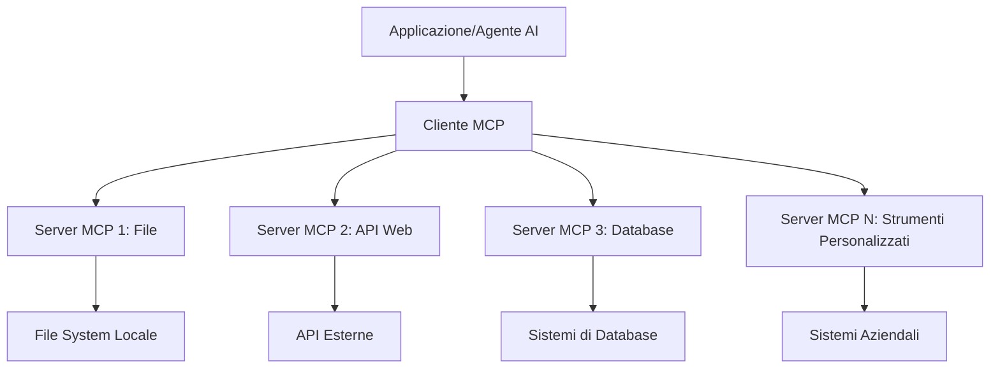

# 🌐 Modulo 2: MCP con Fondamenti di Microsoft Foundry Toolkit

[]()
[]()
[]()

## 📋 Obiettivi di Apprendimento

Al termine di questo modulo, sarai in grado di:
- ✅ Comprendere l'architettura e i vantaggi del Model Context Protocol (MCP)
- ✅ Esplorare l'ecosistema dei server MCP di Microsoft
- ✅ Integrare i server MCP con Microsoft Foundry Toolkit Agent Builder
- ✅ Costruire un agente di automazione browser funzionale utilizzando Playwright MCP
- ✅ Configurare e testare gli strumenti MCP all'interno dei tuoi agenti
- ✅ Esportare e distribuire agenti potenziati da MCP per l'uso in produzione

## 🎯 Costruire sul Modulo 1

Nel Modulo 1, abbiamo padroneggiato le basi di Microsoft Foundry Toolkit e creato il nostro primo Agente Python. Ora **potenzieremo** i tuoi agenti collegandoli a strumenti e servizi esterni tramite il rivoluzionario **Model Context Protocol (MCP)**.

Pensalo come un aggiornamento da una calcolatrice di base a un computer completo: i tuoi agenti AI acquisiranno la capacità di:
- 🌐 Navigare e interagire con siti web
- 📁 Accedere e manipolare file
- 🔧 Integrarsi con sistemi aziendali
- 📊 Elaborare dati in tempo reale provenienti da API

## 🧠 Comprendere il Model Context Protocol (MCP)

### 🔍 Cos'è MCP?

Model Context Protocol (MCP) è il **"USB-C per le applicazioni AI"** - uno standard aperto rivoluzionario che collega i Large Language Models (LLM) a strumenti esterni, fonti di dati e servizi. Proprio come USB-C ha eliminato il caos dei cavi fornendo un connettore universale, MCP elimina la complessità dell'integrazione AI con un protocollo standardizzato.

### 🎯 Il Problema che MCP Risolve

**Prima di MCP:**
- 🔧 Integrazioni personalizzate per ogni strumento
- 🔄 Lock-in del fornitore con soluzioni proprietarie
- 🔒 Vulnerabilità di sicurezza da connessioni ad hoc
- ⏱️ Mesi di sviluppo per integrazioni di base

**Con MCP:**
- ⚡ Integrazione plug-and-play degli strumenti
- 🔄 Architettura indipendente dal fornitore
- 🛡️ Best practice di sicurezza integrate
- 🚀 Minuti per aggiungere nuove capacità

### 🏗️ Approfondimento sull'Architettura MCP

MCP segue un'**architettura client-server** che crea un ecosistema sicuro e scalabile:



**🔧 Componenti Chiave:**

| Componente | Ruolo | Esempi |
|-----------|-------|---------|
| **Host MCP** | Applicazioni che consumano i servizi MCP | Claude Desktop, VS Code, Microsoft Foundry Toolkit |
| **Client MCP** | Gestori del protocollo (1:1 con server) | Integrati nelle applicazioni host |
| **Server MCP** | Espongono funzionalità tramite protocollo standard | Playwright, Files, Azure, GitHub |
| **Layer di Trasporto** | Metodi di comunicazione | stdio, HTTP, WebSockets |


## 🏢 Ecosistema dei Server MCP di Microsoft

Microsoft guida l'ecosistema MCP con una suite completa di server enterprise-grade che affrontano esigenze aziendali reali.

### 🌟 Server MCP di Microsoft in Evidenza

#### 1. ☁️ Azure MCP Server
**🔗 Repository**: [azure/azure-mcp](https://github.com/azure/azure-mcp)
**🎯 Scopo**: Gestione completa delle risorse Azure con integrazione AI

**✨ Caratteristiche Chiave:**
- Provisioning infrastrutturale dichiarativo
- Monitoraggio risorse in tempo reale
- Raccomandazioni per ottimizzazione costi
- Controllo di conformità di sicurezza

**🚀 Casi d'Uso:**
- Infrastructure-as-Code con assistenza AI
- Scaling automatico delle risorse
- Ottimizzazione dei costi cloud
- Automazione dei workflow DevOps

#### 2. 📊 Microsoft Dataverse MCP
**📚 Documentazione**: [Microsoft Dataverse Integration](https://go.microsoft.com/fwlink/?linkid=2320176)
**🎯 Scopo**: Interfaccia in linguaggio naturale per dati aziendali

**✨ Caratteristiche Chiave:**
- Query di database in linguaggio naturale
- Comprensione del contesto aziendale
- Template di prompt personalizzati
- Governance dei dati aziendali

**🚀 Casi d'Uso:**
- Reportistica business intelligence
- Analisi dati clienti
- Insight pipeline di vendita
- Query di conformità dati

#### 3. 🌐 Playwright MCP Server
**🔗 Repository**: [microsoft/playwright-mcp](https://github.com/microsoft/playwright-mcp)
**🎯 Scopo**: Capacità di automazione browser e interazione web

**✨ Caratteristiche Chiave:**
- Automazione cross-browser (Chrome, Firefox, Safari)
- Rilevazione intelligente degli elementi
- Generazione screenshot e PDF
- Monitoraggio traffico di rete

**🚀 Casi d'Uso:**
- Workflow di testing automatizzati
- Web scraping ed estrazione dati
- Monitoraggio UI/UX
- Automazione analisi competitiva

#### 4. 📁 Files MCP Server
**🔗 Repository**: [microsoft/files-mcp-server](https://github.com/microsoft/files-mcp-server)
**🎯 Scopo**: Operazioni intelligenti sul file system

**✨ Caratteristiche Chiave:**
- Gestione file dichiarativa
- Sincronizzazione contenuti
- Integrazione controllo versioni
- Estrazione metadati

**🚀 Casi d'Uso:**
- Gestione documentazione
- Organizzazione repository codice
- Workflow di pubblicazione contenuti
- Gestione file pipeline dati

#### 5. 📝 MarkItDown MCP Server
**🔗 Repository**: [microsoft/markitdown](https://github.com/microsoft/markitdown)
**🎯 Scopo**: Elaborazione e manipolazione avanzata di Markdown

**✨ Caratteristiche Chiave:**
- Parsing ricco di Markdown
- Conversione formati (MD ↔ HTML ↔ PDF)
- Analisi struttura contenuti
- Elaborazione template

**🚀 Casi d'Uso:**
- Workflow documentazione tecnica
- Sistemi di gestione contenuti
- Generazione report
- Automazione knowledge base

#### 6. 📈 Clarity MCP Server
**📦 Package**: [@microsoft/clarity-mcp-server](https://www.npmjs.com/package/@microsoft/clarity-mcp-server)
**🎯 Scopo**: Analisi web e insight comportamento utente

**✨ Caratteristiche Chiave:**
- Analisi dati heatmap
- Registrazioni sessioni utente
- Metriche di performance
- Analisi funnel conversione

**🚀 Casi d'Uso:**
- Ottimizzazione siti web
- Ricerca esperienza utente
- Analisi test A/B
- Cruscotti business intelligence

### 🌍 Ecosistema della Community

Oltre ai server Microsoft, l'ecosistema MCP include:
- **🐙 GitHub MCP**: Gestione repository e analisi codice
- **🗄️ Database MCP**: Integrazioni PostgreSQL, MySQL, MongoDB
- **☁️ Cloud Provider MCP**: Strumenti AWS, GCP, Digital Ocean
- **📧 Communication MCP**: Integrazioni Slack, Teams, Email

## 🛠️ Laboratorio Pratico: Costruire un Agente di Automazione Browser

**🎯 Obiettivo Progetto**: Creare un agente intelligente di automazione browser usando il server Playwright MCP che possa navigare siti, estrarre informazioni e svolgere interazioni web complesse.

### 🚀 Fase 1: Configurazione Fondamentale dell'Agente

#### Passo 1: Inizializza il Tuo Agente
1. **Apri Microsoft Foundry Toolkit Agent Builder**
2. **Crea un Nuovo Agente** con la seguente configurazione:
   - **Nome**: `BrowserAgent`
   - **Modello**: Scegli GPT-4o 


### 🔧 Fase 2: Flusso di Integrazione MCP

#### Passo 3: Aggiungi Integrazione Server MCP
1. **Vai alla Sezione Strumenti** in Agent Builder
2. **Clicca "Add Tool"** per aprire il menu di integrazione
3. **Seleziona "MCP Server"** dalle opzioni disponibili


**🔍 Comprendere i Tipi di Strumento:**
- **Strumenti Integrati**: Funzioni pre-configurate di Microsoft Foundry Toolkit
- **Server MCP**: Integrazioni di servizi esterni
- **API Personalizzate**: Endpoint di tuo servizio
- **Function Calling**: Accesso diretto alle funzioni modello

#### Passo 4: Selezione Server MCP
1. **Scegli l'opzione "MCP Server"** per procedere


2. **Sfoglia il Catalogo MCP** per esplorare integrazioni disponibili


### 🎮 Fase 3: Configurazione Playwright MCP

#### Passo 5: Seleziona e Configura Playwright
1. **Clicca "Use Featured MCP Servers"** per accedere ai server verificati Microsoft
2. **Seleziona "Playwright"** dalla lista in evidenza
3. **Accetta MCP ID di default** o personalizzalo per il tuo ambiente


#### Passo 6: Abilita Capacità Playwright
**🔑 Passo Critico**: Seleziona **TUTTI** i metodi Playwright disponibili per funzionalità massima


**🛠️ Strumenti Essenziali di Playwright:**
- **Navigazione**: `goto`, `goBack`, `goForward`, `reload`
- **Interazione**: `click`, `fill`, `press`, `hover`, `drag`
- **Estrazione**: `textContent`, `innerHTML`, `getAttribute`
- **Validazione**: `isVisible`, `isEnabled`, `waitForSelector`
- **Cattura**: `screenshot`, `pdf`, `video`
- **Rete**: `setExtraHTTPHeaders`, `route`, `waitForResponse`

#### Passo 7: Verifica il Successo dell'Integrazione
**✅ Indicatori di Successo:**
- Tutti gli strumenti appaiono nell'interfaccia Agent Builder
- Nessun messaggio di errore nel pannello integrazione
- Stato server Playwright mostra "Connected"


**🔧 Risoluzione dei Problemi Comuni:**
- **Connessione fallita**: Verifica la connettività internet e le impostazioni firewall
- **Strumenti mancanti**: Assicurati che tutte le capacità siano state selezionate durante la configurazione
- **Errori di permesso**: Verifica che VS Code abbia i permessi di sistema necessari

### 🎯 Fase 4: Ingegneria Avanzata dei Prompt

#### Passo 8: Progetta Prompt di Sistema Intelligenti
Crea prompt sofisticati che sfruttano appieno le capacità di Playwright:

```markdown
# Web Automation Expert System Prompt

## Core Identity
You are an advanced web automation specialist with deep expertise in browser automation, web scraping, and user experience analysis. You have access to Playwright tools for comprehensive browser control.

## Capabilities & Approach
### Navigation Strategy
- Always start with screenshots to understand page layout
- Use semantic selectors (text content, labels) when possible
- Implement wait strategies for dynamic content
- Handle single-page applications (SPAs) effectively

### Error Handling
- Retry failed operations with exponential backoff
- Provide clear error descriptions and solutions
- Suggest alternative approaches when primary methods fail
- Always capture diagnostic screenshots on errors

### Data Extraction
- Extract structured data in JSON format when possible
- Provide confidence scores for extracted information
- Validate data completeness and accuracy
- Handle pagination and infinite scroll scenarios

### Reporting
- Include step-by-step execution logs
- Provide before/after screenshots for verification
- Suggest optimizations and alternative approaches
- Document any limitations or edge cases encountered

## Ethical Guidelines
- Respect robots.txt and rate limiting
- Avoid overloading target servers
- Only extract publicly available information
- Follow website terms of service
```

#### Passo 9: Crea Prompt Utente Dinamici
Progetta prompt che dimostrino varie capacità:

**🌐 Esempio di Analisi Web:**
```markdown
Navigate to github.com/kinfey and provide a comprehensive analysis including:
1. Repository structure and organization
2. Recent activity and contribution patterns  
3. Documentation quality assessment
4. Technology stack identification
5. Community engagement metrics
6. Notable projects and their purposes

Include screenshots at key steps and provide actionable insights.
```


### 🚀 Fase 5: Esecuzione e Test

#### Passo 10: Esegui la Tua Prima Automazione
1. **Clicca "Run"** per avviare la sequenza di automazione
2. **Monitora l'Esecuzione in Tempo Reale**:
   - Il browser Chrome si avvia automaticamente
   - L'agente naviga sul sito web target
   - Screenshot catturano ogni passaggio importante
   - I risultati dell'analisi vengono trasmessi in tempo reale


#### Passo 11: Analizza Risultati e Insight
Esamina l'analisi completa nell'interfaccia di Agent Builder:


### 🌟 Fase 6: Capacità Avanzate e Distribuzione

#### Passo 12: Esporta e Distribuzione in Produzione
Agent Builder supporta diverse opzioni di distribuzione:


## 🎓 Riepilogo Modulo 2 & Prossimi Passi

### 🏆 Obiettivo Raggiunto: Maestro dell'Integrazione MCP

**✅ Competenze Padroneggiate:**
- [ ] Comprensione dell'architettura e dei vantaggi MCP
- [ ] Navigazione nell'ecosistema server MCP di Microsoft
- [ ] Integrazione Playwright MCP con Microsoft Foundry Toolkit
- [ ] Costruzione di agenti sofisticati di automazione browser
- [ ] Ingegneria avanzata dei prompt per automazione web

### 📚 Risorse Aggiuntive

- **🔗 Specifica MCP**: [Documentazione Ufficiale del Protocollo](https://modelcontextprotocol.io/)
- **🛠️ API Playwright**: [Riferimento Completo Metodi](https://playwright.dev/docs/api/class-playwright)
- **🏢 Server MCP Microsoft**: [Guida all'Integrazione Enterprise](https://github.com/microsoft/mcp-servers)
- **🌍 Esempi Community**: [Galleria Server MCP](https://github.com/modelcontextprotocol/servers)

**🎉 Congratulazioni!** Hai padroneggiato con successo l'integrazione MCP e ora puoi costruire agenti AI pronti per la produzione con capacità di strumenti esterni!


### 🔜 Continua al Prossimo Modulo

Pronto a portare le tue competenze MCP al livello successivo? Procedi a **[Modulo 3: Sviluppo Avanzato MCP con Microsoft Foundry Toolkit](../lab3/README.md)** dove imparerai a:
- Creare tuoi server MCP personalizzati
- Configurare e utilizzare l'ultimo MCP Python SDK
- Impostare MCP Inspector per il debugging
- Padroneggiare workflow avanzati di sviluppo server MCP
- Costruire da zero un Weather MCP Server

---

<!-- CO-OP TRANSLATOR DISCLAIMER START -->
**Disclaimer**:
Questo documento è stato tradotto utilizzando il servizio di traduzione AI [Co-op Translator](https://github.com/Azure/co-op-translator). Sebbene ci impegniamo per garantire la precisione, si prega di notare che le traduzioni automatizzate possono contenere errori o imprecisioni. Il documento originale nella sua lingua nativa deve essere considerato la fonte autorevole. Per informazioni critiche, si raccomanda una traduzione professionale effettuata da un essere umano. Non siamo responsabili per eventuali malintesi o interpretazioni errate derivanti dall’uso di questa traduzione.
<!-- CO-OP TRANSLATOR DISCLAIMER END -->