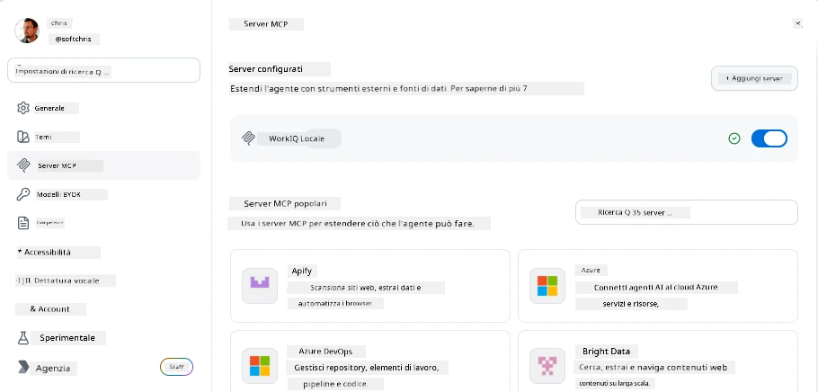
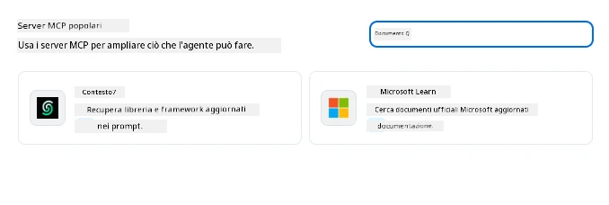
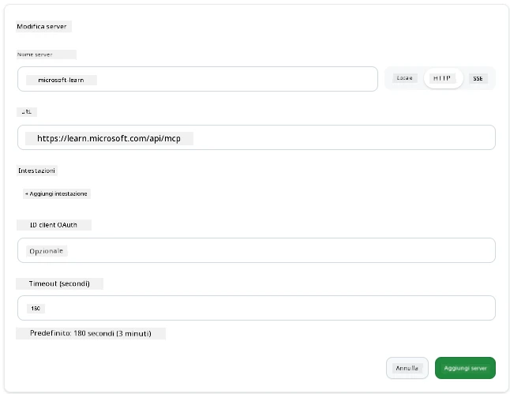
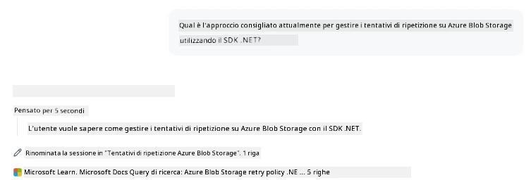
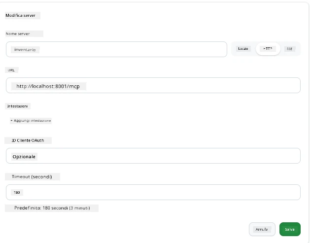
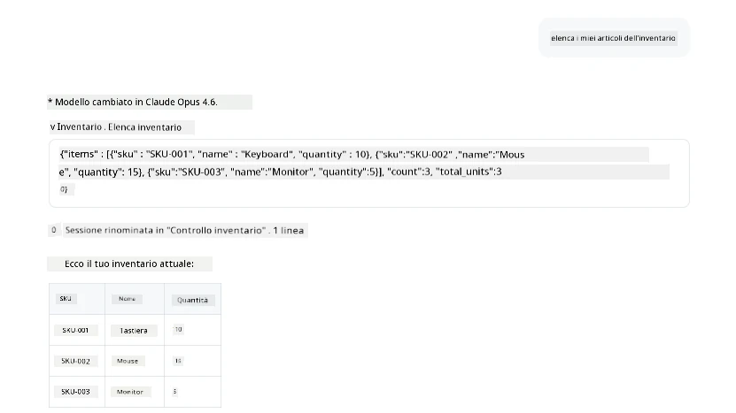
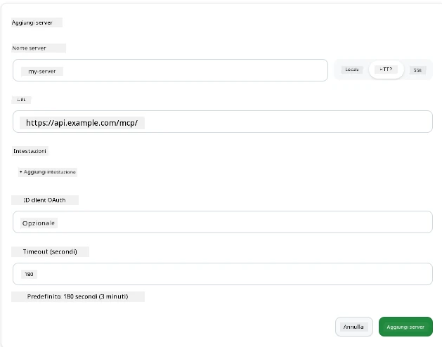
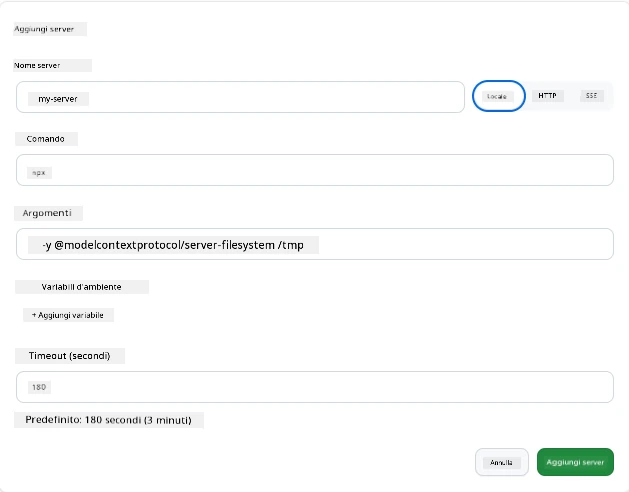

# Utilizzo dei Server MCP nell'App GitHub Copilot

Ormai sai come funziona MCP. Hai creato server, definito strumenti e risorse, e collegato i client. Quello che non abbiamo ancora fatto è cambiare prospettiva: invece di essere tu a costruire il server, come si presenta essere dalla parte *consumante* — come utente di un'app potenziata dall'IA che supporta MCP?

[GitHub Copilot App](https://github.com/github/app) è un'app desktop che può utilizzare i server MCP. Collegando server MCP ad essa, puoi sbloccare un nuovo livello: Copilot può ora accedere alla tua documentazione, chiamare le tue API interne, interrogare il tuo database o parlare con qualsiasi servizio che hai incapsulato in un server. L'app diventa l'host; i tuoi server MCP diventano i suoi strumenti.

Questa lezione ti guida attraverso quell'esperienza dall'inizio alla fine — da trovare il pannello delle impostazioni MCP a connettere un vero server di documentazione e poi a collegarne uno personalizzato.

## Obiettivi di Apprendimento

Alla fine di questa lezione, sarai in grado di:

- Individuare e navigare nel pannello dei server MCP nelle impostazioni di Copilot App.
- Collegare un server di documentazione ospitato e usarlo in una sessione.
- Registrare un server personalizzato e verificare che Copilot possa invocare i suoi strumenti.
- Configurare il modo in cui un server viene chiamato fornendo variabili d'ambiente o intestazioni personalizzate (se HTTP)

## L'App Copilot come Host MCP

Ecco il concetto fondamentale: **Gli agenti di Copilot sono intelligenti, ma sanno solo ciò che gli dici.** Per impostazione predefinita, un agente può leggere file nel tuo spazio di lavoro ed eseguire comandi terminal, ma non può interrogare il tuo database, consultare il calendario o chiamare un'API personalizzata senza aiuto. È qui che entrano in gioco i server MCP. Agiscono come ponti tra Copilot e i tuoi sistemi — database, controllo di versione, API, strumenti di design — dando agli agenti accesso alle informazioni e alle azioni di cui hanno bisogno per completare il lavoro.

Iniziamo trovando quelle impostazioni per gestire i server MCP della tua app.

## Passo 1: Trovare il Pannello delle Impostazioni MCP

Apri l'app Copilot e individua un'icona a forma di ingranaggio in basso a sinistra e cliccaci sopra.


Assicurati di selezionare "MCP Servers" e dovresti vedere ora i server già configurati in alto, un marketplace di server popolari in basso, e un pulsante "Add Server" in alto come segue:



Questo è il tuo centro di controllo. Qui aggiungi, rimuovi, abiliti e disabiliti server. Le modifiche hanno effetto per nuove sessioni; se hai una sessione aperta, dovrai avviarne una nuova dopo aver cambiato questa lista.

## Passo 2: Collegare un Server di Documentazione

Facciamo qualcosa di immediatamente utile. Il server MCP Microsoft Docs dà a Copilot accesso alla documentazione ufficiale Microsoft. Questo include Azure, .NET, TypeScript e altro. Invece di far affidamento sui dati di addestramento dell'agente (che hanno una data di scadenza), può recuperare documentazione aggiornata al momento della richiesta.

Ecco come aggiungerlo:

1. Nella griglia dei server popolari, digita **learn** e seleziona il server chiamato "Microsoft Learn".

   

   Una volta cliccato, ti presenta un modulo dove nome, tipo di trasporto e URL sono precompilati, devi solo cliccare su "Add Server".

2. Clicca su "Add Server", dovrebbe impiegare qualche secondo per connettersi al server.

   

   Una volta aggiunto, dovrebbe apparire nell'area superiore come server configurato. Proviamolo subito.

3. Chiudi la finestra di dialogo e seleziona Quick chat.

4. Scrivi il prompt in basso per attivare uno strumento sul server Microsoft Learn.

   ```text
   What's the current recommended approach for handling Azure Blob Storage 
   retries using the .NET SDK?
   ```

   

Dovresti vedere come fa riferimento al Server MCP che abbiamo appena aggiunto.

## Passo 3: Collegare un Server stdio Personalizzato

I preset sono comodi, ma il vero potere è collegare i propri server. Diciamo che hai costruito un server (o ti è stato fornito) che espone la tua API interna o il knowledge base aziendale. In questo caso, useremo un server MCP che abbiamo costruito che gestisce l'inventario della nostra azienda.

1. Clicca sull'ingranaggio e seleziona di nuovo “MCP servers”.

2. Seleziona il pulsante "Add Server" e "+ Add Custom server", e fornisci i seguenti valori:

   - Nome: `Inventory Server`
   - Seleziona trasporto (a destra), **http**

   Seleziona "Add Server" e dovrebbe apparire nella tua lista di server configurati.

   

4. Per provarlo, esegui un prompt come questo:

    ```
    list inventory
    ```

   

   Ora dovresti vedere una lista di articoli di inventario restituita dal tuo server personalizzato.

Ottimo, ora dovresti avere una buona padronanza di come aggiungere sia server esterni che i tuoi MCP server all'app Copilot. Prossimo passo, parliamo di gestione di segreti e variabili d'ambiente.

## Passo 4: Impostazioni Avanzate

Finora hai visto come aggiungere server MCP dove devi solo fornire un nome e un URL. Ma se il tuo server necessita di una chiave API o qualche altro valore? A seconda del tipo di trasporto, possiamo fornirgli ciò che serve.

- **Trasporto http o SSE**: Qui possiamo impostare le intestazioni come necessario.

   Per l'autenticazione, puoi specificare un'intestazione Authorization, per esempio. Il valore può essere una stringa statica. Se utilizzi OAuth, puoi invece indicare un client ID OAuth.

   

- **Trasporto stdio**: Possono essere impostate variabili d'ambiente.

   Qui puoi specificare un numero arbitrario di variabili d'ambiente che devono essere passate al server quando lo avvii.

   

## Riassunto

L'app Copilot considera i server MCP come estensioni di prima classe delle capacità dell'agente. Hai visto l'intero percorso in questa lezione dall'aggiungere server MCP al loro utilizzo in una sessione. Ora puoi connetterti a server pubblici, API interne e strumenti personalizzati, dando ai tuoi agenti la possibilità di accedere alle informazioni e alle azioni di cui hanno bisogno per completare compiti in modo autonomo.

## 📚 Risorse Aggiuntive

### Documentazione ufficiale

- [GitHub Copilot App](https://github.com/github/app)
- [MCP Specification](https://modelcontextprotocol.io/specification/2025-03-26) - Specifica del Model Context Protocol

### Comunità
- [MCP Community Discord](https://discord.com/invite/ByRwuEEgH4) - Discussioni in diretta
- [GitHub Discussions](https://github.com/microsoft/MCP-Server-and-PostgreSQL-Sample-Retail/discussions) - Q&A e condivisioni
- [Stack Overflow](https://stackoverflow.com/questions/tagged/model-context-protocol) - Domande tecniche

---

<!-- CO-OP TRANSLATOR DISCLAIMER START -->
**Disclaimer**:
Questo documento è stato tradotto utilizzando il servizio di traduzione AI [Co-op Translator](https://github.com/Azure/co-op-translator). Sebbene ci impegniamo per garantire la precisione, si prega di notare che le traduzioni automatizzate possono contenere errori o imprecisioni. Il documento originale nella sua lingua nativa deve essere considerato la fonte autorevole. Per informazioni critiche, si raccomanda una traduzione professionale effettuata da un essere umano. Non siamo responsabili per eventuali malintesi o interpretazioni errate derivanti dall’uso di questa traduzione.
<!-- CO-OP TRANSLATOR DISCLAIMER END -->