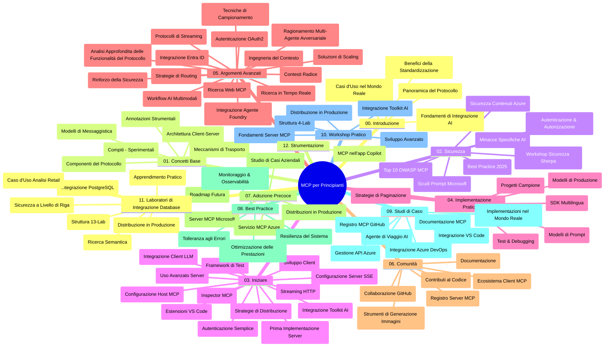

# Protocollo del Contesto del Modello (MCP) per Principianti - Guida di Studio

Questa guida di studio fornisce una panoramica della struttura e del contenuto del repository per il curriculum "Protocollo del Contesto del Modello (MCP) per Principianti". Usa questa guida per navigare nel repository in modo efficiente e sfruttare al meglio le risorse disponibili.

## Panoramica del Repository

Il Protocollo del Contesto del Modello (MCP) è un framework standardizzato per le interazioni tra modelli di intelligenza artificiale e applicazioni client. Inizialmente creato da Anthropic, MCP è ora mantenuto dalla più ampia comunità MCP attraverso l'organizzazione ufficiale GitHub. Questo repository fornisce un curriculum completo con esempi pratici di codice in C#, Java, JavaScript, Python e TypeScript, progettato per sviluppatori AI, architetti di sistema e ingegneri software.

## Mappa Visuale del Curriculum

## Struttura del Repository

Il repository è organizzato in dodici sezioni principali, ognuna focalizzata su diversi aspetti di MCP:

1. **Introduzione (00-Introduction/)**
   - Panoramica del Protocollo del Contesto del Modello
   - Perché la standardizzazione è importante nei pipeline AI
   - Casi d'uso pratici e benefici

2. **Concetti Base (01-CoreConcepts/)**
   - Architettura client-server
   - Componenti chiave del protocollo
   - Pattern di messaggistica in MCP

3. **Sicurezza (02-Security/)**
   - Minacce alla sicurezza nei sistemi basati su MCP
   - Best practice per la messa in sicurezza delle implementazioni
   - Strategie di autenticazione e autorizzazione
   - **Documentazione Completa sulla Sicurezza**:
     - Best Practices di Sicurezza MCP 2025
     - Guida all'Implementazione di Content Safety di Azure
     - Controlli e Tecniche di Sicurezza MCP
     - Riferimenti Rapidi alle Best Practice MCP
   - **Temi Chiave di Sicurezza**:
     - Attacchi di prompt injection e poisoning degli strumenti
     - Hijacking di sessione e problemi di confused deputy
     - Vulnerabilità di token passthrough
     - Permessi e controllo di accesso eccessivi
     - Sicurezza della supply chain per componenti AI
     - Integrazione di Microsoft Prompt Shields

4. **Primi Passi (03-GettingStarted/)**
   - Configurazione e setup dell'ambiente
   - Creazione di server e client MCP base
   - Integrazione con applicazioni esistenti
   - Include sezioni su:
     - Prima implementazione del server
     - Sviluppo client
     - Integrazione client LLM
     - Integrazione VS Code
     - Server di Server-Sent Events (SSE)
     - Uso avanzato del server
     - Streaming HTTP
     - Integrazione AI Toolkit
     - Strategie di testing
     - Linee guida per il deployment

5. **Implementazione Pratica (04-PracticalImplementation/)**
   - Uso degli SDK in diversi linguaggi di programmazione
   - Tecniche di debug, test e validazione
   - Creazione di template di prompt e workflow riutilizzabili
   - Progetti campione con esempi di implementazione

6. **Argomenti Avanzati (05-AdvancedTopics/)**
   - Tecniche di ingegneria del contesto
   - Integrazione di Foundry agent
   - Workflow AI multi-modali
   - Demo di autenticazione OAuth2
   - Capacità di ricerca in tempo reale
   - Streaming in tempo reale
   - Implementazione contesti root
   - Strategie di routing
   - Tecniche di campionamento
   - Approcci di scaling
   - Considerazioni sulla sicurezza
   - Integrazione sicurezza Entra ID
   - Integrazione ricerca web
   - Ragionamento multi-agente adversariale (pattern di dibattito)

7. **Contributi della Comunità (06-CommunityContributions/)**
   - Come contribuire con codice e documentazione
   - Collaborazione via GitHub
   - Miglioramenti e feedback guidati dalla comunità
   - Uso di vari client MCP (Claude Desktop, Cline, VSCode)
   - Lavoro con server MCP popolari inclusa generazione di immagini

8. **Lezioni dall'Adozione Precoce (07-LessonsfromEarlyAdoption/)**
   - Implementazioni reali e storie di successo
   - Costruzione e deployment di soluzioni basate su MCP
   - Tendenze e roadmap futura
   - **Guida ai Server MCP Microsoft**: Guida completa a 10 server MCP Microsoft pronti per la produzione, inclusi:
     - Microsoft Learn Docs MCP Server
     - Azure MCP Server (15+ connettori specializzati)
     - GitHub MCP Server
     - Azure DevOps MCP Server
     - MarkItDown MCP Server
     - SQL Server MCP Server
     - Playwright MCP Server
     - Dev Box MCP Server
     - Microsoft Foundry MCP Server
     - Microsoft 365 Agents Toolkit MCP Server

9. **Best Practices (08-BestPractices/)**
   - Ottimizzazione delle prestazioni e tuning
   - Progettazione di sistemi MCP fault-tolerant
   - Strategie di testing e resilienza

10. **Case Study (09-CaseStudy/)**
    - **Sette casi di studio completi** che dimostrano la versatilità di MCP in scenari diversi:
    - **Agenti di Viaggio AI di Azure**: orchestrazione multi-agente con Azure OpenAI e AI Search
    - **Integrazione Azure DevOps**: automazione dei processi di workflow con aggiornamenti dati da YouTube
    - **Recupero Documentazione in Tempo Reale**: client console Python con streaming HTTP
    - **Generatore Interattivo di Piani di Studio**: web app Chainlit con AI conversazionale
    - **Documentazione In-Editor**: integrazione VS Code con workflow GitHub Copilot
    - **Gestione API Azure**: integrazione API aziendale con creazione server MCP
    - **Registry MCP GitHub**: sviluppo ecosistema e piattaforma di integrazione agentica
    - Esempi di implementazione tra integrazione enterprise, produttività sviluppatori e sviluppo ecosistema

11. **Workshop Pratico (10-StreamliningAIWorkflowsBuildingAnMCPServerWithAIToolkit/)**
    - Workshop pratico completo che combina MCP con AI Toolkit
    - Costruire applicazioni intelligenti che collegano modelli AI con strumenti reali
    - Moduli pratici che coprono fondamenti, sviluppo server personalizzati e strategie di deployment in produzione
    - **Struttura del Lab**:
      - Lab 1: Fondamentali del Server MCP
      - Lab 2: Sviluppo Avanzato Server MCP
      - Lab 3: Integrazione AI Toolkit
      - Lab 4: Deployment e Scaling in Produzione
    - Approccio didattico basato su lab con istruzioni passo-passo

12. **Lab di Integrazione Database MCP Server (11-MCPServerHandsOnLabs/)**
    - **Percorso di apprendimento completo con 13 lab** per costruire server MCP pronti per la produzione con integrazione PostgreSQL
    - **Implementazione di analisi retail real-world** utilizzando il caso d'uso Zava Retail
    - **Pattern enterprise-grade** inclusi Row Level Security (RLS), ricerca semantica e accesso dati multi-tenant
    - **Struttura completa dei lab**:
      - **Lab 00-03: Fondamenta** - Introduzione, Architettura, Sicurezza, Setup Ambiente
      - **Lab 04-06: Costruzione del Server MCP** - Design Database, Implementazione Server MCP, Sviluppo Tool
      - **Lab 07-09: Funzionalità Avanzate** - Ricerca Semantica, Testing & Debugging, Integrazione VS Code
      - **Lab 10-12: Produzione & Best Practice** - Deployment, Monitoraggio, Ottimizzazione
    - **Tecnologie trattate**: framework FastMCP, PostgreSQL, Azure OpenAI, Azure Container Apps, Application Insights
    - **Risultati di apprendimento**: server MCP pronti per la produzione, pattern di integrazione database, analisi AI-powered, sicurezza enterprise

13. **Tooling (12-tooling/)**
    - Impara a usare MCP nell'app Copilot e altri strumenti

## Risorse Aggiuntive

Il repository include risorse di supporto:

- **Cartella Immagini**: contiene diagrammi e illustrazioni usati nel curriculum
- **Traduzioni**: supporto multilingua con traduzioni automatiche della documentazione
- **Risorse Ufficiali MCP**:
  - [Documentazione MCP](https://modelcontextprotocol.io/)
  - [Specifiche MCP](https://spec.modelcontextprotocol.io/)
  - [Repository MCP GitHub](https://github.com/modelcontextprotocol)

## Come Usare Questo Repository

1. **Apprendimento Sequenziale**: Segui i capitoli in ordine (da 00 a 11) per un'esperienza di apprendimento strutturata.
2. **Focus su Linguaggio Specifico**: Se sei interessato a un linguaggio di programmazione specifico, esplora le directory degli esempi nelle tue lingue preferite.
3. **Implementazione Pratica**: Inizia dalla sezione "Primi Passi" per configurare l'ambiente e creare il tuo primo server e client MCP.
4. **Esplorazione Avanzata**: Una volta acquisiti i fondamenti, approfondisci gli argomenti avanzati per espandere le tue conoscenze.
5. **Coinvolgimento nella Comunità**: Unisciti alla comunità MCP tramite discussioni su GitHub e canali Discord per connetterti con esperti e altri sviluppatori.

## Client MCP e Strumenti

Il curriculum copre vari client e strumenti MCP:

1. **Client Ufficiali**:
   - Visual Studio Code
   - MCP in Visual Studio Code
   - Claude Desktop
   - Claude in VSCode
   - Claude API

2. **Client della Comunità**:
   - Cline (basato su terminale)
   - Cursor (editor di codice)
   - ChatMCP
   - Windsurf

3. **Strumenti di Gestione MCP**:
   - MCP CLI
   - MCP Manager
   - MCP Linker
   - MCP Router

## Server MCP Popolari

Il repository presenta vari server MCP, inclusi:

1. **Server MCP Microsoft Ufficiali**:
   - Microsoft Learn Docs MCP Server
   - Azure MCP Server (15+ connettori specializzati)
   - GitHub MCP Server
   - Azure DevOps MCP Server
   - MarkItDown MCP Server
   - SQL Server MCP Server
   - Playwright MCP Server
   - Dev Box MCP Server
   - Microsoft Foundry MCP Server
   - Microsoft 365 Agents Toolkit MCP Server

2. **Server di Riferimento Ufficiali**:
   - Filesystem
   - Fetch
   - Memory
   - Sequential Thinking

3. **Generazione Immagini**:
   - Azure OpenAI DALL-E 3
   - Stable Diffusion WebUI
   - Replicate

4. **Strumenti di Sviluppo**:
   - Git MCP
   - Terminal Control
   - Code Assistant

5. **Server Specializzati**:
   - Salesforce
   - Microsoft Teams
   - Jira & Confluence

## Contributi

Questo repository accoglie contributi dalla comunità. Vedi la sezione Contributi della Comunità per indicazioni su come contribuire efficacemente all'ecosistema MCP.

----

*Questa guida di studio è stata aggiornata l'ultima volta il 5 febbraio 2026, riflettendo le ultime Specifiche MCP del 2025-11-25 e fornisce una panoramica del repository a tale data. Il contenuto del repository può essere aggiornato dopo questa data.*

---

<!-- CO-OP TRANSLATOR DISCLAIMER START -->
**Disclaimer**:
Questo documento è stato tradotto utilizzando il servizio di traduzione AI [Co-op Translator](https://github.com/Azure/co-op-translator). Sebbene ci impegniamo per garantire la precisione, si prega di notare che le traduzioni automatizzate possono contenere errori o imprecisioni. Il documento originale nella sua lingua nativa deve essere considerato la fonte autorevole. Per informazioni critiche, si raccomanda una traduzione professionale effettuata da un essere umano. Non siamo responsabili per eventuali malintesi o interpretazioni errate derivanti dall’uso di questa traduzione.
<!-- CO-OP TRANSLATOR DISCLAIMER END -->