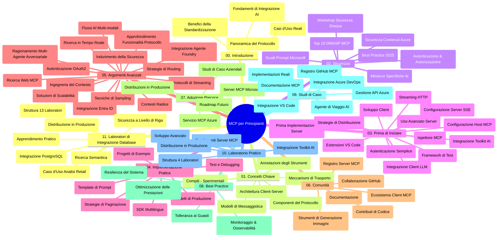

# Model Context Protocol (MCP) per Principianti - Guida di Studio

Questa guida di studio fornisce una panoramica della struttura e dei contenuti del repository per il curriculum "Model Context Protocol (MCP) per Principianti". Usa questa guida per navigare efficacemente nel repository e sfruttare al meglio le risorse disponibili.

## Panoramica del Repository

Il Model Context Protocol (MCP) è un framework standardizzato per le interazioni tra modelli AI e applicazioni client. Inizialmente creato da Anthropic, MCP è ora mantenuto dalla più ampia comunità MCP tramite l'organizzazione ufficiale GitHub. Questo repository fornisce un curriculum completo con esempi di codice pratici in C#, Java, JavaScript, Python e TypeScript, progettato per sviluppatori AI, architetti di sistema e ingegneri del software.

## Mappa Visiva del Curriculum

## Struttura del Repository

Il repository è organizzato in undici sezioni principali, ciascuna focalizzata su diversi aspetti di MCP:

1. **Introduzione (00-Introduction/)**
   - Panoramica del Model Context Protocol
   - Perché la standardizzazione è importante nelle pipeline AI
   - Casi d'uso pratici e vantaggi

2. **Concetti Base (01-CoreConcepts/)**
   - Architettura client-server
   - Componenti chiave del protocollo
   - Pattern di messaggistica in MCP

3. **Sicurezza (02-Security/)**
   - Minacce alla sicurezza nei sistemi basati su MCP
   - Migliori pratiche per mettere in sicurezza le implementazioni
   - Strategie di autenticazione e autorizzazione
   - **Documentazione Completa sulla Sicurezza**:
     - Best Practices di Sicurezza MCP 2025
     - Guida all'Implementazione di Azure Content Safety
     - Controlli e Tecniche di Sicurezza MCP
     - Riferimento Rapido alle Best Practices MCP
   - **Argomenti Chiave di Sicurezza**:
     - Attacchi di injection prompt e avvelenamento degli strumenti
     - Hijacking di sessioni e problemi del confused deputy
     - Vulnerabilità nel passaggio di token
     - Permessi e controllo degli accessi eccessivi
     - Sicurezza della supply chain per componenti AI
     - Integrazione Microsoft Prompt Shields

4. **Primi Passi (03-GettingStarted/)**
   - Configurazione e preparazione dell'ambiente
   - Creare server e client MCP di base
   - Integrazione con applicazioni esistenti
   - Include sezioni per:
     - Prima implementazione server
     - Sviluppo client
     - Integrazione client LLM
     - Integrazione con VS Code
     - Server con Server-Sent Events (SSE)
     - Uso avanzato del server
     - Streaming HTTP
     - Integrazione AI Toolkit
     - Strategie di testing
     - Linee guida per il deployment

5. **Implementazione Pratica (04-PracticalImplementation/)**
   - Uso degli SDK in diversi linguaggi di programmazione
   - Tecniche di debugging, testing e validazione
   - Creazione di template di prompt e workflow riutilizzabili
   - Progetti di esempio con esempi di implementazione

6. **Argomenti Avanzati (05-AdvancedTopics/)**
   - Tecniche di ingegneria del contesto
   - Integrazione agenti Foundry
   - Workflow AI multi-modali
   - Demo di autenticazione OAuth2
   - Capacità di ricerca in tempo reale
   - Streaming in tempo reale
   - Implementazione di contesti root
   - Strategie di routing
   - Tecniche di campionamento
   - Approcci di scaling
   - Considerazioni di sicurezza
   - Integrazione di sicurezza Entra ID
   - Integrazione ricerca web
   - Ragionamento multi-agente avversariale (pattern di dibattito)

7. **Contributi della Comunità (06-CommunityContributions/)**
   - Come contribuire con codice e documentazione
   - Collaborare tramite GitHub
   - Miglioramenti e feedback guidati dalla comunità
   - Uso di vari client MCP (Claude Desktop, Cline, VSCode)
   - Lavorare con popolari server MCP inclusa generazione di immagini

8. **Lezioni dall’Adozione Iniziale (07-LessonsfromEarlyAdoption/)**
   - Implementazioni e storie di successo reali
   - Costruzione e distribuzione di soluzioni basate su MCP
   - Tendenze e roadmap futura
   - **Guida ai Server MCP Microsoft**: Guida completa a 10 server MCP di Microsoft pronti per la produzione, incluse:
     - Microsoft Learn Docs MCP Server
     - Azure MCP Server (oltre 15 connettori specializzati)
     - GitHub MCP Server
     - Azure DevOps MCP Server
     - MarkItDown MCP Server
     - SQL Server MCP Server
     - Playwright MCP Server
     - Dev Box MCP Server
     - Microsoft Foundry MCP Server
     - Microsoft 365 Agents Toolkit MCP Server

9. **Best Practices (08-BestPractices/)**
   - Ottimizzazione e tuning delle performance
   - Progettazione di sistemi MCP fault-tolerant
   - Strategie di testing e resilienza

10. **Studi di Caso (09-CaseStudy/)**
    - **Sette studi di caso completi** che dimostrano la versatilità MCP in scenari differenti:
    - **Azure AI Travel Agents**: orchestrazione multi-agente con Azure OpenAI e AI Search
    - **Integrazione Azure DevOps**: automazione di processi workflow con aggiornamenti dati da YouTube
    - **Recupero Documentazione in Tempo Reale**: client console Python con streaming HTTP
    - **Generatore Interattivo di Piani di Studio**: app web Chainlit con AI conversazionale
    - **Documentazione In-Editor**: integrazione VS Code con workflow GitHub Copilot
    - **Azure API Management**: integrazione enterprise API con creazione server MCP
    - **GitHub MCP Registry**: sviluppo ecosistema e piattaforma di integrazione agentica
    - Esempi di implementazione che spaziano dall’integrazione enterprise alla produttività sviluppatore e allo sviluppo ecosistema

11. **Workshop Pratico (10-StreamliningAIWorkflowsBuildingAnMCPServerWithAIToolkit/)**
    - Workshop pratico completo che combina MCP con AI Toolkit
    - Costruzione di applicazioni intelligenti che collegano modelli AI con strumenti reali
    - Moduli pratici che coprono fondamentali, sviluppo server personalizzato e strategie di deployment in produzione
    - **Struttura del Lab**:
      - Lab 1: Fondamenti del Server MCP
      - Lab 2: Sviluppo Avanzato del Server MCP
      - Lab 3: Integrazione AI Toolkit
      - Lab 4: Deployment e Scaling in Produzione
    - Approccio di apprendimento basato su lab con istruzioni passo passo

12. **Lab di Integrazione Database MCP Server (11-MCPServerHandsOnLabs/)**
    - **Percorso di apprendimento completo di 13 lab** per costruire server MCP pronti per la produzione con integrazione PostgreSQL
    - **Implementazione reale di analisi retail** usando il caso d’uso Zava Retail
    - **Pattern di livello enterprise** inclusi Row Level Security (RLS), ricerca semantica e accesso dati multi-tenant
    - **Struttura Completa dei Lab**:
      - **Lab 00-03: Fondamenta** - Introduzione, Architettura, Sicurezza, Configurazione Ambiente
      - **Lab 04-06: Costruzione del Server MCP** - Progettazione DB, Implementazione Server MCP, Sviluppo Strumenti
      - **Lab 07-09: Funzionalità Avanzate** - Ricerca Semantica, Testing & Debugging, Integrazione VS Code
      - **Lab 10-12: Produzione e Best Practices** - Deployment, Monitoraggio, Ottimizzazione
    - **Tecnologie Coperti**: framework FastMCP, PostgreSQL, Azure OpenAI, Azure Container Apps, Application Insights
    - **Risultati di Apprendimento**: server MCP pronti per produzione, pattern di integrazione DB, analytics AI-powered, sicurezza enterprise

## Risorse Aggiuntive

Il repository include risorse di supporto:

- **Cartella Immagini**: contiene diagrammi e illustrazioni usate in tutto il curriculum
- **Traduzioni**: supporto multilingue con traduzioni automatiche della documentazione
- **Risorse Ufficiali MCP**:
  - [Documentazione MCP](https://modelcontextprotocol.io/)
  - [Specifiche MCP](https://spec.modelcontextprotocol.io/)
  - [Repository MCP GitHub](https://github.com/modelcontextprotocol)

## Come Usare Questo Repository

1. **Apprendimento Sequenziale**: Segui i capitoli in ordine (da 00 a 11) per un'esperienza didattica strutturata.
2. **Focus Linguistico Specifico**: Se ti interessa un linguaggio di programmazione particolare, esplora le directory esempi per le implementazioni nel tuo linguaggio preferito.
3. **Implementazione Pratica**: Inizia dalla sezione "Primi Passi" per configurare l’ambiente e creare il primo server e client MCP.
4. **Esplorazione Avanzata**: Una volta acquisiti i concetti base, approfondisci gli argomenti avanzati per ampliare la conoscenza.
5. **Coinvolgimento Comunitario**: Partecipa alla community MCP tramite discussioni GitHub e canali Discord per connetterti con esperti e altri sviluppatori.

## Client e Strumenti MCP

Il curriculum copre vari client e strumenti MCP:

1. **Client Ufficiali**:
   - Visual Studio Code 
   - MCP in Visual Studio Code
   - Claude Desktop
   - Claude in VSCode 
   - Claude API

2. **Client della Comunità**:
   - Cline (terminal-based)
   - Cursor (editor di codice)
   - ChatMCP
   - Windsurf

3. **Strumenti di Gestione MCP**:
   - MCP CLI
   - MCP Manager
   - MCP Linker
   - MCP Router

## Server MCP Popolari

Il repository introduce diversi server MCP, inclusi:

1. **Server MCP Ufficiali Microsoft**:
   - Microsoft Learn Docs MCP Server
   - Azure MCP Server (oltre 15 connettori specializzati)
   - GitHub MCP Server
   - Azure DevOps MCP Server
   - MarkItDown MCP Server
   - SQL Server MCP Server
   - Playwright MCP Server
   - Dev Box MCP Server
   - Microsoft Foundry MCP Server
   - Microsoft 365 Agents Toolkit MCP Server

2. **Server di Riferimento Ufficiali**:
   - Filesystem
   - Fetch
   - Memory
   - Sequential Thinking

3. **Generazione Immagini**:
   - Azure OpenAI DALL-E 3
   - Stable Diffusion WebUI
   - Replicate

4. **Strumenti di Sviluppo**:
   - Git MCP
   - Terminal Control
   - Code Assistant

5. **Server Specializzati**:
   - Salesforce
   - Microsoft Teams
   - Jira & Confluence

## Contributi

Questo repository accoglie contributi dalla comunità. Consulta la sezione Contributi della Comunità per indicazioni su come contribuire efficacemente all’ecosistema MCP.

----

*Questa guida di studio è stata aggiornata l’ultima volta il 5 febbraio 2026, riflettendo le più recenti Specifiche MCP 2025-11-25 e fornisce una panoramica del repository a quella data. Il contenuto del repository può essere aggiornato dopo tale data.*

---

<!-- CO-OP TRANSLATOR DISCLAIMER START -->
**Disclaimer**:
Questo documento è stato tradotto utilizzando il servizio di traduzione AI [Co-op Translator](https://github.com/Azure/co-op-translator). Sebbene ci impegniamo per garantire la precisione, si prega di notare che le traduzioni automatizzate possono contenere errori o imprecisioni. Il documento originale nella sua lingua nativa deve essere considerato la fonte autorevole. Per informazioni critiche, si raccomanda una traduzione professionale effettuata da un essere umano. Non siamo responsabili per eventuali malintesi o interpretazioni errate derivanti dall’uso di questa traduzione.
<!-- CO-OP TRANSLATOR DISCLAIMER END -->