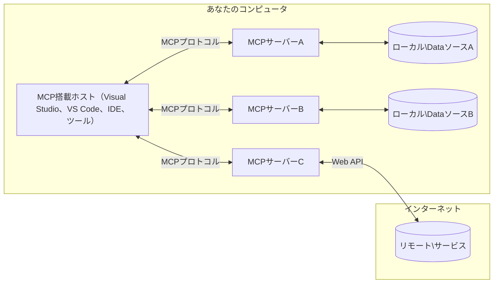

# MCPコアコンセプト：AI統合のためのモデルコンテキストプロトコルのマスター

[](https://youtu.be/earDzWGtE84)

_(このレッスンのビデオを見るには上の画像をクリックしてください)_

[Model Context Protocol (MCP)](https://github.com/modelcontextprotocol)は、大規模言語モデル（LLM）と外部ツール、アプリケーション、データソース間の通信を最適化する強力で標準化されたフレームワークです。  
このガイドでは、MCPのコアコンセプトについて説明します。クライアント-サーバーアーキテクチャ、主要コンポーネント、通信の仕組み、実装ベストプラクティスを学びます。

- **明確なユーザー同意**：すべてのデータアクセスと操作は、実行前に明確なユーザー承認が必要です。ユーザーはどのデータにアクセスし、どのアクションが実行されるかを明確に理解し、権限管理や認可は詳細に制御されます。

- **データプライバシー保護**：ユーザーデータは明確な同意がある場合のみ公開され、インタラクション全体を通じて堅牢なアクセス制御で保護されなければなりません。実装は不正なデータ送信を防ぎ、厳格なプライバシー境界を保持する必要があります。

- **ツール実行の安全性**：すべてのツール呼び出しは、ツールの機能、パラメーター、潜在的影響を十分理解した上で、明示的なユーザー同意が必要です。堅牢なセキュリティ境界により、意図しない、不安全、悪意のあるツール実行を防止しなければなりません。

- **トランスポートレイヤーセキュリティ**：すべての通信チャネルは適切な暗号化と認証機構を使用すべきです。リモート接続では安全なトランスポートプロトコルと適切な資格情報管理を実装します。

#### 実装ガイドライン：

- **権限管理**：ユーザーがアクセス可能なサーバー、ツール、リソースを細かく制御できるシステムを実装する  
- **認証と認可**：OAuthやAPIキーなどの安全な認証方式を使用し、適切なトークン管理と期限設定を行う  
- **入力検証**：すべてのパラメーターとデータ入力を定義されたスキーマに基づき検証し、インジェクション攻撃を防止  
- **監査ログ**：すべての操作の包括的なログを保持し、セキュリティ監視とコンプライアンスに利用  

## 概要

このレッスンでは、Model Context Protocol (MCP) エコシステムを構成する基本的なアーキテクチャとコンポーネントについて説明します。クライアント-サーバーアーキテクチャ、主要コンポーネント、MCPインタラクションを動かす通信メカニズムを学びます。

## 主要学習目標

このレッスン終了時には以下を理解します：

- MCPクライアント-サーバーアーキテクチャを理解する  
- ホスト、クライアント、サーバーの役割と責任を識別する  
- MCPを柔軟な統合レイヤーにするコア機能を分析する  
- MCPエコシステム内の情報の流れを学ぶ  
- .NET、Java、Python、JavaScriptのコード例を通じて実践的な洞察を得る  

## MCPアーキテクチャ：詳細解説

MCPエコシステムはクライアント-サーバーモデルに基づいて構築されています。このモジュール構造により、AIアプリケーションはツール、データベース、API、およびコンテキストリソースと効率的に連携できます。以下に、このアーキテクチャのコアコンポーネントを分解して説明します。

MCPの基本はクライアント-サーバーアーキテクチャで、ホストアプリケーションは複数のサーバーに接続可能です：


- **MCPホスト**: VSCode、Claude Desktop、IDE、またはMCPを介してデータにアクセスしたいAIツールのようなプログラム  
- **MCPクライアント**: サーバーとの1対1接続を維持するプロトコルクライアント  
- **MCPサーバー**: 標準化されたModel Context Protocolを通じて特定の機能を提供する軽量プログラム  
- **ローカルデータソース**: コンピューターのファイル、データベース、サービス、MCPサーバーが安全にアクセス可能なもの  
- **リモートサービス**: インターネット越しに利用可能で、MCPサーバーがAPIを通じて接続できる外部システム  

MCPプロトコルは進化する標準仕様で、日付ベースのバージョニング（YYYY-MM-DD形式）を採用しています。現在のプロトコルバージョンは **2025-11-25** です。最新の更新情報は[プロトコル仕様](https://modelcontextprotocol.io/specification/2025-11-25/)で確認できます。

### 1. ホスト

Model Context Protocol (MCP) における**ホスト**は、ユーザーがプロトコルと対話するための主なインターフェースとなるAIアプリケーションです。ホストは複数のMCPサーバーへの接続を管理するために、各サーバー接続用の専用MCPクライアントを作成します。ホストの例としては：

- **AIアプリケーション**: Claude Desktop, Visual Studio Code, Claude Code  
- **開発環境**: MCP統合を備えたIDEやコードエディター  
- **カスタムアプリケーション**: 目的特化型AIエージェントやツール  

**ホスト**はAIモデルとの対話を調整するアプリケーションです。具体的には：

- **AIモデルの調整役**: LLMを実行または連携し、応答生成やAIワークフローの調整を行う  
- **クライアント接続管理**: MCPサーバーごとに1つのMCPクライアントを作成・維持する  
- **ユーザーインターフェース制御**: 会話の流れやユーザーとの対話、応答の表示を処理  
- **セキュリティ適用**: 権限やセキュリティ制約、認証を管理  
- **ユーザー同意処理**: データ共有やツール実行のユーザー承認を管理  

### 2. クライアント

**クライアント**はホストとMCPサーバー間の1対1接続を維持する必須コンポーネントです。各MCPクライアントはホストにより特定のMCPサーバーへ接続するために起動され、組織的かつ安全な通信チャネルを確保します。複数のクライアントにより、ホストは複数のサーバーに同時接続可能です。

**クライアント**はホスト内のコネクタコンポーネントです。以下を行います：

- **プロトコル通信**: JSON-RPC 2.0リクエストとしてプロンプトや指示をサーバーに送信  
- **機能交渉**: 初期化時にサーバーと対応機能やプロトコルバージョンを交渉  
- **ツール実行管理**: モデルからのツール実行要求を管理し、応答を処理  
- **リアルタイム更新処理**: サーバーからの通知やリアルタイム更新を処理  
- **応答処理**: サーバーの応答を処理してユーザーへの表示用に整形  

### 3. サーバー

**サーバー**はMCPクライアントに対してコンテキストやツール、機能を提供するプログラムです。ローカル（ホストと同じマシン）またはリモート（外部プラットフォーム上）で実行可能で、クライアントからのリクエストを処理し構造化された応答を返します。標準化されたModel Context Protocolを通じて特定の機能を公開します。

**サーバー**はコンテキストと機能を提供するサービスです。以下を行います：

- **機能登録**: 利用可能なプリミティブ（リソース、プロンプト、ツール）をクライアントに登録・公開  
- **リクエスト処理**: クライアントからのツール呼び出し、リソース要求、プロンプト要求を受け実行  
- **コンテキスト提供**: モデル応答を強化するためのコンテキスト情報やデータを提供  
- **状態管理**: セッション状態を維持し、ステートフルなインタラクションを必要に応じて処理  
- **リアルタイム通知**: 機能変更やアップデートに関する通知を接続中のクライアントに送信  

サーバーは誰でも開発可能で、専門的な機能でモデル能力を拡張できます。ローカル・リモートの両デプロイシナリオに対応しています。

### 4. サーバープリミティブ

Model Context Protocol (MCP) のサーバーは、クライアント、ホスト、言語モデル間の豊富な相互作用の基盤となる3つのコア**プリミティブ**を提供します。これらのプリミティブは、プロトコルを通じて利用可能なコンテキスト情報とアクションタイプを定義します。

MCPサーバーは以下3つのコアプリミティブの任意の組み合わせを公開できます：

#### リソース

**リソース**はAIアプリケーションにコンテキスト情報を提供するデータソースです。静的または動的コンテンツを表し、モデルの理解と意思決定を支援します：

- **コンテキストデータ**: AIモデルの利用に適した構造化された情報やコンテキスト  
- **ナレッジベース**: ドキュメントリポジトリ、記事、マニュアル、研究論文  
- **ローカルデータソース**: ファイル、データベース、ローカルシステム情報  
- **外部データ**: APIレスポンス、ウェブサービス、リモートシステムデータ  
- **動的コンテンツ**: 外部条件に応じてリアルタイムで更新されるデータ  

リソースはURIで識別され、`resources/list` で発見可能、`resources/read` で取得されます：

```text
file://documents/project-spec.md
database://production/users/schema
api://weather/current
```

#### プロンプト

**プロンプト**は言語モデルとの対話を構造化するための再利用可能なテンプレートです。標準化されたインタラクションパターンやテンプレート化されたワークフローを提供します：

- **テンプレートベースの対話**: 事前構成されたメッセージや会話開始文  
- **ワークフローテンプレート**: 共通タスクや対話の標準的なシーケンス  
- **Few-shot例**: モデル指示のための例ベーステンプレート  
- **システムプロンプト**: モデルの振る舞いやコンテキストを定義する基本プロンプト  
- **動的テンプレート**: 特定のコンテキストに適応するパラメータ化されたプロンプト  

プロンプトは変数置換をサポートし、`prompts/list` で発見、`prompts/get` で取得されます：

```markdown
Generate a {{task_type}} for {{product}} targeting {{audience}} with the following requirements: {{requirements}}
```

#### ツール

**ツール**はAIモデルが特定のアクションを実行するために呼び出せる実行可能な関数です。MCPエコシステムの「動詞」として外部システムとの連携を可能にします：

- **実行可能関数**: モデルが特定のパラメーターで呼び出せる離散的操作  
- **外部システム統合**: API呼び出し、データベースクエリ、ファイル操作、計算  
- **ユニークアイデンティティ**: 各ツールは固有の名前、説明、パラメータスキーマを持つ  
- **構造化I/O**: パラメーターは検証され、構造化かつ型付けされた応答を返す  
- **アクション機能**: モデルが現実世界のアクションを実行し、生データを取得可能にする  

ツールはパラメータ検証のためJSON Schemaを用い、`tools/list` で発見、`tools/call` で実行されます。ツールはUI表示に良好な**アイコン**も含むことができます。

**ツール注釈**：`readOnlyHint`、`destructiveHint` など、ツールが読み取り専用か破壊的かを示す動作注釈がサポートされており、クライアントがツール実行の判断材料にできます。

ツール定義の例：

```typescript
server.tool(
  "search_products", 
  {
    query: z.string().describe("Search query for products"),
    category: z.string().optional().describe("Product category filter"),
    max_results: z.number().default(10).describe("Maximum results to return")
  }, 
  async (params) => {
    // 検索を実行し、構造化された結果を返します
    return await productService.search(params);
  }
);
```

## クライアントプリミティブ

Model Context Protocol (MCP) において、**クライアント**はサーバーがホストアプリケーションに追加機能を要求できるプリミティブを公開できます。これらクライアント側プリミティブは、AIモデル能力およびユーザーインタラクションにアクセス可能なより豊かなインタラクティブなサーバー実装を可能にします。

### サンプリング

**サンプリング**は、サーバーがクライアントのAIアプリケーションから言語モデルの補完を要求できるプリミティブです。これにより、サーバーは自身のモデル依存を持たずにLLM機能を利用できます：

- **モデル非依存アクセス**: サーバーはLLM SDKやモデルアクセス管理なしに補完を要求可能  
- **サーバー起点のAI**: サーバーがクライアントのAIモデルを使って自律的にコンテンツ生成可能  
- **再帰的LLMインタラクション**: サーバーがAI支援を必要とする複雑なシナリオに対応  
- **動的コンテンツ生成**: ホストのモデルを用いたコンテキスト応答生成が可能  
- **ツール呼び出し対応**: サーバーは`tools`や`toolChoice`パラメーターを含み、クライアントモデルがツールをサンプリング中に呼び出せる  

サンプリングは`sampling/complete`メソッドを介して開始され、サーバーからクライアントに補完要求が送られます。

### ルーツ

**ルーツ**はクライアントがサーバーに対し、アクセス可能なファイルシステムの境界を標準化された方法で公開する仕組みです。これによりサーバーはアクセス可能なディレクトリやファイルを理解できます：

- **ファイルシステム境界**: サーバーが操作可能なファイルシステムの境界を定義  
- **アクセス制御**: サーバーにアクセス権のあるディレクトリ・ファイルを伝達  
- **動的更新**: ルートのリスト変更時にクライアントがサーバーに通知  
- **URIベース識別**: `file://` URIでアクセス可能なディレクトリやファイルを識別  

ルーツは`roots/list`で発見され、クライアントはルートリストが変更された際に`notifications/roots/list_changed`を送信します。

### エリシテーション  

**エリシテーション**はサーバーがクライアントユーザーから追加情報や確認を要求するためのインターフェースです：

- **ユーザー入力要求**: ツール実行のために必要な追加情報を要求可能  
- **確認ダイアログ**: センシティブまたは影響の大きい操作でユーザー承認を求める  
- **インタラクティブワークフロー**: サーバーがステップバイステップのユーザー対話を構築可能  
- **動的パラメーター収集**: ツール実行の欠落パラメーターや任意パラメーターを集める  

エリシテーション要求は`elicitation/request`メソッドを使い、クライアントのインターフェースを通してユーザー入力を収集します。

**URLモードエリシテーション**：サーバーはURLベースのユーザーインタラクションも要求可能で、ユーザーを認証・承認・データ入力のため外部ウェブページに誘導できます。

### ロギング

**ロギング**はサーバーがクライアントに対し、デバッグや監視、運用の可視化のために構造化されたログメッセージを送信する機能です：

- **デバッグ支援**: トラブルシューティングのため詳細な実行ログを提供  
- **運用監視**: ステータス更新やパフォーマンス指標をクライアントに送信  
- **エラー報告**: 詳細なエラーコンテキストと診断情報を提供  
- **監査記録**: サーバーの操作や判断の包括的なログを作成  

ロギングメッセージはサーバー運用の透明性を高め、デバッグ支援を目的としてクライアントに送信されます。

## MCPにおける情報フロー

Model Context Protocol (MCP)は、ホスト、クライアント、サーバー、モデル間の情報流れを構造的に定義します。この流れを理解することで、ユーザーの要求処理と外部ツールやデータがモデル応答に統合される仕組みが明確になります。
- **ホストが接続を開始**  
  ホストアプリケーション（IDEやチャットインターフェースなど）が、通常はSTDIO、WebSocket、または他のサポートされているトランスポートを介してMCPサーバーへの接続を確立します。

- **機能の交渉**  
  クライアント（ホストに組み込まれている）とサーバーは、サポートしている機能、ツール、リソース、およびプロトコルのバージョンに関する情報を交換します。これにより、両者がセッションで利用可能な機能を理解します。

- **ユーザーのリクエスト**  
  ユーザーはホストとやり取り（例えば、プロンプトやコマンドの入力）を行います。ホストはこの入力を収集し、処理のためにクライアントに渡します。

- **リソースまたはツールの使用**  
  - クライアントは、モデルの理解を深めるためにサーバーから追加のコンテキストやリソース（ファイル、データベースのエントリ、ナレッジベースの記事など）を要求することがあります。  
  - モデルがツールの使用（データ取得、計算の実行、API呼び出しなど）が必要と判断した場合、クライアントはツールの名前とパラメータを指定してサーバーにツール呼び出しリクエストを送信します。

- **サーバーの実行**  
  サーバーはリソースまたはツールのリクエストを受け取り、必要な操作（関数の実行、データベースクエリ、ファイルの取得など）を行い、結果を構造化された形式でクライアントに返します。

- **応答の生成**  
  クライアントはサーバーの応答（リソースデータやツール出力など）を進行中のモデルインタラクションに統合します。モデルはこの情報を用いて包括的かつ文脈に沿った応答を生成します。

- **結果の提示**  
  ホストはクライアントから最終出力を受け取り、ユーザーに提示します。これにはモデルの生成テキストやツール実行やリソース検索の結果が含まれることが多いです。

このフローにより、MCPはモデルを外部ツールやデータソースとシームレスに接続することで、高度で対話的、かつ文脈認識型のAIアプリケーションをサポートします。

## プロトコルのアーキテクチャとレイヤー

MCPは、完全な通信フレームワークを提供するために連携する2つの異なるアーキテクチャレイヤーで構成されています。

### データレイヤー

**データレイヤー**は、**JSON-RPC 2.0**を基盤としてコアMCPプロトコルを実装します。このレイヤーはメッセージ構造、意味論、および相互作用パターンを定義します。

#### コアコンポーネント：

- **JSON-RPC 2.0 プロトコル**：すべての通信は標準化されたJSON-RPC 2.0メッセージ形式を使用して、メソッド呼び出し、応答、通知を行います  
- **ライフサイクル管理**：クライアントとサーバー間の接続初期化、機能交渉、およびセッション終了を管理します  
- **サーバープリミティブ**：サーバーがツール、リソース、プロンプトを介してコア機能を提供できるようにします  
- **クライアントプリミティブ**：サーバーがLLMのサンプリング依頼、ユーザー入力の促し、ログメッセージの送信をクライアントに要求できるようにします  
- **リアルタイム通知**：ポーリングなしで動的更新の非同期通知をサポートします

#### 重要な機能：

- **プロトコルバージョン交渉**：日付ベースのバージョニング（YYYY-MM-DD）を用いて互換性を保証します  
- **機能の発見**：初期化時にクライアントとサーバーがサポートする機能情報を交換します  
- **ステートフルセッション**：複数のインタラクションを通じて接続状態を維持し、文脈の連続性を保持します

### トランスポートレイヤー

**トランスポートレイヤー**は、MCP参加者間の通信チャネル、メッセージのフレーミング、および認証を管理します。

#### サポートされるトランスポートメカニズム：

1. **STDIOトランスポート**：  
   - 標準入力・出力ストリームを使用し、プロセス間の直接通信を行います  
   - ネットワークオーバーヘッドがなく同一マシン上のローカルプロセスに最適  
   - ローカルMCPサーバー実装によく用いられます

2. **ストリーム可能HTTPトランスポート**：  
   - クライアントからサーバーへのメッセージにHTTP POSTを使用  
   - サーバーからクライアントへのストリーミングにオプションのServer-Sent Events (SSE)を利用可能  
   - ネットワーク越しのリモートサーバー通信を可能にします  
   - 標準的なHTTP認証（ベアラートークン、APIキー、カスタムヘッダ）をサポート  
   - MCPはセキュアなトークンベース認証にOAuthを推奨します

#### トランスポート抽象化：

トランスポートレイヤーは通信の詳細をデータレイヤーから抽象化し、すべてのトランスポートメカニズムで同一のJSON-RPC 2.0メッセージ形式を可能にします。この抽象化により、アプリケーションはローカルサーバーとリモートサーバーをシームレスに切り替えることが可能です。

### セキュリティ考慮事項

MCPの実装は、すべてのプロトコル操作において安全で信頼できるやり取りを保証するために、いくつかの重要なセキュリティ原則を遵守する必要があります。

- **ユーザーの同意と制御**：ユーザーはデータアクセスや操作を実行する前に明示的な同意を与える必要があります。共有されるデータや許可されるアクションに関して明確に制御できるべきであり、レビューや承認のための直感的なUIがサポートされます。

- **データのプライバシー**：ユーザーデータは明示的な同意を得た場合のみ公開され、適切なアクセス制御により保護されなければなりません。MCPの実装は不正なデータ送信を防止し、すべてのやり取りでプライバシーを維持します。

- **ツールの安全性**：ツール呼び出し前に明示的なユーザー同意が必要です。ユーザーは各ツールの機能を明確に理解し、意図しないまたは安全でないツール実行を防ぐために堅牢なセキュリティ境界を強制します。

これらのセキュリティ原則を守ることで、MCPは強力なAI統合を実現しつつ、すべてのプロトコルインタラクションにおいてユーザーの信頼、プライバシー、安全性を保持します。

## コード例：主なコンポーネント

以下は、主要なMCPサーバーコンポーネントやツールの実装方法を示す、いくつかの一般的なプログラミング言語でのコード例です。

### .NET例：ツール付きのシンプルなMCPサーバーの作成

以下はカスタムツールを備えたシンプルなMCPサーバーを実装する実用的な.NETコード例です。この例ではツールの定義と登録、リクエストの処理、Model Context Protocolを使ったサーバー接続方法を示しています。

```csharp
using System;
using System.Threading.Tasks;
using ModelContextProtocol.Server;
using ModelContextProtocol.Server.Transport;
using ModelContextProtocol.Server.Tools;

public class WeatherServer
{
    public static async Task Main(string[] args)
    {
        // Create an MCP server
        var server = new McpServer(
            name: "Weather MCP Server",
            version: "1.0.0"
        );
        
        // Register our custom weather tool
        server.AddTool<string, WeatherData>("weatherTool", 
            description: "Gets current weather for a location",
            execute: async (location) => {
                // Call weather API (simplified)
                var weatherData = await GetWeatherDataAsync(location);
                return weatherData;
            });
        
        // Connect the server using stdio transport
        var transport = new StdioServerTransport();
        await server.ConnectAsync(transport);
        
        Console.WriteLine("Weather MCP Server started");
        
        // Keep the server running until process is terminated
        await Task.Delay(-1);
    }
    
    private static async Task<WeatherData> GetWeatherDataAsync(string location)
    {
        // This would normally call a weather API
        // Simplified for demonstration
        await Task.Delay(100); // Simulate API call
        return new WeatherData { 
            Temperature = 72.5,
            Conditions = "Sunny",
            Location = location
        };
    }
}

public class WeatherData
{
    public double Temperature { get; set; }
    public string Conditions { get; set; }
    public string Location { get; set; }
}
```

### Java例：MCPサーバーコンポーネント

この例は上記の.NET例と同様のMCPサーバーとツール登録をJavaで実装したものです。

```java
import io.modelcontextprotocol.server.McpServer;
import io.modelcontextprotocol.server.McpToolDefinition;
import io.modelcontextprotocol.server.transport.StdioServerTransport;
import io.modelcontextprotocol.server.tool.ToolExecutionContext;
import io.modelcontextprotocol.server.tool.ToolResponse;

public class WeatherMcpServer {
    public static void main(String[] args) throws Exception {
        // MCPサーバーを作成する
        McpServer server = McpServer.builder()
            .name("Weather MCP Server")
            .version("1.0.0")
            .build();
            
        // 天気ツールを登録する
        server.registerTool(McpToolDefinition.builder("weatherTool")
            .description("Gets current weather for a location")
            .parameter("location", String.class)
            .execute((ToolExecutionContext ctx) -> {
                String location = ctx.getParameter("location", String.class);
                
                // 天気データを取得する（簡略化）
                WeatherData data = getWeatherData(location);
                
                // フォーマットされた応答を返す
                return ToolResponse.content(
                    String.format("Temperature: %.1f°F, Conditions: %s, Location: %s", 
                    data.getTemperature(), 
                    data.getConditions(), 
                    data.getLocation())
                );
            })
            .build());
        
        // stdioトランスポートを使用してサーバーを接続する
        try (StdioServerTransport transport = new StdioServerTransport()) {
            server.connect(transport);
            System.out.println("Weather MCP Server started");
            // プロセスが終了するまでサーバーを稼働し続ける
            Thread.currentThread().join();
        }
    }
    
    private static WeatherData getWeatherData(String location) {
        // 実装では天気APIを呼び出す
        // 例示のために簡略化している
        return new WeatherData(72.5, "Sunny", location);
    }
}

class WeatherData {
    private double temperature;
    private String conditions;
    private String location;
    
    public WeatherData(double temperature, String conditions, String location) {
        this.temperature = temperature;
        this.conditions = conditions;
        this.location = location;
    }
    
    public double getTemperature() {
        return temperature;
    }
    
    public String getConditions() {
        return conditions;
    }
    
    public String getLocation() {
        return location;
    }
}
```

### Python例：MCPサーバーの構築

この例ではfastmcpを使用しているため、事前にインストールしてください：

```python
pip install fastmcp
```
コードサンプル：

```python
#!/usr/bin/env python3
import asyncio
from fastmcp import FastMCP
from fastmcp.transports.stdio import serve_stdio

# FastMCPサーバーを作成する
mcp = FastMCP(
    name="Weather MCP Server",
    version="1.0.0"
)

@mcp.tool()
def get_weather(location: str) -> dict:
    """Gets current weather for a location."""
    return {
        "temperature": 72.5,
        "conditions": "Sunny",
        "location": location
    }

# クラスを使用した別のアプローチ
class WeatherTools:
    @mcp.tool()
    def forecast(self, location: str, days: int = 1) -> dict:
        """Gets weather forecast for a location for the specified number of days."""
        return {
            "location": location,
            "forecast": [
                {"day": i+1, "temperature": 70 + i, "conditions": "Partly Cloudy"}
                for i in range(days)
            ]
        }

# クラスのツールを登録する
weather_tools = WeatherTools()

# サーバーを起動する
if __name__ == "__main__":
    asyncio.run(serve_stdio(mcp))
```

### JavaScript例：MCPサーバーの作成

この例はJavaScriptによるMCPサーバー作成と、2つの天気関連ツールの登録例です。

```javascript
// 公式のモデルコンテキストプロトコルSDKを使用する
import { McpServer } from "@modelcontextprotocol/sdk/server/mcp.js";
import { StdioServerTransport } from "@modelcontextprotocol/sdk/server/stdio.js";
import { z } from "zod"; // パラメータ検証のために

// MCPサーバーを作成する
const server = new McpServer({
  name: "Weather MCP Server",
  version: "1.0.0"
});

// 天気ツールを定義する
server.tool(
  "weatherTool",
  {
    location: z.string().describe("The location to get weather for")
  },
  async ({ location }) => {
    // これは通常天気APIを呼び出します
    // デモンストレーションのために簡略化しています
    const weatherData = await getWeatherData(location);
    
    return {
      content: [
        { 
          type: "text", 
          text: `Temperature: ${weatherData.temperature}°F, Conditions: ${weatherData.conditions}, Location: ${weatherData.location}` 
        }
      ]
    };
  }
);

// 予報ツールを定義する
server.tool(
  "forecastTool",
  {
    location: z.string(),
    days: z.number().default(3).describe("Number of days for forecast")
  },
  async ({ location, days }) => {
    // これは通常天気APIを呼び出します
    // デモンストレーションのために簡略化しています
    const forecast = await getForecastData(location, days);
    
    return {
      content: [
        { 
          type: "text", 
          text: `${days}-day forecast for ${location}: ${JSON.stringify(forecast)}` 
        }
      ]
    };
  }
);

// ヘルパー関数
async function getWeatherData(location) {
  // API呼び出しをシミュレートする
  return {
    temperature: 72.5,
    conditions: "Sunny",
    location: location
  };
}

async function getForecastData(location, days) {
  // API呼び出しをシミュレートする
  return Array.from({ length: days }, (_, i) => ({
    day: i + 1,
    temperature: 70 + Math.floor(Math.random() * 10),
    conditions: i % 2 === 0 ? "Sunny" : "Partly Cloudy"
  }));
}

// stdioトランスポートを使用してサーバーに接続する
const transport = new StdioServerTransport();
server.connect(transport).catch(console.error);

console.log("Weather MCP Server started");
```

このJavaScript例は、天気関連ツールを登録し、stdioトランスポートを使ってクライアントからのリクエストを処理するMCPサーバーの作成方法を示しています。

## セキュリティと認可

MCPには、プロトコル全体でのセキュリティと認可の管理を支援するいくつかの組み込み概念とメカニズムがあります。

1. **ツールの権限管理**  
   クライアントはセッション中にモデルが使用可能なツールを指定できます。これにより、明示的に許可されたツールのみがアクセス可能となり、意図しないまたは安全でない操作のリスクを低減します。権限はユーザーの設定、組織ポリシー、インタラクションの文脈に基づいて動的に構成可能です。

2. **認証**  
   サーバーはツール、リソース、または機密操作へのアクセスに認証を要求できます。これにはAPIキー、OAuthトークン、その他認証スキームが含まれます。適切な認証により、信頼できるクライアントとユーザーのみがサーバー側機能を起動できるようにします。

3. **検証**  
   すべてのツール呼び出しでパラメータ検証を強制します。各ツールはパラメータの期待される型、形式、制約を定義し、サーバーは受信リクエストをそれに従って検証します。これにより、不正または悪意ある入力がツール実装に渡らず、操作の整合性を保ちます。

4. **レート制限**  
   サーバー資源の乱用防止と公正利用のために、ツール呼び出しやリソースアクセスにレート制限を実施できます。制限はユーザー単位、セッション単位、またはグローバルに適用可能で、サービス拒否攻撃や過剰なリソース消費から保護します。

これらのメカニズムを組み合わせることで、MCPは言語モデルを外部ツールやデータソースと安全に統合しつつ、ユーザーと開発者にアクセスと利用の精緻な制御を提供します。

## プロトコルメッセージと通信フロー

MCP通信は構造化された**JSON-RPC 2.0**メッセージを使用し、ホスト、クライアント、サーバー間の明確で信頼できるやり取りを実現します。プロトコルは異なる操作タイプごとに特定のメッセージパターンを定義しています。

### コアメッセージタイプ：

#### **初期化メッセージ**
- **`initialize` リクエスト**：接続確立とプロトコルバージョンおよび機能の交渉  
- **`initialize` レスポンス**：サポートする機能とサーバー情報の確認  
- **`notifications/initialized`**：初期化完了とセッション準備完了の通知

#### **発見メッセージ**
- **`tools/list` リクエスト**：サーバーの利用可能なツールの発見  
- **`resources/list` リクエスト**：利用可能なリソース（データソース）の一覧取得  
- **`prompts/list` リクエスト**：利用可能なプロンプトテンプレートの取得

#### **実行メッセージ**  
- **`tools/call` リクエスト**：指定したパラメータで特定のツールを実行  
- **`resources/read` リクエスト**：特定のリソースから内容を取得  
- **`prompts/get` リクエスト**：オプションパラメータ付きのプロンプトテンプレート取得

#### **クライアント側メッセージ**
- **`sampling/complete` リクエスト**：サーバーがクライアントに対しLLM完了処理を依頼  
- **`elicitation/request`**：サーバーがクライアントを通じてユーザー入力を促す  
- **ログメッセージ**：サーバーが構造化されたログをクライアントに送信

#### **通知メッセージ**
- **`notifications/tools/list_changed`**：ツール変更をクライアントに通知  
- **`notifications/resources/list_changed`**：リソース変更をクライアントに通知  
- **`notifications/prompts/list_changed`**：プロンプト変更をクライアントに通知

### メッセージ構造：

すべてのMCPメッセージはJSON-RPC 2.0フォーマットに従います：
- **リクエストメッセージ**：`id`、`method`、およびオプションの`params`を含む  
- **レスポンスメッセージ**：`id`と`result`または`error`を含む  
- **通知メッセージ**：`method`とオプションの`params`を含み、`id`はなくレスポンス不要

この構造化通信により、リアルタイム更新、ツールチェイン、堅牢なエラーハンドリングなど高度なシナリオを支える信頼性、追跡可能性、拡張性の高いインタラクションが可能となります。

### タスク（実験的機能）

**タスク**は、MCPリクエストに対して耐久性のある実行ラッパーを提供し結果の後処理取得や状態追跡を可能にする実験的機能です：

- **長時間実行操作**：高コストな計算、ワークフロー自動化、バッチ処理を追跡  
- **結果の遅延取得**：操作完了後にステータスをポーリングして結果を取得  
- **状態追跡**：定義されたライフサイクル状態を通じて進捗を監視  
- **多段階操作**：複数のインタラクションにまたがる複雑なワークフローをサポート

タスクは即時完了しない操作を非同期で実行可能にします。

## 重要なポイントまとめ

- **アーキテクチャ**：MCPはホストが複数クライアント接続を管理するクライアントサーバーアーキテクチャです  
- **参加者**：エコシステムにはホスト（AIアプリ）、クライアント（プロトコルコネクター）、サーバー（機能提供者）が含まれます  
- **トランスポートメカニズム**：STDIO（ローカル）およびストリーム可能HTTP＋SSE（リモート）をサポート  
- **コアプリミティブ**：サーバーはツール（実行可能関数）、リソース（データソース）、プロンプト（テンプレート）を公開  
- **クライアントプリミティブ**：サーバーはクライアントにサンプリング（ツール呼出し対応のLLM完了）、入力促進（URLモード含む）、ルート（ファイルシステム境界）、ログ送信を要求可能  
- **実験的機能**：タスクは長時間操作用の耐久性ラッパーを提供  
- **プロトコル基盤**：JSON-RPC 2.0上に構築され、日付ベースのバージョニング（現行：2025-11-25）を採用  
- **リアルタイム対応**：動的更新とリアルタイム同期の通知をサポート  
- **セキュリティ最優先**：明確なユーザー同意、データプライバシー保護、安全なトランスポートが必須

## 演習

独自のドメインに役立つシンプルなMCPツールを設計してください。以下を定義します：
1. ツール名  
2. 受け入れるパラメータ  
3. 返す出力  
4. モデルがこのツールを使いユーザーの問題を解決する方法

---

## 次に読む

次の章：[Chapter 2: Security](../02-Security/README.md)

---

<!-- CO-OP TRANSLATOR DISCLAIMER START -->
**免責事項**：
本書類はAI翻訳サービス「Co-op Translator」（https://github.com/Azure/co-op-translator）を使用して翻訳されました。正確性には努めておりますが、自動翻訳には誤りや不正確な部分が含まれる可能性があることをご承知ください。原文の言語による書類が正式な情報源とみなされます。重要な情報については、専門の人間による翻訳を推奨します。本翻訳の利用により生じた誤解や誤訳については、一切責任を負いかねます。
<!-- CO-OP TRANSLATOR DISCLAIMER END -->