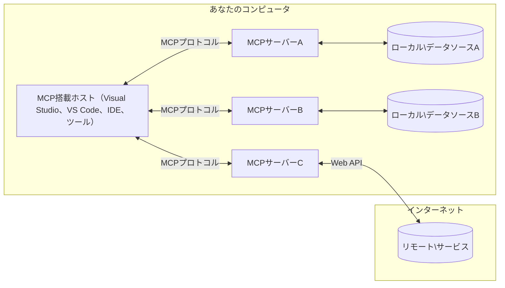

# MCPコアコンセプト：AI統合のためのモデルコンテキストプロトコルのマスター

[](https://youtu.be/earDzWGtE84)

_(上の画像をクリックすると、このレッスンのビデオを視聴できます)_

[Model Context Protocol (MCP)](https://github.com/modelcontextprotocol)は、大規模言語モデル（LLM）と外部ツール、アプリケーション、データソース間の通信を最適化する強力で標準化されたフレームワークです。  
本ガイドでは、MCPのコアコンセプトについて解説します。クライアント-サーバーアーキテクチャ、重要なコンポーネント、通信の仕組み、実装のベストプラクティスを学びます。

- **明示的なユーザー同意**：すべてのデータアクセスと操作は、実行前に明確なユーザー承認が必要です。ユーザーは、どのデータにアクセスし、どのような操作が行われるかを明確に理解し、権限と承認を細かく制御できます。

- **データプライバシー保護**：ユーザーデータは明示同意がある場合にのみ開示され、インタラクションの全ライフサイクルで堅牢なアクセス制御によって保護されなければなりません。実装は不正なデータ送信を防ぎ、厳格なプライバシー境界を維持する必要があります。

- **ツール実行の安全性**：すべてのツール呼び出しは、ツールの機能、パラメータ、および潜在的な影響を明確に理解した上で、明示的なユーザー同意が必要です。堅牢なセキュリティ境界により、意図しない、安全でない、または悪意のあるツール実行を防止します。

- **トランスポート層のセキュリティ**：すべての通信チャネルは適切な暗号化と認証の仕組みを使用すべきです。リモート接続は安全なトランスポートプロトコルと適切な資格情報管理を実装します。

#### 実装ガイドライン：

- **権限管理**：ユーザーがアクセス可能なサーバー、ツール、リソースを細かく制御できる権限システムを実装する  
- **認証と認可**：安全な認証方式（OAuth、APIキー）を使用し、適切なトークン管理と有効期限を設ける  
- **入力検証**：定義済みスキーマに沿ってすべてのパラメータとデータ入力を検証し、インジェクション攻撃を防止する  
- **監査ログ**：セキュリティ監視とコンプライアンスのためにすべての操作を包括的にログ記録する

## 概要

本レッスンでは、Model Context Protocol (MCP)エコシステムの基本的なアーキテクチャとコンポーネントを解説します。クライアント-サーバーアーキテクチャ、主要コンポーネント、MCPインタラクションを支える通信メカニズムについて学びます。

## 主要な学習目標

このレッスンを終えると、以下が理解できます：

- MCPのクライアント-サーバーアーキテクチャを理解する  
- ホスト、クライアント、サーバーの役割と責任を特定する  
- MCPを柔軟な統合レイヤーにするコア機能を分析する  
- MCPエコシステム内の情報フローを学ぶ  
- .NET、Java、Python、JavaScriptによるコード例で実践的な洞察を得る

## MCPアーキテクチャ：より深い理解

MCPエコシステムはクライアント-サーバーモデルに基づいて構築されています。このモジュール構造により、AIアプリケーションはツール、データベース、API、コンテキストリソースと効率的に連携できます。アーキテクチャを主要コンポーネントに分解してみましょう。

MCPの中心はクライアント-サーバーアーキテクチャで、ホストアプリケーションが複数のサーバーに接続できます：


- **MCPホスト**：VSCode、Claude Desktop、IDE、またはMCPを通じてデータにアクセスしたいAIツールなどのプログラム  
- **MCPクライアント**：各サーバーと1対1の接続を維持するプロトコルクライアント  
- **MCPサーバー**：標準化されたModel Context Protocolを通じて特定の機能を提供する軽量プログラム  
- **ローカルデータソース**：MCPサーバーが安全にアクセス可能なコンピュータのファイル、データベース、サービス  
- **リモートサービス**：インターネット上で利用可能な外部システムで、MCPサーバーがAPIを通じて接続できるもの  

MCPプロトコルは日付ベースのバージョニング（YYYY-MM-DD形式）で進化している標準です。現在のプロトコルバージョンは**2025-11-25**です。最新のアップデートは[プロトコル仕様](https://modelcontextprotocol.io/specification/2025-11-25/)で確認できます。

### 1. ホスト

Model Context Protocol (MCP)において、**ホスト**はユーザーがプロトコルとやり取りする主要なインターフェースを提供するAIアプリケーションです。ホストは複数のMCPサーバーへの接続を管理し、サーバーごとに専用のMCPクライアントを作成します。ホストの例は次の通りです：

- **AIアプリケーション**：Claude Desktop、Visual Studio Code、Claude Code  
- **開発環境**：MCP統合されたIDEやコードエディタ  
- **カスタムアプリケーション**：目的特化型のAIエージェントやツール  

**ホスト**はAIモデルの対話を調整するアプリケーションで、以下を行います：

- **AIモデルのオーケストレーション**：LLMと対話して応答を生成し、AIワークフローを調整する  
- **クライアント接続管理**：MCPサーバー接続ごとにMCPクライアントを生成・維持する  
- **ユーザーインターフェース制御**：会話の流れ、ユーザー操作、応答の提示を処理  
- **セキュリティ管理**：権限、セキュリティ制約、認証を統制する  
- **ユーザー同意の扱い**：データ共有やツール実行に関するユーザー承認を管理する


### 2. クライアント

**クライアント**はホストとMCPサーバー間の専用1対1接続を維持する重要なコンポーネントです。各MCPクライアントはホストによって特定のMCPサーバーへの接続用にインスタンス化されており、整然と安全な通信チャネルを保証します。複数のクライアントによってホストは同時に複数のサーバーに接続可能です。

**クライアント**はホストアプリケーション内のコネクタコンポーネントで、以下の役割を担います：

- **プロトコル通信**：プロンプトや指示を含むJSON-RPC 2.0リクエストをサーバーに送信  
- **機能交渉**：初期化時にサーバーとサポートする機能、プロトコルバージョンを交渉  
- **ツール実行管理**：モデルからのツール実行要求を管理し、応答を処理  
- **リアルタイム更新**：サーバーからの通知やリアルタイム更新を処理  
- **応答処理**：サーバー応答の処理とユーザー表示向けのフォーマット

### 3. サーバー

**サーバー**はMCPクライアントに対してコンテキスト、ツール、機能を提供するプログラムです。ローカル（ホストと同じマシン）またはリモート（外部プラットフォーム）で実行可能で、クライアントからのリクエストを処理し、構造化された応答を提供します。標準化されたModel Context Protocolを通じて特定の機能を公開します。

**サーバー**はコンテキストと機能を提供するサービスで、以下を行います：

- **機能登録**：利用可能なプリミティブ（リソース、プロンプト、ツール）をクライアントに登録し公開  
- **リクエスト処理**：クライアントからのツール呼び出し、リソース要求、プロンプト要求を受信・実行  
- **コンテキスト提供**：モデル応答を強化するための文脈情報やデータを提供  
- **状態管理**：セッション状態を維持し、必要に応じて状態を持つやりとりを処理  
- **リアルタイム通知**：機能変更や更新に関する通知を接続クライアントに送信  

サーバーは誰でも開発可能で、専門的な機能を用いてモデル機能を拡張できます。ローカルおよびリモートの展開シナリオをサポートしています。

### 4. サーバープリミティブ

Model Context Protocol (MCP)のサーバーは、クライアント、ホスト、言語モデル間の豊かな対話のための基本ビルディングブロックを定義する3つのコア**プリミティブ**を提供します。これらプリミティブは、プロトコル経由で利用可能なコンテキスト情報とアクションの種類を規定します。

MCPサーバーは以下の3つのコアプリミティブを任意の組み合わせで公開できます：

#### リソース

**リソース**はAIアプリケーションにコンテキスト情報を提供するデータソースです。静的または動的なコンテンツで、モデルの理解と意思決定を高めます：

- **文脈データ**：AIモデルが消費する構造化情報とコンテキスト  
- **ナレッジベース**：文書リポジトリ、記事、マニュアル、研究論文  
- **ローカルデータソース**：ファイル、データベース、ローカルシステム情報  
- **外部データ**：APIレスポンス、ウェブサービス、リモートシステムデータ  
- **動的コンテンツ**：外部条件によりリアルタイムで更新されるデータ  

リソースはURIで識別され、`resources/list`による検出および`resources/read`による取得をサポートします：

```text
file://documents/project-spec.md
database://production/users/schema
api://weather/current
```

#### プロンプト

**プロンプト**は言語モデルとの対話を構造化する再利用可能なテンプレートです。標準化された対話パターンとテンプレート化されたワークフローを提供します：

- **テンプレートベースの対話**：事前構造化されたメッセージと会話の開始文  
- **ワークフローテンプレート**：一般的なタスクや対話の標準化されたシーケンス  
- **Few-shot例**：モデル指示のための例ベーステンプレート  
- **システムプロンプト**：モデルの振る舞いと文脈を定義する基盤的なプロンプト  
- **動的テンプレート**：特定の文脈に適応するパラメータ化されたプロンプト  

プロンプトは変数置換をサポートし、`prompts/list`で検出、`prompts/get`で取得できます：

```markdown
Generate a {{task_type}} for {{product}} targeting {{audience}} with the following requirements: {{requirements}}
```

#### ツール

**ツール**はAIモデルが具体的なアクションを実行するために呼び出せる実行可能機能です。MCPエコシステムの「動詞」を表し、モデルが外部システムと連携することを可能にします：

- **実行可能機能**：特定のパラメータでモデルが呼び出せる個別操作  
- **外部システム統合**：APIコール、データベースクエリ、ファイル操作、計算  
- **固有の識別子**：各ツールは固有の名前、説明、パラメータスキーマを持つ  
- **構造化I/O**：ツールは検証済みパラメータを受け取り、構造化かつ型付きの応答を返す  
- **実行能力**：モデルが実世界のアクションを実行し、ライブデータを取得可能にする  

ツールはJSON Schemaでパラメータ検証を定義し、`tools/list`で検出、`tools/call`で実行します。UI提示を向上させる追加メタデータとして**アイコン**を含めることも可能です。

**ツール注釈**：`readOnlyHint`や`destructiveHint`などの行動注釈をサポートし、ツールが読み取り専用か破壊的かを示し、クライアントが安全にツール実行を判断できるよう支援します。

ツール定義例：

```typescript
server.tool(
  "search_products", 
  {
    query: z.string().describe("Search query for products"),
    category: z.string().optional().describe("Product category filter"),
    max_results: z.number().default(10).describe("Maximum results to return")
  }, 
  async (params) => {
    // 検索を実行して構造化された結果を返します
    return await productService.search(params);
  }
);
```

## クライアントプリミティブ

Model Context Protocol (MCP)では、**クライアント**がプリミティブを公開して、サーバーがホストアプリケーションに追加機能を要求できるようにします。これらクライアント側プリミティブにより、より豊かで対話的なサーバー実装が可能となり、AIモデルの能力やユーザーインタラクションにアクセス可能になります。

### サンプリング

**サンプリング**は、サーバーがクライアントのAIアプリケーションから言語モデル完了を要求できる機能です。このプリミティブにより、サーバーは自身のモデル依存なしにLLM能力にアクセスできます：

- **モデル独立アクセス**：サーバーはLLM SDKやモデルアクセスを管理せずに完了要求が可能  
- **サーバー主導AI**：サーバーがクライアントのAIモデルを使って自律的にコンテンツ生成が可能  
- **再帰的LLM対話**：サーバーがAI支援を必要とする複雑なシナリオをサポート  
- **動的コンテンツ生成**：ホストのモデルを使い文脈に応じた応答を生成可能  
- **ツール呼び出しサポート**：サーバーは`samples/complete`で`tools`、`toolChoice`パラメータを含め、クライアントモデルがサンプリング中にツールを呼び出せるようにできる  

サンプリングは`sampling/complete`メソッドで開始され、サーバーがクライアントへ完了要求を送信します。

### ルーツ

**ルーツ**はクライアントがサーバーにファイルシステム境界を標準化して公開する方法で、サーバーはアクセス可能なディレクトリ・ファイルを理解します：

- **ファイルシステム境界**：サーバーが動作できるファイルシステム上の範囲を定義  
- **アクセス制御**：サーバーがどのディレクトリやファイルにアクセス権限があるか理解可能  
- **動的更新**：ルートリストの変更時にはクライアントがサーバーに通知  
- **URIベース識別**：`file://` URIでアクセス可能なディレクトリ・ファイルを指定  

ルーツは`roots/list`で検出され、ルート変更時にはクライアントが`notifications/roots/list_changed`を送信します。

### エリシテーション  

**エリシテーション**はサーバーがクライアントのインターフェースを介してユーザーに追加情報や承認を要求する機能です：

- **ユーザー入力要求**：ツール実行に必要な追加情報をサーバーがユーザーに尋ねる  
- **確認ダイアログ**：敏感または影響の大きい操作についてユーザー承認を要求  
- **対話的ワークフロー**：段階的なユーザーインタラクションの実現  
- **動的パラメータ収集**：ツール実行中に欠けているまたは任意のパラメータを収集  

エリシテーション要求は`elicitation/request`メソッドを使い、クライアントのインターフェース経由でユーザー入力を収集します。

**URLモードエリシテーション**：サーバーはURLベースのユーザーインタラクションも要求でき、ユーザーを認証、確認、データ入力のために外部ウェブページに誘導可能です。

### ロギング

**ロギング**はサーバーがデバッグ、監視、運用可視化のために構造化ログメッセージをクライアントに送信する機能です：

- **デバッグ支援**：詳細な実行ログを提供しトラブルシューティングを助ける  
- **運用監視**：クライアントに状態更新やパフォーマンス指標を送信  
- **エラー報告**：詳細なエラーコンテキスト、診断情報を提供  
- **監査証跡**：サーバー操作と判断の包括的記録を作成  

ロギングメッセージはサーバー操作の透明性を高め、デバッグを容易にするためにクライアントへ送信されます。

## MCPにおける情報フロー

Model Context Protocol (MCP)はホスト、クライアント、サーバー、モデル間の構造化された情報の流れを定義します。この流れを理解することで、ユーザー要求の処理方法や外部ツール・データがモデル応答に統合される仕組みが明確になります。
- **ホストが接続を開始**  
  ホストアプリケーション（IDEやチャットインターフェースなど）が通常STDIO、WebSocket、または他のサポートされているトランスポートを介してMCPサーバーへの接続を確立します。

- **機能ネゴシエーション**  
  クライアント（ホストに組み込まれている）とサーバーがサポートされている機能、ツール、リソース、プロトコルバージョンについて情報交換を行います。これにより、双方がセッションで利用可能な機能を理解します。

- **ユーザーリクエスト**  
  ユーザーがホスト（例：プロンプトやコマンドを入力）と対話します。ホストはこの入力を収集し、クライアントに処理のために渡します。

- **リソースまたはツールの使用**  
  - クライアントはモデルの理解を深めるために、サーバーから追加のコンテキストやリソース（ファイル、データベースエントリ、ナレッジベース記事など）を要求することがあります。  
  - モデルがツールの使用が必要と判断した場合（例：データ取得、計算実行、API呼び出し）、クライアントはツール名とパラメーターを指定してサーバーにツール呼び出しリクエストを送信します。

- **サーバー実行**  
  サーバーはリソースまたはツールの要求を受け取り、必要な操作（関数の実行、データベース照会、ファイル取得など）を行い、構造化された形式で結果をクライアントに返します。

- **応答生成**  
  クライアントはサーバーからの応答（リソースデータ、ツールの出力など）を継続するモデルの対話に統合します。モデルはこれらの情報を使って包括的かつ文脈的に適切な応答を生成します。

- **結果提示**  
  ホストはクライアントから最終的な出力を受け取り、モデルの生成テキストとツール実行やリソース検索の結果も含めてユーザーに提示します。

このフローにより、MCPはモデルと外部ツールやデータソースをシームレスに接続し、高度でインタラクティブかつコンテクストに対応したAIアプリケーションをサポートします。

## プロトコルのアーキテクチャとレイヤー

MCPは完全な通信フレームワークを提供するために連携する二つの異なるアーキテクチャレイヤーで構成されています：

### データレイヤー

**データレイヤー**は**JSON-RPC 2.0**を基盤としてMCPのコアプロトコルを実装します。このレイヤーはメッセージ構造、意味論、インタラクションパターンを定義します：

#### コアコンポーネント：

- **JSON-RPC 2.0プロトコル**：すべての通信は標準化されたJSON-RPC 2.0のメッセージフォーマットを使用し、メソッド呼び出し、応答、通知を行う  
- **ライフサイクル管理**：クライアントとサーバー間の接続初期化、機能ネゴシエーション、セッション終了を管理  
- **サーバープリミティブ**：ツール、リソース、プロンプトを通じてサーバーにコア機能を提供する手段  
- **クライアントプリミティブ**：サーバーがLLMのサンプリング要求、ユーザー入力の誘発、ログメッセージ送信を行えるようにする  
- **リアルタイム通知**：ポーリング不要の動的アップデートのための非同期通知をサポート

#### 主な機能：

- **プロトコルバージョンネゴシエーション**：日付ベースのバージョン管理（YYYY-MM-DD）を用いて互換性を保証  
- **機能検出**：初期化時にクライアントとサーバーがサポートする機能情報を交換  
- **ステートフルセッション**：複数のやり取りにわたり接続状態を維持し文脈の継続性を実現

### トランスポートレイヤー

**トランスポートレイヤー**はMCP参加者間の通信チャネル、メッセージのフレーミング、認証を管理します：

#### 対応トランスポート手段：

1. **STDIOトランスポート**：  
   - 標準入力/出力ストリームを使用したプロセス間直接通信  
   - 同一マシン上のローカルプロセスに最適でネットワーク負荷なし  
   - ローカルMCPサーバー実装で一般的に使用される

2. **ストリーム可能なHTTPトランスポート**：  
   - クライアント-サーバー間はHTTP POSTを使用  
   - サーバーからクライアントへのストリーミングにオプションでServer-Sent Events（SSE）を利用可能  
   - ネットワークを跨ぐリモートサーバー通信を可能にする  
   - 標準的なHTTP認証（ベアラートークン、APIキー、カスタムヘッダー）をサポート  
   - MCPは安全なトークン認証としてOAuthを推奨

#### トランスポート抽象化：

トランスポートレイヤーはデータレイヤーから通信の詳細を抽象化し、すべてのトランスポート手段で同じJSON-RPC 2.0メッセージフォーマットを利用可能にします。この抽象化により、アプリケーションはローカルとリモートサーバー間をシームレスに切り替えることができます。

### セキュリティに関する考慮事項

MCP実装は、プロトコル操作全体で安全かつ信頼性のある対話を確保するために、以下の重要なセキュリティ原則を遵守する必要があります：

- **ユーザー同意とコントロール**：データアクセスや操作実行の前に明示的なユーザー同意が必要です。ユーザーは共有データや許可された操作を明確にコントロールでき、活動のレビューと承認を助ける直感的なユーザーインターフェイスが求められます。

- **データプライバシー**：ユーザーデータは明確な同意がある場合にのみ公開され、適切なアクセス制御によって保護される必要があります。MCP実装は無許可のデータ送信を防ぎ、すべてのやり取りでプライバシーを維持します。

- **ツールの安全性**：ツールの呼び出しには事前に明示的なユーザー同意が必要です。ユーザーは各ツールの機能を明確に理解し、不意や安全でないツール実行を防止するために厳格なセキュリティ境界を適用しなければなりません。

これらのセキュリティ原則に従うことで、MCPは強力なAI統合を可能にしながら、すべてのプロトコル対話においてユーザーの信頼、プライバシー、安全を維持します。

## コード例：主要コンポーネント

以下は複数の人気プログラミング言語でのコード例で、主要なMCPサーバーコンポーネントおよびツールの実装方法を示しています。

### .NETの例：ツールを備えたシンプルなMCPサーバーの作成

独自ツールの定義と登録、リクエスト処理、Model Context Protocolを使ったサーバー接続の実装を示す実用的な.NETコード例です。

```csharp
using System;
using System.Threading.Tasks;
using ModelContextProtocol.Server;
using ModelContextProtocol.Server.Transport;
using ModelContextProtocol.Server.Tools;

public class WeatherServer
{
    public static async Task Main(string[] args)
    {
        // Create an MCP server
        var server = new McpServer(
            name: "Weather MCP Server",
            version: "1.0.0"
        );
        
        // Register our custom weather tool
        server.AddTool<string, WeatherData>("weatherTool", 
            description: "Gets current weather for a location",
            execute: async (location) => {
                // Call weather API (simplified)
                var weatherData = await GetWeatherDataAsync(location);
                return weatherData;
            });
        
        // Connect the server using stdio transport
        var transport = new StdioServerTransport();
        await server.ConnectAsync(transport);
        
        Console.WriteLine("Weather MCP Server started");
        
        // Keep the server running until process is terminated
        await Task.Delay(-1);
    }
    
    private static async Task<WeatherData> GetWeatherDataAsync(string location)
    {
        // This would normally call a weather API
        // Simplified for demonstration
        await Task.Delay(100); // Simulate API call
        return new WeatherData { 
            Temperature = 72.5,
            Conditions = "Sunny",
            Location = location
        };
    }
}

public class WeatherData
{
    public double Temperature { get; set; }
    public string Conditions { get; set; }
    public string Location { get; set; }
}
```

### Javaの例：MCPサーバーコンポーネント

上記の.NET例と同様のMCPサーバーおよびツール登録をJavaで実装した例です。

```java
import io.modelcontextprotocol.server.McpServer;
import io.modelcontextprotocol.server.McpToolDefinition;
import io.modelcontextprotocol.server.transport.StdioServerTransport;
import io.modelcontextprotocol.server.tool.ToolExecutionContext;
import io.modelcontextprotocol.server.tool.ToolResponse;

public class WeatherMcpServer {
    public static void main(String[] args) throws Exception {
        // MCPサーバーを作成する
        McpServer server = McpServer.builder()
            .name("Weather MCP Server")
            .version("1.0.0")
            .build();
            
        // 天気ツールを登録する
        server.registerTool(McpToolDefinition.builder("weatherTool")
            .description("Gets current weather for a location")
            .parameter("location", String.class)
            .execute((ToolExecutionContext ctx) -> {
                String location = ctx.getParameter("location", String.class);
                
                // 天気データを取得する（簡略化）
                WeatherData data = getWeatherData(location);
                
                // フォーマットされたレスポンスを返す
                return ToolResponse.content(
                    String.format("Temperature: %.1f°F, Conditions: %s, Location: %s", 
                    data.getTemperature(), 
                    data.getConditions(), 
                    data.getLocation())
                );
            })
            .build());
        
        // stdioトランスポートを使ってサーバーに接続する
        try (StdioServerTransport transport = new StdioServerTransport()) {
            server.connect(transport);
            System.out.println("Weather MCP Server started");
            // プロセスが終了するまでサーバーを実行し続ける
            Thread.currentThread().join();
        }
    }
    
    private static WeatherData getWeatherData(String location) {
        // 実装では天気APIを呼び出す
        // 例示目的で簡略化している
        return new WeatherData(72.5, "Sunny", location);
    }
}

class WeatherData {
    private double temperature;
    private String conditions;
    private String location;
    
    public WeatherData(double temperature, String conditions, String location) {
        this.temperature = temperature;
        this.conditions = conditions;
        this.location = location;
    }
    
    public double getTemperature() {
        return temperature;
    }
    
    public String getConditions() {
        return conditions;
    }
    
    public String getLocation() {
        return location;
    }
}
```

### Pythonの例：MCPサーバーの構築

この例はfastmcpを使用しているので、まずインストールしてください：

```python
pip install fastmcp
```
コードサンプル：

```python
#!/usr/bin/env python3
import asyncio
from fastmcp import FastMCP
from fastmcp.transports.stdio import serve_stdio

# FastMCPサーバーを作成する
mcp = FastMCP(
    name="Weather MCP Server",
    version="1.0.0"
)

@mcp.tool()
def get_weather(location: str) -> dict:
    """Gets current weather for a location."""
    return {
        "temperature": 72.5,
        "conditions": "Sunny",
        "location": location
    }

# クラスを使用した代替アプローチ
class WeatherTools:
    @mcp.tool()
    def forecast(self, location: str, days: int = 1) -> dict:
        """Gets weather forecast for a location for the specified number of days."""
        return {
            "location": location,
            "forecast": [
                {"day": i+1, "temperature": 70 + i, "conditions": "Partly Cloudy"}
                for i in range(days)
            ]
        }

# クラスツールを登録する
weather_tools = WeatherTools()

# サーバーを起動する
if __name__ == "__main__":
    asyncio.run(serve_stdio(mcp))
```

### JavaScriptの例：MCPサーバーの作成

この例はJavaScriptでのMCPサーバー作成と二つの天気関連ツールの登録の方法を示しています。

```javascript
// 公式のModel Context Protocol SDKを使用しています
import { McpServer } from "@modelcontextprotocol/sdk/server/mcp.js";
import { StdioServerTransport } from "@modelcontextprotocol/sdk/server/stdio.js";
import { z } from "zod"; // パラメータ検証用

// MCPサーバーを作成
const server = new McpServer({
  name: "Weather MCP Server",
  version: "1.0.0"
});

// 天気ツールを定義
server.tool(
  "weatherTool",
  {
    location: z.string().describe("The location to get weather for")
  },
  async ({ location }) => {
    // 通常は天気APIを呼び出します
    // デモ用に簡略化しています
    const weatherData = await getWeatherData(location);
    
    return {
      content: [
        { 
          type: "text", 
          text: `Temperature: ${weatherData.temperature}°F, Conditions: ${weatherData.conditions}, Location: ${weatherData.location}` 
        }
      ]
    };
  }
);

// 予報ツールを定義
server.tool(
  "forecastTool",
  {
    location: z.string(),
    days: z.number().default(3).describe("Number of days for forecast")
  },
  async ({ location, days }) => {
    // 通常は天気APIを呼び出します
    // デモ用に簡略化しています
    const forecast = await getForecastData(location, days);
    
    return {
      content: [
        { 
          type: "text", 
          text: `${days}-day forecast for ${location}: ${JSON.stringify(forecast)}` 
        }
      ]
    };
  }
);

// ヘルパー関数
async function getWeatherData(location) {
  // API呼び出しをシミュレート
  return {
    temperature: 72.5,
    conditions: "Sunny",
    location: location
  };
}

async function getForecastData(location, days) {
  // API呼び出しをシミュレート
  return Array.from({ length: days }, (_, i) => ({
    day: i + 1,
    temperature: 70 + Math.floor(Math.random() * 10),
    conditions: i % 2 === 0 ? "Sunny" : "Partly Cloudy"
  }));
}

// stdioトランスポートを使用してサーバーに接続
const transport = new StdioServerTransport();
server.connect(transport).catch(console.error);

console.log("Weather MCP Server started");
```

このJavaScript例では、Model Context Protocol SDKを使用してMCPサーバーを作成し、`weatherTool`と`forecastTool`という2つのツールを登録し、`StdioServerTransport`経由でMCPクライアントに提供する方法を示しています。

## セキュリティと認可

MCPはプロトコル全体のセキュリティと認可を管理するために、いくつかの組み込みコンセプトとメカニズムを備えています：

1. **ツールの許可管理**：  
  クライアントはセッション中にモデルが使用できるツールを指定できます。これにより、明示的に許可されたツールのみがアクセス可能になり、不意または安全でない操作のリスクが軽減されます。許可はユーザー設定、組織ポリシー、インタラクションの文脈に応じて動的に構成可能です。

2. **認証**：  
  サーバーはツール、リソース、または機密操作へのアクセス前に認証を要求できます。APIキー、OAuthトークン、その他の認証方式が含まれます。適切な認証により信頼されたクライアントとユーザーのみがサーバー側機能を呼び出せます。

3. **検証**：  
  すべてのツール呼び出しに対してパラメータ検証が適用されます。各ツールは必要な型、形式、制約を定義し、サーバーは受信リクエストを検証します。これにより不正な入力のツール実装への到達を防ぎ、操作の整合性を保ちます。

4. **レート制限**：  
  サーバーリソースの乱用防止と公平な利用のため、MCPサーバーはツール呼び出し及びリソースアクセスに対してレート制限を実装できます。制限はユーザー単位、セッション単位、または全体で適用可能で、DoS攻撃や過剰なリソース消費を防ぎます。

これらのメカニズムを組み合わせることで、MCPは外部ツールやデータソースとの統合に安全な基盤を提供し、ユーザーと開発者に細やかなアクセス管理と使用制御を可能にします。

## プロトコルメッセージ＆通信フロー

MCP通信は構造化された**JSON-RPC 2.0**メッセージを使用して、ホスト、クライアント、サーバー間の明確で信頼性のある対話を促進します。プロトコルは異なる操作タイプに対して特定のメッセージパターンを定義しています：

### コアメッセージタイプ：

#### **初期化メッセージ**  
- **`initialize`リクエスト**：接続を確立し、プロトコルバージョンと機能をネゴシエート  
- **`initialize`レスポンス**：サポートされる機能とサーバー情報を確認  
- **`notifications/initialized`**：初期化完了とセッションの準備完了を通知  

#### **検出メッセージ**  
- **`tools/list`リクエスト**：サーバーから利用可能なツールを検出  
- **`resources/list`リクエスト**：利用可能なリソース（データソース）を一覧表示  
- **`prompts/list`リクエスト**：利用可能なプロンプトテンプレートを取得  

#### **実行メッセージ**  
- **`tools/call`リクエスト**：指定されたツールをパラメーター付きで実行  
- **`resources/read`リクエスト**：特定リソースの内容を取得  
- **`prompts/get`リクエスト**：オプション付きでプロンプトテンプレートを取得  

#### **クライアント側メッセージ**  
- **`sampling/complete`リクエスト**：サーバーがクライアントからLLM補完を要求  
- **`elicitation/request`**：サーバーがクライアントインターフェースを通じてユーザー入力を要求  
- **ログメッセージ**：サーバーが構造化されたログメッセージをクライアントに送信  

#### **通知メッセージ**  
- **`notifications/tools/list_changed`**：サーバーがツール変更をクライアントに通知  
- **`notifications/resources/list_changed`**：サーバーがリソース変更をクライアントに通知  
- **`notifications/prompts/list_changed`**：サーバーがプロンプト変更をクライアントに通知  

### メッセージ構造：

すべてのMCPメッセージはJSON-RPC 2.0形式に従い：
- **リクエストメッセージ**は`id`、`method`、および任意の`params`を含む  
- **レスポンスメッセージ**は`id`と`result`または`error`を含む  
- **通知メッセージ**は`method`および任意の`params`を含み（`id`なしで応答不要）  

この構造化された通信により、リアルタイム更新、ツール連結、堅牢なエラーハンドリングなどの高度なシナリオをサポートし、信頼性と追跡可能性を確保しています。

### タスク（実験的機能）

**タスク**はMCPリクエストに対して保留結果取得と状態追跡を可能にする耐久的な実行ラッパーを提供する実験的機能です：

- **長時間実行操作**：高コスト計算、ワークフロー自動化、バッチ処理を追跡  
- **保留結果**：操作完了時に結果を取得するための状態ポーリング  
- **状態追跡**：定義されたライフサイクル状態で進捗を監視  
- **多段階操作**：複数回の対話にまたがる複雑なワークフローをサポート  

タスクはすぐに完了できない操作に対して非同期実行パターンを提供するため、標準のMCPリクエストをラップします。

## 主なポイント

- **アーキテクチャ**：MCPはホストが複数のクライアント接続をサーバーに管理するクライアントサーバー方式を使用  
- **参加者**：エコシステムにはホスト（AIアプリケーション）、クライアント（プロトコルコネクター）、サーバー（機能プロバイダー）が含まれる  
- **トランスポート手段**：STDIO（ローカル）とストリーム可能なHTTP＋SSE（リモート）が通信をサポート  
- **コアプリミティブ**：サーバーはツール（実行可能関数）、リソース（データソース）、プロンプト（テンプレート）を公開  
- **クライアントプリミティブ**：サーバーはクライアントに対しサンプリング（ツール呼び出し対応のLLM補完）、誘発（URLモード含むユーザー入力）、ルート（ファイルシステム境界）、ログ送信を要求できる  
- **実験的機能**：タスクは長時間実行操作の耐久的実行ラッパーを提供  
- **プロトコル基盤**：JSON-RPC 2.0をベースに日付ベースバージョニング（現在：2025-11-25）を採用  
- **リアルタイム機能**：動的アップデートやリアルタイム同期のための通知をサポート  
- **セキュリティ重視**：明示的なユーザー同意、データプライバシー保護、安全なトランスポートが基本要件

## 演習

ご自身のドメインで役立つシンプルなMCPツールを設計してください。以下を定義してください：
1. ツール名  
2. 受け取るパラメーター  
3. 出力内容  
4. モデルがどのようにこのツールを使ってユーザーの問題を解決するか

---

## 次に進む

次へ：[第2章：セキュリティ](../02-Security/README.md)

---

<!-- CO-OP TRANSLATOR DISCLAIMER START -->
**免責事項**：  
本ドキュメントはAI翻訳サービス[Co-op Translator](https://github.com/Azure/co-op-translator)を使用して翻訳されました。正確性の確保に努めておりますが、自動翻訳には誤りや不正確な箇所が含まれる可能性があります。原文の言語によるオリジナルドキュメントが正式な情報源と見なされるべきです。重要な情報については、専門の人間による翻訳を推奨いたします。本翻訳の使用により生じたいかなる誤解や解釈の相違についても、当方は一切責任を負いません。
<!-- CO-OP TRANSLATOR DISCLAIMER END -->