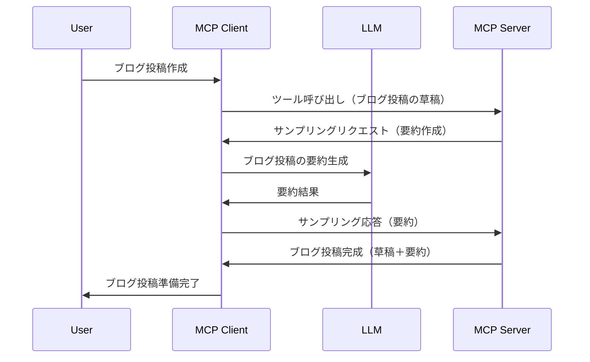

# サンプリング - クライアントに機能を委譲する

時には、MCPクライアントとMCPサーバーが協力して共通の目標を達成する必要があります。サーバー側でクライアントに置かれたLLMの助けが必要になる場合があります。このような状況には、サンプリングを使うべきです。

いくつかのユースケースとサンプリングを用いたソリューションの構築方法について見ていきましょう。

## 概要

このレッスンでは、サンプリングをいつどこで使うか、そしてそれをどう設定するかに焦点を当てます。

## 学習目標

この章では以下を行います：

- サンプリングとは何か、そしていつ使うのかを説明します。
- MCPでサンプリングを設定する方法を示します。
- サンプリングの実例を紹介します。

## サンプリングとは何か、そしてなぜ使うのか？

サンプリングは以下のように動作する高度な機能です：



### サンプリングリクエスト

さて、信頼できるシナリオの概要がわかったところで、サーバーがクライアントに返すサンプリングリクエストについて話しましょう。このようなリクエストはJSON-RPC形式で以下のようになります：

```json
{
  "jsonrpc": "2.0",
  "id": 1,
  "method": "sampling/createMessage",
  "params": {
    "messages": [
      {
        "role": "user",
        "content": {
          "type": "text",
          "text": "Create a blog post summary of the following blog post: <BLOG POST>"
        }
      }
    ],
    "modelPreferences": {
      "hints": [
        {
          "name": "claude-3-sonnet"
        }
      ],
      "intelligencePriority": 0.8,
      "speedPriority": 0.5
    },
    "systemPrompt": "You are a helpful assistant.",
    "maxTokens": 100
  }
}
```

ここで注目すべき点はいくつかあります：

- content -> textの下のPromptは、ブログ記事の内容を要約するようにLLMへ指示するプロンプトです。

- **modelPreferences**。このセクションはまさにその通りで、LLMに使用する構成の推奨設定です。ユーザーはこれらの推奨を受け入れるか変更するか選択可能です。この場合、使用モデルやスピード・知能優先度の推奨があります。
- **systemPrompt** はあなたの通常のシステムプロンプトで、LLMに人格を与え指示を含みます。
- **maxTokens** は、このタスクに使われることが推奨されるトークン数を示す別のプロパティです。

### サンプリングレスポンス

このレスポンスは、MCPクライアントがLLMを呼び出し、その応答を待ってから構築し、MCPサーバーに送り返す結果です。JSON-RPCでの例は以下の通りです：

```json
{
  "jsonrpc": "2.0",
  "id": 1,
  "result": {
    "role": "assistant",
    "content": {
      "type": "text",
      "text": "Here's your abstract <ABSTRACT>"
    },
    "model": "gpt-5",
    "stopReason": "endTurn"
  }
}
```

レスポンスが要求通りのブログ記事の要約であることに注目してください。また、使用されている`model`が要求されたものではなく「claude-3-sonnet」ではなく「gpt-5」である点にも注目してください。これはユーザーが使用モデルを変更できること、そしてサンプリングリクエストはあくまで推奨であることを示しています。

さて、主なフローと有用なタスク「ブログ記事作成＋要約」が理解できたので、動作させるために必要なことを見てみましょう。

### メッセージタイプ

サンプリングメッセージはテキストに限定されず、画像や音声も送信可能です。JSON-RPCは次のように異なります：

<strong>テキスト</strong>

```json
{
  "type": "text",
  "text": "The message content"
}
```

<strong>画像コンテンツ</strong>

```json
{
  "type": "image",
  "data": "base64-encoded-image-data",
  "mimeType": "image/jpeg"
}
```

<strong>音声コンテンツ</strong>

```json
{
  "type": "audio",
  "data": "base64-encoded-audio-data",
  "mimeType": "audio/wav"
}
```

> NOTE: さらに詳しいサンプリング情報は[公式ドキュメント](https://modelcontextprotocol.io/specification/2025-11-25/client/sampling)をご覧ください。

## クライアントでサンプリングを設定する方法

> 注意：サーバーのみを構築している場合、ここで特に行うことはありません。

クライアントでは、以下のように機能を指定する必要があります：

```json
{
  "capabilities": {
    "sampling": {}
  }
}
```

これにより、選択したクライアントがサーバーと初期化される際にこの設定が拾われます。

## サンプリングの実例 - ブログ記事を作成する

一緒にサンプリングサーバーをコード化しましょう。次のことを行う必要があります：

1. サーバーにツールを作成する。
1. そのツールはサンプリングリクエストを作成する。
1. ツールはクライアントのサンプリングリクエストへの応答を待つ。
1. その後ツール結果を出力する。

順を追ってコードを見てみましょう：

### -1- ツールの作成

**python**

```python
@mcp.tool()
async def create_blog(title: str, content: str, ctx: Context[ServerSession, None]) -> str:
    """Create a blog post and generate a summary"""

```

### -2- サンプリングリクエストを作成する

ツールを次のコードで拡張します：

**python**

```python
post = BlogPost(
        id=len(posts) + 1,
        title=title,
        content=content,
        abstract=""
    )

prompt = f"Create an abstract of the following blog post: title: {title} and draft: {content} "

result = await ctx.session.create_message(
        messages=[
            SamplingMessage(
                role="user",
                content=TextContent(type="text", text=prompt),
            )
        ],
        max_tokens=100,
)

```

### -3- 応答を待って返す

**python**

```python
post.abstract = result.content.text

posts.append(post)

# 完成した製品を返す
return json.dumps({
    "id": post.title,
    "abstract": post.abstract
})
```

### -4- 全コード

**python**

```python
from starlette.applications import Starlette
from starlette.routing import Mount, Host

from mcp.server.fastmcp import Context, FastMCP

from mcp.server.session import ServerSession
from mcp.types import SamplingMessage, TextContent

import json


from uuid import uuid4
from typing import List
from pydantic import BaseModel


mcp = FastMCP("Blog post generator")

# app = FastAPI()

posts = []

class BlogPost(BaseModel):
    id: int
    title: str
    content: str
    abstract: str

posts: List[BlogPost] = []

@mcp.tool()
async def create_blog(title: str, content: str, ctx: Context[ServerSession, None]) -> str:
    """Create a blog post and generate a summary"""

    post = BlogPost(
        id=len(posts) + 1,
        title=title,
        content=content,
        abstract=""
    )

    prompt = f"Create an abstract of the following blog post: title: {title} and draft: {content} "

    result = await ctx.session.create_message(
        messages=[
            SamplingMessage(
                role="user",
                content=TextContent(type="text", text=prompt),
            )
        ],
        max_tokens=100,
    )

    post.abstract = result.content.text

    posts.append(post)

    # 完全なブログ投稿を返す
    return json.dumps({
        "id": post.title,
        "abstract": post.abstract
    })

if __name__ == "__main__":
    print("Starting server...")
    # mcp.run()
    mcp.run(transport="streamable-http")

# 次のコマンドでアプリを実行: python server.py
```

### -5- Visual Studio Codeでのテスト

Visual Studio Codeでこれをテストするには、以下を実行します：

1. ターミナルでサーバーを起動する
1. *mcp.json* に追加し（起動されていることを確認）例えば以下のように：

   ```json
   "servers": {
      "blog-server": {
        "type": "http",
        "url": "http://localhost:8000/mcp"
      }
   }
   ```

1. プロンプトを入力：

   ```text
   create a blog post named "Where Python comes from", the content is "Python is actually named after Monty Python Flying Circus"
   ```

1. サンプリングを許可します。これを最初に試す際には追加のダイアログが表示されるので承諾してください。その後は通常のツール実行の確認ダイアログが表示されます。

1. 結果を確認します。GitHub Copilot Chatで見やすく表示されるだけでなく、生のJSON応答も調査できます。

<strong>ボーナス</strong>。Visual Studio Codeのツールはサンプリングを強力にサポートしています。サーバーのサンプリングアクセスは以下で設定可能です：

1. 拡張機能セクションに移動。
1. "MCP SERVERS - INSTALLED" セクションのインストール済みサーバーの歯車アイコンを選択。
1. 「モデルアクセスの設定」を選択。ここでGitHub Copilotにサンプリング時に使用を許可するモデルを選択できます。また「サンプリングリクエストを表示」を選択すると、最近のサンプリングリクエストのすべてを確認可能です。

## 課題

この課題では、少し異なるサンプリング、すなわち「商品説明生成」に対応したサンプリング統合を構築します。シナリオは以下のとおりです：

<strong>シナリオ</strong>：ECサイトのバックオフィス担当者は商品説明の作成に非常に時間がかかっています。そこで、「title」と「keywords」を引数として受け取る"create_product"というツールを呼び出し、クライアントのLLMで生成された「description」フィールドを含む完全な商品情報を作成するソリューションを構築してください。

TIP: これまでに学んだことを活用して、このサーバーとツールをサンプリングリクエストを使って構築しましょう。

## ソリューション

[Solution](./solution/README.md)

## 重要ポイント

サンプリングは、サーバーがLLMの助けが必要な時にクライアントへタスクを委譲できる強力な機能です。

## 次に学ぶこと

- [第4章 - 実践的実装](../../04-PracticalImplementation/README.md)

---

<!-- CO-OP TRANSLATOR DISCLAIMER START -->
**免責事項**：
本書類は AI 翻訳サービス [Co-op Translator](https://github.com/Azure/co-op-translator) を使用して翻訳されています。正確性を期していますが、自動翻訳には誤りや不正確な部分が含まれる可能性があることをご承知おきください。原文の原語版が正式な情報源とみなされるべきです。重要な情報については、専門の人間による翻訳を推奨します。本翻訳の利用により生じたいかなる誤解や解釈違いについても、当方は責任を負いかねます。
<!-- CO-OP TRANSLATOR DISCLAIMER END -->