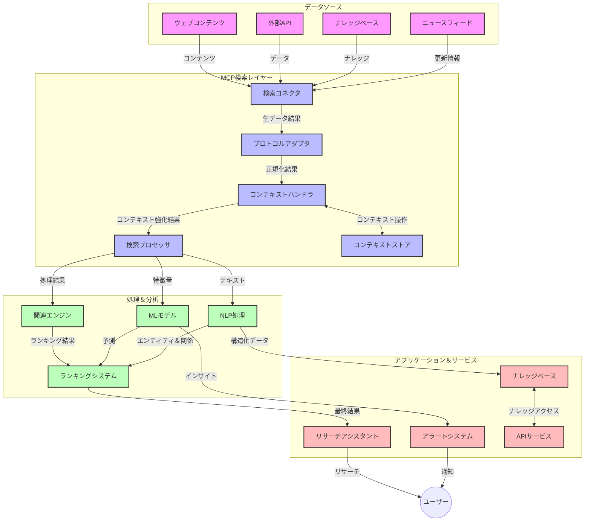
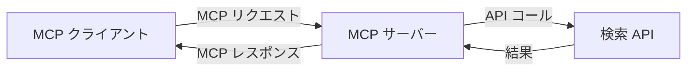
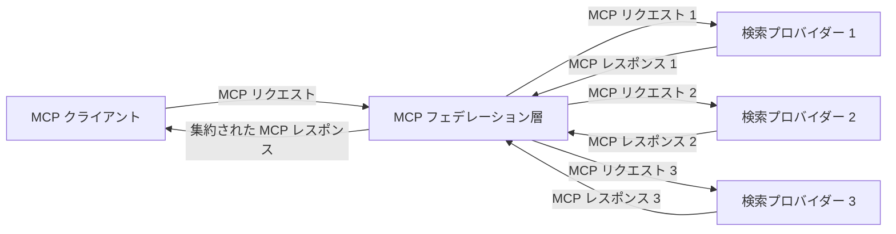
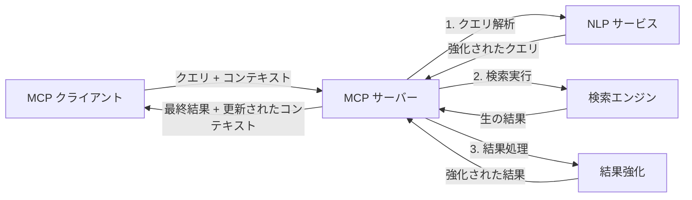

# リアルタイムウェブ検索のためのモデルコンテキストプロトコル

## 概要

リアルタイムウェブ検索は、アプリケーションがインターネット全体の最新情報に即時にアクセスし、関連性が高くタイムリーな応答を提供するために不可欠となった、現代の情報主導型環境において重要な技術です。モデルコンテキストプロトコル（MCP）は、これらのリアルタイム検索プロセスを最適化し、検索効率を向上させ、コンテキストの整合性を維持し、システム全体のパフォーマンスを高める上で大きな進歩を示しています。

本モジュールでは、MCPがAIモデル、検索エンジン、アプリケーション間でのコンテキスト管理に標準化されたアプローチを提供することで、リアルタイムウェブ検索をいかに変革するかを探ります。

### 学習内容

この包括的なガイドでは、以下の内容を学びます：

- MCPがAIモデルとリアルタイムウェブ検索機能の間にシームレスな橋渡しを作る方法
- MCPを用いた効率的でスケーラブルな検索ソリューションを実装するためのアーキテクチャパターン
- 複数のクエリや対話を通じた検索コンテキストの保持技術
- 様々な検索シナリオに対応したPythonとJavaScriptによる実用的なコード実装
- MCP対応の検索システムで関連性、新鮮さ、パフォーマンスのバランスをとる手法

## リアルタイムウェブ検索の紹介

リアルタイムウェブ検索は、ウェブベースの情報が公開または更新されると即時に問い合わせ、処理、分析を行い、最小限の遅延で新鮮で関連性の高い情報を提供する技術的アプローチです。従来の検索システムは、数時間または数日前のインデックス化されたデータを使用するのに対し、リアルタイム検索はウェブのライブデータを処理して、現在のオンラインコンテンツの状態を反映した洞察と情報を提供します。

### リアルタイムウェブ検索の核心概念：

- <strong>継続的なクエリ処理</strong>：常に更新されるデータソースに対して検索クエリを処理
- <strong>新鮮さの優先</strong>：新しい情報を優先する設計
- <strong>関連性の調整</strong>：関連性と新鮮さのバランス維持
- <strong>スケーラブルなアーキテクチャ</strong>：変動するクエリ負荷とデータ量に対応
- <strong>コンテキスト理解</strong>：複数回の検索の間でユーザーコンテキストを維持し意味ある結果を出す
- <strong>動的なクエリ再形成</strong>：コンテキストや過去の結果に基づきクエリを適応的に変更
- <strong>複数ソース統合</strong>：複数の検索プロバイダやウェブソースの結果統合
- <strong>意味的理解</strong>：キーワードだけでなく意味に基づくクエリとコンテンツの処理
- <strong>リアルタイムランキング</strong>：新情報に応じて結果のランキングを継続的に調整

### モデルコンテキストプロトコルとリアルタイムウェブ検索

モデルコンテキストプロトコル（MCP）は、リアルタイムウェブ検索環境における以下の重要な課題を解決します：

1. <strong>検索コンテキストの保持</strong>：MCPは、分散した検索コンポーネント間でコンテキストを維持する方法を標準化し、AIモデルや処理ノードが関連するクエリ履歴やユーザー設定にアクセスできるようにします。

2. <strong>効率的なクエリ管理</strong>：構造化されたコンテキスト伝達の仕組みを提供することで、各検索反復でのコンテキスト繰り返しのオーバーヘッドを削減します。

3. <strong>相互運用性</strong>：MCPは多様な検索技術と言語間で共通のコンテキスト共有言語を確立し、より柔軟かつ拡張可能なアーキテクチャを実現します。

4. <strong>検索最適化されたコンテキスト</strong>：MCP実装は効果的な検索に最も関連性の高いコンテキスト要素を優先でき、パフォーマンスと精度の双方を最適化します。

5. <strong>適応的検索処理</strong>：MCPによる適切なコンテキスト管理を得て、検索システムはユーザーのニーズや情報環境の変化に応じて動的に処理を調整できます。

ニュース集約からリサーチアシスタントまでの現代アプリケーションにおいて、MCPとウェブ検索技術の統合は、ユーザーの操作が継続するほど、より知的でコンテキストに基づく関連性の高い検索を可能にします。

## 学習目標

本レッスン終了時には、以下を理解・実践できるようになります：

- 現代アプリケーションにおけるリアルタイムウェブ検索の基本と課題の理解
- モデルコンテキストプロトコル（MCP）がリアルタイムウェブ検索能力を向上させる仕組みの説明
- MCPベースの検索ソリューションを人気のフレームワークやAPIを使って実装する技術
- MCPを用いたスケーラブルで高性能な検索アーキテクチャの設計と展開
- セマンティック検索、リサーチ支援、AI拡張ブラウジングなどの多様なユースケースへのMCPの適用
- MCPベース検索技術の新興トレンドと将来の革新動向の評価
- ユーザーの操作から学ぶコンテキスト認識型検索システムの開発
- 標準化されたMCPプロトコルを使ったAIアシスタントへのウェブ検索機能統合
- コンテキストに基づいて段階的に結果を絞り込む多段階検索パイプラインの作成
- 包括的なコンテキスト認識を維持しながら検索パフォーマンスを最適化

### 定義と意義

リアルタイムウェブ検索とは、最小限の遅延でウェブベースの情報を継続的に検索、取得、配信する技術を指します。従来の定期的にウェブをクロールしてインデックス化する検索エンジンとは異なり、リアルタイム検索は情報が入手可能になった瞬間にそれを表面化させ、最も新しいコンテンツへの即時アクセスを可能にします。

リアルタイムウェブ検索の主な特徴：

- <strong>新鮮さ</strong>：最新のコンテンツと更新情報を優先
- <strong>継続的処理</strong>：新情報の常時監視
- <strong>クエリ適応</strong>：コンテキストやフィードバックを基に検索クエリを最適化
- <strong>即時配信</strong>：最小限の遅延で検索結果を提供
- <strong>コンテキスト保持</strong>：前回のクエリを踏まえて関連性を高める

### 従来ウェブ検索の課題

従来のウェブ検索はリアルタイムシナリオに適用すると以下の制約に直面します：

1. <strong>コンテキスト分断</strong>：複数のクエリ間でコンテキストを維持しにくい
2. <strong>情報新鮮性</strong>：最新情報へのアクセスと優先の難しさ
3. <strong>統合の複雑性</strong>：検索システムとアプリケーション間の相互運用性の問題
4. <strong>遅延問題</strong>：包括的検索と応答速度のバランス
5. <strong>関連性調整</strong>：新鮮さを優先しつつ正確性と関連性を保証する難易度

## 検索のためのモデルコンテキストプロトコル（MCP）の理解

### 検索コンテキストにおけるMCPとは？

モデルコンテキストプロトコル（MCP）は、AIモデルとアプリケーション間の効率的なやり取りを促進するための標準的な通信プロトコルです。リアルタイムウェブ検索のコンテキストでは、MCPは以下を提供します：

- クエリシーケンス全体で検索コンテキストを保持する仕組み
- 検索クエリおよび結果フォーマットの標準化
- 検索パラメータや結果の伝達最適化
- モデルと検索エンジン間の通信の強化

### 主な構成要素とアーキテクチャ

リアルタイムウェブ検索におけるMCPのアーキテクチャは、次の主要構成要素で構成されます：

1. <strong>クエリコンテキストハンドラ</strong>：複数クエリ間の検索コンテキストを管理・保持
2. <strong>検索プロセッサ</strong>：コンテキスト認識型技術を用いて検索要求を処理
3. <strong>プロトコルアダプタ</strong>：異なる検索API間の変換を行い、コンテキストを保持
4. <strong>コンテキストストア</strong>：検索履歴やユーザー設定を効率的に保存・取得
5. <strong>検索コネクタ</strong>：様々な検索エンジンやウェブAPIと接続



### MCPがリアルタイムウェブ検索を向上させる方法

MCPは従来のウェブ検索の課題に対して以下のように対処します：

- <strong>コンテキストの連続性</strong>：検索セッション全体を通じてクエリ間の関係を維持
- <strong>最適化された伝達</strong>：賢明なコンテキスト管理によって検索パラメータの冗長性を削減
- <strong>標準化されたインターフェース</strong>：検索コンポーネントに一貫したAPIを提供
- <strong>遅延の削減</strong>：効率的なコンテキスト処理による処理オーバーヘッドの最小化
- <strong>関連性の強化</strong>：複数クエリ間でユーザー意図を維持し検索関連性を高める

## 統合と実装

リアルタイムウェブ検索システムは、パフォーマンスとコンテキストの整合性の双方を維持するために慎重なアーキテクチャ設計と実装が必要です。モデルコンテキストプロトコルは、AIモデルと検索技術を統合するための標準化アプローチを提供し、より洗練されたコンテキスト認識型検索パイプラインを可能にします。

### 検索アーキテクチャにおけるMCP統合の概要

リアルタイムウェブ検索環境におけるMCP実装は以下の重要な考慮事項を含みます：

1. <strong>検索コンテキストのシリアル化</strong>：MCPは検索要求内でコンテキスト情報を効率的にエンコードする仕組みを提供し、必須のコンテキストが処理パイプライン全体でクエリに随伴されるようにします。これには検索関連のメタデータに最適化された標準化されたシリアル化フォーマットが含まれます。

2. <strong>状態保持型の検索処理</strong>：MCPは検索反復間で一貫したコンテキスト表現を保持することで、より高度な状態保持型処理を可能にします。複数段階の検索パイプラインにおいて特に、コンテキストの洗練が結果を改善します。

3. <strong>クエリ拡張と洗練</strong>：MCP実装は蓄積されたコンテキストに基づき、より洗練されたクエリ拡張や改良を促進し、検索セッションの進行に伴いより関連性の高い結果を提供します。

4. <strong>結果のキャッシュと優先順位付け</strong>：コンテキスト処理の標準化により、結果キャッシュと優先順位の管理が容易になり、コンポーネントが進化する検索コンテキストに適応できます。

5. <strong>検索のフェデレーションと集約</strong>：MCPは構造化された検索コンテキスト表現を提供し、複数のバックエンドにまたがるより高度な検索フェデレーションを支援し、多様なソースからの結果のより意味のある集約を可能にします。

様々な検索技術におけるMCPの実装は、コンテキスト管理の共通アプローチを形成し、カスタム統合コードの必要性を減らしながら、検索クエリの進展に伴う有意味なコンテキスト維持能力を高めます。

### 様々なウェブ検索実装におけるMCP

以下の例は、現在のMCP仕様に準拠し、JSON-RPCベースのプロトコルとそれぞれ異なるトランスポートメカニズムを用いています。コードはMCPプロトコルとの完全な互換性を保ちながら、カスタム検索統合をどのように実装できるかを示しています。

<details>
<summary>汎用検索APIを用いたPython実装</summary>

```python
import asyncio
import json
import aiohttp
from typing import Dict, Any, Optional, List
from contextlib import asynccontextmanager
from collections.abc import AsyncIterator

# 標準MCPライブラリをインポートする
from mcp.client.session import ClientSession
from mcp.client.streamable_http import streamablehttp_client
from mcp.types import TextContent, CreateMessageRequestParams, CreateMessageResult
from mcp.server.fastmcp import FastMCP

# ウェブ検索用のFastMCPサーバーを作成する
search_server = FastMCP("WebSearch")

# ウェブ検索操作を処理するクラス
class WebSearchHandler:
    def __init__(self, api_endpoint: str, api_key: str):
        self.api_endpoint = api_endpoint
        self.api_key = api_key
        self.session = None
        
    async def initialize(self):
        """Initialize the HTTP session"""
        self.session = aiohttp.ClientSession(
            headers={"Authorization": f"Bearer {self.api_key}"}
        )
    
    async def close(self):
        """Close the HTTP session"""
        if self.session:
            await self.session.close()
            
    async def perform_search(self, query: str, max_results: int = 5, 
                           include_domains: List[str] = None, 
                           exclude_domains: List[str] = None,
                           time_period: str = "any") -> Dict[str, Any]:
        """Perform web search using the search API"""
        # 検索パラメータを構築する
        search_params = {
            "q": query,
            "limit": max_results,
            "time": time_period
        }
        
        if include_domains:
            search_params["site"] = ",".join(include_domains)
            
        if exclude_domains:
            search_params["exclude_site"] = ",".join(exclude_domains)
        
        # 検索リクエストを実行する
        try:
            async with self.session.get(
                self.api_endpoint,
                params=search_params
            ) as response:
                if response.status != 200:
                    error_text = await response.text()
                    raise Exception(f"Search API error: {response.status} - {error_text}")
                
                search_data = await response.json()
                
                # API特有のレスポンスを標準フォーマットに変換する
                results = []
                for item in search_data.get("results", []):
                    results.append({
                        "title": item.get("title", ""),
                        "url": item.get("url", ""),
                        "snippet": item.get("snippet", ""),
                        "date": item.get("published_date", ""),
                        "source": item.get("source", "")
                    })
                
                return {
                    "query": query,
                    "totalResults": len(results),
                    "results": results
                }
        except Exception as e:
            print(f"Search API request error: {e}")
            raise

# 検索ハンドラーを初期化する
search_handler = WebSearchHandler(
    api_endpoint="https://api.search-service.example/search",
    api_key="your-api-key-here"
)

# 検索ハンドラーを管理するためにライフスパンを設定する
@asyncio.asynccontextmanager
async def app_lifespan(server: FastMCP):
    """Manage application lifecycle"""
    await search_handler.initialize()
    try:
        yield {"search_handler": search_handler}
    finally:
        await search_handler.close()

# サーバーのライフスパンを設定する
search_server = FastMCP("WebSearch", lifespan=app_lifespan)

# ウェブ検索ツールを登録する
@search_server.tool()
async def web_search(query: str, max_results: int = 5, 
                   include_domains: List[str] = None,
                   exclude_domains: List[str] = None,
                   time_period: str = "any") -> Dict[str, Any]:
    """
    Search the web for information
    
    Args:
        query: The search query
        max_results: Maximum number of results to return (default: 5)
        include_domains: List of domains to include in search results
        exclude_domains: List of domains to exclude from search results
        time_period: Time period for results ("day", "week", "month", "any")
        
    Returns:
        Dictionary containing search results
    """
    ctx = search_server.get_context()
    search_handler = ctx.request_context.lifespan_context["search_handler"]
    
    results = await search_handler.perform_search(
        query=query,
        max_results=max_results,
        include_domains=include_domains,
        exclude_domains=exclude_domains,
        time_period=time_period
    )
    
    return results

# クライアントの使用例
async def client_example():
    # Streamable HTTPトランスポートを使用して検索サーバーに接続する
    async with streamablehttp_client("http://localhost:8000/mcp") as (read, write, _):
        async with ClientSession(read, write) as session:
            # 接続を初期化する
            await session.initialize()
            
            # web_searchツールを呼び出す
            search_results = await session.call_tool(
                "web_search", 
                {
                    "query": "latest developments in AI and Model Context Protocol",
                    "max_results": 5,
                    "time_period": "day",
                    "include_domains": ["github.com", "microsoft.com"]
                }
            )
            
            print(f"Search results: {search_results}")

# サーバー実行の例
if __name__ == "__main__":
    # Streamable HTTPトランスポートでサーバーを実行する
    search_server.run(transport="streamable-http")
```
</details> 

<details>
<summary>ブラウザベース検索によるJavaScript実装</summary>

```javascript
// Web検索のためのMCPサーバー実装
import { McpServer, ResourceTemplate } from '@modelcontextprotocol/sdk/server/mcp.js';
import { StreamableHTTPServerTransport } from '@modelcontextprotocol/sdk/server/streamableHttp.js';
import { z } from 'zod';

// Web検索のためのMCPサーバーを作成する
const searchServer = new McpServer({
    name: "BrowserSearch",
    description: "A server that provides web search capabilities"
});

// 検索サービスクラス
class SearchService {
    constructor(searchApiUrl, apiKey) {
        this.searchApiUrl = searchApiUrl;
        this.apiKey = apiKey;
    }

    async performSearch(parameters) {
        const {
            query = '',
            maxResults = 5,
            includeDomains = [],
            excludeDomains = [],
            timePeriod = 'any'
        } = parameters;
        
        // パラメータ付き検索URLを構築する
        const url = new URL(this.searchApiUrl);
        url.searchParams.append('q', query);
        url.searchParams.append('limit', maxResults);
        url.searchParams.append('time', timePeriod);
        
        if (includeDomains.length > 0) {
            url.searchParams.append('site', includeDomains.join(','));
        }
        
        if (excludeDomains.length > 0) {
            url.searchParams.append('exclude_site', excludeDomains.join(','));
        }
        
        try {
            const response = await fetch(url.toString(), {
                method: 'GET',
                headers: {
                    'Authorization': `Bearer ${this.apiKey}`,
                    'Content-Type': 'application/json'
                }
            });
            
            if (!response.ok) {
                const errorText = await response.text();
                throw new Error(`Search API error: ${response.status} - ${errorText}`);
            }
            
            const searchData = await response.json();
            
            // API固有のレスポンスを標準フォーマットに変換する
            const results = searchData.results?.map(item => ({
                title: item.title || '',
                url: item.url || '',
                snippet: item.snippet || '',
                date: item.published_date || '',
                source: item.source || ''
            })) || [];
            
            return {
                query,
                totalResults: results.length,
                results
            };
        } catch (error) {
            console.error('Search API request error:', error);
            throw error;
        }
    }
}

// 検索サービスを初期化する
const searchService = new SearchService(
    'https://api.search-service.example/search',
    'your-api-key-here'
);

// サーバーのコンテキストプロバイダーを設定する
searchServer.setContextProvider(() => {
    return {
        searchService
    };
});

// Web検索ツールを登録する
searchServer.tool({
    name: 'web_search',
    description: 'Search the web for information',
    parameters: {
        type: 'object',
        properties: {
            query: {
                type: 'string',
                description: 'The search query'
            },
            maxResults: {
                type: 'integer',
                description: 'Maximum number of results to return',
                default: 5
            },
            includeDomains: {
                type: 'array',
                items: { type: 'string' },
                description: 'List of domains to include in search results'
            },
            excludeDomains: {
                type: 'array',
                items: { type: 'string' },
                description: 'List of domains to exclude from search results'
            },
            timePeriod: {
                type: 'string',
                description: 'Time period for results',
                enum: ['day', 'week', 'month', 'any'],
                default: 'any'
            }
        },
        required: ['query']
    },
    handler: async (params, context) => {
        const { searchService } = context;
        return await searchService.performSearch(params);
    }
});

// 検索サーバーに接続するクライアントコードの例
import { Client } from '@modelcontextprotocol/sdk/client/index.js';
import { StreamableHTTPClientTransport } from '@modelcontextprotocol/sdk/client/streamableHttp.js';

async function connectToSearchServer() {
    // 検索サーバーに接続する
    const transport = new StreamableHTTPClientTransport(
        new URL('http://localhost:8000/mcp')
    );
    
    const client = new Client({
        name: 'search-client',
        version: '1.0.0'
    });
    
    await client.connect(transport);
    
    // 検索ツールを実行する
    const searchResults = await client.callTool({
        name: 'web_search',
        arguments: {
            query: 'Model Context Protocol implementation examples',
            maxResults: 10,
            timePeriod: 'week',
            includeDomains: ['github.com', 'docs.microsoft.com']
        }
    });
    
    console.log('Search results:', searchResults);
    
    // クリーンアップ
    await client.disconnect();
}

// サーバーを起動する
const transport = new StreamableHTTPServerTransport();
await searchServer.connect(transport);
console.log('Search server running at http://localhost:8000/mcp');

// 別プロセスまたはサーバー起動後に
// connectToSearchServer().catch(console.error);
```
</details> 

## コード例に関する免責事項

> <strong>重要な注意点</strong>：以下のコード例はモデルコンテキストプロトコル（MCP）とウェブ検索機能の統合方法を示すものです。公式MCP SDKのパターンや構造に従っていますが、教育目的で簡略化されています。
> 
> これらの例は以下を紹介します：
> 
> 1. **Python実装**：FastMCPサーバの実装例で、ウェブ検索ツールを提供し外部検索APIに接続します。これは適切なライフスパン管理、コンテキスト処理、ツール実装を含み、[公式MCP Python SDK](https://github.com/modelcontextprotocol/python-sdk)のパターンに従っています。推奨されるStreamable HTTPトランスポートを利用し、従来のSSEトランスポートよりも本番環境での展開に適しています。
> 
> 2. **JavaScript実装**：TypeScript/JavaScriptによるFastMCPパターンを用いた実装例で、[公式MCP TypeScript SDK](https://github.com/modelcontextprotocol/typescript-sdk)に基づいて検索サーバを構築し、適切なツール定義とクライアント接続を行っています。最新推奨のセッション管理とコンテキスト保持のパターンに従っています。
> 
> これらの例は本番利用に向け認証、エラー処理、API統合の詳細コードを追加する必要があります。示されている検索APIエンドポイント（`https://api.search-service.example/search`）はダミーのプレースホルダであり、実際の検索サービスエンドポイントに置き換える必要があります。
> 
> 完全な実装詳細や最新の手法に関しては、[公式MCP仕様書](https://spec.modelcontextprotocol.io/)およびSDKドキュメントを参照してください。

## コアコンセプト

### モデルコンテキストプロトコル（MCP）フレームワーク

MCPの基盤は、AIモデル、アプリケーション、サービス間でコンテキストを標準化された方法で交換することにあります。リアルタイムウェブ検索においてこのフレームワークは、一貫性のある多段階検索体験を作り出すために不可欠です。主な要素は以下の通りです：

1. **クライアント-サーバーアーキテクチャ**：MCPは検索クライアント（リクエスター）と検索サーバー（プロバイダー）を明確に分離し、柔軟な展開モデルを可能にします。

2. **JSON-RPC通信**：メッセージ交換にJSON-RPCを使用し、ウェブ技術との互換性を持ち、さまざまなプラットフォームで実装しやすい設計。

3. <strong>コンテキスト管理</strong>：複数回のやりとりにわたり検索コンテキストを保持、更新、活用するための構造化された手法を定義。

4. <strong>ツール定義</strong>：検索機能を、パラメータおよび戻り値が明確に定義された標準化ツールとして公開。

5. <strong>ストリーミング対応</strong>：結果が段階的に到着するリアルタイム検索に必須のストリーミング結果をサポート。

### ウェブ検索統合パターン

MCPをウェブ検索と統合する際にいくつかのパターンが現れます：

#### 1. 直接検索プロバイダ連携


  
このパターンでは、MCPサーバーが一つまたは複数の検索APIと直接インターフェースし、MCPリクエストをAPI固有の呼び出しに変換、結果をMCPレスポンスとして整形します。

#### 2. コンテキスト保持によるフェデレーション検索


  
このパターンは、複数のMCP対応検索プロバイダに検索クエリを分散し、各プロバイダが異なるタイプのコンテンツまたは検索機能に特化しながら統一されたコンテキストを維持します。

#### 3. コンテキスト強化型検索チェーン


  
このパターンでは、検索処理を複数段階に分割し、各段階でコンテキストを拡充していき、段階的により関連性の高い結果を生み出します。

### 検索コンテキストの構成要素

MCPベースのウェブ検索におけるコンテキストには通常以下が含まれます：

- <strong>クエリ履歴</strong>：セッション内の過去の検索クエリ
- <strong>ユーザー設定</strong>：言語、地域、セーフサーチ設定など
- <strong>インタラクション履歴</strong>：クリックした結果、結果に費やした時間
- <strong>検索パラメータ</strong>：フィルター、ソート順、その他の検索変更設定
- <strong>ドメイン知識</strong>：検索に関連する特定領域のコンテキスト
- <strong>時間的コンテキスト</strong>：時間に基づく関連度要因
- <strong>情報源の好み</strong>：信頼または優先する情報源

## ユースケースと応用

### 研究と情報収集

MCPは研究ワークフローを以下のように強化します：

- 検索セッション間で研究コンテキストを保持
- より高度でコンテキストに即したクエリが可能に
- 複数ソースの検索フェデレーションを支援
- 検索結果からの知識抽出を促進

### リアルタイムニュースとトレンド監視

MCP対応の検索はニュース監視に次の利点を提供：

- ほぼリアルタイムで新興ニュースを発見
- 関連情報のコンテキストフィルタリング
- 複数情報源におけるトピック・エンティティの追跡
- ユーザーコンテキストに基づくパーソナライズニュースアラート

### AI拡張ブラウジングとリサーチ

MCPはAI拡張ブラウジングに新たな可能性を創出：

- 現在のブラウザ活動に基づくコンテキスト検索提案
- LLM搭載アシスタントとのウェブ検索のシームレス統合
- コンテキスト維持した多段階検索の洗練
- 強化されたファクトチェックや情報検証

## 将来のトレンドと革新

### ウェブ検索におけるMCPの進化

今後の展望として、MCPは以下に対応して進化すると予想されます：
- <strong>マルチモーダル検索</strong>: テキスト、画像、音声、動画検索を統合し、コンテキストを保持
- <strong>分散型検索</strong>: 分散型およびフェデレーション型検索エコシステムのサポート
- <strong>検索プライバシー</strong>: コンテキスト認識のプライバシー保護検索メカニズム
- <strong>クエリ理解</strong>: 自然言語検索クエリの深い意味解析

### 技術の潜在的な進歩

MCP検索の未来を形作る新興技術:

1. <strong>ニューラル検索アーキテクチャ</strong>: MCPに最適化された埋め込みベースの検索システム
2. <strong>パーソナライズド検索コンテキスト</strong>: 個々のユーザー検索パターンの継続的学習
3. <strong>ナレッジグラフ統合</strong>: ドメイン固有のナレッジグラフによって強化されたコンテキスト検索
4. <strong>クロスモーダルコンテキスト</strong>: 異なる検索モダリティ間のコンテキスト維持

## ハンズオン演習

### 演習1: 基本的なMCP検索パイプラインの設定

この演習では、以下を学びます:
- 基本的なMCP検索環境の構成方法
- ウェブ検索におけるコンテキストハンドラーの実装
- 検索反復におけるコンテキスト保持のテストと検証

### 演習2: MCP検索を使ったリサーチアシスタントの構築

以下を行う完全なアプリケーションを作成します:
- 自然言語のリサーチ質問を処理
- コンテキスト認識のウェブ検索を実行
- 複数の情報源から情報を統合
- 整理されたリサーチ結果の提示

### 演習3: MCPを使ったマルチソース検索フェデレーションの実装

高度な演習内容:
- 複数の検索エンジンへのコンテキスト認識クエリ送信
- 結果のランク付けと集約
- 検索結果のコンテキストに基づく重複排除
- ソース固有のメタデータの処理

## 追加リソース

- [Model Context Protocol Specification](https://spec.modelcontextprotocol.io/) - MCPの公式仕様と詳細なプロトコルドキュメント
- [Model Context Protocol Documentation](https://modelcontextprotocol.io/) - 詳細なチュートリアルと実装ガイド
- [MCP Python SDK](https://github.com/modelcontextprotocol/python-sdk) - MCPプロトコルの公式Python実装
- [MCP TypeScript SDK](https://github.com/modelcontextprotocol/typescript-sdk) - MCPプロトコルの公式TypeScript実装
- [MCP Reference Servers](https://github.com/modelcontextprotocol/servers) - MCPサーバーのリファレンス実装
- [Bing Web Search API Documentation](https://learn.microsoft.com/en-us/bing/search-apis/bing-web-search/overview) - Microsoftのウェブ検索API
- [Google Custom Search JSON API](https://developers.google.com/custom-search/v1/overview) - Googleのプログラマブル検索エンジン
- [SerpAPI Documentation](https://serpapi.com/search-api) - 検索エンジン結果ページAPI
- [Meilisearch Documentation](https://www.meilisearch.com/docs) - オープンソース検索エンジン
- [Elasticsearch Documentation](https://www.elastic.co/guide/index.html) - 分散検索および分析エンジン
- [LangChain Documentation](https://python.langchain.com/docs/get_started/introduction) - LLMによるアプリケーション構築

## 学習成果

このモジュールを完了すると、以下が可能になります:

- リアルタイムウェブ検索の基本と課題を理解する
- Model Context Protocol (MCP) がリアルタイムウェブ検索機能をどのように強化するか説明する
- 人気のあるフレームワークとAPIを使ってMCPベースの検索ソリューションを実装する
- MCPを用いたスケーラブルで高性能な検索アーキテクチャを設計・展開する
- セマンティック検索、リサーチアシスタント、AI強化ブラウジングなど多様なユースケースへMCP概念を適用する
- MCPベースの検索技術における新興トレンドと将来の技術革新を評価する

### 信頼性と安全性の考慮事項

MCPベースのウェブ検索ソリューションを実装する際には、MCP仕様から以下の重要な原則を忘れないでください:

1. <strong>ユーザーの同意と制御</strong>: ユーザーはすべてのデータアクセスと操作に明示的に同意し、理解する必要があります。特に外部データソースにアクセスするウェブ検索実装では重要です。

2. <strong>データプライバシー</strong>: 検索クエリや結果が機密情報を含む可能性があるため、適切な取り扱いを保証してください。ユーザーデータを守るために適切なアクセス制御を実装してください。

3. <strong>ツールの安全性</strong>: 検索ツールは任意のコード実行によるセキュリティリスクをもたらす可能性があるため、適切な認証と検証を実施してください。ツールの動作説明は信頼されたサーバーから取得したものでない限り信用しないでください。

4. <strong>明確なドキュメント提供</strong>: MCP仕様の実装ガイドラインに従い、MCPベース検索実装の能力、制限、セキュリティに関する明確なドキュメントを提供してください。

5. <strong>堅牢な同意フローの構築</strong>: 外部ウェブリソースと連携するツールを含む各ツールの機能を明確に説明したうえで、使用許可を得るための堅牢な同意・認可フローを構築してください。

MCPのセキュリティおよび信頼性に関する完全な詳細は、[公式ドキュメント](https://modelcontextprotocol.io/specification/2025-11-25/basic/security_best_practices)を参照してください。

## 次に読むべき内容

- [5.12 Entra ID Authentication for Model Context Protocol Servers](../mcp-security-entra/README.md)

---

<!-- CO-OP TRANSLATOR DISCLAIMER START -->
**免責事項**：
本書類は AI 翻訳サービス [Co-op Translator](https://github.com/Azure/co-op-translator) を使用して翻訳されています。正確性を期していますが、自動翻訳には誤りや不正確な部分が含まれる可能性があることをご承知おきください。原文の原語版が正式な情報源とみなされるべきです。重要な情報については、専門の人間による翻訳を推奨します。本翻訳の利用により生じたいかなる誤解や解釈違いについても、当方は責任を負いかねます。
<!-- CO-OP TRANSLATOR DISCLAIMER END -->