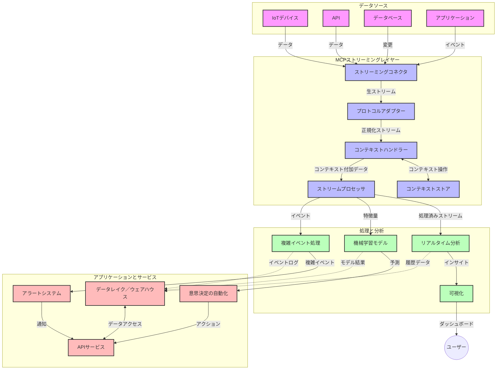

# モデルコンテキストプロトコルによるリアルタイムデータストリーミング

## 概要

リアルタイムデータストリーミングは、企業やアプリケーションが即時に情報にアクセスして迅速な意思決定を行うために不可欠な今日のデータ駆動型の世界で重要な役割を果たしています。モデルコンテキストプロトコル（MCP）は、これらのリアルタイムストリーミングプロセスを最適化し、データ処理効率を高め、コンテキストの整合性を維持し、システム全体のパフォーマンスを向上させる重要な進歩を示します。

このモジュールでは、MCPがAIモデル、ストリーミングプラットフォーム、およびアプリケーション間でコンテキスト管理の標準化されたアプローチを提供することで、リアルタイムデータストリーミングをどのように変革するかを探ります。

## リアルタイムデータストリーミングの概要

リアルタイムデータストリーミングは、データが生成されると同時に、継続的に転送、処理、分析を行い、システムが新しい情報に即座に反応できるようにする技術的パラダイムです。静的なデータセットを対象とする従来のバッチ処理とは異なり、ストリーミングは移動中のデータを処理し、最小限の遅延で洞察やアクションを提供します。

### リアルタイムデータストリーミングの中核概念：

- <strong>継続的なデータフロー</strong>：データはイベントやレコードの連続的かつ終わりのないストリームとして処理される。
- <strong>低遅延処理</strong>：データ生成と処理間の時間を最小化する設計。
- <strong>スケーラビリティ</strong>：可変のデータ量および速度に対応可能なストリーミングアーキテクチャ。
- <strong>フォールトトレランス</strong>：データフローが途絶えないように失敗に対して強靭である必要がある。
- <strong>ステートフル処理</strong>：イベント間でのコンテキスト維持は有意義な分析に不可欠。

### モデルコンテキストプロトコルとリアルタイムストリーミング

モデルコンテキストプロトコル（MCP）はリアルタイムストリーミング環境におけるいくつかの重要な課題に対応します：

1. <strong>コンテキストの継続性</strong>：MCPは分散ストリーミングコンポーネント間でコンテキストを維持する方法を標準化し、AIモデルや処理ノードが関連する過去および環境のコンテキストにアクセス可能にする。

2. <strong>効率的なステート管理</strong>：構造化されたコンテキスト伝送メカニズムを提供することで、ストリーミングパイプラインの状態管理の負荷を低減。

3. <strong>相互運用性</strong>：多様なストリーミング技術とAIモデル間でコンテキスト共有の共通言語を作成し、より柔軟で拡張可能なアーキテクチャを実現。

4. <strong>ストリーミング最適化コンテキスト</strong>：MCPの実装は、リアルタイムの意思決定に最も関連性が高いコンテキスト要素を優先させ、パフォーマンスと精度の両方を最適化可能。

5. <strong>適応的処理</strong>：MCPによる適切なコンテキスト管理により、ストリーミングシステムはデータの変化する条件やパターンに基づき処理を動的に調整可能。

IoTセンサーネットワークから金融取引プラットフォームに至る現代のアプリケーションにおいて、MCPとストリーミング技術の統合は、複雑で変化する状況にリアルタイムで適切に対応できるより高度でコンテキストに対応した処理を可能にします。

## 学習目標

このレッスンの終了時には、以下ができるようになります：

- リアルタイムデータストリーミングの基礎と課題を理解する
- モデルコンテキストプロトコル（MCP）がリアルタイムデータストリーミングをどのように強化するか説明する
- KafkaやPulsarなどの一般的なフレームワークを使用してMCPベースのストリーミングソリューションを実装する
- MCPを用いてフォールトトレラントかつ高性能なストリーミングアーキテクチャを設計・展開する
- MCPの概念をIoT、金融取引、AI駆動の分析ユースケースに適用する
- MCPベースのストリーミング技術における新たな動向と将来の革新を評価する

### 定義と意義

リアルタイムデータストリーミングは、最小限の遅延で継続的にデータを生成・処理・配信することを指します。バッチ処理のようにデータをまとめて処理するのではなく、ストリーミングデータは到着するたびに段階的に処理され、即時の洞察とアクションを可能にします。

リアルタイムデータストリーミングの主な特徴は以下の通りです：

- <strong>低遅延</strong>：ミリ秒から秒単位での処理と分析
- <strong>連続的フロー</strong>：さまざまなソースから途切れないデータストリーム
- <strong>即時処理</strong>：バッチではなく到着時に分析
- <strong>イベント駆動アーキテクチャ</strong>：発生したイベントに対してリアルタイムに反応

### 従来のデータストリーミングにおける課題

従来のデータストリーミングには以下の制約が存在します：

1. <strong>コンテキストの損失</strong>：分散システム間でのコンテキスト維持が困難
2. <strong>スケーラビリティの問題</strong>：高ボリューム・高速度データへのスケール対応の難しさ
3. <strong>統合の複雑さ</strong>：異なるシステム間の相互運用性の問題
4. <strong>遅延管理</strong>：スループットと処理時間のバランス
5. <strong>データ整合性</strong>：ストリーム全体でのデータの正確性と完全性の確保

## モデルコンテキストプロトコル（MCP）の理解

### MCPとは何か？

モデルコンテキストプロトコル（MCP）は、AIモデルとアプリケーション間で効率的な相互作用を促進するために設計された標準化通信プロトコルです。リアルタイムデータストリーミングの文脈において、MCPは以下を提供します：

- データパイプライン全体にわたるコンテキストの保持
- データ交換フォーマットの標準化
- 大規模データセットの伝送の最適化
- モデル間およびモデルとアプリ間の通信の強化

### コアコンポーネントとアーキテクチャ

リアルタイムストリーミング用のMCPアーキテクチャは以下の主要コンポーネントで構成されます：

1. <strong>コンテキストハンドラ</strong>：ストリーミングパイプライン全体のコンテキスト情報を管理・維持
2. <strong>ストリームプロセッサ</strong>：コンテキスト認識技術を用いてストリームデータを処理
3. <strong>プロトコルアダプタ</strong>：異なるストリーミングプロトコル間の変換をコンテキストを保持しつつ実施
4. <strong>コンテキストストア</strong>：効率的なコンテキスト情報の格納と取得
5. <strong>ストリーミングコネクタ</strong>：Kafka、Pulsar、Kinesisなどのさまざまなストリーミングプラットフォームへの接続



### MCPがリアルタイムデータ処理を改善する方法

MCPは従来のストリーミングの課題に以下のように対処します：

- <strong>コンテキストの整合性</strong>：パイプライン全体でデータポイント間の関係を維持
- <strong>伝送の最適化</strong>：知的なコンテキスト管理によってデータ交換の冗長性を削減
- <strong>標準化されたインターフェース</strong>：ストリーミングコンポーネントに一貫したAPIを提供
- <strong>遅延の削減</strong>：効率的なコンテキスト処理による処理負荷の最小化
- <strong>スケーラビリティの強化</strong>：コンテキストを維持しながら水平スケールに対応

## 統合と実装

リアルタイムデータストリーミングシステムは、パフォーマンスとコンテキストの整合性を維持するために注意深いアーキテクチャ設計と実装が必要です。モデルコンテキストプロトコルは、AIモデルとストリーミング技術を統合するための標準化された手法を提供し、より高度でコンテキストに対応した処理パイプラインを可能にします。

### ストリーミングアーキテクチャへのMCP統合の概要

リアルタイムストリーミング環境にMCPを実装する際には以下の重要点があります：

1. <strong>コンテキストのシリアライズと転送</strong>：MCPは、ストリーミングデータパケット内でのコンテキスト情報の効率的なエンコードメカニズムを提供し、重要なコンテキストが処理パイプライン全体に渡って追従することを保証します。これにはストリーミング伝送に最適化された標準化されたシリアライズフォーマットが含まれます。

2. <strong>ステートフルストリーム処理</strong>：MCPは処理ノード間で一貫したコンテキスト表現を維持することで、より高度なステートフル処理を可能にします。これは、伝統的に状態管理が困難であった分散ストリーミングアーキテクチャで特に有用です。

3. <strong>イベント時間と処理時間の区別</strong>：MCPのストリーミング実装は、イベントが発生した時間と処理が行われた時間を区別するという共通の課題に対処しなければなりません。プロトコルはイベント時間の意味を保持するための時間的コンテキストを含めることができます。

4. <strong>バックプレッシャー管理</strong>：コンテキスト処理を標準化することで、MCPはストリーミングシステムのバックプレッシャー管理を助け、コンポーネントが処理能力を伝え、フローを適宜調整可能にします。

5. <strong>コンテキストのウィンドウ処理と集約</strong>：MCPは時間的および関連的コンテキストの構造化された表現を提供することで、より意味のある集約を可能にする高度なウィンドウ処理操作を支援します。

6. **完全一回のみ処理（Exactly-Once Processing）**：完全一回の整合性を要するストリーミングシステムでは、MCPは処理の状態追跡と検証に役立つメタデータを組み込むことが可能です。

MCPの多数のストリーミング技術への実装は、カスタム統合コードの必要性を減らしながら、データがパイプラインを流れる際に有意義なコンテキストを維持するシステムの能力を強化します。

### 各種データストリーミングフレームワークにおけるMCP

以下の例は、JSON-RPCベースのプロトコルに特化した現在のMCP仕様に従い、さまざまな転送メカニズムを備えています。コードはKafkaやPulsarなどのストリーミングプラットフォームと統合しながら、MCPプロトコルとの完全な互換性を保つカスタム転送を実装する方法を示しています。

これらの例は、MCPの中核であるコンテキスト認識を維持しつつ、リアルタイムデータ処理を提供するためにストリーミングプラットフォームをどのように統合できるかを示すよう設計されています。このアプローチにより、コードサンプルは2025年6月時点でのMCP仕様の現状を正確に反映しています。

MCPは以下の一般的なストリーミングフレームワークに統合可能です：

#### Apache Kafka 統合

```python
import asyncio
import json
from typing import Dict, Any, Optional
from confluent_kafka import Consumer, Producer, KafkaError
from mcp.client import Client, ClientCapabilities
from mcp.core.message import JsonRpcMessage
from mcp.core.transports import Transport

# MCPとKafkaを橋渡しするカスタムトランスポートクラス
class KafkaMCPTransport(Transport):
    def __init__(self, bootstrap_servers: str, input_topic: str, output_topic: str):
        self.bootstrap_servers = bootstrap_servers
        self.input_topic = input_topic
        self.output_topic = output_topic
        self.producer = Producer({'bootstrap.servers': bootstrap_servers})
        self.consumer = Consumer({
            'bootstrap.servers': bootstrap_servers,
            'group.id': 'mcp-client-group',
            'auto.offset.reset': 'earliest'
        })
        self.message_queue = asyncio.Queue()
        self.running = False
        self.consumer_task = None
        
    async def connect(self):
        """Connect to Kafka and start consuming messages"""
        self.consumer.subscribe([self.input_topic])
        self.running = True
        self.consumer_task = asyncio.create_task(self._consume_messages())
        return self
        
    async def _consume_messages(self):
        """Background task to consume messages from Kafka and queue them for processing"""
        while self.running:
            try:
                msg = self.consumer.poll(1.0)
                if msg is None:
                    await asyncio.sleep(0.1)
                    continue
                
                if msg.error():
                    if msg.error().code() == KafkaError._PARTITION_EOF:
                        continue
                    print(f"Consumer error: {msg.error()}")
                    continue
                
                # メッセージの値をJSON-RPCとして解析する
                try:
                    message_str = msg.value().decode('utf-8')
                    message_data = json.loads(message_str)
                    mcp_message = JsonRpcMessage.from_dict(message_data)
                    await self.message_queue.put(mcp_message)
                except Exception as e:
                    print(f"Error parsing message: {e}")
            except Exception as e:
                print(f"Error in consumer loop: {e}")
                await asyncio.sleep(1)
    
    async def read(self) -> Optional[JsonRpcMessage]:
        """Read the next message from the queue"""
        try:
            message = await self.message_queue.get()
            return message
        except Exception as e:
            print(f"Error reading message: {e}")
            return None
    
    async def write(self, message: JsonRpcMessage) -> None:
        """Write a message to the Kafka output topic"""
        try:
            message_json = json.dumps(message.to_dict())
            self.producer.produce(
                self.output_topic,
                message_json.encode('utf-8'),
                callback=self._delivery_report
            )
            self.producer.poll(0)  # コールバックをトリガーする
        except Exception as e:
            print(f"Error writing message: {e}")
    
    def _delivery_report(self, err, msg):
        """Kafka producer delivery callback"""
        if err is not None:
            print(f'Message delivery failed: {err}')
        else:
            print(f'Message delivered to {msg.topic()} [{msg.partition()}]')
    
    async def close(self) -> None:
        """Close the transport"""
        self.running = False
        if self.consumer_task:
            self.consumer_task.cancel()
            try:
                await self.consumer_task
            except asyncio.CancelledError:
                pass
        self.consumer.close()
        self.producer.flush()

# Kafka MCPトランスポートの使用例
async def kafka_mcp_example():
    # KafkaトランスポートでMCPクライアントを作成する
    client = Client(
        {"name": "kafka-mcp-client", "version": "1.0.0"},
        ClientCapabilities({})
    )
    
    # Kafkaトランスポートを作成して接続する
    transport = KafkaMCPTransport(
        bootstrap_servers="localhost:9092",
        input_topic="mcp-responses",
        output_topic="mcp-requests"
    )
    
    await client.connect(transport)
    
    try:
        # MCPセッションを初期化する
        await client.initialize()
        
        # MCPを介してツールを実行する例
        response = await client.execute_tool(
            "process_data",
            {
                "data": "sample data",
                "metadata": {
                    "source": "sensor-1",
                    "timestamp": "2025-06-12T10:30:00Z"
                }
            }
        )
        
        print(f"Tool execution response: {response}")
        
        # クリーンシャットダウン
        await client.shutdown()
    finally:
        await transport.close()

# 例を実行する
if __name__ == "__main__":
    asyncio.run(kafka_mcp_example())
```

#### Apache Pulsar 実装

```python
import asyncio
import json
import pulsar
from typing import Dict, Any, Optional
from mcp.core.message import JsonRpcMessage
from mcp.core.transports import Transport
from mcp.server import Server, ServerOptions
from mcp.server.tools import Tool, ToolExecutionContext, ToolMetadata

# Pulsarを使用するカスタムMCPトランスポートを作成する
class PulsarMCPTransport(Transport):
    def __init__(self, service_url: str, request_topic: str, response_topic: str):
        self.service_url = service_url
        self.request_topic = request_topic
        self.response_topic = response_topic
        self.client = pulsar.Client(service_url)
        self.producer = self.client.create_producer(response_topic)
        self.consumer = self.client.subscribe(
            request_topic,
            "mcp-server-subscription",
            consumer_type=pulsar.ConsumerType.Shared
        )
        self.message_queue = asyncio.Queue()
        self.running = False
        self.consumer_task = None
    
    async def connect(self):
        """Connect to Pulsar and start consuming messages"""
        self.running = True
        self.consumer_task = asyncio.create_task(self._consume_messages())
        return self
    
    async def _consume_messages(self):
        """Background task to consume messages from Pulsar and queue them for processing"""
        while self.running:
            try:
                # タイムアウト付きノンブロッキング受信
                msg = self.consumer.receive(timeout_millis=500)
                
                # メッセージを処理する
                try:
                    message_str = msg.data().decode('utf-8')
                    message_data = json.loads(message_str)
                    mcp_message = JsonRpcMessage.from_dict(message_data)
                    await self.message_queue.put(mcp_message)
                    
                    # メッセージを確認（ACK）する
                    self.consumer.acknowledge(msg)
                except Exception as e:
                    print(f"Error processing message: {e}")
                    # エラーがあった場合にネガティブ確認（NACK）する
                    self.consumer.negative_acknowledge(msg)
            except Exception as e:
                # タイムアウトやその他の例外を処理する
                await asyncio.sleep(0.1)
    
    async def read(self) -> Optional[JsonRpcMessage]:
        """Read the next message from the queue"""
        try:
            message = await self.message_queue.get()
            return message
        except Exception as e:
            print(f"Error reading message: {e}")
            return None
    
    async def write(self, message: JsonRpcMessage) -> None:
        """Write a message to the Pulsar output topic"""
        try:
            message_json = json.dumps(message.to_dict())
            self.producer.send(message_json.encode('utf-8'))
        except Exception as e:
            print(f"Error writing message: {e}")
    
    async def close(self) -> None:
        """Close the transport"""
        self.running = False
        if self.consumer_task:
            self.consumer_task.cancel()
            try:
                await self.consumer_task
            except asyncio.CancelledError:
                pass
        self.consumer.close()
        self.producer.close()
        self.client.close()

# ストリーミングデータを処理するサンプルMCPツールを定義する
@Tool(
    name="process_streaming_data",
    description="Process streaming data with context preservation",
    metadata=ToolMetadata(
        required_capabilities=["streaming"]
    )
)
async def process_streaming_data(
    ctx: ToolExecutionContext,
    data: str,
    source: str,
    priority: str = "medium"
) -> Dict[str, Any]:
    """
    Process streaming data while preserving context
    
    Args:
        ctx: Tool execution context
        data: The data to process
        source: The source of the data
        priority: Priority level (low, medium, high)
        
    Returns:
        Dict containing processed results and context information
    """
    # MCPコンテキストを活用する処理の例
    print(f"Processing data from {source} with priority {priority}")
    
    # MCPから会話コンテキストにアクセスする
    conversation_id = ctx.conversation_id if hasattr(ctx, 'conversation_id') else "unknown"
    
    # 強化されたコンテキストで結果を返す
    return {
        "processed_data": f"Processed: {data}",
        "context": {
            "conversation_id": conversation_id,
            "source": source,
            "priority": priority,
            "processing_timestamp": ctx.get_current_time_iso()
        }
    }

# Pulsarトランスポートを使用したMCPサーバーの実装例
async def run_mcp_server_with_pulsar():
    # MCPサーバーを作成する
    server = Server(
        {"name": "pulsar-mcp-server", "version": "1.0.0"},
        ServerOptions(
            capabilities={"streaming": True}
        )
    )
    
    # ツールを登録する
    server.register_tool(process_streaming_data)
    
    # Pulsarトランスポートを作成して接続する
    transport = PulsarMCPTransport(
        service_url="pulsar://localhost:6650",
        request_topic="mcp-requests",
        response_topic="mcp-responses"
    )
    
    try:
        # Pulsarトランスポートでサーバーを起動する
        await server.run(transport)
    finally:
        await transport.close()

# サーバーを実行する
if __name__ == "__main__":
    asyncio.run(run_mcp_server_with_pulsar())
```

### 展開におけるベストプラクティス

リアルタイムストリーミングにMCPを実装する際は：

1. <strong>フォールトトレランス設計</strong>：
   - 適切なエラーハンドリングを実装
   - 失敗したメッセージ向けのデッドレターキューを使用
   - 冪等性のあるプロセッサを設計

2. <strong>パフォーマンス最適化</strong>：
   - 適切なバッファサイズを設定
   - 適切な箇所でバッチ処理を利用
   - バックプレッシャーメカニズムを導入

3. <strong>監視と観測</strong>：
   - ストリーム処理のメトリクスを追跡
   - コンテキスト伝播を監視
   - 異常検知のアラート設定

4. <strong>ストリームのセキュリティ確保</strong>：
   - センシティブデータの暗号化を実施
   - 認証と認可を適用
   - 適切なアクセス制御を導入

### IoTおよびエッジコンピューティングにおけるMCP

MCPはIoTストリーミングを以下のように強化します：

- 処理パイプライン全体でのデバイスコンテキストの保持
- 効率的なエッジからクラウドへのデータストリーミングを可能に
- IoTデータストリームのリアルタイム分析を支援
- コンテキストを伴ったデバイス間通信を促進

例：スマートシティのセンサーネットワーク  
```
Sensors → Edge Gateways → MCP Stream Processors → Real-time Analytics → Automated Responses
```

### 金融取引および高頻度取引における役割

MCPは金融データストリーミングにおいて次のような大きな利点を提供します：

- 取引判断のための超低遅延処理
- 処理全体で取引コンテキストの維持
- コンテキスト認識を伴う複雑イベント処理のサポート
- 分散取引システム全体でのデータ整合性確保

### AI駆動データ分析の強化

MCPはストリーミング分析に新たな可能性を生み出します：

- リアルタイムのモデル学習と推論
- ストリーミングデータからの継続的な学習
- コンテキスト認識による特徴抽出
- コンテキスト保持されたマルチモデル推論パイプライン

## 将来の動向と革新

### リアルタイム環境におけるMCPの進化

今後はMCPが以下に対応して進化すると予測されます：

- <strong>量子コンピューティング統合</strong>：量子ベースのストリーミングシステムに備える
- <strong>エッジネイティブ処理</strong>：より多くのコンテキスト認識処理をエッジデバイスに移す
- <strong>自律的ストリーム管理</strong>：自己最適化されるストリーミングパイプライン
- <strong>フェデレーテッドストリーミング</strong>：プライバシーを保護しつつ分散処理を実現

### 技術の将来的な進歩の可能性

MCPストリーミングの未来を形作る新興技術：

1. **AI最適化ストリーミングプロトコル**：AIワークロード専用に設計されたカスタムプロトコル
2. <strong>ニューロモルフィックコンピューティング統合</strong>：脳に着想を得たストリーム処理用コンピューティング
3. <strong>サーバーレスストリーミング</strong>：インフラ管理不要のイベント駆動・スケーラブルなストリーミング
4. <strong>分散コンテキストストア</strong>：グローバルに分散しながらも高い整合性を持つコンテキスト管理

## ハンズオン演習

### 演習1：基本的なMCPストリーミングパイプラインのセットアップ

この演習では以下を学びます：
- 基本的なMCPストリーミング環境の設定
- ストリーム処理用のコンテキストハンドラ実装
- コンテキスト保持のテストと検証

### 演習2：リアルタイム分析ダッシュボードの構築

以下を行う完全なアプリケーションを作成：
- MCPを用いたストリーミングデータの取り込み
- コンテキストを維持しながらストリーム処理
- 結果をリアルタイムで可視化

### 演習3：MCPによる複雑イベント処理の実装

高度な演習内容：
- ストリームにおけるパターン検出
- 複数ストリーム間のコンテキスト関連付け
- コンテキストを保持した複雑イベントの生成

## 追加リソース

- [Model Context Protocol Specification](https://modelcontextprotocol.io) - 公式MCP仕様およびドキュメント
- [Apache Kafka Documentation](https://kafka.apache.org/documentation/) - Kafkaによるストリーム処理の学習
- [Apache Pulsar](https://pulsar.apache.org/) - 統一メッセージングおよびストリーミングプラットフォーム
- [Streaming Systems: The What, Where, When, and How of Large-Scale Data Processing](https://www.oreilly.com/library/view/streaming-systems/9781491983867/) - ストリーミングアーキテクチャの包括的な書籍
- [Microsoft Azure Event Hubs](https://learn.microsoft.com/azure/event-hubs/event-hubs-about) - 管理されたイベントストリーミングサービス
- [MLflow Documentation](https://mlflow.org/docs/latest/index.html) - MLモデルのトラッキングとデプロイ
- [Real-Time Analytics with Apache Storm](https://storm.apache.org/releases/current/index.html) - リアルタイムコンピューティング向け処理フレームワーク
- [Flink ML](https://nightlies.apache.org/flink/flink-ml-docs-master/) - Apache Flink向け機械学習ライブラリ
- [LangChain Documentation](https://python.langchain.com/docs/get_started/introduction) - LLMを用いたアプリケーション構築

## 学習成果

このモジュールを修了することで、以下ができるようになります：

- リアルタイムデータストリーミングの基礎と課題を理解する
- モデルコンテキストプロトコル（MCP）がリアルタイムデータストリーミングをどのように強化するか説明する
- KafkaやPulsarなどの一般的なフレームワークを使用してMCP基盤のストリーミングソリューションを実装する
- MCPを用いたフォールトトレラントかつ高性能なストリーミングアーキテクチャを設計・展開する
- MCPの概念をIoT、金融取引、AI駆動分析ユースケースに適用する
- MCPベースのストリーミング技術における新たな動向と将来の革新を評価する

## 次に学ぶこと

- [5.11 リアルタイム検索](../mcp-realtimesearch/README.md)

---

<!-- CO-OP TRANSLATOR DISCLAIMER START -->
**免責事項**：
本書類は AI 翻訳サービス [Co-op Translator](https://github.com/Azure/co-op-translator) を使用して翻訳されています。正確性を期していますが、自動翻訳には誤りや不正確な部分が含まれる可能性があることをご承知おきください。原文の原語版が正式な情報源とみなされるべきです。重要な情報については、専門の人間による翻訳を推奨します。本翻訳の利用により生じたいかなる誤解や解釈違いについても、当方は責任を負いかねます。
<!-- CO-OP TRANSLATOR DISCLAIMER END -->