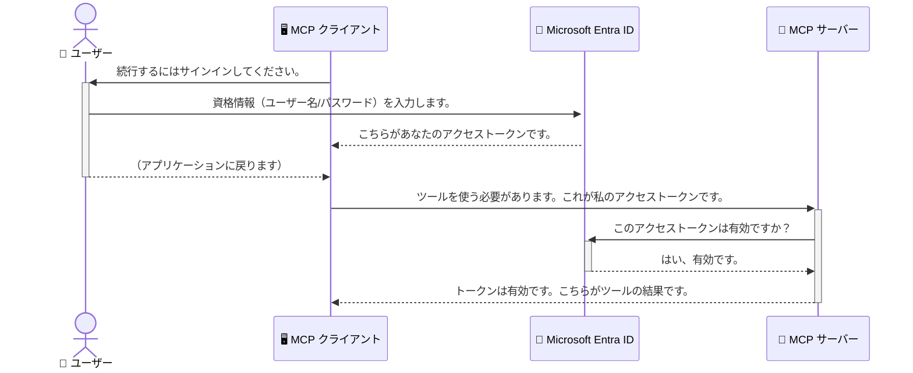

# AIワークフローの保護：モデルコンテキストプロトコルサーバー向けEntra ID認証

## はじめに
モデルコンテキストプロトコル（MCP）サーバーの保護は、家の玄関の鍵をかけることと同じくらい重要です。MCPサーバーを無防備にしておくと、不正なアクセスによってツールやデータが危険にさらされる可能性があります。Microsoft Entra IDは強力なクラウドベースのアイデンティティおよびアクセス管理ソリューションを提供し、権限のあるユーザーやアプリケーションのみがMCPサーバーとやり取りできるように支援します。このセクションでは、Entra ID認証を使用してAIワークフローを保護する方法を学びます。

## 学習目標
このセクションの終了時には、以下ができるようになります：

- MCPサーバーの保護の重要性を理解する。
- Microsoft Entra IDとOAuth 2.0認証の基本を説明する。
- 公開クライアントと機密クライアントの違いを認識する。
- ローカル（公開クライアント）およびリモート（機密クライアント）のMCPサーバーシナリオでEntra ID認証を実装する。
- AIワークフロー開発時にセキュリティのベストプラクティスを適用する。

## セキュリティとMCP

家の玄関の鍵をかけずに放置しないのと同様に、MCPサーバーを誰でもアクセスできる状態にしてはいけません。AIワークフローを保護することは、堅牢で信頼性が高く安全なアプリケーションを構築するために不可欠です。本章では、Microsoft Entra IDを使用してMCPサーバーを保護し、権限のあるユーザーとアプリケーションのみがツールやデータとやり取りできるようにする方法を紹介します。

## MCPサーバーにおけるセキュリティの重要性

あなたのMCPサーバーにメール送信や顧客データベースへのアクセスが可能なツールがあると想像してください。セキュリティが甘いサーバーは誰でもそのツールを使えてしまい、不正なデータアクセスやスパム、その他の悪意ある行為を招くおそれがあります。

認証を実装することで、サーバーへのすべてのリクエストが検証され、そのリクエストを行っているユーザーまたはアプリケーションの身元が確認されます。これはAIワークフローを保護する上で最初かつ最も重要なステップです。

## Microsoft Entra IDの紹介

[**Microsoft Entra ID**](https://adoption.microsoft.com/microsoft-security/entra/)はクラウドベースのアイデンティティおよびアクセス管理サービスです。アプリケーションのためのユニバーサルなセキュリティガードだと考えてください。ユーザーの身元確認（認証）や何が許可されているか（認可）といった複雑なプロセスを処理します。

Entra IDを使うことで、以下が可能になります：

- ユーザーの安全なサインインを実現。
- APIやサービスの保護。
- アクセスポリシーを中央で管理。

MCPサーバーでは、Entra IDがサーバーの機能にアクセスできるユーザーを管理する堅牢かつ広く信頼されたソリューションを提供します。

---

## 魔法の仕組み：Entra ID認証の動作原理

Entra IDは<strong>OAuth 2.0</strong>のようなオープン標準を使用して認証を処理します。詳細は複雑ですが、核となる概念はシンプルで、アナロジーを使って理解できます。

### OAuth 2.0のやさしい紹介：バレートキー

OAuth 2.0は車のバレーパーキングサービスのようなものです。レストランに到着したとき、マスターキーをバレー係に渡すのではなく、限定的な権限を持つ<strong>バレートキー</strong>を渡します。このキーでは車を始動しドアをロックできますが、トランクやグローブボックスは開けられません。

このアナロジーにおいて：

- <strong>あなた</strong>は<strong>ユーザー</strong>です。
- <strong>あなたの車</strong>は貴重なツールとデータを持つ<strong>MCPサーバー</strong>です。
- <strong>バレー係</strong>は<strong>Microsoft Entra ID</strong>です。
- <strong>駐車係</strong>は<strong>MCPクライアント</strong>（サーバーにアクセスしようとするアプリケーション）。
- <strong>バレートキー</strong>は<strong>アクセス トークン</strong>です。

アクセス トークンとは、ユーザーがサインインするとEntra IDからMCPクライアントに渡される安全な文字列です。クライアントはこのトークンを各リクエストでMCPサーバーに提示し、サーバーはトークンの有効性を検証して、リクエストが正当であり権限があることを確認します。実際の資格情報（例：パスワード）をサーバーで扱うことはありません。

### 認証の流れ

実際の処理の流れは以下の通りです：



### Microsoft Authentication Library (MSAL)の紹介

これからコード例に入りますが、例で重要なコンポーネントを紹介しておきます：**Microsoft Authentication Library (MSAL)**。

MSALはMicrosoftが開発したライブラリで、開発者が認証を簡単に扱えるようにします。セキュリティトークンの処理、サインイン管理、セッション更新の複雑な処理をMSALが担ってくれます。

MSALを使うメリットは多くあります：

- <strong>安全性</strong>: 業界標準のプロトコルとセキュリティベストプラクティスを実装し、コードの脆弱性リスクを軽減します。
- <strong>開発の容易さ</strong>: OAuth 2.0やOpenID Connectの複雑さを抽象化し、数行のコードで強力な認証をアプリに追加できます。
- <strong>継続的なメンテナンス</strong>: Microsoftが積極的に保守・更新を行っており、新たなセキュリティ脅威やプラットフォームの変更に対応しています。

MSALは.NET、JavaScript/TypeScript、Python、Java、Go、iOSやAndroidなど多彩な言語とプラットフォームをサポートし、テクノロジースタック全体で一貫した認証パターンを利用可能です。

MSALの詳細は公式の[MSAL概要ドキュメント](https://learn.microsoft.com/entra/identity-platform/msal-overview)をご覧ください。

---

## Entra IDによるMCPサーバーの保護：ステップバイステップガイド

ここからは、ローカルMCPサーバー（`stdio`で通信）をEntra IDで保護する方法を解説します。この例では<strong>公開クライアント</strong>を使用し、デスクトップアプリやローカル開発サーバーのようなユーザーのマシン上で動作するアプリに適しています。

### シナリオ1：ローカルMCPサーバーの保護（公開クライアント）

このシナリオでは、ローカルで稼働し、`stdio`で通信するMCPサーバーを取り扱います。Entra IDでユーザー認証を行い、ツールへのアクセスを制御します。サーバーはMicrosoft Graph APIからユーザープロファイル情報を取得する単一のツールを備えています。

#### 1. Entra IDでのアプリケーション登録

コードを書く前に、Microsoft Entra IDにアプリケーション登録をします。これにより、Entra IDがアプリケーションを認識し、認証サービスの使用許可を付与します。

1. <strong>[Microsoft Entra ポータル](https://entra.microsoft.com/)</strong>にアクセス。
2. <strong>アプリの登録</strong>に移動し、<strong>新規登録</strong>をクリック。
3. アプリ名をつけます（例："My Local MCP Server"）。
4. <strong>サポートされるアカウントの種類</strong>は<strong>この組織ディレクトリ内のアカウントのみ</strong>を選択。
5. この例では<strong>リダイレクトURI</strong>は空欄のままで構いません。
6. <strong>登録</strong>をクリック。

登録後、<strong>アプリケーション（クライアント）ID</strong>と<strong>ディレクトリ（テナント）ID</strong>を控えておきます。コード内で使用します。

#### 2. コードの概要

認証処理を担当する主要部分のコードを見ていきます。この例の完全なコードは、[mcp-auth-servers GitHubリポジトリ](https://github.com/Azure-Samples/mcp-auth-servers)の[Entra ID - Local - WAM](https://github.com/Azure-Samples/mcp-auth-servers/tree/main/src/entra-id-local-wam)フォルダーにあります。

**`AuthenticationService.cs`**

このクラスはEntra IDとのやり取りを処理します。

- **`CreateAsync`**: MSAL（Microsoft Authentication Library）から`PublicClientApplication`を初期化します。アプリケーションの`clientId`と`tenantId`を設定します。
- **`WithBroker`**: ブローカーの使用を有効にします（Windows Web Account Managerなど）。より安全でシームレスなシングルサインオン体験を提供します。
- **`AcquireTokenAsync`**: 中核のメソッドです。まず静かにトークンを取得しようとし（有効なセッションがあれば再サインイン不要）、取得できなければインタラクティブなサインインを促します。

```csharp
// Simplified for clarity
public static async Task<AuthenticationService> CreateAsync(ILogger<AuthenticationService> logger)
{
    var msalClient = PublicClientApplicationBuilder
        .Create(_clientId) // Your Application (client) ID
        .WithAuthority(AadAuthorityAudience.AzureAdMyOrg)
        .WithTenantId(_tenantId) // Your Directory (tenant) ID
        .WithBroker(new BrokerOptions(BrokerOptions.OperatingSystems.Windows))
        .Build();

    // ... cache registration ...

    return new AuthenticationService(logger, msalClient);
}

public async Task<string> AcquireTokenAsync()
{
    try
    {
        // Try silent authentication first
        var accounts = await _msalClient.GetAccountsAsync();
        var account = accounts.FirstOrDefault();

        AuthenticationResult? result = null;

        if (account != null)
        {
            result = await _msalClient.AcquireTokenSilent(_scopes, account).ExecuteAsync();
        }
        else
        {
            // If no account, or silent fails, go interactive
            result = await _msalClient.AcquireTokenInteractive(_scopes).ExecuteAsync();
        }

        return result.AccessToken;
    }
    catch (Exception ex)
    {
        _logger.LogError(ex, "An error occurred while acquiring the token.");
        throw; // Optionally rethrow the exception for higher-level handling
    }
}
```

**`Program.cs`**

このファイルでMCPサーバーを設定し、認証サービスを組み込みます。

- **`AddSingleton<AuthenticationService>`**: 依存性注入コンテナに`AuthenticationService`を登録し、他のアプリ部分（ツールなど）で利用可能にします。
- **`GetUserDetailsFromGraph`ツール**: `AuthenticationService`のインスタンスが必要です。処理の前に`authService.AcquireTokenAsync()`を呼び出してアクセストークンを取得します。認証成功時は、そのトークンを用いてMicrosoft Graph APIへ呼び出し、ユーザー情報を取得します。

```csharp
// Simplified for clarity
[McpServerTool(Name = "GetUserDetailsFromGraph")]
public static async Task<string> GetUserDetailsFromGraph(
    AuthenticationService authService)
{
    try
    {
        // This will trigger the authentication flow
        var accessToken = await authService.AcquireTokenAsync();

        // Use the token to create a GraphServiceClient
        var graphClient = new GraphServiceClient(
            new BaseBearerTokenAuthenticationProvider(new TokenProvider(authService)));

        var user = await graphClient.Me.GetAsync();

        return System.Text.Json.JsonSerializer.Serialize(user);
    }
    catch (Exception ex)
    {
        return $"Error: {ex.Message}";
    }
}
```

#### 3. 連携の流れ

1. MCPクライアントが`GetUserDetailsFromGraph`ツールを使うとき、最初に`AcquireTokenAsync`を呼びます。
2. `AcquireTokenAsync`はMSALに有効なトークンを探させます。
3. トークンがなければ、MSALがブローカー経由でユーザーにEntra IDアカウントでのサインインを促します。
4. ユーザーがサインインすると、Entra IDがアクセス トークンを発行します。
5. ツールはトークンを受け取り、Microsoft Graph APIへの安全な呼び出しに使います。
6. ユーザーの詳細がMCPクライアントに返されます。

このプロセスにより、認証済みユーザーのみがツールを使用でき、ローカルMCPサーバーが効果的に保護されます。

### シナリオ2：リモートMCPサーバーの保護（機密クライアント）

MCPサーバーがリモートマシン（クラウドサーバーなど）で稼働し、HTTPストリーミングのようなプロトコルで通信する場合、セキュリティ要件は異なります。この場合は<strong>機密クライアント</strong>と<strong>認可コードフロー</strong>を使います。これはアプリケーションのシークレットがブラウザにさらされないため、より安全な方法です。

この例はTypeScriptベースのMCPサーバーで、Express.jsを使ってHTTPリクエストを処理します。

#### 1. Entra IDでのアプリケーション設定

Entra IDでの設定は公開クライアントと似ていますが、重要な違いは<strong>クライアントシークレット</strong>を作成することです。

1. <strong>[Microsoft Entra ポータル](https://entra.microsoft.com/)</strong>にアクセス。
2. アプリ登録の<strong>証明書とシークレット</strong>タブに移動。
3. <strong>新しいクライアントシークレット</strong>をクリックし、説明を付けて<strong>追加</strong>。
4. **重要:** このシークレット値はすぐにコピーしてください。再度表示できません。
5. <strong>リダイレクトURI</strong>の設定も必要です。<strong>認証</strong>タブで<strong>プラットフォームの追加</strong>をクリックし、<strong>Web</strong>を選択、アプリのリダイレクトURIを入力します（例：`http://localhost:3001/auth/callback`）。

> **⚠️ 重要なセキュリティ注意点:** 本番アプリケーションでは、Microsoftは<strong>クライアントシークレットの代わりに</strong>、<strong>マネージドID</strong>や<strong>ワークロードIDフェデレーション</strong>などの<strong>シークレットレス認証</strong>方式の使用を強く推奨しています。クライアントシークレットは漏洩や悪用のリスクがあるためです。マネージドIDはコードや設定に資格情報を保存する必要をなくし、より安全です。
>
> マネージドIDの詳細と実装方法は、[AzureリソースのためのマネージドID概要](https://learn.microsoft.com/entra/identity/managed-identities-azure-resources/overview)をご覧ください。

#### 2. コードの概要

この例はセッションベースの方式を使用します。ユーザー認証時にサーバーはアクセストークンとリフレッシュトークンをセッションに保存し、ユーザーにはセッショントークンを渡します。以降のリクエストはこのセッショントークンで認証されます。完全なコードは、[mcp-auth-servers GitHubリポジトリ](https://github.com/Azure-Samples/mcp-auth-servers)の[Entra ID - Confidential client](https://github.com/Azure-Samples/mcp-auth-servers/tree/main/src/entra-id-cca-session)フォルダーにあります。

**`Server.ts`**

ExpressサーバーとMCPトランスポートレイヤーの設定を行います。

- **`requireBearerAuth`**: `/sse`と`/message`エンドポイントを保護するミドルウェア。リクエストの`Authorization`ヘッダーに正しいベアラートークンがあるか検査します。
- **`EntraIdServerAuthProvider`**: `McpServerAuthorizationProvider`インターフェイスを実装するカスタムクラス。OAuth 2.0フローの処理を担当。
- **`/auth/callback`**: ユーザー認証後、Entra IDからのリダイレクトを受け取るエンドポイント。認可コードをアクセストークンとリフレッシュトークンに交換します。

```typescript
// 明確化のため簡略化
const app = express();
const { server } = createServer();
const provider = new EntraIdServerAuthProvider();

// SSEエンドポイントを保護する
app.get("/sse", requireBearerAuth({
  provider,
  requiredScopes: ["User.Read"]
}), async (req, res) => {
  // ... トランスポートに接続する ...
});

// メッセージエンドポイントを保護する
app.post("/message", requireBearerAuth({
  provider,
  requiredScopes: ["User.Read"]
}), async (req, res) => {
  // ... メッセージを処理する ...
});

// OAuth 2.0のコールバックを処理する
app.get("/auth/callback", (req, res) => {
  provider.handleCallback(req.query.code, req.query.state)
    .then(result => {
      // ... 成功または失敗を処理する ...
    });
});
```

**`Tools.ts`**

MCPサーバーが提供するツールを定義します。`getUserDetails`ツールは前の例と似ていますが、アクセストークンはセッションから取得します。

```typescript
// 明確にするために簡略化
server.setRequestHandler(CallToolRequestSchema, async (request) => {
  const { name } = request.params;
  const context = request.params?.context as { token?: string } | undefined;
  const sessionToken = context?.token;

  if (name === ToolName.GET_USER_DETAILS) {
    if (!sessionToken) {
      throw new AuthenticationError("Authentication token is missing or invalid. Ensure the token is provided in the request context.");
    }

    // セッションストアからEntra IDトークンを取得
    const tokenData = tokenStore.getToken(sessionToken);
    const entraIdToken = tokenData.accessToken;

    const graphClient = Client.init({
      authProvider: (done) => {
        done(null, entraIdToken);
      }
    });

    const user = await graphClient.api('/me').get();

    // ... ユーザーの詳細を返す ...
  }
});
```

**`auth/EntraIdServerAuthProvider.ts`**

このクラスは以下のロジックを処理します：

- ユーザーをEntra IDサインインページへリダイレクト。
- 認可コードをアクセストークンに交換。
- トークンを`tokenStore`に保存。
- アクセストークンの期限切れ時に更新。

#### 3. 連携の流れ

1. ユーザーが初めてMCPサーバーに接続しようとすると、`requireBearerAuth`ミドルウェアが有効なセッションを持っていないことを検知し、Entra IDサインインページにリダイレクトします。
2. ユーザーはEntra IDアカウントでサインインします。
3. Entra IDはユーザーを `/auth/callback` エンドポイントに認可コードとともにリダイレクトします。  
4. サーバーはこのコードとアクセストークンおよびリフレッシュトークンを交換し、これらを保存してクライアントに送信するセッショントークンを作成します。  
5. クライアントは以降のすべてのMCPサーバーへのリクエストで、このセッショントークンを `Authorization` ヘッダーに使用できます。  
6. `getUserDetails` ツールが呼び出されると、セッショントークンを使ってEntra IDのアクセストークンを取得し、そのトークンを使ってMicrosoft Graph APIを呼び出します。

このフローはパブリッククライアントフローより複雑ですが、インターネットに公開されるエンドポイントには必須です。リモートのMCPサーバーは一般のインターネットからアクセス可能であるため、不正アクセスや攻撃から守るためにより強固なセキュリティ対策が求められます。

## セキュリティのベストプラクティス

- **常にHTTPSを使用する**: クライアントとサーバー間の通信を暗号化し、トークンの傍受を防ぎます。  
- **ロールベースアクセス制御 (RBAC) を実装する**: ユーザーが認証済みかどうかだけでなく、何が許可されているかをチェックします。Entra IDでロールを定義し、MCPサーバー側でそれを検証できます。  
- <strong>監視と監査を行う</strong>: すべての認証イベントをログに記録し、不審な活動を検知・対応できるようにします。  
- <strong>レート制限とスロットリングに対応する</strong>: Microsoft GraphなどのAPIは悪用防止のためにレート制限を実施しています。MCPサーバーでは指数関数的なバックオフと再試行ロジックを実装し、HTTP 429（要求過多）レスポンスを適切に処理します。頻繁にアクセスするデータはキャッシュするとAPI呼び出しを減らせます。  
- <strong>トークンの安全な保管</strong>: アクセストークンとリフレッシュトークンは安全に保管してください。ローカルアプリではOSのセキュアストレージを利用し、サーバーアプリでは暗号化ストレージやAzure Key Vaultのような安全なキー管理サービスの活用を検討してください。  
- <strong>トークン期限切れの対応</strong>: アクセストークンには有効期限があります。リフレッシュトークンを使った自動更新を実装し、再認証を必要とせずシームレスなユーザー体験を維持します。  
- **Azure API Managementの利用を検討する**: MCPサーバーに直接セキュリティ機能を組み込む方法もありますが、API GatewayであるAzure API Managementは認証・認可、レート制限、監視など多くのセキュリティ機能を自動的に提供し、クライアントとMCPサーバーの間に中央集約的なセキュリティレイヤーを設置できます。MCPとのAPI Gateway利用詳細は[Azure API Management Your Auth Gateway For MCP Servers](https://techcommunity.microsoft.com/blog/integrationsonazureblog/azure-api-management-your-auth-gateway-for-mcp-servers/4402690)を参照してください。

## 重要なポイント

- MCPサーバーのセキュリティ確保は、データやツールの保護に極めて重要です。  
- Microsoft Entra IDは認証と認可のための堅牢でスケーラブルなソリューションを提供します。  
- ローカルアプリケーションには<strong>パブリッククライアント</strong>を、リモートサーバーには<strong>機密クライアント</strong>を使い分けましょう。  
- <strong>認可コードフロー</strong>は、Webアプリケーションにおいて最も安全な選択肢です。

## 演習

1. あなたが構築するかもしれないMCPサーバーはローカルサーバーですか、それともリモートサーバーですか？  
2. その答えに基づいて、パブリッククライアントまたは機密クライアントのどちらを使いますか？  
3. MCPサーバーがMicrosoft Graph上で操作を行うために要求する権限は何ですか？

## 実習演習

### 演習1：Entra IDでアプリケーションを登録する  
Microsoft Entraポータルに移動します。  
MCPサーバー用の新しいアプリケーションを登録します。  
アプリケーション（クライアント）IDとディレクトリ（テナント）IDを控えます。

### 演習2：ローカルMCPサーバーを保護する（パブリッククライアント）  
- MSAL（Microsoft Authentication Library）を統合してユーザー認証を行うコード例に従います。  
- Microsoft Graphからユーザー情報を取得するMCPツールを呼び出して認証フローをテストします。

### 演習3：リモートMCPサーバーを保護する（機密クライアント）  
- Entra IDで機密クライアントを登録し、クライアントシークレットを作成します。  
- Express.jsのMCPサーバーを認可コードフローに対応させて構成します。  
- 保護されたエンドポイントにアクセスして、トークンベースのアクセスを確認します。

### 演習4：セキュリティベストプラクティスの適用  
- ローカルまたはリモートサーバーでHTTPSを有効化します。  
- サーバーロジックにロールベースアクセス制御（RBAC）を実装します。  
- トークンの有効期限管理と安全なトークン保存を追加します。

## 資料

1. **MSALの概要ドキュメント**  
   Microsoft Authentication Library (MSAL)がプラットフォーム横断で安全なトークン取得をどのように実現するか学べます：  
   [MSAL Overview on Microsoft Learn](https://learn.microsoft.com/en-gb/entra/msal/overview)

2. **Azure-Samples/mcp-auth-servers GitHubリポジトリ**  
   認証フローを示すMCPサーバーの参考実装：  
   [Azure-Samples/mcp-auth-servers on GitHub](https://github.com/Azure-Samples/mcp-auth-servers)

3. **Azureリソースの管理対象ID概要**  
   シークレット不要のシステム割り当てまたはユーザー割り当て管理IDの利用について：  
   [Managed Identities Overview on Microsoft Learn](https://learn.microsoft.com/en-us/entra/identity/managed-identities-azure-resources/)

4. **Azure API Management: Your Auth Gateway for MCP Servers**  
   MCPサーバー用のセキュアなOAuth2ゲートウェイとしてのAPIMの利用方法詳細：  
   [Azure API Management Your Auth Gateway For MCP Servers](https://techcommunity.microsoft.com/blog/integrationsonazureblog/azure-api-management-your-auth-gateway-for-mcp-servers/4402690)

5. **Microsoft Graph権限リファレンス**  
   Microsoft Graphの委任権限およびアプリケーション権限の一覧：  
   [Microsoft Graph Permissions Reference](https://learn.microsoft.com/zh-tw/graph/permissions-reference)

## 学習成果  
このセクションを修了すると、以下を実現できます：

- MCPサーバーおよびAIワークフローにおける認証の重要性を説明できる。  
- ローカルおよびリモートのMCPサーバーシナリオに対してEntra ID認証を設定・構成できる。  
- サーバーの展開に応じて適切なクライアントタイプ（パブリックまたは機密）を選択できる。  
- トークン保存やロールベース認可などの安全なコーディング実践を実装できる。  
- 不正アクセスからMCPサーバーとツールを確実に保護できる。

## 次のステップ

- [5.13 Model Context Protocol (MCP) Integration with Microsoft Foundry](../mcp-foundry-agent-integration/README.md)

---

<!-- CO-OP TRANSLATOR DISCLAIMER START -->
**免責事項**：
本書類は AI 翻訳サービス [Co-op Translator](https://github.com/Azure/co-op-translator) を使用して翻訳されています。正確性を期していますが、自動翻訳には誤りや不正確な部分が含まれる可能性があることをご承知おきください。原文の原語版が正式な情報源とみなされるべきです。重要な情報については、専門の人間による翻訳を推奨します。本翻訳の利用により生じたいかなる誤解や解釈違いについても、当方は責任を負いかねます。
<!-- CO-OP TRANSLATOR DISCLAIMER END -->