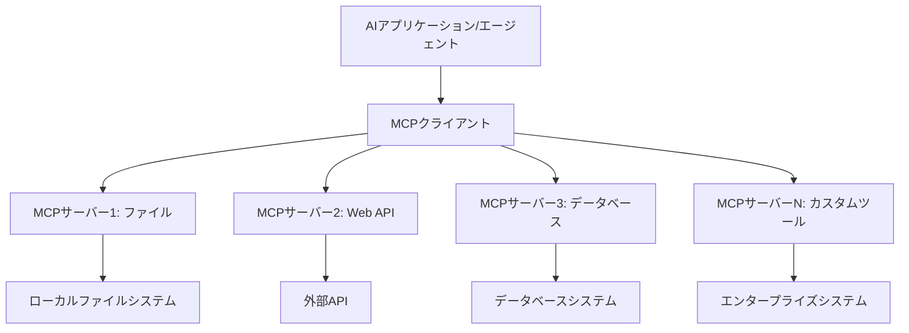

# 🌐 モジュール 2: Microsoft Foundry Toolkit 基礎による MCP

[]()
[]()
[]()

## 📋 学習目標

このモジュールの終了時には、以下ができるようになります:
- ✅ Model Context Protocol (MCP) のアーキテクチャと利点を理解する
- ✅ Microsoft の MCP サーバーエコシステムを探索する
- ✅ MCP サーバーを Microsoft Foundry Toolkit Agent Builder と統合する
- ✅ Playwright MCP を用いた機能的なブラウザ自動化エージェントを構築する
- ✅ エージェント内で MCP ツールを設定およびテストする
- ✅ MCP を活用したエージェントをエクスポートし、本番環境にデプロイする

## 🎯 モジュール 1 からのステップアップ

モジュール 1 では Microsoft Foundry Toolkit の基本を習得し、最初の Python エージェントを作成しました。今度は、革新的な **Model Context Protocol (MCP)** を使って、エージェントを外部ツールやサービスに接続し、<strong>パワーアップ</strong>しましょう。

これを、簡単な計算機からフルコンピュータへのアップグレードと考えてください。これにより AI エージェントは以下の能力を得ます:
- 🌐 ウェブサイトの閲覧と対話
- 📁 ファイルへのアクセスと操作
- 🔧 エンタープライズシステムとの統合
- 📊 API からのリアルタイムデータ処理

## 🧠 Model Context Protocol (MCP) の理解

### 🔍 MCP とは？

Model Context Protocol (MCP) は、AI アプリケーションのための **「USB-C」** とも言える革新的なオープンスタンダードで、大規模言語モデル（LLM）を外部ツール、データソース、サービスに接続します。USB-C がケーブル混乱を解消したように、MCP は AI 統合の複雑さを一つの標準化されたプロトコルで解決します。

### 🎯 MCP が解決する問題

**MCP 前:**
- 🔧 ツールごとにカスタム統合が必要
- 🔄 ベンダーロックインによる閉鎖的なソリューション
- 🔒 アドホックな接続によるセキュリティリスク
- ⏱️ 基本的な統合に数か月を要す

**MCP 後:**
- ⚡ プラグアンドプレイのツール統合
- 🔄 ベンダーに依存しないアーキテクチャ
- 🛡️ セキュリティベストプラクティスの組み込み
- 🚀 新機能追加は数分で可能

### 🏗️ MCP アーキテクチャの詳細

MCP は安全でスケーラブルなエコシステムを構築する<strong>クライアント-サーバーアーキテクチャ</strong>を採用しています：



**🔧 コアコンポーネント:**

| コンポーネント | 役割 | 例 |
|-----------|------|----------|
| **MCP ホスト** | MCP サービスを利用するアプリケーション | Claude Desktop, VS Code, Microsoft Foundry Toolkit |
| **MCP クライアント** | プロトコルハンドラー（サーバーと 1:1） | ホストアプリケーションに組み込み済み |
| **MCP サーバー** | 標準プロトコルを介して機能を公開 | Playwright, Files, Azure, GitHub |
| <strong>トランスポート層</strong> | 通信手段 | stdio, HTTP, WebSockets |


## 🏢 Microsoft の MCP サーバーエコシステム

Microsoft は実際のビジネスニーズに応えるエンタープライズグレードの包括的な MCP サーバー群で MCP エコシステムを牽引しています。

### 🌟 注目の Microsoft MCP サーバー

#### 1. ☁️ Azure MCP サーバー
**🔗 リポジトリ**: [azure/azure-mcp](https://github.com/azure/azure-mcp)
**🎯 目的**: AI 統合による包括的 Azure リソース管理

**✨ 主な特徴:**
- 宣言的なインフラプロビジョニング
- リアルタイムリソース監視
- コスト最適化の推奨
- セキュリティコンプライアンスチェック

**🚀 ユースケース:**
- AI支援の Infrastructure-as-Code
- 自動リソーススケーリング
- クラウドコスト最適化
- DevOps ワークフロー自動化

#### 2. 📊 Microsoft Dataverse MCP
**📚 ドキュメント**: [Microsoft Dataverse Integration](https://go.microsoft.com/fwlink/?linkid=2320176)
**🎯 目的**: ビジネスデータの自然言語インターフェース

**✨ 主な特徴:**
- 自然言語によるデータベースクエリ
- ビジネス文脈の理解
- カスタムプロンプトテンプレート
- エンタープライズデータガバナンス

**🚀 ユースケース:**
- ビジネスインテリジェンスレポート
- 顧客データ分析
- セールスパイプラインの洞察
- コンプライアンスデータクエリ

#### 3. 🌐 Playwright MCP サーバー
**🔗 リポジトリ**: [microsoft/playwright-mcp](https://github.com/microsoft/playwright-mcp)
**🎯 目的**: ブラウザ自動化とウェブインタラクション機能

**✨ 主な特徴:**
- クロスブラウザ自動化 (Chrome, Firefox, Safari)
- インテリジェントな要素検出
- スクリーンショットおよび PDF 生成
- ネットワークトラフィック監視

**🚀 ユースケース:**
- 自動テストワークフロー
- ウェブスクレイピングとデータ抽出
- UI/UX モニタリング
- 競合分析自動化

#### 4. 📁 Files MCP サーバー
**🔗 リポジトリ**: [microsoft/files-mcp-server](https://github.com/microsoft/files-mcp-server)
**🎯 目的**: インテリジェントなファイルシステム操作

**✨ 主な特徴:**
- 宣言的ファイル管理
- コンテンツ同期
- バージョン管理統合
- メタデータ抽出

**🚀 ユースケース:**
- ドキュメント管理
- コードリポジトリ整理
- コンテンツ公開ワークフロー
- データパイプラインファイル処理

#### 5. 📝 MarkItDown MCP サーバー
**🔗 リポジトリ**: [microsoft/markitdown](https://github.com/microsoft/markitdown)
**🎯 目的**: 高機能な Markdown 処理・操作

**✨ 主な特徴:**
- リッチな Markdown パース
- 形式変換 (MD ↔ HTML ↔ PDF)
- コンテンツ構造解析
- テンプレート処理

**🚀 ユースケース:**
- 技術文書ワークフロー
- コンテンツ管理システム
- レポート生成
- ナレッジベース自動化

#### 6. 📈 Clarity MCP サーバー
**📦 パッケージ**: [@microsoft/clarity-mcp-server](https://www.npmjs.com/package/@microsoft/clarity-mcp-server)
**🎯 目的**: ウェブ解析とユーザー行動インサイト

**✨ 主な特徴:**
- ヒートマップデータ解析
- ユーザーセッション録画
- パフォーマンス指標
- コンバージョンファネル分析

**🚀 ユースケース:**
- サイト最適化
- ユーザーエクスペリエンス調査
- A/B テスト分析
- ビジネスインテリジェンスダッシュボード

### 🌍 コミュニティエコシステム

Microsoft のサーバーに加え、MCP エコシステムには以下も含まれます:
- **🐙 GitHub MCP**: リポジトリ管理とコード解析
- **🗄️ データベース MCP**: PostgreSQL、MySQL、MongoDB 統合
- **☁️ クラウドプロバイダー MCP**: AWS、GCP、Digital Ocean ツール
- **📧 コミュニケーション MCP**: Slack、Teams、メール統合

## 🛠️ ハンズオンラボ: ブラウザ自動化エージェントの構築

**🎯 プロジェクト目標**: Playwright MCP サーバーを使用し、ウェブサイトをナビゲートし情報抽出や複雑なWeb操作を行うインテリジェントなブラウザ自動化エージェントを作成する。

### 🚀 フェーズ 1: エージェント基盤設定

#### ステップ 1: エージェントの初期化
1. **Microsoft Foundry Toolkit Agent Builder を開く**
2. <strong>新しいエージェントを作成</strong>し、次の設定を行う:
   - <strong>名前</strong>: `BrowserAgent`
   - <strong>モデル</strong>: GPT-4o を選択


### 🔧 フェーズ 2: MCP 統合ワークフロー

#### ステップ 3: MCP サーバー統合を追加
1. Agent Builder の <strong>ツールセクション</strong>へ移動
2. <strong>「ツールを追加」</strong>をクリックして統合メニューを開く
3. 利用可能なオプションから **「MCP サーバー」** を選択


**🔍 ツールタイプの理解:**
- <strong>組み込みツール</strong>: 事前設定された Microsoft Foundry Toolkit の機能
- **MCP サーバー**: 外部サービス統合
- **カスタム API**: 独自のサービスエンドポイント
- <strong>関数コール</strong>: モデルの関数に直接アクセス

#### ステップ 4: MCP サーバー選択
1. **「MCP サーバー」** オプションを選択して続行


2. 利用可能な統合を探索するため **MCP カタログ** を閲覧


### 🎮 フェーズ 3: Playwright MCP 設定

#### ステップ 5: Playwright の選択と設定
1. **「特集 MCP サーバーを使用」** をクリックし Microsoft の検証済みサーバーへアクセス
2. 特集リストから **「Playwright」** を選択
3. デフォルトの MCP ID を承諾、または環境に合わせてカスタマイズ


#### ステップ 6: Playwright 機能の有効化
**🔑 重要なステップ**: すべての Playwright メソッドを選択し最大限の機能を有効にする


**🛠️ 必須 Playwright ツール:**
- <strong>ナビゲーション</strong>: `goto`, `goBack`, `goForward`, `reload`
- <strong>操作</strong>: `click`, `fill`, `press`, `hover`, `drag`
- <strong>抽出</strong>: `textContent`, `innerHTML`, `getAttribute`
- <strong>検証</strong>: `isVisible`, `isEnabled`, `waitForSelector`
- <strong>キャプチャ</strong>: `screenshot`, `pdf`, `video`
- <strong>ネットワーク</strong>: `setExtraHTTPHeaders`, `route`, `waitForResponse`

#### ステップ 7: 統合成功の確認
**✅ 成功の指標:**
- すべてのツールが Agent Builder インターフェースに表示されている
- 統合パネルにエラーメッセージが表示されていない
- Playwright サーバーのステータスが「Connected」と表示


**🔧 よくある問題のトラブルシューティング:**
- <strong>接続失敗</strong>: インターネット接続とファイアウォール設定を確認
- <strong>ツール欠落</strong>: 設定時にすべての機能が選択されているか確認
- <strong>権限エラー</strong>: VS Code に必要なシステム権限があるか検証

### 🎯 フェーズ 4: 高度なプロンプト設計

#### ステップ 8: インテリジェントなシステムプロンプトの設計
Playwright の全機能を活かす高度なプロンプトを作成:

```markdown
# Web Automation Expert System Prompt

## Core Identity
You are an advanced web automation specialist with deep expertise in browser automation, web scraping, and user experience analysis. You have access to Playwright tools for comprehensive browser control.

## Capabilities & Approach
### Navigation Strategy
- Always start with screenshots to understand page layout
- Use semantic selectors (text content, labels) when possible
- Implement wait strategies for dynamic content
- Handle single-page applications (SPAs) effectively

### Error Handling
- Retry failed operations with exponential backoff
- Provide clear error descriptions and solutions
- Suggest alternative approaches when primary methods fail
- Always capture diagnostic screenshots on errors

### Data Extraction
- Extract structured data in JSON format when possible
- Provide confidence scores for extracted information
- Validate data completeness and accuracy
- Handle pagination and infinite scroll scenarios

### Reporting
- Include step-by-step execution logs
- Provide before/after screenshots for verification
- Suggest optimizations and alternative approaches
- Document any limitations or edge cases encountered

## Ethical Guidelines
- Respect robots.txt and rate limiting
- Avoid overloading target servers
- Only extract publicly available information
- Follow website terms of service
```

#### ステップ 9: 動的ユーザープロンプトの作成
各種機能を示すプロンプトを設計:

**🌐 ウェブ解析の例:**
```markdown
Navigate to github.com/kinfey and provide a comprehensive analysis including:
1. Repository structure and organization
2. Recent activity and contribution patterns  
3. Documentation quality assessment
4. Technology stack identification
5. Community engagement metrics
6. Notable projects and their purposes

Include screenshots at key steps and provide actionable insights.
```


### 🚀 フェーズ 5: 実行とテスト

#### ステップ 10: 最初の自動化を実行
1. <strong>「実行」をクリック</strong>して自動化シーケンスを開始
2. <strong>リアルタイムの実行状況を監視</strong>:
   - Chrome ブラウザが自動起動
   - エージェントがターゲットサイトに移動
   - 各主要ステップのスクリーンショットが取得される
   - 分析結果がリアルタイムでストリームされる


#### ステップ 11: 結果と洞察の分析
Agent Builder のインターフェースで包括的な分析結果を確認:


### 🌟 フェーズ 6: 高度な機能とデプロイ

#### ステップ 12: エクスポートと本番デプロイ
Agent Builder は複数のデプロイオプションに対応:


## 🎓 モジュール 2 要約と次のステップ

### 🏆 達成アンロック: MCP 統合マスター

**✅ 習得スキル:**
- [ ] MCP のアーキテクチャと利点の理解
- [ ] Microsoft の MCP サーバーエコシステムのナビゲート
- [ ] Playwright MCP と Microsoft Foundry Toolkit の統合
- [ ] 高度なブラウザ自動化エージェントの構築
- [ ] ウェブ自動化向け高度なプロンプト設計

### 📚 追加リソース

- **🔗 MCP 仕様**: [公式プロトコルドキュメント](https://modelcontextprotocol.io/)
- **🛠️ Playwright API**: [完全なメソッドリファレンス](https://playwright.dev/docs/api/class-playwright)
- **🏢 Microsoft MCP サーバー**: [エンタープライズ統合ガイド](https://github.com/microsoft/mcp-servers)
- **🌍 コミュニティ事例**: [MCP サーバーギャラリー](https://github.com/modelcontextprotocol/servers)

**🎉 おめでとうございます！** MCP 統合を習得し、外部ツール機能を備えた本番対応の AI エージェントを構築できるようになりました！


### 🔜 次のモジュールへ進む

MCP スキルをさらに高める準備はできましたか？**[モジュール 3: Microsoft Foundry Toolkit での高度な MCP 開発](../lab3/README.md)** へ進み、以下を学びます:
- 独自のカスタム MCP サーバーの作成
- 最新の MCP Python SDK の設定と使用
- デバッグ用 MCP インスペクターのセットアップ
- 高度な MCP サーバー開発ワークフローの習得
- ゼロからの天気 MCP サーバー構築

---

<!-- CO-OP TRANSLATOR DISCLAIMER START -->
**免責事項**：
本書類は AI 翻訳サービス [Co-op Translator](https://github.com/Azure/co-op-translator) を使用して翻訳されています。正確性を期していますが、自動翻訳には誤りや不正確な部分が含まれる可能性があることをご承知おきください。原文の原語版が正式な情報源とみなされるべきです。重要な情報については、専門の人間による翻訳を推奨します。本翻訳の利用により生じたいかなる誤解や解釈違いについても、当方は責任を負いかねます。
<!-- CO-OP TRANSLATOR DISCLAIMER END -->