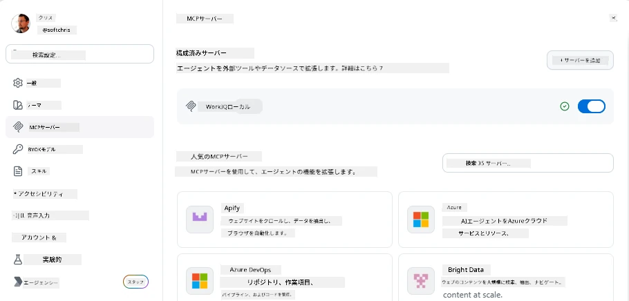
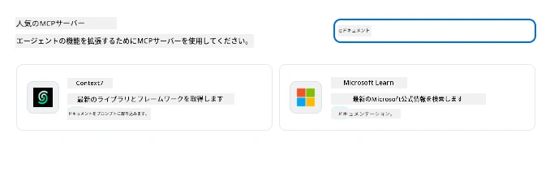
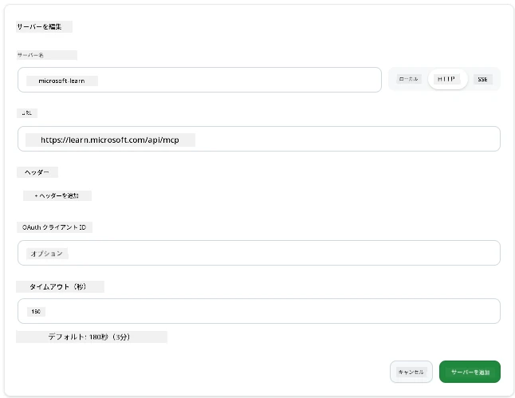
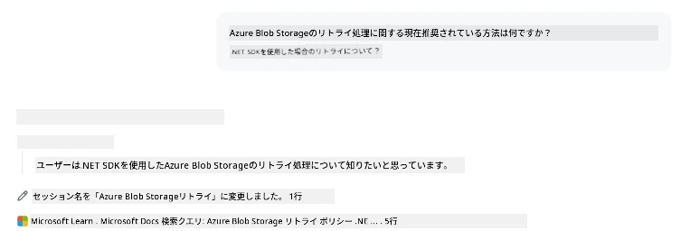
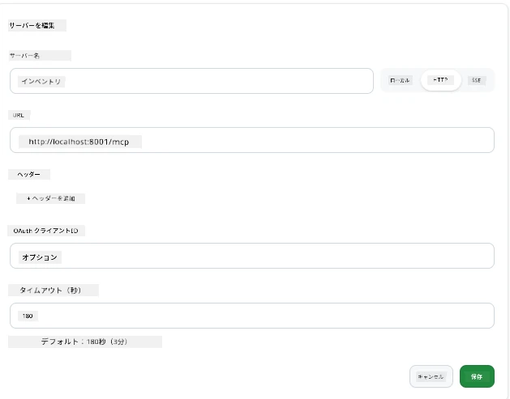
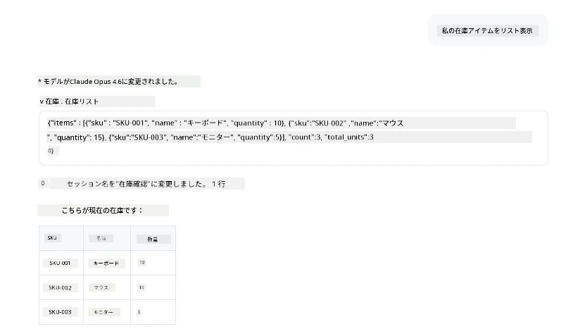
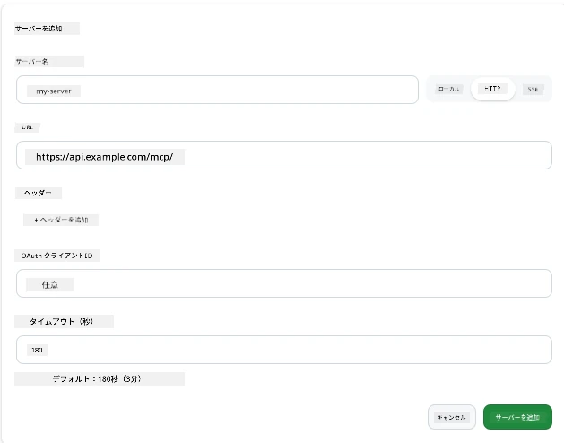
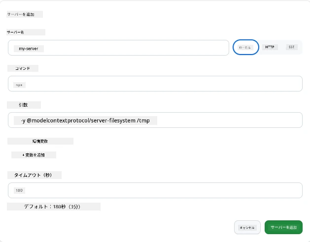

# GitHub Copilot アプリでの MCP サーバーの使用

これまでにMCPの仕組みは理解できています。サーバーを構築し、ツールやリソースを定義し、クライアントを接続しました。まだ行っていないのは視点を反転させることです。あなたがサーバーを構築する側ではなく、MCPをサポートするAI搭載のアプリの<em>利用者</em>側に立つとどうなるでしょうか？

[GitHub Copilot App](https://github.com/github/app) はMCPサーバーを利用できるデスクトップアプリです。MCPサーバーを接続することで、新たな機能がアンロックされます。Copilotがあなたのドキュメントにアクセスしたり、内部APIを呼び出したり、データベースに問い合わせたり、あなたがサーバーでラップした任意のサービスとやりとりできるようになります。アプリがホストとなり、あなたのMCPサーバーがそのツールになるのです。

このレッスンでは、MCP設定パネルの場所を見つけて実際にドキュメントサーバーを接続し、さらに自作のサーバーを設定するまでの一連の流れを案内します。

## 学習目標

このレッスンの終了時には、以下ができるようになります。

- Copilot アプリ設定の MCP サーバーパネルを見つけて操作する方法
- ホストされたドキュメントサーバーを接続し、セッションで使用する方法
- カスタムサーバーを登録し、Copilotがそのツールを呼び出せることを確認する方法
- 環境変数やカスタムヘッダー（HTTPの場合）を使ってサーバー呼び出し方法を設定する方法

## Copilot アプリの MCP ホストとしての役割

基本的な考え方はこうです：**Copilotのエージェントは賢いですが、知っているのはあなたが伝えた情報だけです。** デフォルトでは、エージェントは作業フォルダ内のファイルを読み取って端末コマンドを実行できますが、あなたのデータベースを問い合わせたり、カレンダーを覗いたり、カスタムAPIを呼ぶことはできません。そこでMCPサーバーが役立ちます。MCPサーバーはCopilotとシステム（データベース、バージョン管理、API、デザインツールなど）との橋渡し役となり、エージェントに必要な情報や操作権限を与えます。

では、まずはアプリのMCPサーバー管理設定を見つけましょう。

## ステップ 1: MCP 設定パネルを見つける

Copilot アプリを開き、左下の歯車アイコンをクリックします。


「MCP Servers」を選択すると、上部に既に設定されたサーバーが表示され、下部には人気サーバーのマーケットプレイスがあり、上部には「Add Server」ボタンが表示されているはずです。



ここがコントロールセンターです。サーバーの追加、削除、有効化、無効化をここで行います。変更は新しいセッションから有効になります。すでにセッションが開いている場合は、リストを変更後に新しいセッションを開始する必要があります。

## ステップ 2: ドキュメントサーバーの接続

すぐに役立つことをやってみましょう。Microsoft Docs の MCP サーバーはCopilotに公式のMicrosoftドキュメントへのアクセス権を与えます。Azure、.NET、TypeScriptなどが含まれます。エージェントが学習データ（カットオフ日あり）に頼る代わりに、クエリ時に最新のドキュメントを取得できます。

接続方法は以下の通りです。

1. 人気サーバーのグリッドで **learn** と入力し、「Microsoft Learn」という名前のサーバーを選択します。

   

   クリックすると、名前、通信タイプ、URLが事前入力されたフォームが表示されるので、「Add Server」をクリックするだけです。

2. 「Add Server」をクリックすると数秒でサーバーに接続されます。

   

   追加されると上部の設定済みサーバー一覧に表示されます。次に実際に使ってみましょう。

3. ダイアログを閉じ、「Quick chat」を選択します。

4. 以下のプロンプトを入力して、Microsoft Learnサーバーのツールを呼び出します。

   ```text
   What's the current recommended approach for handling Azure Blob Storage 
   retries using the .NET SDK?
   ```

   

先ほど追加したMCPサーバーを参照しているのがわかるはずです。

## ステップ 3: カスタムstdioサーバーの接続

プリセットは便利ですが、真の力は自分のサーバーを接続することにあります。例えば、社内APIや社内ナレッジベースを公開するサーバーを構築したり受け取ったりしている場合です。ここでは自社の在庫管理を扱うMCPサーバーを使います。

1. 歯車をクリックし、再び「MCP servers」を選択します。

2. 「Add Server」ボタンから「+ Add Custom server」を選び、以下の値を入力します：

   - 名前：`Inventory Server`
   - 右側から通信方式を **http** に選択

   「Add Server」を選択すると、設定済みサーバー一覧に表示されます。

   

4. 実際に試すには、以下のようなプロンプトを実行します。

    ```
    list inventory
    ```

   

カスタムサーバーから返された在庫項目のリストが表示されるはずです。

素晴らしいです。これで外部のMCPサーバーだけでなく、自分で構築したサーバーもCopilotアプリに追加できる理解ができたと思います。次はシークレットや環境変数の扱いについて説明します。

## ステップ 4: 高度な設定

これまで、名前とURLだけを指定してMCPサーバーを追加する方法を見てきました。では、もしサーバーでAPIキーやその他の情報が必要な場合はどうすればよいでしょう？ 通信タイプに応じて必要な設定を追加できます。

- **httpまたはSSE通信**：必要に応じてヘッダーを設定できます。

   認証が必要なら、Authorizationヘッダーを指定できます。値は静的な文字列でよいです。OAuthを使う場合はOAuthクライアントIDを指定することも可能です。

   

- **stdio通信**：環境変数を設定可能です。

   サーバー起動時に渡す環境変数をいくつでも指定できます。

   

## まとめ

Copilot アプリは MCP サーバーをエージェント能力の一級拡張として扱います。このレッスンを通じて、MCPサーバーの追加からセッションでの利用までの全体像を理解できました。パブリックサーバーや社内API、カスタムツールを接続し、エージェントが必要な情報や操作に自律的にアクセスできるようになりました。

## 📚 追加リソース

### 公式ドキュメント

- [GitHub Copilot App](https://github.com/github/app)
- [MCP Specification](https://modelcontextprotocol.io/specification/2025-03-26) - Model Context Protocol仕様

### コミュニティ
- [MCP Community Discord](https://discord.com/invite/ByRwuEEgH4) - ライブディスカッション
- [GitHub Discussions](https://github.com/microsoft/MCP-Server-and-PostgreSQL-Sample-Retail/discussions) - 質問＆共有
- [Stack Overflow](https://stackoverflow.com/questions/tagged/model-context-protocol) - 技術的な質問

---

<!-- CO-OP TRANSLATOR DISCLAIMER START -->
**免責事項**：
本書類は AI 翻訳サービス [Co-op Translator](https://github.com/Azure/co-op-translator) を使用して翻訳されています。正確性を期していますが、自動翻訳には誤りや不正確な部分が含まれる可能性があることをご承知おきください。原文の原語版が正式な情報源とみなされるべきです。重要な情報については、専門の人間による翻訳を推奨します。本翻訳の利用により生じたいかなる誤解や解釈違いについても、当方は責任を負いかねます。
<!-- CO-OP TRANSLATOR DISCLAIMER END -->