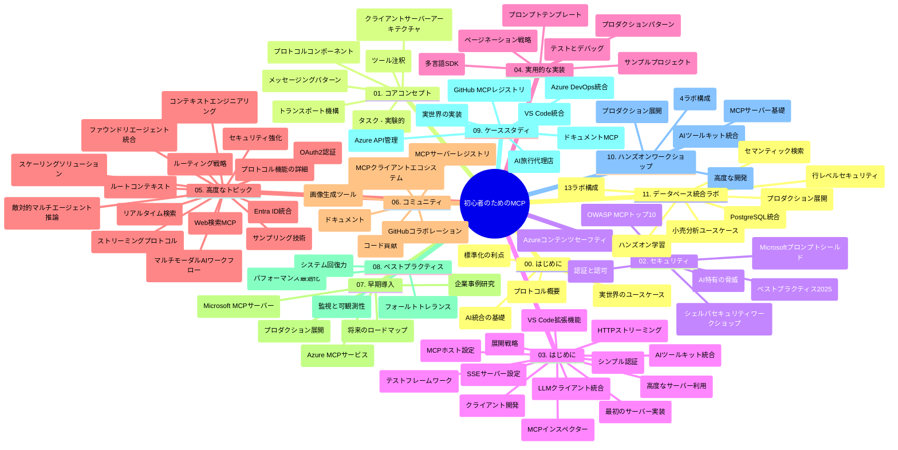

# 初心者向けモデルコンテキストプロトコル（MCP）- 学習ガイド

この学習ガイドは、「初心者向けモデルコンテキストプロトコル（MCP）」カリキュラムのリポジトリ構造と内容の概要を提供します。このガイドを使用してリポジトリを効率よくナビゲートし、利用可能なリソースを最大限に活用してください。

## リポジトリ概要

モデルコンテキストプロトコル（MCP）は、AIモデルとクライアントアプリケーション間の相互作用のための標準化されたフレームワークです。Anthropicによって最初に作成され、現在は公式GitHub組織を通じて広範なMCPコミュニティによって維持されています。このリポジトリは、AI開発者、システムアーキテクト、およびソフトウェアエンジニア向けにC#、Java、JavaScript、Python、TypeScriptでの実践的なコード例を含む包括的なカリキュラムを提供します。

## カリキュラムマップの視覚化

## リポジトリ構成

リポジトリはMCPのさまざまな側面に焦点を当てた11の主要セクションに整理されています：

1. **イントロダクション (00-Introduction/)**
   - モデルコンテキストプロトコルの概要
   - AIパイプラインにおける標準化の重要性
   - 実用的なユースケースと利点

2. **コアコンセプト (01-CoreConcepts/)**
   - クライアント・サーバーアーキテクチャ
   - 主要なプロトコルコンポーネント
   - MCPにおけるメッセージングパターン

3. **セキュリティ (02-Security/)**
   - MCPベースのシステムにおけるセキュリティ脅威
   - 実装を保護するためのベストプラクティス
   - 認証と認可の戦略
   - <strong>包括的なセキュリティ文書</strong>：
     - MCPセキュリティベストプラクティス 2025
     - Azureコンテンツセーフティ実装ガイド
     - MCPセキュリティコントロールと技術
     - MCPベストプラクティスクイックリファレンス
   - <strong>重要なセキュリティトピック</strong>：
     - プロンプトインジェクションおよびツール毒害攻撃
     - セッションハイジャックおよび混乱させる代理人問題
     - トークンのパススルー脆弱性
     - 過剰な権限およびアクセス制御
     - AIコンポーネントのサプライチェーンセキュリティ
     - マイクロソフトプロンプトシールド統合

4. **はじめに (03-GettingStarted/)**
   - 環境セットアップと構成
   - 基本的なMCPサーバーおよびクライアントの作成
   - 既存アプリケーションとの統合
   - 以下のセクションを含む：
     - 最初のサーバー実装
     - クライアント開発
     - LLMクライアント統合
     - VS Code統合
     - サーバー送信イベント（SSE）サーバー
     - 高度なサーバー使用
     - HTTPストリーミング
     - AIツールキット統合
     - テスト戦略
     - デプロイメントガイドライン

5. **実践的実装 (04-PracticalImplementation/)**
   - さまざまなプログラミング言語でのSDK利用
   - デバッグ、テスト、検証技術
   - 再利用可能なプロンプトテンプレートとワークフローの作成
   - 実装例を伴うサンプルプロジェクト

6. **高度なトピック (05-AdvancedTopics/)**
   - コンテキストエンジニアリング技術
   - Foundryエージェント統合
   - マルチモーダルAIワークフロー
   - OAuth2認証デモ
   - リアルタイム検索機能
   - リアルタイムストリーミング
   - ルートコンテキスト実装
   - ルーティング戦略
   - サンプリング技術
   - スケーリングアプローチ
   - セキュリティ上の考慮事項
   - Entra IDセキュリティ統合
   - ウェブ検索統合
   - 対抗的マルチエージェント推論（討論パターン）

7. **コミュニティ貢献 (06-CommunityContributions/)**
   - コードおよびドキュメントの貢献方法
   - GitHubを介した協力
   - コミュニティ駆動の改善およびフィードバック
   - さまざまなMCPクライアント（Claude Desktop、Cline、VSCode）の利用
   - 画像生成を含む人気MCPサーバーとの連携

8. **初期採用の教訓 (07-LessonsfromEarlyAdoption/)**
   - 実世界の実装および成功事例
   - MCPベースのソリューションの構築と展開
   - トレンドと将来のロードマップ
   - **Microsoft MCPサーバーガイド**：以下を含む10の本番対応Microsoft MCPサーバーの包括的ガイド
     - Microsoft Learn Docs MCPサーバー
     - Azure MCPサーバー（15以上の専門コネクター）
     - GitHub MCPサーバー
     - Azure DevOps MCPサーバー
     - MarkItDown MCPサーバー
     - SQL Server MCPサーバー
     - Playwright MCPサーバー
     - Dev Box MCPサーバー
     - Microsoft Foundry MCPサーバー
     - Microsoft 365 Agents Toolkit MCPサーバー

9. **ベストプラクティス (08-BestPractices/)**
   - パフォーマンスチューニングと最適化
   - 障害に強いMCPシステムの設計
   - テストおよび回復力戦略

10. **事例研究 (09-CaseStudy/)**
    - 多様なシナリオにおけるMCPの多用途性を示す<strong>7つの包括的事例研究</strong>：
    - **Azure AIトラベルエージェント**：Azure OpenAIとAI Searchを用いたマルチエージェントオーケストレーション
    - **Azure DevOps統合**：YouTubeデータ更新を自動化したワークフロー処理
    - <strong>リアルタイムドキュメント取得</strong>：ストリーミングHTTP対応Pythonコンソールクライアント
    - <strong>インタラクティブ学習計画ジェネレーター</strong>：チェインリットウェブアプリと会話型AI
    - <strong>エディタ内ドキュメント</strong>：VS Code統合およびGitHub Copilotワークフロー
    - **Azure API Management**：エンタープライズAPI統合とMCPサーバー作成
    - **GitHub MCPレジストリ**：エコシステム開発とエージェント統合プラットフォーム
    - エンタープライズ統合、開発者生産性、エコシステム開発にわたる実装例

11. **ハンズオンワークショップ (10-StreamliningAIWorkflowsBuildingAnMCPServerWithAIToolkit/)**
    - MCPとAIツールキットを組み合わせた包括的なハンズオンワークショップ
    - AIモデルと実世界のツールをつなぐインテリジェントアプリケーションの構築
    - 基礎、カスタムサーバー開発、生産展開戦略をカバーする実践モジュール
    - <strong>ラボ構成</strong>：
      - ラボ1：MCPサーバーの基礎
      - ラボ2：高度なMCPサーバー開発
      - ラボ3：AIツールキット統合
      - ラボ4：本番展開とスケーリング
    - ステップバイステップのラボ学習アプローチ

12. **MCPサーバーデータベース統合ラボ (11-MCPServerHandsOnLabs/)**
    - PostgreSQL統合による本番対応MCPサーバー構築のための<strong>包括的な13ラボ学習パス</strong>
    - Zava Retailのユースケースによる実世界の小売分析実装
    - Row Level Security（RLS）、セマンティック検索、マルチテナントデータアクセスなどのエンタープライズグレードパターン
    - <strong>完全なラボ構成</strong>：
      - **ラボ00-03: 基盤** - イントロダクション、アーキテクチャ、セキュリティ、環境セットアップ
      - **ラボ04-06: MCPサーバー構築** - データベース設計、MCPサーバー実装、ツール開発
      - **ラボ07-09: 高度な機能** - セマンティック検索、テスト＆デバッグ、VS Code統合
      - **ラボ10-12: 本番およびベストプラクティス** - 展開、監視、最適化
    - <strong>使用技術</strong>：FastMCPフレームワーク、PostgreSQL、Azure OpenAI、Azure Container Apps、Application Insights
    - <strong>学習成果</strong>：本番用MCPサーバー、データベース統合パターン、AI駆動分析、エンタープライズセキュリティ

## 追加リソース

リポジトリにはサポートリソースが含まれています：

- **Imagesフォルダー**：カリキュラム全体で使用される図解およびイラスト
- <strong>翻訳</strong>：ドキュメントの多言語対応、自動翻訳を含む
- **公式MCPリソース**：
  - [MCPドキュメント](https://modelcontextprotocol.io/)
  - [MCP仕様](https://spec.modelcontextprotocol.io/)
  - [MCP GitHubリポジトリ](https://github.com/modelcontextprotocol)

## このリポジトリの使い方

1. <strong>順序立てた学習</strong>：章を順に（00から11まで）進めて体系的な学習を行ってください。
2. <strong>言語別の重点学習</strong>：特定のプログラミング言語に興味がある場合は、samplesディレクトリで該当言語の実装を探してください。
3. <strong>実践的実装</strong>：「はじめに」セクションから環境セットアップ、最初のMCPサーバーおよびクライアント作成を始めましょう。
4. <strong>高度な学習</strong>：基本に慣れたら、高度なトピックに進み知識を拡充してください。
5. <strong>コミュニティ活動</strong>：GitHubディスカッションやDiscordチャンネルを通じてMCPコミュニティに参加し、専門家や開発者仲間と交流しましょう。

## MCPクライアントおよびツール

カリキュラムはさまざまなMCPクライアントとツールを取り上げています：

1. <strong>公式クライアント</strong>：
   - Visual Studio Code
   - Visual Studio Code内でのMCP
   - Claude Desktop
   - VSCode内のClaude
   - Claude API

2. <strong>コミュニティクライアント</strong>：
   - Cline（ターミナルベース）
   - Cursor（コードエディタ）
   - ChatMCP
   - Windsurf

3. **MCP管理ツール**：
   - MCP CLI
   - MCP Manager
   - MCP Linker
   - MCP Router

## 人気のMCPサーバー

リポジトリは様々なMCPサーバーを紹介しています：

1. **公式Microsoft MCPサーバー**：
   - Microsoft Learn Docs MCPサーバー
   - Azure MCPサーバー（15以上の専門コネクター）
   - GitHub MCPサーバー
   - Azure DevOps MCPサーバー
   - MarkItDown MCPサーバー
   - SQL Server MCPサーバー
   - Playwright MCPサーバー
   - Dev Box MCPサーバー
   - Microsoft Foundry MCPサーバー
   - Microsoft 365 Agents Toolkit MCPサーバー

2. <strong>公式リファレンスサーバー</strong>：
   - Filesystem
   - Fetch
   - Memory
   - Sequential Thinking

3. <strong>画像生成</strong>：
   - Azure OpenAI DALL-E 3
   - Stable Diffusion WebUI
   - Replicate

4. <strong>開発ツール</strong>：
   - Git MCP
   - Terminal Control
   - Code Assistant

5. <strong>専門サーバー</strong>：
   - Salesforce
   - Microsoft Teams
   - Jira & Confluence

## 貢献について

このリポジトリではコミュニティからの貢献を歓迎しています。MCPエコシステムに効果的に貢献する方法については、コミュニティ貢献セクションを参照してください。

----

*この学習ガイドは2026年2月5日に最終更新され、最新のMCP仕様2025-11-25を反映するとともに、その時点のリポジトリ概要を提供しています。リポジトリの内容はこの日以降に更新される可能性があります。*

---

<!-- CO-OP TRANSLATOR DISCLAIMER START -->
**免責事項**：
本書類は AI 翻訳サービス [Co-op Translator](https://github.com/Azure/co-op-translator) を使用して翻訳されています。正確性を期していますが、自動翻訳には誤りや不正確な部分が含まれる可能性があることをご承知おきください。原文の原語版が正式な情報源とみなされるべきです。重要な情報については、専門の人間による翻訳を推奨します。本翻訳の利用により生じたいかなる誤解や解釈違いについても、当方は責任を負いかねます。
<!-- CO-OP TRANSLATOR DISCLAIMER END -->