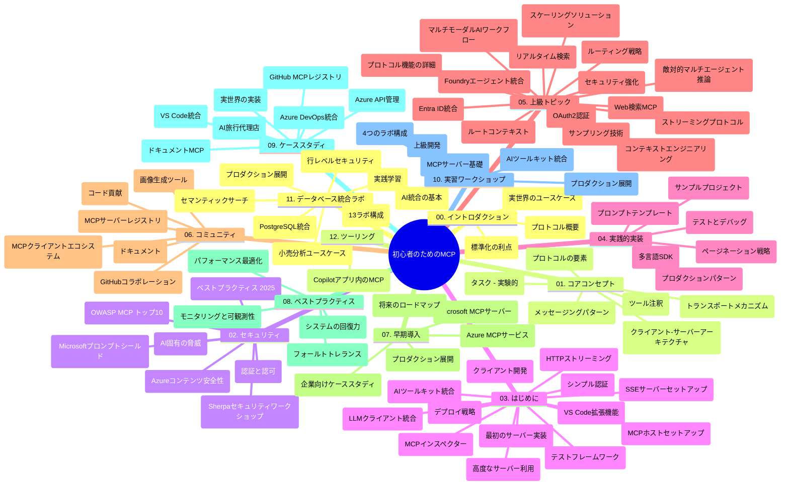

# 初心者向けモデルコンテキストプロトコル（MCP）学習ガイド

この学習ガイドは、「初心者向けモデルコンテキストプロトコル（MCP）」カリキュラムのリポジトリ構造と内容の概要を提供します。このガイドを使って効率的にリポジトリを探索し、利用可能なリソースを最大限に活用してください。

## リポジトリの概要

モデルコンテキストプロトコル（MCP）は、AIモデルとクライアントアプリケーション間のやり取りの標準化されたフレームワークです。元々はAnthropicによって作成され、その後公式GitHub組織を通じて広範なMCPコミュニティによって保守されています。このリポジトリは、AI開発者、システムアーキテクト、ソフトウェアエンジニア向けにC#、Java、JavaScript、Python、TypeScriptのハンズオンコード例を含む包括的なカリキュラムを提供します。

## ビジュアルカリキュラムマップ

## リポジトリ構造

リポジトリは12の主要なセクションに分かれており、それぞれがMCPの異なる側面に焦点を当てています：

1. **イントロダクション (00-Introduction/)**
   - モデルコンテキストプロトコルの概要
   - AIパイプラインにおける標準化の重要性
   - 実用的なユースケースと利点

2. **コアコンセプト (01-CoreConcepts/)**
   - クライアント・サーバーアーキテクチャ
   - 主要なプロトコルコンポーネント
   - MCPにおけるメッセージングパターン

3. **セキュリティ (02-Security/)**
   - MCPベースシステムのセキュリティ脅威
   - 実装を安全にするベストプラクティス
   - 認証と認可の戦略
   - <strong>包括的なセキュリティドキュメント</strong>：
     - MCPセキュリティベストプラクティス2025
     - Azureコンテンツセーフティ実装ガイド
     - MCPセキュリティコントロールと技術
     - MCPベストプラクティスクイックリファレンス
   - <strong>主要セキュリティトピック</strong>：
     - プロンプトインジェクションとツールポイズニング攻撃
     - セッションハイジャックと混乱する代理問題
     - トークンパススルーの脆弱性
     - 過剰な権限とアクセス制御
     - AIコンポーネントのサプライチェーンセキュリティ
     - Microsoftプロンプトシールド統合

4. **開始方法 (03-GettingStarted/)**
   - 環境設定および構成
   - 基本的なMCPサーバーとクライアントの作成
   - 既存アプリケーションとの統合
   - 含まれるセクション：
     - 初めてのサーバー実装
     - クライアント開発
     - LLMクライアント統合
     - VS Code統合
     - Server-Sent Events（SSE）サーバー
     - 高度なサーバー使用
     - HTTPストリーミング
     - AIツールキット統合
     - テスト戦略
     - デプロイメントガイドライン

5. **実践的な実装 (04-PracticalImplementation/)**
   - 様々なプログラミング言語でのSDK使用法
   - デバッグ、テスト、検証技術
   - 再利用可能なプロンプトテンプレートとワークフローの作成
   - 実装例を含むサンプルプロジェクト

6. **高度なトピック (05-AdvancedTopics/)**
   - コンテキストエンジニアリング技法
   - Foundryエージェント統合
   - マルチモーダルAIワークフロー
   - OAuth2認証デモ
   - リアルタイム検索機能
   - リアルタイムストリーミング
   - ルートコンテキストの実装
   - ルーティング戦略
   - サンプリング手法
   - スケーリングアプローチ
   - セキュリティ考慮事項
   - Entra IDセキュリティ統合
   - Web検索統合
   - 敵対的マルチエージェント推論（討論パターン）

7. **コミュニティ貢献 (06-CommunityContributions/)**
   - コードとドキュメントの貢献方法
   - GitHubを使ったコラボレーション
   - コミュニティ主導の拡張とフィードバック
   - 様々なMCPクライアントの利用法（Claude Desktop、Cline、VSCode）
   - 画像生成を含む人気のMCPサーバーとの連携

8. **早期採用からの教訓 (07-LessonsfromEarlyAdoption/)**
   - 実際の実装と成功事例
   - MCPベースソリューションの構築とデプロイメント
   - トレンドと将来のロードマップ
   - **Microsoft MCPサーバーガイド**：以下を含む10の本番対応Microsoft MCPサーバーの包括的ガイド：
     - Microsoft Learn Docs MCPサーバー
     - Azure MCPサーバー（15以上の専門コネクター）
     - GitHub MCPサーバー
     - Azure DevOps MCPサーバー
     - MarkItDown MCPサーバー
     - SQL Server MCPサーバー
     - Playwright MCPサーバー
     - Dev Box MCPサーバー
     - Microsoft Foundry MCPサーバー
     - Microsoft 365 Agents Toolkit MCPサーバー

9. **ベストプラクティス (08-BestPractices/)**
   - パフォーマンスチューニングと最適化
   - 障害耐性のあるMCPシステム設計
   - テストと回復力戦略

10. **ケーススタディ (09-CaseStudy/)**
    - <strong>7つの包括的なケーススタディ</strong>で多様なシナリオにおけるMCPの多様性を示す：
    - **Azure AIトラベルエージェント**：Azure OpenAIとAI Searchによるマルチエージェントオーケストレーション
    - **Azure DevOps統合**：YouTubeデータ更新のワークフロー自動化
    - <strong>リアルタイムドキュメント取得</strong>：PythonコンソールクライアントとHTTPストリーミング
    - <strong>インタラクティブ学習プランジェネレーター</strong>：Chainlitウェブアプリと会話型AI
    - <strong>エディター内ドキュメント</strong>：VS CodeとGitHub Copilotワークフローの統合
    - **Azure API Management**：エンタープライズAPI統合とMCPサーバー作成
    - **GitHub MCPレジストリ**：エコシステム開発とエージェント統合プラットフォーム
    - エンタープライズ統合、開発者生産性、エコシステム開発の実装例を網羅

11. **ハンズオンワークショップ (10-StreamliningAIWorkflowsBuildingAnMCPServerWithAIToolkit/)**
    - MCPとAIツールキットを組み合わせた総合的なハンズオンワークショップ
    - AIモデルと現実のツールを橋渡しするインテリジェントアプリケーション構築
    - 基礎、カスタムサーバー開発、本番デプロイメント戦略をカバーする実践モジュール
    - <strong>ラボ構成</strong>：
      - ラボ1: MCPサーバーの基本
      - ラボ2: 高度なMCPサーバー開発
      - ラボ3: AIツールキット統合
      - ラボ4: 本番デプロイメントとスケーリング
    - ステップバイステップのラボベース学習

12. **MCPサーバーデータベース統合ラボ (11-MCPServerHandsOnLabs/)**
    - PostgreSQL統合を伴う本番対応MCPサーバー構築のための13ラボからなる包括的学習コース
    - Zava Retailユースケースによる実世界小売分析の実装
    - 行レベルセキュリティ（RLS）、セマンティックサーチ、マルチテナントデータアクセスなどのエンタープライズグレードパターン
    - <strong>ラボ構成</strong>：
      - **ラボ00-03: 基礎** - 入門、アーキテクチャ、セキュリティ、環境設定
      - **ラボ04-06: MCPサーバー構築** - データベース設計、MCPサーバー実装、ツール開発
      - **ラボ07-09: 高度機能** - セマンティックサーチ、テスト＆デバッグ、VS Code統合
      - **ラボ10-12: 本番運用＆ベストプラクティス** - デプロイメント、監視、最適化
    - <strong>対象技術</strong>：FastMCPフレームワーク、PostgreSQL、Azure OpenAI、Azure Container Apps、Application Insights
    - <strong>学習成果</strong>：本番対応MCPサーバー、データベース統合パターン、AI駆動分析、エンタープライズセキュリティ

13. **ツール (12-tooling/)**
    - Copilotアプリやその他ツールでMCPの使い方を学ぶ

## 追加リソース

リポジトリには以下の補助リソースが含まれます：

- **Imagesフォルダー**：カリキュラム全体で使用される図解やイラスト
- <strong>翻訳</strong>：ドキュメントの自動翻訳を含む多言語対応
- **公式MCPリソース**：
  - [MCP Documentation](https://modelcontextprotocol.io/)
  - [MCP Specification](https://spec.modelcontextprotocol.io/)
  - [MCP GitHub Repository](https://github.com/modelcontextprotocol)

## このリポジトリの使い方

1. <strong>順序学習</strong>：「00」から「11」までの章を順にたどり、体系的に学習してください。
2. <strong>言語別フォーカス</strong>：興味のあるプログラミング言語のsamplesディレクトリを探索し、実装例を確認してください。
3. <strong>実践的な実装</strong>：「開始方法」セクションから始めて環境を設定し、最初のMCPサーバーとクライアントを作成しましょう。
4. <strong>高度な探索</strong>：基礎に慣れたら、高度なトピックに進んで知識を深めてください。
5. <strong>コミュニティ参加</strong>：GitHubディスカッションやDiscordチャンネルでMCPコミュニティに参加し、専門家や開発者同士で交流しましょう。

## MCPクライアントとツール

カリキュラムは様々なMCPクライアントとツールをカバーしています：

1. <strong>公式クライアント</strong>：
   - Visual Studio Code
   - Visual Studio Code内のMCP
   - Claude Desktop
   - VSCode内のClaude
   - Claude API

2. <strong>コミュニティクライアント</strong>：
   - Cline（ターミナルベース）
   - Cursor（コードエディター）
   - ChatMCP
   - Windsurf

3. **MCP管理ツール**：
   - MCP CLI
   - MCP Manager
   - MCP Linker
   - MCP Router

## 人気のMCPサーバー

リポジトリは様々なMCPサーバーを紹介しています：

1. **公式Microsoft MCPサーバー**：
   - Microsoft Learn Docs MCPサーバー
   - Azure MCPサーバー（15以上の専門コネクター）
   - GitHub MCPサーバー
   - Azure DevOps MCPサーバー
   - MarkItDown MCPサーバー
   - SQL Server MCPサーバー
   - Playwright MCPサーバー
   - Dev Box MCPサーバー
   - Microsoft Foundry MCPサーバー
   - Microsoft 365 Agents Toolkit MCPサーバー

2. <strong>公式リファレンスサーバー</strong>：
   - Filesystem
   - Fetch
   - Memory
   - Sequential Thinking

3. <strong>画像生成</strong>：
   - Azure OpenAI DALL-E 3
   - Stable Diffusion WebUI
   - Replicate

4. <strong>開発ツール</strong>：
   - Git MCP
   - Terminal Control
   - Code Assistant

5. <strong>専門サーバー</strong>：
   - Salesforce
   - Microsoft Teams
   - Jira & Confluence

## 貢献について

このリポジトリはコミュニティからの貢献を歓迎しています。MCPエコシステムに効果的に貢献する方法については、コミュニティ貢献セクションを参照してください。

----

*この学習ガイドは2026年2月5日に最新のMCP仕様2025-11-25を反映して更新されており、その時点でのリポジトリの概要を提供しています。以降リポジトリ内容は更新される可能性があります。*

---

<!-- CO-OP TRANSLATOR DISCLAIMER START -->
**免責事項**：
本書類は AI 翻訳サービス [Co-op Translator](https://github.com/Azure/co-op-translator) を使用して翻訳されています。正確性を期していますが、自動翻訳には誤りや不正確な部分が含まれる可能性があることをご承知おきください。原文の原語版が正式な情報源とみなされるべきです。重要な情報については、専門の人間による翻訳を推奨します。本翻訳の利用により生じたいかなる誤解や解釈違いについても、当方は責任を負いかねます。
<!-- CO-OP TRANSLATOR DISCLAIMER END -->