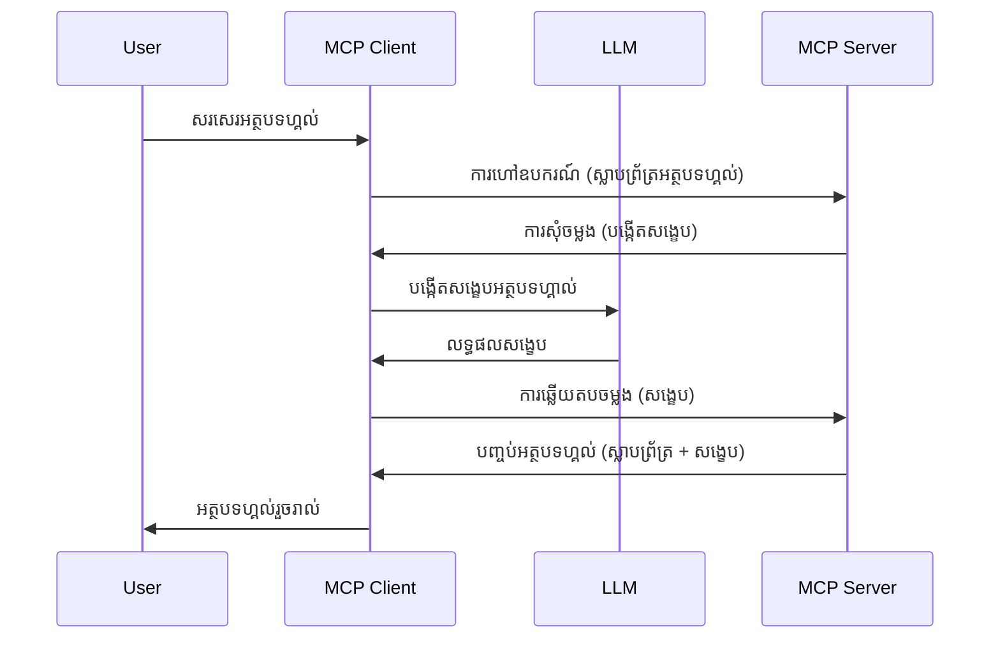

# ការគំរូ - ឱ្យមុខងារទៅ Client

ពេលខ្លះ អ្នកត្រូវការឱ្យ MCP Client និង MCP Server ប្រើរួមគ្នាដើម្បីសម្រេចបានគោលបំណងរួមមួយ។ អ្នកអាចមានករណីដែល Server ត្រូវការជំនួយពី LLM ដែលមាននៅលើ Client។ សម្រាប់ស្ថានការណ៍នេះ ការគំរូគឺជារឿងដែលអ្នកគួរប្រើ។

ណែនាំមកមើលករណីប្រើប្រាស់ខ្លះៗ ហើយរបៀបសាងសង់ដំណោះស្រាយដែលទាក់ទងនឹងការគំរូ។

## សេចក្ដីសង្ខេប

នៅមេរៀននេះ យើងផ្តោតលើការពន្យល់ពេលណា និងកន្លែងណាដែលគួរប្រើ Sampling និងរបៀបកំណត់វា។

## ផលបំណងរៀន

នៅជំពូកនេះ យើងនឹង:

- ពន្យល់ថា Sampling មានអ្វី និងពេលណាដែលគួរប្រើវា។
- បង្ហាញរបៀបកំណត់ Sampling នៅក្នុង MCP។
- ផ្តល់ឧទាហរណ៍នៃ Sampling ក្នុងសកម្មភាព។

## Sampling គឺជាអ្វី ហើយហេតុអ្វីបានប្រើវា?

Sampling គឺជាមុខងារខ្ពស់មួយ ដែលដំណើរការដោយរបៀបដូចតទៅ៖



### ពាក្យសុំ Sampling

ល្អហើយ ពេលនេះយើងមានទស្សនៈមួយដែលធំបំផុតនៃស្ថានការណ៍ដែលនិយមទុកចិត្តបាន មកនិយាយពីពាក្យសុំ sampling ដែល Server ផ្ញើត្រឡប់ទៅ Client។ វាងាយស្រួលមានរូបរាងដូចជា JSON-RPC:

```json
{
  "jsonrpc": "2.0",
  "id": 1,
  "method": "sampling/createMessage",
  "params": {
    "messages": [
      {
        "role": "user",
        "content": {
          "type": "text",
          "text": "Create a blog post summary of the following blog post: <BLOG POST>"
        }
      }
    ],
    "modelPreferences": {
      "hints": [
        {
          "name": "claude-3-sonnet"
        }
      ],
      "intelligencePriority": 0.8,
      "speedPriority": 0.5
    },
    "systemPrompt": "You are a helpful assistant.",
    "maxTokens": 100
  }
}
```

មានរឿងខ្លះៗដែលគួរឱ្យចាប់អារម្មណ៍៖

- Prompt នៅក្រោម content -> text គឺជាពាក្យបញ្ចូល ដែលជាណែនាំសម្រាប់ LLM ដើម្បីសង្ខេបមាតិកាប្លក់។

- **modelPreferences**. ផ្នែកនេះគឺជាការជ្រើសរើស មតិយោបល់អំពីរបៀបកំណត់ដែលគួរប្រើជាមួយ LLM។ អ្នកប្រើអាចជ្រើសរើសតាមមតិយោបល់នេះ ឬផ្លាស់ប្តូរតាមចិត្ត។ នៅប្រភេទនេះ មានយោបល់លើម៉ូដែលដែលគួរប្រើ និងលំដាប់សំខាន់លើល្បឿន និងមនុស្សប្រសិទ្ធភាព។
- **systemPrompt**, នេះជាពាក្យបញ្ចូលប្រព័ន្ធធម្មតារបស់អ្នកដែលផ្តល់បុគ្គលិកលក្ខណៈទៅ LLM របស់អ្នក និងមានការណែនាំ។
- **maxTokens**, គឺជាលក្ខណៈមួយដែលប្រើសម្រាប់បញ្ជាក់ពីចំនួនតុកិនដែលផ្ដល់ជូនសម្រាប់ភារកិច្ចនេះ។

### មតិស្នើ Sampling

មតិតបនេះគឺជាអ្វីដែល MCP Client ផ្ញើត្រឡប់ទៅ MCP Server ពីការហៅ LLM របស់ Client រង់ចាំមតិតបនិងបង្កើតសារនេះឡើងវិញ។ រូបរាងវាអាចមានទំរង់ JSON-RPC ដូចខាងក្រោម៖

```json
{
  "jsonrpc": "2.0",
  "id": 1,
  "result": {
    "role": "assistant",
    "content": {
      "type": "text",
      "text": "Here's your abstract <ABSTRACT>"
    },
    "model": "gpt-5",
    "stopReason": "endTurn"
  }
}
```

ចំណាំថាមតិតបគឺជាសេចក្ដីសង្ខេបនៃប្លក់ដូចដែលយើងបានស្នើ។ ប្រសិនបើសង្កេតមើលម៉ូដែលដែលប្រើជា "gpt-5" មិនមែនម៉ូដែលដែលយើងស្នើ "claude-3-sonnet" ទេ។ វាជាឱកាសបង្ហាញថាអ្នកប្រើអាចផ្លាស់ប្តូរតាមចិត្តរបស់ខ្លួន ហើយពាក្យសុំ sampling របស់អ្នកគឺជាការណែនាំ។

ល្អហើយ ឥឡូវយើងយល់ពីហ្វ្លូប្រើប្រាស់សំខាន់ និងភារកិច្ចដែលមានប្រយោជន៍សម្រាប់ "បង្កើតអត្ថបទប្លក់ + សង្ខេប" យោងទៅលើវា។

### ប្រភេទសារ

សារត្រូវបានគំរូមិនបានកំណត់ត្រឹមតែអក្សរប៉ុណ្ណោះទេ អ្នកអាចផ្ញើររូបភាព និងសំលេងបានផងដែរ។ របៀប JSON-RPC ចេញទៅផ្សេងគ្នា៖

**អក្សរ**

```json
{
  "type": "text",
  "text": "The message content"
}
```

**មាតិការូបភាព**

```json
{
  "type": "image",
  "data": "base64-encoded-image-data",
  "mimeType": "image/jpeg"
}
```

**មាតិកាសំលេង**

```json
{
  "type": "audio",
  "data": "base64-encoded-audio-data",
  "mimeType": "audio/wav"
}
```

> NOTE: សម្រាប់ព័ត៌មានលម្អិតបន្ថែមអំពី Sampling, សូមមើល [ឯកសារផ្លូវការណ៍](https://modelcontextprotocol.io/specification/2025-11-25/client/sampling)

## របៀបកំណត់ Sampling នៅ Client

> Note: ប្រសិនបើអ្នកកំពុងតែបង្កើតតែ Server ប៉ុណ្ណោះ អ្នកមិនចាំបាច់ធ្វើច្រើនខាងនេះទេ។

នៅ Client អ្នកត្រូវបញ្ជាក់មុខងារដូចខាងក្រោម៖

```json
{
  "capabilities": {
    "sampling": {}
  }
}
```

វានឹងត្រូវចាប់យកនៅពេល Client ដែលបានជ្រើសរើសផ្តើមជាមួយ Server។

## ឧទាហរណ៍ Sampling ក្នុងសកម្មភាព - បង្កើតអត្ថបទប្លក់

ចូរអ្នកបង្កើត Server sampling រួមគ្នា ដើម្បីធ្វើដូចតទៅ៖

1. បង្កើតឧបករណ៍នៅលើ Server។
1. ឧបករណ៍គួរបង្កើតពាក្យសុំ sampling។
1. ឧបករណ៍គួររំពឹងចម្លើយពីពាក្យសុំ sampling នៃ Client។
1. បន្ទាប់មកផលបច្ចេកទេសគួរត្រូវបានបង្កើតឡើង។

ចូរមើលកូដជារង្វង់៖

### -1- បង្កើតឧបករណ៍

**python**

```python
@mcp.tool()
async def create_blog(title: str, content: str, ctx: Context[ServerSession, None]) -> str:
    """Create a blog post and generate a summary"""

```

### -2- បង្កើតពាក្យសុំ sampling

បន្ថែមឧបករណ៍របស់អ្នកជាមួយកូដដូចខាងក្រោម៖

**python**

```python
post = BlogPost(
        id=len(posts) + 1,
        title=title,
        content=content,
        abstract=""
    )

prompt = f"Create an abstract of the following blog post: title: {title} and draft: {content} "

result = await ctx.session.create_message(
        messages=[
            SamplingMessage(
                role="user",
                content=TextContent(type="text", text=prompt),
            )
        ],
        max_tokens=100,
)

```

### -3- រំពឹងចម្លើយ និងត្រឡប់មតិតប

**python**

```python
post.abstract = result.content.text

posts.append(post)

# ត្រឡប់ផលិតផលពេញលេញ
return json.dumps({
    "id": post.title,
    "abstract": post.abstract
})
```

### -4- កូដពេញលេញ

**python**

```python
from starlette.applications import Starlette
from starlette.routing import Mount, Host

from mcp.server.fastmcp import Context, FastMCP

from mcp.server.session import ServerSession
from mcp.types import SamplingMessage, TextContent

import json


from uuid import uuid4
from typing import List
from pydantic import BaseModel


mcp = FastMCP("Blog post generator")

# app = FastAPI()

posts = []

class BlogPost(BaseModel):
    id: int
    title: str
    content: str
    abstract: str

posts: List[BlogPost] = []

@mcp.tool()
async def create_blog(title: str, content: str, ctx: Context[ServerSession, None]) -> str:
    """Create a blog post and generate a summary"""

    post = BlogPost(
        id=len(posts) + 1,
        title=title,
        content=content,
        abstract=""
    )

    prompt = f"Create an abstract of the following blog post: title: {title} and draft: {content} "

    result = await ctx.session.create_message(
        messages=[
            SamplingMessage(
                role="user",
                content=TextContent(type="text", text=prompt),
            )
        ],
        max_tokens=100,
    )

    post.abstract = result.content.text

    posts.append(post)

    # បង្រួបបង្រួមអត្ថបទប្លុកសរុប
    return json.dumps({
        "id": post.title,
        "abstract": post.abstract
    })

if __name__ == "__main__":
    print("Starting server...")
    # mcp.run()
    mcp.run(transport="streamable-http")

# រត់កម្មវិធីជាមួយ ៖ python server.py
```

### -5- សាកល្បងនៅ Visual Studio Code

ដើម្បីសាកល្បងក្នុង Visual Studio Code, ធ្វើដូចខាងក្រោម៖

1. ចាប់ផ្តើម server នៅ terminal
1. បន្ថែមវាលើ *mcp.json* (ហើយប្រាកដថាអ្នកបានចាប់ផ្តើមវា) ឧទាហរណ៍បែបនេះ៖

   ```json
   "servers": {
      "blog-server": {
        "type": "http",
        "url": "http://localhost:8000/mcp"
      }
   }
   ```

1. វាយ prompt:

   ```text
   create a blog post named "Where Python comes from", the content is "Python is actually named after Monty Python Flying Circus"
   ```

1. អនុញ្ញាតឱ្យ sampling ដំណើរការ។ ដំណើរការដំបូងដែលអ្នកសាកល្បង អ្នកនឹងបានបង្ហាញប្រអប់បន្ថែមមួយដែលអ្នកត្រូវយល់ព្រម បន្ទាប់ពីនោះអ្នកនឹងឃើញប្រអប់ធម្មតាសម្រាប់ស្នើឱ្យអ្នកដំណើរការ ឧបករណ៍មួយ។

1. ពិនិត្យលទ្ធផល។ អ្នកនឹងឃើញលទ្ធផលទាំងក្នុង GitHub Copilot Chat ដែលបង្ហាញយ៉ាងស្អាត និងមើល JSON របស់ចម្លើយដើមបានផងដែរ។

**Bonus**. tooling Visual Studio Code មានគាំទ្រល្អសម្រាប់ sampling។ អ្នកអាចកំណត់ការចូលប្រើ Sampling នៅ Server ដែលបានដំឡើង ដោយបើកថ្នាក់នេះ៖

1. ទៅផ្នែក extension។
1. ជ្រើសរើសរូបតំណាង cog សម្រាប់ Server ដែលបានដំឡើងនៅផ្នែក "MCP SERVERS - INSTALLED"។
1. ជ្រើស "Configure Model Access", នៅទីនេះ អ្នកអាចជ្រើសម៉ូដែលដែល GitHub Copilot អនុញ្ញាតឲ្យប្រើនៅពេលធ្វើ sampling។ អ្នកក៏អាចមើលពាក្យសុំ sampling ទាំងអស់ដែលបានប្រព្រឹត្តឡើងថ្មីៗដោយជ្រើស "Show Sampling requests"។

## កំណត់ការ

នៅក្នុងកំណត់ការនេះ អ្នកនឹងបង្កើត Sampling ប្រភេទខុសបន្តិចគ្នា ដែលគាំទ្រការបង្កើតពិពណ៌នាផលិតផល។ នេះជាស្ថានការណ៍របស់អ្នក៖

**ស្ថានការណ៍**: កម្មករស្នាក់នៅក្រោយការិយាល័យក្នុងអ៊ី-កម៉ែតត្រូវការជំនួយ វាចំណាយពេលយ៉ាងច្រើនក្នុងការបង្កើតពិពណ៌នាផលិតផល។ ដូចនេះ អ្នកត្រូវបង្កើតដំណោះស្រាយមួយ ដែលអាចហៅឧបករណ៍ "create_product" ជាមួយ "title" និង "keywords" ជាអាគុយម៉ង់ ហើយវាគួរអោយបញ្ចេញផលិតផលពេញលេញ ដែលមានវាល "description" ដែលគួរត្រូវបានបំពេញដោយ LLM របស់ Client ។

TIP: ប្រើអ្វីដែលអ្នកបានរៀនពីមុន ដើម្បីរចនាអ្នក Server និងឧបករណ៍វាជាមួយពាក្យសុំ sampling។

## ដំណោះស្រាយ

[Solution](./solution/README.md)

## ចំណុចសង្ខេប

Sampling គឺជាមុខងារដែលមានថាមពល ដែលអនុញ្ញាតឲ្យ Server ផ្ទេរភារកិច្ចទៅ Client ពេលវាត្រូវការជំនួយពី LLM។

## ពេលក្រោយ

- [ជំពូក ៤ - ការអនុវត្តជាក់ស្តែង](../../04-PracticalImplementation/README.md)

---

<!-- CO-OP TRANSLATOR DISCLAIMER START -->
**ការបដិសេធ**:
ឯកសារនេះត្រូវបានបម្លែងភាសា ដោយប្រើសេវាបម្លែងភាសា AI [Co-op Translator](https://github.com/Azure/co-op-translator)។ ទោះយើងខ្ញុំមានក្តីប្រាថ្នាឱ្យបានច្បាស់លាស់ តែសូមយល់ដឹងថាការបម្លែងដោយស្វ័យប្រវត្តិក៏អាចមានកំហុសឬភាពមិនត្រឹមត្រូវ។ ឯកសារដើមជាភាសាទីតាំងគួរត្រូវបានគេប្រើជាប្រភពច្បាស់លាស់។ សម្រាប់ព័ត៌មានសំខាន់ៗ សូមណែនាំឱ្យប្រើប្រាស់ការប្រែដោយមនុស្សជំនាញ។ យើងខ្ញុំមិនទទួលខុសត្រូវចំពោះការយល់ច្រឡំ ឬការបកស្រាយខុសបន្ទាប់ពីការប្រើប្រាស់ការបម្លែងនេះនោះទេ។
<!-- CO-OP TRANSLATOR DISCLAIMER END -->