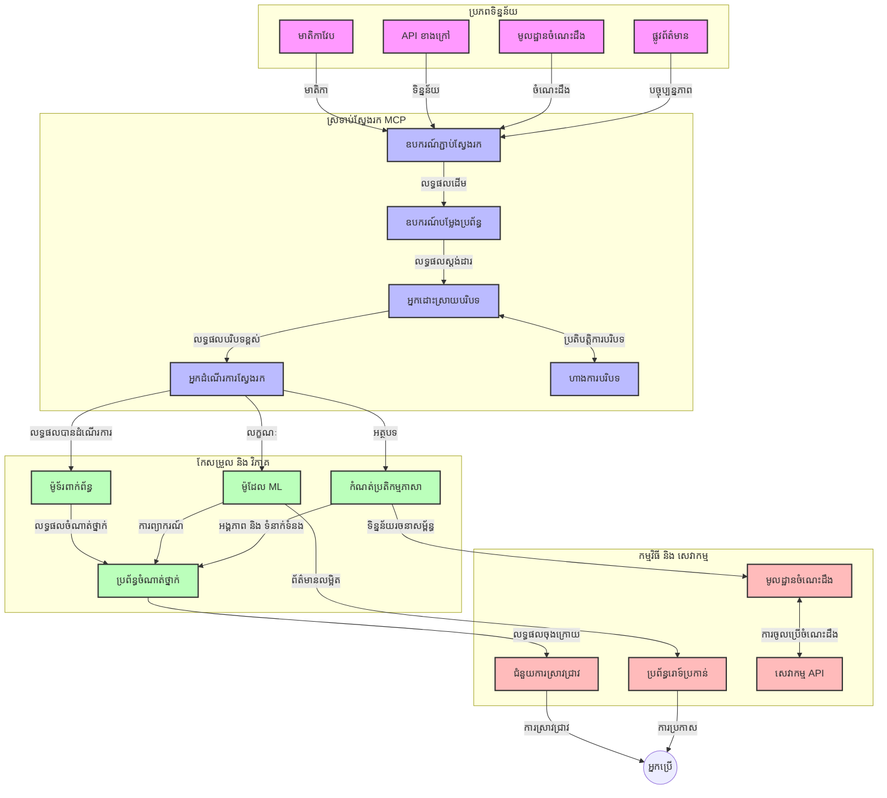
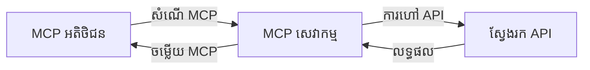
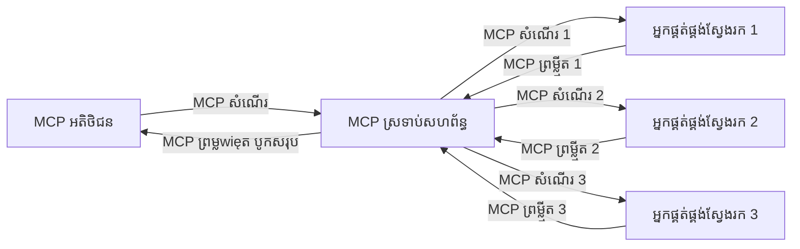
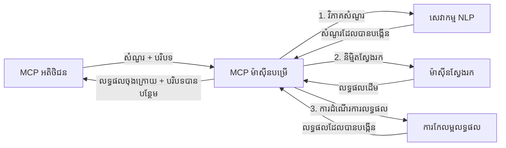

# ពិធីការបរិបទម៉ូដែលសម្រាប់ស្វែងរកវែបសម័យពេល​ពិត

## សេចក្ដីទូទៅ

ការស្វែងរកវែបសម័យពេល​ពិត ក្លាយជាកត្តាសំខាន់ក្នុងបរិបទព័ត៌មានបច្ចុប្បន្ន ដែលកម្មវិធីត្រូវមានការចូលដំណើរការព័ត៌មានទាន់សម័យភ្លាមៗពីអ៊ីនធឺណិត ដើម្បីផ្តល់ចម្លើយដែលមានភាពសមស្រប និងទាន់ពេល។ ពិធីការបរិបទម៉ូដែល (MCP) ជាការវឌ្ឍន៍សំខាន់ក្នុងការបង្កើនប្រសិទ្ធភាពនៃដំណើរការស្វែងរកពេលពិត ដោយបង្កើនប្រសិទ្ធភាពស្វែងរក រក្សាទុកបរិបទ និងធ្វើឱ្យសមត្ថភាពលោកប្រព័ន្ធមានភាពល្អប្រសើរឡើង។

ម៉ូឌុលនេះពិភាក្សាអំពីវិធីដែល MCP បំលែងដំណើរការស្វែងរកវែបពេលពិតដោយផ្តល់នូវវិធីសាស្រ្តស្តង់ដារសម្រាប់ការគ្រប់គ្រងបរិបទឆ្លងកាត់ម៉ូដែល AI ស្វែងរក និងកម្មវិធីផ្សេងៗ។

### អ្វីដែលអ្នកនឹងរៀន

ក្នុងមគ្គុទេសក៍នេះ អ្នកនឹងបានស្គាល់ពី៖

- របៀបដែល MCP បង្កើតស្ពានរលូនរវាងម៉ូដែល AI និងសមត្ថភាពស្វែងរកវែបពេលពិត
- លំនៃសំណង់សម្រាប់អនុវត្តដំណោះស្រាយស្វែងរកដែលមានប្រសិទ្ធភាព និងអាចពង្រីកបានជាមួយ MCP
- បច្ចេកទេសក្នុងការរក្សាទុកបរិបទស្វែងរកឆ្លងកាត់សំណួរនិងប្រតិកម្មជាច្រើន
- កូដអនុវត្តជាក់ លាក់នៅ Python និង JavaScript សម្រាប់ស្ថានការណ៍ស្វែងរកផ្សេងៗ
- វិធីសាស្ត្រដើម្បីតុល្យភាពរវាងភាពពាក់ព័ន្ធ ភាពទាន់សម័យ និងសមត្ថភាពក្នុងប្រព័ន្ធស្វែងរកដែលមាន MCP គ្រប់គ្រង

## ដំណើរការណែនាំស្វែងរកវែបពេលពិត

ការស្វែងរកវែបពេលពិតគឺជាវិធីសាស្ត្របច្ចេកវិទ្យាមួយ ដែលអនុញ្ញាតឱ្យមានការសួរសំណួរបន្ត ប្រែប្រួល និងវិភាគព័ត៌មានលើវែបទៅតាមពេលវេលាពេលដែលវាត្រូវបានបោះពុម្ពផ្សាយ ឬ ប្រែប្រួល ឲ្យប្រព័ន្ធអាចផ្តល់ព័ត៌មានថ្មី និងពាក់ព័ន្ធដោយមានពេលយឺតតិចបំផុត។ ខុសពីប្រព័ន្ធស្វែងរកបែបបុរាណដែលដំណើរការលើទិន្នន័យដែលត្រូវបានគេបញ្ចូលដើម្បីធ្វើស្វែងរកដែលអាចចាស់ជាងពីរម៉ោង ឬពីរថ្ងៃ ការស្វែងរកពេលពិតដំណើរការទិន្នន័យផ្ទាល់ពីវែបបណ្ដាញ ដើម្បីផ្តល់ជារបាយការណ៍ និងព័ត៌មានដែលបង្ហាញស្ថានភាពបច្ចុប្បន្នរបស់មាតិកា ដល់អ្នកប្រើ។

### ឯកសារណ៍សំខាន់នៃការស្វែងរកវែបពេលពិត៖

- **ការដំណើរការសំណួរបន្ត**: សំណួរស្វែងរកត្រូវបានដំណើរការប្រៀបធៀបទៅនឹងប្រភពទិន្នន័យដែលកំពុងធ្វើបច្ចុប្បន្នភាពរហួល
- **ការផ្តល់អាទិភាពទៅភាពទាន់សម័យ**: ប្រព័ន្ធបានរចនាធ្វើការផ្តល់អាទិភាពទៅព័ត៌មានថ្មីៗ
- **តុល្យភាពភាពពាក់ព័ន្ធ**: រក្សាទុកតុល្យការរវាងភាពពាក់ព័ន្ធ និងភាពទាន់សម័យ
- **សំណង់អាចពង្រីកបាន**: ប្រព័ន្ធត្រូវតែគ្រប់គ្រងទម្រង់សំណួរផ្សេងៗ និងបរិមាណទិន្នន័យដែលប្រែប្រួល
- **ការយល់ដឹងពីបរិបទ**: រក្សាភាពសម្រួលនៃបរិបទអ្នកប្រើឲ្យបានជាប់លាប់ក្នុងដំណើរការស្វែងរក
- **ការផ្លាស់ប្តូរសំណួរដោយចលនា**: ការកែប្រែសំណួរដោយផ្អែកលើបរិបទ និងលទ្ធផលមុនៗ
- **ការរួមបញ្ចូលប្រភពច្រើន**: ផ្គុំលទ្ធផលមកពីអ្នកផ្គត់ផ្គង់ស្វែងរក និងប្រភពវែបប្រែប្រួល
- **ការយល់ដឹងអត្ថន័យ**: ដំណើរការសំណួរនិងមាតិកាប្រកបដោយន័យជាងការប្រើពាក្យគន្លងតែក្នុងសំណួរ
- **ចំណាត់ថ្នាក់ពេលពិត**: កែប្រែចំណាត់ថ្នាក់លទ្ធផលជារឿយៗពេលមានព័ត៌មានថ្មីចូលមក

### ពិធីការបរិបទម៉ូដែល និងការស្វែងរកវែបពេលពិត

ពិធីការបរិបទម៉ូដែល (MCP) ជួយដោះស្រាយបញ្ហាសំខាន់ៗក្នុងបរិបទស្វែងរកវែបពេលពិតៈ

1. **ការរក្សាទុកបរិបទស្វែងរក**: MCP កំណត់របៀបស្តង់ដារសម្រាប់ការរក្សាគុណភាពបរិបទឆ្លងកាត់សមាសធាតុស្វែងរកចម្រុះ ដើម្បីធានាថាម៉ូដែល AI និងចំណុចដំណើរការ មានចូលដំណើរការត្រឹមត្រូវនិងចូលចិត្តសំណួរពាក់ព័ន្ធនិងមតិអ្នកប្រើ។

2. **ការគ្រប់គ្រងសំណួរឥតកំហែង**: ដោយផ្តល់ធម្មនុញ្ញដើម្បីផ្ទឹកបរិបទ ខណៈពេលតម្រូវការស្វែងរក MCPកាត់បន្ថយចំនួនការផ្ទេរបរិបទម្តងម្ដងក្នុងដំណើរការស្វែងរក។

3. **ភាពអាចរួមគ្នារបស់ប្រព័ន្ធ**: MCP បង្កើតភាសារួមសម្រាប់ការចែករំលែកបរិបទរវាងបច្ចេកវិទ្យាស្វែងរកនានា និងម៉ូដែល AI ដែលអាចអនុញ្ញាតឲ្យសំណង់មានភាពបត់បែន ហើយអាចពង្រីកបាន។

4. **បរិបទដែលអាចស្វែងរកបានល្អ**: អ្នកអាចផ្តោតពាក់ព័ន្ធលើធាតុបរិបទណាដែលមានប្រយោជន៍បំផុតសម្រាប់ស្វែងរកដើម្បីបង្កើនទាំងសមត្ថភាព និងភាពត្រឹមត្រូវ។

5. **ដំណើរការស្វែងរកត្រឹមត្រូវតាមបរិបទ**: ដោយគ្រប់គ្រងបរិបទត្រឹមត្រូវ តាម MCP ប្រព័ន្ធស្វែងរកអាចធ្វើការកែប្រែដំណើរការតាមតម្រូវការអ្នកប្រើ និងបរិបទព័ត៌មានផ្ទាល់ខ្លួន។

នៅក្នុងកម្មវិធីទំនើបចាប់ពីប្រមូលព័ត៌មានលម្អិតទៅជំនួយការស្រាវជ្រាវ ការរួមបញ្ចូល MCP ជាមួយបច្ចេកវិទ្យាស្វែងរកវែបអាចធ្វើឲ្យមានការស្វែងរកដែលនៅលើផ្ទៃនៃបរិបទ ឆ្លើយតបបានច្រើននិងមានភាពពាក់ព័ន្ធខ្លាំងឡើង។

## គោលដៅរៀន

ចុងបញ្ចប់មេរៀននេះ អ្នកនឹងអាច៖

- យល់ដឹងពីមូលដ្ឋាន និងបញ្ហានៃការស្វែងរកវែបពេលពិតនៅកម្មវិធីទំនើប
- ពន្យល់ពីរបៀបដែល MCP បង្កើនសមត្ថភាពស្វែងរកវែបពេលពិត
- អនុវត្តដំណោះស្រាយស្វែងរកដោយផ្អែកលើ MCP ជាមួយបណ្ដុំប្លែតផែននិង API ពេញនិយម
- គូសច្នៃលំនៃសំណង់ស្វែងរកដែលមានប្រសិទ្ធភាពខ្ពស់ និងអាចពង្រីកជាមួយ MCP
- អនុវត្តកំណត់ MCP ទៅករណីប្រើប្រាស់ជាច្រើន រួមទាំងស្វែងរកអត្ថន័យ ជំនួយការស្រាវជ្រាវ និងការរុករកបន្ថែមដោយ AI
- វាយតម្លៃនិន្នាការខាងមុខ និងការបង្កើតថ្មីៗក្នុងបច្ចេកវិទ្យាស្វែងរកដោយផ្អែកលើ MCP
- អភិវឌ្ឍប្រព័ន្ធស្វែងរកដែលមានចំណេះដឹងពីបរិបទ និងរៀនពីប្រតិកម្មអ្នកប្រើ
- ចងក្រងសមត្ថភាពស្វែងរកវែបចូលទៅក្នុងជំនួយការដោយ AI តាមរយៈពិធីការមានស្តង់ដារ MCP
- បង្កើតបណ្តាញស្វែងរកជាច្រើនជំហាន ដែលលទ្ធផលត្រូវបង្កប់បន្ដតាមបរិបទ​
- បង្កើនប្រសិទ្ធភាពស្វែងរក ខណៈរក្សាទុកការយល់ដឹងបរិបទពេញលេញ​

### ការបកស្រាយ និងសារៈសំខាន់

ការស្វែងរកវែបពេលពិតពាក់ព័ន្ធនឹងការសួរសំណួរបន្ត ការទាញយក និងការផ្តល់ព័ត៌មានពីវែបដោយយឺតតិចបំផុត។ ខុសពីប្រព័ន្ធស្វែងរកបែបចាស់ដែលពិនិត្យមើល និងបង្កើតតារាងពាក្យសម្ងាត់ជាបន្តបន្ទាប់ ការស្វែងរកវែបពេលពិតលើកលែងព័ត៌មានតែពេលវាលេចេញ ហើយអាចចូលដំណើរការបានភ្លាមៗទៅលើមាតិកាថ្មីបំផុត។

លក្ខណៈសម្បត្តិបំផុតនៃការស្វែងរកវែបពេលពិតរួមមាន៖

- **ភាពទាន់សម័យ**: ផ្តល់អាទិភាពទៅមាតិកាថ្មី និងបច្ចុប្បន្នភាព
- **ដំណើរការបន្ត**: ត្រួតពិនិត្យព័ត៌មានថ្មីជាបន្តបន្ទាប់
- **ការប្រែប្រួលសំណួរ**: កែប្រែសំណួរតាមបរិបទ និងមតិយោបល់
- **ការផ្តល់ជាន់ឥតយឺត**: ផ្តល់លទ្ធផលស្វែងរកដោយពេលយឺតតិច
- **ការរក្សាបរិបទ**: សាងសង់លើសំណួรมុនមុនសម្រាប់ភាពពាក់ព័ន្ធល្អប្រសើរឡើង

### បញ្ហានៅការស្វែងរកវែបបែបបុរាណ

វិធីសាស្ត្រស្វែងរកវែបបែបបុរាណប្រឈមមុខនឹងកំណត់កំហិតខ្លះៗនៅពេលអនុវត្តក្នុងស្ថានភាពពេលពិត៖

1. **ការបែកបាក់បរិបទ**: ការលំបាកក្នុងការរក្សាបរិបទស្វែងរកឲ្យជាប់លាប់ក្នុងចន្លោះសំណួរច្រើន
2. **ភាពទាន់សម័យពត៌មាន**: ការលំបាកក្នុងការចូលដំណើរការនិងផ្តល់អាទិភាពទៅព័ត៌មានថ្មីបំផុត
3. **ភាពស្មុគស្មាញក្នុងការរួមបញ្ចូល**: បញ្ហានៃការរួមបញ្ចូលរវាងប្រព័ន្ធស្វែងរក និងកម្មវិធីផ្សេងៗ
4. **បញ្ហាពេលយឺត**: តុល្យភាពរវាងការស្វែងរកទូលំទូលាយ និងពេលឆ្លើយតប
5. **ការកែតម្រូវភាពពាក់ព័ន្ធ**: ប្រាកដថាត្រឹមត្រូវ និងពាក់ព័ន្ធ ខណៈផ្តល់អាទិភាពទៅភាពទាន់សម័យ

## យល់ដឹងពីពិធីការបរិបទម៉ូដែល (MCP) សម្រាប់ការស្វែងរក

### MCP ជាអ្វីនៅក្នុងបរិបទស្វែងរក?

ពិធីការបរិបទម៉ូដែល (MCP) គឺជាពិធីការទំនាក់ទំនងស្តង់ដារ ត្រូវបានរចនាឡើងដើម្បីជួយឱ្យមានការទំនាក់ទំនងដែលមានប្រសិទ្ធិភាពរវាងម៉ូដែល AI និងកម្មវិធី។ ក្នុងបរិបទស្វែងរកវែបពេលពិត MCP ផ្តល់រចនាសម្ព័ន្ធសម្រាប់៖

- រក្សាបរិបទស្វែងរកក្នុងសំណុំសំណួរ
- ស្តង់ដាររចនាសំណួរ និងទ្រង់ទ្រាយលទ្ធផលស្វែងរក
- បង្កើនប្រសិទ្ធភាពក្នុងការផ្ទេរព័ត៌មានស្វែងរក និងលទ្ធផល
- បង្កើនការទំនាក់ទំនងរវាងម៉ូដែល និងម៉ាស៊ីនស្វែងរក

### សមាសធាតុសំខាន់ និងសំណង់

សំណង់ MCP សម្រាប់ស្វែងរកវែបពេលពិតមានសមាសធាតុសំខាន់ៗ៖

1. **អ្នកគ្រប់គ្រងបរិបទសំណួរ**: គ្រប់គ្រង និងរក្សាបរិបទស្វែងរកឆ្លងកាត់សំណួរច្រើន
2. **កម្មវិធីដំណើរការស្វែងរក**: ដំណើរការសំណើរស្វែងរកចូលដោយបច្ចេកទេសយល់ដឹងពីបរិបទ
3. **ឧបករណ៍បំលែងពិធីការ**: បំលែងរវាង API ស្វែងរកផ្សេងៗជាមួយការរក្សាបរិបទ
4. **ឃ្លាំងបរិបទ**: ដាក់ស្តុក និងយករឿងរ៉ាវស្វែងរក និងចំណូលចិត្ត
5. **ការតភ្ជាប់ស្វែងរក**: តភ្ជាប់ទៅម៉ាស៊ីនស្វែងរក និង API វែបផ្សេងៗ



### របៀបដែល MCP បង្កើនស្វែងរកវែបពេលពិត

MCP ដោះស្រាយបញ្ហាបែបបុរាណដោយ៖

- **ភាពបន្តបញ្ចូលបរិបទ**: រក្សាទំនាក់ទំនងរវាងសំណួរនានានៅក្នុងវគ្គស្វែងរកមួយសរុប
- **ការផ្ទេរដែលឆ្លាតវៃ**: កាត់បន្ថយការចំទាស់នៅក្នុងប៉ារ៉ាម៉ែត្រស្វែងរកតាមរយៈការគ្រប់គ្រងបរិបទយ៉ាងមានប្រសិទ្ធភាព
- **ច្រកចេញស្តង់ដារ**: ផ្តល់ API មានសំណុំដូចគ្នាសម្រាប់សមាសធាតុស្វែងរក
- **កាត់បន្ថយពេលយឺត**: បន្ថយភារកិច្ចដំណើរការដោយគ្រប់គ្រងបរិបទបានល្អ
- **ការកែលម្អភាពពាក់ព័ន្ធ**: បង្កើនភាពពាក់ព័ន្ធដោយបានរក្សាចេតនា​អ្នកប្រើឲ្យបានឆាប់ចូលចិត្តក្នុងចន្លោះសំណួរច្រើន

## ការរួមបញ្ចូល និងការអនុវត្ត

ប្រព័ន្ធស្វែងរកវែបពេលពិតត្រូវការការរចនាសំណង់ និងអនុវត្តយ៉ាងល្អ ដើម្បីរក្សាទាំងប្រសិទ្ធភាព និងភាពត្រឹមត្រូវរបស់បរិបទ។ ពិធីការបរិបទម៉ូដែលផ្តល់វិធីស្តង់ដារពន្យល់ពីការរួមបញ្ចូលម៉ូដែល AI និងបច្ចេកវិទ្យាស្វែងរក ដើម្បីបង្កើតបណ្ដាញស្វែងរកមានសមត្ថភាព និងយល់ដឹងពីបរិបទ។

### សេចក្ដីសង្ខេបពីការរួមបញ្ចូល MCP នៅក្នុងសំណង់ស្វែងរក

ការអនុវត្ត MCP ក្នុងបរិបទស្វែងរកវែបពេលពិតចូលរួមមានចំណុចដែលត្រូវពិចារណា៖

1. **ការតម្រៀបបរិបទសំណួរ**: MCP ផ្តល់វិធីសាស្ត្រចំណេញសម្រាប់បង្រួមកំណត់បរិបទក្នុងសំណើស្វែងរក ដើម្បីធានាថាបរិបទសំខាន់ត្រូវបានគេដឹកជញ្ជូនឆ្លងកាត់ដំណើរការស្វែងរក មិនខកខាន ទាំងនៅក្នុងទ្រង់ទ្រាយស្តង់ដារដែលប្រើសម្រាប់គ្រប់គ្រងពត៌មានពាក់ព័ន្ធ។

2. **ដំណើរការស្វែងរកមានស្ថានភាព**: MCP អាចជួយបង្កើតដំណើរការដែលយល់ពីស្ថានភាពតាមការរក្សាបរិបទឲ្យជាប់លាប់រវាងវគ្គស្វែងរក។ វាពិសេសសម្រាប់បណ្តាញស្វែងរកច្រើនជំហានដែលបរិបទបានកែលម្អលទ្ធផល។

3. **ពង្រីក និងកែលម្អសំណួរ**: អនុវត្ត MCP អាចជួយបង្កើតដំណោះស្រាយពង្រីកសំណួរ និងកែតម្រូវសំណួរតាមរយៈបរិបទដែលបានផ្ទុកជាសំណុំ ជួយឲ្យបានលទ្ធផលមានភាពពាក់ព័ន្ធបន្ថែម។

4. **ផ្ទុកតាមដំណើរ និងផ្តល់អាទិភាពលទ្ធផល**: ការគ្រប់គ្រងបរិបទតាមស្តង់ដារ MCP ជួយគ្រប់គ្រងការផ្ទុកលទ្ធផល និងការផ្តល់អាទិភាព ដើម្បីឲ្យសមាសធាតុអាចបត់បែនទៅតាមបរិបទកំពុងអភិវឌ្ឍ។

5. **ការបោះពុម្ពផ្សាយស្វែងរកគ្នា និងការបញ្ចូលផ្សេងៗ**: MCP ជួយផ្តល់ភាពស៊ីជម្រៅក្នុងការចែកចាយស្វែងរកដោយអនុញ្ញាតឲ្យចំណុចស្វែងរកច្រើនបញ្ចូលគ្នា ជាមួយសំណង់បរិបទ ដែលអាចអោយមានសេចក្ដីរួមគ្នានៅលទ្ធផលពីប្រភពផ្សេងៗ។

ការអនុវត្ត MCP លើបច្ចេកវិទ្យាស្វែងរកផ្សេងៗ បង្កើតវិធីសាស្រ្តតែមួយសម្រាប់គ្រប់គ្រងបរិបទ កាត់បន្ថយការរួមបញ្ចូលដែលតម្រូវការកូដពិសេស ខណៈបង្កើនសមត្ថភាពក្នុងការរក្សាៈបរិបទមានន័យនៅពេលសំណួរស្វែងរកកំពុងបន្តផ្លាស់ប្តូរ។

### MCP នៅក្នុងការអនុវត្តស្វែងរកវែបផ្សេងៗ

ឧទាហរណ៍ទាំងនេះតាមតម្រូវ MCP បច្ចុប្បន្នដែលផ្អែកលើពិធីការប្រាស្រ័យទំនាក់ទំនង JSON-RPC ជាមួយវិធីដឹកជញ្ជូនច្បាស់លាស់។ កូដបង្ហាញពីរបៀបដែលអ្នកអាចអនុវត្តការរួមបញ្ចូលស្វែងរកដោយផ្ទាល់ខ្លួន ខណៈរក្សាសមត្ថភាពតាមពិធីការ MCP។

<details>
<summary>ការអនុវត្ត Python ជាមួយ Generic Search API</summary>

```python
import asyncio
import json
import aiohttp
from typing import Dict, Any, Optional, List
from contextlib import asynccontextmanager
from collections.abc import AsyncIterator

# អ្នកនាំចូលបណ្ណាល័យ MCP ស្តង់ដារ
from mcp.client.session import ClientSession
from mcp.client.streamable_http import streamablehttp_client
from mcp.types import TextContent, CreateMessageRequestParams, CreateMessageResult
from mcp.server.fastmcp import FastMCP

# បង្កើតម៉ាស៊ីនបម្រើ FastMCP សម្រាប់ការស្វែងរកបណ្ដាញ
search_server = FastMCP("WebSearch")

# ថ្នាក់សម្រាប់គ្រប់គ្រងប្រតិបត្តិការ ស្វែងរកបណ្ដាញ
class WebSearchHandler:
    def __init__(self, api_endpoint: str, api_key: str):
        self.api_endpoint = api_endpoint
        self.api_key = api_key
        self.session = None
        
    async def initialize(self):
        """Initialize the HTTP session"""
        self.session = aiohttp.ClientSession(
            headers={"Authorization": f"Bearer {self.api_key}"}
        )
    
    async def close(self):
        """Close the HTTP session"""
        if self.session:
            await self.session.close()
            
    async def perform_search(self, query: str, max_results: int = 5, 
                           include_domains: List[str] = None, 
                           exclude_domains: List[str] = None,
                           time_period: str = "any") -> Dict[str, Any]:
        """Perform web search using the search API"""
        # សមាសធាតុប៉ារ៉ាម៉ែត្រស្វែងរក
        search_params = {
            "q": query,
            "limit": max_results,
            "time": time_period
        }
        
        if include_domains:
            search_params["site"] = ",".join(include_domains)
            
        if exclude_domains:
            search_params["exclude_site"] = ",".join(exclude_domains)
        
        # ប្រតិបត្តិការសំណើស្វែងរក
        try:
            async with self.session.get(
                self.api_endpoint,
                params=search_params
            ) as response:
                if response.status != 200:
                    error_text = await response.text()
                    raise Exception(f"Search API error: {response.status} - {error_text}")
                
                search_data = await response.json()
                
                # បម្លែងចម្លើយ API ជាបទគមន៍ស្តង់ដារ
                results = []
                for item in search_data.get("results", []):
                    results.append({
                        "title": item.get("title", ""),
                        "url": item.get("url", ""),
                        "snippet": item.get("snippet", ""),
                        "date": item.get("published_date", ""),
                        "source": item.get("source", "")
                    })
                
                return {
                    "query": query,
                    "totalResults": len(results),
                    "results": results
                }
        except Exception as e:
            print(f"Search API request error: {e}")
            raise

# ចាប់ផ្តើមអ្នកគ្រប់គ្រងស្វែងរក
search_handler = WebSearchHandler(
    api_endpoint="https://api.search-service.example/search",
    api_key="your-api-key-here"
)

# កំណត់អាយុកាលដើម្បីគ្រប់គ្រងអ្នកគ្រប់គ្រងស្វែងរក
@asyncio.asynccontextmanager
async def app_lifespan(server: FastMCP):
    """Manage application lifecycle"""
    await search_handler.initialize()
    try:
        yield {"search_handler": search_handler}
    finally:
        await search_handler.close()

# កំណត់អាយុកាលសម្រាប់ម៉ាស៊ីនបម្រើ
search_server = FastMCP("WebSearch", lifespan=app_lifespan)

# ចុះបញ្ជីឧបករណ៍ស្វែងរកបណ្ដាញ
@search_server.tool()
async def web_search(query: str, max_results: int = 5, 
                   include_domains: List[str] = None,
                   exclude_domains: List[str] = None,
                   time_period: str = "any") -> Dict[str, Any]:
    """
    Search the web for information
    
    Args:
        query: The search query
        max_results: Maximum number of results to return (default: 5)
        include_domains: List of domains to include in search results
        exclude_domains: List of domains to exclude from search results
        time_period: Time period for results ("day", "week", "month", "any")
        
    Returns:
        Dictionary containing search results
    """
    ctx = search_server.get_context()
    search_handler = ctx.request_context.lifespan_context["search_handler"]
    
    results = await search_handler.perform_search(
        query=query,
        max_results=max_results,
        include_domains=include_domains,
        exclude_domains=exclude_domains,
        time_period=time_period
    )
    
    return results

# ឧទាហរណ៍ការប្រើប្រាស់អតិថិជន
async def client_example():
    # តភ្ជាប់ទៅម៉ាស៊ីនបម្រើស្វែងរកជាមួយការដឹកជញ្ជូន HTTP ដែលអាចចាក់ឱ្យបន្តស្ទ្រីមបាន
    async with streamablehttp_client("http://localhost:8000/mcp") as (read, write, _):
        async with ClientSession(read, write) as session:
            # ចាប់ផ្តើមការតភ្ជាប់
            await session.initialize()
            
            # ហៅឧបករណ៍ web_search
            search_results = await session.call_tool(
                "web_search", 
                {
                    "query": "latest developments in AI and Model Context Protocol",
                    "max_results": 5,
                    "time_period": "day",
                    "include_domains": ["github.com", "microsoft.com"]
                }
            )
            
            print(f"Search results: {search_results}")

# ឧទាហរណ៍ការប្រតិបត្តិម៉ាស៊ីនបម្រើ
if __name__ == "__main__":
    # រត់ម៉ាស៊ីនបម្រើជាមួយការដឹកជញ្ជូន HTTP ដែលអាចចាក់ឱ្យបន្តស្ទ្រីមបាន
    search_server.run(transport="streamable-http")
```
</details> 

<details>
<summary>ការអនុវត្ត JavaScript ជាមួយការស្វែងរកតាមកម្មវិធីរុករក</summary>

```javascript
// ការអនុវត្តម៉ាស៊ីនបម្រើ MCP សម្រាប់ការស្វែងរកបណ្ដាញ
import { McpServer, ResourceTemplate } from '@modelcontextprotocol/sdk/server/mcp.js';
import { StreamableHTTPServerTransport } from '@modelcontextprotocol/sdk/server/streamableHttp.js';
import { z } from 'zod';

// បង្កើតម៉ាស៊ីនបម្រើ MCP សម្រាប់ការស្វែងរកបណ្ដាញ
const searchServer = new McpServer({
    name: "BrowserSearch",
    description: "A server that provides web search capabilities"
});

// ថ្នាក់សេវាកម្មស្វែងរក
class SearchService {
    constructor(searchApiUrl, apiKey) {
        this.searchApiUrl = searchApiUrl;
        this.apiKey = apiKey;
    }

    async performSearch(parameters) {
        const {
            query = '',
            maxResults = 5,
            includeDomains = [],
            excludeDomains = [],
            timePeriod = 'any'
        } = parameters;
        
        // បង្កើត URL ស្វែងរកជាមួយប៉ារ៉ាមែត្រ
        const url = new URL(this.searchApiUrl);
        url.searchParams.append('q', query);
        url.searchParams.append('limit', maxResults);
        url.searchParams.append('time', timePeriod);
        
        if (includeDomains.length > 0) {
            url.searchParams.append('site', includeDomains.join(','));
        }
        
        if (excludeDomains.length > 0) {
            url.searchParams.append('exclude_site', excludeDomains.join(','));
        }
        
        try {
            const response = await fetch(url.toString(), {
                method: 'GET',
                headers: {
                    'Authorization': `Bearer ${this.apiKey}`,
                    'Content-Type': 'application/json'
                }
            });
            
            if (!response.ok) {
                const errorText = await response.text();
                throw new Error(`Search API error: ${response.status} - ${errorText}`);
            }
            
            const searchData = await response.json();
            
            // បម្លែងប្រតិបត្ដិ API ជាទ្រង់ទ្រាយស្តង់ដារ
            const results = searchData.results?.map(item => ({
                title: item.title || '',
                url: item.url || '',
                snippet: item.snippet || '',
                date: item.published_date || '',
                source: item.source || ''
            })) || [];
            
            return {
                query,
                totalResults: results.length,
                results
            };
        } catch (error) {
            console.error('Search API request error:', error);
            throw error;
        }
    }
}

// ចាប់ផ្តើមសេវាកម្មស្វែងរក
const searchService = new SearchService(
    'https://api.search-service.example/search',
    'your-api-key-here'
);

// តំឡើងអ្នកផ្គត់ផ្គង់បរិបទសម្រាប់ម៉ាស៊ីនបម្រើ
searchServer.setContextProvider(() => {
    return {
        searchService
    };
});

// ចុះបញ្ជីឧបករណ៍ស្វែងរកបណ្ដាញ
searchServer.tool({
    name: 'web_search',
    description: 'Search the web for information',
    parameters: {
        type: 'object',
        properties: {
            query: {
                type: 'string',
                description: 'The search query'
            },
            maxResults: {
                type: 'integer',
                description: 'Maximum number of results to return',
                default: 5
            },
            includeDomains: {
                type: 'array',
                items: { type: 'string' },
                description: 'List of domains to include in search results'
            },
            excludeDomains: {
                type: 'array',
                items: { type: 'string' },
                description: 'List of domains to exclude from search results'
            },
            timePeriod: {
                type: 'string',
                description: 'Time period for results',
                enum: ['day', 'week', 'month', 'any'],
                default: 'any'
            }
        },
        required: ['query']
    },
    handler: async (params, context) => {
        const { searchService } = context;
        return await searchService.performSearch(params);
    }
});

// គំរូកូដអ្នកប្រើដើម្បីភ្ជាប់ទៅម៉ាស៊ីនបម្រើស្វែងរក
import { Client } from '@modelcontextprotocol/sdk/client/index.js';
import { StreamableHTTPClientTransport } from '@modelcontextprotocol/sdk/client/streamableHttp.js';

async function connectToSearchServer() {
    // ភ្ជាប់ទៅម៉ាស៊ីនបម្រើស្វែងរក
    const transport = new StreamableHTTPClientTransport(
        new URL('http://localhost:8000/mcp')
    );
    
    const client = new Client({
        name: 'search-client',
        version: '1.0.0'
    });
    
    await client.connect(transport);
    
    // ដំណើរការ​ឧបករណ៍ស្វែងរក
    const searchResults = await client.callTool({
        name: 'web_search',
        arguments: {
            query: 'Model Context Protocol implementation examples',
            maxResults: 10,
            timePeriod: 'week',
            includeDomains: ['github.com', 'docs.microsoft.com']
        }
    });
    
    console.log('Search results:', searchResults);
    
    // សម្អាត
    await client.disconnect();
}

// ចាប់ផ្តើមម៉ាស៊ីនបម្រើ
const transport = new StreamableHTTPServerTransport();
await searchServer.connect(transport);
console.log('Search server running at http://localhost:8000/mcp');

// ក្នុងដំណើរការផ្សេង ឬ បន្ទាប់ពីម៉ាស៊ីនបម្រើបានចាប់ផ្តើម
// connectToSearchServer().catch(console.error);
```
</details> 

## ការពិពណ៌នាឧទាហរណ៍កូដ

> **សម្គាល់សំខាន់**: ឧទាហរណ៍កូដខាងក្រោម បង្ហាញពីការរួមបញ្ចូល MCP ជាមួយសមត្ថភាពស្វែងរកវែប។ ទោះបីជាច្បាស់ថាពួកវាដើរតួជាគំរូតាមសំណុំ MCP SDK ផ្លូវការ ប៉ុន្តែបានសម្រួលសម្រាប់គោលបំណងសិក្សា។
> 
> ឧទាហរណ៍បង្ហាញ៖
> 
> 1. **ការអនុវត្ត Python**: ឧទាហរណ៍បើកដំណើរការ FastMCP ដែលផ្តល់ឧបករណ៍ស្វែងរកពីរនិងភ្ជាប់ API ពីក្រៅ។ ឧទាហរណ៍នេះបង្ហាញពីគ្រប់គ្រងអាយុកាលបានត្រឹមត្រូវ ការគ្រប់គ្រងបរិបទ និងការអនុវត្តឧបករណ៍តាមលំនាំ MCP Python SDK ផ្លូវការ។ ម៉ាស៊ីនបម្រើប្រើវិធីដឹកជញ្ជូន Streamable HTTP ដែលបានស្តារឡើងវិញពី SSE សម្រាប់ធ្វើការផ្គត់ផ្គង់ក្នុងផលិតកម្ម។
> 
> 2. **ការអនុវត្ត JavaScript**: ជាឧទាហរណ៍ប្រើ TypeScript/JavaScript លំនាំ FastMCP ពី MCP TypeScript SDK ដើម្បីបង្កើតម៉ាស៊ីនបម្រើស្វែងរកដែលមានគន្លងឧបករណ៍បានត្រឹមត្រូវ និងភ្ជាប់អតិថិជន។ វាប្រើលំនាំដែលបានព្យាយាមចុងក្រោយសម្រាប់គ្រប់គ្រងសម័យនិងការរក្សាបរិបទ។
> 
> ឧទាហរណ៍ទាំងនេះតម្រូវឲ្យមានការគ្រប់គ្រងកំហុស អនុញ្ញាត និងកូដរួមបញ្ចូល API មួយចំនួនសម្រាប់ប្រើប្រាស់ក្នុងការផលិត។ ចំណុចផ្គត់ផ្គង់ API ស្វែងរកដែលបង្ហាញ (`https://api.search-service.example/search`) គឺជាទីតាំងយោង ត្រូវបានប្តូរជាច្បាស់ទៅពិតប្រាកដ។
> 
> សម្រាប់ព័ត៌មានលម្អិតនិងវិធីសាស្រ្តទាន់សម័យ សូមយោងទៅកាន់ [spesifikas MCP ផ្លូវការ](https://spec.modelcontextprotocol.io/) និងឯកសារឧបករណ៍ SDK។

## ឯកសារណ៍មូលដ្ឋាន

### សំណង់ពិធីការបរិបទម៉ូដែល (MCP)

នៅក្នុងមូលដ្ឋាន MCP ផ្តល់វិធីសាស្ត្រស្តង់ដារសម្រាប់ម៉ូដែល AI កម្មវិធី និងសេវាកម្ម ឲ្យអាចចែករំលែកបរិបទគ្នា។ ក្នុងស្វែងរកវែបពេលពិត សំណង់នេះមានសារៈសំខាន់សម្រាប់បង្កើតបទពិសោធន៍ស្វែងរកច្រើនជុំដោយមានគុណភាពជាប់លាប់។ សមាសធាតុសំខាន់រួមមាន៖

1. **សំណង់អតិថិជន-ម៉ាស៊ីនបម្រើ**: MCP បង្កើតការបំបែកច្បាស់រវាងអតិថិជនស្វែងរក (អ្នកស្នើសុំ) និងម៉ាស៊ីនបម្រើស្វែងរក (អ្នកផ្តល់សេវា) អោយមានរចនាសម្ព័ន្ធអាចបត់បែនបាន។

2. **ការប្រាស្រ័យ JSON-RPC**: ពិធីការនេះប្រើ JSON-RPC សម្រាប់ផ្លាស់ប្តូរប្រសាសន៍ ធ្វើឲ្យសមស្របជាមួយបច្ចេកវិទ្យាវែប និងងាយស្រួលអនុវត្តនៅលើវេទិកាវិជ្ជមានច្រើន។

3. **គ្រប់គ្រងបរិបទ**: MCP កំណត់វិធីសាស្ត្រពិសេសសម្រាប់រក្សា បន្តបន្ទាប់ និងប្រើប្រាស់បរិបទស្វែងរកក្នុងចំណោមបញ្ហាច្រើន។

4. **ការបញ្ជាក់ឧបករណ៍**: សមត្ថភាពស្វែងរកត្រូវបញ្ចេញជាឧបករណ៍ស្តង់ដារដែលមានប៉ារ៉ាម៉ែត្រ និងតម្លៃត្រឡប់កំណត់ច្បាស់។

5. **គាំទ្របញ្ចាំងលទ្ធផលបន្ដ**: ពិធីការនេះគាំទ្រការបញ្ចាំងលទ្ធផលបន្តរហូត ត្រូវការសម្រាប់ស្វែងរកពេលពិត ដែលលទ្ធផលអាចមកឈរលំដាប់ជាបន្តបន្ទាប់។

### លំនាំរួមបញ្ចូលស្វែងរកវែប

ម៉ោងរៀបចំ MCP ជាមួយស្វែងរកវែប វិធីសាស្ត្រចម្បងៗមាន៖

#### 1. រួមបញ្ចូលអ្នកផ្គត់ផ្គង់ស្វែងរកដោយផ្ទាល់



នៅលំនាំនេះ ម៉ាស៊ីនបម្រើ MCP ផ្ទាល់សមាសធាតុរួម API ស្វែងរកមួយ ឬច្រើន បម្លែងសំណើ MCP ទៅជាការហៅ API ជាក់លាក់ និងទ្រង់ទ្រាយលទ្ធផលជាការឆ្លើយតប MCP។

#### 2. សហការស្វែងរកអង្គការជាមួយការរក្សាបរិបទ



លំនាំនេះចែកចាយសំណួរស្វែងរកទៅអ្នកផ្គត់ផ្គង់ស្វែងរក MCP-compatible ជាច្រើន ដែលម្នាក់ៗអាចមានជំនាញខុសគ្នាចំពោះមាតិកា ឬសមត្ថភាពស្វែងរក ខណៈរក្សាបរិបទមួយតែមួយ។

#### 3. ខ្សែស្វែងរកបន្ថែមបរិបទ



លំនាំនេះ បែងចែកដំណើរស្វែងរកជាច្រើនជំហាន ជាមួយការបន្ថែមបរិបទក្នុងនីតិវិធីនីមួយៗ បង្ហាញលទ្ធផលកាន់តែពាក់ព័ន្ធជាបន្តបន្ទាប់។

### សមាសធាតុបរិបទស្វែងរក

ក្នុងស្វែងរកវែបដោយផ្អែកលើ MCP បរិបទទូទៅរួមមាន៖

- **ប្រវត្តិសំណួរ**: សំណួរស្វែងរកមុនៗក្នុងវគ្គ
- **ចំណូលចិត្តអ្នកប្រើ**: ភាសា តំបន់ ការកំណត់ស្វែងរកសុវត្ថិភាព
- **ប្រវត្តប្រតិកម្ម**: លទ្ធផលណាដែលបានចុច ពេលដែលបានចំណាយលើលទ្ធផល
- **ប៉ារ៉ាម៉ែត្រស្វែងរក**: តម្រង ពិន្ទុតម្រៀប និងបទបញ្ជាស្វែងរកផ្សេងៗ
- **ចំណេះដឹងវិស័យជាក់លាក់**: បរិបទពាក់ព័ន្ធនឹងមុខវិជ្ជា
- **បរិបទបណ្តោះអាសន្ន**: អំពីពេលវេលា និងអាទិភាព
- **ចំណូលចិត្តប្រភព**: ប្រភពព័ត៌មានដែលទទួលបានទុកចិត្ត ឬចង់បានជាអាទិភាព

## ករណីប្រើ និងកម្មវិធី

### ការស្រាវជ្រាវ និងប្រមូលព័ត៌មាន

MCP បង្កើនសមត្ថភាពក្នុងដំណើរការស្រាវជ្រាវដោយ៖

- រក្សាបរិបទការស្រាវជ្រាវឲ្យជាប់លាប់ក្នុងវគ្គស្វែងរក
- អនុញ្ញាតសំណួរស្វែងរកមានសីុល្បៈ និងពាក់ព័ន្ធជាងមុន
- គាំទ្រការសហការស្វែងរកពីប្រភពជាច្រើន
- ជួយការដកស្រង់ចំណេះដឹងពីលទ្ធផលស្វែងរក

### ការត្រួតពិនិត្យព័ត៌មានថ្មី និងនិន្នាការ

ការស្វែងរកដែលមាន MCP ជំនួយផ្តល់អត្ថប្រយោជន៍នៅក្នុងការត្រួតពិនិត្យព័ត៌មាន៖

- រកឃើញព័ត៌មានថ្មីៗជិតមានភ្លាមៗ
- ជ្រៀតជ្រែកព័ត៌មានតែពាក់ព័ន្ធ
- តាមដានប្រធានបទ និងអង្គភាពក្នុងប្រភពច្រើន
- ឆ្លើយតបដោយផ្ទាល់តាមបរិបទអ្នកប្រើ

### ការរុករក និងស្រាវជ្រាវបន្ថែមដោយ AI

MCP បង្កើតឱកាសថ្មីសម្រាប់ការរុករកបន្ថែមដោយ AI៖

- ការណែនាំស្វែងរកដែលពាក់ព័ន្ធបរិបទ កាមព្យូទ័ររុករកសព្វថ្ងៃ
- បញ្ចូលរលូននៃស្វែងរកវែបជាមួយជំនួយក LLM
- កែលម្អស្វែងរកជាច្រើនជំហានដោយរក្សាបរិបទ
- ការត្រួតពិនិត្យព័ត៌មាន និងការបញ្ជាក់ឯកសារដោយកាន់តែប្រសើរ

## និន្នាការ និងការបង្កើតថ្មីនាពេលអនាគត

### កំណើត MCP នៅក្នុងការស្វែងរកវែប

សូមរង់ចាំ ប៉ុន្តែ MCP នឹងអភិវឌ្ឍដើម្បីដោះស្រាយ៖
- **ស្វែងរកចំរូងរូបមន្ត**: បញ្ចូលការស្វែងរកអត្ថបទ រូបភាព សូរ និងវីដេអូជាមួយការរក្សាទុកបរិបទ
- **ស្វែងរកបែបអាចបែងចែក**: គាំទ្រប្រព័ន្ធស្វែងរកបង្ហាញចែកចាយ និងបណ្តាញសហគមន៍
- **ភាពឯកជនក្នុងការស្វែងរក**: ការពារភាពឯកជនដោយយោងទៅលើបរិបទក្នុងការស្វែងរក
- **ការយល់ដឹងពីសំណួរ**: ការវិភាគអត្ថន័យជម្រៅនៃសំណួរស្វែងរកជាភាសាធម្មជាតិ

### ការរីកចម្រើននាពេលអនាគតបច្ចេកវិជ្ជា

បច្ចេកវិជ្ជាថ្មីៗដែលនឹងបង្កើតទម្រង់នាពេលអនាគតនៃការស្វែងរក MCP:

1. **រចនាសម្ព័ន្ធស្វែងរកប្រើប្រព័ន្ធប្រសាសន៍**: ប្រព័ន្ធស្វែងរកលើដំបងគណនាការជ្រៀតជ្រែកសម្រាប់ MCP
2. **បរិបទស្វែងរកបុគ្គលិកលើកំណត់**: រៀននិន្នាការស្វែងរករបស់អ្នកប្រើប្រាស់ម្នាក់ៗជាមួយពេលវេលា
3. **ការបញ្ចូលក្រាហ្វ់ចំណេះដឹង**: ការស្វែងរកជាមួយបរិបទបន្ថែមដោយក្រាហ្វ់ចំណេះដឹងមុខវិជ្ជាពិសេស
4. **បរិបទឆ្លងមាតិកា**: រក្សាបរិបទនៅលើរបៀបស្វែងរកផ្សេងៗគ្នា

## កិច្ចអនុវត្តដៃ

### កិច្ចអនុវត្តទី 1: ការដំឡើងបណ្ដាញស្វែងរក MCP មូលដ្ឋាន

ក្នុងកិច្ចអនុវត្តនេះ អ្នកនឹងរៀនរបៀប:
- កំណត់បរិស្ថានស្វែងរក MCP មូលដ្ឋាន
- អនុវត្តអ្នកគ្រប់គ្រងបរិបទសម្រាប់ស្វែងរកតាមបណ្តាញ
- សាកល្បង និងផ្ទៀងផ្ទាត់ការរក្សាបរិបទឆ្លងកាត់ដំណើរការស្វែងរកជាច្រើនដង

### កិច្ចអនុវត្តទី 2: ការសាងសង់ជំនួយការស្រាវជ្រាវជាមួយ MCP

បង្កើតកម្មវិធីពេញលេញដែល:
- ពិនិត្យសំណួរស្រាវជ្រាវជាភាសាធម្មជាតិ
- ប្រារព្ធការស្វែងរកតាមបណ្តាញដោយយកបរិបទមកគិត
- សង្គ្រោះព័ត៌មានពីប្រភពច្រើន
- បង្ហាញលទ្ធផលស្រាវជ្រាវដែលបានរៀបចំយ៉ាងមានរបៀប

### កិច្ចអនុវត្តទី 3: អនុវត្តសហគមន៍ស្វែងរកប្រភពច្រើនជាមួយ MCP

កិច្ចអនុវត្តជាចំណុចខ្ពស់គ្របដណ្តប់:
- ការបញ្ជូនសំណួរជាមួយបរិបទទៅម៉ាស៊ីនស្វែងរកច្រើន
- វាយតម្លៃលំដាប់ និងសរុបលទ្ធផល
- ការលុបចេញលទ្ធផលដែលមានការចម្លងដោយយោងទៅលើបរិបទ
- ដំណើរការព័ត៌មានលម្អិតប្រភពជាក់លាក់

## អធិប្បាយបន្ថែម

- [Model Context Protocol Specification](https://spec.modelcontextprotocol.io/) - លក្ខណៈបច្ចេកទេស MCP ផ្លូវការនិងឯកសារប្រព័ន្ធលម្អិត
- [Model Context Protocol Documentation](https://modelcontextprotocol.io/) - មេរៀននិងមគ្គុទេសក៍អនុវត្តលម្អិត
- [MCP Python SDK](https://github.com/modelcontextprotocol/python-sdk) - ការអនុវត្ត MCP ផ្លូវការ​ជា Python
- [MCP TypeScript SDK](https://github.com/modelcontextprotocol/typescript-sdk) - ការអនុវត្ត MCP ផ្លូវការ​ជា TypeScript
- [MCP Reference Servers](https://github.com/modelcontextprotocol/servers) - ការអនុវត្តម៉ាស៊ីនបម្រើ MCP
- [Bing Web Search API Documentation](https://learn.microsoft.com/en-us/bing/search-apis/bing-web-search/overview) - API ស្វែងរកតាមបណ្តាញរបស់ Microsoft
- [Google Custom Search JSON API](https://developers.google.com/custom-search/v1/overview) - ម៉ាស៊ីនស្វែងរកតាមកម្មវិធីរបស់ Google
- [SerpAPI Documentation](https://serpapi.com/search-api) - API ផ្ទាំងលទ្ធផលម៉ាស៊ីនស្វែងរក
- [Meilisearch Documentation](https://www.meilisearch.com/docs) - ម៉ាស៊ីនស្វែងរកប្រភពចំហ
- [Elasticsearch Documentation](https://www.elastic.co/guide/index.html) - ម៉ាស៊ីនស្វែងរកនិងវិភាគចែកចាយ
- [LangChain Documentation](https://python.langchain.com/docs/get_started/introduction) - ការសាងសង់កម្មវិធីជាមួយ LLMs

## លទ្ធផលសិក្សា

ដោយបញ្ចប់មូឌុលនេះ អ្នកនឹងអាច:

- យល់ដឹងពីមូលដ្ឋាននៃការស្វែងរកតាមបណ្តាញពេលវេលាពិត និងវិបត្តិរបស់វា
- ពិពណ៌នាដល់របៀបដែល Model Context Protocol (MCP) បង្កើនសមត្ថភាពស្វែងរកតាមបណ្តាញពេលវេលាពិត
- អនុវត្តដំណោះស្រាយស្វែងរកដោយប្រើ MCP ជាមួយស៊ុមសម្រាប់និង API ពេញនិយម
- រៀបចំ និងផ្សព្វផ្សាយរចនាសម្ព័ន្ធស្វែងរកដែលអាចពង្រីក, មានប្រសិទ្ធិភាពខ្ពស់ជាមួយ MCP
- អនុវត្តគំនិត MCP សម្រាប់ករណីប្រើផ្សេងៗ រួមទាំងស្វែងរកយោងអត្ថន័យ, ជំនួយការស្រាវជ្រាវ, និងការស្វែងរកប្រើប្រាស់អ៊ីនធឺណិតដោយ AI ជួយ
- វាយតម្លៃនិន្នាការ និងការច្នៃប្រឌិតនាពេលអនាគតក្នុងបច្ចេកវិជ្ជាស្វែងរកដែលគាំទ្រ MCP

### វិចារណាផ្នែកទំនុកចិត្ត និងសុវត្ថិភាព

ពេលអនុវត្តដំណោះស្រាយស្វែងរកតាមបណ្តាញដោយប្រើ MCP សូមចងចាំគោលការណ៍សំខាន់ៗពីលក្ខណៈបច្ចេកទេស MCP:

1. **ការយល់ព្រមនិងការគ្រប់គ្រងរបស់អ្នកប្រើ**: អ្នកប្រើត្រូវតែយល់ព្រមយ៉ាងច្បាស់និងយល់ដឹងពីការចូលប្រើ និងប្រតិបត្តិការទាំងអស់។ នេះមានសារៈសំខាន់សម្រាប់ការអនុវត្តស្វែងរកតាមបណ្តាញដែលអាចចូលប្រើប្រភពទិន្នន័យខាងក្រៅ។

2. **ភាពឯកជនទិន្នន័យ**: ប្រាកដថាការដំណើរការសំណួរនិងលទ្ធផលស្វែងរក ត្រូវបានគ្រប់គ្រងយ៉ាងសមរម្យ ជាពិសេសពេលដែលវា​អាចមានព័ត៌មានមានភាពងាយរំលង។ អនុវត្តការគ្រប់គ្រងចូលដំណើរការដើម្បីការពារទិន្នន័យអ្នកប្រើ។

3. **សុវត្ថិភាពឧបករណ៍**: អនុវត្តអនុញ្ញាតនិងផ្ទៀងផ្ទាត់ល្អសម្រាប់ឧបករណ៍ស្វែងរក ព្រោះវាជាហានិភ័យសុវត្ថិភាពតាមរយៈការប្រតិបត្តិគូដមានអសកម្ម។ សេចក្ដីពិពណ៌នាផ្នែកឧបករណ៍គួរត្រូវបានចាត់ទុកថាមិនគួរជឿទុកចិត្ត លុះត្រាតែលទ្ធផលមកពីម៉ាស៊ីនបម្រើទុកចិត្ត។

4. **ឯកសារច្បាស់លាស់**: ផ្តល់ឯកសារច្បាស់អំពីសមត្ថភាព ការពិបាក និងការពិចារណាសុវត្ថិភាពនៃការអនុវត្តស្វែងរក MCP របស់អ្នក ដោយគោរពតាមមគ្គុទេសក៍អនុវត្តពីលក្ខណៈបច្ចេកទេស MCP។

5. **ដំណើរការយល់ព្រមតឹងរឹង**: បង្កើតដំណើរការយល់ព្រមនិងអនុញ្ញាតដែលមានភាពតឹងរឹង ហើយពន្យល់ច្បាស់រឿងដែលឧបករណ៍រាល់មួយធ្វើ មុនពេលអនុញ្ញាតការប្រើប្រាស់, ជាពិសេសសម្រាប់ឧបករណ៍ដែលអន្តរកម្មជាមួយធនធានបណ្ដាញខាងក្រៅ។

សម្រាប់ព័ត៌មានលម្អិតអំពីសុវត្ថិភាព និងទំនុកចិត្ត MCP សូមយោងទៅកាន់ [ឯកសារផ្លូវការ](https://modelcontextprotocol.io/specification/2025-11-25/basic/security_best_practices)។

## តើអ្វីទៅជារឿងបន្ទាប់

- [5.12 ការផ្ទៀងផ្ទាត់អត្តសញ្ញាណ Entra ID សម្រាប់ម៉ាស៊ីនបម្រើ Model Context Protocol](../mcp-security-entra/README.md)

---

<!-- CO-OP TRANSLATOR DISCLAIMER START -->
**ការបដិសេធ**:
ឯកសារនេះត្រូវបានបម្លែងភាសា ដោយប្រើសេវាបម្លែងភាសា AI [Co-op Translator](https://github.com/Azure/co-op-translator)។ ទោះយើងខ្ញុំមានក្តីប្រាថ្នាឱ្យបានច្បាស់លាស់ តែសូមយល់ដឹងថាការបម្លែងដោយស្វ័យប្រវត្តិក៏អាចមានកំហុសឬភាពមិនត្រឹមត្រូវ។ ឯកសារដើមជាភាសាទីតាំងគួរត្រូវបានគេប្រើជាប្រភពច្បាស់លាស់។ សម្រាប់ព័ត៌មានសំខាន់ៗ សូមណែនាំឱ្យប្រើប្រាស់ការប្រែដោយមនុស្សជំនាញ។ យើងខ្ញុំមិនទទួលខុសត្រូវចំពោះការយល់ច្រឡំ ឬការបកស្រាយខុសបន្ទាប់ពីការប្រើប្រាស់ការបម្លែងនេះនោះទេ។
<!-- CO-OP TRANSLATOR DISCLAIMER END -->