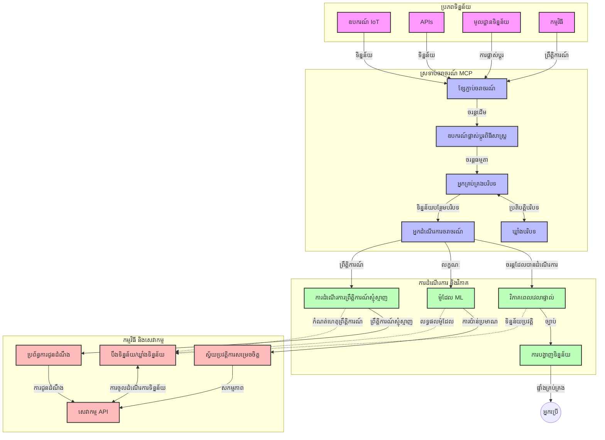

# ពិធីការបរិបទម៉ូដែលសម្រាប់ការបញ្ចោញទិន្នន័យពេលវេលាពិត

## ទិដ្ឋភាពទូទៅ

ការបញ្ចោញទិន្នន័យពេលវេលាពិតក្លាយជារឿងសំខាន់នៅក្នុងពិភពដែលផ្អែកលើទិន្នន័យសព្វថ្ងៃ ដែលអាជីវកម្ម និងកម្មវិធីត្រូវការចូលដំណើរការព័ត៌មានភ្លាមៗដើម្បីធ្វើការសម្រេចចិត្តទាន់ពេល។ ពិធីការបរិបទម៉ូដែល (MCP) ជាការវិវត្តន៍សំខាន់ក្នុងការបង្កើនប្រសិទ្ធភាពនៃដំណើរការបញ្ចោញទិន្នន័យពេលវេលាពិតនេះ កែលម្អប្រសិទ្ធភាពក្នុងការប្រព្រឹត្តទិន្នន័យ ទុកជាប់នឹងភាពត្រឹមត្រូវនៃបរិបទ និងជួយបង្កើនសមត្ថភាពសរុបរបស់ប្រព័ន្ធ។

មូឌុលនេះបង្ហាញពីរបៀបដែល MCP ផ្លាស់ប្តូរការបញ្ចោញទិន្នន័យពេលវេលាពិតដោយផ្តល់នូវវិធីសាស្រ្តស្តង់ដារសម្រាប់ការគ្រប់គ្រងបរិបទនៅចន្លោះម៉ូដែល AI វេទិកាបញ្ចោញ និងកម្មវិធី។

## មុខមាត់នៃការបញ្ចោញទិន្នន័យពេលវេលាពិត

ការបញ្ចោញទិន្នន័យពេលវេលាពិតគឺជាគំនិតបច្ចេកវិទ្យាមួយដែលអនុញ្ញាតឲ្យមានការផ្ទេរការប្រព្រឹត្តនិងវិភាគទិន្នន័យជាបន្តនៅពេលដែលវាត្រូវបានបង្កើត នាំឲ្យប្រព័ន្ធអាចឆ្លើយតបភ្លាមៗទៅនឹងព័ត៌មានថ្មីៗ។ ផ្ទុយពីការប្រព្រឹត្តធ្វើជាកញ្ចើមទិន្នន័យខេត្តស្ថិតឈរដូចមុន ការបញ្ចោញភាគល្អិតទិន្នន័យក្នុងចលនា នាំឲ្យទទួលបានចំណេះដឹងនិងសកម្មភាពត្រឹមពេលតិចបំផុត។

### គំនិតសំខាន់នៃការបញ្ចោញទិន្នន័យពេលវេលាពិត៖

- **ចរន្តទិន្នន័យជាប់រហូត**៖ ទិន្នន័យត្រូវបានប្រព្រឹត្តជាចរន្តដែលមិនចប់អស់នៃព្រឹត្តិការណ៍ ឬកំណត់ហេតុ។
- **ប្រព្រឹត្តការក្នុងពេលខ្លី**៖ ប្រព័ន្ធត្រូវបានរចនាឡើងដើម្បីកាត់បន្ថយពេលវេលារវាងការបង្កើតទិន្នន័យនិងការប្រព្រឹត្ត។
- **អាចធ្វើបានការពង្រីក**៖ ស្ថាបត្យកម្មបញ្ចោញត្រូវគ្រប់គ្រងបរិមាណនិងល្បឿនទិន្នន័យដែលមានអត្រាប្រែប្រួល។
- **ការរឹតត្បិតទប់ស្កាត់កំហុស**៖ ប្រព័ន្ធត្រូវការមានភាពរឹងមាំក្នុងការប្រឈមមុខនឹងកំហុស ដើម្បីធានាចរន្តទិន្នន័យដែលមិនឈប់ឈរ។
- **ប្រព្រឹត្តការជាស្ថានភាព**៖ រក្សាបរិបទគ្នាទៅលើព្រឹត្តិការណ៍មានសារៈសំខាន់សម្រាប់វិភាគមានន័យ។

### ពិធីការបរិបទម៉ូដែល និងការបញ្ចោញទិន្នន័យពេលវេលាពិត

ពិធីការបរិបទម៉ូដែល (MCP) ដោះស្រាយបញ្ហាសំខាន់ៗជាច្រើននៅក្នុងបរិយាកាសបញ្ចោញទិន្នន័យពេលវេលាពិត៖

1. **ភាពបន្តបរមានបរិបទ**៖ MCP ស្តង់ដារបៀបដែលបរិបទត្រូវបានរក្សាទុកនៅចន្លោះសមាសភាគបញ្ចោញដែលបែកចេញ ដើម្បីធានាថាម៉ូដែល AI និងកណ្តាប់បង្ហូរបានចូលប្រើបរិបទប្រវត្តិសាស្ត្រ និងបរិបទបរិយាកាសដែលពាក់ព័ន្ធ។

2. **ការគ្រប់គ្រងស្ថានភាពមានប្រសិទ្ធភាព**៖ ដោយផ្តល់មេកានិចដែលមានរចនាសម្ព័ន្ធសម្រាប់ការផ្ទេរបរិបទ MCP កាត់បន្ថយភាពញឹកញាប់នៃការគ្រប់គ្រងស្ថានភាពនៅក្នុងបំពង់បញ្ចោញ។

3. **សមត្ថភាពចូលរួមបាន**៖ MCP បង្កើតភាសាទូទៅសម្រាប់ការចែករំលែកបរិបទរវាងបច្ចេកវិទ្យាបញ្ចោញនានា និងម៉ូដែល AI ជា"><?ពិសេសសមត្ថភាពរចនាសម្ព័ន្ធបត់បែនបាន។

4. **បរិបទសម្រួលសម្រាប់បញ្ចោញ**៖ ការអនុវត្ត MCP អាចផ្តល់អាទិភាពទៅលើធាតុបរិបទដែលសំខាន់បំផុតសម្រាប់ការសម្រេចចិត្តពេលវេលាពិត ដើម្បីបង្កើនប្រសិទ្ធភាព និងភាពត្រឹមត្រូវ។

5. **ប្រព្រឹត្តការតាមបរិបទភ្លាមៗ**៖ ជាមួយការគ្រប់គ្រងបរិបទត្រឹមត្រូវតាម MCP ប្រព័ន្ធបញ្ចោញអាចកែប្រែប្រព្រឹត្តការតាមបរិបទយ៉ាងធម្មតាតាមលក្ខខណ្ឌ និងលំនាំដែលកំពុងផ្លាស់ប្ដូរ។

នៅក្នុងកម្មវិធីទំនើបចាប់ពីបណ្តាញឧបករណ៍ IoT ដល់វេទិកាដើរការជួញដូរ ហត្ថព័ន្ធរវាង MCP និងបច្ចេកវិទ្យាបញ្ចោញ អាចធ្វើឲ្យបានប្រព័ន្ធបញ្ចោញដែលមានប្រសិទ្ធភាពខ្ពស់ និងមានការយល់ដឹងពីបរិបទ ដែលអាចឆ្លើយតបដល់ស្ថានភាពស្មុគស្មាញដោយពេញលេញនៅពេលវេលាពិត។

## គោលបំណងការសិក្សា

នៅចុងមេរៀននេះ អ្នកនឹងអាច៖

- យល់ដឹងពីមូលដ្ឋាននៃការបញ្ចោញទិន្នន័យពេលវេលាពិត និងបញ្ហារបស់វា
- ពន្យល់ពីរបៀបដែលពិធីការបរិបទម៉ូដែល (MCP) លើកកម្ពស់ការបញ្ចោញទិន្នន័យពេលវេលាពិត
- អនុវត្តដំណោះស្រាយបញ្ចោញដោយផ្អែកលើ MCP ប្រើរចនាសម្ព័ន្ធពេញនិយមដូចជា Kafka និង Pulsar
- រចនា និងដាក់ប្រើស្ថាបត្យកម្មបញ្ចោញដែលមានភាពរឹងមាំ និងមានសមត្ថភាពខ្ពស់ជាមួយ MCP
- អនុវត្តគំនិត MCP ទៅលើករណីប្រើ IoT ការជួញដូរហិរញ្ញវត្ថុ និងវិភាគដោយបច្ចេកវិទ្យា AI
- វាយតម្លៃនិន្នាការ ការច្នៃប្រឌិតនាពេលអនាគតក្នុងបច្ចេកវិទ្យាបញ្ចោញនៅលើមូលដ្ឋាន MCP

### ការបកពាក្យនិងសារៈសំខាន់

ការបញ្ចោញទិន្នន័យពេលវេលាពិតពាក់ព័ន្ធនឹងការបង្កើត ប្រព្រឹត្ត និងចែកចាយទិន្នន័យជាបន្តដោយមានការពន្យារពេលតិចបំផុត។ ផ្ទុយពីការប្រព្រឹត្តទិន្នន័យក្នុងកញ្ចើមដែលទិន្នន័យត្រូវបានប្រមូល និងដំណើរការជាក្រុម ការបញ្ចោញទិន្នន័យត្រូវបានប្រព្រឹត្តជាដំណាក់កាលនៅពេលវាដល់ ធ្វើឲ្យទទួលបានចំណេះដឹង និងសកម្មភាពភ្លាម។

លក្ខណៈសំខាន់នៃការបញ្ចោញទិន្នន័យពេលវេលាពិតរួមមាន៖

- **ពន្យារពេលទាប**៖ ប្រព្រឹត្ត និងវិភាគទិន្នន័យក្នុងរយៈពេលមីលីវិនាទីដល់វិនាទី
- **ចរន្តជាប់រហូត**៖ ចរន្តទិន្នន័យដែលមិនមានការផ្អាកពីប្រភពផ្សេងៗ
- **ការប្រព្រឹត្តភ្លាមៗ**៖ វិភាគទិន្នន័យនៅពេលវាដល់ មិនមើលឃើញជាកញ្ចើមទេ
- **ស្ថាបត្យកម្មជាមូលដ្ឋានព្រឹត្តិការណ៍**៖ ឆ្លើយតបទៅនឹងព្រឹត្តិការណ៍នៅពេលវាបង្កើតឡើង

### បញ្ហាក្នុងការបញ្ចោញទិន្នន័យបែបបុរាណ

វិធីសាស្រ្តបញ្ចោញទិន្នន័យបែបបុរាណប្រឈមមុខជាមួយកំណត់ហេតុខាងក្រោម៖

1. **ខ្វះបរិបទ**៖ តំបន់ពិបាកក្នុងការរក្សាបរិបទនៅចន្លោះប្រព័ន្ធបែកចែក
2. **បញ្ហាការពង្រីក**៖ ប្រឈមមុខនឹងការលំបាកក្នុងការគ្រប់គ្រងទិន្នន័យគែម និងល្បឿនខ្ពស់
3. **ភាពស្មុគស្មាញក្នុងការភ្ជាប់**៖ បញ្ហានៃភាពអាចរួមបញ្ចូលគ្នារវាងប្រព័ន្ធផ្សេងៗ
4. **ការគ្រប់គ្រងពន្យារពេល**៖ ការរំលាយតុល្យភាពរវាងទិន្នន័យចូលនិងពេលវេលាប្រព្រឹត្ត
5. **ភាពត្រឹមត្រូវនៃទិន្នន័យ**៖ ការធានាទិន្នន័យមានភាពត្រឹមត្រូវ និងពេញលេញក្នុងចរន្ត

## ការយល់ដឹងអំពីពិធីការបរិបទម៉ូដែល (MCP)

### MCP ជាអ្វី?

ពិធីការបរិបទម៉ូដែល (MCP) គឺជាពិធីការប្រាស្រ័យទាក់ទងស្តង់ដារដែលរចនាឡើងដើម្បីជួយសម្រួលការបរិយាយប្រសិទ្ធភាពរវាងម៉ូដែល AI និងកម្មវិធី។ នៅក្នុងបរិបទការបញ្ចោញទិន្នន័យពេលវេលាពិត MCP ផ្តល់ស៊ុមសម្រាប់៖

- ការរក្សាទុកបរិបទនៅក្នុងបំពង់ទិន្នន័យ
- ស្តង់ដាររូបមន្តការបម្លាស់ប្តូរទិន្នន័យ
- កែលម្អការផ្ទេរទិន្នន័យច្រើនទំហំនិងធំទូលាយ
- ការកែលម្អការប្រាស្រ័យទាក់ទងពីម៉ូដែលទៅម៉ូដែល និងម៉ូដែលទៅកម្មវិធី

### សមាសភាគសំខាន់ និងស្ថាបត្យកម្ម

ស្ថាបត្យកម្ម MCP សម្រាប់បញ្ចោញពេលវេលាពិតមានសមាសភាគសំខាន់ជាច្រើន៖

1. **អ្នកគ្រប់គ្រងបរិបទ**៖ គ្រប់គ្រង និងរក្សាព័ត៌មានបរិបទនៅក្នុងបំពង់បញ្ចោញ
2. **អ្នកប្រព្រឹត្តចរន្ត**៖ ប្រព្រឹត្តចរន្តទិន្នន័យដែលមកដល់ដោយប្រើវិធីសាស្រ្តមានការយល់ដឹងពីបរិបទ
3. **ឧបករណ៍ផ្លាស់ប្តូរពិធីការជាប្រព័ន្ធ**៖ បង្ហាញពីការបម្លែងរវាងពិធីការបញ្ចោញផ្សេងៗក្នុងការរក្សាទុកបរិបទ
4. **ហាងបរិបទ**៖ រក្សាទុក និងយកព័ត៌មានបរិបទមកប្រើដោយមានប្រសិទ្ធភាព
5. **អ្នកភ្ជាប់បញ្ចោញ**៖ ភ្ជាប់ទៅនឹងវេទិកាបញ្ចោញផ្សេងៗ (Kafka, Pulsar, Kinesis, ល។)



### របៀបដែល MCP កែលម្អការដំណើរការទិន្នន័យពេលវេលាពិត

MCP ដោះស្រាយបញ្ហាបញ្ចោញខាងក្រោម៖

- **ភាពត្រឹមត្រូវបរិបទ**៖ រក្សាទំនាក់ទំនងរវាងចំណុចទិន្នន័យអោយមានភាពសុពលភាពគ្រប់បំពង់
- **ការបញ្ជូនលើកញ្ចប់រួមគ្នា**៖ កាត់បន្ថយភាពហួសហែរនៃការផ្លាស់ប្តូរទិន្នន័យតាមការគ្រប់គ្រងបរិបទឆ្លាតវៃ
- **ចំណុចផ្សេងទៀតស្តង់ដា**៖ ផ្តល់ការប្រើប្រាស់ API ដែលស្រដៀងគ្នាសម្រាប់សមាសភាគបញ្ចោញ
- **កាត់បន្ថយពន្យារពេល**៖ បន្ថយរង្វាក់ការពន្យារពេលតាមការគ្រប់គ្រងបរិបទប្រសិទ្ធភាព
- **ការពង្រីកកាន់តែល្អ**៖ គាំទ្រ ការពង្រីកនៅទិសដៅផ្ដេកដោយរក្សាបរិបទ

## ការបញ្ចូល និងការអនុវត្ត

ប្រព័ន្ធបញ្ចោញទិន្នន័យពេលវេលាពិតត្រូវការការរចនាស្ថាបត្យកម្ម និងអនុវត្តយ៉ាងម៉ត់ចត់ ដើម្បីថែរក្សាទាំងសមត្ថភាព និងភាពត្រឹមត្រូវបរិបទ។ ពិធីការបរិបទម៉ូដែលផ្តល់នូវវិធីសាស្រ្តស្តង់ដារសម្រាប់ការបញ្ចូលម៉ូដែល AI និងបច្ចេកវិទ្យាបញ្ចោញ ដែលអនុញ្ញាតឲ្យមានបំពង់ប្រព័ន្ធដែលខ្ពស់ និងមានការយល់ដឹងពីបរិបទ។

### ទិដ្ឋភាពទូទៅនៃការបញ្ចូល MCP ក្នុងស្ថាបត្យកម្មបញ្ចោញ

ការអនុវត្ត MCP នៅក្នុងបរិយាកាសបញ្ចោញពេលវេលាពិតរួមមានការពិចារណាចម្បងៗ៖

1. **ការបញ្ចូលបរិបទ និងការផ្ទេរបញ្ជូន**៖ MCP ផ្តល់មេកានិចប្រសិទ្ធភាពសម្រាប់កូដកម្មព្យាបាលព័ត៌មានបរិបទនៅក្នុងកញ្ចប់ទិន្នន័យបញ្ចោញធានាថាបរិបទចាំបាច់ត្រូវបានបន្តទាំងវាជួរប្រើ។ រួមនៅក្នុងនេះគឺរូបមន្តស្តង់ដារសម្រាប់កូដកម្មដែលបានបង្កើតសម្រាប់ការដឹកជញ្ជូនក្នុងបញ្ចោញ។

2. **ការប្រព្រឹត្តចរន្តមានស្ថានភាព**៖ MCP បង្កើតមុខងារជាស្ថានភាពមានអស់ប្រយោជន៍ ដោយរក្សារូបភាពបរិបទយ៉ាងផ្ទៀងផ្ទាត់នៅចន្លោះកណ្តាប់ការប្រព្រឹត្ត។ រឿងនេះមានតម្លៃខ្ពស់នៅក្នុងស្ថាបត្យកម្មបញ្ចោញបែកចេញដែលការគ្រប់គ្រងស្ថានភាពជារឿងពិបាកតាមបែបបុរាណ។

3. **ពេលវេលាព្រឹត្តិការណ៍ ប្រៀបធៀបពេលវេលាប្រព្រឹត្ត**៖ ការអនុវត្ត MCP ក្នុងប្រព័ន្ធបញ្ចោញ ត្រូវដោះស្រាយបញ្ហាចម្បងនៃការបំបែកឱ្យដឹងពីពេលព្រឹត្តិការណ៍កើតឡើង និងពេលវាវិភាគ។ ពិធីការអាចបញ្ចូលបរិបទពេលវេលាដែលរក្សាទុកន័យពេលព្រឹត្តិការណ៍។

4. **ការគ្រប់គ្រងការរន្ទះត្រឡប់ក្រោយ (Backpressure)**៖ ដោយស្តង់ដារការគ្រប់គ្រងបរិបទ MCP ជួយគ្រប់គ្រងដំណើររន្ទះត្រឡប់ក្រោយក្នុងប្រព័ន្ធបញ្ចោញ អនុញ្ញាតឱ្យសមាសភាគផ្សេងៗទំនាក់ទំនងសមត្ថភាពការប្រព្រឹត្តរបស់ពួកគេ និងកែប្រែចរន្តតាមសមត្ថភាព។

5. **ការ​បង្ហាញបរិបទជារបារផ្ទាំង និងការបញ្ចូលបន្ត**៖ MCP ជួយអនុវត្តប្រតិបត្តិការ windowing ដែលកាន់តែទំនើបដោយផ្តល់ការបង្ហាញបរិបទនៃពេលវេលា និងទំនាក់ទំនង ដែលអាចធ្វើឲ្យមានការបញ្ចូលបន្តដែលមានអត្ថន័យ។

6. **ការប្រព្រឹត្តបានព្រឹត្តិការណ៍ត្រឹមត្រូវម្តងเดียว**៖ ក្នុងប្រព័ន្ធបញ្ចោញដែលត្រូវការព្រឹត្តិការនូវមោទនភាពត្រឹមត្រូវម្តងតែមួយ MCP អាចបញ្ចូលទិន្នន័យមេតាអំពីប្រព្រឹត្តិការណ៍ ដើម្បីជួយតាមដាននិងផ្ទៀងផ្ទាត់ស្ថានភាពការប្រព្រឹត្តនៅចន្លោះសមាសភាគចែកចាយ។

ការអនុវត្ត MCP នៅលើបច្ចេកវិទ្យាបញ្ចោញបែបផ្សេងៗ បង្កើតវិធីសាស្រ្តលំដាប់មួយសម្រាប់ការគ្រប់គ្រងបរិបទ ដែលកាត់បន្ថយការចាំបាច់មានកូដបញ្ចូលបញ្ចូលបុរស ក្នុងពេលដែលបង្កើនសមត្ថភាពប្រព័ន្ធក្នុងការរក្សាបរិបទមានអត្ថន័យនៅពេលទិន្នន័យហូរចូលឆ្លងកាត់បំពង់។

### MCP ក្នុងស៊ុមបញ្ចោញទិន្នន័យផ្សេងៗ

ឧទាហរណ៍ទាំងនេះអនុវត្តតាមការបញ្ជាក់ MCP បច្ចុប្បន្ន ដែលផ្ដោតលើពិធីការមួយដែលផ្អែកលើ JSON-RPC ជាមួយមេកានិចដឹកជញ្ជូនខុសគ្នា។ កូដបង្ហាញរបៀបដែលអ្នកអាចអនុវត្តវិធីសាស្រ្តដឹកជញ្ជូនផ្ទាល់ខ្លួន ដែលភ្ជាប់វេទិកាបញ្ចោញដូចជា Kafka និង Pulsar ខណៈរក្សាសមត្ថភាពគ្រប់គ្រងគ្នាជាមួយពិធីការ MCP។

ឧទាហរណ៍ទាំងនេះត្រូវបានរចនាឡើងក្នុងគោលបំណងបង្ហាញពីរបៀបដែលវេទិកាបញ្ចោញអាចត្រូវបានភ្ជាប់ជាមួយ MCP ដើម្បីផ្ដល់សមត្ថភាពដំណើរការទិន្នន័យពេលវេលាពិត ខណៈដែលរក្សាការយល់ដឹងពីបរិបទ ដែលគឺជាគន្លងចម្បងនៃ MCP។ វិធីសាស្រ្តនេះធានាថាគំរូកូដទាំងអស់បង្ហាញពីស្ថានភាពបច្ចុប្បន្ននៃការបញ្ជាក់ MCP ត្រឹមខែមិថុនា ឆ្នាំ 2025។

MCP អាចភ្ជាប់ជាមួយរចនាសម្ព័ន្ធបញ្ចោញពេញនិយមរួមមាន៖

#### ការបញ្ចូល Apache Kafka

```python
import asyncio
import json
from typing import Dict, Any, Optional
from confluent_kafka import Consumer, Producer, KafkaError
from mcp.client import Client, ClientCapabilities
from mcp.core.message import JsonRpcMessage
from mcp.core.transports import Transport

# ថ្នាក់ដឹកជញ្ជូនផ្ទៃតែមួយដើម្បីភ្ជាប់ MCP ជាមួយ Kafka
class KafkaMCPTransport(Transport):
    def __init__(self, bootstrap_servers: str, input_topic: str, output_topic: str):
        self.bootstrap_servers = bootstrap_servers
        self.input_topic = input_topic
        self.output_topic = output_topic
        self.producer = Producer({'bootstrap.servers': bootstrap_servers})
        self.consumer = Consumer({
            'bootstrap.servers': bootstrap_servers,
            'group.id': 'mcp-client-group',
            'auto.offset.reset': 'earliest'
        })
        self.message_queue = asyncio.Queue()
        self.running = False
        self.consumer_task = None
        
    async def connect(self):
        """Connect to Kafka and start consuming messages"""
        self.consumer.subscribe([self.input_topic])
        self.running = True
        self.consumer_task = asyncio.create_task(self._consume_messages())
        return self
        
    async def _consume_messages(self):
        """Background task to consume messages from Kafka and queue them for processing"""
        while self.running:
            try:
                msg = self.consumer.poll(1.0)
                if msg is None:
                    await asyncio.sleep(0.1)
                    continue
                
                if msg.error():
                    if msg.error().code() == KafkaError._PARTITION_EOF:
                        continue
                    print(f"Consumer error: {msg.error()}")
                    continue
                
                # វាស់តម្លៃសារជា JSON-RPC
                try:
                    message_str = msg.value().decode('utf-8')
                    message_data = json.loads(message_str)
                    mcp_message = JsonRpcMessage.from_dict(message_data)
                    await self.message_queue.put(mcp_message)
                except Exception as e:
                    print(f"Error parsing message: {e}")
            except Exception as e:
                print(f"Error in consumer loop: {e}")
                await asyncio.sleep(1)
    
    async def read(self) -> Optional[JsonRpcMessage]:
        """Read the next message from the queue"""
        try:
            message = await self.message_queue.get()
            return message
        except Exception as e:
            print(f"Error reading message: {e}")
            return None
    
    async def write(self, message: JsonRpcMessage) -> None:
        """Write a message to the Kafka output topic"""
        try:
            message_json = json.dumps(message.to_dict())
            self.producer.produce(
                self.output_topic,
                message_json.encode('utf-8'),
                callback=self._delivery_report
            )
            self.producer.poll(0)  # បញ្ចូលការហៅត្រឡប់
        except Exception as e:
            print(f"Error writing message: {e}")
    
    def _delivery_report(self, err, msg):
        """Kafka producer delivery callback"""
        if err is not None:
            print(f'Message delivery failed: {err}')
        else:
            print(f'Message delivered to {msg.topic()} [{msg.partition()}]')
    
    async def close(self) -> None:
        """Close the transport"""
        self.running = False
        if self.consumer_task:
            self.consumer_task.cancel()
            try:
                await self.consumer_task
            except asyncio.CancelledError:
                pass
        self.consumer.close()
        self.producer.flush()

# ឧទាហរណ៍ប្រើប្រាស់ក្រុមប្រឹក្សា Kafka MCP
async def kafka_mcp_example():
    # បង្កើតអតិថិជន MCP ជាមួយក្រុមប្រឹក្សា Kafka
    client = Client(
        {"name": "kafka-mcp-client", "version": "1.0.0"},
        ClientCapabilities({})
    )
    
    # បង្កើតហើយភ្ជាប់ក្រុមប្រឹក្សា Kafka
    transport = KafkaMCPTransport(
        bootstrap_servers="localhost:9092",
        input_topic="mcp-responses",
        output_topic="mcp-requests"
    )
    
    await client.connect(transport)
    
    try:
        # ចាប់ផ្តើមសម័យ MCP
        await client.initialize()
        
        # ឧទាហរណ៍នៃការប្រតិបត្តិឧបករណ៍តាមរយៈ MCP
        response = await client.execute_tool(
            "process_data",
            {
                "data": "sample data",
                "metadata": {
                    "source": "sensor-1",
                    "timestamp": "2025-06-12T10:30:00Z"
                }
            }
        )
        
        print(f"Tool execution response: {response}")
        
        # បិទឲ្យស្អាត
        await client.shutdown()
    finally:
        await transport.close()

# ប្រតិបត្តិតាមឧទាហរណ៍
if __name__ == "__main__":
    asyncio.run(kafka_mcp_example())
```

#### ការអនុវត្ត Apache Pulsar

```python
import asyncio
import json
import pulsar
from typing import Dict, Any, Optional
from mcp.core.message import JsonRpcMessage
from mcp.core.transports import Transport
from mcp.server import Server, ServerOptions
from mcp.server.tools import Tool, ToolExecutionContext, ToolMetadata

# បង្កើតការដឹកជញ្ជូន MCP ប្ដូរប្ដូរដែលប្រើ Pulsar
class PulsarMCPTransport(Transport):
    def __init__(self, service_url: str, request_topic: str, response_topic: str):
        self.service_url = service_url
        self.request_topic = request_topic
        self.response_topic = response_topic
        self.client = pulsar.Client(service_url)
        self.producer = self.client.create_producer(response_topic)
        self.consumer = self.client.subscribe(
            request_topic,
            "mcp-server-subscription",
            consumer_type=pulsar.ConsumerType.Shared
        )
        self.message_queue = asyncio.Queue()
        self.running = False
        self.consumer_task = None
    
    async def connect(self):
        """Connect to Pulsar and start consuming messages"""
        self.running = True
        self.consumer_task = asyncio.create_task(self._consume_messages())
        return self
    
    async def _consume_messages(self):
        """Background task to consume messages from Pulsar and queue them for processing"""
        while self.running:
            try:
                # ទទួលដោយមិនរារាំងជាមួយពេលកំណត់
                msg = self.consumer.receive(timeout_millis=500)
                
                # ដំណើរការជូនសារ
                try:
                    message_str = msg.data().decode('utf-8')
                    message_data = json.loads(message_str)
                    mcp_message = JsonRpcMessage.from_dict(message_data)
                    await self.message_queue.put(mcp_message)
                    
                    # រាយការណ៍យល់ព្រមលើសារ
                    self.consumer.acknowledge(msg)
                except Exception as e:
                    print(f"Error processing message: {e}")
                    # រាយការណ៍អវិជ្ជមានបើមានកំហុស
                    self.consumer.negative_acknowledge(msg)
            except Exception as e:
                # គ្រប់គ្រងពេលកំណត់ឬករណីចម្លែកផ្សេងទៀត
                await asyncio.sleep(0.1)
    
    async def read(self) -> Optional[JsonRpcMessage]:
        """Read the next message from the queue"""
        try:
            message = await self.message_queue.get()
            return message
        except Exception as e:
            print(f"Error reading message: {e}")
            return None
    
    async def write(self, message: JsonRpcMessage) -> None:
        """Write a message to the Pulsar output topic"""
        try:
            message_json = json.dumps(message.to_dict())
            self.producer.send(message_json.encode('utf-8'))
        except Exception as e:
            print(f"Error writing message: {e}")
    
    async def close(self) -> None:
        """Close the transport"""
        self.running = False
        if self.consumer_task:
            self.consumer_task.cancel()
            try:
                await self.consumer_task
            except asyncio.CancelledError:
                pass
        self.consumer.close()
        self.producer.close()
        self.client.close()

# កំណត់ឧបករណ៍ MCP ទន្លេលើសម្រាប់ដំណើរការទិន្នន័យផ្សាយ
@Tool(
    name="process_streaming_data",
    description="Process streaming data with context preservation",
    metadata=ToolMetadata(
        required_capabilities=["streaming"]
    )
)
async def process_streaming_data(
    ctx: ToolExecutionContext,
    data: str,
    source: str,
    priority: str = "medium"
) -> Dict[str, Any]:
    """
    Process streaming data while preserving context
    
    Args:
        ctx: Tool execution context
        data: The data to process
        source: The source of the data
        priority: Priority level (low, medium, high)
        
    Returns:
        Dict containing processed results and context information
    """
    # ឧទាហរណ៍ដំណើរការដែលប្រើអត្ថបទ MCP
    print(f"Processing data from {source} with priority {priority}")
    
    # ចូលប្រើបរិបទសន្ទនាពី MCP
    conversation_id = ctx.conversation_id if hasattr(ctx, 'conversation_id') else "unknown"
    
    # បញ្ជាន់លទ្ធផលជាមួយបរិបទបានបង្កើន
    return {
        "processed_data": f"Processed: {data}",
        "context": {
            "conversation_id": conversation_id,
            "source": source,
            "priority": priority,
            "processing_timestamp": ctx.get_current_time_iso()
        }
    }

# ឧទាហរណ៍ការអនុវត្តម៉ាស៊ីនមេ MCP ដោយប្រើការដឹកជញ្ជូន Pulsar
async def run_mcp_server_with_pulsar():
    # បង្កើតម៉ាស៊ីនមេ MCP
    server = Server(
        {"name": "pulsar-mcp-server", "version": "1.0.0"},
        ServerOptions(
            capabilities={"streaming": True}
        )
    )
    
    # ចុះបញ្ជីឧបករណ៍របស់យើង
    server.register_tool(process_streaming_data)
    
    # បង្កើត និងភ្ជាប់ការដឹកជញ្ជូន Pulsar
    transport = PulsarMCPTransport(
        service_url="pulsar://localhost:6650",
        request_topic="mcp-requests",
        response_topic="mcp-responses"
    )
    
    try:
        # ចាប់ផ្តើមម៉ាស៊ីនមេជាមួយការដឹកជញ្ជូន Pulsar
        await server.run(transport)
    finally:
        await transport.close()

# រត់ម៉ាស៊ីនមេ
if __name__ == "__main__":
    asyncio.run(run_mcp_server_with_pulsar())
```

### សីលធម៍ល្អសម្រាប់ការដាក់ពង្រីក

នៅពេលអនុវត្ត MCP សម្រាប់ការបញ្ចោញពេលវេលាពិត៖

1. **រចនាសម្រាប់ការរឹតត្បិតកំហុស**៖
   - អនុវត្តការដោះស្រាយកំហុសយ៉ាងត្រឹមត្រូវ
   - ប្រើបញ្ជីសារលោតសម្រាប់សារមិនបានជោគជ័យ
   - រចនាអ្នកប្រព្រឹត្តដែលអាចធ្វើម្តងទៀតដោយគ្មានផលប៉ះពាល់

2. **បង្កើនប្រសិទ្ធភាព**៖
   - ត្រូវកំណត់ទំហំទ្រនិចឲ្យសមរម្យ
   - ប្រើបច្ចេកទេសបញ្ចូលជាកញ្ចប់នៅពេលសមរម្យ
   - អនុវត្តមេកានិចបញ្ជូនត្រឡប់ក្រោយ

3. **តាមដាន និងពិនិត្យមើល**៖
   - តាមដានវិមាត្រការប្រព្រឹត្តចរន្ត
   - តាមដានការបញ្ជូនបរិបទ
   - បង្កើតការជូនដំណឹងសម្រាប់ភាពវៀចវេរ

4. **ការពារចរន្តអ្នក**៖
   - អនុវត្តការអ៊ិនគ្រីបសម្រាប់ទិន្នន័យបំភ្លឺ
   - ប្រើការផ្ទៀងផ្ទាត់ និងការអនុញ្ញាត
   - អនុវត្តការគ្រប់គ្រងចូលដំណើរការយ៉ាងត្រឹមត្រូវ


### MCP ក្នុង IoT និងកំណត់គ្រាមព្រំ

MCP បង្កើនសមត្ថភាពបញ្ចោញ IoT ដោយ៖

- រក្សាបរិបទឧបករណ៍នៅចន្លោះបំពង់
- អាចបញ្ចោញទិន្នន័យពីគ្រាមទៅពពកបានយ៉ាងមានប្រសិទ្ធភាព
- គាំទ្រវិភាគពហុពហិន្ទិនៅលើចរន្តទិន្នន័យ IoT
- ជួយឲ្យមានការប្រាស្រ័យទាក់ទងឧបករណ៍ទៅឧបករណ៍ដោយមានបរិបទ

ឧទាហរណ៍៖ បណ្តាញឧបករណ៍ស្មាតស៊ីទី
```
Sensors → Edge Gateways → MCP Stream Processors → Real-time Analytics → Automated Responses
```

### តួនាទីក្នុងប្រតិបត្ដិការហិរញ្ញវត្ថុ និងពាណិជ្ជកម្មប្រុងប្រយ័ត្នខ្ពស់

MCP ផ្តល់អត្ថប្រយោជន៍សំខាន់សម្រាប់ការបញ្ចោញទិន្នន័យហិរញ្ញវត្ថុ៖

- ប្រើពន្យារពេលទាបបំផុតសម្រាប់ការសម្រេចចិត្តជួញដូរ
- រក្សាបរិបទប្រតិបត្ដិការនៅកន្លែងទាំងអស់
- គាំទ្រការប្រព្រឹត្តព្រឹត្តិការលំបាកជាមួយការយល់ដឹងពីបរិបទ
- ធានាបានភាពត្រឹមត្រូវទិន្នន័យក្នុងប្រព័ន្ធជួញដូរចែកចាយ

### កែលម្អវិភាគទិន្នន័យដោយជំនួយ AI

MCP បង្កើតឱកាសថ្មីសម្រាប់វិភាគបញ្ចោញ៖

- ការបណ្តុះបណ្តាលម៉ូដែល និងការធ្វើតេស្តភ្លាមៗ
- ការសិក្សាបន្តពីចរន្តទិន្នន័យ
- ការដកលក្ខណៈលក្ខណៈដោយយល់ដឹងពីបរិបទ
- បំពង់ធ្វើតេស្តម៉ូដែលច្រើនដោយរក្សាបរិបទ

## និន្នាការនាពេលអនាគត និងការច្នៃប្រឌិត

### ការវិវត្តនៃ MCP នៅក្នុងបរិយាកាសពេលវេលាពិត

មើលទៅឆ្ងាយ យើងរំពឹងថា MCP នឹងវិវត្តន៍ដើម្បីដោះស្រាយ៖

- **ការចូលរួមកុំព្យូទ័រក្វាន់តាល់**៖ រៀបចំសម្រាប់ប្រព័ន្ធបញ្ចោញផ្អែកលើកុំព្យូទ័រក្វាន់តាល់
- **ការប្រព្រឹត្តនៅឧបករណ៍គ្រាម**៖ ផ្សំការប្រព្រឹត្តដែលមានការយល់ដឹងពីបរិបទនៅឧបករណ៍គ្រាម
- **ការគ្រប់គ្រងបញ្ចោញដោយ​ខ្លួនឯង**៖ បំពង់បញ្ចោញអាចជួសជុលខ្លួនឯង
- **ការបញ្ចោញជាក្រុមប្រជុំ**៖ ប្រព្រឹត្តចែកចាយដោយរក្សាសម្ងាត់

### ការកែលម្អបច្ចេកវិទ្យាអាចកើតមាន

បច្ចេកវិទ្យាថ្មីៗដែលនឹងបណ្តាលឲ្យការបញ្ចោញ MCP មានអនាគត៖

1. **ពិធីការបញ្ចោញដែលកែលម្អដោយ AI**៖ ពិធីការផ្ទាល់ខ្លួនដែលរចនាជាពិសេសសម្រាប់ការងារដំណើរការ AI
2. **ការចូលរួមកុំព្យូទ័រប្រភេទ Neuromorphic**៖ កុំព្យូទ័របំលែងមកពីខួរក្បាលសម្រាប់ការប្រព្រឹត្តពេលវេលាពិត
3. **បញ្ចោញដំណើរការ Serverless**៖ ការបញ្ចោញដែលបើកដោយព្រឹត្តិការលំនាំ បង្កើតមិនចាំបាច់គ្រប់គ្រងហេដ្ឋារចនាសម្ព័ន្ធ
4. **ហាងបរិបទចែកចាយ**៖ ការគ្រប់គ្រងបរិបទដែលចែកចាយជាសកល ប៉ុន្តែមានភាពរឹងមាំខ្ពស់

## ហាត់បង្រៀនដោយដៃ

### ហាត់ 1៖ ការកំណត់បំពង់បញ្ចោញ MCP មូលដ្ឋាន

នៅក្នុងហាត់នេះ អ្នកនឹងរៀន៖
- កំណត់បរិយាកាសបញ្ចោញ MCP មូលដ្ឋាន
- អនុវត្តអ្នកគ្រប់គ្រងបរិបទសម្រាប់ការប្រព្រឹត្តចរន្ត
- សាកល្បងនិងបញ្ជាក់ការរក្សាបរិបទ

### ហាត់ 2៖ បង្កើតផ្ទាំងបង្ហាញវិភាគពេលវេលាពិត

បង្កើតកម្មវិធីពេញលេញដែល៖
- ទទួលទិន្នន័យបញ្ចោញដោយប្រើ MCP
- ប្រព្រឹត្តចរន្តដោយរក្សាបរិបទ
- បង្ហាញលទ្ធផលពេលវេលាពិត

### ហាត់ 3៖ អនុវត្តការប្រព្រឹត្តព្រឹត្តិការលំបាកជាមួយ MCP

ហាត់កម្រិតខ្ពស់ដែលគ្របដណ្តប់៖
- ការរកឃើញលំនាំនៅក្នុងចរន្ត
- ការតភ្ជាប់បរិបទរវាងចរន្តជាច្រើន
- ការបង្កើតព្រឹត្តិការលំបាកដោយរក្សាបរិបទ

## ឯកសារបន្ថែម

- [ការបញ្ជាក់ពិធីការបរិបទម៉ូដែល](https://modelcontextprotocol.io) - ការបញ្ជាក់ និងឯកសារផ្លូវការរបស់ MCP
- [ឯកសារ Apache Kafka](https://kafka.apache.org/documentation/) - រៀនអំពី Kafka សម្រាប់ការប្រព្រឹត្តចរន្ត
- [Apache Pulsar](https://pulsar.apache.org/) - វេទិកាសារ និងបញ្ចោញសមាគម
- [បច្ចេកវិទ្យាបញ្ចោញ: អ្វីដែល ជេរ, កន្លែង, ពេលវេលា និងរបៀបនៃការប្រព្រឹត្តទិន្នន័យទំហំធំ](https://www.oreilly.com/library/view/streaming-systems/9781491983867/) - សៀវភៅបញ្ចូលគ្នានៃស្ថាបត្យកម្មបញ្ចោញ
- [Microsoft Azure Event Hubs](https://learn.microsoft.com/azure/event-hubs/event-hubs-about) - ចម្ងាយបញ្ចោញព្រឹត្តិការដឹកជញ្ជូនគ្រប់គ្រង
- [ឯកសារ MLflow](https://mlflow.org/docs/latest/index.html) - សម្រាប់ការតាមដាន និងដាក់បង្ហោះម៉ូដែល ML
- [វិភាគពេលវេលាពិតជាមួយ Apache Storm](https://storm.apache.org/releases/current/index.html) - ស៊ុមដំណើរការសម្រាប់គណនាពេលវេលាពិត
- [Flink ML](https://nightlies.apache.org/flink/flink-ml-docs-master/) - បណ្ណាល័យរៀនសូត្រសម្រាប់ Apache Flink
- [ឯកសារ LangChain](https://python.langchain.com/docs/get_started/introduction) - ការបង្កើតកម្មវិធីជាមួយ LLMs


## លទ្ធផលការសិក្សា

ដោយបញ្ចប់មូឌុលនេះ អ្នកនឹងអាច៖

- យល់ដឹងពីមូលដ្ឋាននៃការបញ្ចោញទិន្នន័យពេលវេលាពិត និងបញ្ហារបស់វា
- ពន្យល់ពីរបៀបដែលពិធីការបរិបទម៉ូដែល (MCP) លើកកម្ពស់ការបញ្ចោញទិន្នន័យពេលវេលាពិត
- អនុវត្តដំណោះស្រាយបញ្ចោញដោយផ្អែកលើ MCP ប្រើរចនាសម្ព័ន្ធពេញនិយមដូចជា Kafka និង Pulsar
- រចនា និងដាក់ប្រើស្ថាបត្យកម្មបញ្ចោញដែលមានភាពរឹងមាំ និងមានសមត្ថភាពខ្ពស់ជាមួយ MCP
- អនុវត្តគំនិត MCP ទៅលើករណីប្រើ IoT ការជួញដូរហិរញ្ញវត្ថុ និងវិភាគដោយបច្ចេកវិទ្យា AI
- វាយតម្លៃនិន្នាការ ការច្នៃប្រឌិតនាពេលអនាគតក្នុងបច្ចេកវិទ្យាបញ្ចោញនៅលើមូលដ្ឋាន MCP

## យ៉ាងតទៅ

- [5.11 ស្វែងរកពេលវេលាពិត](../mcp-realtimesearch/README.md)

---

<!-- CO-OP TRANSLATOR DISCLAIMER START -->
**ការបដិសេធ**:
ឯកសារនេះត្រូវបានបម្លែងភាសា ដោយប្រើសេវាបម្លែងភាសា AI [Co-op Translator](https://github.com/Azure/co-op-translator)។ ទោះយើងខ្ញុំមានក្តីប្រាថ្នាឱ្យបានច្បាស់លាស់ តែសូមយល់ដឹងថាការបម្លែងដោយស្វ័យប្រវត្តិក៏អាចមានកំហុសឬភាពមិនត្រឹមត្រូវ។ ឯកសារដើមជាភាសាទីតាំងគួរត្រូវបានគេប្រើជាប្រភពច្បាស់លាស់។ សម្រាប់ព័ត៌មានសំខាន់ៗ សូមណែនាំឱ្យប្រើប្រាស់ការប្រែដោយមនុស្សជំនាញ។ យើងខ្ញុំមិនទទួលខុសត្រូវចំពោះការយល់ច្រឡំ ឬការបកស្រាយខុសបន្ទាប់ពីការប្រើប្រាស់ការបម្លែងនេះនោះទេ។
<!-- CO-OP TRANSLATOR DISCLAIMER END -->