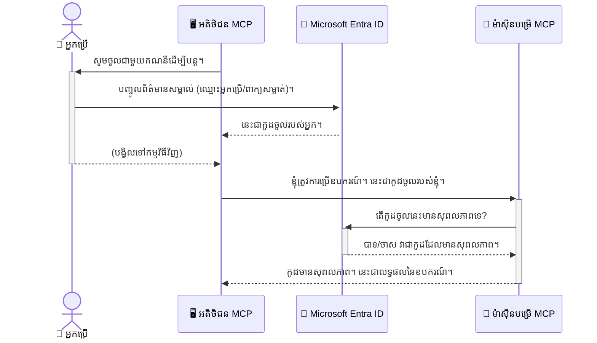

# ការពារជំហាន AI: ការផ្ទៀងផ្ទាត់អត្តសញ្ញាណ Entra ID សម្រាប់ម៉ូឌែល Context Protocol Servers

## ការណែនាំ  
ការពារតំបន់ម៉ូឌែល Context Protocol (MCP) របស់អ្នកមានសារៈសំខាន់ដូចជាការចាក់សោទ្វារមុខផ្ទះរបស់អ្នក។ ការចាកចេញពីម៉ាស៊ីនមេ MCP របស់អ្នកបើកអាចបង្កគោលន័យឱ្យឧបករណ៍ និងទិន្នន័យរបស់អ្នកដោយគ្មានការអនុញ្ញាត ដែលអាចនាំឲ្យមានការលុកលុយសុវត្ថិភាព។ Microsoft Entra ID ផ្តល់នូវដំណោះស្រាយគ្រប់គ្រងអត្តសញ្ញាណ និងការចូលប្រើលើម៉េឃ្លៅ ដើម្បីធានាថាមានតែអ្នកប្រើប្រាស់ និងកម្មវិធីដែលមានសិទ្ធិបានបញ្ចេញអនុស្សាវរីយ៍ជាមួយម៉ាស៊ីនមេ MCP របស់អ្នក។ នៅក្នុងផ្នែកនេះ អ្នកនឹងរៀនពីវិធីការពារជំហាន AI របស់អ្នកដោយប្រើការផ្ទៀងផ្ទាត់អត្តសញ្ញាណ Entra ID។

## វត្ថុបំណងរៀន  
នៅចុងផ្នែកនេះ អ្នកនឹងអាច៖

- យល់ពីសារៈសំខានៃការពារម៉ាស៊ីនមេ MCP។
- ពន្យល់ពីមូលដ្ឋាន Microsoft Entra ID និងការផ្ទៀងផ្ទាត់ OAuth 2.0។
- ស្គាល់ភាពខុសគ្នារវាងអតិថិជនសាធារណៈ និងអតិថិជនលាក់ទោស។
- អនុវត្តការផ្ទៀងផ្ទាត់ Entra ID នៅទាំងស្នូលតំបន់ (អតិថិជនសាធារណៈ) និងម៉ាស៊ីនមេ MCP ចម្ងាយ (អតិថិជនលាក់ទោស)។
- អនុវត្តអនុស្សារណៈសុវត្ថិភាពល្អបំផុតនៅពេលអភិវឌ្ឍការងារ AI។

## សុវត្ថិភាព និង MCP  

ដូចជាអ្នកមិនដាក់សោទ្វារមុខផ្ទះទេ អ្នកក៏មិនគួរបើកម៉ាស៊ីនមេ MCP ឲ្យគ្រប់គ្នាចូលប្រើ។ ការពារជំហាន AI របស់អ្នកមានសារៈសំខាន់សម្រាប់ការបង្កើតកម្មវិធីរឹងមាំ យល់ចិត្ត និងមានសុវត្ថិភាព។ ជំពូកនេះនឹងណែនាំអ្នកមកនូវការប្រើ Microsoft Entra ID ដើម្បីការពារ MCP server របស់អ្នក ដើម្បីធានាថាមានតែអ្នកប្រើប្រាស់ និងកម្មវិធីដែលមានសិទ្ធិទំនាក់ទំនងជាមួយឧបករណ៍ និងទិន្នន័យរបស់អ្នកប៉ុណ្ណោះ។

## ហេតុអ្វីបានជាសុវត្ថិភាពមានសារៈសំខាន់សម្រាប់ម៉ាស៊ីនមេ MCP

សូមគិតថាម៉ាស៊ីនមេ MCP របស់អ្នកមានឧបករណ៍បញ្ជូនអ៊ីមែល ឬចូលទៅកាន់មូលដ្ឋានទិន្នន័យអតិថិជន។ ម៉ាស៊ីនមេមិនបានការពារ អ្នកណាមួយអាចប្រើឧបករណ៍នោះហើយនាំឲ្យមានការចូលមិនបានការអនុញ្ញាតក្នុងទិន្នន័យ សារប្រកាសមិនចង់បាន ឬសកម្មភាពអាក្រក់ផ្សេងទៀត។

ដោយអនុវត្តការផ្ទៀងផ្ទាត់ អ្នកធានាថាសំណើរ​កម្រិត​អ្វីៗទៅម៉ាស៊ីនមេត្រូវបានក្នុងការត្រួតពិនិត្យ ដោយបញ្ជាក់អត្តសញ្ញាណអ្នកប្រើ ឬកម្មវិធីដែលធ្វើសំណើរ។ នេះគឺជជំហ៊ានទីមួយ និងសំខាន់បំផុតក្នុងការពារជំហាន AI របស់អ្នក។

## ការណែនាំ Microsoft Entra ID

[**Microsoft Entra ID**](https://adoption.microsoft.com/microsoft-security/entra/) គឺជាសេវាកម្មគ្រប់គ្រងអត្តសញ្ញាណ និងការចូលប្រើលើម៉េឃ្លៅ។ គិតថាវាជាអ្នកការពារសុវត្ថិភាពទូទៅសម្រាប់កម្មវិធីរបស់អ្នក។ វា​ដំណើរការពីជំហ៊ានស្មុគស្មាញនៃការផ្ទៀងផ្ទាត់អត្តសញ្ញាណអ្នកប្រើ (authentication) និងកំណត់អ្វីដែលគេអនុញ្ញាតឲ្យធ្វើ (authorization)។

ដោយប្រើ Entra ID អ្នកអាច៖

- អនុញ្ញាតឲ្យអ្នកប្រើចូលដោយសុវត្ថិភាព។
- ការពារ API និងសេវាកម្ម។
- គ្រប់គ្រងគោលនយោបាយចូលប្រើពីកន្លែងមួយ។

សម្រាប់ម៉ាស៊ីនមេ MCP, Entra ID ផ្តល់ដំណោះស្រាយមានសុវត្ថិភាព និងទុកចិត្តធំដើម្បីគ្រប់គ្រងថា នរណាអាចប្រើមុខងាររបស់ម៉ាស៊ីនមេ។

---

## យល់ដឹងពីអត្ថន័យ: របៀបដំណើរការ Microsoft Entra ID Authentication

Entra ID ប្រើស្តង់ដារបើកដូចជា **OAuth 2.0** ដើម្បីដំណើរការការផ្ទៀងផ្ទាត់។ ខណៈដែលព័ត៍មានលម្អិតអាចស្មុគស្មាញ គំនិតគោលអាចយល់បានតាមរយៈការពិពណ៌នាគម្រូស្មើ។

### ការណែនាំត្រង់ទៅ OAuth 2.0៖ កូនសោអ្នកជួលរថយន្ត

គិតថា OAuth 2.0 គឺជាសេវាអ្នកជួលរថយន្តសំរាប់រថយន្តរបស់អ្នក។ នៅពេលអ្នកមកភោជនីយដ្ឋាន អ្នកមិនផ្ដល់កូនសោប្រពៃណីរថយន្តយ៉ាងម៉ាស្ទើរក្នុងដៃអ្នកជួលទេ។ តែអ្នកផ្ដល់កូនសោអ្នកជួល ដែលមានកំណត់សិទ្ធិខ្លះៗ គឺអាចបើករថយន្ត និងចាក់សោទ្វារ តែមិនអាចបើកធនាគាឯកសារឬទ្វារច្រក។

នៅក្នុងការពិពណ៌នានេះ:

- **អ្នក** គឺជា **អ្នកប្រើ**។
- **រថយន្តរបស់អ្នក** គឺជា **ម៉ាស៊ីនមេ MCP** ជាមួយឧបករណ៍ និងទិន្នន័យមានតម្លៃ។
- **អ្នកជួលរថយន្ត** គឺជា **Microsoft Entra ID**។
- **ម្ចាស់ផ្ទះចតបរមា** គឺជា **អតិថិជន MCP** (កម្មវិធីដែលព្យាយាមចូលម៉ាស៊ីនមេ)។
- **កូនសោអ្នកជួល** គឺជា **Access Token**។

Access token ជាស្ទ្រីងអក្សរដែលសុវត្ថិភាពដែលអតិថិជន MCP ទទួលបានពី Entra ID បន្ទាប់ពីអ្នកបានចូល។ អតិថិជនបង្ហាញ token នេះទៅម៉ាស៊ីនមេ MCP ជាមួយនឹងសំណើរ រាល់ដង។ ម៉ាស៊ីនមេអាចផ្ទៀងផ្ទាត់ token ដើម្បីធានាថាសំណើវាជាត្រឹមត្រូវ និងអតិថិជនមានសិទ្ធិគ្រប់គ្រាន់ ដោយមិនចាំបាច់ផ្ទុកពាក្យសម្ងាត់របស់អ្នក។

### ដំណើរការការផ្ទៀងផ្ទាត់  

នេះជារបៀបដែលដំណើរការនៅពេលបញ្ចាក់៖



### ការណែនាំរៀបរាប់ Microsoft Authentication Library (MSAL)

មុននឹងចូលទៅកូដ វាមានសារៈសំខាន់ក្នុងការណែនាំមេត្តាក្រុមហ៊ុនមួយដែលអ្នកនឹងឃើញក្នុងឧទាហរណ៍: គឺ **Microsoft Authentication Library (MSAL)** ។

MSAL ជាបណ្ណាល័យដែលផលិតដោយ Microsoft ធ្វើឲ្យកូដកសាងបង្កើតភាពងាយស្រួលសម្រាប់អ្នកអភិវឌ្ឍ ក្នុងការដោះស្រាយបញ្ហាការផ្ទៀងផ្ទាត់។ ជំនួសឲ្យអ្នកសរសេរកូដស្មុគស្មាញសម្រាប់ការដោះស្រាយសញ្ញាសុវត្ថិភាព គ្រប់គ្រងការចូល និងសម័យបន្ដាយ MSAL នឹងចាត់ការនេះដោយស្វ័យប្រវត្តិ។

ការប្រើបណ្ណាល័យ MSAL មានផ្តល់អត្ថប្រយោជន៍៖

- **វាសុវត្ថិភាព:** វាអនុវត្តស្តង់ដារឧស្សាហកម្ម និងអនុស្សារណៈល្អបំផុតសុវត្ថិភាព ដើម្បីកែលម្អភាពរងគ្រោះនៅក្នុងកូដរបស់អ្នក។
- **វាធ្វើឲ្យការអភិវឌ្ឍកាន់តែងាយស្រួល:** វាផ្ដល់ abstraction លើ OAuth 2.0 និង OpenID Connect នេះអាចបន្ថែមការផ្ទៀងផ្ទាត់ដ៏រឹងមាំមកកម្មវិធីត្រឹមតែលេខបន្ទាត់កូដតិចប្រាំពីរបាន។
- **វាត្រូវបានថែទាំ:** Microsoft រក្សានិងធ្វើបច្ចុប្បន្នភាព MSAL ដើម្បីដោះស្រាយការគំរាមកំហែងសុវត្ថិភាព និងការផ្លាស់ប្តូរពហុពិភពក្រុមហ៊ុន។

MSAL គាំទ្រភាសា និងគ្រោងការអភិវឌ្ឍកម្មវិធីជាច្រើន រួមមាន .NET, JavaScript/TypeScript, Python, Java, Go និងវេទិកាផ្ទាល់ខ្លួនដូចជា iOS និង Android។ នេះមានន័យថាអ្នកអាចប្រើតម្រុយផ្ទៀងផ្ទាត់ដែលមានភាពស្រដៀងគ្នាទៅលើបណ្តាញបច្ចេកវិទ្យារបស់អ្នកទាំងមូល។

ដើម្បីរៀនបន្ថែម អ្នកអាចពិនិត្យឯកសារពិតរបស់ [MSAL overview documentation](https://learn.microsoft.com/entra/identity-platform/msal-overview)។

---

## ការពារម៉ាស៊ីនមេ MCP របស់អ្នកជាមួយ Entra ID: មេរៀនជំហ៊ានមួយ

ឥឡូវនេះ យើងនឹងដើរតាមរបៀបការពារម៉ាស៊ីនមេ MCP ស្ថានីយ៍ក្នុងស្រុក (មួយដែលប្រាស្រ័យទាក់ទងតាម `stdio`) ប្រើ Entra ID។ ឧទាហរណ៍នេះប្រើអតិថិជនសាធារណៈ ដែលសមស្របសម្រាប់កម្មវិធីដំណើរការលើម៉ាស៊ីនរបស់អ្នកប្រើ ដូចជា កម្មវិធីដតផត ឬម៉ាស៊ីនបង្កើតក្នុងស្រុក។

### ករណីទី១៖ ការពារម៉ាស៊ីនមេ MCP ក្នុងស្រុក (ជាមួយអតិថិជនសាធារណៈ)

នៅក្នុងករណីនេះ យើងនឹងមើលម៉ាស៊ីនមេ MCP ដំណើរការលើកន្លែងក្នុងស្រុក ប្រាស្រ័យ `stdio` និងប្រើ Entra ID ដើម្បីផ្ទៀងផ្ទាត់អ្នកប្រើ មុនឱ្យជ្រើសរើសឧបករណ៍ គឺមានឧបករណ៍តែមួយ ដែលទាញយកព័ត៌មានប្រវត្តិរូបអ្នកប្រើពី Microsoft Graph API។

#### ១. ការតំឡើងកម្មវិធីក្នុង Entra ID

មុននឹងសរសេរកូដ អ្នកត្រូវចុះបញ្ជីកម្មវិធីរបស់អ្នកក្នុង Microsoft Entra ID។ នេះជូនដំណឹងទៅ Entra ID អំពីកម្មវិធីរបស់អ្នក និង​ផ្ដល់​សិទ្ធិប្រើសេវាកម្មផ្ទៀងផ្ទាត់។

1. ចូលទៅកាន់ **[របប Microsoft Entra portal](https://entra.microsoft.com/)**។
2. ទៅកាន់ **App registrations** ហើយចុច **New registration**។
3. ផ្ដល់ឈ្មោះកម្មវិធី (ឧទាហរណ៍ "ម៉ាស៊ីនមេ MCP ក្នុងស្រុករបស់ខ្ញុំ")។
4. សម្រាប់ **Supported account types** ជ្រើស **Accounts in this organizational directory only**។
5. អ្នកអាចទុកប្រអប់ **Redirect URI** ទទេសម្រាប់ឧទាហរណ៍នេះ។
6. ចុច **Register**។

បន្ទាប់ពីចុះបញ្ជី ចុងក្រោយចំណាំលេខ **Application (client) ID** និង **Directory (tenant) ID** ដែលអ្នកត្រូវប្រើក្នុងកូដ។

#### ២. កូដ៖ ការបំបែកវិសាលភាព

យើងនឹងមើលផ្នែកសំខាន់ខ្លះក្នុងកូដដែលដោះស្រាយការផ្ទៀងផ្ទាត់។ កូដពេញលេញសម្រាប់ឧទាហរណ៍នេះអាចរកបានក្នុងថត [Entra ID - Local - WAM](https://github.com/Azure-Samples/mcp-auth-servers/tree/main/src/entra-id-local-wam) នៅក្នុង [mcp-auth-servers GitHub repository](https://github.com/Azure-Samples/mcp-auth-servers)។

**`AuthenticationService.cs`**

ថ្នាក់ទំព័រនេះទទួលខុសត្រូវក្នុងការដោះស្រាយការប្រតិបត្តិការជាមួយ Entra ID

- **`CreateAsync`**: វាដំណើរការ `PublicClientApplication` ពី MSAL។ វាត្រូវបានកំណត់ជាមួយ `clientId` និង `tenantId` របស់កម្មវិធីអ្នក។
- **`WithBroker`**: អនុញ្ញាតឲ្យប្រើសេវាកម្ម broker (ដូចជា Windows Web Account Manager), ផ្តល់បទពិសោធន៍ sign-on មួយដងដែលមានសុវត្ថិភាព និងរលូន។
- **`AcquireTokenAsync`**: វាជាវិធីសំខាន់។ វាព្យាយាមទទួល token យកដោយផ្ទាល់ (silent token) ប្រសិនបើអ្នកប្រើមានសម័យត្រឹមត្រូវ។ ប្រសិនបើមិនមាន វានឹងបង្ហាញរបារចូលដើម្បីអ្នកប្រើដាក់សញ្ញា។

```csharp
// Simplified for clarity
public static async Task<AuthenticationService> CreateAsync(ILogger<AuthenticationService> logger)
{
    var msalClient = PublicClientApplicationBuilder
        .Create(_clientId) // Your Application (client) ID
        .WithAuthority(AadAuthorityAudience.AzureAdMyOrg)
        .WithTenantId(_tenantId) // Your Directory (tenant) ID
        .WithBroker(new BrokerOptions(BrokerOptions.OperatingSystems.Windows))
        .Build();

    // ... cache registration ...

    return new AuthenticationService(logger, msalClient);
}

public async Task<string> AcquireTokenAsync()
{
    try
    {
        // Try silent authentication first
        var accounts = await _msalClient.GetAccountsAsync();
        var account = accounts.FirstOrDefault();

        AuthenticationResult? result = null;

        if (account != null)
        {
            result = await _msalClient.AcquireTokenSilent(_scopes, account).ExecuteAsync();
        }
        else
        {
            // If no account, or silent fails, go interactive
            result = await _msalClient.AcquireTokenInteractive(_scopes).ExecuteAsync();
        }

        return result.AccessToken;
    }
    catch (Exception ex)
    {
        _logger.LogError(ex, "An error occurred while acquiring the token.");
        throw; // Optionally rethrow the exception for higher-level handling
    }
}
```
  
**`Program.cs`**  

នេះជាទីតាំងដែលម៉ាស៊ីនមេ MCP ត្រូវបានកំណត់ និងបញ្ចូលសេវាកម្ម authentication។

- **`AddSingleton<AuthenticationService>`**: ចុះបញ្ជី `AuthenticationService` ជាមួយឃ្លាំងការចាក់ injected ដើម្បីអាចប្រើបាននៅប្លុកផ្សេងទៀតក្នុងកម្មវិធី (ដូចជា ឧបករណ៍)។
- **ឧបករណ៍ `GetUserDetailsFromGraph`**: ឧបករណ៍នេះត្រូវការឧបករណ៍ `AuthenticationService` មុនធ្វើប្វិល គឺហៅ `authService.AcquireTokenAsync()` ដើម្បីទទួលបាន token ចូលប្រើត្រឹមត្រូវ។ ប្រសិនបើការផ្ទៀងផ្ទាត់ជោគជ័យ វាអាចប្រើ token ដើម្បីហៅ Microsoft Graph API និងទាញយកព័ត៌មានអ្នកប្រើ។

```csharp
// Simplified for clarity
[McpServerTool(Name = "GetUserDetailsFromGraph")]
public static async Task<string> GetUserDetailsFromGraph(
    AuthenticationService authService)
{
    try
    {
        // This will trigger the authentication flow
        var accessToken = await authService.AcquireTokenAsync();

        // Use the token to create a GraphServiceClient
        var graphClient = new GraphServiceClient(
            new BaseBearerTokenAuthenticationProvider(new TokenProvider(authService)));

        var user = await graphClient.Me.GetAsync();

        return System.Text.Json.JsonSerializer.Serialize(user);
    }
    catch (Exception ex)
    {
        return $"Error: {ex.Message}";
    }
}
```

#### ៣. វាធ្វើការល្អបង្វិលគ្នាយ៉ាងដូចម្តេច

1. នៅពេលអតិថិជន MCP ព្យាយាមប្រើឧបករណ៍ `GetUserDetailsFromGraph`, ឧបករណ៍នោះក៏ហៅ `AcquireTokenAsync` ជាមុន។
2. `AcquireTokenAsync` បញ្ជាឲ្យបណ្ណាល័យ MSAL ពិនិត្យរក token ត្រឹមត្រូវ។
3. ប្រសិនបើមិនមាន token MSAL តាមរយៈ broker នឹងបង្ហាញអ្នកប្រើឲ្យចូល។
4. បន្ទាប់ពីអ្នកប្រើចូលជា១, Entra ID បញ្ចេញ access token។
5. ឧបករណ៍ទទួល token និងប្រើវាហៅ Microsoft Graph API ដោយមានសុវត្ថិភាព។
6. ព័ត៌មានអ្នកប្រើត្រូវបានផ្ញើត្រឡប់ទៅអតិថិជន MCP។

ដំណើរនេះធានាថាមានតែអ្នកប្រើដែលបានផ្ទៀងផ្ទាត់អត្តសញ្ញាណអាចប្រើឧបករណ៍ ហើយការពារម៉ាស៊ីនមេ MCP ក្នុងស្រុករបស់អ្នកបានយ៉ាងមានប្រសិទ្ធភាព។

### ករណីទី២៖ ការពារម៉ាស៊ីនមេ MCP ចម្ងាយ (ជាមួយអតិថិជនលាក់ទោស)

នៅពេលម៉ាស៊ីនមេ MCP របស់អ្នកដំណើរការលើម៉ាស៊ីនចម្ងាយ (ដូចជា ម៉ាស៊ីនមេមេឃ្លៅ) និងប្រាស្រ័យទាក់ទងតាមប្រភេទ HTTP Streaming គោលការណ៍សុវត្ថិភាពមានភាពខុសគ្នា។ ក្នុងករណីនេះ អ្នកគួរប្រើ **អតិថិជនលាក់ទោស** និង **Authorization Code Flow**។ វាជាវិធីសុវត្ថិភាពជាង ព្រោះសម្ងាត់កម្មវិធីមិនត្រូវបានបង្ហាញទៅកាន់កម្មវិធីបើកប្រោសរ។

ឧទាហរណ៍នេះប្រើម៉ាស៊ីនមេ MCP អង្គផ្សាតិកថាសាខានៅ TypeScript ដែលប្រើ Express.js ដើម្បីដោះស្រាយសំណើ HTTP។

#### ១. ការតំឡើងកម្មវិធីក្នុង Entra ID

ការតំឡើងនៅក្នុង Entra ID ស្រដៀងនឹងអតិថិជនសាធារណៈ ប៉ុន្តែអ្នកត្រូវបង្កើត **client secret** ។

1. ចូលទៅកាន់ **[របប Microsoft Entra portal](https://entra.microsoft.com/)**។
2. នៅក្នុងការចុះបញ្ជីកម្មវិធីរបស់អ្នក ទៅកាន់ផ្ទាំង **Certificates & secrets**។
3. ចុច **New client secret**, ផ្ដើមពណ៌នាតម្លៃ ហើយចុច **Add**។
4. **សំខាន់៖** តម្រូវចម្លើយសម្ងាត់ភ្លាមៗ។ អ្នកមិនអាចមើលវា​ទៅម្តងទៀត។
5. អ្នកត្រូវកំណត់ **Redirect URI** គ្រប់គ្រាន់។ ទៅផ្ទាំង **Authentication** ចុច **Add a platform**, ជ្រើស **Web**, ហើយបញ្ចូល redirect URI សម្រាប់កម្មវិធី (ឧទាហរណ៍ `http://localhost:3001/auth/callback`)។

> **⚠️ កំណត់សំខាន់សុវត្ថិភាព៖** សម្រាប់កម្មវិធីផលិតកម្ម Microsoft ផ្តល់អនុសាសន៍ឲ្យប្រើវិធានការចូលដែលមិនប្រើសម្ងាត់ (secretless authentication) ដូចជា **Managed Identity** ឬ **Workload Identity Federation** ជំនួស client secret។ Client secret មានហានិភ័យសុវត្ថិភាព ដែលអាចត្រូវបញ្ចេញ ឬគេចហើយ។ Managed Identity ផ្តល់វិធីសាស្រ្តមានសុវត្ថិភាពជាង ដោយគ្មានការផ្ទុកគ្រប់គ្រងលេខសម្ងាត់ក្នុងកូដឬកំណត់។  
>  
> សម្រាប់ព័ត៌មានបន្ថែមអំពី Managed Identities និងវិធីអនុវត្ត សូមមើល [Managed identities for Azure resources overview](https://learn.microsoft.com/entra/identity/managed-identities-azure-resources/overview)។

#### ២. កូដ៖ ការបំបែកវិសាលភាព

ឧទាហរណ៍នេះប្រើវិធី session-based។ នៅពេលអ្នកប្រើផ្ទៀងផ្ទាត់ កម្មវិធីម៉ាស៊ីនមេរក្សាទុក access token និង refresh token ក្នុងសម័យ (session) ហើយផ្ដល់ session token ទៅអ្នកប្រើ។ token នេះប្រើសម្រាប់សំណើបន្ទាប់។ កូដពេញលេញសម្រាប់ឧទាហរណ៍នេះ អាចរកបានក្នុងថត [Entra ID - Confidential client](https://github.com/Azure-Samples/mcp-auth-servers/tree/main/src/entra-id-cca-session) នៅក្នុង [mcp-auth-servers GitHub repository](https://github.com/Azure-Samples/mcp-auth-servers)។

**`Server.ts`**

ឯកសារនេះកំណត់ម៉ាស៊ីនមេ Express និងស្រទាប់ធ្វើដំណើរ MCP។

- **`requireBearerAuth`**: Middleware នេះការពារច្រក `/sse` និង `/message`។ វាពិនិត្យ token bearer មានសុពលភាពក្នុងក្បាលសំណើ Authorization។
- **`EntraIdServerAuthProvider`**: ថ្នាក់ប្តូរប្រភេទផ្ទាល់ខ្លួន ដែលអនុវត្តចំណុច `McpServerAuthorizationProvider`។ វាទទួលខុសត្រូវដោះស្រាយដំណើរការ OAuth 2.0។
- **`/auth/callback`**: ច្រកនេះដោះស្រាយការបញ្ជូនត្រឡប់ពី Entra ID បន្ទាប់មកអ្នកប្រើបានផ្ទៀងផ្ទាត់។ វាប្ដូរ authorization code ទៅ Access Token និង Refresh Token។

```typescript
// ងាយស្រួលសម្រាប់ភាពច្បាស់លាស់
const app = express();
const { server } = createServer();
const provider = new EntraIdServerAuthProvider();

// ការពារចុងបញ្ជូន SSE
app.get("/sse", requireBearerAuth({
  provider,
  requiredScopes: ["User.Read"]
}), async (req, res) => {
  // ... ទៅភ្ជាប់នឹងចរាចរណ៍ ...
});

// ការពារចុងបញ្ជូនសារ
app.post("/message", requireBearerAuth({
  provider,
  requiredScopes: ["User.Read"]
}), async (req, res) => {
  // ... ដោះស្រាយសារនេះ ...
});

// ដោះស្រាយការតបស្នង OAuth 2.0
app.get("/auth/callback", (req, res) => {
  provider.handleCallback(req.query.code, req.query.state)
    .then(result => {
      // ... ដោះស្រាយភាពជោគជ័យឬបរាជ័យ ...
    });
});
```
  
**`Tools.ts`**

ឯកសារនេះកំណត់ឧបករណ៍ដែលម៉ាស៊ីនមេ MCP ផ្ដល់។ ឧបករណ៍ `getUserDetails` ដូចគ្នានឹងឧទាហរណ៍មុន តែទាយទទួល token ពី session។

```typescript
// ប្រសើរឡើងសម្រាប់ភាពច្បាស់លាស់
server.setRequestHandler(CallToolRequestSchema, async (request) => {
  const { name } = request.params;
  const context = request.params?.context as { token?: string } | undefined;
  const sessionToken = context?.token;

  if (name === ToolName.GET_USER_DETAILS) {
    if (!sessionToken) {
      throw new AuthenticationError("Authentication token is missing or invalid. Ensure the token is provided in the request context.");
    }

    // ទទួលយកសញ្ញាប័ត្រ Entra ID ពីហាង session
    const tokenData = tokenStore.getToken(sessionToken);
    const entraIdToken = tokenData.accessToken;

    const graphClient = Client.init({
      authProvider: (done) => {
        done(null, entraIdToken);
      }
    });

    const user = await graphClient.api('/me').get();

    // ... បញ្ចូនព័ត៌មានអ្នកប្រើ ...
  }
});
```
  
**`auth/EntraIdServerAuthProvider.ts`**

ថ្នាក់នេះដោះស្រាយតួនាទី៖

- នាំអ្នកប្រើទៅកាន់ទំព័រចូល Entra ID។
- ប្ដូរកូដ authorization ទៅ access token។
- រក្សាទុក token នៅក្នុង `tokenStore`។
- បន្សំ access token នៅពេលវាផុតកំណត់។

#### ៣. វាធ្វើការល្អបង្វិលគ្នាយ៉ាងដូចម្តេច

1. នៅពេលអ្នកប្រើព្យាយាមភ្ជាប់ទៅម៉ាស៊ីនមេ MCP មុនដំបូង middleware `requireBearerAuth` នឹងមើលថាទេពេលវេលា session ត្រឹមត្រូវ អ្នកប្រើមិនមាន នឹងបញ្ជូនអ្នកប្រើទៅទំព័រចូល Entra ID។
2. អ្នកប្រើចូលជាមួយគណនី Entra ID របស់ពួកគេ។
3. Entra ID បញ្ជូនអ្នកប្រើប្រាស់ត្រឡប់ទៅកាន់ចំណុចឈប់ `/auth/callback` ជាមួយកូដអាជ្ញាបណ្ណ។
4. ម៉ាស៊ីនបម្រើប្ដូរកូដនេះទៅជាសញ្ញាប័ណ្ណចូលប្រើ និងសញ្ញាប័ណ្ណបណ្ដេញថយ ត្រូវរក្សាទុក ហើយបង្កើតសញ្ញាសម័យដែលត្រូវផ្ញើទៅអ្នកប្រើប្រាស់។
5. អ្នកប្រើប្រាស់ឥឡូវនេះអាចប្រើសញ្ញាសម័យនេះនៅក្នុងក្បាល `Authorization` សម្រាប់សំណើទាំងអស់ខាងមុខទៅម៉ាស៊ីនបម្រើ MCP។
6. ពេលឧបករណ៍ `getUserDetails` ត្រូវបានហៅ វា ប្រើសញ្ញាសម័យសម្រាប់ស្វែងរកសញ្ញាប័ណ្ណចូលប្រើ Entra ID ហើយបន្ទាប់មកប្រើវា ដើម្បីហៅ Microsoft Graph API។

ដំណើរការនេះស្មុគស្មាញជាងដំណើរការអតិថិជនសាធារណៈ ប៉ុន្តែទាមទារសម្រាប់ចំណុចឈប់មុខអ៊ិនធឺរណែត។ ព្រោះម៉ាស៊ីនបម្រើ MCP ពីចម្ងាយអាចចូលប្រើតាមអ៊ិនធឺរណែតសាធារណៈ ពួកវាត្រូវការជំហរពន្ធបន្ថែមដើម្បីការពារជុំវិញការចូលប្រើគ្មានសិទ្ធិ និងការវាយប្រហារជាអាចប្រﬔិតបាន។

## អនុវត្តន៍សុវត្ថិភាពល្អបំផុត

- **ប្រើប្រាស់ HTTPS ជានិច្ច**: កូដសម្ងាត់ការទំនាក់ទំនងចន្លោះអតិថិជន និងម៉ាស៊ីនបម្រើ ដើម្បីការពារ​សញ្ញាប័ណ្ណពីការចាប់យក។
- **អនុវត្តការគ្រប់គ្រងសិទ្ធិដោយផ្អែកលើតួនាទី (RBAC)**: មិនត្រឹមតែពិនិត្យថា *អ្នកប្រើប្រាស់បានបញ្ជាក់អត្តសញ្ញាណ* ឬគ្មានទេ; ត្រូវពិនិត្យថា *តួនាទីណាដែលពួកគេចូលបាន*។ អ្នកអាចកំណត់តួនាទីក្នុង Entra ID ហើយពិនិត្យនៅម៉ាស៊ីនបម្រើ MCP របស់អ្នក។
- **ត្រួតពិនិត្យ និងត្រួតពិនិត្យឡើងវិញ**: កត់ត្រាការបញ្ជាក់អត្តសញ្ញាណទាំងអស់ ដើម្បីអ្នកអាចរកឃើញ និងឆ្លើយតបសកម្មភាពគួរឱ្យសង្ស័យ។
- **ដោះស្រាយកំណត់អត្រា និងបិទច្រាស**: Microsoft Graph និង API ផ្សេងៗអនុវត្តកំណត់អត្រាដើម្បីការពារការប្រើប្រាស់បំផ្លាញ។ អនុវត្តការបញ្ឈប់តាមលំដាប់ធំធេង និងការព្យាយាមម្តងទៀតនៅម៉ាស៊ីនបម្រើ MCP របស់អ្នក ដើម្បីគ្រប់គ្រងរលូននូវការឆ្លើយតប HTTP 429 (សំណើច្រើនពេក)។ អាចពិចារណាផ្ទុកទិន្នន័យដែលចូលប្រើញឹកញាប់ ដើម្បីកាត់បន្ថយការហៅ API។
- **រក្សាសុវត្ថិភាពសញ្ញាប័ណ្ណ**: រក្សាសញ្ញាប័ណ្ណចូលប្រើ និងសញ្ញាប័ណ្ណបណ្ដេញថយយ៉ាងសុវត្ថិភាព។ សម្រាប់កម្មវិធីប្រើប្រាស់ក្នុងតំបន់ ប្រើមេកានីសិមសុវត្ថិភាពរបស់ប្រព័ន្ធ។ សម្រាប់កម្មវិធីម៉ាស៊ីនបម្រើ សូមពិចារណាការប្រើប្រាស់ការផ្ទុកមានការអ៊ិនគ្រីប ឬសេវាកម្មគ្រប់គ្រងកូនសោដូចជា Azure Key Vault។
- **ដោះស្រាយការបញ្ចេញសញ្ញាប័ណ្ណ**: សញ្ញាប័ណ្ណចូលប្រើមានអាយុកាលកំណត់។ អនុវត្តការបណ្ដេញសញ្ញាប័ណ្ណដោយស្វ័យប្រវត្តិក្នុងការប្រើសញ្ញាប័ណ្ណបណ្ដេញថយ ដើម្បីរក្សាបទពិសោធន៍អ្នកប្រើដោយរលូន ដោយមិនត្រូវការបញ្ជាក់អត្តសញ្ញាណម្ដងទៀត។
- **ពិចារណាអំពីការប្រើប្រាស់ Azure API Management**: ខណៈដែលការអនុវត្តសុវត្ថិភាពដោយផ្ទាល់នៅក្នុងម៉ាស៊ីនបម្រើ MCP ផ្តល់ឱ្យអ្នកនូវការគ្រប់គ្រងលម្អិត API Gateways ដូចជា Azure API Management អាចដោះស្រាយបញ្ហាសុវត្ថិភាពជាច្រើនដោយស្វ័យប្រវត្តិ រួមមានការបញ្ជាក់អត្តសញ្ញាណ ការអនុញ្ញាត កំណត់អត្រា និងការត្រួតពិនិត្យ។ ពួកវាបង្កើតស្រទាប់សុវត្ថិភាពមួយកណ្ដាល ដែលស្ថិតនៅចន្លោះអតិថិជន និងម៉ាស៊ីនបម្រើ MCP របស់អ្នក។ សម្រាប់ព័ត៌មានលម្អិតនៃការប្រើប្រាស់ API Gateways ជាមួយ MCP សូមមើល [Azure API Management Your Auth Gateway For MCP Servers](https://techcommunity.microsoft.com/blog/integrationsonazureblog/azure-api-management-your-auth-gateway-for-mcp-servers/4402690)។

## ចំណុចសំខាន់ៗ

- ការពារម៉ាស៊ីនបម្រើ MCP របស់អ្នកមានសារៈសំខាន់ក្នុងការការពារទិន្នន័យ និងឧបករណ៍របស់អ្នក។
- Microsoft Entra ID ផ្តល់ដំណោះស្រាយមាំមួន និងអាចពង្រីកសម្រាប់ការបញ្ជាក់អត្តសញ្ញាណ និងអនុញ្ញាត។
- ប្រើ **អតិថិជនសាធារណៈ** សម្រាប់កម្មវិធីក្នុងតំបន់ និង **អតិថិជនទំនាក់ទំនងសម្ងាត់** សម្រាប់ម៉ាស៊ីនបម្រើពីចម្ងាយ។
- **Authorization Code Flow** គឺជាជម្រើសសុវត្ថិភាពបំផុតសម្រាប់កម្មវិធីវេប។

## ការហាត់ប្រាណ

1. គិតអំពីម៉ាស៊ីនបម្រើ MCP ដែលអ្នកអាចបង្កើត។ តើវាជាម៉ាស៊ីនបម្រើក្នុងតំបន់ ឬម៉ាស៊ីនបម្រើពីចម្ងាយ?
2. dựa trên câu trả lời của bạn, bạn sẽ sử dụng khách công khai hay khách bí mật?
3. Quyền nào máy chủ MCP của bạn sẽ yêu cầu để thực hiện các hành động chống lại Microsoft Graph?

## ការហាត់ប្រាណអនុវត្ត

### ការហាត់ប្រាណ ១៖ ចុះឈ្មោះកម្មវិធីនៅក្នុង Entra ID
ចូលទៅកាន់ពត៌មាន Microsoft Entra។
ចុះឈ្មោះកម្មវិធីថ្មីសម្រាប់ម៉ាស៊ីនបម្រើ MCP របស់អ្នក។
កត់ត្រា Application (client) ID និង Directory (tenant) ID។

### ការហាត់ប្រាណ ២៖ ការពារម៉ាស៊ីនបម្រើ MCP ក្នុងតំបន់ (អតិថិជនសាធារណៈ)
- អនុវត្តឧទាហរណ៍កូដដើម្បីរួមបញ្ចូល MSAL (បណ្ណាល័យបញ្ជាក់អត្តសញ្ញាណ Microsoft) សម្រាប់ការបញ្ជាក់អត្តសញ្ញាណអ្នកប្រើ។
- សាកល្បងដំណើរការបញ្ជាក់អត្តសញ្ញាណដោយហៅឧបករណ៍ MCP ដែលយកព័ត៌មានអ្នកប្រើពី Microsoft Graph។

### ការហាត់ប្រាណ ៣៖ ការពារម៉ាស៊ីនបម្រើ MCP ពីចម្ងាយ (អតិថិជនទំនាក់ទំនងសម្ងាត់)
- ចុះឈ្មោះអតិថិជនទំនាក់ទំនងសម្ងាត់នៅក្នុង Entra ID និងបង្កើតលេខសម្ងាត់អតិថិជន។
- ជួសជុលម៉ាស៊ីនបម្រើ MCP Express.js របស់អ្នក ដើម្បីប្រើ Authorization Code Flow។
- សាកល្បងចំណុចឈប់ដែលបានការពារហើយផ្ទៀងផ្ទាត់ការចូលប្រើដោយផ្អែកលើសញ្ញាប័ណ្ណ។

### ការហាត់ប្រាណ ៤៖ អនុវត្តអនុវត្តន៍សុវត្ថិភាពល្អបំផុត
- បើក HTTPS សម្រាប់ម៉ាស៊ីនបម្រើក្នុងតំបន់ ឬពីចម្ងាយរបស់អ្នក។
- អនុវត្តការគ្រប់គ្រងសិទ្ធិដោយផ្អែកលើតួនាទី (RBAC) ក្នុងលទ្ធិកម្មម៉ាស៊ីនបម្រើរបស់អ្នក។
- បន្ថែមការដោះស្រាយការបញ្ចេញសញ្ញាប័ណ្ណ និងរក្សាទុកសញ្ញាប័ណ្ណយ៉ាងសុវត្ថិភាព។

## មធ្យោបាយជំនួយ

1. **ឯកសារពិពណ៌នាអំពី MSAL**  
   រៀនពីរបៀបដែល Microsoft Authentication Library (MSAL) អនុញ្ញាតឱ្យទទួលសញ្ញាប័ណ្ណយ៉ាងសុវត្ថិភាពនៅទូរស័ព្ទជាសកល៖  
   [MSAL Overview on Microsoft Learn](https://learn.microsoft.com/en-gb/entra/msal/overview)

2. **Azure-Samples/mcp-auth-servers GitHub Repository**  
   ឧទាហរណ៍អនុវត្តន៍ម៉ាស៊ីនបម្រើ MCP បង្ហាញពីដំណើរការបញ្ជាក់អត្តសញ្ញាណ៖  
   [Azure-Samples/mcp-auth-servers on GitHub](https://github.com/Azure-Samples/mcp-auth-servers)

3. **ប្រព័ន្ធអត្តសញ្ញាណគ្រប់គ្រងសម្រាប់ធនធាន Azure**  
   យល់ដឹងពីរបៀបបញ្ចាក់ទៅលើការបញ្ចេញលេខសម្ងាត់ ដោយប្រើអត្តសញ្ញាណគ្រប់គ្រងដែលបានបោះតំបន់ឬរៀបចំដោយអ្នកប្រើ៖  
   [Managed Identities Overview on Microsoft Learn](https://learn.microsoft.com/en-us/entra/identity/managed-identities-azure-resources/)

4. **Azure API Management: ប៉ុស្ដិ៍បញ្ជូនអាជ្ញាបណ្ណសម្រាប់ម៉ាស៊ីនបម្រើ MCP**  
   លម្អិតជ្រាលជ្រៅអំពីការប្រើ APIM ជាវិធានសុវត្ថិភាព OAuth2 សម្រាប់ម៉ាស៊ីនបម្រើ MCP៖  
   [Azure API Management Your Auth Gateway For MCP Servers](https://techcommunity.microsoft.com/blog/integrationsonazureblog/azure-api-management-your-auth-gateway-for-mcp-servers/4402690)

5. **ឯកសារជំនួយសិទ្ធិ Microsoft Graph**  
   បញ្ជីពេញលេញនៃសិទ្ធិកាល-បញ្ជូន និងសិទ្ធិកម្មវិធីសម្រាប់ Microsoft Graph៖  
   [Microsoft Graph Permissions Reference](https://learn.microsoft.com/zh-tw/graph/permissions-reference)

## លទ្ធផលការសិក្សា
បន្ទាប់ពីបញ្ចប់ផ្នែកនេះ អ្នកអាច:

- ពន្យល់មូលហេតុដែលការបញ្ជាក់អត្តសញ្ញាណមានសារៈសំខាន់សម្រាប់ម៉ាស៊ីនបម្រើ MCP និងដំណើរការ AI។
- ផ្គុំ និងកំណត់ការបញ្ជាក់អត្តសញ្ញាណ Entra ID សម្រាប់ករណីម៉ាស៊ីនបម្រើ MCP ក្នុងតំបន់ និងពីចម្ងាយ។
- ជ្រើសរើសប្រភេទអតិថិជនសមរម្យ (សាធារណៈ ឬទំនាក់ទំនងសម្ងាត់) ដោយផ្អែកលើការដាក់ឲ្យដំណើរការម៉ាស៊ីនបម្រើរបស់អ្នក។
- អនុវត្តច្បាប់សរសេរកូដមានសុវត្ថិភាព រួមមានការការពារសញ្ញាប័ណ្ណ និងការអនុញ្ញាតដោយផ្អែកលើតួនាទី។
- ការពារម៉ាស៊ីនបម្រើ MCP និងឧបករណ៍របស់ខ្លួនពីការចូលប្រើគ្មានសិទ្ធិបានយ៉ាងប្រាកដប្រជា។

## បន្ទាប់មក

- [5.13 Model Context Protocol (MCP) Integration with Microsoft Foundry](../mcp-foundry-agent-integration/README.md)

---

<!-- CO-OP TRANSLATOR DISCLAIMER START -->
**ការបដិសេធ**:
ឯកសារនេះត្រូវបានបម្លែងភាសា ដោយប្រើសេវាបម្លែងភាសា AI [Co-op Translator](https://github.com/Azure/co-op-translator)។ ទោះយើងខ្ញុំមានក្តីប្រាថ្នាឱ្យបានច្បាស់លាស់ តែសូមយល់ដឹងថាការបម្លែងដោយស្វ័យប្រវត្តិក៏អាចមានកំហុសឬភាពមិនត្រឹមត្រូវ។ ឯកសារដើមជាភាសាទីតាំងគួរត្រូវបានគេប្រើជាប្រភពច្បាស់លាស់។ សម្រាប់ព័ត៌មានសំខាន់ៗ សូមណែនាំឱ្យប្រើប្រាស់ការប្រែដោយមនុស្សជំនាញ។ យើងខ្ញុំមិនទទួលខុសត្រូវចំពោះការយល់ច្រឡំ ឬការបកស្រាយខុសបន្ទាប់ពីការប្រើប្រាស់ការបម្លែងនេះនោះទេ។
<!-- CO-OP TRANSLATOR DISCLAIMER END -->