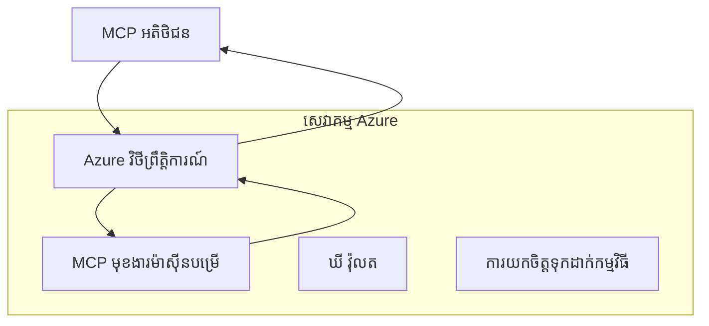
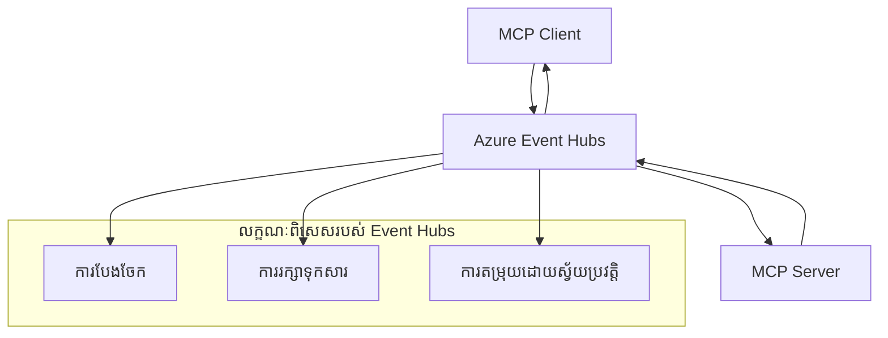

# MCP ការដឹកជញ្ជូនផ្ទាល់ខ្លួន - មគ្គុទេសក៏អំពីការអនុវត្តដែលមានកម្រិតខ្ពស់

Model Context Protocol (MCP) ផ្តល់ជាបម្លែងលំហឱ្យមានចលនាការដឹកជញ្ជូន ដោយអនុញ្ញាតឱ្យមានការអនុវត្តផ្ទាល់ខ្លួនសម្រាប់បរិយាកាសសហគ្រាសបុគ្គលក្ដៅ។ មគ្គុទេសក៏នេះដែលមានកម្រិតខ្ពស់ពិភាក្សាអំពីការអនុវត្តការដឹកជញ្ជូនផ្ទាល់ខ្លួនប្រើ Azure Event Grid និង Azure Event Hubs ជាគំរូប្រាកដសម្រាប់ការសាងសង់ដំណោះស្រាយ MCP ដែលអាចពង្រីកបាន និងមានបរិយាកាសពពក។

## ការណែនាំ

ខណៈដែលការដឹកជញ្ជូនស្តង់ដារ (stdio និង HTTP streaming) របស់ MCP រួមបញ្ចូលការប្រើប្រាស់ភាគច្រើន បរិយាកាសសហគ្រាសវាមានការទាមទារ ប្រព័ន្ធដឹកជញ្ជូនដែលមានលក្ខណៈពិសេសសម្រាប់បង្កើនការពង្រីក, ភាពទុកចិត្ត និងការរួមបញ្ចូលជាមួយឧបករណ៍ពពកស្រាប់មាន។ ការដឹកជញ្ជូនផ្ទាល់ខ្លួនអនុញ្ញាតឱ្យ MCP អាចប្រើសេវាកម្មផ្ញើសារ cloud-native សម្រាប់ការទំនាក់ទំនងមិនស្របពេល, រចនាសម្ព័ន្ធគ្រប់គ្រងដោយព្រឹត្តិការណ៍ និងដំណើរការចែកចាយ។

មេរៀននេះស្វែងយល់អំពីការអនុវត្តការដឹកជញ្ជូនដែលមានកម្រិតខ្ពស់គ្រប់លក្ខណៈនៃការបញ្ជាក់ MCP ចុងក្រោយ (2025-11-25), សេវាកម្មផ្ញើសារ Azure និងទ្រង់ទ្រាយការរួមបញ្ចូលសហគ្រាសដែលបានបង្កើត។

### **រចនាសម្ព័ន្ធការដឹកជញ្ជូន MCP**

**ពីភាពទម្រង់ MCP (2025-11-25):**

- **ការដឹកជញ្ជូនស្តង់ដារ**: stdio (បានផ្តល់អនុសាសន៍), HTTP streaming (សម្រាប់ស្ថានភាពចម្ងាយ)
- **ការដឹកជញ្ជូនផ្ទាល់ខ្លួន**: ណាមួយដែលអនុវត្តពិធីសព្ទអនុវត្ត MCP
- **ទ្រង់ទ្រាយសារជូនបញ្ជា**: JSON-RPC 2.0 ជាមួយការពង្រីកពិសេស MCP
- **ការទំនាក់ទំនងទម្រង់ទ្វេបត់**: តម្រូវឱ្យមានការទំនាក់ទំនង duplex ពេញលេញសម្រាប់ការជូនដំណឹង និងការឆ្លើយតប

## គោលបំណងសិក្សា

នៅចុងបញ្ចប់មេរៀននេះ អ្នកនឹងអាច:

- **យល់ដឹងអំពីតម្រូវការការដឹកជញ្ជូនផ្ទាល់ខ្លួន**: អនុវត្តព្រីកូចល MCP ក្នុងប្រព័ន្ធនៃការដឹកជញ្ជូនណាមួយដោយរក្សាទុកសោភណ្ឌភាព
- **សាងសង់ការដឹកជញ្ជូន Azure Event Grid**: បង្កើតម៉ាស៊ឺវ MCP ដំណើរការ​ដោយ​ព្រឹត្តិការណ៍​ប្រើ Azure Event Grid សម្រាប់ការលាយបញ្ចូលឥតម៉ាស៊ីនមេ
- **អនុវត្តការដឹកជញ្ជូន Azure Event Hubs**: រៀបចំដំណោះស្រាយ MCP ល្បឿនលឿនប្រើ Azure Event Hubs សម្រាប់ការផ្លាស់ប្តូរទិន្នន័យពេលវេលាច្រកចេញ
- **អនុវត្តប្រព័ន្ធសហគ្រាស**: ធ្វើការរួមបញ្ចូលការដឹកជញ្ជូនផ្ទាល់ខ្លួនជាមួយឧបករណ៍ Azure និងម៉ូដែលសន្តិសុខ
- **ដោះស្រាយភាពទុកចិត្តនៃការដឹកជញ្ជូន**: អនុវត្តភាពរឹងមាំនៃសារ, ការរៀបចំ, និងការគ្រប់គ្រងកំហុសសម្រាប់ស្ថានភាពសហគ្រាស
- **បង្កើនសមត្ថភាព**: រៀបចំដំណោះស្រាយការដឹកជញ្ជូនសម្រាប់ទំហំ, ពេលយឺត, និងគង់វង្ស

## **តម្រូវការការដឹកជញ្ជូន**

### **តម្រូវការមូលដ្ឋានពី MCP Specification (2025-11-25):**

```yaml
Message Protocol:
  format: "JSON-RPC 2.0 with MCP extensions"
  bidirectional: "Full duplex communication required"
  ordering: "Message ordering must be preserved per session"
  
Transport Layer:
  reliability: "Transport MUST handle connection failures gracefully"
  security: "Transport MUST support secure communication"
  identification: "Each session MUST have unique identifier"
  
Custom Transport:
  compliance: "MUST implement complete MCP message exchange"
  extensibility: "MAY add transport-specific features"
  interoperability: "MUST maintain protocol compatibility"
```

## **ការអនុវត្តការដឹកជញ្ជូន Azure Event Grid**

Azure Event Grid ផ្តល់សេវាកម្មផ្លូវចរាចរណ៍ព្រឹត្តិការណ៍ឥតម៉ាស៊ីនមែដែលសមនឹងបរិយាកាស MCP ដោយអនុវត្តមុខងារចល័តព្រឹត្តិការណ៍។ ការអនុវត្តនេះបង្ហាញពីរបៀបសាងសង់ប្រព័ន្ធ MCP ដើម្បីអាចពង្រីកបាននិងមានការតភ្ជាប់ទន់ភ្លន់។

### **ទិដ្ឋភាពរចនាសម្ព័ន្ធទូទៅ**



### **អនុវត្ត C# - ការដឹកជញ្ជូន Event Grid**

```csharp
using Azure.Messaging.EventGrid;
using Microsoft.Extensions.Azure;
using System.Text.Json;

public class EventGridMcpTransport : IMcpTransport
{
    private readonly EventGridPublisherClient _publisher;
    private readonly string _topicEndpoint;
    private readonly string _clientId;
    
    public EventGridMcpTransport(string topicEndpoint, string accessKey, string clientId)
    {
        _publisher = new EventGridPublisherClient(
            new Uri(topicEndpoint), 
            new AzureKeyCredential(accessKey));
        _topicEndpoint = topicEndpoint;
        _clientId = clientId;
    }
    
    public async Task SendMessageAsync(McpMessage message)
    {
        var eventGridEvent = new EventGridEvent(
            subject: $"mcp/{_clientId}",
            eventType: "MCP.MessageReceived",
            dataVersion: "1.0",
            data: JsonSerializer.Serialize(message))
        {
            Id = Guid.NewGuid().ToString(),
            EventTime = DateTimeOffset.UtcNow
        };
        
        await _publisher.SendEventAsync(eventGridEvent);
    }
    
    public async Task<McpMessage> ReceiveMessageAsync(CancellationToken cancellationToken)
    {
        // Event Grid is push-based, so implement webhook receiver
        // This would typically be handled by Azure Functions trigger
        throw new NotImplementedException("Use EventGridTrigger in Azure Functions");
    }
}

// Azure Function for receiving Event Grid events
[FunctionName("McpEventGridReceiver")]
public async Task<IActionResult> HandleEventGridMessage(
    [EventGridTrigger] EventGridEvent eventGridEvent,
    ILogger log)
{
    try
    {
        var mcpMessage = JsonSerializer.Deserialize<McpMessage>(
            eventGridEvent.Data.ToString());
        
        // Process MCP message
        var response = await _mcpServer.ProcessMessageAsync(mcpMessage);
        
        // Send response back via Event Grid
        await _transport.SendMessageAsync(response);
        
        return new OkResult();
    }
    catch (Exception ex)
    {
        log.LogError(ex, "Error processing Event Grid MCP message");
        return new BadRequestResult();
    }
}
```

### **អនុវត្ត TypeScript - ការដឹកជញ្ជូន Event Grid**

```typescript
import { EventGridPublisherClient, AzureKeyCredential } from "@azure/eventgrid";
import { McpTransport, McpMessage } from "./mcp-types";

export class EventGridMcpTransport implements McpTransport {
    private publisher: EventGridPublisherClient;
    private clientId: string;
    
    constructor(
        private topicEndpoint: string,
        private accessKey: string,
        clientId: string
    ) {
        this.publisher = new EventGridPublisherClient(
            topicEndpoint,
            new AzureKeyCredential(accessKey)
        );
        this.clientId = clientId;
    }
    
    async sendMessage(message: McpMessage): Promise<void> {
        const event = {
            id: crypto.randomUUID(),
            source: `mcp-client-${this.clientId}`,
            type: "MCP.MessageReceived",
            time: new Date(),
            data: message
        };
        
        await this.publisher.sendEvents([event]);
    }
    
    // ទទួល​ដំណើរការ​ដោយ​ដើម្បី​ព្រឹត្តិការណ៍​តាមរយៈ Azure Functions
    onMessage(handler: (message: McpMessage) => Promise<void>): void {
        // ការអនុវត្តន៍​នឹង​ប្រើ​ប្រាស់ Azure Functions Event Grid trigger
        // នេះ​ជា​ចំណុចប្រទាក់​ទ្រឹស្តី​សម្រាប់​អ្នកទទួល webhook
    }
}

// ការអនុវត្ត Azure Functions
import { app, InvocationContext, EventGridEvent } from "@azure/functions";

app.eventGrid("mcpEventGridHandler", {
    handler: async (event: EventGridEvent, context: InvocationContext) => {
        try {
            const mcpMessage = event.data as McpMessage;
            
            // ដំណើរការ​សារ MCP
            const response = await mcpServer.processMessage(mcpMessage);
            
            // ផ្ញើតប​ស្នង​តាមរយៈ Event Grid
            await transport.sendMessage(response);
            
        } catch (error) {
            context.error("Error processing MCP message:", error);
            throw error;
        }
    }
});
```

### **អនុវត្ត Python - ការដឹកជញ្ជូន Event Grid**

```python
from azure.eventgrid import EventGridPublisherClient, EventGridEvent
from azure.core.credentials import AzureKeyCredential
import asyncio
import json
from typing import Callable, Optional
import uuid
from datetime import datetime

class EventGridMcpTransport:
    def __init__(self, topic_endpoint: str, access_key: str, client_id: str):
        self.client = EventGridPublisherClient(
            topic_endpoint, 
            AzureKeyCredential(access_key)
        )
        self.client_id = client_id
        self.message_handler: Optional[Callable] = None
    
    async def send_message(self, message: dict) -> None:
        """Send MCP message via Event Grid"""
        event = EventGridEvent(
            data=message,
            subject=f"mcp/{self.client_id}",
            event_type="MCP.MessageReceived",
            data_version="1.0"
        )
        
        await self.client.send(event)
    
    def on_message(self, handler: Callable[[dict], None]) -> None:
        """Register message handler for incoming events"""
        self.message_handler = handler

# ការអនុវត្ត Azure Functions
import azure.functions as func
import logging

def main(event: func.EventGridEvent) -> None:
    """Azure Functions Event Grid trigger for MCP messages"""
    try:
        # វិភាគសារពី MCP ពីព្រឹត្តិការណ៍ Event Grid
        mcp_message = json.loads(event.get_body().decode('utf-8'))
        
        # ដំណើរការសារពី MCP
        response = process_mcp_message(mcp_message)
        
        # ផ្ញើការឆ្លើយតបវិញតាមរយៈ Event Grid
        # (ការអនុវត្តន៍នឹងបង្កើតអតិថិជន Event Grid ថ្មី)
        
    except Exception as e:
        logging.error(f"Error processing MCP Event Grid message: {e}")
        raise
```

## **ការអនុវត្តការដឹកជញ្ជូន Azure Event Hubs**

Azure Event Hubs ផ្តល់សមត្ថភាពចល័តល្បឿនលឿន និងការផ្ទាល់ពេលវេលាពិតប្រាកដសម្រាប់ស្ថានភាព MCP ដែលតម្រូវឱ្យយឺតតិច និងបរិមាណសារខ្ពស់។

### **ទិដ្ឋភាពរចនាសម្ព័ន្ធទូទៅ**



### **អនុវត្ត C# - ការដឹកជញ្ជូន Event Hubs**

```csharp
using Azure.Messaging.EventHubs;
using Azure.Messaging.EventHubs.Producer;
using Azure.Messaging.EventHubs.Consumer;
using System.Text;

public class EventHubsMcpTransport : IMcpTransport, IDisposable
{
    private readonly EventHubProducerClient _producer;
    private readonly EventHubConsumerClient _consumer;
    private readonly string _consumerGroup;
    private readonly CancellationTokenSource _cancellationTokenSource;
    
    public EventHubsMcpTransport(
        string connectionString, 
        string eventHubName,
        string consumerGroup = "$Default")
    {
        _producer = new EventHubProducerClient(connectionString, eventHubName);
        _consumer = new EventHubConsumerClient(
            consumerGroup, 
            connectionString, 
            eventHubName);
        _consumerGroup = consumerGroup;
        _cancellationTokenSource = new CancellationTokenSource();
    }
    
    public async Task SendMessageAsync(McpMessage message)
    {
        var messageBody = JsonSerializer.Serialize(message);
        var eventData = new EventData(Encoding.UTF8.GetBytes(messageBody));
        
        // Add MCP-specific properties
        eventData.Properties.Add("MessageType", message.Method ?? "response");
        eventData.Properties.Add("MessageId", message.Id);
        eventData.Properties.Add("Timestamp", DateTimeOffset.UtcNow);
        
        await _producer.SendAsync(new[] { eventData });
    }
    
    public async Task StartReceivingAsync(
        Func<McpMessage, Task> messageHandler)
    {
        await foreach (PartitionEvent partitionEvent in _consumer.ReadEventsAsync(
            _cancellationTokenSource.Token))
        {
            try
            {
                var messageBody = Encoding.UTF8.GetString(
                    partitionEvent.Data.EventBody.ToArray());
                var mcpMessage = JsonSerializer.Deserialize<McpMessage>(messageBody);
                
                await messageHandler(mcpMessage);
            }
            catch (Exception ex)
            {
                // Handle deserialization or processing errors
                Console.WriteLine($"Error processing message: {ex.Message}");
            }
        }
    }
    
    public void Dispose()
    {
        _cancellationTokenSource?.Cancel();
        _producer?.DisposeAsync().AsTask().Wait();
        _consumer?.DisposeAsync().AsTask().Wait();
        _cancellationTokenSource?.Dispose();
    }
}
```

### **អនុវត្ត TypeScript - ការដឹកជញ្ជូន Event Hubs**

```typescript
import { 
    EventHubProducerClient, 
    EventHubConsumerClient, 
    EventData 
} from "@azure/event-hubs";

export class EventHubsMcpTransport implements McpTransport {
    private producer: EventHubProducerClient;
    private consumer: EventHubConsumerClient;
    private isReceiving = false;
    
    constructor(
        private connectionString: string,
        private eventHubName: string,
        private consumerGroup: string = "$Default"
    ) {
        this.producer = new EventHubProducerClient(
            connectionString, 
            eventHubName
        );
        this.consumer = new EventHubConsumerClient(
            consumerGroup,
            connectionString,
            eventHubName
        );
    }
    
    async sendMessage(message: McpMessage): Promise<void> {
        const eventData: EventData = {
            body: JSON.stringify(message),
            properties: {
                messageType: message.method || "response",
                messageId: message.id,
                timestamp: new Date().toISOString()
            }
        };
        
        await this.producer.sendBatch([eventData]);
    }
    
    async startReceiving(
        messageHandler: (message: McpMessage) => Promise<void>
    ): Promise<void> {
        if (this.isReceiving) return;
        
        this.isReceiving = true;
        
        const subscription = this.consumer.subscribe({
            processEvents: async (events, context) => {
                for (const event of events) {
                    try {
                        const messageBody = event.body as string;
                        const mcpMessage: McpMessage = JSON.parse(messageBody);
                        
                        await messageHandler(mcpMessage);
                        
                        // បច្ចុប្បន្នភាពចំណុចពិនិត្យសម្រាប់ការដឹកជញ្ជូនយ៉ាងហោចណាស់ម្ដងទេ
                        await context.updateCheckpoint(event);
                    } catch (error) {
                        console.error("Error processing Event Hubs message:", error);
                    }
                }
            },
            processError: async (err, context) => {
                console.error("Event Hubs error:", err);
            }
        });
    }
    
    async close(): Promise<void> {
        this.isReceiving = false;
        await this.producer.close();
        await this.consumer.close();
    }
}
```

### **អនុវត្ត Python - ការដឹកជញ្ជូន Event Hubs**

```python
from azure.eventhub import EventHubProducerClient, EventHubConsumerClient
from azure.eventhub import EventData
import json
import asyncio
from typing import Callable, Dict, Any
import logging

class EventHubsMcpTransport:
    def __init__(
        self, 
        connection_string: str, 
        eventhub_name: str,
        consumer_group: str = "$Default"
    ):
        self.producer = EventHubProducerClient.from_connection_string(
            connection_string, 
            eventhub_name=eventhub_name
        )
        self.consumer = EventHubConsumerClient.from_connection_string(
            connection_string,
            consumer_group=consumer_group,
            eventhub_name=eventhub_name
        )
        self.is_receiving = False
    
    async def send_message(self, message: Dict[str, Any]) -> None:
        """Send MCP message via Event Hubs"""
        event_data = EventData(json.dumps(message))
        
        # បន្ថែមអចលនទ្រព្យជាពិសេសសម្រាប់ MCP
        event_data.properties = {
            "messageType": message.get("method", "response"),
            "messageId": message.get("id"),
            "timestamp": "2025-01-14T10:30:00Z"  # ប្រើពេលវេលានេះពិត
        }
        
        async with self.producer:
            event_data_batch = await self.producer.create_batch()
            event_data_batch.add(event_data)
            await self.producer.send_batch(event_data_batch)
    
    async def start_receiving(
        self, 
        message_handler: Callable[[Dict[str, Any]], None]
    ) -> None:
        """Start receiving MCP messages from Event Hubs"""
        if self.is_receiving:
            return
        
        self.is_receiving = True
        
        async with self.consumer:
            await self.consumer.receive(
                on_event=self._on_event_received(message_handler),
                starting_position="-1"  # ចាប់ផ្តើមពីដើម
            )
    
    def _on_event_received(self, handler: Callable):
        """Internal event handler wrapper"""
        async def handle_event(partition_context, event):
            try:
                # វិភាគសារ MCP ពីព្រឹត្តិការណ៍ Event Hubs
                message_body = event.body_as_str(encoding='UTF-8')
                mcp_message = json.loads(message_body)
                
                # ដំណើរការសារ MCP
                await handler(mcp_message)
                
                # បន្ទាន់សម័យចំណុចបញ្ចប់សម្រាប់ការដឹកជញ្ជូនយ៉ាងហោចណាស់មួយដង
                await partition_context.update_checkpoint(event)
                
            except Exception as e:
                logging.error(f"Error processing Event Hubs message: {e}")
        
        return handle_event
    
    async def close(self) -> None:
        """Clean up transport resources"""
        self.is_receiving = False
        await self.producer.close()
        await self.consumer.close()
```

## **ទ្រង់ទ្រាយការដឹកជញ្ជូនដែលមានកម្រិតខ្ពស់**

### **ភាពរឹងមាំនិងភាពទុកចិត្តនៃសារ**

```csharp
// Implementing message durability with retry logic
public class ReliableTransportWrapper : IMcpTransport
{
    private readonly IMcpTransport _innerTransport;
    private readonly RetryPolicy _retryPolicy;
    
    public async Task SendMessageAsync(McpMessage message)
    {
        await _retryPolicy.ExecuteAsync(async () =>
        {
            try
            {
                await _innerTransport.SendMessageAsync(message);
            }
            catch (TransportException ex) when (ex.IsRetryable)
            {
                // Log and retry
                throw;
            }
        });
    }
}
```

### **ការរួមបញ្ចូលសន្តិសុខការដឹកជញ្ជូន**

```csharp
// Integrating Azure Key Vault for transport security
public class SecureTransportFactory
{
    private readonly SecretClient _keyVaultClient;
    
    public async Task<IMcpTransport> CreateEventGridTransportAsync()
    {
        var accessKey = await _keyVaultClient.GetSecretAsync("EventGridAccessKey");
        var topicEndpoint = await _keyVaultClient.GetSecretAsync("EventGridTopic");
        
        return new EventGridMcpTransport(
            topicEndpoint.Value.Value,
            accessKey.Value.Value,
            Environment.MachineName
        );
    }
}
```

### **ការត្រួតពិនិត្យនិងមើលឃើញការដឹកជញ្ជូន**

```csharp
// Adding telemetry to custom transports
public class ObservableTransport : IMcpTransport
{
    private readonly IMcpTransport _transport;
    private readonly ILogger _logger;
    private readonly TelemetryClient _telemetryClient;
    
    public async Task SendMessageAsync(McpMessage message)
    {
        using var activity = Activity.StartActivity("MCP.Transport.Send");
        activity?.SetTag("transport.type", "EventGrid");
        activity?.SetTag("message.method", message.Method);
        
        var stopwatch = Stopwatch.StartNew();
        
        try
        {
            await _transport.SendMessageAsync(message);
            
            _telemetryClient.TrackDependency(
                "EventGrid",
                "SendMessage",
                DateTime.UtcNow.Subtract(stopwatch.Elapsed),
                stopwatch.Elapsed,
                true
            );
        }
        catch (Exception ex)
        {
            _telemetryClient.TrackException(ex);
            throw;
        }
    }
}
```

## **ស្ថានភាពរួមបញ្ចូលសហគ្រាស**

### **ស្ថានភាព 1៖ ដំណើរការចែកចាយ MCP**

ប្រើ Azure Event Grid ដើម្បីចែកចាយសំណើ MCP ទៅកាន់កណ្តាប់ដៃដំណើរការ​ច្រើន:

```yaml
Architecture:
  - MCP Client sends requests to Event Grid topic
  - Multiple Azure Functions subscribe to process different tool types
  - Results aggregated and returned via separate response topic
  
Benefits:
  - Horizontal scaling based on message volume
  - Fault tolerance through redundant processors
  - Cost optimization with serverless compute
```

### **ស្ថានភាព 2៖ ការផ្លាស់ប្តូរទិន្នន័យ MCP ពេលវេលាពិតប្រាកដ**

ប្រើ Azure Event Hubs សម្រាប់ប្រតិកម្ម MCP លើកំណត់ល្បឿនខ្ពស់:

```yaml
Architecture:
  - MCP Client streams continuous requests via Event Hubs
  - Stream Analytics processes and routes messages
  - Multiple consumers handle different aspect of processing
  
Benefits:
  - Low latency for real-time scenarios
  - High throughput for batch processing
  - Built-in partitioning for parallel processing
```

### **ស្ថានភាព 3៖ រចនាសម្ព័ន្ធការដឹកជញ្ជូនមិត្តភក្ដិ**

ផ្សំការដឹកជញ្ជូនច្រើនសម្រាប់ប្រើប្រាស់បញ្ហានានា:

```csharp
public class HybridMcpTransport : IMcpTransport
{
    private readonly IMcpTransport _realtimeTransport; // Event Hubs
    private readonly IMcpTransport _batchTransport;    // Event Grid
    private readonly IMcpTransport _fallbackTransport; // HTTP Streaming
    
    public async Task SendMessageAsync(McpMessage message)
    {
        // Route based on message characteristics
        var transport = message.Method switch
        {
            "tools/call" when IsRealtime(message) => _realtimeTransport,
            "resources/read" when IsBatch(message) => _batchTransport,
            _ => _fallbackTransport
        };
        
        await transport.SendMessageAsync(message);
    }
}
```

## **បង្កើនសមត្ថភាព**

### **បោះបង់សារសម្រាប់ Event Grid**

```csharp
public class BatchingEventGridTransport : IMcpTransport
{
    private readonly List<McpMessage> _messageBuffer = new();
    private readonly Timer _flushTimer;
    private const int MaxBatchSize = 100;
    
    public async Task SendMessageAsync(McpMessage message)
    {
        lock (_messageBuffer)
        {
            _messageBuffer.Add(message);
            
            if (_messageBuffer.Count >= MaxBatchSize)
            {
                _ = Task.Run(FlushMessages);
            }
        }
    }
    
    private async Task FlushMessages()
    {
        List<McpMessage> toSend;
        lock (_messageBuffer)
        {
            toSend = new List<McpMessage>(_messageBuffer);
            _messageBuffer.Clear();
        }
        
        if (toSend.Any())
        {
            var events = toSend.Select(CreateEventGridEvent);
            await _publisher.SendEventsAsync(events);
        }
    }
}
```

### **យុទ្ធសាស្ត្របំបែកផ្នែកសម្រាប់ Event Hubs**

```csharp
public class PartitionedEventHubsTransport : IMcpTransport
{
    public async Task SendMessageAsync(McpMessage message)
    {
        // Partition by client ID for session affinity
        var partitionKey = ExtractClientId(message);
        
        var eventData = new EventData(JsonSerializer.SerializeToUtf8Bytes(message))
        {
            PartitionKey = partitionKey
        };
        
        await _producer.SendAsync(new[] { eventData });
    }
}
```

## **សាកល្បងការដឹកជញ្ជូនផ្ទាល់ខ្លួន**

### **សាកល្បងថ្នាក់ក្រុមជាមួយ Test Doubles**

```csharp
[Test]
public async Task EventGridTransport_SendMessage_PublishesCorrectEvent()
{
    // Arrange
    var mockPublisher = new Mock<EventGridPublisherClient>();
    var transport = new EventGridMcpTransport(mockPublisher.Object);
    var message = new McpMessage { Method = "tools/list", Id = "test-123" };
    
    // Act
    await transport.SendMessageAsync(message);
    
    // Assert
    mockPublisher.Verify(
        x => x.SendEventAsync(
            It.Is<EventGridEvent>(e => 
                e.EventType == "MCP.MessageReceived" &&
                e.Subject == "mcp/test-client"
            )
        ),
        Times.Once
    );
}
```

### **សាកល្បងរួមបញ្ចូលជាមួយ Azure Test Containers**

```csharp
[Test]
public async Task EventHubsTransport_IntegrationTest()
{
    // Using Testcontainers for integration testing
    var eventHubsContainer = new EventHubsContainer()
        .WithEventHub("test-hub");
    
    await eventHubsContainer.StartAsync();
    
    var transport = new EventHubsMcpTransport(
        eventHubsContainer.GetConnectionString(),
        "test-hub"
    );
    
    // Test message round-trip
    var sentMessage = new McpMessage { Method = "test", Id = "123" };
    McpMessage receivedMessage = null;
    
    await transport.StartReceivingAsync(msg => {
        receivedMessage = msg;
        return Task.CompletedTask;
    });
    
    await transport.SendMessageAsync(sentMessage);
    await Task.Delay(1000); // Allow for message processing
    
    Assert.That(receivedMessage?.Id, Is.EqualTo("123"));
}
```

## **អនុវត្តបែបបទល្អ និងមគ្គុទេសក៏**

### **គោលការណ៍រចនាការដឹកជញ្ជូន**

1. **ភាពដាច់មុខ**: ធានាថាការត្រួតពិនិត្យសារជាដាច់មុខដើម្បីដោះស្រាយការផ្ទេរសារដដែល
2. **ការគ្រប់គ្រងកំហុស**: អនុវត្តការគ្រប់គ្រងកំហុសទូលំទូលាយ និងជួរការរស់នៅដ៏ស្លាប់
3. **ការត្រួតពិនិត្យ**: បន្ថែមការត្រួតពិនិត្យលម្អិត និងការត្រួតពិនិត្យសុខភាព
4. **សន្តិសុខ**: ប្រើអត្តសញ្ញាណដែលគ្រប់គ្រង និងការចូលប្រើតិចបំផុត
5. **សមត្ថភាព**: រៀបចំសម្រាប់តម្រូវការពេលយឺត និងចំនួនកំណត់

### **អនុសាសន៍ជាក់លាក់សម្រាប់ Azure**

1. **ប្រើអត្តសញ្ញាណគ្រប់គ្រង**: កុំប្រើខ្សែការតភ្ជាប់ក្នុងការផលិត
2. **អនុវត្តបន្ទះបាត**: ការពារការបាត់បង់សេវាកម្ម Azure
3. **តាមដានថ្លៃ**: តាមដានបរិមាណសារ និងថ្លៃដំណើរការ
4. **រៀបចំបែបផែនសម្រាប់ការពង្រីក**: រៀបចំបំណែកនិងការពង្រីកដំណាក់កាលដំបូង
5. **សាកល្បងយ៉ាងពេញលេញ**: ប្រើ Azure DevTest Labs សម្រាប់ការសាកល្បងកាន់តែពេញលេញ

## **សង្ខេប**

ការដឹកជញ្ជូន MCP ផ្ទាល់ខ្លួនអាចគាំទ្រស្ថានភាពសហគ្រាសដ៏មានឥទ្ធិពលដោយប្រើសេវាកម្មផ្ញើសាររបស់ Azure។ តាមរយៈការអនុវត្ត Event Grid ឬ Event Hubs អ្នកអាចសាងសង់ដំណោះស្រាយ MCP ដែលអាចពង្រីកបាន និងទុកចិត្តបានអាស្រ័យលើរចនាសម្ព័ន្ធ Azure ស្រាប់។

គំរូដែលផ្តល់ជូនបង្ហាញពីគំរូផលិតកម្មសម្រាប់ការអនុវត្តការដឹកជញ្ជូនផ្ទាល់ខ្លួន ខណៈដែលរក្សាទុកសោភណ្ឌភាពកម្មវិធី MCP និងអនុវត្តបែបបទល្អរបស់ Azure ។

## **ធនធានបន្ថែម**

- [MCP Specification 2025-11-25](https://modelcontextprotocol.io/specification/2025-11-25/)
- [Azure Event Grid Documentation](https://docs.microsoft.com/azure/event-grid/)
- [Azure Event Hubs Documentation](https://docs.microsoft.com/azure/event-hubs/)
- [Azure Functions Event Grid Trigger](https://docs.microsoft.com/azure/azure-functions/functions-bindings-event-grid)
- [Azure SDK for .NET](https://github.com/Azure/azure-sdk-for-net)
- [Azure SDK for TypeScript](https://github.com/Azure/azure-sdk-for-js)
- [Azure SDK for Python](https://github.com/Azure/azure-sdk-for-python)

---

> *មគ្គុទេសក៏នេះផ្តោតលើទ្រង់ទ្រាយអនុវត្តដែលអាចប្រើប្រាស់បានសម្រាប់ប្រព័ន្ធ MCP ថ្មី។ សូមត្រួតពិនិត្យការអនុវត្តការដឹកជញ្ជូនឲ្យត្រូវតាមតម្រូវការរបស់អ្នក និងកំណត់ដែនសេវាកម្ម Azure។*
> **ស្តង់ដារបច្ចុប្បន្ន**: មគ្គុទេសក៏នេះបង្ហាញតម្រូវការការដឹកជញ្ជូន និងទ្រង់ទ្រាយអនុវត្តកម្រិតខ្ពស់សម្រាប់បរិយាកាសសហគ្រាស [MCP Specification 2025-11-25](https://modelcontextprotocol.io/specification/2025-11-25/)។

## តើបន្ទាប់បើយើងទៅ
- [6. ការចូលរួមសហគមន៍](../../06-CommunityContributions/README.md)

---

<!-- CO-OP TRANSLATOR DISCLAIMER START -->
**ការបដិសេធ**:
ឯកសារនេះត្រូវបានបម្លែងភាសា ដោយប្រើសេវាបម្លែងភាសា AI [Co-op Translator](https://github.com/Azure/co-op-translator)។ ទោះយើងខ្ញុំមានក្តីប្រាថ្នាឱ្យបានច្បាស់លាស់ តែសូមយល់ដឹងថាការបម្លែងដោយស្វ័យប្រវត្តិក៏អាចមានកំហុសឬភាពមិនត្រឹមត្រូវ។ ឯកសារដើមជាភាសាទីតាំងគួរត្រូវបានគេប្រើជាប្រភពច្បាស់លាស់។ សម្រាប់ព័ត៌មានសំខាន់ៗ សូមណែនាំឱ្យប្រើប្រាស់ការប្រែដោយមនុស្សជំនាញ។ យើងខ្ញុំមិនទទួលខុសត្រូវចំពោះការយល់ច្រឡំ ឬការបកស្រាយខុសបន្ទាប់ពីការប្រើប្រាស់ការបម្លែងនេះនោះទេ។
<!-- CO-OP TRANSLATOR DISCLAIMER END -->