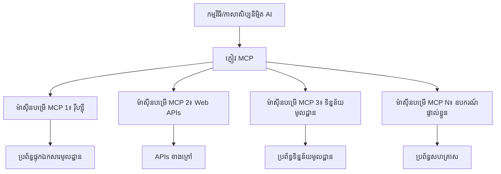

# 🌐 ម៉ូឌុល 2: MCP ជាមួយមូលដ្ឋាន Microsoft Foundry Toolkit

[]()
[]()
[]()

## 📋 គោលបំណងការសិក្សា

នៅចុងម៉ូឌុលនេះ អ្នកនឹងអាច៖
- ✅ យល់ដឹងអំពីស្ថាបត្យកម្ម និងអត្ថប្រយោជន៍នៃ Model Context Protocol (MCP)
- ✅ ស្វែងយល់អំពីបរិយាកាសម៉ាស៊ីនមេ MCP របស់ Microsoft
- ✅ សម្ពន្ធ MCP server ជាមួយ Microsoft Foundry Toolkit Agent Builder
- ✅ បង្កើតភ្នាក់ងារជំនួយកម្មវិធីជាមួយ Playwright MCP
- ✅ កំណត់រចនាសម្ព័ន្ធ និងពិនិត្យមើលឧបករណ៍ MCP នៅក្នុងភ្នាក់ងាររបស់អ្នក
- ✅ នាំចេញ និងចេញផ្សាយភ្នាក់ងារដែលរួមបញ្ចូល MCP សម្រាប់ប្រើប្រាស់ក្នុងទិន្នផល

## 🎯 បន្ថែមលើម៉ូឌុល 1

នៅម៉ូឌុល 1 យើងបានរៀនមូលដ្ឋាននៃ Microsoft Foundry Toolkit ហើយបង្កើតភ្នាក់ងារពី Python ជាលើកដំបូង។ ឥឡូវនេះ យើងនឹង **បង្កើនកម្លាំង** ភ្នាក់ងាររបស់អ្នកដោយភ្ជាប់ពួកគេទៅឧបករណ៍ និងសេវាកម្មខាងក្រៅតាមរយៈ **Model Context Protocol (MCP)** ដែលមានភាពច្នៃប្រឌិតបំផុត។

គិតថាវាជាការធ្វើឲ្យ កាលគណនាកម្មម(Simple calculator) ក្លាយជាកុំព្យូទ័រពេញលេញ - ភ្នាក់ងារ AI របស់អ្នកនឹងមានសមត្ថភាពក្នុង៖
- 🌐 រុករក និងអន្តរកម្មជាមួយគេហទំព័រ
- 📁 ចូលដំណើរការនិងគ្រប់គ្រងឯកសារ
- 🔧 សម្ពន្ធជាមួយប្រព័ន្ធសហគ្រាស
- 📊 ដំណើរការទិន្នន័យពេលវេលាពិតពី API

## 🧠 យល់ដឹងអំពី Model Context Protocol (MCP)

### 🔍 MCP គឺជាអ្វី?

Model Context Protocol (MCP) គឺជា **"USB-C សម្រាប់កម្មវិធី AI"** - គោលការណ៍បើកដែលកំពុងបញ្ចេញរួមបញ្ចូល Model Language ចំណុចធំៗ (LLMs) ទៅឧបករណ៍ខាងក្រៅ ទិន្នន័យ និងសេវាកម្ម។ ដូចជា USB-C បានបំបាត់ភាពមិនលំអៀងក្នុងខ្សែព្រិលដោយផ្ដល់ឧបករណ៍ភ្ជាប់តែមួយ ទេ MCP ក៏បំបាត់ភាពស្មុគស្មាញក្នុងការរួមបញ្ចូល AI ដោយប្រើប្រព័ន្ធតែមួយស្តង់ដារដែរ។

### 🎯 បញ្ហាដែល MCP ដោះស្រាយ

**មុន MCP:**
- 🔧 សម្ពន្ធផ្ទាល់ខ្លួនសម្រាប់ឧបករណ៍នីមួយៗ
- 🔄 ការចាក់បំណងដោយអ្នកផ្គត់ផ្គង់ជាមួយដំណោះស្រាយបិទ
- 🔒 ភាពងាយរងគ្រោះសុវត្ថិភាពពីការតភ្ជាប់មិនទៀងទាត់
- ⏱️ consuming development months for simple integrations

**មាន MCP:**
- ⚡ ការសម្ពន្ធឧបករណ៍ដោយភ្ជាប់ និងប្រើបានភ្លាមៗ
- 🔄 ស្ថាបត្យកម្មដោយក្រៅផ្នែកអ្នកផ្គត់ផ្គង់
- 🛡️ ភាពសុវត្ថិភាពល្អបំផុតបញ្ចូលក្នុងប្រព័ន្ធ
- 🚀 រយៈពេលបន្សំខ្លីសម្រាប់បន្ថែមមុខងារថ្មី

### 🏗️ ការជ្រាបច្រកស្ថាបត្យកម្ម MCP

MCP ធ្វើការតាមស្ថាបត្យកម្ម **client-server** ដែលបង្កើតបរិយាកាសដែលមានសុវត្ថិភាព និងអាចកំណត់បរិមាណបានៈ



**🔧 ផ្នែកស្នូលៈ**

| ផ្នែក | តួនាទី | ឧទាហរណ៍ |
|---------|---------|------------|
| **ម៉ាស៊ីនមេ MCP** | កម្មវិធីដែលប្រើសេវាកម្ម MCP | Claude Desktop, VS Code, Microsoft Foundry Toolkit |
| **ម៉ាស៊ីនភ្ញៀវ MCP** | អ្នកចាប់ផ្តើមប្រព័ន្ធ(protocol handlers) (១:១ ជាមួយម៉ាស៊ីនមេ) | រួមបញ្ចូលក្នុងកម្មវិធីម៉ាស៊ីនមេ |
| **ម៉ាស៊ីនមេ MCP** | បង្ហាញសមត្ថភាពតាមរយៈប្រព័ន្ធស្តង់ដា | Playwright, Files, Azure, GitHub |
| **ស្រទាប់ផ្លូវដឹកជញ្ជូន** | វិធីសាស្ត្រ ទំនាក់ទំនង | stdio, HTTP, WebSockets |


## 🏢 បរិយាកាសម៉ាស៊ីនមេ MCP របស់ Microsoft

Microsoft ដឹកនាំបរិយាកាស MCP ជាមួយកំណត់ជួបម៉ាស៊ីនមេជំនាន់ខ្ពស់ដែលដោះស្រាយតម្រូវការអាជីវកម្មពិតប្រាកដ។

### 🌟 ម៉ាស៊ីនមេ MCP របស់ Microsoft ដែលមានលក្ខណៈពិសេស

#### 1. ☁️ ម៉ាស៊ីនមេ Azure MCP
**🔗 ផ្ទុករាល់ម៉ាស៊ីនមេ**: [azure/azure-mcp](https://github.com/azure/azure-mcp)
**🎯 គោលបំណង**: គ្រប់គ្រងធនធាន Azure ពេញលេញជាមួយការរួមបញ្ចូល AI

**✨ លក្ខណៈពិសេសសំខាន់ៗ:**
- ការផ្គត់ផ្គង់ហេដ្ឋារចនាសម្ព័ន្ធដោយប្រកាស
- ត្រួតពិនិត្យធនធាននៅពេលវេលាពិត
- សំណើរការកាត់បន្ថយថ្លៃដើម
- ការត្រួតពិនិត្យនឹងផ្តល់ភាពស្រួលសុវត្ថិភាព

**🚀 ករណីប្រើប្រាស់:**
- បច្ចេកវិទ្យា Infrastructure-as-Code ជាមួយជំនួយ AI
- ការកំណត់ប្រវែងធនធានដោយស្វ័យប្រវត្តិ
- ការកាត់បន្ថយថ្លៃរ៉ែពពក
- ការប្រតិបត្តិការស្វ័យប្រវត្តិក្នុង DevOps

#### 2. 📊 Microsoft Dataverse MCP
**📚 ឯកសារយោង**: [Microsoft Dataverse Integration](https://go.microsoft.com/fwlink/?linkid=2320176)
**🎯 គោលបំណង**: ចំណុចចូលភាសាស្រួលសម្រាប់ទិន្នន័យអាជីវកម្ម

**✨ លក្ខណៈពិសេសសំខាន់ៗ:**
- សំណួរទិន្នន័យជាភាសាធម្មតា
- យល់ដឹងបរិបទអាជីវកម្ម
- គំរូការស្នើសុំប្ដូរតាមតំរូវការ
- គ្រប់គ្រងទិន្នន័យសហគ្រាស

**🚀 ករណីប្រើប្រាស់:**
- របាយការណ៍វិញ្ញាសាអាជីវកម្ម
- វិភាគទិន្នន័យអតិថិជន
- ចំណេះដឹងលក់
- សំណួរអំពីការអនុវត្តតាមវិធានការ

#### 3. 🌐 ម៉ាស៊ីនមេ Playwright MCP
**🔗 ផ្ទុករាល់ម៉ាស៊ីនមេ**: [microsoft/playwright-mcp](https://github.com/microsoft/playwright-mcp)
**🎯 គោលបំណង**: សមត្ថភាពអូតូម៉ាទីកកម្មរុករក និងអន្តរកម្មវែប

**✨ លក្ខណៈពិសេសសំខាន់ៗ:**
- អូតូម៉ាទីកកម្មរុករកពីគ្រប់កម្មវិធីរក្សាទុក(Chrome, Firefox, Safari)
- ការរកឃើញធាតុប្រណិត
- ការថតរូប និងបង្កើត PDF
- ការតាមដានចរាចរណ៍បណ្ដាញ

**🚀 ករណីប្រើប្រាស់:**
- សាកល្បងស្វ័យប្រវត្តិកម្ម
- ការទាញយក និងដកស្រង់ទិន្នន័យវែប
- ដឹកជញ្ជូន UI/UX
- វិភាគប្រកួតប្រជែងស្វ័យប្រវត្តិ

#### 4. 📁 ម៉ាស៊ីនមេ Files MCP
**🔗 ផ្ទុករាល់ម៉ាស៊ីនមេ**: [microsoft/files-mcp-server](https://github.com/microsoft/files-mcp-server)
**🎯 គោលបំណង**: ប្រតិបត្តិការរបៀបឯកសារយ៉ាងឆ្លាតវៃ

**✨ លក្ខណៈពិសេសសំខាន់ៗ:**
- ការគ្រប់គ្រងឯកសារដោយប្រកាស
- ការសម្របសម្រួលមាតិកា
- បញ្ចូលការត្រួតពិនិត្យកំណែ
- ដកស្រង់ទិន្នន័យមេតា

**🚀 ករណីប្រើប្រាស់:**
- គ្រប់គ្រងឯកសារ
- រៀបចំឃ្លាំងកូដ
- សាកល្បងការចេញផ្សាយមាតិកា
- ការគ្រប់គ្រងឯកសារលំហូរទិន្នន័យ

#### 5. 📝 ម៉ាស៊ីនមេ MarkItDown MCP
**🔗 ផ្ទុករាល់ម៉ាស៊ីនមេ**: [microsoft/markitdown](https://github.com/microsoft/markitdown)
**🎯 គោលបំណង**: ដំណើរការ និងកែប្រែ Markdown កម្រិតខ្ពស់

**✨ លក្ខណៈពិសេសសំខាន់ៗ:**
- វិភាគ Markdown ដែលសំបូរបែប
- បម្លែងរូបមន្ត (MD ↔ HTML ↔ PDF)
- វិភាគរចនាសម្ព័ន្ធមាតិកា
- ការដំណើរការគំរូ

**🚀 ករណីប្រើប្រាស់:**
- ការប្រើប្រាស់ឯកសារបច្ចេកទេស
- ការគ្រប់គ្រងមាតិកា
- ការបង្កើតរបាយការណ៍
- ស្វ័យប្រវត្តិមូលដ្ឋានចំណេះដឹង

#### 6. 📈 ម៉ាស៊ីនមេ Clarity MCP
**📦 កញ្ចប់**: [@microsoft/clarity-mcp-server](https://www.npmjs.com/package/@microsoft/clarity-mcp-server)
**🎯 គោលបំណង**: វិភាគវែបសាយ និងការយល់ដឹងពីអាកប្បកិរិយាអ្នកប្រើប្រាស់

**✨ លក្ខណៈពិសេសសំខាន់ៗ:**
- វិភាគទិន្នន័យផែនទីកំដៅកំដៅ
- ការថតសកម្មភាពអ្នកប្រើប្រាស់
- គំរោងប្រសិទ្ធភាព
- ការវិភាគផ្លូវបំលែង

**🚀 ករណីប្រើប្រាស់:**
- បង្កើនប្រសិទ្ធភាពវែបសាយ
- ស្រាវជ្រាវបទពិសោធន៍អ្នកប្រើប្រាស់
- ការវិភាគ A/B សាកល្បង
- ផ្ទាំងគ្រប់គ្រងបញ្ញា​អាជីវកម្ម

### 🌍 បរិយាកាសសហគមន៍

ក្រៅពីម៉ាស៊ីនមេរបស់ Microsoft បរិយាកាស MCP រួមបញ្ចូល៖
- **🐙 GitHub MCP**: គ្រប់គ្រងឃ្លាំង និងវិភាគកូដ
- **🗄️ Database MCPs**: ការសម្ពន្ធ PostgreSQL, MySQL, MongoDB
- **☁️ Cloud Provider MCPs**: ឧបករណ៍ AWS, GCP, Digital Ocean
- **📧 Communication MCPs**: សម្ពន្ធ Slack, Teams, អ៊ីមែល

## 🛠️ មិនាង​ដៃបំផុត: បង្កើតភ្នាក់ងារអូតូម៉ាទីកកម្មរុករក

**🎯 គោលដៅគម្រោង**: បង្កើតភ្នាក់ងារអូតូម៉ាទីកកម្មរុក្ខជាតិឆ្លាតវៃដោយប្រើម៉ាស៊ីនមេ Playwright MCP ដែលអាចរុករកគេហទំព័រ ដកស្រង់ព័ត៌មាន និងអនុវត្តអន្តរកម្មវែបស្មុគស្មាញ។

### 🚀 ជំហានទី 1: ការតំនើបភ្នាក់ងារ

#### ជំហានទី 1: ចាប់ផ្តើមភ្នាក់ងារ
1. **បើក Microsoft Foundry Toolkit Agent Builder**
2. **បង្កើតភ្នាក់ងារថ្មី** ជាមួយការកំណត់ដូចខាងក្រោម៖
   - **ឈ្មោះ**: `BrowserAgent`
   - **ម៉ូឌែល**: ជ្រើស GPT-4o 


### 🔧 ជំហានទី 2: សម្ពន្ធ MCP

#### ជំហានទី 3: បន្ថែមការសម្ពន្ធម៉ាស៊ីនមេ MCP
1. **ចូលទៅផ្នែកឧបករណ៍** ក្នុង Agent Builder
2. **ចុច "Add Tool"** ដើម្បីបើកម៉ឺនុយសម្ពន្ធ
3. **ជ្រើស "MCP Server"** ពីជម្រើសដែលមាន


**🔍 យល់ដឹងអំពីប្រភេទឧបករណ៍:**
- **ឧបករណ៍បញ្ចូលរួច**: មុខងារមូលដ្ឋាន Microsoft Foundry Toolkit
- **ម៉ាស៊ីនមេ MCP**: ការសម្ពន្ធសេវាកម្មខាងក្រៅ
- **API ផ្ទាល់ខ្លួន**: ចំណុចបញ្ចប់សេវាកម្មផ្ទាល់របស់អ្នក
- **ការហៅមុខងារ**: ចូលប្រើមុខងារម៉ូឌែលដោយផ្ទាល់

#### ជំហានទី 4: ជ្រើសម៉ាស៊ីនមេ MCP
1. **ជ្រើសជម្រើស "MCP Server"** ដើម្បីបន្ត


2. **រុករកកាតាឡុក MCP** ដើម្បីស្វែងយល់ពីការសម្ពន្ធមានស្រាប់


### 🎮 ជំហានទី 3: ការកំណត់ Playwright MCP

#### ជំហានទី 5: ជ្រើសនិងកំណត់ Playwright
1. **ចុច "Use Featured MCP Servers"** ដើម្បីចូលម៉ាស៊ីនមេដែលបានផ្ទៀងផ្ទាត់
2. **ជ្រើស "Playwright"** ពីបញ្ជីដែលបានណែនាំ
3. **ទទួល MCP ID ម្ដងទៀត ឬកែប្រែបរិយាកាសរបស់អ្នក**


#### ជំហានទី 6: បើកការអនុញ្ញាតភាព Playwright
**🔑 ជំហានសំខាន់**: ជ្រើសមុខងារ Playwright ទាំងអស់សម្រាប់មុខងារពេញលេញ


**🛠️ ឧបករណ៍ Playwright ចាំបាច់:**
- **រុករក**: `goto`, `goBack`, `goForward`, `reload`
- **អន្តរកម្ម**: `click`, `fill`, `press`, `hover`, `drag`
- **ដកស្រង់**: `textContent`, `innerHTML`, `getAttribute`
- **ផ្ទៀងផ្ទាត់**: `isVisible`, `isEnabled`, `waitForSelector`
- **ចាប់យក**: `screenshot`, `pdf`, `video`
- **បណ្ដាញ**: `setExtraHTTPHeaders`, `route`, `waitForResponse`

#### ជំហានទី 7: ផ្ទៀងផ្ទាត់ការសម្ពន្ធជោគជ័យ
**✅ សញ្ញាជោគជ័យ:**
- ឧបករណ៍ទាំងអស់បង្ហាញនៅក្នុងរបស់ Agent Builder
- គ្មានសារកំហុសនៅផ្ទាំងសម្ពន្ធ
- ស្ថានភាពម៉ាស៊ីនមេ Playwright បង្ហាញ "Connected"


**🔧 ដោះស្រាយបញ្ហាទូទៅ:**
- **ការតភ្ជាប់បរាជ័យ**៖ ពិនិត្យការតភ្ជាប់អ៊ីនធើណែត និងការកំណត់ firewall
- **គ្មានឧបករណ៍**៖ ត្រួតពិនិត្យថាជ្រើសវិធីសាស្ត្រទាំងអស់នៅពេលកំណត់
- **កំហុសសិទ្ធិ**៖ ពិនិត្យមើលថា VS Code មានសិទ្ធិប្រើប្រព័ន្ធត្រឹមត្រូវ

### 🎯 ជំហានទី 4: វិចិត្រស prompts កំណត់ប្រព័ន្ធ

#### ជំហានទី 8: រចនាប្រឹង prompt ឆ្លាតវៃ
បង្កើត prompt ពិសេសដែលប្រើបានលើតាំងពេញលេញនៃសមត្ថភាព Playwright៖

```markdown
# Web Automation Expert System Prompt

## Core Identity
You are an advanced web automation specialist with deep expertise in browser automation, web scraping, and user experience analysis. You have access to Playwright tools for comprehensive browser control.

## Capabilities & Approach
### Navigation Strategy
- Always start with screenshots to understand page layout
- Use semantic selectors (text content, labels) when possible
- Implement wait strategies for dynamic content
- Handle single-page applications (SPAs) effectively

### Error Handling
- Retry failed operations with exponential backoff
- Provide clear error descriptions and solutions
- Suggest alternative approaches when primary methods fail
- Always capture diagnostic screenshots on errors

### Data Extraction
- Extract structured data in JSON format when possible
- Provide confidence scores for extracted information
- Validate data completeness and accuracy
- Handle pagination and infinite scroll scenarios

### Reporting
- Include step-by-step execution logs
- Provide before/after screenshots for verification
- Suggest optimizations and alternative approaches
- Document any limitations or edge cases encountered

## Ethical Guidelines
- Respect robots.txt and rate limiting
- Avoid overloading target servers
- Only extract publicly available information
- Follow website terms of service
```

#### ជំហានទី 9: បង្កើត prompt អ្នកប្រើប្រាស់ឌីណាមិច
រចនាឧទាហរណ៍ prompt នានា៖

**🌐 ឧទាហរណ៍វិភាគវែប:**
```markdown
Navigate to github.com/kinfey and provide a comprehensive analysis including:
1. Repository structure and organization
2. Recent activity and contribution patterns  
3. Documentation quality assessment
4. Technology stack identification
5. Community engagement metrics
6. Notable projects and their purposes

Include screenshots at key steps and provide actionable insights.
```


### 🚀 ជំហានទី 5: ប្រតិបត្តិ និងសាកល្បង

#### ជំហានទី 10: ប្រតិបត្តិ អូតូម៉ាទីកកម្មដំបូងរបស់អ្នក
1. **ចុច "Run"** ដើម្បីចាប់ផ្តើមលំហាត់ស្វ័យប្រវត្តិ
2. **ត្រួតពិនិត្យការប្រតិបត្តិពេលវេលាពិត**៖
   - កម្មវិធីរុករក Chrome បើកឡើងដោយស្វ័យប្រវត្តិ
   - ភ្នាក់ងាររុករកទៅគេហទំព័រគោលដៅ
   - យករូបថតអេក្រង់នៅរាល់ជំហានសំខាន់ៗ
   - លទ្ធផលវិភាគបង្ហាញពេលវេលាពិត


#### ជំហានទី 11: វិភាគលទ្ធផលនិងចំណេះដឹង
ពិនិត្យលទ្ធផលជាសង្ខេបនៅក្នុងផ្ទាំង Agent Builder៖


### 🌟 ជំហានទី 6: សមត្ថភាពខ្ពស់ និងចេញផ្សាយ

#### ជំហានទី 12: នាំចេញ និងចេញផ្សាយផលិតកម្ម
Agent Builder ឧបត្ថម្ភជម្រើសចេញផ្សាយច្រើនប្រភេទ៖


## 🎓 សង្ខេបម៉ូឌុល 2 និងជំហានបន្ទាប់

### 🏆 វិញ្ញាបនប័ត្រជោគជ័យ៖ អ្នកឯកទេស MCP Integration

**✅ ជំនាញដែលបានយល់ដឹង:**
- [ ] យល់ដឹងស្ថាបត្យកម្ម MCP និងអត្ថប្រយោជន៍
- [ ] រុករកបរិយាកាសម៉ាស៊ីនមេ MCP របស់ Microsoft
- [ ] សម្ពន្ធ Playwright MCP ជាមួយ Microsoft Foundry Toolkit
- [ ] បង្កើតភ្នាក់ងារអូតូម៉ាទីកកម្មរុករកមានជំនាញ
- [ ] វិចិត្រស prompt ខ្ពស់សម្រាប់ការអូតូម៉ាទីកកម្មវែប

### 📚 ប្រភពព័ត៌មានបន្ថែម

- **🔗 គោលការណ៍ MCP**: [ឯកសារម៉ូឌែលស្តង់ដារ](https://modelcontextprotocol.io/)
- **🛠️ API Playwright**: [ឯកសារពេញលេញ](https://playwright.dev/docs/api/class-playwright)
- **🏢 ម៉ាស៊ីនមេ Microsoft MCP**: [មគ្គុទេសក៍សម្ពន្ធសហគ្រាស](https://github.com/microsoft/mcp-servers)
- **🌍 ឧទាហរណ៍សហគមន៍**: [សាលារៀនម៉ាស៊ីនមេ MCP](https://github.com/modelcontextprotocol/servers)

**🎉 សូមអបអរសាទរ!** អ្នកបានជោគជ័យក្នុងការគ្រប់គ្រងការសម្ពន្ធ MCP ហើយឥឡូវ អ្នកអាចបង្កើតភ្នាក់ងារ AI សម្រាប់ផលិតកម្មដែលមានសមត្ថភាពដោយឧបករណ៍ខាងក្រៅ!

### 🔜 បន្តទៅម៉ូឌុលបន្ទាប់

ត្រៀមខ្លួនដាក់ជំនាញ MCP របស់អ្នកទៅកម្រិតបន្ទាប់? បន្តទៅ **[ម៉ូឌុល 3: ការអភិវឌ្ឍ MCP កម្រិតខ្ពស់ជាមួយ Microsoft Foundry Toolkit](../lab3/README.md)** ដែលអ្នកនឹងរៀន៖
- បង្កើតម៉ាស៊ីនមេ MCP ផ្ទាល់ខ្លួន
- កំណត់រចនាសម្ព័ន្ធ និងប្រើ MCP Python SDK ថ្មីៗ
- តំឡើង MCP Inspector សម្រាប់ដំណោះស្រាយកំហុស
- បង្កើតការងារអភិវឌ្ឍ MCP server កម្រិតខ្ពស់
- បង្កើតម៉ាស៊ីនមេ Weather MCP ពីដើមប្រកបដោយជោគជ័យ

---

<!-- CO-OP TRANSLATOR DISCLAIMER START -->
**ការបដិសេធ**:
ឯកសារនេះត្រូវបានបម្លែងភាសា ដោយប្រើសេវាបម្លែងភាសា AI [Co-op Translator](https://github.com/Azure/co-op-translator)។ ទោះយើងខ្ញុំមានក្តីប្រាថ្នាឱ្យបានច្បាស់លាស់ តែសូមយល់ដឹងថាការបម្លែងដោយស្វ័យប្រវត្តិក៏អាចមានកំហុសឬភាពមិនត្រឹមត្រូវ។ ឯកសារដើមជាភាសាទីតាំងគួរត្រូវបានគេប្រើជាប្រភពច្បាស់លាស់។ សម្រាប់ព័ត៌មានសំខាន់ៗ សូមណែនាំឱ្យប្រើប្រាស់ការប្រែដោយមនុស្សជំនាញ។ យើងខ្ញុំមិនទទួលខុសត្រូវចំពោះការយល់ច្រឡំ ឬការបកស្រាយខុសបន្ទាប់ពីការប្រើប្រាស់ការបម្លែងនេះនោះទេ។
<!-- CO-OP TRANSLATOR DISCLAIMER END -->