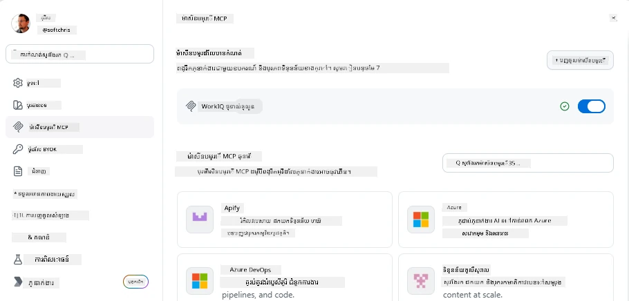
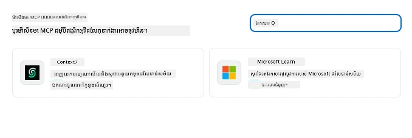
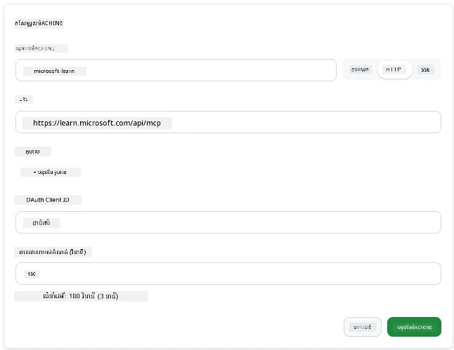
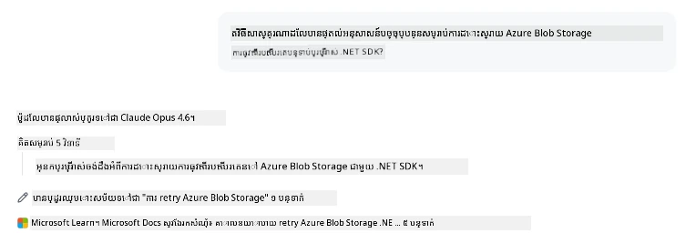
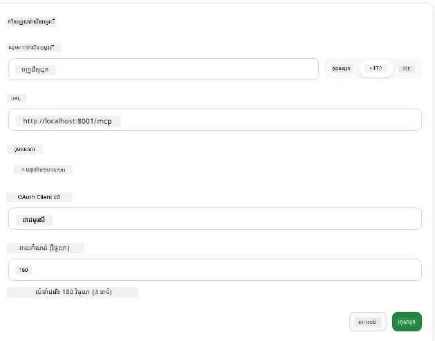
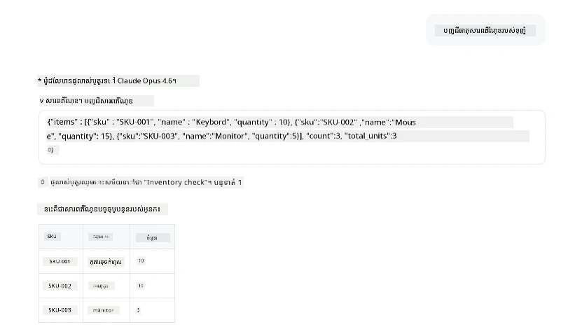
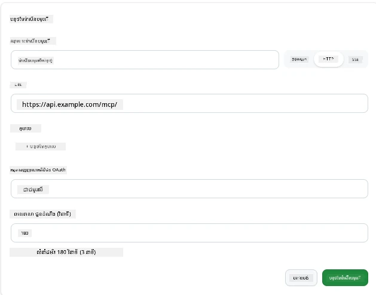
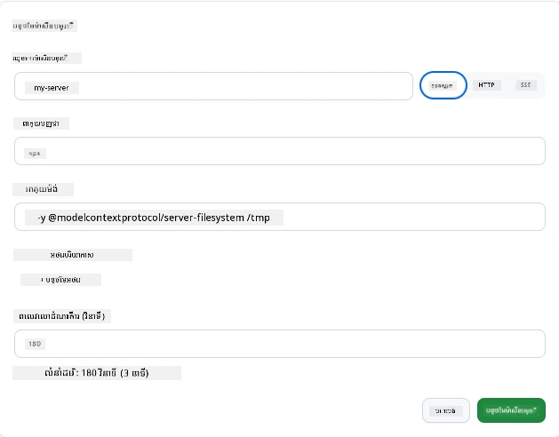

# ការប្រើប្រាស់ម៉ាស៊ីនបំរើ MCP ក្នុងកម្មវិធី GitHub Copilot

ឥឡូវនេះអ្នកបានដឹងថា MCP ដំណើរការ​យ៉ាងដូចម្តេច។ អ្នកបានបង្កើតម៉ាស៊ីនបំរើ បញ្ជាក់ឧបករណ៍ និងធនធាន ហើយភ្ជាប់គCliente័រ​ហើយ។ អ្វីដែលយើងមិនធ្វើនៅឡើយទេនោះគឺប្តូរយោបល់៖ ផ្ទុយពីអ្នកជាអ្នកបង្កើតម៉ាស៊ីនបំរើ តើវាហាក់ដូចម្តេចបើជាអ្នកប្រើកម្មវិធីដែលមានអ៊ីអេប៊ីជាជំនួយ ហើយគាំទ្រ MCP?

[GitHub Copilot App](https://github.com/github/app) គឺជាកម្មវិធីតុដែលអាចប្រើម៉ាស៊ីនបំរើ MCP។ ដោយភ្ជាប់ម៉ាស៊ីនបំរើ MCP ទៅវា អ្នកអាចបើកដំណាក់កាលថ្មី៖ Copilot អាចចូលទៅឯកសារ រៀបចំ API ផ្ទៃក្នុងរបស់អ្នក សួរទិន្នន័យក្នុងមូលដ្ឋានទិន្នន័យ រឺនិយាយទៅសេវាកម្មណាមួយដែលអ្នកបានដាក់ក្នុងម៉ាស៊ីនបំរើ។ កម្មវិធីក្លាយជា​ហ្វូស្ទ័រ ហើយម៉ាស៊ីនបំរើ MCP របស់អ្នកក្លាយជា​ឧបករណ៍របស់វា។

មេរៀននេះនឹងដើរតាមអ្នកពីការរកកន្លែងកំណត់ MCP ដល់ការភ្ជាប់ម៉ាស៊ីនបំរើឯកសារពិតប្រាកដ ហើយបន្ទាប់មកភ្ជាប់ម៉ាស៊ីនបំរើប្តូរតាមចិត្តរបស់អ្នក។

## គោលបំណងរៀន

បញ្ចប់មេរៀននេះ អ្នក​នឹងអាច៖

- រកឃើញនិងរុករកផ្ទាំងកំណត់ MCP Servers ក្នុងកំណត់កម្មវិធី Copilot App។
- ភ្ជាប់ម៉ាស៊ីនបំរើឯកសារដែលផ្តោតរួចហើយ និងប្រើវាក្នុងកថាខណ្ឌ។
- ចុះបញ្ជីម៉ាស៊ីនបំរើប្តូរតាមចិត្ត និងផ្ទៀងផ្ទាត់ថា Copilot អាចហៅឧបករណ៍របស់វាបាន។
- បញ្ជាក់វិធីហៅម៉ាស៊ីនបំរើដោយផ្តល់តម្លៃបរិស្ថាន ឬក្បាលប្តូរផ្ទាល់ខ្លួន (បើជាប្រភេទ HTTP)

## កម្មវិធី Copilot ជាហ្វូស្ទ័រ MCP

នេះជាគំនិតមូលដ្ឋាន៖ **ភ្នាក់ងាររបស់ Copilot មានបំណ៉ាញ់ ប៉ុន្តែគេដឹងតែអ្វីដែលអ្នកប្រាប់**។ ដោយលំនាំដើម ភ្នាក់ងារអាចអានឯកសារនៅផ្នែកបរិយាកាសធ្វើការ និងដំណើរការបញ្ជា terminal ប៉ុន្តែគេមិនអាចសួរព័ត៌មានពីមូលដ្ឋានទិន្នន័យ រកមើលប្រតិទិន ឬហៅ API ផ្ទាល់ខ្លួនដោយខ្លួនឯងទេ។ នេះគឺជាកន្លែងម៉ាស៊ីនបំរើ MCP ចូលជួយ។ ពួកវាលេងជាស្ពានរវាង Copilot និងប្រព័ន្ធរបស់អ្នក — មូលដ្ឋានទិន្នន័យ ការគ្រប់គ្រងកំណែ API ឧបករណ៍រចនា — ផ្តល់ឱកាសភ្នាក់ងារបានចូលរកព័ត៌មាន និងអំពើដែលពួកគេចាំបាច់ដើម្បីធ្វើការងារឲ្យបានរួច។

ចង់ចាប់ផ្តើមដោយរកកន្លែងកំណត់ MCP Servers របស់កម្មវិធី។

## ជំហាន ១៖ រកផ្ទាំងកំណត់ MCP

បើកកម្មវិធី Copilot ហើយស្វែងរករូបតំណក់កោងនៅខាងក្រោមផ្នែកឆ្វេង ហើយចុចវា។


ប្រាកដថាអ្នកជ្រើស "MCP Servers" ហើយអ្នកនឹងឃើញម៉ាស៊ីនបំរើដែលបានកំណត់រួចស្រេចនៅខាងលើ ផ្សារប្រញាប់ដែលមានម៉ាស៊ីនបំរើពេញនិយមនៅខាងក្រោម ហើយប៊ូតុង "Add Server" នៅខាងលើដូចខាងក្រោម៖



នេះជាមជ្ឈមណ្ឌលគ្រប់គ្រងរបស់អ្នក។ អ្នកអាចបន្ថែម លុប សាករនិងផ្អាកម៉ាស៊ីនបំរើនៅទីនេះ។ ការផ្លាស់ប្ដូរនឹងមានផលសម្រាប់កថាខណ្ឌថ្មីៗ។ បើអ្នកមានកថាខណ្ឌកំពុងបើក អ្នកត្រូវចាប់ផ្តើមមួយថ្មីបន្ទាប់ពីផ្លាស់ប្ដូរបញ្ជីនេះ។

## ជំហាន ២៖ ភ្ជាប់ម៉ាស៊ីនបំរើឯកសារ

ចូរធ្វើអ្វីដែលមានប្រយោជន៍ភ្លាមៗទៅ។ ម៉ាស៊ីនបំរើ Microsoft Docs MCP ផ្តល់អោយ Copilot ការចូលដំណើរការទៅឯកសារដែល Microsoft ផ្លូវការនៅក្នុងនោះរួមទាំង Azure .NET TypeScript និងច្រើនទៀត។ ជំនួសផ្អែកលើទិន្នន័យបណ្ណាល័យស្វែងយល់របស់ភ្នាក់ងារដែលមានកំណត់ថ្ងៃទី ការប្រើម៉ាស៊ីននេះអាចទាញយកឯកសារបច្ចុប្បន្ននៅពេលសុំបាន។

របៀបបន្ថែមវា៖

1. នៅក្នុងបញ្ជីម៉ាស៊ីនបំរើពេញនិយម សរសេរ **learn** ហើយជ្រើសម៉ាស៊ីនបំរើដែលឈ្មោះ "Microsoft Learn"។

   

   បន្ទាប់ពីចុច វានឹងបង្ហាញបញ្ចូលបញ្ជូលដែលមានឈ្មោះ ប្រភេទជញ្ជូន និង URL នៃម៉ាស៊ីនបំរើបានបំពេញរួចហើយ។ អ្វីដែលអ្នកត្រូវធ្វើគឺចុច "Add Server" ។

2. ចុច "Add Server" វាគួរតែចំណាយពេលប៉ុន្មានវិនាទីក្នុងការភ្ជាប់ទៅម៉ាស៊ីនបំរើ។

   

   បន្ទាប់ពីបន្ថែម វាគួរតែបង្ហាញក្នុងតំបន់ខាងលើជាមួយម៉ាស៊ីនបំរើដែលបានកំណត់រួច។ ចង់សាកល្បងឥឡូវនេះ។

3. បិទបញ្ចប់ និងជ្រើស Chats រហ័ស។

4. សរសេរប្រយោគខាងក្រោមដើម្បីចាប់ផ្តើមឧបករណ៍នៅម៉ាស៊ីនបំរើ Microsoft Learn។

   ```text
   What's the current recommended approach for handling Azure Blob Storage 
   retries using the .NET SDK?
   ```

   

អ្នកគួរមើលឃើញវាបង្ហាញពីណែនាំទៅម៉ាស៊ីនបំរើ MCP ដែលទើបបានបន្ថែម។

## ជំហាន ៣៖ ភ្ជាប់ម៉ាស៊ីនបំរើ stdio ផ្ទាល់ខ្លួន

កំណត់ត្រារបស់ម៉ាស៊ីនបំរើមានភាពងាយស្រួល ប៉ុន្តែអំណាចពិតគឺនៅការភ្ជាប់ម៉ាស៊ីនបំរើផ្ទាល់ខ្លួនរបស់អ្នក។ ឧទាហរណ៍ អ្នកបានបង្កើតម៉ាស៊ីនបំរើ (ឬបានភ្ជាប់ពីអ្នកផ្សេង) ដែលបង្ហាញ API ផ្ទៃក្នុង ឬមូលដ្ឋានចំណេះដឹងក្រុមហ៊ុន។ ក្នុងស្ថានការណ៍នេះ យើងត្រូវប្រើម៉ាស៊ីនបំរើ MCP ដែលយើងបានបង្កើតដើម្បីគ្រប់គ្រងសារពើភ័ណ្ឌក្រុមហ៊ុន។

1. ចុចរូបតំណក់កោងហើយជ្រើស "MCP servers" ម្តងទៀត។

2. ជ្រើសប៊ូតុង "Add Server" ហើយ "+ Add Custom server" ហើយផ្តល់តម្លៃដូចខាងក្រោម៖

   - ឈ្មោះៈ `Inventory Server`
   - ជ្រើសប្រភេទជញ្ជូន (នៅខាងស្ដាំ) **http**

   ជ្រើស "Add Server" ហើយវាគួរតែបង្ហាញក្នុងបញ្ជីម៉ាស៊ីនបំរើដែលបានកំណត់រួចរបស់អ្នក។

   

4. ដើម្បីសាកល្បង សូមដំណើរការប្រយោគដូចនេះ៖

    ```
    list inventory
    ```

   

អ្នកគួរតែឃើញបញ្ជីទំនិញក្នុងសារពើភ័ណ្ឌត្រឡប់មកពីម៉ាស៊ីនបំរើដែលបានបង្កើតផ្ទាល់ខ្លួនរបស់អ្នក។

ល្អណាស់ អ្នកគួរតែទទួលបានភាពយល់ដឹងល្អពីរបៀបបន្ថែមម៉ាស៊ីនបំរើ MCP របស់អ្នកទៅកម្មវិធី Copilot App។ បន្ទាប់យើងនឹងនិយាយពីការគ្រប់គ្រងជួរលាក់ និងអថាបថបរិយាកាស។

## ជំហាន ៤៖ ការកំណត់ជាន់ខ្ពស់

មកដល់ពេលនេះ អ្នកបានឃើញរបៀបបន្ថែមម៉ាស៊ីនបំរើ MCP ដោយផ្តល់គ្រាន់តែឈ្មោះ និង URL ប៉ុណ្ណោះ។ តែបើម៉ាស៊ីនបំរើរបស់អ្នកត្រូវការកូនឃី API ឬតម្លៃផ្សេងទៀត? ខណៈប្រភេទជញ្ជូនខុសគ្នា យើងអាចផ្គត់ផ្គង់វា។

- **http ឬ SSE transport**៖ នៅទីនេះ អ្នកអាចកំណត់ក្បាល (headers) តាមតម្រូវការ។

   សម្រាប់ការផ្ទៀងផ្ទាត់ អ្នកអាចបញ្ជាក់ Authorization header ជាឧទាហរណ៍។ តម្លៃអាចជា string ចល័ត។ ប្រសិនបើប្រើ OAuth អ្នកអាចផ្តល់ ID អតិថិជន OAuth ជំនួស។

   

- **stdio transport**៖ អាចកំណត់អថាបថបរិយាកាសបាន។

   អ្នកអាចបញ្ជាក់ចំនួនអថាបថបរិយាកាសណាមួយដែលត្រូវផ្ញើចូលម៉ាស៊ីនបំរើនៅពេលចាប់ផ្តើមវា។

   

## សេចក្តីសង្ខេប

កម្មវិធី Copilot មើលម៉ាស៊ីនបំរើ MCP ជាការតំរៀបបន្ថែមថ្នាក់ទីមួយនៃសមត្ថភាពភ្នាក់ងារ។ អ្នកបានឃើញដំណើរការពេញលេញក្នុងមេរៀននេះ ចាប់ពីការបន្ថែមម៉ាស៊ីនបំរើ MCP ទៅការប្រើវាក្នុងកថាខណ្ឌ។ អ្នកឥឡូវនេះអាចភ្ជាប់ទៅម៉ាស៊ីនបំរើសាធារណៈ API ផ្ទៃក្នុង និងឧបករណ៍ផ្ទាល់ខ្លួន ដើម្បីផ្តល់សមត្ថភាពឱ្យភ្នាក់ងារអាចចូលដំណើរការព័ត៌មាន និងអំពើដែលពួកគេចាំបាច់ក្នុងការផ្ទៀងផ្ទាត់ការងារដោយស្វ័យប្រវត្តិ។

## 📚 ធនធានបន្ថែម

### ឯកសារផ្លូវការជាផ្លូវការ

- [GitHub Copilot App](https://github.com/github/app)
- [MCP Specification](https://modelcontextprotocol.io/specification/2025-03-26) - ការបញ្ជាក់ពិពណ៌នាពី Model Context Protocol

### សហគមន៍
- [MCP Community Discord](https://discord.com/invite/ByRwuEEgH4) - ការពិភាក្សាបន្តផ្ទាល់
- [GitHub Discussions](https://github.com/microsoft/MCP-Server-and-PostgreSQL-Sample-Retail/discussions) - សំណួរនិងចែករំលែក
- [Stack Overflow](https://stackoverflow.com/questions/tagged/model-context-protocol) - សំណួរបច្ចេកទេស

---

<!-- CO-OP TRANSLATOR DISCLAIMER START -->
**ការបដិសេធ**:
ឯកសារនេះត្រូវបានបម្លែងភាសា ដោយប្រើសេវាបម្លែងភាសា AI [Co-op Translator](https://github.com/Azure/co-op-translator)។ ទោះយើងខ្ញុំមានក្តីប្រាថ្នាឱ្យបានច្បាស់លាស់ តែសូមយល់ដឹងថាការបម្លែងដោយស្វ័យប្រវត្តិក៏អាចមានកំហុសឬភាពមិនត្រឹមត្រូវ។ ឯកសារដើមជាភាសាទីតាំងគួរត្រូវបានគេប្រើជាប្រភពច្បាស់លាស់។ សម្រាប់ព័ត៌មានសំខាន់ៗ សូមណែនាំឱ្យប្រើប្រាស់ការប្រែដោយមនុស្សជំនាញ។ យើងខ្ញុំមិនទទួលខុសត្រូវចំពោះការយល់ច្រឡំ ឬការបកស្រាយខុសបន្ទាប់ពីការប្រើប្រាស់ការបម្លែងនេះនោះទេ។
<!-- CO-OP TRANSLATOR DISCLAIMER END -->