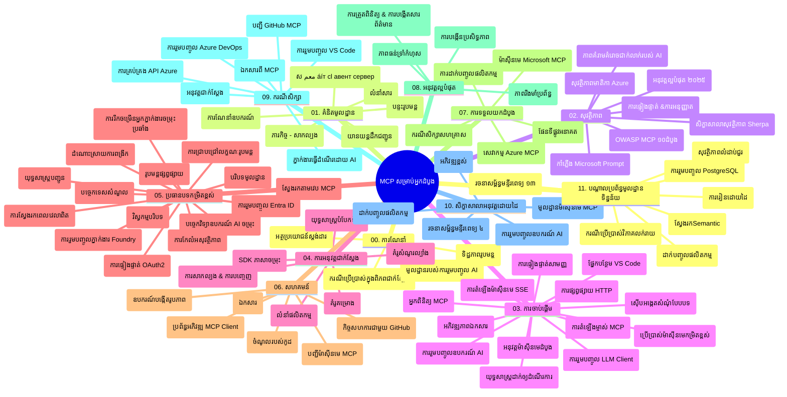

# Model Context Protocol (MCP) សម្រាប់អ្នកចាប់ផ្តើម - មគ្គុទេសក៍សិក្សា

មគ្គុទេសក៍សិក្សានេះផ្តល់នូវទិដ្ឋភាពទូទៅនៃរចនាសម្ព័ន្ធ និងមាតិការបស់仓库សម្រាប់មុខវិជ្ជា "Model Context Protocol (MCP) សម្រាប់អ្នកចាប់ផ្តើម"។ ប្រើមគ្គុទេសក៍នេះដើម្បីរុករក仓库យ៉ាងមានប្រសិទ្ធភាព និងយកអត្ថប្រយោជន៍ពីធនធានដែលមាន។

## ទិដ្ឋភាពទូទៅរបស់仓库

Model Context Protocol (MCP) គឺជាស្តង់ដារតំលៃសម្រាប់ការប្រាស្រ័យទាក់ទងរវាងម៉ូដែល AI និងកម្មវិធីប្រើប្រាស់អតិថិជន។ ដែលបានបង្កើតដំបូងដោយ Anthropic, MCP ឥឡូវនេះត្រូវបានថែរក្សាដោយសហគមន៍ MCP ទូលំទូលាយតាមរយៈអង្គការផ្លូវការលើ GitHub។仓库នេះផ្តល់នូវមុខវិជ្ជាជម្រៅទាំងស្រុងជាមួយនឹងឧទាហរណ៍កូដដែលអាចអនុវត្តបានជាក់ស្តែងក្នុងភាសា C#, Java, JavaScript, Python និង TypeScript ដែលបានរចនាសម្រាប់អ្នកអភិវឌ្ឍន៍ AI, ស្ថាបត្យករប្រព័ន្ធ និងវិស្វករផ្នែកទន់ ។ 

## ផែនទីមុខវិជ្ជាវីស្វល

## រចនាសម្ព័ន្ធ仓库

仓库ត្រូវបានរៀបចំបញ្ចូលជាប្រភេទបួនដើម ជ្រាបពាណិជ្ជកម្មដល់វាលជាច្រើននៃ MCP៖

1. **ការណែនាំ (00-Introduction/)**
   - ទិដ្ឋភាពទូទៅនៃ Model Context Protocol
   - មូលហេតុដែលស្តង់ដារមានសារៈសំខាន់ក្នុងខ្សែដំណើរការអ្នកឆ្លើយ AI
   - ករណីប្រើប្រាស់ និងអត្ថប្រយោជន៍

2. **គំនិតមូលដ្ឋាន (01-CoreConcepts/)**
   - ស្ថាបត្យកម្មឆ្លើយតបអតិថិជន-ម៉ាស៊ីនសេវា
   - ធាតុសំខាន់ក្នុងប្រព័ន្ធ protocol
   - គំរូសារនៅក្នុង MCP

3. **សុវត្ថិភាព (02-Security/)**
   - ថាមពលគំរាមកំហែងនៅក្នុងប្រព័ន្ធមូលដ្ឋាន MCP
   - វិធីសាស្ត្រល្អបំផុតសម្រាប់ការពារការអនុវត្ត
   - យុទ្ធសាស្រ្តសម្គាល់អត្តសញ្ញាណ និងអាទិភាព
   - **ឯកសារសុវត្ថិភាពនិយម**៖
     - MCP សុវត្ថិភាពប最佳2025
     - មគ្គុទេសក៍អនុវត្តឱ្យមានសុវត្ថិភាពមាតិកា Azure
     - ត្រួតពិនិត្យនិងបច្ចេកទេសសុវត្ថិភាព MCP
     - សេចក្តីជូនដំណឹងនៃតិចនិកសុវត្ថិភាព
   - **ប្រធានបទសុវត្ថិភាពសំខាន់ៗ**៖
     - ការចាក់បញ្ចូលបញ្ជា និងគំរាមកំហែងសារឧបករណ៍
     - ការចំណាយវេយ័វិធីសាស្ត្រនិងបញ្ហាគួរឱ្យច្របូកច្របល់
     - របៀបប្រើប្រាស់សញ្ញាប័ណ្ណដំណើរកាត់
     - សិទ្ធិពេកនិងការគ្រប់គ្រងការចូលប្រើ
     - សុវត្ថិភាពខ្សែផ្គត់ផ្គង់សម្រាប់គ្រឿងបន្លាស់ AI
     - ការរួមបញ្ចូល Microsoft Prompt Shields

4. **ការចាប់ផ្តើម (03-GettingStarted/)**
   - ការតំឡើងបរិស្ថាន និងការកំណត់រចនាសម្ព័ន្ធ
   - បង្កើតម៉ាស៊ីនសេវា MCP ងាយស្រួល និងអតិថិជន
   - ការរួមបញ្ចូលជាមួយកម្មវិធីដែលមានស្រាប់
   - មានផ្នែករួមមាន៖
     - ការអនុវត្តម៉ាស៊ីនសេវាកម្មដំបូង
     - ការអភិវឌ្ឍអតិថិជន
     - ការរួមបញ្ចូលអតិថិជន LLM
     - ការរួមបញ្ចូល VS Code
     - ម៉ាស៊ីនសេវា Server-Sent Events (SSE)
     - ការប្រើប្រាស់ម៉ាស៊ីនសេវាកម្រិតខ្ពស់
     - ការផ្ទុករូបភាព HTTP streaming
     - ការរួមបញ្ចូល AI Toolkit
     - យុទ្ធសាស្ត្រសាកល្បង
     - ការណែនាំរៀបចំការចេញផ្សាយ

5. **ការអនុវត្តជាក់ស្តែង (04-PracticalImplementation/)**
   - ការប្រើប្រាស់ SDKs ក្នុងភាសា​កម្មវិធីផ្សេងៗ
   - ការត្រួតពិនិត្យកំហុស, ការសាកល្បង និងបញ្ជាក់ត្រឹមត្រូវ
   - ការបង្កើតគំរូ និងការងារផ្សេងៗដែលអាចប្រើឡើងវិញបាន
   - គម្រោងគំរូជាមួយឧទាហរណ៍អនុវត្ត

6. **ប្រធានបទកម្រិតខ្ពស់ (05-AdvancedTopics/)**
   - បច្ចេកវិទ្យាបង្កើត context
   - ការរួមបញ្ចូលភ្នាក់ងារដំណាក់កាល Foundry
   - សមាសធាតុអាជីព AI ពហុរបៀប
   - ការបង្ហាញសម្គាល់ OAuth2
   - សមត្ថភាពស្វែងរកពេលវេលាត្រឹមត្រូវ
   - ការផ្ទុករូបភាពពេលវេលាត្រឹមត្រូវ
   - ការអនុវត្ត context ដើម
   - យុទ្ធសាស្រ្តផ្លូវការ
   - បច្ចេកវិទ្យាតំលៃផ្សេងៗ
   - វិធីសាស្ត្រកំណត់ទំហំ
   - ការពិចារណាសុវត្ថិភាព
   - ការរួមបញ្ចូលសុវត្ថិភាព Entra ID
   - ការរួមបញ្ចូលស្វែងរកបណ្ដាញ
   - ការគិតថ្លែងមតិជាច្រើន agent (ទម្រង់យោបល់)

7. **ការរួមចំណែកសហគមន៍ (06-CommunityContributions/)**
   - របៀបចែករំលែកកូដ និងឯកសារ
   - ប្រើប្រាស់ GitHub សម្រាប់សហការរៀបចំ
   - ការកែលម្អ និងមតិយោបល់ពីសហគមន៍
   - ប្រើប្រាស់អតិថិជន MCP ផ្សេងៗ (Claude Desktop, Cline, VSCode)
   - ធ្វើការ​ជាមួយម៉ាស៊ីនសេវា MCP ពេញនិយម រួមទាំងបង្កើតរូបភាព

8. **មេរៀនពីការយកទៅប្រើដំបូង (07-LessonsfromEarlyAdoption/)**
   - ការអនុវត្តជាក់ស្តែង និងរឿងជោគជ័យ
   - ការបង្កើត និងចេញផ្សាយដំណោះស្រាយមូលដ្ឋាន MCP
   - ទិសដៅ និងផែនទីអនាគត
   - **មគ្គុទេសក៍ម៉ាស៊ីនសេវា Microsoft MCP**៖ មគ្គុទេសក៍ជម្រៅដល់ម៉ាស៊ីនសេវា Microsoft MCP ១០ យ៉ាងរួមមាន៖
     - Microsoft Learn Docs MCP Server
     - Azure MCP Server (ភ្ជាប់ជាប្រភេទជាង ១៥)
     - GitHub MCP Server
     - Azure DevOps MCP Server
     - MarkItDown MCP Server
     - SQL Server MCP Server
     - Playwright MCP Server
     - Dev Box MCP Server
     - Microsoft Foundry MCP Server
     - Microsoft 365 Agents Toolkit MCP Server

9. **វិធីសាស្ត្រល្អបំផុត (08-BestPractices/)**
   - ការសម្រួល និងបម្រែបម្រួលប្រសិទ្ធភាព
   - រចនាប័ទ្មប្រព័ន្ធ MCP ដែលប្រឆាំងភាពខូចខាត
   - យុទ្ធសាស្ត្រសាកល្បង និងរឹងមាំ

10. **ករណីសិក្សា (09-CaseStudy/)**
    - **ករណីសិក្សាចំនួនប្រាំពីរដែលបង្ហាញភាពចម្រើនខាង MCP នៅក្នុងលក្ខខណ្ឌផ្សេងៗ**៖
    - **ភ្នាក់ងារធ្វើដំណើរជាប្រភេទពហុភ្នាក់ងារ Azure AI**៖ ការគ្រប់គ្រងជាមួយ Azure OpenAI និង AI Search
    - **ការរួមបញ្ចូល Azure DevOps**៖ ការជួញដូរ ធ្វើតម្លើងតាម YouTube
    - **ការទាញយកឯកសារពេលវេលាទាន់សម័យ**៖ អតិថិជន Python console ជាមួយការផ្ទុករូបភាព HTTP
    - **កម្មវិធីបង្កើតផែនការសិក្សាផ្លូវទំនាក់ទំនង**៖ កម្មវិធី Chainlit ជាមួយ AI ការសន្ទនា
    - **ឯកសារជាមួយកម្មវិធីក្នុងកូដ VS Code**៖ ការរួមបញ្ចូលជាមួយ GitHub Copilot workflows
    - **ការគ្រប់គ្រង API Azure**៖ ការរួមបញ្ចូល API សហគ្រាសជាមួយការបង្កើត MCP server
    - **ការចុះបញ្ជី GitHub MCP Registry**៖ ការអភិវឌ្ឍប្រព័ន្ធ និងវេទិកាភ្នាក់ងារ
    - ឧទាហរណ៍អនុវត្ត មួយចំនួនដែលគ្របដណ្តប់ក្នុងការរួមបញ្ចូលសហគ្រាស ភាពប្រសិទ្ធភាពអ្នកអភិវឌ្ឍ និងអភិវឌ្ឍសហគមន៍

11. **សិក្ខាសាលាអនុវត្ត (10-StreamliningAIWorkflowsBuildingAnMCPServerWithAIToolkit/)**
    - សិក្ខាសាលាអនុវត្តជាក់ស្តែងរួមបញ្ចូល MCP និង AI Toolkit
    - ការបង្កើតកម្មវិធីឆ្លាតវៃដែលភ្ជាប់ម៉ូដែល AI ជាមួយឧបករណ៍ពិភពលោកពិត
    - មូឌុលប្រាក់បណ្តុះបណ្តាលពីមូលដ្ឋាន ទៅអភិវឌ្ឍម៉ាស៊ីនសេវាកម្មផ្ទាល់ខ្លួន និងយុទ្ធសាស្ត្រចេញផ្សាយ
    - **រចនាសម្ព័ន្ធរោងចក្រ**៖
      - រោងចក្រ ១៖ អមតៈ MCP Server
      - រោងចក្រ ២៖ ការអភិវឌ្ឍ MCP Server កម្រិតខ្ពស់
      - រោងចក្រ ៣៖ ការរួមបញ្ចូល AI Toolkit
      - រោងចក្រ ៤៖ ការចេញផ្សាយ និងកំណត់ទំហំ
    - វិធីសាស្ត្រសិក្សាតាមរោងចក្រ​ជាមួយជំហានហ្វាងជំហាន

12. **រោងចក្រ​បញ្ចូលទិន្នន័យបណ្ដាញ MCP Server (11-MCPServerHandsOnLabs/)**
    - **ផ្លូវការសិក្សារបស់រោងចក្រ ១៣ សម្រាប់បង្កើតម៉ាស៊ីនសេវា MCP ត្រៀមផលិតកម្ម ជាមួយការបញ្ចូល PostgreSQL**
    - **ការអនុវត្តវិភាគលក់ផ្ទាល់ពិភពលោក** ដែលប្រើប្រាស់ករណីប្រើប្រាស់ Zava Retail
    - **លំនាំសហគ្រាស** រួមមាន Row Level Security (RLS), ការស្វែងរកអត្ថន័យ និងការចូលប្រើទិន្នន័យជាច្រើនអតិថិជន
    - **រចនាសម្ព័ន្ធរោងចក្រ​ពេញលេញ**៖
      - **រោងចក្រ 00-03៖ មូលដ្ឋាន** - ការណែនាំ, រចនាសម្ព័ន្ធ, សុវត្ថិភាព, ការតំឡើងបរិស្ថាន
      - **រោងចក្រ 04-06៖ ការបង្កើត MCP Server** - រចនាផ្ទាំងទិន្នន័យ, អនុវត្ត MCP Server, ការអភិវឌ្ឍឧបករណ៍
      - **រោងចក្រ 07-09៖ លក្ខណៈខ្ពស់** - ស្វែងរកអត្ថន័យ, សាកល្បង និងកែកំហុស, រួមបញ្ចូល VS Code
      - **រោងចក្រ 10-12៖ ផលិតកម្ម និងវិធីសាស្ត្រល្អ** - ចេញផ្សាយ, ត្រួតពិនិត្យ, បន្ធូរបន្ថយ
    - **បច្ចេកវិទ្យាដែលគ្របដណ្តប់**៖ ស៊ុម FastMCP, PostgreSQL, Azure OpenAI, Azure Container Apps, Application Insights
    - **លទ្ធផលសិក្សា**៖ ម៉ាស៊ីនសេវា MCP ស្រាប់ក្នុងផលិតកម្ម, លំនាំបញ្ចូលទិន្នន័យ, វិភាគដោយកម្លាំង AI, សុវត្ថិភាពសហគ្រាស

## ធនធានបន្ថែម

仓库រួមបញ្ចូលធនធានគាំទ្រ៖

- **ថតរូបភាព**៖ មានគំនូរ និងរូបភាពដាក់ធ្វើបង្ហាញក្នុងមុខវិជ្ជា
- **ការប្រែសម្រួល**៖ គាំទ្រភាសាច្រើនជាមួយការប្រែសម្រួលឯកសារដោយស្វ័យប្រវត្តិ
- **ធនធាន MCP ផ្លូវការ**៖
  - [ឯកសារព័ត៌មាន MCP](https://modelcontextprotocol.io/)
  - [បរិយាយ MCP](https://spec.modelcontextprotocol.io/)
  - [仓库 MCP GitHub](https://github.com/modelcontextprotocol)

## របៀបប្រើ仓库នេះ

1. **ការសិក្សាដោយលំដាប់**៖ តាមដានជំពូកពី ០០ ដល់ ១១ សម្រាប់បទពិសោធន៍សិក្សាដូច្នេះ។
2. **ការផ្តោតលើភាសាកម្មវិធី**៖ ប្រសិនបើអ្នកចាប់អារម្មណ៍លើភាសាកម្មវិធីណាមួយ សូមរកមើលថតគំរូសម្រាប់អនុវត្តក្នុងភាសាដែលអ្នកចូលចិត្ត។
3. **ការអនុវត្តជាក់ស្តែង**៖ ចាប់ផ្តើមដោយផ្នែក "Getting Started" ដើម្បីជំនួយការតំឡើងបរិស្ថាន និងបង្កើតម៉ាស៊ីនសេវា MCP និងអតិថិជនដំបូងរបស់អ្នក។
4. **ការរុករកកម្រិតខ្ពស់**៖ បន្ទាប់ពីកាន់តែស្គាល់មូលដ្ឋាន អាចចូលរួមវិមជ្ឈការតំឡើងកម្រិតខ្ពស់សម្រាប់ពង្រីកចំណេះដឹង។
5. **ការចូលរួមសហគមន៍**៖ ចូលរួមសហគមន៍ MCP តាមរយៈការពិភាក្សា GitHub និងបន្ទប់ Discord ដើម្បីទាក់ទងជាមួយអ្នកជំនាញ និងអ្នកអភិវឌ្ឍផ្សេងម្នាក់មួយ។

## អតិថិជន និងឧបករណ៍ MCP

មុខវិជ្ជានេះគ្របដណ្ដប់អតិថិជន និងឧបករណ៍ MCP ផ្សេងៗ៖

1. **អតិថិជនផ្លូវការ**៖
   - Visual Studio Code
   - MCP ក្នុង Visual Studio Code
   - Claude Desktop
   - Claude ក្នុង VSCode
   - Claude API

2. **អតិថិជនសហគមន៍**៖
   - Cline (មេដែក)
   - Cursor (កម្មវិធីកូដ)
   - ChatMCP
   - Windsurf

3. **ឧបករណ៍គ្រប់គ្រង MCP**៖
   - MCP CLI
   - MCP Manager
   - MCP Linker
   - MCP Router

## ម៉ាស៊ីនសេវា MCP មានប្រជាប្រិយភាព

仓库ណែនាំម៉ាស៊ីនសេវា MCP ផ្សេងៗ លុះត្រាតែ៖

1. **ម៉ាស៊ីនសេវា Microsoft MCP ផ្លូវការ**៖
   - Microsoft Learn Docs MCP Server
   - Azure MCP Server (ភ្ជាប់ជាប្រភេទជាង ១៥)
   - GitHub MCP Server
   - Azure DevOps MCP Server
   - MarkItDown MCP Server
   - SQL Server MCP Server
   - Playwright MCP Server
   - Dev Box MCP Server
   - Microsoft Foundry MCP Server
   - Microsoft 365 Agents Toolkit MCP Server

2. **ម៉ាស៊ីនសេវាយោងផ្លូវការ**៖
   - Filesystem
   - Fetch
   - Memory
   - Sequential Thinking

3. **ការបង្កើតរូបភាព**៖
   - Azure OpenAI DALL-E 3
   - Stable Diffusion WebUI
   - Replicate

4. **ឧបករណ៍អភិវឌ្ឍន៍**៖
   - Git MCP
   - Terminal Control
   - Code Assistant

5. **ម៉ាស៊ីនសេវាពិសេស**៖
   - Salesforce
   - Microsoft Teams
   - Jira & Confluence

## ការរួមចំណែក

仓库នេះសូមស្វាគមន៍ការរួមចំណែកពីសហគមន៍។ សូមមើលផ្នែកការរួមចំណែកសហគមន៍ដើម្បីទទួលបានការណែនាំពីរបៀបរួមចំណែកយ៉ាងមានប្រសិទ្ធភាពក្នុងប្រព័ន្ធ MCP។

----

*មគ្គុទេសក៍សិក្សានេះបានធ្វើបច្ចុប្បន្នភាពចុងក្រោយថ្ងៃទី ៥ ខែកុម្ភៈ ឆ្នាំ ២០២៦ ដើម្បីបង្ហាញការបញ្ជាក់ MCP ២០២៥-១១-២៥ ថ្មីៗ និងផ្តល់ទិដ្ឋភាពទូទៅនៃ仓库នៅថ្ងៃនោះ។ មាតិកា仓库អាចត្រូវបានធ្វើបច្ចុប្បន្នភាពបន្ទាប់ពីថ្ងៃនោះ។*

---

<!-- CO-OP TRANSLATOR DISCLAIMER START -->
**ការបដិសេធ**:
ឯកសារនេះត្រូវបានបម្លែងភាសា ដោយប្រើសេវាបម្លែងភាសា AI [Co-op Translator](https://github.com/Azure/co-op-translator)។ ទោះយើងខ្ញុំមានក្តីប្រាថ្នាឱ្យបានច្បាស់លាស់ តែសូមយល់ដឹងថាការបម្លែងដោយស្វ័យប្រវត្តិក៏អាចមានកំហុសឬភាពមិនត្រឹមត្រូវ។ ឯកសារដើមជាភាសាទីតាំងគួរត្រូវបានគេប្រើជាប្រភពច្បាស់លាស់។ សម្រាប់ព័ត៌មានសំខាន់ៗ សូមណែនាំឱ្យប្រើប្រាស់ការប្រែដោយមនុស្សជំនាញ។ យើងខ្ញុំមិនទទួលខុសត្រូវចំពោះការយល់ច្រឡំ ឬការបកស្រាយខុសបន្ទាប់ពីការប្រើប្រាស់ការបម្លែងនេះនោះទេ។
<!-- CO-OP TRANSLATOR DISCLAIMER END -->