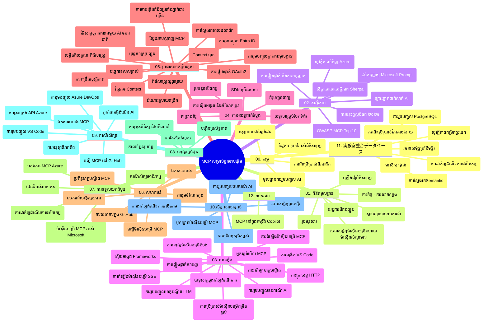

# Model Context Protocol (MCP) សម្រាប់អ្នកចាប់ផ្តើម - មគ្គុទ្ទសិក្សា

មគ្គុទ្ទសិក្សានេះផ្តល់ជាសង្ខេបអំពីរចនាសម្ព័ន្ធនិងមាតិកានៃឃ្លាំងកូដ​សម្រាប់កម្មវិធីសិក្សា "Model Context Protocol (MCP) សម្រាប់អ្នកចាប់ផ្តើម"។ ប្រើមគ្គុទ្ទនេះដើម្បីរុករកឃ្លាំងកូដបានយ៉ាងមានប្រសិទ្ធភាពនិងទទួលបានអត្ថប្រយោជន៍ពីធនធានដែលមានស្រាប់។

## សេចក្តីសង្ខេបឃ្លាំងកូដ

Model Context Protocol (MCP) គឺជាលំនាំដើមស្តង់ដារសម្រាប់បរិបទនៃការប្រតិបត្ដិការ​ចម្បងរវាងម៉ូដែល AI និងកម្មវិធីទទួល។ ដើមបង្កើតដោយ Anthropic, MCP ឥឡូវត្រូវបានថែរក្សាដោយសហគមន៍ MCP តាមរយៈអង្គភាព GitHub ផ្លូវការមួយ។ ឃ្លាំងនេះផ្តល់នូវកម្មវិធីសិក្សាពេញលេញជាមួយឧទាហរណ៍កូដប្រតិបត្តិការដោយដៃក្នុងភាសា C#, Java, JavaScript, Python, និង TypeScript ដែលរចនាសម្រាប់អ្នកអភិវឌ្ឍន៍ AI, វិស្វករពហុប្រព័ន្ធ, និងវិស្វករផ្នែកទន់។

## ផែនទីមុខវិជ្ជាទស្សន៍

## រចនាសម្ព័ន្ធឃ្លាំងកូដ

ឃ្លាំងត្រូវបានរៀបចំបំបែកចេញជា១២ផ្នែកសំខាន់ៗ ដែលមួយៗផ្តោតសំខាន់លើផ្នែកខុសៗនៅក្នុង MCP៖

1. **ការណែនាំ (00-Introduction/)**
   - សេចក្តីជូនព័ត៌មានទូទៅអំពី Model Context Protocol
   - មូលហេតុដែលស្តង់ដារសំខាន់ក្នុងផ្លូវការងារ AI
   - គំរូប្រើប្រាស់ជាក់ស្តែងនិងអត្ថប្រយោជន៍

2. **គំនិតមូលដ្ឋាន (01-CoreConcepts/)**
   - វិស្វកម្ម Client-server
   - សមាសភាគសំខាន់នៃប្រតិបត្ដិការយាន MCP
   - លំនាំសារ​ផ្ទេរព័ត៌មាននៅក្នុង MCP

3. **សុវត្ថិភាព (02-Security/)**
   - វាយប្រហារសុវត្ថិភាពនៅក្នុងប្រព័ន្ធតាមលំនាំ MCP
   - វិធីសាស្រ្តល្អបំផុតសម្រាប់ការពារការអនុវត្ត
   -វីធីសាស្រ្តផ្ទៀងផ្ទាត់និងផ្តល់អាជ្ញាប័ណ្ណ
   - **ឯកសារសុវត្ថិភាពពេញលេញ**:
     - MCP Security Best Practices 2025
     - Azure Content Safety Implementation Guide
     - MCP Security Controls and Techniques
     - MCP Best Practices Quick Reference
   - **ប្រធានបទសុវត្ថិភាពសំខាន់ៗ**:
     - ការវាយប្រហារតាមរយៈបញ្ចូលសារ (prompt injection) និងជីវិតឧបករណ៍ពុល
     - បញ្ហាសារខ្លួនឡើងវ៉ាចាប់ទុក (session hijacking) និងនៅច្របាច់ (confused deputy)
     - បញ្ហាជូនសញ្ញាការអនុញ្ញាត (token passthrough)
     - អំណាចលើស និងការគ្រប់គ្រងការចូលប្រើ
     - សុវត្ថិភាពខ្សែផ្គត់ផ្គង់សម្រាប់គ្រឿងផ្សារភាគ AI
     - រួមបញ្ចូល Microsoft Prompt Shields

4. **ការចាប់ផ្តើម (03-GettingStarted/)**
   - ការតំឡើងបរិយាកាសនិងការកំណត់រចនាសម្ព័ន្ធ
   - បង្កើតម៉ាស៊ីនមេ MCP មូលដ្ឋាន និងម៉ាស៊ីនថតក្រៅ
   - ប្រើប្រាស់រួមជាមួយកម្មវិធីស្រាប់
   - រួមមានផ្នែកសម្រាប់:
     - ការ​អនុវត្ត​ម៉ាស៊ីន​មេដំបូង
     - អភិវឌ្ឍន៍ម៉ាស៊ីនថតក្រៅ
     - រួមបញ្ចូលម៉ាស៊ីនថត LLM
     - រួមបញ្ចូល VS Code
     - ម៉ាស៊ីនមេផ្ញើព្រឹត្តិការណ៍
     - ប្រើប្រាស់ម៉ាស៊ីនមេកម្រិតខ្ពស់
     - ការផ្តួចផ្តើម HTTP streaming
     - រួមបញ្ចូល AI Toolkit
     - ប្រព័ន្ធសាកល្បង
     - គោលការណ៍ដាក់ឲ្យដំណើរការ

5. **ការអនុវត្តជាក់ស្តែង (04-PracticalImplementation/)**
   - ការប្រើ SDK នៅក្នុងភាសាចម្រុះ
   - វិធីសាស្ត្របកស្រាយកំហុស សាកល្បង និងផ្ទៀងផ្ទាត់
   - បង្កើតម៉ូដែល prompt និង workflow អាចប្រើម្ដងទៀត
   - គំរូគម្រោងជាមួយឧទាហរណ៍អនុវត្ត

6. **ប្រធានបទវឌ្ឍនៈ (05-AdvancedTopics/)**
   - វិធីសាស្ត្រអភិវឌ្ឍបរិបទ (context engineering)
   - រួមបញ្ចូល agent Foundry
   - workflow AI ប្រើរបៀបមូលុយទ្រីម៉ូដ
   - ដេមូផ្ទៀងផ្ទាត់ OAuth2
   - សមត្ថភាពស្វែងរកពេលវេលាមួយ
   - ប៊ិចម៉ូតនៅពេលវេលាមួយ
   - អនុវត្ត context ដើម
   - វិធីសាស្ត្របញ្ជូន
   - វិធីសាស្ត្រគំរូទិន្នន័យ
   - វិធីសាស្ត្រពង្រីក
   - ការពិចារណាសុវត្ថិភាព
   - រួមបញ្ចូលសុវត្ថិភាព Entra ID
   - រួមបញ្ចូលស្វែងរកតាមវេប
   - យុទ្ធសាស្ត្រសន្ទករពហុម៉ូដែលដោយប្រើគំនិតជម្លើយប្រឈម (adversarial multi-agent reasoning)

7. **វេទិកាសហគមន៍ (06-CommunityContributions/)**
   - មធ្យោបាយចូលរួមកូដនិងឯកសារ
   - ធ្វើការសហការជាមួយ GitHub
   - ការវាស់វែងនិងមតិយោបល់ដោយសហគមន៍
   - ប្រើប្រាស់ MCP clients ចម្រុះ (Claude Desktop, Cline, VSCode)
   - បញ្ចូលជាមួយម៉ាស៊ីនមេ MCP ពេញនិយម រួមមានការបង្កើតរូបភាព

8. **មេរៀនពីការអនុវត្តដំបូង (07-LessonsfromEarlyAdoption/)**
   - ការអនុវត្តពិត និងរឿងជោគជ័យ
   - ការសាងសង់និងដាក់ MCP ដំណើរការដោយគ្រប់គ្រាន់
   - ស្ទីលនានានិងផែនទីអនាគត
   - **មគ្គុទ្ទសៀវភៅម៉ាស៊ីនមេ Microsoft MCP**: មគ្គុទ្ទសៀវភៅពេញលេញសម្រាប់ម៉ាស៊ីនមេ Microsoft MCP 10 ប្រភេទ​ដូចជា:
     - Microsoft Learn Docs MCP Server
     - Azure MCP Server (15+ connectors ប្រភេទខ្ពស់)
     - GitHub MCP Server
     - Azure DevOps MCP Server
     - MarkItDown MCP Server
     - SQL Server MCP Server
     - Playwright MCP Server
     - Dev Box MCP Server
     - Microsoft Foundry MCP Server
     - Microsoft 365 Agents Toolkit MCP Server

9. **ការអនុវត្តល្អបំផុត (08-BestPractices/)**
   - ការរៀបចំការបង្ហោះនិងបង្រួមបង់
   - ការរចនាប្រព័ន្ធ MCP មានភាពធន់នឹងកំហុស
   - វិធីសាស្ត្រសាកល្បងនិងភាពរឹងមាំ

10. **ករណីសិក្សា (09-CaseStudy/)**
    - **ប្រាំពីរករណីសិក្សាដែលមានលក្ខណៈពេញលេញ** បង្ហាញភាពបត់បែនរបស់ MCP ក្នុងស្ថានការណ៍ផ្សេងៗគ្នា:
    - **Azure AI Travel Agents**: ការសម្របសម្រួលជាមួយ multi-agent ជាមួយ Azure OpenAI និង AI Search
    - **រួមបញ្ចូល Azure DevOps**: ការបញ្ចូលអូតូម៉ាទិកនៃWorkflow ជាមួយទិន្នន័យ YouTube
    - **ការទាញយកឯកសារពេលវេលាពេលវេលា**: ម៉ាស៊ីនថត Python console ប្រើ HTTP streaming
    - **កម្មវិធីបង្កើតផែនការសិក្សា**: កម្មវិធីបណ្ដាញ Chainlit ជាមួយ AI ការសន្ទនា
    - **ឯកសារក្នុងអ្នកសរសេរ**: រួមបញ្ចូល VS Code ជាមួយ GitHub Copilot workflows
    - **ការគ្រប់គ្រង Azure API**: ការរួមបញ្ចូល API សហគ្រាសជាមួយម៉ាស៊ីនមេ MCP
    - **GitHub MCP Registry**: ការអភិវឌ្ឍបរិយាប័ណនិងវេទិការតំណាងភ្នាក់ងារ
    - ឧទាហរណ៍អនុវត្តផ្សព្វផ្សាយនៅក្នុងការរួមបញ្ចូលសហគ្រាស ការកែលម្អផលិតភាព និងការអភិវឌ្ឍបរិយាកាស

11. **សិក្ខាសាលាបណ្តុះបណ្តាលជាក់ស្តែង (10-StreamliningAIWorkflowsBuildingAnMCPServerWithAIToolkit/)**
    - សិក្ខាសាលាបណ្តុះបណ្តាលជាក់ស្តែងរួមបញ្ចូល MCP និង AI Toolkit
    - បង្កើតកម្មវិធីឆ្លាតវៃដែលភ្ជាប់ម៉ូដែល AI ជាមួយឧបករណ៍ពិតប្រាកដ
    - ដំណាក់កាល​សិក្សាដែលគ្របដណ្តប់មូលដ្ឋាន ការអភិវឌ្ឍម៉ាស៊ីនមេផ្ទាល់ខ្លួន និងការដាក់ឲ្យដំណើរការផលិត
    - **រចនាសម្ព័ន្ធមន្ទីរពិសោធន៍**:
      - Lab 1: មូលដ្ឋានម៉ាស៊ីនមេ MCP
      - Lab 2: ការអភិវឌ្ឍម៉ាស៊ីនមេ MCP ប្រកបដោយជំនាញខ្ពស់
      - Lab 3: រួមបញ្ចូល AI Toolkit
      - Lab 4: ការដាក់ឲ្យដំណើរការផលិតនិងពង្រីក
    - វិធីសាស្ត្រសិក្សាបណ្តុះបណ្តាលជាមន្ទីរពិសោធន៍ជាជំហានៗ

12. **មន្ទីរពិសោធន៍រួមបញ្ចូលទិន្នន័យម៉ាស៊ីនមេ MCP (11-MCPServerHandsOnLabs/)**
    - **ផ្លូវសិក្សា 13-មន្ទីរពិសោធន៍ពេញលេញ** សម្រាប់បង្កើតម៉ាស៊ីនមេ MCP ដែលអាចដំណើរការបានជាប្រព័ន្ធផលិតដោយរួមបញ្ចូល PostgreSQL
    - **ការអនុវត្តវាយតម្លៃលក់នៅពេលពិត** ប្រើអ្នកប្រើទំនិញ Zava Retail
    - **លំនាំខ្ពស់សម្រាប់សហគ្រាស** រួមមាន Row Level Security (RLS), ស្វែងរកសំខាន់ និងចូលប្រើទិន្នន័យពហុអតិថិជន
    - **រចនាសម្ព័ន្ធមន្ទីរពិសោធន៍ពេញលេញ**:
      - **Labs 00-03: មូលដ្ឋាន** - ការណែនាំ, វិស្វកម្ម, សុវត្ថិភាព, ការតំឡើងបរិយាកាស
      - **Labs 04-06: ការបង្កើតម៉ាស៊ីនមេ MCP** - រចនាសម្ព័ន្ធទិន្នន័យ, ការអនុវត្តម៉ាស៊ីនមេ, ជំនួយប្លង់
      - **Labs 07-09: លក្ខណៈខ្ពស់** - ស្វែងរកសំខាន់, ការសាកល្បង និងបកស្រាយកំហុស, រួមបញ្ចូល VS Code
      - **Labs 10-12: ផលិតកម្ម និងការអនុវត្តល្អបំផុត** - ដាក់បង្ហោះ, ត្រួតពិនិត្យ, បង្រួមបង់
    - **បច្ចេកវិទ្យារួមបញ្ចូល**: FastMCP framework, PostgreSQL, Azure OpenAI, Azure Container Apps, Application Insights
    - **លទ្ធផលសិក្សា**: ម៉ាស៊ីនមេ MCP ផលិតបាន, លំនាំរួមបញ្ចូលទិន្នន័យ, វិភាគដោយ AI, សុវត្ថិភាពសហគ្រាស

13. **ឧបករណ៍ (12-tooling/)**
    - រៀនរបៀបប្រើ MCP ក្នុងកម្មវិធី Copilot និងឧបករណ៍ផ្សេងៗ

## ធនធានបន្ថែម

ឃ្លាំងនេះរួមបញ្ចូលធនធានគាំទ្រ៖

- **ថតរូបភាព**៖ មានគំនូរបរិយាកាស និងរូបភាពពណ៌បំផុតប្រើក្នុងមុខវិជ្ជា
- **ការប្រែសម្រួល**៖ គាំទ្រភាសាច្រើនជាមួយបច្ចេកវិទ្យាប្រែសម្រួលស្វ័យប្រវត្តិ
- **ធនធាន MCP ផ្លូវការ**:
  - [ឯកសារ MCP](https://modelcontextprotocol.io/)
  - [លក្ខខណ្ឌ MCP](https://spec.modelcontextprotocol.io/)
  - [ឃ្លាំងកូដ MCP GitHub](https://github.com/modelcontextprotocol)

## របៀបប្រើប្រាស់ឃ្លាំងនេះ

1. **សិក្សាដោយលំដាប់**៖ អនុវត្តតាមជំពូកដោយលំដាប់ (00 ដល់ 11) សម្រាប់បទពិសោធន៍សិក្សាសម្រួល
2. **ផ្តោតលើភាសាកម្មវិធី**៖ ប្រសិនបើអ្នកចាប់អារម្មណ៍ភាសាកម្មវិធីណាមួយ ភាសាផ្សំឡើងគំរូនៅក្នុងថតសេចក្តីលម្អិតនៃភាសានោះ
3. **ប្រតិបត្ដិការជាក់ស្តែង**៖ ចាប់ផ្តើមពីផ្នែក "Getting Started" ដើម្បីបង្កើតម៉ាស៊ីនមេ និងម៉ាស៊ីនថត MCP ដំបូង
4. **ស្វែងយល់ជាន់ខ្ពស់**៖ នៅពេលមានជំនាញមូលដ្ឋានរលូន សូមជ្រេីស្រាលទៅប្រធានបទវឌ្ឍនៈដើម្បីពង្រីកចំណេះដឹង
5. **ចូលរួមសហគមន៍**៖ ចូលរួមសហគមន៍ MCP តាមរយៈការពិភាក្សានៅ GitHub និង Discord ដើម្បីភ្ជាប់ជាមួយជំនាញ និងអ្នកអភិវឌ្ឍន៍ផ្សេងទៀត

## ម៉ាស៊ីនថត MCP និងឧបករណ៍

កម្មវិធីសិក្សានេះគ្របដណ្តប់ម៉ាស៊ីនថត MCP និងឧបករណ៍ចម្រុះ៖

1. **ម៉ាស៊ីនថតផ្លូវការ**:
   - Visual Studio Code
   - MCP នៅក្នុង Visual Studio Code
   - Claude Desktop
   - Claude នៅក្នុង VSCode
   - Claude API

2. **ម៉ាស៊ីនថតសហគមន៍**:
   - Cline (លើ terminal)
   - Cursor (កូដតម្កល់)
   - ChatMCP
   - Windsurf

3. **ឧបករណ៍គ្រប់គ្រង MCP**:
   - MCP CLI
   - MCP Manager
   - MCP Linker
   - MCP Router

## ម៉ាស៊ីនមេ MCP ដែលពេញនិយម

ឃ្លាំងបានណែនាំម៉ាស៊ីនមេ MCP ចម្រុះរួមមាន៖

1. **ម៉ាស៊ីនមេ Microsoft MCP ផ្លូវការ**:
   - Microsoft Learn Docs MCP Server
   - Azure MCP Server (15+ connectors បែបឯកទេស)
   - GitHub MCP Server
   - Azure DevOps MCP Server
   - MarkItDown MCP Server
   - SQL Server MCP Server
   - Playwright MCP Server
   - Dev Box MCP Server
   - Microsoft Foundry MCP Server
   - Microsoft 365 Agents Toolkit MCP Server

2. **ម៉ាស៊ីនមេយោងផ្លូវការ**:
   - Filesystem
   - Fetch
   - Memory
   - Sequential Thinking

3. **បង្កើតរូបភាព**:
   - Azure OpenAI DALL-E 3
   - Stable Diffusion WebUI
   - Replicate

4. **ឧបករណ៍អភិវឌ្ឍន៍**:
   - Git MCP
   - Terminal Control
   - Code Assistant

5. **ម៉ាស៊ីនមេឯកទេស**:
   - Salesforce
   - Microsoft Teams
   - Jira & Confluence

## ការចូលរួម

ឃ្លាំងនេះស្វាគមន៍ការចូលរួមពីសហគមន៍។ ចុះសូមមើលផ្នែកវេទិកាសហគមន៍សម្រាប់ជំនួយអំពីរបៀបចូលរួមយ៉ាងមានប្រសិទ្ធភាពក្នុងបរិយាកាស MCP។

----

*មគ្គុទ្ទសិក្សានេះត្រូវបានធ្វើបច្ចុប្បន្នភាពចុងក្រោយនៅថ្ងៃទី ៥ ខែកុម្ភៈ ឆ្នាំ ២០២៦ ដែលបញ្ចេញអំពីលក្ខខណ្ឌ MCP Specification 2025-11-25 ហើយផ្តល់ព័ត៌មានទូទៅអំពីឃ្លាំងនៅថ្ងៃនោះ។ មាតិកាឃ្លាំងអាចមានការផ្លាស់ប្តូរបន្ទាប់ពីថ្ងៃនេះ។*

---

<!-- CO-OP TRANSLATOR DISCLAIMER START -->
**ការបដិសេធ**:
ឯកសារនេះត្រូវបានបម្លែងភាសា ដោយប្រើសេវាបម្លែងភាសា AI [Co-op Translator](https://github.com/Azure/co-op-translator)។ ទោះយើងខ្ញុំមានក្តីប្រាថ្នាឱ្យបានច្បាស់លាស់ តែសូមយល់ដឹងថាការបម្លែងដោយស្វ័យប្រវត្តិក៏អាចមានកំហុសឬភាពមិនត្រឹមត្រូវ។ ឯកសារដើមជាភាសាទីតាំងគួរត្រូវបានគេប្រើជាប្រភពច្បាស់លាស់។ សម្រាប់ព័ត៌មានសំខាន់ៗ សូមណែនាំឱ្យប្រើប្រាស់ការប្រែដោយមនុស្សជំនាញ។ យើងខ្ញុំមិនទទួលខុសត្រូវចំពោះការយល់ច្រឡំ ឬការបកស្រាយខុសបន្ទាប់ពីការប្រើប្រាស់ការបម្លែងនេះនោះទេ។
<!-- CO-OP TRANSLATOR DISCLAIMER END -->