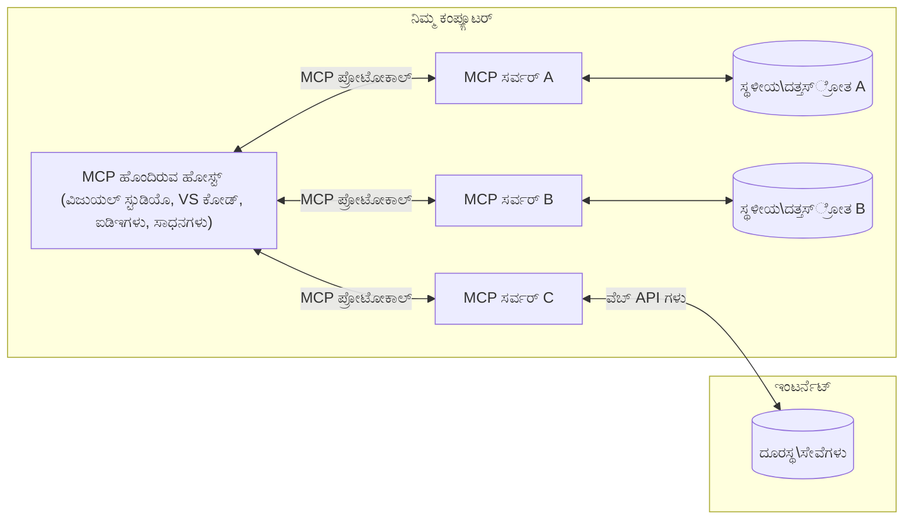

# MCP ಮೂಲಭೂತ ধারণೆಗಳು: AI ಸಂಯೋಜನೆಗಾಗಿ ಮಾದರಿ ಸಾಂದರ್ಭಿಕ ಪ್ರೋಟೋಕಾಲ್‌ನ್ನು ಮಾಸ್ಟರ್‌ಮೈಂಡ್ ಮಾಡುವುದು

[](https://youtu.be/earDzWGtE84)

_(ಈ ಪಾಠದ ವಿಡಿಯೋವನ್ನು ವೀಕ್ಷಿಸಲು ಮೇಲಿನ ಚಿತ್ರವನ್ನು ಕ್ಲಿಕ್ ಮಾಡಿ)_

[ಮಾದರಿ ಸಾಂದರ್ಭಿಕ ಪ್ರೋಟೋಕಾಲ್ (MCP)](https://github.com/modelcontextprotocol) ಒಂದು ಶಕ್ತಿಶಾಲಿ, ಸ್ಟ್ಯಾಂಡರ್ಡೈಜ್ಡ್ ಫ್ರೆಮ್‌ವರ್ಕ್ ಆಗಿದ್ದು, ದೊಡ್ಡ ಭಾಷಾ ಮಾದರಿಗಳು (LLMs) ಮತ್ತು ಹೋಗುವ ಸಾಧನಗಳು, ಅಪ್ಲಿಕೇಶನ್ಗಳು ಮತ್ತು ಡೇಟಾ ಮೂಲಗಳ ನಡುವಿನ ಸಂವಹನವನ್ನು ಅತ್ಯುತ್ತಮಗೊಳಿಸುತ್ತದೆ.  
ಈ ಮಾರ್ಗದರ್ಶಕರು MCP ನ ಮೂಲಭೂತ ಕನ್ಸೆಪ್ಟ್‌ಗಳ ಮೂಲಕ ನಿಮಗೆ ಮಾರ್ಗದರ್ಶನ ಮಾಡುತ್ತದೆ. ನೀವು ಇದರ ಕ್ಲೈಂಟ್-ಸರ್ವರ್ معماري, ಅತ್ಯವಶ್ಯಕ घटಕಗಳು, ಸಂವಹನ ಕಾರ್ಯಪಧ್ಧತಿಗಳು ಮತ್ತು ಅನುಷ್ಠಾನ ಉತ್ತಮ ಅಂಶಗಳನ್ನು ಕಲಿಯುತ್ತೀರಿ.

- **ಬಿರುದುಯುಕ್ತ ಬಳಕೆದಾರಾನುಮತಿ**: ಎಲ್ಲಾ ಡೇಟಾ ಪ್ರವೇಶ ಮತ್ತು ಕಾರ್ಯಾಚರಣೆಗಳು ನಿರ್ವಹಿಸುವ ಮೊದಲು ಸ್ಪಷ್ಟ ಬಳಕೆದಾರ ಅನುಮತಿಯನ್ನು ಅಗತ್ಯವಿರುತ್ತದೆ. ಬಳಕೆದಾರರು ಯಾವ ಡೇಟಾ ಪ್ರವೇಶಿಸುವುದು ಮತ್ತು ಯಾವ ಕ್ರಿಯೆಗಳು ನೆರವೇರಿಸುವುದೆಂದು ಸ್ಪಷ್ಟವಾಗಿ ಅರ್ಥಮಾಡಿಕೊಳ್ಳಬೇಕು, ಮತ್ತು ಅನುಮತಿ ಮತ್ತು ಪ್ರಾಧಿಕಾರಗಳ ಮೇಲೆ ಸೂಕ್ಷ್ಮ ನಿಯಂತ್ರಣ ಇರಬೇಕು.

- **ಡೇಟಾ ಗೌಪ್ಯತೆ ರಕ್ಷಣೆ**: ಬಳಕೆದಾರರ ಡೇಟಾ ಕೇವಲ ಸ್ಪಷ್ಟ ಅನುಮತಿ ದೊರಕಿಸಿದಾಗಲಷ್ಟೇ ಬಹಿರಂಗಪಡಿಸಬಹುದಾಗಿದೆ ಮತ್ತು ಇಡೀ ಸಂವಹನ ಚಕ್ರದಲ್ಲಿ ಕಠಿಣ ಪ್ರವೇಶ ನಿಯಂತ್ರಣಗಳಿಂದ ರಕ್ಷಿಸಬೇಕಾಗುತ್ತದೆ. ಅನುಷ್ಠಾನಗಳು ಅಯೋಗ್ಯ ಡೇಟಾ ಪ್ರಸರಣವನ್ನು ತಡೆಹಿಡಿದು, ಕಠಿಣ ಗೌಪ್ಯತೆ ಮೀರಿದಂತೆ ಇರಬೇಕು.

- **ಸಾಧನ ಕಾರ್ಯಾಚರಣೆಯ ಸುರಕ್ಷತೆ**: ಪ್ರತಿಯೊಂದು ಸಾಧನ ಕರೆಗೂ ಸ್ಪಷ್ಟ ಬಳಕೆದಾರ ಅನುಮತಿ ಅಗತ್ಯವಿದ್ದು, ಸಾಧನದ ಕಾರ್ಯಕ್ಷಮತೆ, ಪರಿಮಾಣಗಳು ಮತ್ತು ಸಾಧ್ಯ ಪರಿಣಾಮಗಳನ್ನು ಸ್ಪಷ್ಟವಾಗಿ ಅರ್ಥಮಾಡಿಕೊಳ್ಳಬೇಕು. ಗಟ್ಟಿಯಾದ ಭದ್ರತಾ ಗಡಿ ಅನವಶ್ಯಕ, ಅಸುರಕ್ಷಿತ ಅಥವಾ ದುರ್ಬಲವಾದ ಸಾಧನ ಕಾರ್ಯಾಚರಣೆಗಳನ್ನು ತಡೆಹಿಡಿಯಬೇಕು.

- **ಟ್ರಾನ್ಸ್‌ಪೋರ್ಟ್ ಲೇಯರ್ ಭದ್ರತೆ**: ಎಲ್ಲಾ ಸಂವಹನ ಚಾನಲ್‌ಗಳು ಸೇರ್ಪಡೆ encryption ಮತ್ತು ಪ್ರಮಾಣೀಕರಣ ಕ್ರಮಗಳನ್ನು ಬಳಸಬೇಕು. ದೂರದ ಸಂಪರ್ಕಗಳು ಭದ್ರ ಟ್ರಾನ್ಸ್‌ಪೋರ್ಟ್ ಪ್ರೋಟೋಕಾಲ್‌ಗಳನ್ನು ಅನುಷ್ಠಾನಗೊಳಿಸಿ ಮತ್ತು ಸರಿಯಾದ ಪ್ರಮಾಣಪತ್ರ ನಿರ್ವಹಣೆ ಮಾಡಬೇಕು.

#### ಅನುಷ್ಠಾನ ಮಾರ್ಗಸೂಚಿಗಳು:

- **ಅನುಮತಿ ನಿರ್ವಹಣೆ**: ಬಳಕೆದಾರರು ಯಾವ ಸರ್ವರ್‌ಗಳು, ಸಾಧನಗಳು ಮತ್ತು ռೆಸೋರ್ಸ್‌ಗಳ ಪ್ರವೇಶವನ್ನು ನಿಯಂತ್ರಿಸಬಹುದು ಎಂದು ಸೂಕ್ಷ್ಮ ಅನುಮತಿ ವ್ಯವಸ್ಥೆಗಳನ್ನು ಅನುಷ್ಠಾನಗೊಳಿಸಿ  
- **ಪ್ರಮಾಣೀಕರಣ ಮತ್ತು ಪ್ರಾಧಿಕಾರ**: ಸುರಕ್ಷಿತ ಪ್ರಮಾಣೀಕರಣ ವಿಧಾನಗಳನ್ನು (OAuth, API ಕೀಲಿಗಳು) ಸರಿಯಾದ ಟೋಕನ್ ನಿರ್ವಹಣೆ ಮತ್ತು ಅವಧಿ ಮುಕ್ತಾಯದೊಂದಿಗೆ ಬಳಸಿ  
- **ಇನ್ಪುಟ್ ಮಾನ್ಯತೆ**: ಇಂಜೆಕ್ಷನ್ ಹುರುಪುಗಳಿಂದ ತಪ್ಪಿಸಲು ಮಾದರಿಸಿಕೊಂಡಿದ್ದ ಕ್ರಮಬದ್ಧ ಕೇಳಲಾಗುತ್ತದೆಪರಾಮೇತರ್ಗಳು ಮತ್ತು ಡೇಟಾ ಇನ್ಪುಟ್‌ಗಳನ್ನು ಪರಿಶೀಲಿಸಿ  
- **ಆಡಿಟ್ ಲಾಗಿಂಗ್**: ಭದ್ರತಾ ನಿಗವಣಿಕೆ ಮತ್ತು ಅನುಕೂಲತೆಗಾಗಿ ಎಲ್ಲಾ ಕಾರ್ಯಾಚರಣೆಗಳ ಸಂಪೂರ್ಣ ಲಾಗ್‌ಗಳನ್ನು ಸಂರಕ್ಷಿಸಿ

## ಅವಲೋಕನ

ಈ ಪಾಠವು ಮಾದರಿ ಸಾಂದರ್ಭಿಕ ಪ್ರೋಟೋಕಾಲ್ (MCP) ಪರಿಸರದ ಮೂಲ معماري ಮತ್ತು ಘಟಕಗಳನ್ನು ಅನ್ವೇಷಿಸುತ್ತದೆ. ನೀವು ಕ್ಲೈಂಟ್-ಸರ್ವರ್ معماري, ಪ್ರಮುಖ ಘಟಕಗಳು ಮತ್ತು MCP ಸಂವಹನ ಕಾರ್ಯಪಧ್ಧತಿಗಳನ್ನು ಕಲಿತೀರಿ.

## ಪ್ರಮುಖ ಕಲಿಕೆಯ ಗುರಿಗಳು

ಈ ಪಾಠದ ಕೊನೆಯಲ್ಲಿ, ನೀವು:

- MCP ಕ್ಲೈಂಟ್-ಸರ್ವರ್ معماري ಅರ್ಥಮಾಡಿಕೊಳ್ಳುವಿರಿ.  
- ಹೋಸ್ಟ್‌ಗಳು, ಕ್ಲೈಂಟ್‌ಗಳು ಮತ್ತು ಸರ್ವರ್‌ಗಳ ಪಾತ್ರ ಮತ್ತು ಜವಾಬ್ದಾರಿಗಳನ್ನು ಗುರುತಿಸುವಿರಿ.  
- MCP ಗೆ ಒದಗಿಸಿದ ಲವಚಿಕ ಸಮಾಜಮಾಡುವ ಅಂಶಗಳನ್ನು ವಿಶ್ಲೇಷಿಸುವಿರಿ.  
- MCP ಪರಿಸರದಲ್ಲಿ ಮಾಹಿತಿಯ ಹರிவನ್ನು ಕಲಿಯುವಿರಿ.  
- .NET, ಜಾವಾ, ಪೈಥಾನ್ ಮತ್ತು ಜಾವಾಸ್ಕ್ರಿಪ್ಟ್‌ನಲ್ಲಿ ಕೋಡ್ ಉದಾಹರಣೆಗಳಲ್ಲಿ ಪ್ರಾಯೋಗಿಕ ಅಂಶಗಳನ್ನು ಪಡೆಯುವಿರಿ.

## MCP معماري: ಒಂದು ಆಳವಾದ ನೋಟ

MCP ಪರಿಸರವು ಕ್ಲೈಂಟ್-ಸರ್ವರ್ ಮಾದರಿಯ ಮೇಲೆ ನಿರ್ಮಿತವಾಗಿದೆ. ಈ ಮೊಡೆಲರ್ ರಚನೆ AI ಅಪ್ಲಿಕೇಶನ್ಗಳು ಸಾಧನಗಳು, ಡೇಟಾಬೇಸ್‌ಗಳು, APIಗಳು ಹಾಗೂ ಸಾಂದರ್ಭಿಕ ರೆಸೋರ್ಸ್‌ಗಳೊಂದಿಗೆ ಪರಿಣಾಮಕಾರಿಯಾಗಿ ಸಂವಹನ ನಡೆಸಲು ಸಾಧ್ಯವಾಗುತ್ತದೆ. ಈ معماريಯನ್ನು ಅದರ ಮೂಲ ಘಟಕಗಳಿಗೆ ವಿಭಜಿಸೋಣ.

ಮೂಲತಃ, MCP ಒಂದು ಕ್ಲೈಂಟ್-ಸರ್ವರ್ معماري ಅನುಸರಿಸುತ್ತದೆ, ಇಲ್ಲಿ ಒಂದು ಹೋಸ್ಟ್ ಅಪ್ಲಿಕೇಶನ್ ಹಲವಾರು ಸರ್ವರ್‌ಗಳಿಗೆ ಸಂಪರ್ಕ ಹೊಂದಬಹುದು:


- **MCP ಹೋಸ್ಟ್‌ಗಳು**: VSCode, Claude Desktop, IDE ಗಳು, ಅಥವಾ MCP ಮೂಲಕ ಡೇಟಾ ಪ್ರವೇಶಿಸಲು ಬಯಸುವ AI ಸಾಧನಗಳು  
- **MCP ಕ್ಲೈಂಟ್‌ಗಳು**: ಸರ್ವರ್‌ಗಳೊಂದಿಗೆ 1:1 ಸಂಪರ್ಕಗಳನ್ನು ನಿರ್ವಹಿಸುವ ಪ್ರೋಟೋಕಾಲ್ ಕ್ಲೈಂಟ್‌ಗಳು  
- **MCP ಸರ್ವರ್‌ಗಳು**: ಪ್ರತಿ ಸರ್ವರ್ ವಿಶೇಷ ಸಾಮರ್ಥ್ಯಗಳನ್ನು ಸ್ಟ್ಯಾಂಡರ್ಡೈಜ್ಡ್ ಮಾದರಿ ಸಾಂದರ್ಭಿಕ ಪ್ರೋಟೋಕಾಲ್ ಮೂಲಕ ಪ್ರದರ್ಶಿಸುವ ಸುಲಭ ಕಾರ್ಯಕ್ರಮಗಳು  
- **ಸ್ಥಳೀಯ ಡೇಟಾ ಮೂಲಗಳು**: ನಿಮ್ಮ ಕಂಪ್ಯೂಟರ್‌ನ ಕಡತಗಳು, ಡೇಟಾಬೇಸ್‌ಗಳು ಮತ್ತು ಸೇವೆಗಳು, ಅವುಗಳನ್ನು MCP ಸರ್ವರ್‌ಗಳು ಸುರಕ್ಷಿತವಾಗಿ ಪ್ರವೇಶಿಸಬಹುದು  
- **ದೂರಸ್ಥ ಸೇವೆಗಳು**: ಇಂಟರ್ನೆಟ್ ಮೂಲಕ ಲಭ್ಯವಿರುವ ಬಾಹ್ಯ ವ್ಯವಸ್ಥೆಗಳು, ಅವು MCP ಸರ್ವರ್‌ಗಳಿಗೆ API ಗಳ ಮೂಲಕ ಸಂಪರ್ಕ ಸಾಧಿಸುತ್ತವೆ.

MCP ಪ್ರೋಟೋಕಾಲ್ ದಿನಾಂಕ ಆಧಾರಿತ ಸಂಸ್ಕರಣೆ(YYYY-MM-DD ಸ್ವರೂಪ) ಬಳಸಿ ಅಭಿವೃದ್ಧಿಯಾಗುತ್ತಿದೆ. ಪ್ರಸ್ತುತ ಪ್ರೋಟೋಕಾಲ್ ಸಂಸ್ಕರಣೆ **2025-11-25** ಆಗಿದೆ. 最新  [ಪ್ರೋಟೋಕಾಲ್ ವಿಶೇಷಣ](https://modelcontextprotocol.io/specification/2025-11-25/) ಅನ್ನು ನೋಡಬಹುದು

### 1. ಹೋಸ್ಟ್‌ಗಳು

ಮಾದರಿ ಸಾಂದರ್ಭಿಕ ಪ್ರೋಟೋಕಾಲ್ (MCP) ನಲ್ಲಿ, **ಹೋಸ್ಟ್‌ಗಳು** ಬಳಕೆದಾರರು ಪ್ರೋಟೋಕಾಲ್ ಮೂಲಕ ಸಂವಹನ ನಡೆಸುವ ಪ್ರಮುಖ ಜೋಡಣಾ ಅಪ್ಲಿಕೇಶನ್ಗಳಾಗಿವೆ. ಹೋಸ್ಟ್‌ಗಳು ವಿವಿಧ MCP ಸರ್ವರ್‌ಗಳಿಗೆ ಸಂಪರ್ಕ ನೆಲಸಲು ಪ್ರತಿ ಸರ್ವರ್ ಸಂಪರ್ಕಕ್ಕೆ ವಿಶೇಷ MCP ಕ್ಲೈಂಟ್ ಸೃಷ್ಟಿಸುವ ಮೂಲಕ ಸಂಪರ್ಕಗಳನ್ನು ಸಂಯೋಜಿಸುತ್ತವೆ ಮತ್ತು ನಿರ್ವಹಿಸುತ್ತವೆ. ಹೋಸ್ಟ್ ಉದಾಹರಣೆಗಳು:

- **AI ಅಪ್ಲಿಕೇಶನ್ಗಳು**: Claude Desktop, Visual Studio Code, Claude Code  
- **ಅಭಿವೃದ್ಧಿ ವಾತಾವರಣಗಳು**: MCP ಸಂಯೋಜನೆಯೊಂದಿಗೆ IDE ಗಳು ಮತ್ತು ಕೋಡ್ ಸಂಪಾದಕಗಳು  
- **ಕಸ್ಟಮ್ ಅಪ್ಲಿಕೇಶನ್ಗಳು**: ಉದ್ದೇಶಿತ AI ಏಜೆಂಟ್‌ಗಳು ಮತ್ತು ಸಾಧನಗಳು

**ಹೋಸ್ಟ್‌ಗಳು** AI ಮಾದರಿ ಸಂವಹನಗಳನ್ನು ಸಂಯೋಜಿಸುವ ಅಪ್ಲಿಕೇಶನ್ಗಳಾಗಿವೆ. ಅವು:

- **AI ಮಾದರಿಗಳನ್ನು ವೀಕ್ಷಣೆ ಮಾಡುತ್ತಾರೆ**: ಉತ್ತರಗಳನ್ನು ಉತ್ಪಾದಿಸಲು ಅಥವಾ LLM ಗಳೊಂದಿಗೆ ಸಂವಹನ ನಡೆಸಲು AI ಕಾರ್ಯಪ್ರವಾಹಗಳನ್ನು ಸಂಯೋಜಿಸುತ್ತವೆ  
- **ಕ್ಲೈಂಟ್ ಸಂಪರ್ಕಗಳನ್ನು ನಿರ್ವಹಣೆ ಮಾಡುತ್ತಾರೆ**: ಪ್ರತಿ MCP ಸರ್ವರ್ ಸಂಪರ್ಕಕ್ಕೆ ಒಂದು MCP ಕ್ಲೈಂಟ್ ಸೃಷ್ಟಿಸಿ ನಿರ್ವಹಿಸುತ್ತವೆ  
- **ಬಳಕೆದಾರ ಇಂಟರ್ಫೇಸ್ ನಿಯಂತ್ರಣ**: ಸಂಭಾಷಣಾ ಹರಿವು, ಬಳಕೆದಾರ ಸಂವಹನ ಮತ್ತು ಪ್ರತಿಕ್ರಿಯೆ ಪ್ರದರ್ಶನವನ್ನು ನಿರ್ವಹಿಸುತ್ತವೆ  
- **ಭದ್ರತೆಯನ್ನು ಜಾರಿಗೊಳಿಸುತೆವೆ**: ಅನುಮತಿ, ಭದ್ರತಾ ನಿಯಮಗಳು ಮತ್ತು ಪ್ರಮಾಣೀಕರಣವನ್ನು ನಿಯಂತ್ರಿಸುತ್ತವೆ  
- **ಬಳಕೆದಾರ ಅನುಮತಿಯನ್ನು ನಿರ್ವಹಣೆ ಮಾಡುತ್ತವೆ**: ಡೇಟಾ ಹಂಚಿಕೆ ಮತ್ತು ಸಾಧನ ಕಾರ್ಯಾಚರಣೆಗೆ ಬಳಕೆದಾರ ಅನುಮತಿಯನ್ನ ನಿಯಂತ್ರಿಸುತ್ತವೆ  

### 2. ಕ್ಲೈಂಟ್‌ಗಳು

**ಕ್ಲೈಂಟ್‌ಗಳು** ಹೋಸ್ಟ್ ಮತ್ತು MCP ಸರ್ವರ್‌ಗಳ ನಡುವಣ ಸಮರ್ಪಿತ ಒಂದು-ಒಂದು ಸಂಪರ್ಕಗಳನ್ನು ಕಾಯುವ ಅಗತ್ಯ ಘಟಕಗಳಾಗಿವೆ. ಪ್ರತಿ MCP ಕ್ಲೈಂಟ್ ಒಂದು ನಿರ್ದಿಷ್ಟ MCP ಸರ್ವರ್‌ಗೆ ಸಂಪರ್ಕ ಹೊಂದಲು ಹೋಸ್ಟ್ ಮೂಲಕ ಸೃಷ್ಟಿಸಲಾಗುತ್ತದೆ, ಇದರಿಂದ ಸಂಘಟಿತ ಮತ್ತು ಸುರಕ್ಷಿತ ಸಂವಹನ ಚಾನೆಲ್‌ಗಳಿಗೆ ಸಹಾಯ ಆಗುತ್ತದೆ. ಹಲವಾರು ಕ್ಲೈಂಟ್‌ಗಳಿದ್ದು ಹೋಸ್ಟ್‌ಗಳು ಒಂದೇ ಸಮಯದಲ್ಲಿ ಹಲವು ಸರ್ವರ್‌ಗಳಿಗೆ ಸಂಪರ್ಕ ಹೊಂದಲು ಸಾಧ್ಯವಾಗುತ್ತದೆ.

**ಕ್ಲೈಂಟ್‌ಗಳು** ಹೋಸ್ಟ್ ಅಪ್ಲಿಕೇಶನ್ ಒಳಗಿನ ಸಂಪರ್ಕ ಘಟಕಗಳಾಗಿವೆ. ಅವು:

- **ಪ್ರೋಟೋಕಾಲ್ ಸಂವಹನ**: JSON-RPC 2.0 ವಿನಂತಿಗಳನ್ನು ಪ್ರಾಂಪ್ಟ್‌ಗಳು ಮತ್ತು ಸೂಚನೆಗಳೊಂದಿಗೆ ಸರ್ವರ್‌ಗಳಿಗೆ ಕಳುಹಿಸುತ್ತವೆ  
- **ಸಾಮರ್ಥ್ಯ ಚರ್ಚೆ**: ಪ್ರಾರಂಭದಾಗ ಸರ್ವರ್‌ಗಳೊಂದಿಗೆ ಬೆಂಬಲಿತ ವೈಶಿಷ್ಟ್ಯಗಳ ಮತ್ತು ಪ್ರೋಟೋಕಾಲ್ ಆವೃತ್ತಿಗಳನ್ನ ಚರ್ಚಿಸುತ್ತವೆ  
- **ಸಾಧನ ಕಾರ್ಯಾಚರಣೆ**: ಮಾದರಿಗಳಿಂದ ಸಾಧನ ಕಾರ್ಯಾಚರಣೆ ವಿನಂತಿಗಳನ್ನು ನಿರ್ವಹಿಸಿ ಪ್ರತಿಕ್ರಿಯೆಗಳನ್ನು ಪ್ರಕ್ರಿಯೆ ಮಾಡುತ್ತವೆ  
- **ನೈಜಕಾಲಿಕ ನವೀಕರಣಗಳು**: ಸರ್ವರ್‌ಗಳ ನೋಟಿಫಿಕೇಶನ್‌ಗಳು ಮತ್ತು ನೈಜಕಾಲಿಕ ನವೀಕರಣಗಳನ್ನು ನಿರ್ವಹಿಸುತ್ತವೆ  
- **ಪ್ರತಿಕ್ರಿಯೆ ಪ್ರಕ್ರಿಯೆ**: ಬಳಕೆದಾರರಿಗೆ ಪ್ರದರ್ಶನಕ್ಕಾಗಿ ಸರ್ವರ್ ಪ್ರತಿಕ್ರಿಯೆಗಳನ್ನು ಸ್ವೀಕರಿಸಿ ಸ್ವರೂಪಗೊಳಿಸುತ್ತವೆ  

### 3. ಸರ್ವರ್‌ಗಳು

**ಸರ್ವರ್‌ಗಳು** MCP ಕ್ಲೈಂಟ್‌ಗಳಿಗೆ ಸಾಂದರ್ಭಿಕ ಮಾಹಿತಿ, ಸಾಧನಗಳು ಮತ್ತು ಸಾಮರ್ಥ್ಯಗಳನ್ನು ಒದಗಿಸುವ ಕಾರ್ಯಕ್ರಮಗಳಾಗಿವೆ. ಅವು ಸ್ಥಳೀಯವಾಗಿ (ಹೋಸ್ಟ್‌ನೊಂದೇ ಯಂತ್ರ) ಅಥವಾ ದೂರದ (ಬಾಹ್ಯ ವೇದಿಕೆಗಳ ಮೇಲೆ) ನಡೆಯಬಹುದು ಮತ್ತು ಕ್ಲೈಂಟ್ ವಿನಂತಿಗಳನ್ನು ನಿರ್ವಹಿಸಿ ಸಂರಚಿತ ಪ್ರತಿಕ್ರಿಯೆಗಳನ್ನು ಒದಗಿಸುತ್ತವೆ. ಸರ್ವರ್‌ಗಳು ಪ್ರೋಟೋಕಾಲ್ ಮೂಲಕ ನಿರ್ದಿಷ್ಟ ಕಾರ್ಯಗಳನ್ನು ಬಹಿರಂಗಪಡಿಸುತ್ತವೆ.

**ಸರ್ವರ್‌ಗಳು** ಸಾಂದರ್ಭಿಕ ಮಾಹಿತಿ ಮತ್ತು ಸಾಮರ್ಥ್ಯಗಳನ್ನು ಒದಗಿಸುವ ಸೇವೆಗಳಾಗಿವೆ. ಅವು:

- **ವೈಶಿಷ್ಟ್ಯ ನೊಂದಣಿ**: ಲಭ್ಯವಿರುವ ಮೂಲಭೂತ ಘಟಕಗಳು (ಸಂಪನ್ಮೂಲಗಳು, ಪ್ರಾಂಪ್ಟ್‌ಗಳು, ಸಾಧನಗಳು) ಕ್ಲೈಂಟ್‌ಗಳಿಗೆ ನೋಂದಣಿ ಮಾಡಿಸಿ ಬಹಿರಂಗಪಡಿಸುತ್ತವೆ  
- **ವಿನಂತಿ ಪ್ರಕ್ರಿಯೆ**: ಸಾಧನ ಕರೆಗೆ, ಸಂಪನ್ಮೂಲ ವಿನಂತಿ ಮತ್ತು ಪ್ರಾಂಪ್ಟ್ ವಿನಂತಿ ಸ್ವೀಕರಿಸಿ ಮತ್ತು ಕಾರ್ಯಗತಗೊಳಿಸುತ್ತವೆ  
- **ಸಾಂದರ್ಭಿಕ ಕಲ್ಪನೆ**: ಮಾದರಿ ಪ್ರತಿಕ್ರಿಯೆಗಳನ್ನು ಉತ್ತಮಗೊಳಿಸಲು ಸಾಂದರ್ಭಿಕ ಮಾಹಿತಿ ಮತ್ತು ಡೇಟಾ ಒದಗಿಸುತ್ತವೆ  
- **ಸ್ಥಿತಿ ನಿರ್ವಹಣೆ**: ಅಗತ್ಯವಿದ್ದರೆ ಸೆಷನ್ ಸ್ಥಿತಿಯನ್ನು ನಿರ್ವಹಿಸಿ ಸ್ಥಿತಿಗತ ಸಂವಹನಗಳನ್ನು ನಿರ್ವಹಿಸುತ್ತವೆ  
- **ನೈಜಕಾಲಿಕ ನೊಟಿಫಿಕೇಶನ್ಗಳು**: ಸಾಮರ್ಥ್ಯ ಬದಲಾವಣೆ ಮತ್ತು ನವೀಕರಣಗಳ ಕುರಿತು ಸಂಪರ್ಕಿತರಾದ ಕ್ಲೈಂಟ್‌ಗಳಿಗೆ ನೊಟಿಫಿಕೇಶನ್‌ಗಳನ್ನು ಕಳುಹಿಸುತ್ತವೆ  

ಸರ್ವರ್‌ಗಳನ್ನು ಯಾರು ಬೇಕಾದರೂ ವಿಶೇಷ ಕಾರ್ಯಚಟುವಟಿಕೆಗಳೊಂದಿಗೆ ಮಾದರಿ ಸಾಮರ್ಥ್ಯಗಳನ್ನು ವಿಸ್ತರಿಸಲು ಅಭಿವೃದ್ಧಿಪಡಿಸಬಹುದು, ಮತ್ತು ಅವು ಸ್ಥಳೀಯ ಹಾಗೂ ದೂರಸ್ಥ ನಿಯೋಜನೆ ದೃಶ್ಯಗಳನ್ನು ಬೆಂಬಲಿಸುತ್ತವೆ.

### 4. ಸರ್ವರ್ ಪ್ರಿಮಿಟಿವ್‌ಗಳು

ಮಾದರಿ ಸಾಂದರ್ಭಿಕ ಪ್ರೋಟೋಕಾಲ್ (MCP) ನಲ್ಲಿ ಸರ್ವರ್‌ಗಳು ಮೂರು ಮೂಲ **ಪ್ರಿಮಿಟಿವ್‌ಗಳು** ಒದಗಿಸುತ್ತವೆ, ಅವು ಕ್ಲೈಂಟ್‌ಗಳು, ಹೋಸ್ಟ್‌ಗಳು ಮತ್ತು ಭಾಷಾ ಮಾದರಿಗಳ ನಡುವಣ ಸಾಂದರ್ಭಿಕ, ಸಮೃದ್ಧ ಸಂವಹನದ ಮೂಲ ಘಟಕಗಳನ್ನು ನಿರ್ಧರಿಸುತ್ತವೆ. ಈ ಪ್ರಿಮಿಟಿವ್‌ಗಳು ಪ್ರೋಟೋಕಾಲ್ ಮೂಲಕ ಲಭ್ಯವಿರುವ ಸಾಂದರ್ಭಿಕ ಮಾಹಿತಿ ಮತ್ತು ಕ್ರಿಯೆಗಳ ವಿಧಗಳನ್ನು ಸೂಚಿಸುತ್ತವೆ.

MCP ಸರ್ವರ್‌ಗಳು ಕೆಳಗಿನ ಮೂರು ಮೂಲ ಪ್ರಿಮಿಟಿವ್‌ಗಳ ಯಾವುದೇ ಸಂಯೋಜನೆಯನ್ನು ಬಹಿರಂಗಪಡಿಸಬಹುದು:

#### ಸಂಪನ್ಮೂಲಗಳು

**ಸಂಪನ್ಮೂಲಗಳು** AI ಅಪ್ಲಿಕೇಶನ್ಗಳು ಬಳಸಲು ಸಾಂದರ್ಭಿಕ ಮಾಹಿತಿಯನ್ನು ಒದಗಿಸುವ ಡೇಟಾ ಮೂಲಗಳಾಗಿವೆ. ಅವು ಸ್ಥಿರ ಅಥವಾ ಚಲಿಸುವ ವಿಚಾರವಸ್ತುಗಳನ್ನು ಪ್ರತಿನಿಧಿಸುತ್ತವೆ, ಇವು ಮಾದರಿ ಅರ್ಥಗರ್ಭಿತಗೆ ಮತ್ತು ನಿರ್ಧಾರಗಳ ಕೈಗೊಳ್ಳಿಕೆಗೆ ನೆರವಾಗುತ್ತವೆ:

- **ಸಾಂದರ್ಭಿಕ ಡೇಟಾ**: AI ಮಾದರಿ ಬಳಕೆಗೆ ರಚನೆಯಾದ ಮಾಹಿತಿ ಮತ್ತು ಸಾಂದರ್ಭಿಕತೆ  
- **ಜ್ಞಾನ ಮೂಲಗಳು**: ದಸ್ತಾವೇಜ್ ಸಂಗ್ರಹಾಲಯಗಳು, ಲೇಖನಗಳು, ಕೈಪಿಡಿಗಳು ಮತ್ತು ಸಂಶೋಧನಾ ಪ್ರಬಂಧಗಳು  
- **ಸ್ಥಳೀಯ ಡೇಟಾ ಮೂಲಗಳು**: ಕಡತಗಳು, ಡೇಟಾಬೇಸ್‌ಗಳು ಮತ್ತು ಸ್ಥಳೀಯ ವ್ಯವಸ್ಥೆ ಮಾಹಿತಿಗಳು  
- **ಬಾಹ್ಯ ಡೇಟಾ**: API ಪ್ರತಿಕ್ರಿಯೆಗಳು, ವೆಬ್ ಸೇವೆಗಳು ಮತ್ತು ದೂರಸ್ಥ ವ್ಯವಸ್ಥೆ ಡೇಟಾ  
- ** ಚಲಿಸುವ ವಿಷಯವಸ್ತು**: ಬಾಹ್ಯ ಪರಿಸ್ಥಿತಿಗಳ ಆಧಾರದ ಮೇಲೆ ನವೀಕೃತ ನೈಜಕಾಲಿಕ ಡೇಟಾ

ಸಂಪನ್ಮೂಲಗಳನ್ನು URI ಗಳಿಂದ ಗುರುತಿಸಲಾಗುತ್ತವೆ ಹಾಗೂ `resources/list` ಮೂಲಕ ಹುಡುಕಬಹುದು ಮತ್ತು `resources/read` ಮೂಲಕ ಪಡೆಯಬಹುದು:

```text
file://documents/project-spec.md
database://production/users/schema
api://weather/current
```
  
#### ಪ್ರಾಂಪ್ಟ್‌ಗಳು

**ಪ್ರಾಂಪ್ಟ್‌ಗಳು** ಭಾಷಾ ಮಾದರಿಗಳೊಂದಿಗೆ ಸಂವಹನವನ್ನು ರಚಿಸಲು ಪುನ೭ಬಳಕೆಗೊಳ್ಳುವ ಟೆಂಪ್ಲೇಟುಗಳಾಗಿವೆ. ಅವು ಮಾನಕರಿತ ಸಂವಹನ ಮಾದರಿಗಳು ಮತ್ತು ಟೆಂಪ್ಲೇಟಡ್ ಕಾರ್ಯಪಧ್ಧತಿಗಳನ್ನು ಒದಗಿಸುತ್ತವೆ:

- **ಟೆಂಪ್ಲೇಟ್ ಆಧಾರಿತ ಸಂವಹನ**: ಪೂರ್ವ ರಚಿಸಲಾದ ಸಂದೇಶಗಳು ಮತ್ತು ಸಂಭಾಷಣೆ ಪ್ರಾರಂಭಕಗಳು  
- **ಕಾರ್ಯಪಧ್ಧತಿ ಟೆಂಪ್ಲೇಟುಗಳು**: ಸಾಮಾನ್ಯ ಕಾರ್ಯಗಳಿಗೆ ಮಾನಕರಿತ ಕ್ರಮಗಳು  
- **ಸಣ್ಣ-ಶಾಟ್ ಉದಾಹರಣೆಗಳು**: ಮಾದರಿ ನಿರ್ದೇಶನಕ್ಕಾಗಿ ಉದಾಹರಣೆ ಆಧಾರಿತ ಟೆಂಪ್ಲೇಟುಗಳು  
- **ಸಿಸ್ಟಮ್ ಪ್ರಾಂಪ್ಟ್‌ಗಳು**: ಮಾದರಿ ವರ್ತನೆ ಮತ್ತು ಸಾಂದರ್ಭಿಕತೆಗೆ ಮೂಲಭೂತ ಪ್ರಾಂಪ್ಟ್‌ಗಳು  
- **ಚಲಿಸುವ ಟೆಂಪ್ಲೇಟ್‌ಗಳು**: ನಿರ್ದಿಷ್ಟ ಸಾಂದರ್ಭಿಕತೆಗಳಿಗೆ ಹೊಂದುವ ಪರಿಮಿತಿಯ ಕಾಯಿಕಗಳು

ಪ್ರಾಂಪ್ಟ್‌ಗಳು ಸಾಪೇಕ್ಷ ಬದಲಾವಣೆಯನ್ನು ಬೆಂಬಲಿಸುತ್ತವೆ ಮತ್ತು `prompts/list` ಮೂಲಕ ಹುಡುಕಬಹುದು ಮತ್ತು `prompts/get` ಮೂಲಕ ಪಡೆಯಬಹುದು:

```markdown
Generate a {{task_type}} for {{product}} targeting {{audience}} with the following requirements: {{requirements}}
```
  
#### ಸಾಧನಗಳು

**ಸಾಧನಗಳು** AI ಮಾದರಿಗಳು ನಿರ್ದಿಷ್ಟ ಕ್ರಿಯೆಗಳನ್ನು ನಡೆಸಲು ಕರೆಮಾಡಬಹುದಾದ ಕಾರ್ಯಾಚರಣೆಗಳಾಗಿವೆ. ಅವು MCP ಪರಿಸರದ "ಕ್ರಿಯಾಪದಗಳು" ಆಗಿದ್ದು, ಮಾದರಿಗಳು ಬಾಹ್ಯ ವ್ಯವಸ್ಥೆಗಳಿಗೆ ಸಂವಹನ ನಡೆಸಲು ನೆರವಾಗುತ್ತವೆ:

- **ನಿರ್ವಹಿಸಲು ಸಾಧ್ಯವಿರುವ ಕಾರ್ಯಗಳು**: ನಿರ್ದಿಷ್ಟ ಪರಿಮಾಣಗಳೊಂದಿಗೆ ಮಾದರಿಗಳು ಕರೆಮಾಡಬಹುದಾದ ವೈಭಿನ್ನಿಕ ಕಾರ್ಯಗಳು  
- **ಬಾಹ್ಯ ವ್ಯವಸ್ಥೆಯ ಸಂಯೋಜನೆ**: API ಕರೆಗಳು, ಡೇಟಾಬೇಸ್ ಚೇತನಗಳು, ಕಡತ ಕಾರ್ಯಾಚರಣೆಗಳು, ಲೆಕ್ಕಾಚಾರಗಳು  
- **ವೈಶಿಷ್ಟಿಕ ಪರಿಚಯ**: ಪ್ರತಿ ಸಾಧನದ अलग-अलग ಹೆಸರು, ವಿವರಣೆ, ಮತ್ತು ಪರಿಮಾಣದ ಸ್ಕೀಮಾ  
- **ಸಂರಚಿತ ಇನ್‌ಪುಟ್/ಔಟ್‌ಪುಟ್**: ಸಾಧನಗಳು ಮಾನ್ಯತೆ ಪಡೆದ ಪರಿಮಾಣಗಳನ್ನು ಸ್ವೀಕರಿಸಿ, ಸಂರಚಿತ ಹಾಗೂ ವಿಧಿಪರ ಪ್ರತಿಕ್ರಿಯೆಗಳನ್ನು ನೀಡುತ್ತವೆ  
- **ಕ್ರಿಯಾಶೀಲ ಸಾಮರ್ಥ್ಯಗಳು**: ಮಾದರಿಗಳು ನೈಜ ಜಗತ್ತಿನ ಕ್ರಿಯೆಗಳನ್ನು ಮಾಡುತ್ತಾ, ನೈಜ ವಿಳಂಬಗಳು ಪಡೆದುಕೊಳ್ಳುವಂತಿರಬಹುದು  

ಸಾಧನಗಳನ್ನು ಪರಿಮಾಣ ಮಾನ್ಯತಿಗಾಗಿ JSON Schema ಯೊಂದಿಗೆ ವ್ಯಾಖ್ಯಾನಿಸಲಾಗಿದ್ದು, `tools/list` ಮೂಲಕ ಹುಡುಕಬಹುದು ಹಾಗೂ `tools/call` ಮೂಲಕ ಕಾರ್ಯಗತಗೊಳಿಸಲಾಗುತ್ತದೆ. ಸಾಧನಗಳು ಉತ್ತಮ UI ಪ್ರದರ್ಶನಕ್ಕೆ ಹೆಚ್ಚುವರಿ ಮೆಟಾಡೇಟಾದಾಗಿ **ಐಕಾನ್**ಗಳನ್ನು ಸಹ ಹೊಂದಿರಬಹುದು.

**ಸಾಧನ ವಿಶೇಷಣಗಳು**: ಸಾಧನಗಳು ವರ್ತನಾತ್ಮಕ ಟಿಪ್ಪಣಿಗಳನ್ನು (ಉದಾ. `readOnlyHint`, `destructiveHint`) ಬೆಂಬಲಿಸುತ್ತವೆ, ಇದರಿಂದ ಸಾಧನವು ಓದಲು ಮಾತ್ರವೋ ಅಥವಾ ಪ್ರವೇಶವಿದ್ದ ಹಾನಿಕರವಾಗಿದೆ ಎಂದೇ ತಿಳಿಯುತ್ತದೆ, ಮತ್ತು ಕ್ಲೈಂಟ್‌ಗಳು ಸಾಧನ ಕಾರ್ಯಾಚರಣೆಗಳಿಗೆಜ್ಞಾನಪೂರ್ಣ ನಿರ್ಧಾರಗಳನ್ನು ಕೈಗೊಳ್ಳಲು ಸಹಾಯ ಮಾಡುತ್ತವೆ.

ಉದಾಹರಣೆಯ ಸಾಧನ ವ್ಯಾಸಂಗ:

```typescript
server.tool(
  "search_products", 
  {
    query: z.string().describe("Search query for products"),
    category: z.string().optional().describe("Product category filter"),
    max_results: z.number().default(10).describe("Maximum results to return")
  }, 
  async (params) => {
    // ಹುಡುಕಾಟವನ್ನು ನಿರ್ವಹಿಸಿ ಮತ್ತು ಸಂರचित ಫಲಿತಾಂಶಗಳನ್ನು ಹಿಂತಿರುಗಿಸಿ
    return await productService.search(params);
  }
);
```
  
## ಕ್ಲೈಂಟ್ ಪ್ರಿಮಿಟಿವ್‌ಗಳು

ಮಾದರಿ ಸಾಂದರ್ಭಿಕ ಪ್ರೋಟೋಕಾಲ್ (MCP) ನಲ್ಲಿ, **ಕ್ಲೈಂಟ್‌ಗಳು** ಸರ್ವರ್‌ಗಳಿಗೆ ಮುಂಭಾಗದ ಅಪ್ಲಿಕೇಶನ್‌ನಿಂದ ಹೆಚ್ಚುವರಿ ಸಾಮರ್ಥ್ಯಗಳನ್ನು ಕೇಳಲು ಪ್ರಿಮಿಟಿವ್‌ಗಳನ್ನು ಬಹಿರಂಗಪಡಿಸುವ ಸಾಧ್ಯತೆಯಿದೆ. ಈ ಕ್ಲೈಂಟ್ ಬಳಕೆಯ ಪ್ರಿಮಿಟಿವ್‌ಗಳು ಸಮೃದ್ಧ, ಹೆಚ್ಚು ಸಂವಹನ ಹೊಂದಿರುವ ಸರ್ವರ್ ಅನುಷ್ಠಾನಗಳನ್ನು ಅವಕಾಶ ಮಾಡಿಕೊಡುತ್ತವೆ, ಮತ್ತು AI ಮಾದರಿ ಸಾಮರ್ಥ್ಯಗಳು ಹಾಗೂ ಬಳಕೆದಾರ ಸಂವಹನಗಳಿಗೆ ಪ್ರವೇಶ ನೀಡುತ್ತವೆ.

### ಸ್ಯಾಂಪ್ಲಿಂಗ್

**ಸ್ಯಾಂಪ್ಲಿಂಗ್** ಸರ್ವರ್‌ಗಳಿಗೆ ಕ್ಲೈಂಟ್‌ನ AI ಅಪ್ಲಿಕೇಶನ್‌ನಿಂದ ಭಾಷಾ ಮಾದರಿ ಪೂರ್ಣಗೊಳಿಸುವಿಕೆಗಳನ್ನು ಕೇಳಲು ಅವಕಾಶ ಮಾಡಿಕೊಡುತ್ತದೆ. ಈ ಪ್ರಿಮಿಟಿವ್ ಸರ್ವರ್‌ಗಳಿಗೆ ತಮ್ಮದೇ ಮಾದರಿ ಅವಲಂಬನೆಗಳಿಲ್ಲದೆ LLM ಸಾಮರ್ಥ್ಯಗಳಿಗೆ ಪ್ರವೇಶ ನೀಡುತ್ತದೆ:

- **ಮಾದರಿ-ಸ್ವತಂತ್ರ ಪ್ರವೇಶ**: ಸರ್ವರ್‌ಗಳು LLM SDKಳನ್ನ ಒಳಗೊಂಡಿಲ್ಲದೆ ಮತ್ತು ಮಾದರಿ ಪ್ರವೇಶ ನಿರ್ವಹಿಸುವುದಿಲ್ಲದೆ ಪೂರ್ಣಗೊಳಿಸುವಿಕೆಗಳನ್ನು ಕೇಳಬಹುದು  
- **ಸರ್ವರ್ ಪ್ರಾರಂಭಿತ AI**: ಸರ್ವರ್‌ಗಳು ಸ್ವತಂತ್ರವಾಗಿ 클ೈಂಟ್‌ನ AI ಮಾದರಿ ಬಳಸಿ ವಿಷಯವನ್ನು ರಚಿಸಬಹುದು  
- **ಪುನರಾವರ್ತಿತ LLM ಸಂವಹನಗಳು**: ಸರ್ವರ್‌ಗಳಿಗೆ ಪ್ರಕ್ರಿಯೆಗಾಗಿ AI ಸಹಾಯ ಬೇಕಾದ ಸಮೀಕ್ಷಿತ ಸನ್ನಿವೇಶಗಳನ್ನು ಬೆಂಬಲಿಸುತ್ತದೆ  
- **ಚಲಿಸುವ ವಿಷಯ ಉತ್ಪಾದನೆ**: ಹೋಸ್ಟ್‌ನ ಮಾದರಿ ಬಳಸಿ ಸಾಂದರ್ಭಿಕ ಪ್ರತಿಕ್ರಿಯೆಗಳನ್ನು ಸೃಷ್ಟಿಸಲು ಸರ್ವರ್‌ಗಳಿಗೆ ಅವಕಾಶ ನೀಡುತ್ತದೆ  
- **ಸಾಧನ ಕರೆ ಬೆಂಬಲ**: ಸರ್ವರ್‌ಗಳು `tools` ಮತ್ತು `toolChoice` ಪರಿಮಾಣಗಳನ್ನು ಸೇರಿಸಬಹುದು, ಇದರಿಂದ ಕ್ಲೈಂಟ್‌ನ ಮಾದರಿ ಸ್ಯಾಂಪ್ಲಿಂಗ್ ವೇಳೆ ಸಾಧನಗಳನ್ನು ಕರೆಮಾಡಬಹುದು

ಸ್ಯಾಂಪ್ಲಿಂಗ್ ಅನ್ನು `sampling/complete` ವಿಧಾನದಿಂದ ಪ್ರಾರಂಭಿಸಲಾಗುತ್ತದೆ, ಇಲ್ಲಿ ಸರ್ವರ್‌ಗಳು ಪೂರ್ಣಗೊಳಿಸುವಿಕೆ ವಿನಂತಿಗಳನ್ನು ಕ್ಲೈಂಟ್‌ಗೆ ಕಳುಹಿಸುತ್ತವೆ.

### ರೂಟ್ಸ್

**ರೂಟ್ಸ್** ಸರ್ವರ್‌ಗಳಿಗೆ ಅಪ್ಲಿಕೇಶನ್‌ಗಳ ಫೈಲ್ ಸಿಸ್ಟಂ ಮಿತಿಗಳನ್ನು ಎಕ್ಸ್‌ಪೋಸ್ ಮಾಡಲು ಕ್ಲೈಂಟ್‌ಗಳಿಗೆ ಮಾನಕರಿತ ಪದ್ದತಿಯನ್ನು ಒದಗಿಸುತ್ತವೆ, ಇದರಿಂದ ಸರ್ವರ್‌ಗಳು ಯಾವ ಡೈರೆಕ್ಟರಿಗಳು ಮತ್ತು ಕಡತಗಳಿಗೆ ಪ್ರವೇಶ ಇದೆ ಎಂದು ತಿಳಿದುಕೊಳ್ಳುತ್ತವೆ:

- **ಫೈಲ್ ಸಿಸ್ಟಂ ಮಿತಿಗಳು**: ಸರ್ವರ್‌ಗಳು ಫೈಲ್ ಸಿಸ್ಟಂ ಒಳಗೆ ಕಾರ್ಯಾಚರಣೆ ನಡೆಸಬಹುದಾದ ಮಿತಿಗಳನ್ನು ನಿರ್ಧರಿಸುತೆವೆ  
- **ಪ್ರವೇಶ ನಿಯಂತ್ರಣ**: ಸರ್ವರ್‌ಗಳು ಯಾವ ಡೈರೆಕ್ಟರಿಗಳು ಮತ್ತು ಕಡತಗಳಿಗೆ ಅನುಮತಿ ಇದೆ ಎಂದು ಅರ್ಥಮಾಡಿಕೊಳ್ಳಲು ಸಹಾಯ ಮಾಡುತ್ತದೆ  
- **ಚಲಿಸುವ ನವೀಕರಣಗಳು**: ರೂಟ್ಸ್ ಪಟ್ಟಿ ಬದಲಾಗುವಾಗ ಕ್ಲೈಂಟ್‌ಗಳು ಸರ್ವರ್‌ಗಳಿಗೆ ನೊಟಿಫೈ ಮಾಡಬಹುದು  
- **URI ಆಧಾರಿತ ಗುರುತು**: ರೂಟ್ಸ್ `file://` URI ಗಳನ್ನು ಬಳಸಿ ಲಭ್ಯವಿರುವ ಡೈರೆಕ್ಟರಿ ಮತ್ತು ಕಡತಗಳನ್ನು ಗುರುತಿಸುತ್ತವೆ

ರೂಟ್ಸ್ ಅನ್ನು `roots/list` ಮೂಲಕ ಹುಡುಕಬಹುದು, ಮತ್ತು ರೂಟ್ಸ್ ಬದಲಾದಾಗ ಕ್ಲೈಂಟ್ ಗಳು `notifications/roots/list_changed` ಕಳುಹಿಸುತ್ತವೆ.

### ಇಲಿಸಿಟೇಶನ್

**ಇಲಿಸಿಟೇಶನ್** ಸರ್ವರ್‌ಗಳಿಗೆ ಬಳಕೆದಾರರಿಂದ ಹೆಚ್ಚುವರಿ ಮಾಹಿತಿ ಅಥವಾ ದೃಢೀಕರಣವನ್ನು ಕ್ಲೈಂಟ್ ಇಂಟರ್ಫೇಸ್ ಮೂಲಕ ಕೇಳಲು ಅವಕಾಶ ಮಾಡಿಕೊಡುತ್ತದೆ:

- **ಬಳಕೆದಾರ ಇನ್ಪುಟ್ ವಿನಂತಿಗಳು**: ಸಾಧನ ಕಾರ್ಯನಿರ್ವಹಣೆಗಾಗಿ ಅಗತ್ಯವಿದ್ದಾಗ ಸರ್ವರ್‌ಗಳು ಹೆಚ್ಚುವರಿ ಮಾಹಿತಿ ಕೇಳಬಹುದು  
- **ದೃಢೀಕರಣ ಸಂಭಾಷಣೆಗಳು**: ಸಂವೇದನಶೀಲ ಅಥವಾ ಪರಿಣಾಮಕಾರಿಯಾದ ಕಾರ್ಯಗಳಿಗೆ ಬಳಕೆದಾರ ಅನುಮತಿ ಕೇಳುವಿರಿ  
- **ಸಂವಹನ ಕಾರ್ಯಪಧ್ಧತಿಗಳು**: ಹಂತ ಹಂತವಾಗಿ ಬಳಕೆದಾರ ಸಂವಹನ ಸೃಷ್ಟಿಸಲು ಸರ್ವರ್‌ಗಳಿಗೆ ಸಾಧ್ಯತೆ  
- **ಚಲಿಸುವ ಪರಿಮಾಣ ಸಮಾಹರಣೆ**: ಸಾಧನ ಕಾರ್ಯನಿರ್ವಹಣೆಯಲ್ಲಿ ತಾರತಮ್ಯ ಅಥವಾ ಐಚ್ಛಿಕ ಪರಿಮಾಣಗಳನ್ನು ಸಂಗ್ರಹಿಸಬಹುದು  

ಇಲಿಸಿಟೇಶನ್ ವಿನಂತಿಗಳನ್ನು ಕ್ಲೈಂಟ್ ಇಂಟರ್ಫೇಸ್ ಮೂಲಕ ಬಳಕೆದಾರ ಇನ್ಪುಟ್ ಸಂಗ್ರಹಿಸಲು `elicitation/request` ರೀತಿಯಲ್ಲಿ ಮಾಡಲಾಗುತ್ತದೆ.

**URL ಮೋಡ್ ಇಲಿಸಿಟೇಶನ್**: ಸರ್ವರ್‌ಗಳು URL ಆಧಾರಿತ ಬಳಕೆದಾರ ಸಂವಹನವನ್ನು ಕೇಳಬಹುದು, ಇದರಿಂದ ಬಳಕೆದಾರರನ್ನು ಪ್ರಾಮಾಣೀಕರಣ, ದೃಢೀಕರಣ ಅಥವಾ ಡೇಟಾ ನಮೂಧಿಗೆ ಬಾಹ್ಯ ವೆಬ್ ಪುಟಗಳಿಗೆ ನೇರಿಸಬಹುದು.

### ಲಾಗ್ ಮಾಡಲು

**ಲಾಗಿಂಗ್** ಸರ್ವರ್‌ಗಳಿಗೆ ಡೀಬಗಿಂಗ್, ಮೇಲ್ವಿಚಾರಣೆ ಮತ್ತು ಕಾರ್ಯಚಟುವಟಿಕೆಗಳ ಸ್ಪಷ್ಟತೆಯನ್ನು ನೀಡಲು ಕ್ಲೈಂಟ್‌ಗಳಿಗೆ ಸಂರಚಿತ ಲಾಗ್ ಸಂದೇಶಗಳನ್ನು ಕಳುಹಿಸಲು ಅನುಮತಿಸುತ್ತದೆ:

- **ಡೀಬಗಿಂಗ್ ಬೆಂಬಲ**: ಸಮಸ್ಯೆ ಪರಿಹಾರದಿಗಾಗಿ ಸಂಘಟಿತ ಕಾರ್ಯಾಚರಣೆ ಲಾಗ್‌ಗಳನ್ನು ಒದಗಿಸಲು ಸರ್ವರ್‌ಗಳಿಗೆ ಅವಕಾಶ  
- **ಕಾರ್ಯಾಚಲನ ಮೇಲ್ವಿಚಾರಣೆ**: ಕ್ಲೈಂಟ್‌ಗಳಿಗೆ ಸ್ಥಿತಿಗತಿಯ ನವೀಕರಣಗಳು ಮತ್ತು ಕಾರ್ಯಕ್ಷಮತಾ ಪ್ರಮಾಣಗಳನ್ನು ಕಳುಹಿಸುವುದು  
- **ದೋಷ ವರದಿ**: ದೋಷದ ವಿವರ ಮತ್ತು ನಿರ್ಧಾರ ಮಾಹಿತಿ ಒದಗಿಸುವುದು  
- **ಆಡಿಟ್ ಟ್ರೇಲ್ಗಳು**: ಸರ್ವರ್ ಕಾರ್ಯಾಚರಣೆ ಮತ್ತು ನಿರ್ಧಾರಗಳ ಸಂಪೂರ್ಣ ಲಾಗ್‌ಗಳನ್ನು ಸೃಷ್ಟಿಸುವುದು

ಲಾಗ್ ಸಂದೇಶಗಳನ್ನು ಸರ್ವರ್‌ಗಳ ಕಾರ್ಯಾಚರಣೆಗಳಲ್ಲಿ ಪಾರದರ್ಶಕತೆಯನ್ನು ಒದಗಿಸಲು ಮತ್ತು ಡೀಬಗ್ ಮಾಡಲು ಕ್ಲೈಂಟ್‌ಗಳಿಗೆ ಕಳುಹಿಸಲಾಗುತ್ತದೆ.

## MCPನಲ್ಲಿ ಮಾಹಿತಿ ಹರಿವು

ಮಾದರಿ ಸಾಂದರ್ಭಿಕ ಪ್ರೋಟೋಕಾಲ್ (MCP) ಹೋಸ್ಟ್‌ಗಳು, ಕ್ಲೈಂಟ್‌ಗಳು, ಸರ್ವರ್‌ಗಳು ಮತ್ತು ಮಾದರಿಗಳ ನಡುವೆ ಸಂರಚಿತ ಮಾಹಿತಿ ಹರಿವನ್ನು ವ್ಯಾಖ್ಯಾನಿಸುತ್ತದೆ. ಈ ಹರಿವು ಬಳಕೆದಾರ ವಿನಂತಿಗಳು ಹೇಗೆ ಪ್ರಕ್ರಿಯೆಗೊಳ್ಳುತ್ತವೆ ಮತ್ತು ಹೊರಗಿನ ಸಾಧನಗಳು ಹಾಗೂ ಡೇಟಾ ಮಾದರಿ ಪ್ರತಿಕ್ರಿಯೆಗಳಲ್ಲಿ ಹೇಗೆ ಸಂಯೋಜಿತಗೊಳ್ಳುತ್ತವೆ ಎಂಬುದನ್ನು ಸ್ಪಷ್ಟಗೊಳಿಸಲು ಸಹಾಯ ಮಾಡುತ್ತದೆ.
- **ಹೋಸ್ಟ್ ಸಂಪರ್ಕವನ್ನು ಪ್ರಾರಂಭಿಸುತ್ತದೆ**  
  ಹೋಸ್ಟ್ ಅಪ್ಲಿಕೇಶನ್ (IDE ಅಥವಾ ಚಾಟ್ ಇಂಟರ್‌ಫೇಸ್‌ ಹಾಗಿರುವುದು) ಸಾಮಾನ್ಯವಾಗಿ STDIO, WebSocket ಅಥವಾ ಇತರ ಬೆಂಬಲಿತ ಸಂಚಾರದ ಮೂಲಕ MCP ಸರ್ವರ್‌ಗೆ ಸಂಪರ್ಕವನ್ನು ಸ್ಥಾಪಿಸುತ್ತದೆ.

- **ಸಾಮರ್ಥ್ಯ ಮತಭೇದ**  
  ಹೋಸ್ಟ್‌ನಲ್ಲಿ ಸಂಯೋಜಿತವಾಗಿರುವ ಕ್ಲೈಂಟ್ ಮತ್ತು ಸರ್ವರ್ ತಮ್ಮ ಬೆಂಬಲಿತ ವೈಶಿಷ್ಟ್ಯಗಳು, ಸಾಧನಗಳು, ಸಂಪನ್ಮೂಲಗಳು, ಮತ್ತು ಪ್ರೋಟೋಕಾಲ್ ಆವೃತ್ತಿಗಳ ಬಗ್ಗೆ ಮಾಹಿತಿ ಹಂಚಿಕೊಳ್ಳುತ್ತಾರೆ. ಇದರಿಂದ ಎರಡು ಪರಗಳೂ ಒಟ್ಟಿಗೆ ಸत्रಕ್ಕಾಗಿ ಲಭ್ಯವಿರುವ ಸಾಮರ್ಥ್ಯಗಳನ್ನು ಅರ್ಥಮಾಡಿಕೊಳ್ಳುತ್ತಾರೆ.

- **ಬಳಕೆದಾರ ವಿನಂತಿ**  
  ಬಳಕೆದಾರರು ಹೋಕ್ಟೊಂದಿಗೆ ಸಂವಹನ ಮಾಡುತ್ತಾರೆ (ಉದಾ. ಪ್ರಾಂಪ್ಟ್ ಅಥವಾ ಆದೇಶವನ್ನು ನಮೂದಿಸುವುದು). ಹೋಸ್ಟ್ ಈ ಇನ್‌ಪುಟ್ ಅನ್ನು ಸಂಗ್ರಹಿಸಿ ಕ್ಲೈಂಟ್‌ಗೆ ಪ್ರಕ್ರಿಯೆಗಾಗಿಸುತ್ತಾನೆ.

- **ಸಂಪನ್ಮೂಲ ಅಥವಾ ಸಾಧನ ಬಳಕೆ**  
  - ಕ್ಲೈಂಟ್ ಸರ್ವರ್‌ನಿಂದ ಹೆಚ್ಚುವರಿ ಪ್ರಸಂಗ ಅಥವಾ ಸಂಪನ್ಮೂಲಗಳನ್ನು (ಫೈಲ್‌ಗಳು, ಡೇಟಾಬೇಸ್ ಎಂಟ್ರಿಗಳು, ಅಥವಾ ಜ್ಞಾನ ಆಧಾರ ಲೇಖನಗಳು) ವಿನಂತಿಸಬಹುದು, ಮಾದರಿಯ ಉಪಜ್ಞಾಪನೆಯನ್ನು ಉತ್ತೇಜಿಸಲು.  
  - ಮಾದರಿ ಯಾವುದೇ ಸಾಧನವನ್ನು (ಉದಾ. ಡೇಟಾವನ್ನು ಪಡೆಯಲು, ಲೆಕ್ಕಾಚಾರ ಮಾಡಲು, ಅಥವಾ API ಕಳುಹಿಸಲು) ಅಗತ್ಯವೋ ಎಂದು ನಿರ್ಧರಿಸಿದರೆ, ಕ್ಲೈಂಟ್ ಸಾಧನ ಬಳಕೆ ವಿನಂತಿಯನ್ನು ಸರ್ವರ್‌ಗೆ ಕಳುಹಿಸುತ್ತದೆ, ಸಾಧನದ ಹೆಸರು ಮತ್ತು ಪರಿಮಾಣಗಳನ್ನು ನಿಗದಿ ಪಡಿಸುತ್ತಾ.

- **ಸರ್ವರ್ ಕಾರ್ಯಾಚರಣೆ**  
  ಸರ್ವರ್ ಸಂಪನ್ಮೂಲ ಅಥವಾ ಸಾಧನ ವಿನಂತಿ ಪಡೆಯುತ್ತದೆ, ಅಗತ್ಯ ಕಾರ್ಯಾಚರಣೆಗಳನ್ನು (ಕಾರ್ಯವಾಹಿ ಚಲಿಸುವುದು, ಡೇಟಾಬೇಸ್ ಪ್ರಶ್ನಿಸುವುದು, ಅಥವಾ ಫೈಲ್ ಪಡೆಯುವುದು) ನಡೆಸಿ, ಫಲಿತಾಂಶಗಳನ್ನು ಸಂರಚಿತ ಸ್ವರೂಪದಲ್ಲಿ ಕ್ಲೈಂಟ್‌ಗೆ ಹಿಂತಿರುಗಿಸುತ್ತದೆ.

- **ಪ್ರತ್ಯುತ್ತರ ರಚನೆ**  
  ಕ್ಲೈಂಟ್ ಸರ್ವರ್ արձಕೆಲುತ್ತಿರುವ ಪ್ರತಿಕ್ರಿಯೆಗಳ (ಸಂಪನ್ಮೂಲ ಡೇಟಾ, ಸಾಧನ ಔಟ್‌ಪುಟ್‌ಗಳು ಇತ್ಯಾದಿ) ಸಂಯೋಜನೆ ಮಾಡುತ್ತದೆ ಮಾದರಿಯ ನಿರಂತರ ಸಂವಹನದಲ್ಲಿ. ಮಾದರಿ ಈ ಮಾಹಿತಿಯನ್ನು ಬಳಸಿಕೊಂಡು ಸಮಗ್ರ ಮತ್ತು प्रसಂಗಕ್ಕೆ ಹೊಂದಿಕೊಂಡ ಪ್ರತಿಕ್ರಿಯೆಯನ್ನು ಉತ್ಪಾದಿಸುತ್ತದೆ.

- **ಫಲಿತಾಂಶ ಪ್ರಸ್ತುತಿಕೆ**  
  ಹೋಸ್ಟ್ ಕ್ಲೈಂಟ್‌ನಿಂದ ಅಂತಿಮ ಔಟ್‌ಪುಟ್ ಪಡೆಯುತ್ತದೆ ಮತ್ತು ಬಳಸುವವರಿಗೆ ಪ್ರದರ್ಶಿಸುತ್ತದೆ, ಬಹುಶಃ ಮಾದರಿ ಸೃಷ್ಟಿಸಿದ ಕೇಂದ್ರಿತ ಪಠ್ಯ ಹಾಗೂ ಸಾಧನ ಕಾರ್ಯಾಚರಣೆಗಳು ಅಥವಾ ಸಂಪನ್ಮೂಲ ಹುಡುಕಿದ ಫಲಿತಾಂಶಗಳೊಂದಿಗೆ.

ಈ ಪ್ರವಾಸ MCP ಗೆ ಪರಿಷ್ಕೃತ, ಸಂವಹನಾತ್ಮಕ ಮತ್ತು ಸಂದರ್ಭಾನುಸಾರ AI ಅಪ್ಲಿಕೇಶನ್‌ಗಳನ್ನು ಬೆಂಬಲಿಸಲು ಮಾದರಿಗಳನ್ನು ಬಾಹ್ಯ ಸಾಧನಗಳು ಮತ್ತು ಡೇಟಾ ಮೂಲಗಳೊಂದಿಗೆ ಸೌಂದರ್ಯಪೂರ್ವಕವಾಗಿ ಸಂಪರ್ಕಿಸುವ ಮೂಲಕ ಅನುವು ಮಾಡಿಕೊಡುತ್ತದೆ.

## ಪ್ರೋಟೋಕಾಲ್ ವಿನ್ಯಾಸ ಮತ್ತು ರೂಪಗಳು

MCP ಎರಡು ವಿಭಿನ್ನ ವಾಸ್ತುಶಿಲ್ಪ تہಗಳಲ್ಲಿ ನಿರ್ಮಿತವಾಗಿದ್ದು ಇದು ಸಂಪೂರ್ಣ ಸಂವಹನ ಹಿನ್ನೆಲೆ ಒದಗಿಸಲು ಸಹಕರಿಸುವುದು:

### ಡೇಟಾ تہ

**ಡೇಟಾ تہ** MCP ಪ್ರೋಟೋಕಾಲ್‌ನ ಹೊರತಾಗಿಯೇ **JSON-RPC 2.0** ಆಧಾರಿತವಾಗಿದೆ. ಈ تہ ಸಂದೇಶ ರಚನೆ, ಅರ್ಥ, ಸಂವಹನ ಮಾದರಿಗಳನ್ನು ನಿಗದಿಪಡಿಸುತ್ತದೆ:

#### ಮೂಲ ಘಟಕಗಳು:

- **JSON-RPC 2.0 ಪ್ರೋಟೋಕಾಲ್**: ಎಲ್ಲ ಸಂವಹನಗಳು ಮಾನಕಗೊಳ್ಳಲಾದ JSON-RPC 2.0 ಸಂದೇಶ ರೂಪವನ್ನು ವಿಧಾನ ಕರೆಗಳು, ಪ್ರತಿಕ್ರಿಯೆಗಳು ಮತ್ತು ಸೂಚನೆಗಳಿಗಾಗಿ ಬಳಸುತ್ತದೆ
- **ಜೀವಚಕ್ರ ನಿರ್ವಹಣೆ**: ಸಂಪರ್ಕ ಪ್ರಾರಂಭ, ಸಾಮರ್ಥ್ಯ ಪ್ರಮಾಣಮಾನ ಮತ್ತು ಸತ್ರ ಕೊನೆಗೊಳ್ಳುವಿಕೆಯನ್ನು ನಿರ್ವಹಿಸುತ್ತದೆ
- **ಸರ್ವರ್ ಪ್ರಿಮಿಟಿವ್ಸ್**: ಸರ್ವರ್‌ಗೆ ಸಾಧನಗಳು, ಸಂಪನ್ಮೂಲಗಳು ಮತ್ತು ಪ್ರಾಂಪ್ಟ್ಗಳ ಮೂಲಕ ಮೂಲ ಕಾರ್ಯಕ್ಷಮತೆ ಒದಗಿಸಲು ಅನುಮತಿಸುತ್ತದೆ
- **ಕ್ಲೈಂಟ್ ಪ್ರಿಮಿಟಿವ್ಸ್**: ಸರ್ವರ್‌ಗಳು LLM ಗಳಿಂದ ಮಾದರಿ ನಿದರ್ಶನ ಕೇಳಲು, ಬಳಕೆದಾರ ಇನ್‌ಪುಟ್ ಪಡೆಯಲು ಮತ್ತು ಲಾಗ್ ಸಂದೇಶಗಳನ್ನು ಕಳುಹಿಸಲು ಅನುಮತಿಸುತ್ತದೆ
- **ವಾಸ್ತವ ಸಮಯ ಸೂಚನೆಗಳು**: ನಿರಂತರ ಮತ್ತು ಅಪೋಲಿಂಗ್ ಇಲ್ಲದ ಡೈನಾಮಿಕ್ ನವೀಕರಣಗಳಿಗಾಗಿ ಅಸಿಂಕ್ರೋನಸ್ ಸೂಚನೆಗಳನ್ನು ಬೆಂಬಲಿಸುತ್ತದೆ

#### ಮುಖ್ಯ ಲಕ್ಷಣಗಳು:

- **ಪ್ರೋಟೋಕಾಲ್ ಆವೃತ್ತಿ ಪರಿಷ್ಕರಣೆ**: ದಿನಾಂಕ ಆಧಾರಿತ ಆವೃತ್ತಿಕರಣ (YYYY-MM-DD) ಬಳಸಿ ಹೊಂದಾಣಿಕೆಯನ್ನು ಖಚಿತಪಡಿಸುತ್ತದೆ
- **ಸಾಮರ್ಥ್ಯ ಪತ್ತೆ**: ಕ್ಲೈಂಟ್ ಮತ್ತು ಸರ್ವರ್ ಪ್ರಾರಂಭದ ವೇಳೆ ಬೆಂಬಲಿತ ವೈಶಿಷ್ಟ್ಯ ಮಾಹಿತಿ ವಿನಿಮಯ ಮಾಡಿಕೊಳ್ಳುತ್ತಾರೆ
- **ಸ್ಥಿತಿಪೂರ್ಣ ಸತ್ರಗಳು**: ಹಲವಾರು ಸಂವಹನಗಳಲ್ಲಿ ಸಂಪರ್ಕ ಸ್ಥಿತಿಯನ್ನು ನಿರ್ವಹಿಸಿ ಪ್ರಸಂಗ ನಿರಂತರತೆಯನ್ನು ಒದಗಿಸುತ್ತದೆ

### ಸಂಚಾರ تہ

**ಸંચಾರ تہ** MCP ಭಾಗವಹಿಸುವವರ ನಡುವೆ ಸಂಪರ್ಕ ಮಾರ್ಗಗಳು, ಸಂದೇಶ ಹೆಸರಣೆ ಮತ್ತು ಪ್ರಮಾಣೀಕರಣವನ್ನು ನಿರ್ವಹಿಸುತ್ತದೆ:

#### ಬೆಂಬಲಿತ ಸಂಚಾರ ವಿಧಾನಗಳು:

1. **STDIO ಸಂಚಾರ**:  
   - ನೇರ ಪ್ರಕ್ರಿಯಾ ಸಂವಹನಕ್ಕೆ ಮಾನಕ ಇನ್‌ಪುಟ್/ಔಟ್‌ಪುಟ್ ಧಾರಗಳನ್ನು ಬಳಸುತ್ತದೆ  
   - ಯಾವುದೇ ನೆಟ್ವರ್ಕ್ ಭಾರವಿಲ್ಲದೆ ಸ್ಥಳೀಯ ಪ್ರಕ್ರಿಯೆಗಳಿಗಾಗಿ ಸೂಕ್ತ  
   - ಸ್ಥಳೀಯ MCP ಸರ್ವರ್ ಅನುಷ್ಠಾನಗಳಲ್ಲಿ ಸಾಮಾನ್ಯವಾಗಿ ಉಪಯೋಗಿಸುತ್ತದೆ  

2. **Streamable HTTP ಸಂಚಾರ**:  
   - ಕ್ಲೈಂಟ್-ನಿಂದ-ಸರ್ವರ್ ಸಂದೇಶಗಳಿಗೆ HTTP POST ಬಳಸುತ್ತದೆ  
   - ಐಚ್ಛಿಕ Server-Sent Events (SSE) ಮೂಲಕ ಸರ್ವರ್-ನಿಂದ-ಕ್ಲೈಂಟ್ ಸ್ಟ್ರೀಮಿಂಗ್  
   - ನೆಟ್ವರ್ಕ್ ಮೂಲಕ ದೂರಸ್ಥ ಸರ್ವರ್ ಸಂವಹನವನ್ನು ಸಾಧ್ಯಗೊಳಿಸುತ್ತದೆ  
   - ಮಾನಕ HTTP ಪ್ರಮಾಣೀಕರಣ (Bearer ಟೋಕನ್ಗಳು, API ಕೀಗಳು, ಕಸ್ಟಮ್ ಹೆಡರ್‌ಗಳು) ಬೆಂಬಲಿಸುತ್ತದೆ  
   - ಸುರಕ್ಷಿತ ಟೋಕನ್-ಆಧಾರಿತ ಪ್ರಮಾಣೀಕರಣಕ್ಕಾಗಿ MCP OAuth ಅನ್ನು ಶಿಫಾರಸು ಮಾಡುತ್ತದೆ  

#### ಸಂಚಾರ ಅಮೋರ್ತ್ಯತೆ:

ಸಂಚಾರ تہ ಡೇಟಾ تہದಿಂದ ಸಂವಹನ ವಿವರಗಳನ್ನು ಅಮೋರ್ತ್ಯಗೊಳಿಸುತ್ತದೆ, ಎಲ್ಲಾ ಸಂಚಾರ ವಿಧಾನಗಳ ಮೇಲೆ ಒಂದೇ JSON-RPC 2.0 ಸಂದೇಶ ರೂಪವನ್ನು ಬಳಸಲು ಅನುಮತಿಸುತ್ತದೆ. ಇದರಿಂದ ಅಪ್ಲಿಕೇಶನ್‌ಗಳು ಸ್ಥಳೀಯ ಮತ್ತು ದೂರದ ಸರ್ವರ್‌ಗಳಿಗೆ ಸುಗಮವಾಗಿ ಬದಲಾಯಿಸಬಹುದು.

### ಭದ್ರತಾ ಪರಿಗಣನೆಗಳು

MCP ಅಳವಡಿಕೆಯು ಸುರಕ್ಷಿತ, ನಂಬಿಕೆಯುಳ್ಳ ಮತ್ತು ಸುರಕ್ಷಿತ ಸಂವಹನಕ್ಕಾಗಿ ಅನೇಕ ಮಹತ್ವದ ಭದ್ರತಾ ತತ್ವಗಳನ್ನು ಪಾಲಿಸಬೇಕಾಗುತ್ತದೆ:

- **ಬಳಕೆದಾರ ಒಪ್ಪಿಗೆ ಮತ್ತು ನಿಯಂತ್ರಣ**: ಯಾವುದೇ ಡೇಟಾ ಪ್ರವೇಶ ಅಥವಾ ಕಾರ್ಯಾಚರಣೆಗಳ ಮೊದಲು ಬಳಕೆದಾರರಿಂದ ಸ್ಪಷ್ಟ ಒಪ್ಪಿಗೆ ಪಡೆಯಬೇಕು. ಯಾವ ಡೇಟಾ ಹಂಚಿಕೊಳ್ಳಲಾಗುತ್ತದೆ ಮತ್ತು ಯಾವ ಕ್ರಿಯೆಗಳು ಅನುಮತಿ ಪಡೆದಿವೆ ಎಂಬುದರ ಮೇಲೊಂದು ಸ್ಪಷ್ಟ ನಿಯಂತ್ರಣ ಮತ್ತು ಸೌಕರ್ಯಪೂರ್ಣ ಬಳಕೆದಾರ ಇಂಟರ್ಫೇಸ್ ಬೇಕು.

- **ಡೇಟಾ ಗೌಪ್ಯತೆ**: ಬಳಕೆದಾರರ ಡೇಟಾ ಸ್ಪಷ್ಟ ಒಪ್ಪಿಗೆಯಿಂದ ಮಾತ್ರ ಬಹಿರಂಗಗೊಳಿಸಬೇಕು ಮತ್ತು ಸೂಕ್ತ ಪ್ರವೇಶ ನಿಯಂತ್ರಣಗಳಿಂದ ಸಂರಕ್ಷಿಸಬೇಕು. MCP ಅಳವಡಿಕೆಗಳು ಅನಧಿಕೃತ ಡೇಟಾ ಪ್ರಸಾರದಿಂದ ತಡೆಯಬೇಕು ಹಾಗೂ ಎಲ್ಲಾ ಸಂವಹನಗಳಲ್ಲಿ ಗೌಪ್ಯತೆಗೆ ಕಾಪಾಡಬೇಕು.

- **ಸಾಧನ ಸುರಕ್ಷತೆ**: ಯಾವುದೇ ಸಾಧನವನ್ನು ಕರೆ ಮಾಡಲು ಮುಂಚಿತವಾಗಿ ಸ್ಪಷ್ಟ ಬಳಕೆದಾರ ಒಪ್ಪಿಗೆ ಅಗತ್ಯ. ಬಳಕೆದಾರರು ಪ್ರತಿ ಸಾಧನದ ಕಾರ್ಯಾಚರಣೆಗಳನ್ನು ಸ್ಪಷ್ಟವಾಗಿ ಅರ್ಥಮಾಡಿಕೊಳ್ಳಬೇಕು ಮತ್ತು ಅನಧಿಕೃತ ಅಥವಾ ಅಪಾಯಕರ ಕಾರ್ಯಾಚರಣೆಯಿಂದ ರಕ್ಷಿಸಲು ಬಲವಾದ ಭದ್ರತಾ ಸೀಮೆಗಳನ್ನು ಅನುಷ್ಠಾನಗೊಳಿಸಬೇಕು.

ಈ ಭದ್ರತಾ ತತ್ವಗಳನ್ನು ಅನುಸರಿಸುವ ಮೂಲಕ MCP ಬಳಕೆದಾರರ ನಂಬಿಕೆ, ಗೌಪ್ಯತೆ ಮತ್ತು ಸುರಕ್ಷತೆಯನ್ನು ಸುರಕ್ಷಿತವಾಗಿರುತ್ತೇ ಮತ್ತು ಪ್ರಭಾವಶಾಲಿ AI ಮೂಲಸೌಕರ್ಯಗಳೊಂದಿಗಿನ ಸಂಪರ್ಕವನ್ನು ಸಲೀಸಾಗಿ ಒದಗಿಸುತ್ತದೆ.

## ಕೋಡ್ ಉದಾಹರಣೆಗಳು: ಮುಖ್ಯ ಘಟಕಗಳು

ಕೆಳಗಿನ ಪ್ರಮುಖ MCP ಸರ್ವರ್ ಘಟಕಗಳು ಮತ್ತು ಸಾಧನಗಳನ್ನು ಅಳವಡಿಸುವುದಕ್ಕೆ ಹಲವು ಜನಪ್ರಿಯ ಪ್ರೋಗ್ರಾಮಿಂಗ್ ಭಾಷೆಗಳಲ್ಲಿ ಕೋಡ್ ಉದಾಹರಣೆಗಳು ಇವೆ.

### .NET ಉದಾಹರಣೆ: ಸಾಧನಗಳೊಂದಿಗೆ ಸರಳ MCP ಸರ್ವರ್ ರಚನೆ

ಇದು .NET ಕೋಡ್ ಉದಾಹರಣೆಯಾಗಿದೆ, ಇದು ಎಷ್ಟು ಸರಳವಾಗಿ MCP ಸರ್ವರ್ ರಚಿಸಿ ಕಸ್ಟಮ್ ಸಾಧನಗಳನ್ನು ವಿನ್ಯಾಸಗೊಳಿಸುವುದನ್ನೂ ನೋಡುತದೆ. ಸಾಧನಗಳನ್ನು ವ್ಯಾಖ್ಯಾನಿಸಿ ನೋಂದಣಿ ಮಾಡುವುದು, ವಿನಂತಿಗಳನ್ನು ನಿರ್ವಹಿಸುವುದು ಮತ್ತು ಮಾದರಿ ಕಾಂಟೆಕ್ಸ್ಟ್ ಪ್ರೋಟೋಕಾಲ್ ಉಪಯೋಗಿಸಿ ಸರ್ವರ್‌ಗೆ ಸಂಪರ್ಕ ಮಾಡುವುದು ತೋರಿಸುತ್ತದೆ.

```csharp
using System;
using System.Threading.Tasks;
using ModelContextProtocol.Server;
using ModelContextProtocol.Server.Transport;
using ModelContextProtocol.Server.Tools;

public class WeatherServer
{
    public static async Task Main(string[] args)
    {
        // Create an MCP server
        var server = new McpServer(
            name: "Weather MCP Server",
            version: "1.0.0"
        );
        
        // Register our custom weather tool
        server.AddTool<string, WeatherData>("weatherTool", 
            description: "Gets current weather for a location",
            execute: async (location) => {
                // Call weather API (simplified)
                var weatherData = await GetWeatherDataAsync(location);
                return weatherData;
            });
        
        // Connect the server using stdio transport
        var transport = new StdioServerTransport();
        await server.ConnectAsync(transport);
        
        Console.WriteLine("Weather MCP Server started");
        
        // Keep the server running until process is terminated
        await Task.Delay(-1);
    }
    
    private static async Task<WeatherData> GetWeatherDataAsync(string location)
    {
        // This would normally call a weather API
        // Simplified for demonstration
        await Task.Delay(100); // Simulate API call
        return new WeatherData { 
            Temperature = 72.5,
            Conditions = "Sunny",
            Location = location
        };
    }
}

public class WeatherData
{
    public double Temperature { get; set; }
    public string Conditions { get; set; }
    public string Location { get; set; }
}
```

### ಜಾವಾ ಉದಾಹರಣೆ: MCP ಸರ್ವರ್ ಘಟಕಗಳು

ಈ ಉದಾಹರಣೆಯಲ್ಲಿ ಮೇಲಿನ .NET ಉದಾಹರಣೆಯಂತೆ MCP ಸರ್ವರ್ ಮತ್ತು ಸಾಧನ ನೋಂದಣಿಯನ್ನು ಜಾವಾ‌ನಲ್ಲಿ ಹೇಗೆ ಮಾಡಬಹುದು ಎಂಬುದು ತೋರಿಸಲಾಗಿದೆ.

```java
import io.modelcontextprotocol.server.McpServer;
import io.modelcontextprotocol.server.McpToolDefinition;
import io.modelcontextprotocol.server.transport.StdioServerTransport;
import io.modelcontextprotocol.server.tool.ToolExecutionContext;
import io.modelcontextprotocol.server.tool.ToolResponse;

public class WeatherMcpServer {
    public static void main(String[] args) throws Exception {
        // ಒಂದು MCP ಸರ್ವರ್ ಅನ್ನು ರಚಿಸಿ
        McpServer server = McpServer.builder()
            .name("Weather MCP Server")
            .version("1.0.0")
            .build();
            
        // ಹವಾಮಾನ ತಂತ್ರವನ್ನು ನೋಂದಣಿ ಮಾಡಿ
        server.registerTool(McpToolDefinition.builder("weatherTool")
            .description("Gets current weather for a location")
            .parameter("location", String.class)
            .execute((ToolExecutionContext ctx) -> {
                String location = ctx.getParameter("location", String.class);
                
                // ಹವಾಮಾನ ಡೇಟಾವನ್ನು ಪಡೆಯಿರಿ (ಸರಳೀಕೃತ)
                WeatherData data = getWeatherData(location);
                
                // ರೂಪುಗೊಂಡ ಪ್ರತಿಕ್ರಿಯೆಯನ್ನು ಬಾಗಿಸು
                return ToolResponse.content(
                    String.format("Temperature: %.1f°F, Conditions: %s, Location: %s", 
                    data.getTemperature(), 
                    data.getConditions(), 
                    data.getLocation())
                );
            })
            .build());
        
        // stdio ಸಾರಿಗೆ ಬಳಸಿ ಸರ್ವರ್ ಅನ್ನು ಸಂಪರ್ಕಿಸಿ
        try (StdioServerTransport transport = new StdioServerTransport()) {
            server.connect(transport);
            System.out.println("Weather MCP Server started");
            // ಪ್ರಕ್ರಿಯೆ ನಿಲ್ಲುವವರೆಗೆ ಸರ್ವರ್ ಚಾಲನೆ ಇಡಿ
            Thread.currentThread().join();
        }
    }
    
    private static WeatherData getWeatherData(String location) {
        // ಅನುಷ್ಠಾನವು ಹವಾಮಾನ API ಅನ್ನು ಕರೆ ಮಾಡುತ್ತದೆ
        // ಉದಾಹರಣೆಯ ಉದ್ದೇಶಗಳಿಗಾಗಿ ಸರಳೀಕೃತವಾಗಿದೆ
        return new WeatherData(72.5, "Sunny", location);
    }
}

class WeatherData {
    private double temperature;
    private String conditions;
    private String location;
    
    public WeatherData(double temperature, String conditions, String location) {
        this.temperature = temperature;
        this.conditions = conditions;
        this.location = location;
    }
    
    public double getTemperature() {
        return temperature;
    }
    
    public String getConditions() {
        return conditions;
    }
    
    public String getLocation() {
        return location;
    }
}
```

### ಪೈಥಾನ್ ಉದಾಹರಣೆ: MCP ಸರ್ವರ್ ನಿರ್ಮಾಣ

ಈ ಉದಾಹರಣೆಯಲ್ಲಿ fastmcp ಬಳಸಲಾಗಿದೆ, ಆದ್ದರಿಂದ ಮೊದಲು ಅದನ್ನು ಇನ್ಸ್ಟಾಲ್ ಮಾಡಿಕೊಳ್ಳಿ:

```python
pip install fastmcp
```
ಕೋಡ್ ಮಾದರಿ:

```python
#!/usr/bin/env python3
import asyncio
from fastmcp import FastMCP
from fastmcp.transports.stdio import serve_stdio

# ಫಾಸ್ಟ್‌ఎಂಸಿಪಿ ಸರ್ವರ್ ರಚಿಸಿ
mcp = FastMCP(
    name="Weather MCP Server",
    version="1.0.0"
)

@mcp.tool()
def get_weather(location: str) -> dict:
    """Gets current weather for a location."""
    return {
        "temperature": 72.5,
        "conditions": "Sunny",
        "location": location
    }

# ಕ್ಲಾಸ್ ಬಳಸಿ ಪರ್ಯಾಯ ವಿಧಾನ
class WeatherTools:
    @mcp.tool()
    def forecast(self, location: str, days: int = 1) -> dict:
        """Gets weather forecast for a location for the specified number of days."""
        return {
            "location": location,
            "forecast": [
                {"day": i+1, "temperature": 70 + i, "conditions": "Partly Cloudy"}
                for i in range(days)
            ]
        }

# ಕ್ಲಾಸ್ ಉಪಕರಣಗಳನ್ನು ನೊಂದಾಯಿಸಿ
weather_tools = WeatherTools()

# ಸರ್ವರ್ ಪ್ರಾರಂಭಿಸಿ
if __name__ == "__main__":
    asyncio.run(serve_stdio(mcp))
```

### ಜಾವಾಸ್ಕ್ರಿಪ್ಟ್ ಉದಾಹರಣೆ: MCP ಸರ್ವರ್ ರಚನೆ

ಈ ಉದಾಹರಣೆಯಲ್ಲಿ ಜಾವಾಸ್ಕ್ರಿಪ್ಟ್‌ನಲ್ಲಿ MCP ಸರ್ವರ್ ರಚಿಸಲಾಗುತ್ತದೆ ಮತ್ತು ಎರಡು ಹವಾಮಾನ ಸಂಬಂಧಿತ ಸಾಧನಗಳನ್ನು ನೋಂದಣಿ ಮಾಡಲಾಗುತ್ತದೆ.

```javascript
// ಅಧಿಕೃತ ಮಾದರಿ ಸಂರೆಖಾ ಪ್ರೋಟೋಕಾಲ್ SDK ಬಳಸಿ
import { McpServer } from "@modelcontextprotocol/sdk/server/mcp.js";
import { StdioServerTransport } from "@modelcontextprotocol/sdk/server/stdio.js";
import { z } from "zod"; // ಪರಿಮಾಣ ಮಾನ್ಯತೆಗಾಗಿ

// MCP ಸರ್ವರ್ ರಚಿಸಿ
const server = new McpServer({
  name: "Weather MCP Server",
  version: "1.0.0"
});

// ಹವಾಮಾನ ಉಪಕರಣವನ್ನು ನಿರ್ಧರಿಸಿ
server.tool(
  "weatherTool",
  {
    location: z.string().describe("The location to get weather for")
  },
  async ({ location }) => {
    // ಇದು normaltವಾಗಿ ಹವಾಮಾನ API ಅನ್ನು ಕರೆಯುತ್ತದೆ
    // ಪ್ರದರ್ಶನಕ್ಕಾಗಿ ಸರಳೀಕೃತ
    const weatherData = await getWeatherData(location);
    
    return {
      content: [
        { 
          type: "text", 
          text: `Temperature: ${weatherData.temperature}°F, Conditions: ${weatherData.conditions}, Location: ${weatherData.location}` 
        }
      ]
    };
  }
);

// ಮುನ್ಸೂಚನೆ ಉಪಕರಣವನ್ನು ನಿರ್ಧರಿಸಿ
server.tool(
  "forecastTool",
  {
    location: z.string(),
    days: z.number().default(3).describe("Number of days for forecast")
  },
  async ({ location, days }) => {
    // ಇದು normaltವಾಗಿ ಹವಾಮಾನ API ಅನ್ನು ಕರೆಯುತ್ತದೆ
    // ಪ್ರದರ್ಶನಕ್ಕಾಗಿ ಸರಳೀಕೃತ
    const forecast = await getForecastData(location, days);
    
    return {
      content: [
        { 
          type: "text", 
          text: `${days}-day forecast for ${location}: ${JSON.stringify(forecast)}` 
        }
      ]
    };
  }
);

// ಸಹಾಯಕ ಕಾರ್ಯಗಳು
async function getWeatherData(location) {
  // API ಕರೆ ಅನುಕರಿಸಿ
  return {
    temperature: 72.5,
    conditions: "Sunny",
    location: location
  };
}

async function getForecastData(location, days) {
  // API ಕರೆ ಅನುಕರಿಸಿ
  return Array.from({ length: days }, (_, i) => ({
    day: i + 1,
    temperature: 70 + Math.floor(Math.random() * 10),
    conditions: i % 2 === 0 ? "Sunny" : "Partly Cloudy"
  }));
}

// stdio ಸಾರಿಗೆ ಬಳಸಿ ಸರ್ವರ್ ಅನ್ನು ಸಂಪರ್ಕಿಸಿ
const transport = new StdioServerTransport();
server.connect(transport).catch(console.error);

console.log("Weather MCP Server started");
```

ಈ ಜಾವಾಸ್ಕ್ರಿಪ್ಟ್ ಉದಾಹರಣೆ Model Context Protocol SDK ಬಳಸಿ MCP ಸರ್ವರ್ ಹೇಗೆ ರಚಿಸಬಹುದು ಮತ್ತು `weatherTool` ಮತ್ತು `forecastTool` ಎಂಬುದು ಎರಡು ಸಾಧನಗಳನ್ನು ಹೇಗೆ ನೋಂದಣಿ ಮಾಡಬಹುದು ಮತ್ತು ಅವುಗಳನ್ನು `StdioServerTransport` ಮೂಲಕ MCP ಕ್ಲೈಂಟ್‌ಗಳಿಗೆ ಲಭ್ಯವಾಗಿಸುತ್ತಾರೆಯೊ ಅದನ್ನು ತೋರಿಸುತ್ತದೆ.

## ಭದ್ರತೆ ಮತ್ತು ಅನುಮತಿ

MCP ಪ್ರೋಟೋಕಾಲ್‌ಗಷ್ಟೆಲ್ಲ ಭದ್ರತೆ ಮತ್ತು ಅನುಮತಿ ನಿರ್ವಹಣೆಗೆ ವಿವಿಧ ಒಳಗೊಂಡಿರುವ ಸಂಯೋಜನೆಗಳು ಮತ್ತು ಯಂತ್ರಗಳಿವೆ:

1. **ಸಾಧನ ಅನುಮತಿ ನಿಯಂತ್ರಣ**:  
  ಕ್ಲೈಂಟ್ ಮಾದರಿಗೆ ಯಾವ ಸಾಧನಗಳನ್ನು ಬಳಸಲು ಅವಕಾಶ ಇದೆ ಎಂಬುದನ್ನು ಸ್ಪಷ್ಟಪಡಿಸಬಹುದು. ಇದರಿಂದ ಸ್ಪಷ್ಟವಾಗಿ ಅನುಮತಿತ ಸಾಧನಗಳಿಗೆ ಮಾತ್ರ ಪ್ರವೇಶವಿರುತ್ತದೆ, ಅಪರೀಕ್ಷಿತ ಅಥವಾ ಅಪಾಯಕರ ಕಾರ್ಯ ಚಾಲನೆಯ ಅಪಾಯ ಕಡಿಮೆಯಾಗುತ್ತದೆ. ಅನುಮತಿಗಳನ್ನು ಬಳಕೆದಾರ ಇಚ್ಛೆಗಳು, ಸಂಸ್ಥೆ ನೀತಿಗಳು ಅಥವಾ ಸಂವಹನದ ಪ್ರಸಂಗ ಆಧಾರವಾಗಿ ಚಲನವಲನ ಮಾಡಲು ಆಗುತ್ತದೆ.

2. **ಪ್ರಮಾಣೀಕರಣ**:  
  ಸರ್ವರ್‌ಗಳು ಸಾಧನಗಳು, ಸಂಪನ್ಮೂಲಗಳು ಅಥವಾ ಸಂವೇದಿ ಕಾರ್ಯಾಚರಣೆಗಳಿಗೆ ಅನುಮತಿ ನೀಡುವುದಾಗಿ ಮೊದಲಿಗೆ ಪ್ರಮಾಣೀಕರಣವನ್ನು ಕೇಳಬಹುದು. ಇದಕ್ಕೆ API ಕೀಗಳು, OAuth ಟೋಕನ್ಗಳು ಅಥವಾ ಇತರ ಪ್ರಮಾಣೀಕರಣ ವಿಧಾನಗಳು ಸೇರಬಹುದು. ಸರಿಯಾದ ಪ್ರಮಾಣೀಕರಣದಿಂದ ಮಾತ್ರ ವಿಶ್ವಾಸಾರ್ಹ ಕ್ಲೈಂಟ್ ಮತ್ತು ಬಳಕೆದಾರರು ಸರ್ವರ್ ಸಾಮರ್ಥ್ಯಗಳನ್ನು ಕರೆಯುವಂತೆ ಮಾಡುತ್ತಾರೆ.

3. **ಪರಿಹಾಕಣೆ ಪರಿಶೀಲನೆ**:  
  ಪ್ರತಿಯೊಂದು ಸಾಧನ ಕರೆಯಲಿನ ಪರಿಮಾಣಗಳ ಪರಿಶೀಲನೆ ಮಾಡಲಾಗುತ್ತದೆ. ಪ್ರತಿಯೊಂದು ಸಾಧನ ತನ್ನ ಪರಿಮಾಣಗಳ ನಿರೀಕ್ಷಿತ ಪ್ರಕಾರಗಳು, ಸ್ವರೂಪಗಳು ಮತ್ತು ನಿರ್ಬಂಧಗಳನ್ನು ವ್ಯಾಖ್ಯಾನಿಸುತ್ತದೆ, ಸರ್ವರ್ ಬಂದ ವಿನಂತಿಗಳನ್ನು ಆನುವಂಶಿಕವಾಗಿ ಪರಿಶೀಲಿಸುತ್ತದೆ. ಇದರಿಂದ ದುಷ್ಟ, ಬಿತ್ತಿರುವ ಇನ್‌ಪುಟ್‌ಗಳಿಂದ ಸಾಧನ ಅಳವಡಿಕೆಯು ಕಾಪಾಡಲ್ಪಡುತ್ತದೆ ಮತ್ತು ಕಾರ್ಯಕ್ಷಮತೆ ಇಮಾ корзина.

4. **ದರ ನಿರ್ಬಂಧ**:  
  ದುರುಪಯೋಗ ತಡೆಯಲು ಮತ್ತು ಸರ್ವರ್ ಸಂಪನ್ಮೂಲಗಳ ನ್ಯಾಯವಾದ ಬಳಕೆಯನ್ನು ಖಚಿತಪಡಿಸಲು MCP ಸರ್ವರ್‌ಗಳು ಸಾಧನ ಕರೆಗಳು ಮತ್ತು ಸಂಪನ್ಮೂಲ ಪ್ರವೇಶಕ್ಕೆ ದರ ನಿರ್ಬಂಧವನ್ನು ಅಳವಡಿಸಬಹುದು. ದರ ಮಿತಿ ಬಳಕೆದಾರನಂತೆ, ಸತ್ರಾನುಸಾರ ಅಥವಾ ಜಾಗತಿಕವಾಗಿ ಅನ್ವಯಿಸಬಹುದು ಮತ್ತು ಸೇವಾ ನಿರಾಕರಣೆ ಹಾವುಗಳು ಅಥವಾ ಅತಿಯಾಗಿ ಸಂಪನ್ಮೂಲ ಬಳಕೆಯನ್ನು ತಡೆಯಲು ಸಹಾಯಕ.

ಈ ಯಂತ್ರಗಳನ್ನು ಸಂಯೋಜಿಸುವ ಮೂಲಕ MCP ಭೌತಿಕ ಸಾಧನಗಳು ಮತ್ತು ಡೇಟಾ ಮೂಲಗಳೊಂದಿಗೆ ಭಾಷಾ ಮಾದರಿಗಳನ್ನು ಸುರಕ್ಷಿತವಾಗಿ ಸಂಯೋಜಿಸಲು ಭದ್ರತೆಯುಳ್ಳ ಮೂಲಸೌಕರ್ಯವನ್ನು ಒದಗಿಸುತ್ತದೆ, ಮತ್ತು ಬಳಕೆದಾರರಿಗೆ ಮತ್ತು ಡೆವಲಪರ್‌ಗಳಿಗೆ ಪ್ರವೇಶ ಮತ್ತು ಬಳಕೆಯ ಮೇಲೆ ಸೂಕ್ಷ್ಮ ನಿಯಂತ್ರಣ ಕೊಡುತ್ತದೆ.

## ಪ್ರೋಟೋಕಾಲ್ ಸಂದೇಶಗಳು ಮತ್ತು ಸಂವಹನ ಪ್ರವಾಹ

MCP ಸಂವಹನವು ಸ್ಪಷ್ಟ ಮತ್ತು ವಿಶ್ವಾಸಾರ್ಹ ಸಂವಹನಗಳನ್ನು ಸುಗಮಗೊಳಿಸಲು ರಚಿಸಲಾದ **JSON-RPC 2.0** ಸಂದೇಶಗಳನ್ನು ಬಳಸುತ್ತದೆ, ಹೋಸ್ಟ್, ಕ್ಲೈಂಟ್ ಮತ್ತು ಸರ್ವರ್ ನಡುವೆ. ಪ್ರೋಟೋಕಾಲ್ ವಿಭಿನ್ನ ಕಾರ್ಯಾಚರಣೆಗಳಿಗೆ ವಿಶೇಷ ಸಂದೇಶ ಮಾದರಿಗಳನ್ನು నిర్వಚಿಸುತ್ತದೆ:

### ಮೂಲ ಸಂದೇಶ ಪ್ರಕಾರಗಳು:

#### **ಪ್ರಾರಂಭಿಸುವ ಸಂದೇಶಗಳು**  
- **`initialize` ವಿನಂತಿ**: ಸಂಪರ್ಕ ಸ್ಥಾಪಿಸಿ, ಪ್ರೋಟೋಕಾಲ್ ಆವೃತ್ತಿ ಮತ್ತು ಸಾಮರ್ಥ್ಯಗಳ ಬಗ್ಗೆ ಮತಾಭಿಪ್ರಾಯಗೊಳ್ಳುತ್ತದೆ  
- **`initialize` ಪ್ರತಿಕ್ರಿಯೆ**: ಬೆಂಬಲಿತ ವೈಶಿಷ್ಟ್ಯಗಳು ಮತ್ತು ಸರ್ವರ್ ಮಾಹಿತಿ ದೃಢೀಕರಿಸುತ್ತದೆ  
- **`notifications/initialized`**: ಪ್ರಾರಂಭಿಕರಣ ಪೂರ್ಣಗೊಂಡು ಸತ್ರ ಸಿದ್ಧವಾಗಿದೆ ಎಂದು ಸೂಚಿಸುತ್ತದೆ

#### **ಪತ್ತೆ ಮಾಡುವುದು ಸಂದೇಶಗಳು**  
- **`tools/list` ವಿನಂತಿ**: ಸರ್ವರ್‌ನಿಂದ ಲಭ್ಯವಿರುವ ಸಾಧನಗಳನ್ನು ಕಂಡುಹಿಡಿಯುತ್ತದೆ  
- **`resources/list` ವಿನಂತಿ**: ಲಭ್ಯವಿರುವ ಸಂಪನ್ಮೂಲಗಳ (ಡೇಟಾ ಮೂಲಗಳ) ಪಟ್ಟಿಯನ್ನು ಹಿಂತಿರುಗಿಸುತ್ತದೆ  
- **`prompts/list` ವಿನಂತಿ**: ಲಭ್ಯವಿರುವ ಪ್ರಾಂಪ್ಟ್ ಟೆಂಪ್ಲೇಟುಗಳನ್ನು ಪಡೆಯುತ್ತದೆ

#### **ಕಾರ್ಯಾಚರಣೆ ಸಂದೇಶಗಳು**  
- **`tools/call` ವಿನಂತಿ**: ನಿರ್ದಿಷ್ಟ ಸಾಧನವನ್ನು ಪ್ರೊವೈಡ್ ಮಾಡಿದ ಪರಿಮಾಣಗಳೊಂದಿಗೆ ಕಾರ್ಯಗತಗೊಳಿಸುತ್ತದೆ  
- **`resources/read` ವಿನಂತಿ**: ನಿರ್ದಿಷ್ಟ ಸಂಪನ್ಮೂಲದಿಂದ ವಿಷಯವನ್ನು ಸ್ವೀಕರಿಸುತ್ತದೆ  
- **`prompts/get` ವಿನಂತಿ**: ಐಚ್ಛಿಕ ಪರಿಮಾಣಗಳೊಂದಿಗೆ ಪ್ರಾಂಪ್ಟ್ ಟೆಂಪ್ಲೇಟನ್ನು ಪಡೆಯುತ್ತದೆ

#### **ಕ್ಲೈಂಟ್-ಬದಿಯ ಸಂದೇಶಗಳು**  
- **`sampling/complete` ವಿನಂತಿ**: ಸರ್ವರ್ LLM ಪೂರ್ಣಗೊಂಡಾಗಿ ಕ್ಲೈಂಟ್‌ನ್ನು ವಿನಂತಿಸುತ್ತದೆ  
- **`elicitation/request`**: ಸರ್ವರ್ ಬಳಕೆದಾರ ಇನ್‌ಪುಟ್ ಅನ್ನು ಕ್ಲೈಂಟ್ ಮುಖಾಂತರ ಕೇಳುತ್ತದೆ  
- **ಲಾಗಿಂಗ್ ಸಂದೇಶಗಳು**: ಸರ್ವರ್ ಕ್ಲೈಂಟ್‌ಗೆ ಸಂರಚಿತ ಲಾಗ್ ಸಂದೇಶಗಳನ್ನು ಕಳುಹಿಸುತ್ತದೆ

#### **ಸೂಚನೆ ಸಂದೇಶಗಳು**  
- **`notifications/tools/list_changed`**: ಸಾಧನಗಳ ಬದಲಾವಣೆಗಳನ್ನು ಸರ್ವರ್ ಕ್ಲೈಂಟ್‌ಗೆ ಸೂಚಿಸುತ್ತದೆ  
- **`notifications/resources/list_changed`**: ಸಂಪನ್ಮೂಲ ಬದಲಾವಣೆಗಳನ್ನು ಸರ್ವರ್ ಕ್ಲೈಂಟ್‌ಗೆ ಸೂಚಿಸುತ್ತದೆ  
- **`notifications/prompts/list_changed`**: ಪ್ರಾಂಪ್ಟ್ ಬದಲಾವಣೆಗಳನ್ನು ಸರ್ವರ್ ಕ್ಲೈಂಟ್‌ಗೆ ಸೂಚಿಸುತ್ತದೆ

### ಸಂದೇಶ ರಚನೆ:

ಎಲ್ಲ MCP ಸಂದೇಶಗಳು JSON-RPC 2.0 ರೂಪವನ್ನು ಅನುಸರಿಸುತ್ತವೆ:  
- **ವಿನಂತಿ ಸಂದೇಶಗಳು**: `id`, `method`, ಮತ್ತು ಐಚ್ಛಿಕ `params` ಒಳಗೊಂಡಿರುತ್ತವೆ  
- **ಪ್ರतिक್ರಿಯೆ ಸಂದೇಶಗಳು**: `id` ಮತ್ತು `result` ಅಥವಾ `error` ಅನ್ನು ಒಳಗೊಂಡಿರುತ್ತವೆ  
- **ಸೂಚನೆ ಸಂದೇಶಗಳು**: `method` ಮತ್ತು ಐಚ್ಛಿಕ `params` ಮಾತ್ರ ಒಳಗೊಂಡಿರುತ್ತವೆ (ತಲೆ-ವಿಲಗಿಕೆ ಇಲ್ಲ, ಪ್ರತಿಕ್ರಿಯೆ ನಿರೀಕ್ಷಿಸಲಾಗುವುದಿಲ್ಲ)

ಈ ರಚಿಸಲಾದ ಸಂವಹನವು ವಿಶ್ವಾಸಾರ್ಹ, ಪರಿಶೀಲನೀಯ, ಮತ್ತು ವಿಸ್ತರಿಸಬಹುದಾದ ಸಂವಹನಗಳನ್ನು ಖಚಿತಪಡಿಸುತ್ತದೆ, ವಾಸ್ತವ ಸಮಯ ನವೀಕರಣಗಳು, ಸಾಧನ ಸರಪಳಿಗಳು, ಮತ್ತು ದೋಷ ನಿರ್ವಹಣೆ ಸೇರಿದಂತೆ ನವೀನ ಸನ್ನಿವೇಶಗಳನ್ನು ಬೆಂಬಲಿಸುತ್ತದೆ.

### ಕಾರ್ಯಗಳು (ಪ್ರಯೋಗಾತ್ಮಕ)

**ಕಾರ್ಯಗಳು** ಪ್ರಾಯೋಗಿಕ ವೈಶಿಷ್ಟ್ಯವಾಗಿದ್ದು, MCP ವಿನಂತಿಗಳಿಗೆ ವಿಳಂಬಿತ ಫಲಿತಾಂಶ ವಾಪಸು ಪಡೆಯಲು ಮತ್ತು ಸ್ಥಿತಿ ಟ್ರ್ಯಾಕಿಂಗ್‌ಗೆ ಬಾಳಿಯಾದ ಕಾರ್ಯಾಚರಣೆ ಕವಚಗಳನ್ನು ಒದಗಿಸುತ್ತವೆ:

- **ದೀರ್ಘರೇಖದ ಕಾರ್ಯಾಚರಣೆಗಳು**: ದುಡ್ಡು ತಂದುಕೊಡುವ ಲೆಕ್ಕಾಚಾರಗಳು, ಕಾರ್ಯಪ್ರವಾಹ ಸ್ವಯಂಚಾಲನೆ, ಮತ್ತು ಬ್ಯಾಚ್ ಪ್ರಕ್ರಿಯೆಗಳು  
- **ವಿಳಂಬಿತ ಫಲಿತಾಂಶಗಳು**: ಕಾರ್ಯ ಸ್ಥಿತಿ ಪರಿಶೀಲನೆ ಮಾಡಲು ಮತ್ತು ಕಾರ್ಯ ಪೂರ್ಣಗೊಳ್ಳುತ್ತಿರುವಾಗ ಫಲಿತಾಂಶ ವಾಪಸು ಪಡೆಯಲು  
- **ಸ್ಥಿತಿ ಟ್ರ್ಯಾಕಿಂಗ್**: ನಿರ್ಧರಿತ ಜೀವಚಕ್ರ ಸ್ಥಿತಿಗಳ ಮೂಲಕ ಕಾರ್ಯ ಪ್ರಗತಿ ತಪಾಸಣೆ  
- **ಬಹು ಹಂತದ ಕಾರ್ಯಾಚರಣೆಗಳು**: ಅನೇಕ ಸಂವಹನಗಳನ್ನು ಒಳಗೊಂಡಿರುವ ಸಂಕೀರ್ಣ ಕಾರ್ಯಪ್ರವಾಹಗಳನ್ನು ಬೆಂಬಲಿಸಲು

ಕಾರ್ಯಗಳು MCPನ ಸರಳ ವಿನಂತಿಗಳನ್ನೇ ಮುಚ್ಚಿಕೊಂಡು, ತಜ್ಞ ಕಾರ್ಯಾಚರಣೆಗೆ ಅಗತ್ಯವಿರುವ ಅಸಿಂಕ್ರಮ ಪರಿಕಲ್ಪನೆಗಳನ್ನು ಅನುಮತಿಸುತ್ತವೆ.

## ಮುಖ್ಯ ಅಂಶಗಳು

- **ವಾಸ್ತುಶಿಲ್ಪ**: MCP ಕ್ಲೈಂಟ್-ಸರ್ವರ್ ವಾಸ್ತುಶಿಲ್ಪವನ್ನು ಉಪಯೋಗಿಸುತ್ತದೆ, ಹೋಸ್ಟ್‌ಗಳು ಸರ್ವರ್‌ಗಳ ಯೋಗದಿಂದ ಹಲವು ಕ್ಲೈಂಟ್ ಸಂಪರ್ಕಗಳನ್ನು ನಿರ್ವಹಿಸುತ್ತವೆ  
- **ಭಾಗವಹಿಸುವವರು**: ಈ ಪರಿಸರದಲ್ಲಿ ಹೋಸ್ಟ್‌ಗಳು (AI ಅಪ್ಲಿಕೇಶನ್‌ಗಳು), ಕ್ಲೈಂಟ್‌ಗಳು (ಪ್ರೋಟೋಕಾಲ್ ಸಂಪರ್ಕಗಳು), ಮತ್ತು ಸರ್ವರ್‌ಗಳು (ಸಾಮರ್ಥ್ಯ ಒದಗಿಸುವವರು) ಸೇರಿವೆ  
- **ಸಂಚಾರ ವಿಧಾನಗಳು**: ಸಂವಹನಕ್ಕೆ STDIO (ಸ್ಥಳೀಯ) ಮತ್ತು Streamable HTTP ಜೊತೆಗೆ ಐಚ್ಛಿಕ SSE (ದೂರದ) ಬೆಂಬಲ ಇದೆ  
- **ಮೂಲ ಪ್ರಿಮಿಟಿವ್ಸ್**: ಸರ್ವರ್‌ಗಳು ಸಾಧನಗಳು (ಕಾರ್ಯನಿರ್ವಹಿಸುವ ಕಾರ್ಯಗಳು), ಸಂಪನ್ಮೂಲಗಳು (ಡೇಟಾ ಮೂಲಗಳು), ಮತ್ತು ಪ್ರಾಂಪ್ಟ್ (ಟೆಂಪ್ಲೇಟುಗಳು) ಒದಗಿಸುತ್ತವೆ  
- **ಕ್ಲೈಂಟ್ ಪ್ರಿಮಿಟಿವ್ಸ್**: ಸರ್ವರ್‌ಗಳು ಕ್ಲೈಂಟ್‌ನಿಂದ ಸಾಮ್ಪ್ಲಿಂಗ್ (LLM ಪೂರ್ಣತೆಗಳು ಮತ್ತು ಸಾಧನ ಕರೆಗಳ ಬೆಂಬಲ), ಪ್ರಚೋದನೆ (ಬಳಕೆದಾರ ಇನ್‌ಪುಟ್ ಸೇರಿದಂತೆ URL ಮೋಡ್), ರೂಟ್ಸ್ (ಫೈಲ್ ಸಿಸ್ಟಮ್ ಮಿತಿ) ಮತ್ತು ಲಾಗಿಂಗ್ ಕೋರುತ್ತವೆ  
- **ಪ್ರಯೋಗಾತ್ಮಕ ವೈಶಿಷ್ಟ್ಯಗಳು**: ಕಾರ್ಯಗಳು ದೀರ್ಘಕಾಲ ಕಾರ್ಯಾಚರಣೆಗಳಿಗೆ ಸ್ಥಿರ ಕಾರ್ಯಾಚರಣಾ ಕವಚಗಳನ್ನು ಒದಗಿಸುತ್ತವೆ  
- **ಪ್ರೋಟೋಕಾಲ್ ಆಧಾರ**: JSON-RPC 2.0 ಮತ್ತು ದಿನಾಂಕ ಆಧಾರಿತ ಆವೃತ್ತಿಕರಣ (ಇತ್ತೀಚಿನ: 2025-11-25)  
- **ವಾಸ್ತವ ಸಮಯ ಸಾಮರ್ಥ್ಯಗಳು**: ಡೈನಾಮಿಕ್ ನವೀಕರಣಗಳು ಮತ್ತು ವಾಸ್ತವ ಸಮಯ ಸಿಂಕ್ರೊನೈಜೆಷನ್‌ಗೆ ಸೂಚನೆಗಳನ್ನು ಬೆಂಬಲಿಸುತ್ತದೆ  
- **ಭದ್ರತೆ ಮೊದಲಿಗೇ**: ಸ್ಪಷ್ಟ ಬಳಕೆದಾರ ಒಪ್ಪಿಗೆ, ಡೇಟಾ ಗೌಪ್ಯತೆ ರಕ್ಷಣೆ ಮತ್ತು ಸುರಕ್ಷಿತ ಸಂಚಾರ ಪ್ರಮುಖ ಅಗತ್ಯಗಳು

## ಅಭ್ಯಾಸ

ನಿಮ್ಮ ಡೊಮೇನಿಗೆ ಉಪಯುಕ್ತವಾಗುವ ಸರಳ MCP ಸಾಧನವನ್ನು ವಿನ್ಯಾಸಗೊಳಿಸಿ. ನಿರ್ಧರಿಸಿ:  
1. ಸಾಧನದ ಹೆಸರು ಏನು ಇರಬೇಕು  
2. ಅದು ಯಾವ ಪರಿಮಾಣಗಳನ್ನು ಸ್ವೀಕರಿಸಬೇಕು  
3. ಅದು ಯಾವ ಔಟ್‌ಪುಟ್ ಅನ್ನು ಹಿಂತಿರುಗಿಸಬೇಕು  
4. ಮಾದರಿ ಈ ಸಾಧನವನ್ನು ಬಳಸಿ ಬಳಕೆದಾರರ ಸಮಸ್ಯೆಗಳನ್ನು ಹೇಗೆ ಪರಿಹರಿಸಬಹುದು

---

## ಮುಂದಿನದು ಯಾವುದು

ಮುಂದೆ: [ಅಧ್ಯಾಯ 2: ಭದ್ರತೆ](../02-Security/README.md)

---

<!-- CO-OP TRANSLATOR DISCLAIMER START -->
**ಪ್ರತ್ಯೇಕಣೆ**:
ಈ ದಾಖಲೆ AI ಭಾಷಾಂತರ ಸೇವೆ [ಕೋ-ಓಪ್ ಅನುವಾದಕ](https://github.com/Azure/co-op-translator) ಬಳಸಿ ಭಾಷಾಂತರಿಸಲಾಗಿದೆ. ನಾವು ನಿಖರತೆಯೆಲ್ಲಿ ಪ್ರಯತ್ನಿಸುತ್ತಿದ್ದರೂ, ಸ್ವಯಂಚಾಲಿತ ಭಾಷಾಂತರಗಳಲ್ಲಿ ತಪ್ಪುಗಳು ಅಥವಾ ಅಸತ್ಯತೆಗಳು ಇರಬಹುದು ಎಂದು ದಯವಿಟ್ಟು ತಿಳಿದುಕೊಳ್ಳಿರಿ. ಮೊದಲು ಇರುವ ಭಾಷೆಯ ಮೂಲ ದಾಖಲೆ ಪ್ರಾಧಿಕಾರಿಕೆಯ ಮೂಲವೆಂದು ಪರಿಗಣಿಸಬೇಕು. ಮಹತ್ವದ ಮಾಹಿತಿಗಾಗಿ ವೃತ್ತಿಪರ ಮಾನವ ಭಾಷಾಂತರ ಸಹಾಯವನ್ನು ಶಿಫಾರಸು ಮಾಡಲಾಗಿದೆ. ಈ ಭಾಷಾಂತರ ಬಳಕೆಯಿಂದ ಉಂಟಾಗುವ ಯಾವುದೇ ತಪ್ಪ فهم ಅಥವಾ ದುರ್ಬೋಧತೆಗಳಿಗೆ ನಾವು ಹೊಣೆಗಾರರಲ್ಲ.
<!-- CO-OP TRANSLATOR DISCLAIMER END -->