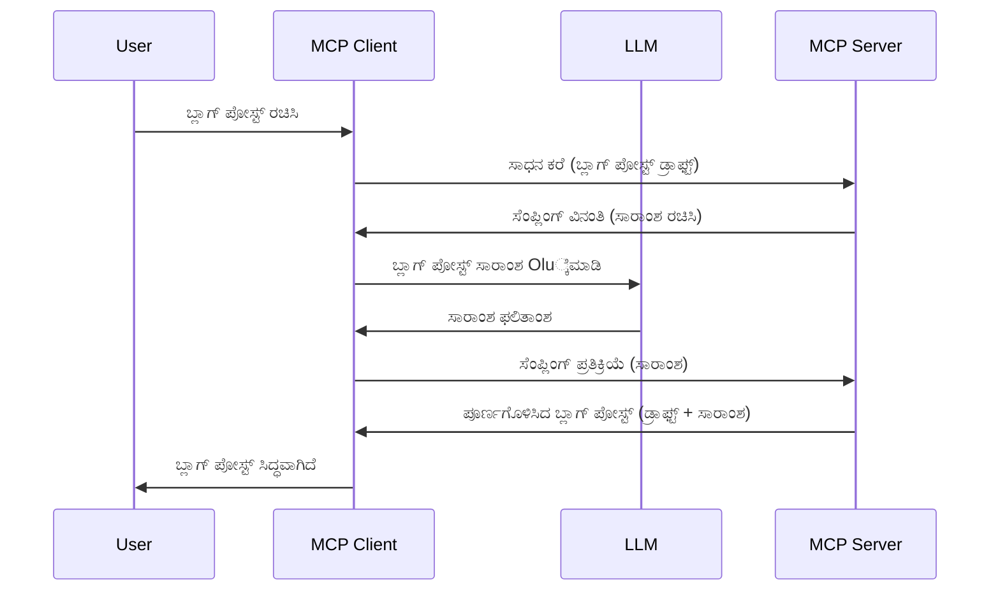

# ಮತ್ತುಸಿಕೆ - ವೈಶಿಷ್ಟ್ಯಗಳನ್ನು ಕ್ಲೈಂಟ್‌ಗೆ ನಿಯೋಜಿಸುವುದು

ಕೆಲವೊಮ್ಮೆ, ನೀವು ಸಾಮಾನ್ಯ ಗುರಿಯನ್ನು ಸಾಧಿಸಲು MCP ಕ್ಲೈಂಟ್ ಮತ್ತು MCP ಸರ್ವರ್ ಸಹಕರಿಸಬೇಕಾಗಬಹುದು. ನೀವು ಸರೋವರದಲ್ಲಿ ಇರುವ LLM ಸಹಾಯ ಬೇಕಾಗುವ ಸಂದರ್ಭ ಇರಬಹುದು, ಅದು ಕ್ಲೈಂಟ್ ಮೇಲೆ ಇರಬಹುದು. ಈ ಪರಿಸ್ಥಿತಿಗೆ, ಮತ್ತುಸಿಕೆ (sampling) ಅನ್ನು ಬಳಸಬೇಕು.

몇몇 ಉಪಯೋಗ ಪ್ರಕರಣಗಳನ್ನು ಪರಿಶೀಲಿಸೋಣ ಮತ್ತು ಮತ್ತುಸಿಕೆಯನ್ನು ಒಳಗೊಂಡ ಪರಿಹಾರವನ್ನು ಹೇಗೆ ನಿರ್ಮಿಸಬೇಕು ಎಂದು ನೋಡೋಣ.

## ಅವಲೋಕನ

ಈ ಪಾಠದಲ್ಲಿ, ನಾವು ಮತ್ತುಸಿಕೆಯನ್ನು ಯಾವಾಗ ಮತ್ತು ಎಲ್ಲಿಗೆ ಬಳಸಬೇಕು ಮತ್ತು ಅದನ್ನು ಹೇಗೆ ಸಂರಚಿಸಬೇಕು ಎಂಬುದನ್ನು ವಿವರಿಸುತ್ತೇವೆ.

## ಕಲಿಕೆಯಲ್ಲಿ ಗುರಿಗಳು

ಈ ಅಧ್ಯಾಯದಲ್ಲಿ, ನಾವು:

- ಮತ್ತುಸಿಕೆ ಎಂದರೇನು ಮತ್ತು ಅದನ್ನು ಯಾವಾಗ ಬಳಸಬೇಕು ಎಂದು ವಿವರಿಸುವುದು.
- MCP ನಲ್ಲಿ ಮತ್ತುಸಿಕೆಯನ್ನು ಹೇಗೆ ಸಂರಚಿಸಬೇಕು ಎಂಬುದನ್ನು ತೋರಿಸುವುದು.
- ಮತ್ತುಸಿಕೆಯ ಉದಾಹರಣೆಗಳನ್ನು ನೀಡುವುದು.

## ಮತ್ತುಸಿಕೆ ಎಂದರೆ ಏನು ಮತ್ತು ಅದನ್ನು ಯಾಕೆ ಬಳಸಬೇಕು?

ಮತ್ತುಸಿಕೆ ಎಂದರೆ ಒಂದು ಉನ್ನತ ತಂತ್ರಜ್ಞಾನ ವೈಶಿಷ್ಟ್ಯವಾಗಿದ್ದು, ಹೀಗಿದೆ:



### ಮತ್ತುಸಿಕೆ ವಿನಂತಿ

ಸರಿ, ಈಗ ನಮ್ಮ ಬಳಿ ಒಂದು ವಿಶ್ವಾಸಾರ್ಹ ಸನ್ನಿವೇಶದ ಲಕ್ಷಾಂತರ ಅಡಿ ದೃಶ್ಯವಿದೆ, ಈಗ ಸರ್ವರ್ ಮೂಲಕ ಕ್ಲೈಂಟ್‌ಗೆ ಹಿಂತಿರುಗಿಸುವ ಮತ್ತುಸಿಕೆ ವಿನಂತಿಯ ಬಗ್ಗೆ ಮಾತಾಡೋಣ. JSON-RPC ಸ್ವರೂಪದಲ್ಲಿ ಈ ರೀತಿಯ ವಿನಂತಿ ಹೀಗೆ ಕಾಣಬಹುದು:

```json
{
  "jsonrpc": "2.0",
  "id": 1,
  "method": "sampling/createMessage",
  "params": {
    "messages": [
      {
        "role": "user",
        "content": {
          "type": "text",
          "text": "Create a blog post summary of the following blog post: <BLOG POST>"
        }
      }
    ],
    "modelPreferences": {
      "hints": [
        {
          "name": "claude-3-sonnet"
        }
      ],
      "intelligencePriority": 0.8,
      "speedPriority": 0.5
    },
    "systemPrompt": "You are a helpful assistant.",
    "maxTokens": 100
  }
}
```

ಇಲ್ಲಿ ಗಮನಿಸಲು ಕೆಲವು ವಿಷಯಗಳಿವೆ:

- prompt, content -> text ಅಡಿಯಲ್ಲಿ, ನಮ್ಮ prompt ಆಗಿದ್ದು ಅದು LLM ಗೆ ಬ್ಲಾಗ್ ಪೋಸ್ಟ್ ವಿಷಯದ ಸಾರಾಂಶ ಮಾಡಲು ನೀಡುವ ಸೂಚನೆ.

- **modelPreferences**. ಇದು ಕೇವಲ ಒಂದು ಅವಶ್ಯಕತೆ, LLM ಜತೆ ಯಾವ ಸಂರಚನೆಯನ್ನು ಬಳಸಬೇಕು ಎಂಬ ಸಲಹೆ. ಬಳಕೆದಾರನಿಗೆ ಈ ಸಲಹೆಗಳನ್ನು ಅನುಸರಿಸುವ ಅಥವಾ ಬದಲಾಯಿಸುವ ಆಯ್ಕೆ ಇರುತ್ತದೆ. ಈ ಸಂದರ್ಭದಲ್ಲಿ ಮೊಡೆಲ್, ವೇಗ ಮತ್ತು ಬುದ್ಧಿಮತ್ತೆಯ ಆದ್ಯತೆಯ ಸಲಹೆಗಳು ಇವೆ.
- **systemPrompt**, ಇದು ನಿಮ್ಮ ಸಾಮಾನ್ಯ ಸಿಸ್ಟಮ್ ಪ್ರಾಂಪ್ಟ್ ಆಗಿದ್ದು ನಿಮ್ಮ LLM ಗೆ ವ್ಯಕ್ತಿತ್ವ ನೀಡುತ್ತದೆ ಮತ್ತು ಮಾರ್ಗದರ್ಶನ ಸೂಚನೆಗಳನ್ನು ಒಳಗೊಂಡಿರುತ್ತದೆ.
- **maxTokens**, ಈ ಗುಣಲಕ್ಷಣವು ಈ ಕಾರ್ಯಕ್ಕೆ ಬಳಸಬೇಕಾದ ಟೋಕನ್‌ಗಳ ಸಂಖ್ಯೆಯನ್ನು ಸೂಚಿಸುತ್ತದೆ.

### ಮತ್ತುಸಿಕೆ ಪ್ರತಿಕ್ರಿಯೆ

ಈ ಪ್ರತಿಕ್ರಿಯೆಯನ್ನು MCP ಕ್ಲೈಂಟ್ MCP ಸರ್ವರ್‌ಗೆ ಹಿಂತಿರುಗಿಸುತ್ತಿದ್ದು, ಇದು ಕ್ಲೈಂಟ್ LLM ಅನ್ನು ಕರೆ ಮಾಡಿ, ಪ್ರತಿಕ್ರಿಯೆಯನ್ನು ಕಾಯ್ದು ನಂತರ ಈ ಸಂದೇಶವನ್ನು ರಚಿಸುವ ಫಲಿತಾಂಶವಾಗಿದೆ. JSON-RPC ಸಂಕೇತದಲ್ಲಿ ಇದು ಹೀಗೆ ಕಾಣಬಹುದು:

```json
{
  "jsonrpc": "2.0",
  "id": 1,
  "result": {
    "role": "assistant",
    "content": {
      "type": "text",
      "text": "Here's your abstract <ABSTRACT>"
    },
    "model": "gpt-5",
    "stopReason": "endTurn"
  }
}
```

ನೀವು ಕೇಳಿದಂತೆ ಪ್ರತಿಕ್ರಿಯೆ ಬ್ಲಾಗ್ ಪೋಸ್ಟ್‌ನ ಸಾರಾಂಶವಾಗಿದೆ ಎಂದು ಗಮನಿಸಿ. ಹಾಗೂ ನಾವು ಕೇಳಿರಲಿಲ್ಲದ “model” ಅನ್ನು ಬಳಸಲಾಗಿದೆ ಎಂದು ನೋಡಿ, “claude-3-sonnet” ಬದಲು “gpt-5” ಬಳಸ್ಯಾಗಿದೆ. ಇದು ಬಳಕೆದಾರರು ಏನು ಬಳಸಬೇಕು ಎಂಬುದರ ಬಗ್ಗೆ ತಮಗೆ ಮನಸ್ಸು ಬದಲಾಯಿಸಲು ಸಾಧ್ಯವಿದೆ ಮತ್ತು ನಿಮ್ಮ ಮತ್ತುಸಿಕೆ ವಿನಂತಿ ಅದು ಒಂದು ಸಲಹೆ ಎಂಬುದನ್ನು ತೋರಿಸಲು.

ಸರಿಯಾಗಿದೆ, ನಾವು ಮುಖ್ಯ ಪ್ರವಾಹವನ್ನು ಹಾಗೂ ಉಪಯುಕ್ತ ಕಾರ್ಯವನ್ನು (ಬ್ಲಾಗ್ ಪೋಸ್ಟ್ ಸೃಷ್ಟಿ + ಸಾರಾಂಶ) ತಿಳಿದುಕೊಂಡಿದ್ದೇವೆ, ಈಗ ಅದನ್ನು ಕಾರ್ಯಗತಗೊಳಿಸಲು ನಮಗೆ ಬೇಕಾಗಿರುವುದನ್ನು ನೋಡೋಣ.

### ಸಂದೇಶ ಪ್ರಕಾರಗಳು

ಮತ್ತುಸಿಕೆ ಸಂದೇಶಗಳು ಕೇವಲ ಪಠ್ಯಕ್ಕೆ ಸೀಮಿತವಿಲ್ಲ, ಚಿತ್ರಗಳು ಮತ್ತು ಧ್ವನಿಯೂ ಕಳುಹಿಸಬಹುದು. JSON-RPC ಹೇಗೆ ವಿಭಿನ್ನವಾಗುತ್ತದೆ ಎಂದು ನೋಡೋಣ:

**ಪಠ್ಯ**

```json
{
  "type": "text",
  "text": "The message content"
}
```

**ಚಿತ್ರ ವಿಷಯ**

```json
{
  "type": "image",
  "data": "base64-encoded-image-data",
  "mimeType": "image/jpeg"
}
```

**ಧ್ವನಿ ವಿಷಯ**

```json
{
  "type": "audio",
  "data": "base64-encoded-audio-data",
  "mimeType": "audio/wav"
}
```

> NOTE: বিস্তারিত ಮಾಹಿತಿಗೆ ಮತ್ತುಸಿಕೆ ಕುರಿತು, [ಅಧಿಕೃತ ಡಾಕ್ಯುಮೆಂಟ್‌ಗಳು](https://modelcontextprotocol.io/specification/2025-11-25/client/sampling) ನೋಡಿ

## ಕ್ಲೈಂಟ್‌ನಲ್ಲಿ ಮತ್ತುಸಿಕೆಯನ್ನು ಹೇಗೆ ಸಂರಚಿಸುವುದು

> ಟಿಪ್ಪಣಿ: ನೀವು ಕೇವಲ ಸರ್ವರ್ ನಿರ್ಮಿಸುತ್ತಿದ್ದರೆ, ನೀವು ಇಲ್ಲಿ ಹೆಚ್ಚು ಬೇಕಾಗುವುದಿಲ್ಲ.

ಒಂದು ಕ್ಲೈಂಟ್‌ನಲ್ಲಿ, ನೀವು ಈ ಕೆಳಗಿನ ವೈಶಿಷ್ಟ್ಯವನ್ನು ಈ ರೀತಿ ನಿರ್ದಿಷ್ಟಪಡಿಸಬೇಕು:

```json
{
  "capabilities": {
    "sampling": {}
  }
}
```

ನಂತರ ನೀವು ಆರಿಸಿದ ಕ್ಲೈಂಟ್ ಸರ್ವರ್ ಜೊತೆಗೆ ಪ್ರಾರಂಭವಾದಾಗ ಇದನ್ನು ಇದರಿಂದ ಪಡೆದುಕೊಳ್ಳುತ್ತದೆ.

## ಮತ್ತುಸಿಕೆಯ ಉದಾಹರಣೆ - ಬ್ಲಾಗ್ ಪೋಸ್ಟ್ ರಚನೆ

ನಾವು ಒಂದು ಮತ್ತುಸಿಕೆ ಸರ್ವರ್ ಕೋಡ್ ಮಾಡೋಣ, ನಾವು ಈ ಕೆಳಗಿನ ಕ್ರಮಗಳನ್ನು ಅನುಸರಿಸಬೇಕು:

1. ಸರ್ವರ್‌ನಲ್ಲಿ ಒಂದು ಉಪಕರಣವನ್ನು ಸೃಷ್ಟಿಸುವುದು.
2. ಆ ಉಪಕರಣವು ಮತ್ತುಸಿಕೆ ವಿನಂತಿಯನ್ನು ರಚಿಸಬೇಕು
3. ಉಪಕರಣವು ಕ್ಲೈಂಟ್‌ನ ಮತ್ತುಸಿಕೆ ವಿನಂತಿಯ ಪ್ರತ್ಯುತ್ತರವನ್ನು ಕಾಯಬೇಕಾಗುತ್ತದೆ.
4. ನಂತರ ಉಪಕರಣ ಫಲಿತಾಂಶವನ್ನು ಉತ್ಪಾದಿಸಬೇಕು.

ಕೋಡ್ ಅನ್ನು ಹಂತ ಹಂತವಾಗಿ ನೋಡೋಣ:

### -1- ಉಪಕರಣ ಸೃಷ್ಟಿಸಿ

**python**

```python
@mcp.tool()
async def create_blog(title: str, content: str, ctx: Context[ServerSession, None]) -> str:
    """Create a blog post and generate a summary"""

```

### -2- ಮತ್ತುಸಿಕೆ ವಿನಂತಿ ಸೃಷ್ಟಿಸಿ

ನಿಮ್ಮ ಉಪಕರಣವನ್ನು ಈ ಕೆಳಗಿನ ಕೋಡ್ ನೊಂದಿಗೆ ವಿಸ್ತರಿಸಿ:

**python**

```python
post = BlogPost(
        id=len(posts) + 1,
        title=title,
        content=content,
        abstract=""
    )

prompt = f"Create an abstract of the following blog post: title: {title} and draft: {content} "

result = await ctx.session.create_message(
        messages=[
            SamplingMessage(
                role="user",
                content=TextContent(type="text", text=prompt),
            )
        ],
        max_tokens=100,
)

```

### -3- ಪ್ರತಿಕ್ರಿಯೆಯನ್ನು ಕಾಯಿರಿ ಮತ್ತು ಪ್ರತಿಕ್ರಿಯೆ ನೀಡಿರಿ

**python**

```python
post.abstract = result.content.text

posts.append(post)

# ಸಂಪೂರ್ಣ ಉತ್ಪನ್ನವನ್ನು ಹಿಂತಿರುಗಿಸಿ
return json.dumps({
    "id": post.title,
    "abstract": post.abstract
})
```

### -4- ಸಂಪೂರ್ಣ ಕೋಡ್

**python**

```python
from starlette.applications import Starlette
from starlette.routing import Mount, Host

from mcp.server.fastmcp import Context, FastMCP

from mcp.server.session import ServerSession
from mcp.types import SamplingMessage, TextContent

import json


from uuid import uuid4
from typing import List
from pydantic import BaseModel


mcp = FastMCP("Blog post generator")

# app = FastAPI()

posts = []

class BlogPost(BaseModel):
    id: int
    title: str
    content: str
    abstract: str

posts: List[BlogPost] = []

@mcp.tool()
async def create_blog(title: str, content: str, ctx: Context[ServerSession, None]) -> str:
    """Create a blog post and generate a summary"""

    post = BlogPost(
        id=len(posts) + 1,
        title=title,
        content=content,
        abstract=""
    )

    prompt = f"Create an abstract of the following blog post: title: {title} and draft: {content} "

    result = await ctx.session.create_message(
        messages=[
            SamplingMessage(
                role="user",
                content=TextContent(type="text", text=prompt),
            )
        ],
        max_tokens=100,
    )

    post.abstract = result.content.text

    posts.append(post)

    # ಸಂಪೂರ್ಣ ಬ್ಲಾಗ್ ಪೋಸ್ಟ್ ಅನ್ನು ಹಿಂತಿರುಗಿಸಿ
    return json.dumps({
        "id": post.title,
        "abstract": post.abstract
    })

if __name__ == "__main__":
    print("Starting server...")
    # mcp.run()
    mcp.run(transport="streamable-http")

# ಕಾರ್: python server.py ಜೊತೆಗೆ ಅಪ್ಲಿಕೇಶನ್ ಅನ್ನು ರನ್ ಮಾಡಿ
```

### -5- Visual Studio Code ನಲ್ಲಿ ಪರೀಕ್ಷಿಸುವುದು

Visual Studio Code ನಲ್ಲಿ ಇದನ್ನು ಪರೀಕ್ಷಿಸಲು, ಈ ಕೆಳಗಿನ ಕೆಲಸಗಳನ್ನು ಮಾಡಿ:

1. ಟರ್ಮಿನಲ್‌ನಲ್ಲಿ ಸರ್ವರ್ ಪ್ರಾರಂಭಿಸಿ
1. ಇದನ್ನು *mcp.json* ಗೆ ಸೇರಿಸಿ (ಸರ್ವರ್ ಚಾಲನೆಗೊಳಿಸಿದುದನ್ನು ಖಚಿತಪಡಿಸಿ) ಉದಾಹರಣೆಗೆ:

   ```json
   "servers": {
      "blog-server": {
        "type": "http",
        "url": "http://localhost:8000/mcp"
      }
   }
   ```

1. ಒಂದು prompt ಟೈಪ್ ಮಾಡಿ:

   ```text
   create a blog post named "Where Python comes from", the content is "Python is actually named after Monty Python Flying Circus"
   ```

1. ಮತ್ತುಸಿಕೆ ನಡೆಸಲು ಅನುಮತಿಸಿ. ಮೊದಲ ಸಲ ಈ ಪರೀಕ್ಷೆ ಮಾಡುವಾಗ ಹೆಚ್ಚುವರಿ ಸಂವಾದ ಡೈಲಾಗ್ ಬರುತ್ತದೆ, ಅದನ್ನು ನೀವು ಒಪ್ಪಬೇಕು, ನಂತರ ಉಪಕರಣವನ್ನು ಚಾಲನೆ ಮಾಡಲು ಸಾಮಾನ್ಯ ಡೈಲಾಗ್ ಕಾಣಿಸುತ್ತೆ.

1. ಫಲಿತಾಂಶಗಳನ್ನು ಪರಿಶೀಲಿಸಿ. ನೀವು ಫಲಿತಾಂಶಗಳನ್ನು GitHub Copilot Chat ನಲ್ಲಿ ಚೆನ್ನಾಗಿ ಪ್ರದರ್ಶಿಸುತ್ತಿರುವುದನ್ನು ನೋಡಬಹುದು ಹಾಗೂ ಅಂಶರಹಿತ JSON ಪ್ರತಿಕ್ರಿಯೆಯನ್ನು ಕೂಡ ಪರಿಶೀಲಿಸಬಹುದು.

**ಬಹುಮಾನ**. Visual Studio Code ಉಪಕರಣಗಳು ಮತ್ತುಸಿಕೆಗೆ ಒಳ್ಳೆಯ ಬೆಂಬಲವಿವೆ. ನೀವು ನಿಮ್ಮ ಸ್ಥಾಪಿತ ಸರ್ವರ್‌ನಲ್ಲಿ ಮತ್ತುಸಿಕೆ ಪ್ರವೇಶವನ್ನು ಈ ರೀತಿ ಸಂರಚಿಸಬಹುದು:

1. ವಿಸ್ತರಣೆ ವಿಭಾಗಕ್ಕೆ ಹೋಗಿ.
1. "MCP SERVERS - INSTALLED" ವಿಭಾಗದಲ್ಲಿ ನಿಮ್ಮ ಸ್ಥಾಪಿತ ಸರ್ವರ್‌ಗಾಗಿ ಗೇರ್ ಚಿಹ್ನೆ ಆಯ್ಕೆಮಾಡಿ.
1 "Configure Model Access" ಅನ್ನು ಆರಿಸಿ, ಇಲ್ಲಿ ತೀರ್ಮಾನಿಸಬಹುದು GitHub Copilot ಯಾವ ಮಾದರಿಗಳನ್ನು ಆಯ್ಕೆಮಾಡಬಹುದು ಮತ್ತುsampling ನಡೆಸಬಹುದು. "Show Sampling requests" ಆಯ್ಕೆಮಾಡಿ ಇತ್ತೀಚೆಗೆ ನಡೆದ ಎಲ್ಲಾ sampling ವಿನಂತಿಗಳನ್ನು ನೋಡುವುದೂ ಸಾಧ್ಯ.

## ಅಸೈನ್‌ಮೆಂಟ್

ಈ ಅಸೈನ್‌ಮೆಂಟ್‌ನಲ್ಲಿ, ನೀವು ಸ್ವಲ್ಪ ಬೇರೆ sampling ಸೇವೆಯನ್ನು ನಿರ್ಮಿಸಲಿದ್ದೀರಿ, ಅಂದರೆ ಉತ್ಪನ್ನ ವಿವರಣೆ ಅತ್ಯಾಕಾಂಕ್ಷೆಯ sampling ಇಂಟಿಗ್ರೇಶನ್. ನಿಮ್ಮ ಸನ್ನಿವೇಶ ಇಲ್ಲಿದೆ:

**ಸನ್ನಿವೇಶ**: ಈ-ಕಾಮರ್ಸ್ ಬ್ಯಾಕ್ ಆಫೀಸ್ ಕಾರ್ಯಕರ್ತರಿಗೆ ಸಹಾಯ ಬೇಕು, ಉತ್ಪನ್ನ ವಿವರಣೆಗಳನ್ನು ತಯಾರಿಸುವುದು ಬಹಳ ಸಮಯವೆತ್ತುತಿದೆ. ಆದ್ದರಿಂದ ನೀವು "create_product" ಎಂಬ ಉಪಕರಣವನ್ನು "title" ಮತ್ತು "keywords" ಎನ್ನುವ ಆರ್ಗ್ಯುಮೆಂಟ್ಗಳೊಂದಿಗೆ ಕರೆ ಮಾಡಬೇಕಾಗಿದೆ ಮತ್ತು ಅದು ಪರಿಶಿಷ್ಟವಾಗಿ "description" ಕ್ಷೇತ್ರವು ಕ್ಲೈಂಟ್ LLM ಮೂಲಕ ತುಂಬಲ್ಪಟ್ಟಿರುವ ಪೂರ್ಣ ಉತ್ಪನ್ನವನ್ನು ತಯಾರಿಸಬೇಕು.

TIP: ನೀವು ಮೊದಲು ಕಲಿತಂತೆ ಇದನ್ನು sampling ವಿನಂತಿಯಲ್ಲಿ ಈ ಸರ್ವರ್ ಹಾಗೂ ಅದರ ಉಪಕರಣವನ್ನು ರಚಿಸಿ.

## ಪರಿಹಾರ

[ಪರಿಹಾರ](./solution/README.md)

## ಪ್ರಮುಖ ಸಾರಾಂಶಗಳು

ಮತ್ತುಸಿಕೆ ಒಂದು ಶಕ್ತಿಶಾಲಿ ವೈಶಿಷ್ಟ್ಯವಾಗಿದೆ, ಇದು ಸರ್ವರ್‌ಗೆ LLM ಸಹಾಯ ಬೇಕಾದಾಗ ಕಾರ್ಯಗಳನ್ನು ಕ್ಲೈಂಟ್‌ಗೆ ನಿಯೋಜಿಸಲು ಅವಕಾಶ ನೀಡುತ್ತದೆ.

## ಮುಂದಿನ ಯಾವುದು

- [ಅಧ್ಯಾಯ 4 - ಪ್ರಾಯೋಗಿಕ ಅನುಷ್ಠಾನ](../../04-PracticalImplementation/README.md)

---

<!-- CO-OP TRANSLATOR DISCLAIMER START -->
**ಅಸ್ವೀಕಾರ**:
ಈ ದಸ್ತಾವೇಜು AI ಅನುವಾದ ಸೇವೆ [Co-op Translator](https://github.com/Azure/co-op-translator) ಬಳಸಿ ಅನುವಾದಿಸಲಾಗಿದೆ. ನಾವು ನಿಖರತೆಯನ್ನು ಸಾಧಿಸಲು ಪ್ರಯತ್ನಿಸುತ್ತಿದ್ದರೂ, ದಯವಿಟ್ಟು ಗಮನಿಸಿ, ಸ್ವಯಂಚಾಲಿತ ಅನುವಾದಗಳಲ್ಲಿ ದೋಷಗಳು ಅಥವಾ ಅಸಡ್ಡೆಗಳು ಇರಬಹುದು. ಮೂಲ ಭಾಷೆಯಲ್ಲಿರುವ ಮೂಲ ದಸ್ತಾವೇಜು ಪ್ರಾಮಾಣಿಕ ಮೂಲವೆಂದು ಪರಿಗಣಿಸಬೇಕು. ಪ್ರಮುಖ ಮಾಹಿತಿಗಾಗಿ, ವೃತ್ತಿಪರ ಮಾನವ ಅನುವಾದವನ್ನು ಶಿಫಾರಸು ಮಾಡಲಾಗುತ್ತದೆ. ಈ ಅನುವಾದವನ್ನು ಬಳಸುವ ಮೂಲಕ ಉಂಟಾಗುವ ಯಾವುದೇ ತಪ್ಪು ಅರ್ಥಗಳ ಅಥವಾ ತಪ್ಪು ವ್ಯಾಖ್ಯಾನಗಳ ಬಗ್ಗೆ ನಾವು ಹೊಣೆಗಾರರಲ್ಲ.
<!-- CO-OP TRANSLATOR DISCLAIMER END -->