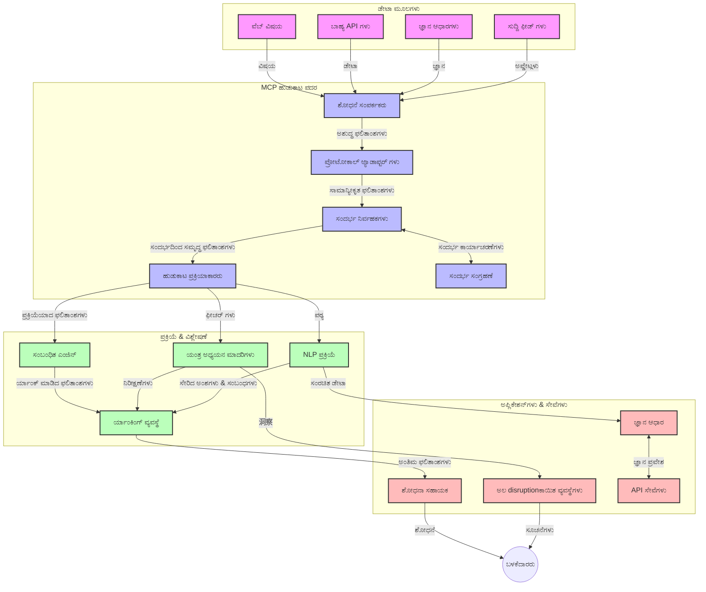
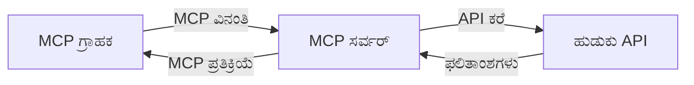
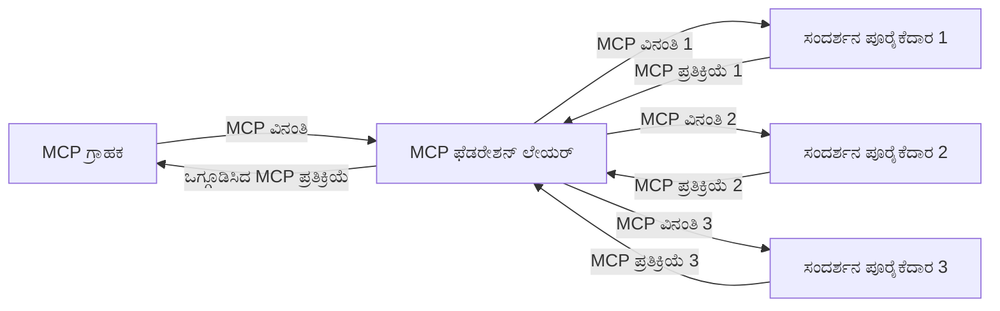
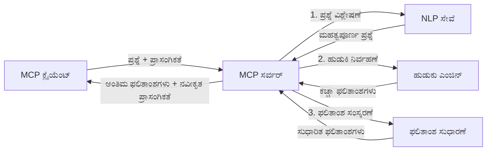

# ರೀಯಲ್-ಟೈಮ್ ವೆಬ್ ಶೋಧನೆಗಾಗಿ ಮಾದರಿ ಪ್ರೆ dwóch ಸಾಂದರ್ಭಿಕ ಪ್ರೋಟೋಕಾಲ್

## ಅವಲೋಕನ

ರಿಯಲ್-ಟೈಮ್ ವೆಬ್ ಶೋಧನೆ ಇಂದಿನ ಮಾಹಿತಿ-ಚಾಲಿತ ಪರಿಸರದಲ್ಲಿ ಅಗತ್ಯವಾಗಿದೆ, ಅಲ್ಲಿ अनुप्रयोगಗಳು ಇಂಟರ್ನೆಟ್‌ನಲ್ಲಿ ಹೆಚ್ಚಿನ ಮತ್ತು ಕ್ಷಿಪ್ರ ಮಾಹಿತಿಯನ್ನು ತ್ವರಿತವಾಗಿ ಪಡೆಯುವ ಅವಶ್ಯಕತೆಯಿದೆ, ಪರಿಣಾಮಕಾರಿಯಾಗಿ ಸಂಬಂಧಿಸಿದ ಉತ್ತರಗಳನ್ನು ಒದಗಿಸಲು. ಮಾದರಿ ಮಾಹಿತಿ ಪ್ರೋಟೋಕಾಲ್ (MCP) ಈ ರಿಯಲ್-ಟೈಮ್ ಶೋಧನೆ ಪ್ರಕ್ರಿಯೆಗಳ ನವೀನ ಸಾಧನೆ ಆಗಿದ್ದು, ಶೋಧನೆ ಪರಿಣಾಮಕಾರಿತ್ವ ಹೆಚ್ಚಿಸುವುದು, ಸಾಂದರ್ಭಿಕ ಅಖಂಡತೆ ಕಾಪಾಡುವುದು ಮತ್ತು ಒಟ್ಟು ವ್ಯವಸ್ಥೆಯ ಕಾರ್ಯಕ್ಷಮತೆಯನ್ನು ಸುಧಾರಿಸುವಲ್ಲಿ ಪ್ರಮುಖ ಪಾತ್ರವಹಿಸುತ್ತದೆ.

ಈ ಮಾಯಾಜಿಕಾ ಫಲಕವು MCP ರಿಯಲ್-ಟೈಮ್ ವೆಬ್ ಶೋಧನೆಗೆ ಪ್ರಾಯೋಗಿಕ ದೃಷ್ಟಿಕೋನವನ್ನು ಪ್ರತ್ಯಕ್ಷಗೊಳಿಸುವುದನ್ನು ಹಾಗೂ AI ಮಾದರಿಗಳು, ಶೋಧನಾ ಎಂಜಿನ್‌ಗಳು ಮತ್ತು ಅನ್ವಯಿಕೆಗಳ ನಡುವೆ ಸಾಂದರ್ಭಿಕ ನಿರ್ವಹಣೆಗೆ ಪ್ರಮಾಣಿತ ವಿಧಾನವನ್ನು ಒದಗಿಸುವುದನ್ನು ವಿವರಿಸುತ್ತದೆ.

### ನೀವು ಏನು ಕಲಿಯುತ್ತೀರಿ

ಈ ಸಮಗ್ರ ಮಾರ್ಗದರ್ಶಿಯಲ್ಲಿ ನೀವು ಕಂಡುಕೊಳ್ಳುವಿರಿ:

- MCP ಎಂಎಐ ಮಾದರಿಗಳು ಮತ್ತು ರಿಯಲ್-ಟೈಮ್ ವೆಬ್ ಶೋಧನೆ ಸಾಮರ್ಥ್ಯಗಳ ನಡುವಣ ನಿರಂತರ ಸೇತುವೆಯನ್ನು ಹೇಗೆ ನಿರ್ಮಿಸುತ್ತದೆ
- MCP ಬಳಸಿ ದಕ್ಷ ಮತ್ತು ವಿಸ್ತೃತ ಶೋಧನಾ ಪರಿಹಾರಗಳನ್ನು ಅನುಷ್ಠಾನಗೊಳಿಸುವ ಆರ್ಕಿಟೆಕ್ಚರ್ ಮಾದರಿಗಳು
- ಬಹು ಪ್ರಶ್ನೆಗಳು ಮತ್ತು ಸಂವಹನಗಳಿಂದ ಶೋಧನಾ ಸಾಂದರ್ಭಿಕತೆಯನ್ನು ಕಾಪಾಡುವ ತಂತ್ರಗಳು
- ವಿಭಿನ್ನ ಶೋಧನಾ ಸಂದರ್ಭಗಳಿಗೆ ಪೈಥಾನ್ ಮತ್ತು ಜಾವಾಸ್ಕ್ರಿಪ್ಟ್ ನಲ್ಲಿ ನೈಪुण್ಯ ಕೋಡ್ ಅನುಷ್ಠಾನಗಳು
- MCP-ಆಧಾರಿತ ಶೋಧನಾ ವ್ಯವಸ್ಥೆಗಳಲ್ಲಿ ಸಂಬಂಧತೆ, ಪ್ರಚಾರಿಕತೆ ಮತ್ತು ಕಾರ್ಯಕ್ಷಮತೆಯನ್ನು ಸಮತೋಲನಗೊಳಿಸುವ ವಿಧಾನಗಳು

## ರಿಯಲ್-ಟೈಮ್ ವೆಬ್ ಶೋಧನೆಗೆ ಪರಿಚಯ

ರಿಯಲ್-ಟೈಮ್ ವೆಬ್ ಶೋಧನೆ ಎಂಬುದು ತಂತ್ರಜ್ಞಾನದ ವಿಧಾನವಾಗಿದ್ದು, ವೆಬ್ ಆಧಾರಿತ ಮಾಹಿತಿಯನ್ನು ನಿಯತಕಾಲಿಕವಾಗಿ ಪ್ರಶ್ನಿಸುವುದು, ಪ್ರಕ್ರಿಯೆ ಮಾಡುವುದನ್ನು ಮತ್ತು ವಿಶ್ಲೇಷಿಸುವುದನ್ನು ಸಾಧ್ಯವಾಗಿಸುತ್ತದೆ, ಇದು ವ್ಯವಸ್ಥೆಗಳಿಗೆ ಕಡಿಮೆ ವಿಳಂಬದ ಜೊತೆ تازಾ ಮತ್ತು ಸಂಬಂಧಿಸಿದ ಮಾಹಿತಿಯನ್ನು ಒದಗಿಸುವಲ್ಲಿ ಸಹಾಯ ಮಾಡುತ್ತದೆ. ಸಂಪಾರಂಪರಿಕ ಶೋಧನಾ ವ್ಯವಸ್ಥೆಗಳು ಗಂಟೆಗಳ ಅಥವಾ ದಿನಗಳ ಹಿಂದೆ ಸೂಚ್ಯಂಕಿತ ಮಾಹಿತಿಯ ಮೇಲೆ ಕಾರ್ಯನಿರ್ವಹಿಸುವಷ್ಟರಲ್ಲಿ, ರಿಯಲ್-ಟೈಮ್ ಶೋಧನೆ ಕಾರ್ಯಕ್ಷಮತೆ ಜೀವನ್ಮೂಲ ಮಾಹಿತಿಯನ್ನು ಸಂಸ್ಕರಿಸಿ ಹಾಜರಾತಿಗಾಗಿ ಸಾಧ್ಯವಾಗಿಸುತ್ತದೆ.

### ರಿಯಲ್-ಟೈಮ್ ವೆಬ್ ಶೋಧನೆಯ ಮುಖ್ಯ ತತ್ತ್ವಗಳು:

- **ನಿರಂತರ ಪ್ರಶ್ನೆ ಪ್ರಕ್ರಿಯೆ**: ಶೋಧನೆ ಪ್ರಶ್ನೆಗಳನ್ನು ನಿತ್ಯ ನವೀಕರಿಸುತ್ತಿರುವ ಡೇಟಾ ಮೂಲಗಳ ಮೇಲೆ ಕಾರ್ಯನಿರ್ವಹಿಸುವುದು  
- **ಪ್ರತಿನಿಧಿ ಪ್ರಾತ್ಯಕ್ಷತೆ**: ವ್ಯವಸ್ಥೆಗಳು تازಾ ಮಾಹಿತಿಯನ್ನು ಪ್ರಾಮುಖ್ಯತೆ ನೀಡಲು ವಿನ್ಯಾಸಗೊಳಿಸಲಾದವು  
- **ಸಂಬಂಧತಾ ಸಮತೋಲನ**: ಸಂಬಂಧತೆ ಮತ್ತು تازಾ ಮಾಹಿತಿಯ ನಡುವೆ ಸಮತೋಲನ ಕಾಪಾಡುವುದು  
- **ವಿಸ್ತೃತ ಆರ್ಕಿಟೆಕ್ಚರ್**: ವೈವಿಧ್ಯದ ಪ್ರಶ್ನೆ ಲೋಡ್ ಮತ್ತು ಡೇಟಾ ಪ್ರಮಾಣಗಳನ್ನು ನಿರ್ವಹಿಸುವ ಸಾಧ್ಯತೆ  
- **ಸಾಂದರ್ಭಿಕ ಗ್ರಹಿಕೆ**: ಬಳಕೆದಾರ ಸಾಂದರ್ಭಿಕತೆಯನ್ನು ಶೋಧನೆ ಪುನರಾವೃತ್ತಿಗಳಲ್ಲಿ ಕಾಪಾಡುವುದು ಮಹತ್ವಪೂರ್ಣ  
- **ಡೈನಾಮಿಕ್ ಪ್ರಶ್ನೆ ಮರುರೂಪಗೊಳಿಸುವಿಕೆ**: ಸಾಂದರ್ಭಿಕತೆ ಮತ್ತು ಮುಂಚಿನ ಫಲಿತಾಂಶ ಆಧಾರಿತವಾಗಿ ಪ್ರಶ್ನೆಗಳನ್ನು ಹೊಂದಿಸಿಕೊಂಡು ಬದಲಿಸುವುದು  
- **ಬಹು ಮೂಲ ಏಕತೆ**: ಹಲವಾರು ಶೋಧನಾ ಪೂರೈಸುವವರು ಮತ್ತು ವೆಬ್ ಮೂಲಗಳಿಂದ ಫಲಿತಾಂಶಗಳನ್ನು ಸಂಯೋಜಿಸುವುದು  
- **ಸಾಮಾಂತಿಕ ಗ್ರಹಿಕೆ**: ಕೀವರ್ಡ್‌ಗಳ ಬದಲಾಗಿ ಅರ್ಥಮಟ್ಟದ ಪ್ರಶ್ನೆ ಮತ್ತು ವಿಷಯಗಳನ್ನು ಪ್ರಕ್ರಿಯೆ ಮಾಡುವುದು  
- **ರಿಯಲ್-ಟೈಮ್ ಶ್ರೇಣೀಕರಣ**: ಹೊಸ ಮಾಹಿತಿಗಳು ಲಭ್ಯವಾಗುವಂತೆ ಫಲಿತಾಂಶದ ಶ್ರೇಣಿಯನ್ನು ನಿರಂತರವಾಗಿ ಹೊಂದಿಸುವುದು  

### ಮಾದರಿ ಸಾಂದರ್ಭಿಕ ಪ್ರೋಟೋಕಾಲ್ ಮತ್ತು ರಿಯಲ್-ಟೈಮ್ ವೆಬ್ ಶೋಧನೆ

ಮಾದರಿ ಸಾಂದರ್ಭಿಕ ಪ್ರೋಟೋಕಾಲ್ (MCP) ಕೆಲವು ಪ್ರಮುಖ ಸವಾಲುಗಳನ್ನು ಪರಿಹರಿಸುತ್ತದೆ:

1. **ಶೋಧನಾ ಸಾಂದರ್ಭಿಕತೆಯ ಉಳಿವಿನ қамтамасызತೆ**: MCP ಹಂಚಿಕೆಗೊಂಡ ಶೋಧನಾ ಘಟಕಗಳ ನಡುವೆ ಸಾಂದರ್ಭಿಕತೆಯನ್ನು ಕಾಪಾಡಲು ಮಾನಕ ವ್ಯವಸ್ಥೆಯನ್ನು ಒದಗಿಸುತ್ತದೆ, AI ಮಾದರಿಗಳು ಮತ್ತು ಪ್ರೊಸೆಸಿಂಗ್ ನೋಡ್‌ಗಳಿಗೆ ಸಂಬಂಧಿಸಿದ ಪ್ರಶ್ನಾ ಇತಿಹಾಸ ಮತ್ತು ಬಳಕೆದಾರ ಇಚ್ಛೆಗಳಿಗೊಂದು ಪ್ರವೇಶ ಖಚಿತಪಡಿಸುತ್ತದೆ.

2. **ದಕ್ಷ ಪ್ರಶ್ನಾ ನಿರ್ವಹಣೆ**: ಸಾಂದರ್ಭಿಕತೆಯ ವಿಸ್ತರಣೆಯನ್ನು ಘೋಷಿಸುವ ಮಾರ್ಗಗಳನ್ನು ಒದಗಿಸುವ ಮೂಲಕ MCP ಪ್ರತಿ ಶೋಧನಾ ಪುನರಾವೃತ್ತಿಯಲ್ಲಿನ ಅನವಶ್ಯಕ ಪುನರಾವೃತ್ತೆಯನ್ನು ಕಡಿಮೆ ಮಾಡುತ್ತದೆ.

3. **ಪರಸ್ಪರಕಾರ್ಯದಾಯಕತೆ**: MCP ವೈವಿಧ್ಯಮಯ ಶೋಧನಾ ತಂತ್ರಜ್ಞಾನಗಳು ಮತ್ತು AI ಮಾದರಿಗಳ ನಡುವೆ ಸಾಂದರ್ಭ ಹಂಚಿಕೆಗೆ ಸಾಮಾನ್ಯ ಭಾಷೆ ಸೃಷ್ಟಿಸಿ ಹೆಚ್ಚು ಲವಚikku ಮತ್ತು ವಿಸ್ತರಿಸಬಹುದಾದ ಆರ್ಕಿಟೆಕ್ಚರ್‌ಗೆ ಅವಕಾಶ ಕೊಡುತ್ತದೆ.

4. **ಶೋಧನೆ-ಅನುಕೂಲಿತ ಸಾಂದರ್ಭ**: MCP ಅನುಷ್ಠಾನಗಳು ಪರಿಣಾಮಕಾರಿ ಶೋಧನೆಗಾಗಿ ಅತ್ಯಂತ ಹೊಂದಾಣಿಕೆಯ ಸಾಂದರ್ಭ ಅಂಶಗಳನ್ನು ಪ್ರಮುಖಪಡಿಸಬಹುದು, ಕಾರ್ಯಕ್ಷಮತೆ ಮತ್ತು ನಿಖರತೆಯನ್ನು ಆಪ್ಟಿಮೈಸ್ ಮಾಡುತ್ತವೆ.

5. **ವಿಕಾಸನಾಶೀಲ ಶೋಧನಾ ಪ್ರಕ್ರಿಯೆ**: MCP ಮೂಲಕ ಸರಿಯಾದ ಸಾಂದర్భ ನಿರ್ವಹಣೆಯಿಂದ, ಶೋಧನಾ ವ್ಯವಸ್ಥೆಗಳು ಬಳಕೆದಾರ ಅಗತ್ಯಗಳು ಮತ್ತು ಮಾಹಿತಿ ವಲಯಗಳೊಂದಿಗೆ ಸಂವಾದಿಸುತ್ತಲೇ ಪ್ರಕ್ರಿಯೆಯನ್ನು ಡೈನಾಮಿಕ್ ರೀತಿಯಲ್ಲಿ ಹೊಂದಿಸಿಕೊಳ್ಳಬಹುದು.

ನ್ಯೂಸ್ ಏಕರೀಕರಣದಿಂದ ಆರಂಭಿಸಿ ಸಂಶೋಧನಾ ಸಹಾಯಕರೆವರೆಗೆ ಆಧುನಿಕ ಅನ್ವಯಿಕೆಗಳಲ್ಲಿ MCP ಕ್ರಿಯಾಶೀಲ ಆಗಿ ಬಳಕೆದಾರ ಸಂವಹನಗಳಿಗೆ ಅನುಗುಣವಾಗಿ ಹೆಚ್ಚು ಬುದ್ಧಿವಂತ, ಸಾಂದರ್ಭಿಕ ಜಾಗೃತಿ ಶೋಧನೆಯನ್ನು ಅನುಮತಿಸುತ್ತದೆ.

## ಕಲಿಕಾ ಗುರಿಗಳು

ಈ ಪಾಠದ ಅಂತ್ಯಕ್ಕೆ ನೀವು ಸಾಮರ್ಥ್ಯ ಹೊಂದಿರುವಿರಿ:

- ಆಧುನಿಕ ಅನ್ವಯಿಕೆಗಳಲ್ಲಿ ರಿಯಲ್-ಟೈಮ್ ವೆಬ್ ಶೋಧನೆಯ ಮೂಲಭೂತಗಳು ಮತ್ತು ಸವಾಲುಗಳನ್ನು ಗ್ರಹಿಸುವುದು  
- ಮಾದರಿ ಸಾಂದರ್ಭಿಕ ಪ್ರೋಟೋಕಾಲ್ (MCP) ರಿಯಲ್-ಟೈಮ್ ವೆಬ್ ಶೋಧನಾ ಸಾಮರ್ಥ್ಯಗಳವನುದೇ ಹೇಗೆ ಹೆಚ್ಚಿಸುತ್ತದೆ ಎಂಬುದನ್ನು ವಿವರಿಸುವುದು  
- ಜನಪ್ರಿಯ ಫ್ರೇಂವರ್ಕ್ ಮತ್ತು API ಗಳ ಸಹಾಯದಿಂದ MCP ಆಧಾರಿತ ಶೋಧನಾ ಪರಿಹಾರಗಳನ್ನು ಅನುಷ್ಠಾನಗೊಳಿಸುವುದು  
- MCP ಬಳಸಿ ದಕ್ಷ, ಹೆಚ್ಚಿನ ಕಾರ್ಯಕ್ಷಮತೆ ಹೊಂದಿದ ಶೋಧನಾ ಆರ್ಕಿಟೆಕ್ಚರ್‌ಗಳನ್ನು ವಿನ್ಯಾಸಗೊಳಿಸುವುದು ಮತ್ತು ನಿಯೋಜಿಸುವುದು  
- ಸಾಂದರ್ಭಿಕ ಶೋಧನೆ, ಸಂಶೋಧನಾ ಸಹಾಯ, AI-ಬಳಸಿದ ಬ್ರೌಸಿಂಗ್ ಸೇರಿದಂತೆ ಅನೇಕರ ಉಪಯೋಗಗಳಿಗೆ MCP ಕಲ್ಪನೆಗಳನ್ನು ಅನ್ವಯಿಸುವುದು  
- MCP ಆಧಾರಿತ ಶೋಧನಾ ತಂತ್ರಜ್ಞಾನಗಳಲ್ಲಿನ ಎದುರಾಗುತ್ತಿರುವ ತಿರುವುಗಳು ಮತ್ತು ಭವಿಷ್ಯದ ಆವಿಷ್ಕಾರಗಳನ್ನು ಮೌಲ್ಯಮಾಪನ ಮಾಡುವುದು  
- ಬಳಕೆದಾರ ಸಂವಹನಗಳಿಂದ ಕಲಿಯುವ ಸಾಂದರ್ಭಿಕ ಜಾಗೃತಿ ಹೊಂದಿದ ಶೋಧನಾ ವ್ಯವಸ್ಥೆಗಳನ್ನು ಅಭಿವೃದ್ಧಿಪಡಿಸುವುದು  
- MCP ಪ್ರಮಾಣಿತ ಪ್ರೋಟೋಕಾಲ್ಗಳನ್ನು ಬಳಸಿ AI ಸಹಾಯಕರೊಂದಿಗೆ ವೆಬ್ ಶೋಧನಾ ಸಾಮರ್ಥ್ಯಗಳನ್ನು ಏಕೀಕೃತಗೊಳಿಸುವುದು  
- ಸಾಂದರ್ಭದ ಆಧಾರದ ಮೇಲೆ ಕ್ರಮೇಣ ಫಲಿತಾಂಶಗಳನ್ನು ಉತ್ತಮಗೊಳಿಸುವ ಬಹುಪ್ರವಾಹ ಶೋಧನಾ ಪೈಪ್ಲೈನ್‌ಗಳನ್ನು ರಚಿಸುವುದು  
- ಸಮಗ್ರ ಸಾಂದರ್ಭಿಕ ಜಾಗೃತೆಯನ್ನು ಕಾಪಾಡಿಕೊಂಡು ಶೋಧನಾ ಕಾರ್ಯಕ್ಷಮತೆಯನ್ನು ಇತರಿಸುವುದು  

### ವ್ಯಾಖ್ಯಾನ ಮತ್ತು ಮಹತ್ವ

ರಿಯಲ್-ಟೈಮ್ ವೆಬ್ ಶೋಧನೆ ಅಂತಹ ಒಂದು ತುಟಿಯ ಪ್ರಶ್ನೆ, ಸ್ವೀಕರಿಸುವಿಕೆ, ಮತ್ತು ಕಡಿಮೆ ವಿಳಂಬದೊಂದಿಗೆ ವೆಬ್ ಆಧಾರಿತ ಮಾಹಿತಿಯನ್ನು ಒದಗಿಸುವ ಪ್ರಕ್ರಿಯೆಯಾಗಿದೆ. ಸಂಪಾರಂಪರಿಕ ಶೋಧನಾ ಎಂಜಿನ್‌ಗಳು ಕಾಳಾವಧಿಯಲ್ಲಿ ವೆಬ್ ಅನ್ನು ಸ್ಕ್ಯಾನ್ ಮಾಡಿ ಸೂಚ್ಯಂಕ ರಚಿಸುವುದಾದರೆ, ರಿಯಲ್-ಟೈಮ್ ಶೋಧನೆ ಲಭ್ಯವಾದ ತಕ್ಷಣವೇ ಮಾಹಿತಿಯನ್ನು ಸೋರಿಸುವ ಉದ್ದೇಶ ಹೊಂದಿದೆ, ಕಳೆದಿರುವ ಪ್ರಸಕ್ತ ವಿಷಯವನ್ನು ತಕ್ಷಣ ಪ್ರವೇಶಿಸುವುವಂತೆ.

ರಿಯಲ್-ಟೈಮ್ ವೆಬ್ ಶೋಧನೆಯ ಪ್ರಮುಖ ಲಕ್ಷಣಗಳು:

- **ತಾಜಾತನ**: ಸಮೀಪದಲ್ಲಿನ ವಿಷಯ ಮತ್ತು ಬದಲಾವಣೆಗಳಿಗೆ ಹೆಚ್ಚಿನ ಆದ್ಯತೆ  
- **ನಿರಂತರ ಪ್ರಕ್ರಿಯೆ**: ಹೊಸ ಮಾಹಿತಿಗಾಗಿ ನಿರಂತರ ಪರಿಶೀಲನೆ  
- **ಪ್ರಶ್ನೆ ಹೊಂದಿಕೆ**: ಸಾಂದರ್ಭಿಕತೆ ಮತ್ತು ಪ್ರತಿಕ್ರಿಯೆಯ ಆಧಾರದಲ್ಲಿ ಶೋಧನಾ ಪ್ರಶ್ನೆಗಳ ಸುಧಾರಣೆ  
- **ತಕ್ಷಣ ನೀಡಿಕೆ**: ಕಡಿಮೆ ವಿಳಂಬದೊಂದಿಗೆ ಶೋಧನಾ ಫಲಿತಾಂಶ ನೀಡುವುದು  
- **ಸಾಂದರ್ಭಿಕ ವಶೀಕರಣ**: ಸುಧಾರಿತ ಸಂಬಂಧತೆಗಾಗಿ ಹಿಂದಿನ ಪ್ರಶ್ನೆಗಳ ಮೇಲೆ ಕಟ್ಟಿಕೊಳುವುದು  

### ಸಂಪಾರಂಪರಿಕ ವೆಬ್ ಶೋಧನೆಯ ಸವಾಲುಗಳು

ಸಂಪಾರಂಪರಿಕ ಶೋಧನೆಯಲ್ಲಿ ರಿಯಲ್-ಟೈಮ್ ಸಂದರ್ಭಗಳಿಗೆ ಅನ್ವಯಿಸುವಾಗ ಹಲವು ನಿಯಂತ್ರಣಗಳು ಇವೆ:

1. **ಸಾಂದರ್ಭಿಕಂಗತೆಯ ವಿಭಜನೆ**: ಕೆಲ ಪ್ರಶ್ನೆಗಳ ನಡುವೆ ಶೋಧನಾ ಸಾಂದರ್ಭಿಕತೆಯನ್ನು ಕಾಪಾಡಲು ಕಷ್ಟ  
2. **ಮಾಹಿತಿಯ تازಾಗಿರುವಿಕೆ**: ಪ್ರಮುಖ تازಾ ಮಾಹಿತಿಯನ್ನು ಪಡೆಯಲು ಸವಾಲುಗಳು  
3. **ಏಕೀಕರಣದ ಸಂಕೀರ್ಣತೆ**: ಶೋಧನಾ ವ್ಯವಸ್ಥೆಗಳು ಮತ್ತು ಅನ್ವಯಿಕೆಗಳ ನಡುವೆ ಪರಸ್ಪರ ಕಾರ್ಯಸಾಧ್ಯತೆಯ ಸಮಸ್ಯೆಗಳು  
4. **ವಿಳಂಬ ಸಮಸ್ಯೆಗಳು**: ಸಮಗ್ರ ಶೋಧನೆ ಮತ್ತು ತ್ವರಿತ ಪ್ರತಿಕ್ರಿಯೆ ಅವಶ್ಯಕತೆಗಳ ನಡುವಿನ ಸಮತೋಲನ  
5. **ಸಂಬಂಧತೆ ಹೊಂದಿಸುವಿಕೆ**: تازಾಗಿರುವಿಕೆಗೆ ಆದ್ಯತೆ ನೀಡುವಾಗ ನಿಖರತೆ ಮತ್ತು ಸಂಬಂಧತೆ ಕಾಪಾಡುವುದು  

## ಶೋಧನೆಗೆ ಮಾದರಿ ಸಾಂದರ್ಭಿಕ ಪ್ರೋಟೋಕಾಲ್ (MCP) ನಿರ್ವಹಣೆ

### ಶೋಧನಾ ಸಾಂದರ್ಭಿಕತೆಯಲ್ಲಿ MCP ಎಂದರೇನು?

ಮಾದರಿ ಸಾಂದರ್ಭಿಕ ಪ್ರೋಟೋಕಾಲ್ (MCP) ಎಂದರೆ AI ಮಾದರಿಗಳು ಮತ್ತು ಅನ್ವಯಿಕೆಗಳ ನಡುವಣ ಪರಿಣಾಮಕಾರಿ ಸಂವಹನದ ಜನಪ್ರಿಯತೆ ಗುಂಡಿ. ರಿಯಲ್-ಟೈಮ್ ವೆಬ್ ಶೋಧನೆಯ ಸಂದರ್ಭಗಳಲ್ಲಿ MCP ಒದಗಿಸುತ್ತದೆ:

- ಪ್ರಶ್ನೆ ಸರಣಿಗಳಾದ ಶೋಧನೆ ಸಾಂದರ್ಭಿಕತೆಯನ್ನು ಉಳಿಸುವುದು  
- ಶೋಧನೆ ಪ್ರಶ್ನೆ ಮತ್ತು ಫಲಿತಾಂಶ ಸ್ವರೂಪಗಳನ್ನು ಮಾನಕಗೊಳಿಸುವುದು  
- ಶೋಧನೆಪರಿಮಾಣಗಳು ಮತ್ತು ಫಲಿತಾಂಶಗಳ ಪ್ರಸರಣವನ್ನು ಆಪ್ಟಿಮೈಸ್ ಮಾಡುವುದು  
- ಮಾದರಿ-ಶೋಧನಾ ಎಂಜಿನ್ ಸಂವಹನವನ್ನು ಸುಧಾರಿಸುವುದು  

### ಪ್ರಧಾನ ಅಂಶಗಳು ಮತ್ತು ಆರ್ಕಿಟೆಕ್ಚರ್

ರಿಯಲ್-ಟೈಮ್ ವೆಬ್ ಶೋಧನಗೆ MCP ಆರ್ಕಿಟೆಕ್ಚರ್ ಪ್ರಮುಖ ಅಂಶಗಳು:

1. **ಪ್ರಶ್ನೆ ಸಾಂದರ್ಭಿಕತೆಯ ನಿರ್ವಹಣಾ ವೇದಿಕಗಳು**: ವಿವಿಧ ಪ್ರಶ್ನೆಗಳಲ್ಲಿಯೂ ಶೋಧನ ಸಾಂದರ್ಭಿಕತೆಯನ್ನು ನಿರ್ವಹಿಸುತ್ತವೆ  
2. **ಶೋಧನಾ ಪ್ರಾಸೆಸ್‌ಕರು**: ಸಾಂದರ್ಭಿಕತೆಅಧಾರಿತ ತಂತ್ರಜ್ಞಾನಗಳನ್ನು ಬಳಸಿ ಫಿರಳುತ್ತಿರುವ ಶೋಧನಾ ವಿನಂತಿಗಳನ್ನು ಸಂಸ್ಕರಿಸುವರು  
3. **ಪ್ರೋಟೋಕಾಲ್ ಅಡಾಪ್ಟರ್‌ಗಳು**: ವಿಭಿನ್ನ ಶೋಧನಾ API ಗಳ ನಡುವೆ ಹಿಂತಿರುಗುವಿಕೆ ಸಾಂದರ್ಭ ಕಾಪಾಡುತ್ತಾ ಉತ್ತರಾಂತರಿಸುತ್ತವೆ  
4. **ಸಂದರ್ಭ ಸಂಗ್ರಹಣೆ**: ಶೋಧನೆ ಇತಿಹಾಸ ಮತ್ತು ಪರಿಗ್ರಹಗಳನ್ನು ಕ್ಷಿಪ್ರವಾಗಿ ಸಂಗ್ರಹಿಸಿ ತರಿಸಲು  
5. **ಶೋಧನೆ ಸಂಪರ್ಕಿಗಳು**: ವಿವಿಧ ಶೋಧನಾ ಎಂಜಿನ್‌ಗಳು ಮತ್ತು ವೆಬ್ API ಗಳಿಗೆ ಸಂಪರ್ಕಿಸಲು  



### MCP ಎಲ್ಲಿ ರಿಯಲ್-ಟೈಮ್ ವೆಬ್ ಶೋಧನೆಯನ್ನು ಸುಧಾರಿಸುತ್ತದೆ

- **ಸಾಂದರ್ಭಿಕ ಅಂತರುಳಿಕೆ**: ಸಂಪೂರ್ಣ ಶೋಧನಾ ಅಧಿವೇಶನದಲ್ಲಿ ಪ್ರಶ್ನೆಗಳ ನಡುವಣ ಸಂಬಂಧಗಳನ್ನು ಉಳಿಸುವುದು  
- **ಆಪ್ಟಿಮೈಸ್ ಅಳವಡಿಕೆ**: ಬುದ್ಧಿವಂತಿಕೆಯಿಂದ ಸಾಂದರ್ಭವನ್ನು ನಿರ್ವಹಿಸುವ ಮೂಲಕ ಶೋಧನಾ ಪರಿಮಾಣಗಳ ಪುನರಾವೃತ್ತಿಯ ಕಡಿತ  
- **ಮಾನಕಗೊಳಿಸಿದ ಇಂಟರ್ಫೇಸ್ಗಳು**: ಶೋಧನಾ ಘಟಕಗಳಿಗೆ ಒಂದೇ ಮಾತೃಃ API ಒದಗಿಸುವುದು  
- **ವಿಳಂಬ ಕಡಿತ**: ಪರಿಣಾಮಕಾರಿ ಸಾಂದರ್ಭ ನಿರ್ವಹಣೆ ಮೂಲಕ ಪ್ರಕ್ರಿಯೆ ಅವಶ್ಯಕತೆಗಳನ್ನು ಕಡಿಮೆ ಮಾಡುವುದು  
- **ಸಂಬಂಧತೆ ಹೆಚ್ಚಳ**: ಬಹು ಪ್ರಶ್ನೆಗಳ ನಡುವೆ ಬಳಕೆದಾರ ಉದ್ದೇಶದ ಸುರಕ್ಷತೆ ಹಚ್ಚಿ ಶೋಧನೆಯ ಅತ್ಯುತ್ತಮತೆ ಸುಧಾರಣೆ  

## ಏಕೀಕರಣ ಮತ್ತು ಅನುಷ್ಠಾನ

ರಿಯಲ್-ಟೈಮ್ ವೆಬ್ ಶೋಧನಾ ವ್ಯವಸ್ಥೆಗಳು ಕಾರ್ಯಕ್ಷಮತೆ ಹಾಗೂ ಸಾಂದರ್ಭಿಕ ಅಖಂಡತೆ ಎರಡನ್ನೂ ಕಾಪಾಡಲು ಸಮರ್ಪಕವಾದ ಆರ್ಕಿಟೆಕ್ಚರ್ ವಿನ್ಯಾಸ ಮತ್ತು ಅನುಷ್ಠಾನವನ್ನು ಬೇಕಾದ್ದಾಗಿರುತ್ತದೆ. ಮಾದರಿ ಸಾಂದರ್ಭಿಕ ಪ್ರೋಟೋಕಾಲ್ AI ಮಾದರಿಗಳ ಜೊತೆಗೆ ಶೋಧನಾ ತಂತ್ರಜ್ಞಾನಗಳ ಪ್ರಮಾಣಿಕ ಏಕೀಕರಣವನ್ನು ಒದಗಿಸಿ, ಹೆಚ್ಚು ನಿರ್ದಿಷ್ಟ, ಸಾಂದರ್ಭಿಕ ಜಾಗೃತಿ ಹೊಂದಿದ ಶೋಧನಾ ಪೈಪ್ಲೈನ್‌ಗಳಿಗೆ ಅವಕಾಶ ಮಾಡಿಕೊಡುತ್ತದೆ.

### MCP ಏಕೀಕರಣದ ಶೋಧನಾ ಆರ್ಕಿಟೆಕ್ಚರ್‌ಗಳ ಸ೦ಕ್ಷಿಪ್ತ ಪರಿಚಯ

ರಿಯಲ್-ಟೈಮ್ ವೆಬ್ ಶೋಧನೆಯಲ್ಲಿ MCP ಅನುಷ್ಠಾನvoke ಆಗುವಾಗ ಗಮನಿಸಬೇಕಾದ ಅಂಶಗಳು:

1. **ಶೋಧನಾ ಸಾಂದರ್ಭಿಕತೆ ಸರಣಿಕರಣ**: MCP ಸರಳ ಮತ್ತು ಪರಿಣಾಮಕಾರಿ ವಿಧಾನಗಳನ್ನು ಒದಗಿಸುತ್ತದೆ, ಶೋಧನಾ ವಿನಂತಿಗಳಲ್ಲಿ ಸಾಂದರ್ಭಿಕ ಮಾಹಿತಿಯನ್ನು ಎಂಕೋಡ್ ಮಾಡುವುದು, ಹೆಚ್ಚಿನ ಪ್ರಕ್ರಿಯೆ ಪ್ರವರ್ತನೆಯಲ್ಲಿಯೂ ಕ್ವೆರಿ ಜೊತೆಗೆ ಸಾಂದರ್ಭವು ನಿರಂತರವಾಗಿ ಸಾಗುವಂತೆ. ಇದು ಸಾಂದರ್ಭತೆಯ ಮಿಡಿಯಾ ಮೇಲೆ ಸಾಂದರ್ಭಿಕ ಮೆಟಾ ಡೇಟಾ ಸರಣಿ ಮಾನಕ ಸ್ವರೂಪಗಳನ್ನು ಒಳಗೊಂಡಿದೆ.

2. **ಸ್ಥಿತಿಜ್ಞ ಶೋಧನಾ ಪ್ರಕ್ರಿಯೆ**: MCP ಒಂದು ಶೋಧನಾ ಪುನರಾವೃತ್ತಿಗಳಾದಾಗ ಸಾಂದರ್ಭಿಕ ಪ್ರತಿನಿಧಾನದ ನಿರಂತರತೆ ಮೂಲಕ ಅಧಿಕ ಬುದ್ದಿವಂತಿಕೆಯನ್ನು ಸಾಧ್ಯಮಾಡುತ್ತದೆ. ಬಹು-ಹಂತ ಶೋಧನಾ ಪೈಪ್ಲೈನ್ಗಳಲ್ಲಿ ಇದು ಫಲಿತಾಂಶಗಳ ಸುಧಾರಣೆಗೆ ಬಹುಮುಖ ಮಹತ್ವ ಹೊಂದಿದೆ.

3. **ಪ್ರಶ್ನೆ ವಿಸ್ತರಣೆ ಮತ್ತು ಸುಧಾರಣೆ**: MCP ಅನುಷ್ಠಾನಗಳು ಸಂಗ್ರಹಿತ ಸಾಂದರ್ಭಕ್ಕೆ ಆಧರಿಸಿ ಗಹನವಾದ ಪ್ರಶ್ನೆಯ ವಿಸ್ತರಣೆ ಮತ್ತು ಸುಧಾರಣೆಗೆ ಅವಕಾಶ ನೀಡುತ್ತವೆ, ಇದರಿಂದ ಅಧಿವೇಶನ ಪ್ರಗತಿಯಾದಂತೆ ಹೆಚ್ಚು ಸಂಬಂಧಿತ ಫಲಿತಾಂಶಗಳು ಎದುರಿಸುತ್ತವೆ.

4. **ಪರಿಣಾಮ ಕಾಶೆ ಮತ್ತು ಪ್ರಾಮುಖ್ಯತೆ**: ಸಾಂದರ್ಭ ನಿರ್ವಹಣೆಯನ್ನು ಮಾನಕಗೊಳಿಸುವ ಮೂಲಕ MCP ಪರಿಣಾಮ ಕಾಶೆ ಮತ್ತು ಪ್ರಾಮುಖ್ಯತೆ ನಿರ್ವಹಣೆಗೆ ಸಹಕಾರ ನೀಡುತ್ತದೆ, ಇದರಿಂದ ಘಟಕಗಳು ಶೋಧನಾ ಸಾಂದರ್ಭದ ಮೇಲೆ ಆಧರಿಸಿ ಹೊಂದಿಕೊಳ್ಳಬಹುದು.

5. **ಶೋಧನಾ ಫೆಡರೇಷನ್ ಮತ್ತು ಸಂಗ್ರಹಣ**: MCP ವಿಭಿದ ಹಿನ್ನಡೆಗಳ ಮೇಲೆ ನಿರಂತರ ರೀತಿಯಲ್ಲಿ ಶೋಧನೆಗಳಲ್ಲಿ ಫೆಡರೇಟೆಡ್ ಶೋಧನೆಯನ್ನು ಕೊಡುವಲ್ಲಿ ಸಹಾಯ ಮಾಡುತ್ತದೆ, ಹರಡಿದ ಮೂಲಗಳಿಂದ ನುಡಿಯುಕ್ತ aggregation ಸಾಧಿಸಲು ಸಾಬೀತಾಗುವ ರಚನೆಗಳನ್ನು ಒದಗಿಸುತ್ತದೆ.

ವಿಭಿನ್ನ ಶೋಧನಾ ತಂತ್ರಜ್ಞಾನಗಳಲ್ಲಿ MCP ಅನುಷ್ಠಾನವು ಸಾಂದರ್ಭಿಕ ನಿರ್ವಹಣೆಗೆ ಏಕೀಕೃತ ವಿಧಾನ ವ್ಯವಸ್ಥೆಯನ್ನು ರಚಿಸುವ ಮೂಲಕ, ಕಸ್ಟಮ್ ಏಕೀಕರಣ ಕೋಡ್ ಅಗತ್ಯತೆಯನ್ನು ಕಡಿಮೆ ಮಾಡುತ್ತದೆ ಮತ್ತು ಶೋಧನೆ ಪ್ರಶ್ನೆಗಳ ಅಭಿವೃದ್ಧಿಗಾಗಿ ಅರ್ಥಪೂರ್ಣ ಸಾಂದರ್ಭವನ್ನು ಕಾಯ್ದುಕೊಳ್ಳುವ ಸಾಮರ್ಥ್ಯವನ್ನು ಹೆಚ್ಚಿಸುತ್ತದೆ.

### ವಿವಿಧ ವೆಬ್ ಶೋಧನ ಅನುಷ್ಠಾನಗಳಲ್ಲಿ MCP

ಈ ಉದಾಹರಣೆಗಳು ಪ್ರಸ್ತುತ MCP ವಿಶೇಷಣವನ್ನು ಅನುಸರಿಸುತ್ತವೆ, ಇದು JSON-RPC ಆಧಾರಿತ ಪ್ರೋಟೋಕಾಲ್ ಆಗಿದ್ದು ವಿಭಿನ್ನ ಸಾರವಾಹಕ ವಿಧಾನಗಳನ್ನು ಹೊಂದಿದೆ. ಈ ಕೋಡ್ ನಿಮ್ಮಕ್ಕೆ MCP ಪ್ರೋಟೋಕಾಲ್‌ಗಾಗಿ ಪೂರ್ಣಸಾಮರಸ್ಯ ತೋರ್ಪಡಿಸುತ್ತಾ ಕಸ್ಟಮ್ ಶೋಧನಾ ಏಕೀಕರಣಗಳನ್ನೂ ಹೇಗೆ ಮಾಡಬೇಕು ಎಂದು ತೋರಿಸುತ್ತದೆ.

<details>
<summary>ಪೈಥಾನ್‌ನಲ್ಲಿ ಜನರಿಕ್ ಶೋಧನಾ API ಅನುಷ್ಠಾನ</summary>

```python
import asyncio
import json
import aiohttp
from typing import Dict, Any, Optional, List
from contextlib import asynccontextmanager
from collections.abc import AsyncIterator

# ಸಾಮಾನ್ಯ MCP ಲೈಬ್ರರಿಗಳನ್ನು ಆಮದು ಮಾಡಿಕೊಳ್ಳಿ
from mcp.client.session import ClientSession
from mcp.client.streamable_http import streamablehttp_client
from mcp.types import TextContent, CreateMessageRequestParams, CreateMessageResult
from mcp.server.fastmcp import FastMCP

# ವೆಬ್ ಹುಡುಕಾಟಕ್ಕಾಗಿ FastMCP ಸರ್ವರ್ ರಚಿಸಿ
search_server = FastMCP("WebSearch")

# ವೆಬ್ ಹುಡುಕಾಟ ಕಾರ್ಯಾಚರಣೆಗಳನ್ನು ನಿರ್ವಹಿಸಲು ವರ್ಗ
class WebSearchHandler:
    def __init__(self, api_endpoint: str, api_key: str):
        self.api_endpoint = api_endpoint
        self.api_key = api_key
        self.session = None
        
    async def initialize(self):
        """Initialize the HTTP session"""
        self.session = aiohttp.ClientSession(
            headers={"Authorization": f"Bearer {self.api_key}"}
        )
    
    async def close(self):
        """Close the HTTP session"""
        if self.session:
            await self.session.close()
            
    async def perform_search(self, query: str, max_results: int = 5, 
                           include_domains: List[str] = None, 
                           exclude_domains: List[str] = None,
                           time_period: str = "any") -> Dict[str, Any]:
        """Perform web search using the search API"""
        # ಹುಡುಕಾಟ ಪ್ಯಾರಾಮೀಟರ್ಗಳನ್ನು ನಿರ್ಮಿಸಿ
        search_params = {
            "q": query,
            "limit": max_results,
            "time": time_period
        }
        
        if include_domains:
            search_params["site"] = ",".join(include_domains)
            
        if exclude_domains:
            search_params["exclude_site"] = ",".join(exclude_domains)
        
        # ಹುಡುಕಾಟ ವಿನಂತಿಯನ್ನು ನಿರ್ವಹಿಸಿ
        try:
            async with self.session.get(
                self.api_endpoint,
                params=search_params
            ) as response:
                if response.status != 200:
                    error_text = await response.text()
                    raise Exception(f"Search API error: {response.status} - {error_text}")
                
                search_data = await response.json()
                
                # API-ನಿರ್ದಿಷ್ಟ ಪ್ರತಿಕ್ರಿಯೆಯನ್ನು ಸಾಮಾನ್ಯ ಮಾದರಿಯಲ್ಲಿ ಪರಿವರ್ತಿಸಿ
                results = []
                for item in search_data.get("results", []):
                    results.append({
                        "title": item.get("title", ""),
                        "url": item.get("url", ""),
                        "snippet": item.get("snippet", ""),
                        "date": item.get("published_date", ""),
                        "source": item.get("source", "")
                    })
                
                return {
                    "query": query,
                    "totalResults": len(results),
                    "results": results
                }
        except Exception as e:
            print(f"Search API request error: {e}")
            raise

# ಹುಡುಕಾಟ ನಿರ್ವಹಣೆಯನ್ನು ಪ್ರಾರಂಭಿಸಿ
search_handler = WebSearchHandler(
    api_endpoint="https://api.search-service.example/search",
    api_key="your-api-key-here"
)

# ಹುಡುಕಾಟ ನಿರ್ವಹಣೆಯನ್ನು ನಿರ್ವಹಿಸಲು ಆಯುಷ್ಯಾವಧಿ ಸಿದ್ಧಪಡಿಸಿ
@asyncio.asynccontextmanager
async def app_lifespan(server: FastMCP):
    """Manage application lifecycle"""
    await search_handler.initialize()
    try:
        yield {"search_handler": search_handler}
    finally:
        await search_handler.close()

# ಸರ್ವರ್‌ಗೆ ಆಯುಷ್ಯಾವಧಿ ನಿಗದಿಪಡಿಸಿ
search_server = FastMCP("WebSearch", lifespan=app_lifespan)

# ವೆಬ್ ಹುಡುಕಾಟ ಸಾಧನವನ್ನು ನೋಂದಣಿ ಮಾಡಿ
@search_server.tool()
async def web_search(query: str, max_results: int = 5, 
                   include_domains: List[str] = None,
                   exclude_domains: List[str] = None,
                   time_period: str = "any") -> Dict[str, Any]:
    """
    Search the web for information
    
    Args:
        query: The search query
        max_results: Maximum number of results to return (default: 5)
        include_domains: List of domains to include in search results
        exclude_domains: List of domains to exclude from search results
        time_period: Time period for results ("day", "week", "month", "any")
        
    Returns:
        Dictionary containing search results
    """
    ctx = search_server.get_context()
    search_handler = ctx.request_context.lifespan_context["search_handler"]
    
    results = await search_handler.perform_search(
        query=query,
        max_results=max_results,
        include_domains=include_domains,
        exclude_domains=exclude_domains,
        time_period=time_period
    )
    
    return results

# ಉದಾಹರಣೆಯ ಗ್ರಾಹಕ ಬಳಕೆ
async def client_example():
    # Streamable HTTP ಸಾರಿಗೆ ಬಳಸಿ ಹುಡುಕಾಟ ಸರ್ವರ್‌ಗೆ ಸಂಪರ್ಕಿಸಿ
    async with streamablehttp_client("http://localhost:8000/mcp") as (read, write, _):
        async with ClientSession(read, write) as session:
            # ಸಂಪರ್ಕವನ್ನು ಪ್ರಾರಂಭಿಸಿ
            await session.initialize()
            
            # web_search ಸಾಧನವನ್ನು ಕರೆ ಮಾಡಿ
            search_results = await session.call_tool(
                "web_search", 
                {
                    "query": "latest developments in AI and Model Context Protocol",
                    "max_results": 5,
                    "time_period": "day",
                    "include_domains": ["github.com", "microsoft.com"]
                }
            )
            
            print(f"Search results: {search_results}")

# ಸರ್ವರ್ ಕಾರ್ಯಾಚರಣೆಯ ಉದಾಹರಣೆ
if __name__ == "__main__":
    # Streamable HTTP ಸಾರಿಗೆಯಲ್ಲಿ ಸರ್ವರ್ ಅನ್ನು चलಿಸಿ
    search_server.run(transport="streamable-http")
```
</details>

<details>
<summary>ಬ್ರೌಸರ್ ಆಧಾರಿತ ಶೋಧನೆಯೊಂದಿಗೆ ಜಾವಾಸ್ಕ್ರಿಪ್ಟ್ ಅನುಷ್ಠಾನ</summary>

```javascript
// ವೆಬ್ ಹುಡುಕಾಟಕ್ಕಾಗಿ MCP ಸರ್ವರ್ ಅಮ್ಮಲು
import { McpServer, ResourceTemplate } from '@modelcontextprotocol/sdk/server/mcp.js';
import { StreamableHTTPServerTransport } from '@modelcontextprotocol/sdk/server/streamableHttp.js';
import { z } from 'zod';

// ವೆಬ್ ಹುಡುಕಾಟಕ್ಕಾಗಿ MCP ಸರ್ವರ್ ರಚಿಸಿ
const searchServer = new McpServer({
    name: "BrowserSearch",
    description: "A server that provides web search capabilities"
});

// ಹುಡುಕಾಟ ಸೇವಾ ವರ್ಗ
class SearchService {
    constructor(searchApiUrl, apiKey) {
        this.searchApiUrl = searchApiUrl;
        this.apiKey = apiKey;
    }

    async performSearch(parameters) {
        const {
            query = '',
            maxResults = 5,
            includeDomains = [],
            excludeDomains = [],
            timePeriod = 'any'
        } = parameters;
        
        // ಪರಿಮಾಣಗಳೊಂದಿಗೆ ಹುಡುಕಾಟ URL ರಚಿಸಿ
        const url = new URL(this.searchApiUrl);
        url.searchParams.append('q', query);
        url.searchParams.append('limit', maxResults);
        url.searchParams.append('time', timePeriod);
        
        if (includeDomains.length > 0) {
            url.searchParams.append('site', includeDomains.join(','));
        }
        
        if (excludeDomains.length > 0) {
            url.searchParams.append('exclude_site', excludeDomains.join(','));
        }
        
        try {
            const response = await fetch(url.toString(), {
                method: 'GET',
                headers: {
                    'Authorization': `Bearer ${this.apiKey}`,
                    'Content-Type': 'application/json'
                }
            });
            
            if (!response.ok) {
                const errorText = await response.text();
                throw new Error(`Search API error: ${response.status} - ${errorText}`);
            }
            
            const searchData = await response.json();
            
            // API-ನಿರ್ದಿಷ್ಟ ಪ್ರತ್ಯುತ್ತರವನ್ನು ಸಾಮಾನ್ಯ ಸ್ವರೂಪಕ್ಕೆ ಪರಿವರ್ತಿಸಿ
            const results = searchData.results?.map(item => ({
                title: item.title || '',
                url: item.url || '',
                snippet: item.snippet || '',
                date: item.published_date || '',
                source: item.source || ''
            })) || [];
            
            return {
                query,
                totalResults: results.length,
                results
            };
        } catch (error) {
            console.error('Search API request error:', error);
            throw error;
        }
    }
}

// ಹುಡುಕಾಟ ಸೇವೆಯನ್ನು ಪ್ರಾರಂಭಿಸಿ
const searchService = new SearchService(
    'https://api.search-service.example/search',
    'your-api-key-here'
);

// ಸರ್ವರ್‌ಗಾಗಿ_Context_provider_ನ್ನು ಸೆಟ್‌ಅಪ್ ಮಾಡಿ
searchServer.setContextProvider(() => {
    return {
        searchService
    };
});

// ವೆಬ್ ಹುಡುಕಾಟ ಉಪಕರಣವನ್ನು ನೋಂದಣಿ ಮಾಡಿ
searchServer.tool({
    name: 'web_search',
    description: 'Search the web for information',
    parameters: {
        type: 'object',
        properties: {
            query: {
                type: 'string',
                description: 'The search query'
            },
            maxResults: {
                type: 'integer',
                description: 'Maximum number of results to return',
                default: 5
            },
            includeDomains: {
                type: 'array',
                items: { type: 'string' },
                description: 'List of domains to include in search results'
            },
            excludeDomains: {
                type: 'array',
                items: { type: 'string' },
                description: 'List of domains to exclude from search results'
            },
            timePeriod: {
                type: 'string',
                description: 'Time period for results',
                enum: ['day', 'week', 'month', 'any'],
                default: 'any'
            }
        },
        required: ['query']
    },
    handler: async (params, context) => {
        const { searchService } = context;
        return await searchService.performSearch(params);
    }
});

// ಹುಡುಕಾಟ ಸರ್ವರ್‌ಗೆ ಸಂಪರ್ಕಿಸಲು ಉದಾಹರಣಾ ಕ್ಲೈಂಟ್ ಕೋಡ್
import { Client } from '@modelcontextprotocol/sdk/client/index.js';
import { StreamableHTTPClientTransport } from '@modelcontextprotocol/sdk/client/streamableHttp.js';

async function connectToSearchServer() {
    // ಹುಡುಕಾಟ ಸರ್ವರ್‌ಗೆ ಸಂಪರ್ಕಿಸಿ
    const transport = new StreamableHTTPClientTransport(
        new URL('http://localhost:8000/mcp')
    );
    
    const client = new Client({
        name: 'search-client',
        version: '1.0.0'
    });
    
    await client.connect(transport);
    
    // ಹುಡುಕಾಟ ಉಪಕರಣವನ್ನು ನಿರ್ವಹಿಸಿ
    const searchResults = await client.callTool({
        name: 'web_search',
        arguments: {
            query: 'Model Context Protocol implementation examples',
            maxResults: 10,
            timePeriod: 'week',
            includeDomains: ['github.com', 'docs.microsoft.com']
        }
    });
    
    console.log('Search results:', searchResults);
    
    // ಶುದ್ಧೀಕರಣ
    await client.disconnect();
}

// ಸರ್ವರ್ ಪ್ರಾರಂಭಿಸಿ
const transport = new StreamableHTTPServerTransport();
await searchServer.connect(transport);
console.log('Search server running at http://localhost:8000/mcp');

// ಪ್ರತ್ಯೇಕ ಪ್ರಕ್ರಿಯೆಯಲ್ಲಿ ಅಥವಾ ಸರ್ವರ್ ಪ್ರಾರಂಭವಾದ ನಂತರ
// connectToSearchServer().catch(console.error);
```
</details> 

## ಕೋಡ್ ಉದಾಹರಣೆಗಳ ಪ್ರಶ್ನೆಗಳ ನಿರಾಕರಣೆ

> **ಮುಖ್ಯ ಟಿಪ್ಪಣಿ**: ಕೆಳಗಿನ ಕೋಡ್ ಉದಾಹರಣೆಗಳು ಮಾದರಿ ಸಾಂದರ್ಭಿಕ ಪ್ರೋಟೋಕಾಲ್ (MCP) ನೊಂದಿಗೆ ವೆಬ್ ಶೋಧನಾ ಕಾರ್ಯಾಚರಣೆಗಳ ಏಕೀಕರಣವನ್ನು ಪ್ರದರ್ಶಿಸುತ್ತವೆ. ಅವು ಅಧಿಕೃತ MCP SDK ಗಳು ಅನುಸರಿಸುವ ಮಾದರಿಗಳು ಮತ್ತು ರಚನೆಗಳನ್ನು ಪಾಲಿಸುತ್ತಿರುವುದರಿಂದ ಶೈಕ್ಷಣಿಕ ಉದ್ದೇಶಗಳಿಗಾಗಿ ಸರಳೀಕೃತಗೊಂಡಿವೆ.  
>  
>ಈ ಉದಾಹರಣೆಗಳು:  
>  
>1. **ಪೈಥಾನ್ ಅನುಷ್ಠಾನ**: ಫಾಸ್ಟ್MCP ಸರ್ವರ್ ಅನುಷ್ಠಾನವನ್ನು ತೋರುತ್ತದೆ, ಇದು ವೆಬ್ ಶೋಧನಾ ಸಾಧನ ಒದಗಿಸಿ, ಹೊರಗಿನ ಶೋಧನಾ API ಗೆ ಸಂಪರ್ಕ ಕಲ್ಪಿಸುತ್ತದೆ. ಈ ಉದಾಹರಣೆಯಲ್ಲಿ ಜೀವಾವಧಿ ನಿರ್ವಹಣೆ, ಸಾಂದರ್ಭಿಕ ನಿರ್ವಹಣೆ ಮತ್ತು ಸಾಧನ ಅನುಷ್ಠಾನವನ್ನು ಅಧಿಕೃತ MCP ಪೈಥಾನ್ SDK ಮಾದರಿಗಳನ್ನು ಅನುಸರಿಸಿ ತೋರಿಸಲಾಗಿದೆ. ಸರ್ವರ್ ಶಿಫಾರಸು ಮಾಡಿದ Streamable HTTP ಸಾರವಾಹಕವನ್ನು ಬಳಸುತ್ತದೆ, ಇದು ಹಳೆಯ SSE ಸಾರವಾಹಕವನ್ನು ಉತ್ಪಾದನಾ ಪೂರೈಕೆಗಳಲ್ಲಿ ಬದಲಾಯಿಸಿದೆ.  
>  
>2. **ಜಾವಾಸ್ಕ್ರಿಪ್ಟ್ ಅನುಷ್ಠಾನ**: ಫಾಸ್ಟ್MCP ಮಾದರಿಯನ್ನು ಪ್ರಾಯೋಗಿಕವಾಗಿ ಪಾಲಿಸುವ ಟೈಪ್‌ಸ್ಕ್ರಿಪ್ಟ್/ಜಾವಾಸ್ಕ್ರಿಪ್ಟ್ ಅನುಷ್ಠಾನ, ಅಧಿಕೃತ MCP ಟೈಪ್‌ಸ್ಕ್ರಿಪ್ಟ್ SDK ಯಿಂದ, ಸರಿಯಾದ ಸಾಧನ ವಿವರಣೆಗಳು ಮತ್ತು ಕ್ಲೈಂಟ್ ಸಂಪರ್ಕಗಳೊಂದಿಗೆ ಶೋಧನಾ ಸರ್ವರ್ ರಚಿಸುತ್ತದೆ. ಇದು ಅಧಿವೇಶನ ನಿರ್ವಹಣೆ ಮತ್ತು ಸಾಂದರ್ಭಿಕ ಜಾಗೃತಿ ಪರಿಪಾಲನೆಗೆ ಹೆಸರಾಂತ ಶಿಫಾರಸು ಮಾಡಿದ ಮಾದರಿಗಳನ್ನು ಅನುಸರಿಸುತ್ತದೆ.  
>  
>ಈ ಉದಾಹರಣೆಗಳಿಗೆ ಉತ್ಪಾದನ ಉಪಯೋಗಕ್ಕಾಗಿ ಹೆಚ್ಚು ದೋಷ ನಿರ್ವಹಣೆ, ದೃಢೀಕರಣ ಮತ್ತು ವಿಶೇಷ API ಏಕೀಕರಣ ಕೋಡ್ ಅಗತ್ಯವಾಗಬಹುದು. ತೋರಿಸಲಾದ ಶೋಧನಾ API ಅಂತಿಮ ಬಿಂದುಗಳು (`https://api.search-service.example/search`) ನು ಹಾಲಿ ಬದುಕು ಕೊಡುವ ಸ್ಥಳದ ಆಸ್ಪತ್ರೆಗಳಾಗಿವೆ ಮತ್ತು ಅವುಗಳನ್ನು ನಿಜವಾದ ಶೋಧನಾ ಸರ್ವಿಸ್ ಅಂತಿಮ ಬಿಂದುವಿನಿಂದ ಬದಲಾಯಿಸಬೇಕು.  
>  
>ಪೂರ್ಣ ಅನುಷ್ಠಾನ ವಿವರಗಳು ಮತ್ತು ಇತ್ತೀಚಿನ ದೃಷ್ಠಿಕೋನಕ್ಕೆ ದಯವಿಟ್ಟು [ಅಧಿಕೃತ MCP ವಿಶೇಷಣ](https://spec.modelcontextprotocol.io/) ಮತ್ತು SDK ಡಾಕ್ಯುಮೆಂಟೇಶನ್ ಅನ್ನು ನೋಡಿ.

## ಪ್ರಧಾನ ತತ್ತ್ವಗಳು

### ಮಾದರಿ ಸಾಂದರ್ಭಿಕ ಪ್ರೋಟೋಕಾಲ್ (MCP) ಚಟುವಟಿಕೆ ವ್ಯವಸ್ಥೆ

ಮುಖ್ಯವಾಗಿ, ಮಾದರಿ ಸಾಂದರ್ಭಿಕ ಪ್ರೋಟೋಕಾಲ್ AI ಮಾದರಿಗಳು, ಅನ್ವಯಿಕೆಗಳು ಮತ್ತು ಸೇವೆಗಳ ನಡುವೆ ಸಾಂದರ್ಭ ವಿನಿಮಯಕ್ಕೆ ಮಾನಕ ಮಾರ್ಗವನ್ನು ಒದಗಿಸುತ್ತದೆ. ರಿಯಲ್-ಟೈಮ್ ವೆಬ್ ಶೋಧನೆಯಲ್ಲಿ, ಈ ಚಟುವಟಿಕೆ ವ್ಯವಸ್ಥೆ ಸಂಯೋಜಿತ, ಬಹು-ತಿರುಗು ಶೋಧನಾ ಅನುಭವಗಳನ್ನು ಸೃಷ್ಟಿಸಲು ಅವಶ್ಯಕವಾಗಿದೆ. ಪ್ರಮುಖ ಭಾಗಗಳು:

1. **ಕ್ಲೈಂಟ್-ಸರ್ವರ್ ಆರ್ಕಿಟೆಕ್ಚರ್**: MCP ಶೋಧನಾ ಕ್ಲೈಂಟುಗಳು (ವಿನಂತಿದಾರರು) ಹಾಗೂ ಶೋಧನಾ ಸರ್ವರ್‌ಗಳು (ನಿಧಾನಕಾರರು) ನಡುವಣ ಸ್ಪಷ್ಟ ವಿಭಾಜನೆಯನ್ನು ಸ್ಥಾಪಿಸಿ, ಪ್ರಾಯೋಗಿಕ ನಿಯೋಜನಾ ಮಾದರಿಗಳಿಗೆ ಅವಕಾಶ ಕೊಡುತ್ತದೆ.

2. **JSON-RPC ಸಂವಹನ**: ಸಂದೇಶ ವಿನಿಮಯಕ್ಕಾಗಿ JSON-RPC ಉಪಯೋಗಿಸುತ್ತದೆ, ಇದು ವೆಬ್ ತಂತ್ರಜ್ಞಾನಗಳಿಗೆ ಹೊಂದಿಕೊಳ್ಳುವಂತಿದೆ ಮತ್ತು ವಿಭಿನ್ನ ವೇದಿಕೆಗಳಲ್ಲಿ ಅನುಷ್ಠಾನಕ್ಕೆ ಅನುಕೂಲಕರವಾಗಿದೆ.

3. **ಸಾಂದರ್ಭ ನಿರ್ವಹಣೆ**: ಬಹು ಸಂವಾದಗಳಾದ ಶೋಧನಗಳಲ್ಲಿ ಸಾಂದರ್ಭ ನಿರ್ವಹಿಸುವ, ನವೀಕರಿಸುವ ಮತ್ತು ಉಪಯೋಗಿಸುವ ಮಾನಕ ವಿಧಾನಗಳನ್ನು MCP ನಿರ್ಧರಿಸುತ್ತದೆ.

4. **ಸಾಧನ ವ್ಯಾಖ್ಯಾನಗಳು**: ಶೋಧನಾ ಸಾಮರ್ಥ್ಯಗಳನ್ನು ಸ್ಪಷ್ಟವಾಗಿರುವ ಪ್ಯಾರಾಮೀಟರ್‌ಗಳು ಮತ್ತು ಮರುಳುವಳಿಕೆ ಗಳೊಂದಿಗೆ ಮಾನಕ ಸಾಧನಗಳಾಗಿ ಪ್ರಕಟಿಸಿಕೊಳ್ಳುತ್ತದೆ.

5. **ಜೋರಿಸಲ್ಪಟ್ಟ ಬೆಂಬಲ**: ಫಲಿತಾಂಶಗಳನ್ನು ಕ್ರಮೇಣ ತಲುಪಿಸುವ ಪ್ರಕ್ರಿಯೆಗೆ ಬೆಂಬಲ ನೀಡುತ್ತದೆ, ಇದು ರಿಯಲ್-ಟೈಮ್ ಶೋಧನೆಗೆ ಅತ್ಯಾವಶ್ಯಕ.

### ವೆಬ್ ಶೋಧನೆ ಏಕೀಕರಣ ಮಾದರಿಗಳು

MCP ಅನ್ನು ವೆಬ್ ಶೋಧನೆಗೆ ಏಕೀಕೃತಗೊಳಿಸೇಕಾದಾಗ ಶ್ರೀಮಂತ ಮಾದರಿಗಳು ಕಂಡುಬರುತ್ತವೆ:

#### 1. ನೇರ ಶೋಧನಾ ಪೂರೈಕೆದಾರ ಏಕೀಕರಣ


  
ಈ ಮಾದರಿಯಲ್ಲಿ MCP ಸರ್ವರ್ ನೇರವಾಗಿ ಒಂದೋ ಪಲ್ಲವ ಅಥವಾ ಹೆಚ್ಚು ಶೋಧನಾ API ಗಳೊಂದಿಗೆ ಸಂವಹನ ನಡೆಸುತ್ತದೆ, MCP ವಿನಂತಿಗಳನ್ನು API ನಿರ್ದಿಷ್ಟ ಕರೆಗಳಲ್ಲಿ ಹರಡಿಸಿ ಮತ್ತು ಫಲಿತಾಂಶಗಳನ್ನು MCP ಪ್ರತಿಕ್ರಿಯೆಗಳಾಗಿ ರೂಪಿಸುತ್ತದೆ.

#### 2. ಸಾಂದರ್ಭ ಕಾಪಾಡುವ ಫೆಡರೇಟ್ ಶೋಧನೆ


  
ಈ ಮಾದರಿ MCP-ಸಾದರಶ ಶೋಧನಾ ಪೂರೈಕೆದಾರರ ಮಧ್ಯೆ ಶೋಧನಾ ಪ್ರಶ್ನೆಗಳನ್ನು ಹಂಚಿಕೆಯಾಗುತ್ತದೆ, ಪ್ರತಿ ಪೂರೈಕೆದಾರ ವಿವಿಧ ವಿಷಯ ಅಥವಾ ಶೋಧನಾ ಸಾಮರ್ಥ್ಯಗಳಲ್ಲಿ ವಿಶೇಷತೆ ಹೊಂದಿದ್ದರೂ, ಒಂದೇ ಸಾಂದರ್ಭವನ್ನು ಕಾಪಾಡಿ.

#### 3. ಸಾಂದರ್ಭ-ವೃದ್ಧಿ ಶೋಧನಾ ಸರಪಳಿ


  
ಈ ಮಾದರಿಯಲ್ಲಿ ಶೋಧನಾ ಪ್ರಕ್ರಿಯೆಯನ್ನು ಬಹು ಹಂತಗಳಲ್ಲಿ ವಿಭಾಗಿಸಲಾಗಿದೆ, ಎಲ್ಲ ಹಂತಗಳಲ್ಲಿಯೂ ಸಾಂದರ್ಭ ಹೆಚ್ಚಿಸಿ, ಕ್ರಮೇಣ ಹೆಚ್ಚು ಸಂಬಂಧಿತ ಫಲಿತಾಂಶಗಳನ್ನು ತಲುಪಿಸುತ್ತದೆ.

### ಶೋಧನಾ ಸಾಂದರ್ಭಿಕ ಅಂಶಗಳು

MCP ಆಧಾರಿತ ವೆಬ್ ಶೋಧನೆમાં ಸಾಮಾನ್ಯವಾಗಿ ಸಾಂದರ್ಭಕ್ಕೆ ಸೇರಿಕೊಳ್ಳುವವು:

- **ಪ್ರಶ್ನೆ ಇತಿಹಾಸ**: ಅಧಿವೇಶನದ ಹಿಂದೆ ನಡೆದ ಶೋಧನಾ ಪ್ರಶ್ನೆಗಳ  
- **ಬಳಕೆದಾರ ಪ್ರಾಧಾನ್ಯತೆಗಳು**: ಭಾಷಾ, ಪ್ರದೇಶ, ಸುರಕ್ಷಿತ ಶೋಧನೆ ಸೆಟ್ಟಿಂಗ್ ಇತ್ಯಾದಿ  
- **ಸಂವಹನ ಇತಿಹಾಸ**: ಯಾವ ಫಲಿತಾಂಶಗಳು ಕ್ಲಿಕ್ ಮಾಡಲಾಯಿತು, ಫಲಿತಾಂಶಗಳ ಮೇಲೆ ಕಳೆದ ಸಮಯ  
- **ಶೋಧನಾ ನಿಯತಾಂಕಗಳು**: ಫಿಲ್ಟರ್‌ಗಳು, ವಿಂಗಡಣ ಕ್ರಮಗಳು ಮತ್ತು ಇತರೆ ಪರಿಷ್ಕಾರಗಳು  
- **ಡೊಮೇನ್ ಜ್ಞಾನ**: ಶೋಧನೆಯಿಗಾಗಿ ಸಂಬಂಧಿಸಿದ ವಿಷಯವೊಂದು ಸಾಂದರ್ಭ  
- **ಕಾಲಘಟಕ ಸಾಂದರ್ಭ**: ಸಮಯ ಆಧಾರಿತ ಸಂಬಂಧತೆ ತತ್ವಗಳು  
- **ಮೂಲ ಪ್ರಾಧಾನ್ಯತೆಗಳು**: ನಂಬಿಕೆ ಅಥವಾ ಪ್ರಾಧಾನ್ಯತೆಯ ಮಾಹಿತಿಗೆ ಮೂಲಗಳು  

## ಉಪಯೋಗಗಳು ಮತ್ತು ಅನ್ವಯಿಕೆಗಳು

### ಸಂಶೋಧನೆ ಮತ್ತು ಮಾಹಿತಿ ಸಂಗ್ರಹಣೆ

MCP ಸಂಶೋಧನಾ ತಂತ್ರಗಳನ್ನು ಸುಧಾರಿಸುತ್ತದೆ:

- ಸಂಶೋಧನಾ ಸಾಂದರ್ಭವನ್ನು ಅಧಿವೇಶನಗಳಲ್ಲಿ ಉಳಿಸುವುದು  
- ಸೂಚಿಪೂರಿತ, ಸಾಂದರ್ಭಿಕ ಕ್ರಮದ ಪ್ರಶ್ನೆಗಳಿಗೆ ಅವಕಾಶ  
- ಬಹು ಮೂಲ ಶೋಧನಾ ಫೆಡರೇಷನ್ ಬೆಂಬಲಿಸುವುದು  
- ಶೋಧನೆಯ ಫಲಿತಾಂಶಗಳಿಂದ ಜ್ಞಾನ ಕದವು  

### ರಿಯಲ್-ಟೈಮ್ ಸುದ್ದಿಗಳು ಮತ್ತು ಟ್ರೆಂಡ್ ನಿರೀಕ್ಷಣೆ

MCP-ಆಧಾರಿತ ಶೋಧನೆ ಸುದ್ದಿ ಮೇಲ್ವಿಚಾರಣೆಗೆ ನೀಡುವ ಪ್ರಯೋಜನಗಳು:

- ಬಹು ಮಧ್ಯಂತರದಲ್ಲಿ ಬೆಳೆಯುತ್ತಿರುವ ಸುದ್ದಿ ವಿಷಯಗಳ ತ್ವರಿತ ಪತ್ತೆ  
- ಸಂಬಂಧಿತ ಮಾಹಿತಿಯ ಸಾಂದರ್ಭಿಕ ಶೋಧನೆ  
- ವಿವಿಧ ಮೂಲಗಳಲ್ಲಿ ವಿಷಯ ಮತ್ತು ಘಟಕಗಳ ಅನುಸರಣೆ  
- ಬಳಕೆದಾರ ಸಾಂದರ್ಭ ಆಧಾರಿತ ಖಾಸಗಿ ಸುದ್ದಿ ಎಚ್ಚರಿಕೆಗಳು  

### AI-ಸಂಯೋಜಿತ ಬ್ರೌಸಿಂಗ್ ಮತ್ತು ಸಂಶೋಧನೆ

MCP ನಿಂದ ಹೊಸ ಸಾಧ್ಯತೆಗಳು:

- ಪ್ರಸ್ತುತ ಬ್ರೌಸರ್ ಚಟುವಟಿಕೆಯಲ್ಲಿ ಆಧರಿಸಿ ಸಾಂದರ್ಭಿಕ ಶೋಧನೆ ಸಲಹೆಗಳು  
- ವೆಬ್ ಶೋಧನೆಯನ್ನು LLM-ಚಾಲಿತ ಸಹಾಯಕರೊಂದಿಗೆ ಸುವಿಧಿತ ಏಕೀಕರಣ  
- ಸಾಂದರ್ಭ ಉಳಿಸಿಕೊಂಡು ಬಹು-ತಿರುಗು ಶೋಧನಾ ಸುಧಾರಣೆ  
- ವಾಸ್ತವ ನಿರ್ವಹಣೆ ಮತ್ತು ಮಾಹಿತಿಯ ಪರಿಶೀಲನೆ ಸುಧಾರಣೆ  

## ಭವಿಷ್ಯದ ಧೋರಣೆಗಳು ಮತ್ತು ಆವಿಷ್ಕಾರಗಳು

### ವೆಬ್ ಶೋಧನೆಯಲ್ಲಿ MCP ಯ ಮುಂದಿನ ಅಭಿವೃದ್ಧಿ

ಮುಂದಿನ ಕಾಲದಲ್ಲಿ MCP ಕುರಿತು ನಿರೀಕ್ಷಿಸುವೇವೆ:
- **ಬಹುಮಾಧ್ಯಮ ಹುಡುಕಾಟ**: ಮುಂಭಾಗದ ಸ್ಥಿತಿಯನ್ನು ಉಳಿಸಿಕೊಂಡು ಪಠ್ಯ, ಚಿತ್ರ, ಧ್ವನಿ ಮತ್ತು ವೀಡಿಯೋ ಹುಡುಕಾಟಗಳನ್ನು ಏಕೀಕೃತಗೊಳಿಸುವುದು
- **ವಿಕೇಂದ್ರಿತ ಹುಡುಕಾಟ**: ವಿತರಿತ ಮತ್ತು ಸಂಯುಕ್ತ ಹುಡುಕಾಟ ಪರಿಸರಗಳನ್ನು ಬೆಂಬಲಿಸುವುದು
- **ಹುಡುಕಾಟ ಗೌಪ್ಯತೆ**: ಸ್ಥಿತಿಯನ್ನು ತಿಳಿಯುವ ಮತ್ತು ಗೌಪ್ಯತೆ ರಕ್ಷಿಸುವ ಹುಡುಕಾಟ ವ್ಯವಸ್ಥೆಗಳು
- **ಪ್ರಶ್ನೆ ಅರ್ಥಮಾಡಿಕೊಳ್ಳುವುದು**: ಸಹಜ ಭಾಷೆಯ ಹುಡುಕಾಟ ಪ್ರಶ್ನೆಗಳ ಆಳವಾದ ಸಾಂದರ್ಭಿಕ ವಿವರಣೆ

### ತಂತ್ರಜ್ಞಾನದಲ್ಲಿ ಸಾಧ್ಯವಾದ ಅಭಿವೃದ್ಧಿಗಳು

ಮುಂದಿನ MCP ಹುಡುಕಾಟವನ್ನು ರೂಪಿಸುವ ಉದಯೋನ್ಮುಖ ತಂತ್ರಜ್ಞಾನಗಳು:

1. **ನ್ಯೂರಲ್ ಹುಡುಕಾಟ ವಾಸ್ತುಶಿಲ್ಪಗಳು**: MCP ಗೆ ಸೂಕ್ತವಾಗಿದ್ದಾಂಬ.embedding ಆಧಾರಿತ ಹುಡುಕಾಟ ವ್ಯವಸ್ಥೆಗಳು
2. **ವ್ಯಕ್ತಿಗತ ಹುಡುಕಾಟ ಸನ್ನಿವೇಶ**: ವೈಯಕ್ತಿಕ ಬಳಕೆದಾರರ ಹುಡುಕಾಟ ಮಾದರಿಗಳನ್ನು ಸಮಯದೊಂದಿಗೆ ಕಲಿಯುವುದು
3. **ಜ್ಞಾನ ಗ್ರಾಫ್ ಏಕೀಕರಣೆ**: ಪ್ರದೇಶ-ನಿರ್ದಿಷ್ಟ ಜ್ಞಾನ ಗ್ರಾಫ್ ಗಳಿಂದ ಪರಿಪೂರ್ಣ ಹುಡುಕಾಟ
4. **ಅಂತರ-मಾಧ್ಯಮ ಸನ್ನಿವೇಶ**: ವಿಭಿನ್ನ ಹುಡುಕಾಟ ಮಾಧ್ಯಮಗಳ ನಡುವೆ ಸನ್ನಿವೇಶವನ್ನು ಕಾಪಾಡುವುದು

## ಕೈಯಿಂದ ಕೊಳ್ಳುವ ಅಭ್ಯಾಸಗಳು

### ಅಭ್ಯಾಸ 1: ಮೂಲ MCP ಹುಡುಕಾಟ ಪರಿವಾರವನ್ನು ಸ್ಥಾಪಿಸುವುದು

ಈ ಅಭ್ಯಾಸದಲ್ಲಿ ನೀವು ತಿಳಿಯಲಾಗುವುದು:
- ಮೂಲ MCP ಹುಡುಕಾಟ ವಾತಾವರಣವನ್ನು ನ್ನು ಸಂರಚಿಸುವುದು
- ಜಾಲ ಹುಡುಕಾಟಕ್ಕೆ ಸನ್ನಿವೇಶ ಹ್ಯಾಂಡ್‌ಲರ್‌ಗಳನ್ನು ಜಾರಿಗೊಳಿಸುವುದು
- ಹುಡುಕಾಟ ಮರುಸರಣಿ ಮೂಲಕ ಸನ್ನಿವೇಶದ ಉಳಿಸಿಕೊಂಡಿರುವಿಕೆಯನ್ನು ಪರೀಕ್ಷಿಸಿ ಮಾನ್ಯಗೊಳಿಸುವುದು

### ಅಭ್ಯಾಸ 2: MCP ಹುಡುಕಾಟದೊಂದಿಗೆ ಸಂಶೋಧನಾ ಸಹಾಯಕನ ನಿರ್ಮಾಣ

ಪೂರ್ಣ ಅಪ್ಲಿಕೇಶನ್ ಸೃಷ್ಟಿಸಿ:
- ಸಹಜ ಭಾಷೆಯ ಸಂಶೋಧನಾ ಪ್ರಶ್ನೆಗಳನ್ನು ಪ್ರಕ್ರಿಯೆಗೊಳಿಸುವುದು
- ಸನ್ನಿವೇಶ-ಅನುಕೂಲ ಜಾಲ ಹುಡುಕಾಟಗಳನ್ನು ನಡೆಸುವುದು
- ಹಲವಾರು ಮೂಲಗಳಿಂದ ಮಾಹಿತಿಯನ್ನು ಸಂಶ್ಲೇಷಿಸುವುದು
- ಸಮೂಹಿತ ಸಂಶೋಧನಾ ಫಲಿತಾಂಶಗಳನ್ನು ಪ್ರದರ್ಶಿಸುವುದು

### ಅಭ್ಯಾಸ 3: MCP ಮೂಲಕ ಬಹು-ಮೂಲ ಹುಡುಕಾಟ ಸಂಯೋಜನೆ ಜಾರಿಗೊಳಿಸುವುದು

ಮುನ್ನಡೆಯ ಅಭ್ಯಾಸ ಹೀಗಿದೆ:
- ಬಹು ಹುಡುಕಾಟ ಇಂಜಿನ್‌ಗಳಿಗೆ ಸನ್ನಿವೇಶ-ಅನುಕೂಲ ಪ್ರಶ್ನೆ ವಿತರಣೆ
- ಫಲಿತಾಂಶ ಶ್ರೇಣೀಕರಣ ಮತ್ತು ಸಂಗ್ರಹಣೆ
- ಹುಡುಕಾಟ ಫಲಿತಾಂಶಗಳ ಸನ್ನಿವೇಶಾಧಾರಿತ ನಕಲಿ ತಿರಸ್ಕರಣೆ
- ಮೂಲ ನಿರ್ದಿಷ್ಟ ಮೆಟಾಡೇಟಾ ನಿರ್ವಹಣೆ

## ಹೆಚ್ಚುವರಿ ಸಂಪನ್ಮೂಲಗಳು

- [ಮಾದರಿ ಸನ್ನಿವೇಶ ಪ್ರೋಟೋಕಾಲ್ ವಿವರಣೆ](https://spec.modelcontextprotocol.io/) - ಅಧಿಕೃತ MCP ವಿವರಣೆ ಮತ್ತು ಸಮಗ್ರ ಪ್ರೋಟೋಕಾಲ್ ದಾಖಲೆ
- [ಮಾದರಿ ಸನ್ನಿವೇಶ ಪ್ರೋಟೋಕಾಲ್ ಡಾಕ್ಯುಮೆಂಟೇಷನ್](https://modelcontextprotocol.io/) - ವಿವರವಾದ ಪಾಠಗಳು ಮತ್ತು ಜಾರಿಗೊಳಿಸುವಿಕೆ ಮಾರ್ಗದರ್ಶಿಗಳು
- [MCP ಪೈಥಾನ್ SDK](https://github.com/modelcontextprotocol/python-sdk) - MCP ಪ್ರೋಟೋಕಾಲ್‌ನ ಅಧಿಕೃತ ಪೈಥಾನ್ ಜಾರಿಗೊಳಿಸುವಿಕೆ
- [MCP ಟೈಪ್‌ಸ್ಕ್ರಿಪ್ಟ್ SDK](https://github.com/modelcontextprotocol/typescript-sdk) - MCP ಪ್ರೋಟೋಕಾಲ್‌ನ ಅಧಿಕೃತ ಟೈಪ್‌ಸ್ಕ್ರಿಪ್ಟ್ ಜಾರಿಗೊಳಿಸುವಿಕೆ
- [MCP ರೆಫರೆನ್ಸ್ ಸರ್ವರ್‌ಗಳು](https://github.com/modelcontextprotocol/servers) - MCP ಸರ್ವರ್‌ಗಳ ಉಲ್ಲೇಖ ಜಾರಿಗೊಳಿಸುವಿಕೆಗಳು
- [ಬಿಂಗ್ ಜಾಲ ಹುಡುಕಾಟ API ಡಾಕ್ಯುಮೆಂಟೇಷನ್](https://learn.microsoft.com/en-us/bing/search-apis/bing-web-search/overview) - ಮೈಕ್ರೋಸಾಫ್ಟ್‌ನ ಜಾಲ ಹುಡುಕಾಟ API
- [ಗೂಗಲ್ ಕಸ್ಟಮ್ ಸರ್ಚ್ JSON API](https://developers.google.com/custom-search/v1/overview) - ಗೂಗಲ್‌ನ ಪ್ರೋಗ್ರಾಮಬಲ್ ಹುಡುಕಾಟ ಎಂಜಿನ್
- [SerpAPI ಡಾಕ್ಯುಮೆಂಟೇಷನ್](https://serpapi.com/search-api) - ಹುಡುಕಾಟ ಎಂಜಿನ್ ಫಲಿತಾಂಶ ಪುಟ API
- [Meilisearch ಡಾಕ್ಯುಮೆಂಟೇಷನ್](https://www.meilisearch.com/docs) - ಮುಕ್ತ ಮೂಲ ಹುಡುಕಾಟ ಎಂಜಿನ್
- [Elasticsearch ಡಾಕ್ಯುಮೆಂಟೇಷನ್](https://www.elastic.co/guide/index.html) - ವಿತರಿತ ಹುಡುಕಾಟ ಮತ್ತು ವಿಶ್ಲೇಷಣಾ ಎಂಜಿನ್
- [LangChain ಡಾಕ್ಯುಮೆಂಟ್](https://python.langchain.com/docs/get_started/introduction) - LLM ಗಳೊಂದಿಗೆ ಅಪ್ಲಿಕೇಶನ್ ನಿರ್ಮಾಣ

## ಕಲಿಕೆ ಪರಿಣಾಮಗಳು

ಈ ಘಟಕವನ್ನು ಪೂರ್ಣಗೊಳಿಸುವ ಮೂಲಕ, ನೀವು ಸಾಧ್ಯವಾಗುವುದು:

- ನೈಜ ಕಾಲದ ಜಾಲ ಹುಡುಕಾಟದ ಮಾಲಿಕೆಯ ಪೂರ್ವಭಾವಿ ಮತ್ತು ಅದರ ಸವಾಲುಗಳನ್ನು ಅರ್ಥಮಾಡಿಕೊಳ್ಳುವುದು
- ಮಾದರಿ ಸನ್ನಿವೇಶ ಪ್ರೋಟೋಕಾಲ್ (MCP) ನೈಜ ಕಾಲದ ಜಾಲ ಹುಡುಕಾಟ ಸಾಮರ್ಥ್ಯಗಳನ್ನು ಹೇಗೆ ವೃದ್ಧಿಸುತ್ತದೆ ಎಂಬುದನ್ನು ವಿವರಿಸುವುದು
- ಜನಪ್ರಿಯ ಫ್ರೇಮ್ವರ್ಕ್‌ಗಳು ಮತ್ತು API ಗಳನ್ನು ಬಳಸಿಕೊಂಡು MCP ಆಧಾರಿತ ಹುಡುಕಾಟ ಪರಿಹಾರಗಳನ್ನು ಜಾರಿಗೊಳಿಸುವುದು
- MCP ಯೊಂದಿಗೆ ಮಾಪನೀಯ, ಉನ್ನತ-ಕಾರ್ಯಕ್ಷಮತೆ ಹುಡುಕಾಟ ವಾಸ್ತುಶಿಲ್ಪಗಳನ್ನು ವಿನ್ಯಾಸಗೊಳಿಸಿ ನಿಯೋಜಿಸುವುದು
- MCP ಪರಿಕಲ್ಪನೆಗಳನ್ನು ವೈವಿಧ್ಯಮಯ ಬಳಕೆ ಪ್ರಕರಣಗಳಿಗೆ ಅನ್ವಯಿಸುವುದು, ಇದರಲ್ಲಿ ಅರ್ಥಾತ್ಮಕ ಹುಡುಕಾಟ, ಸಂಶೋಧನಾ ಸಹಾಯಕ ಮತ್ತು AI-ಉತ್ಕೃಷ್ಟ ಬ್ರೌಸಿಂಗ್ ಇವು ಸೇರಿವೆ
- MCP ಆಧಾರಿತ ಹುಡುಕಾಟ ತಂತ್ರಜ್ಞಾನಗಳಲ್ಲಿ ಉದಯೋನ್ಮುಖ ಪ್ರವೃತ್ತಿಗಳು ಮತ್ತು ಭವಿಷ್ಯದ ನಾವೀನ್ಯಗಳನ್ನು ವಿಮರ್ಶಿಸುವುದು

### ವಿಶ್ವಾಸ ಮತ್ತು ಸುರಕ್ಷತೆ ಪರಿಗಣನೆಗಳು

MCP ಆಧಾರಿತ ಜಾಲ ಹುಡುಕಾಟ ಪರಿಹಾರಗಳನ್ನು ಜಾರಿಗೊಳಿಸುವಾಗ, MCP ವಿವರಣೆಗಳಿಂದ ಈ ಮುಖ್ಯ ಸಿದ್ಧಾಂತಗಳನ್ನು ನೆನಪಿಡಿ:

1. **ಬಳಕೆದಾರ ಅನುಮತಿ ಮತ್ತು ನಿಯಂತ್ರಣ**: ಬಳಕೆದಾರರು ಎಲ್ಲ ಡೇಟಾ ಪ್ರವೇಶ ಮತ್ತು ಕಾರ್ಯಾಚರಣೆಗಳಿಗೆ ಸ್ಪಷ್ಟವಾಗಿ ಅನುಮತಿಸಬೇಕು ಮತ್ತು ಅರಿತುಕೊಳ್ಳಬೇಕು. ಇದು ಬಹುತಃ ಹೊರಗಿನ ಡೇಟಾ ಮೂಲಗಳನ್ನು ಪ್ರವೇಶಿಸುವ ಜಾಲ ಹುಡುಕಾಟ ಜಾರಿಗೊಳಿಸುವಿಕೆಗಳಲ್ಲಿ ವಿಶೇಷವಾಗಿ ಮಹತ್ವದ್ದು.

2. **ಡೇಟಾ ಗೌಪ್ಯತೆ**: ಸಂವೇದನಾಶೀಲ ಮಾಹಿತಿಯನ್ನು ಹೊಂದಿರಬಹುದಾದ ಹುಡುಕಾಟ ಪ್ರಶ್ನೆಗಳು ಮತ್ತು ಫಲಿತಾಂಶಗಳ ಸರಿಯಾದ ಕೈಗಾರಿಕೆಯನ್ನು ಖಚಿತಪಡಿಸಿಕೊಳ್ಳಿ. ಬಳಕೆದಾರರ ಡೇಟಾವನ್ನು ರಕ್ಷಿಸಲು ಸೂಕ್ತ ಪ್ರವೇಶ ನಿಯಂತ್ರಣಗಳನ್ನು ಜಾರಿಗೊಳಿಸಿ.

3. **ಕ್ರಿಯಾಂಕ ಸುರಕ್ಷತೆ**: ಹುಡುಕಾಟ ಸಾಧನಗಳಿಗಾಗಿ ಸರಿಯಾದ ಅನುಮತಿ ಮತ್ತು ಮಾನ್ಯತೆಯನ್ನು ಜಾರಿಗೊಳಿಸಿ, ಏಕೆಂದರೆ ಅವು ಅಟಪದೃಷ್ಟ ಕೋಡ್ ಕಾರ್ಯಗತಗೊಳಿಸುವ ಮೂಲಕ ಭದ್ರತಾ ಅಪಾಯಗಳನ್ನೂ ತರುವ ಸಾಧ್ಯತೆ ಇದೆ. ಸಾಧನ ವರ್ತನೆಯನ್ನು ವಿಶ್ವಾಸಾರ್ಹತೆಯಿಲ್ಲದಂತೆ ಪರಿಗಣಿಸಬೇಕು, ಅದನ್ನು ವಿಶ್ವಾಸಾರ್ಹ ಸರ್ವರ್‌ನಿಂದ ಪಡೆದಿಲ್ಲದಿದ್ದರೆ.

4. **ಸ್ಪಷ್ಟ ದಾಖಲೆ**: ನಿಮ್ಮ MCP ಆಧಾರಿತ ಹುಡುಕಾಟ ಜಾರಿಗೊಳಿಸುವಿಕೆಯ ಸಾಮರ್ಥ್ಯಗಳು, ಸೀಮಿತತೆಗಳು ಮತ್ತು ಭದ್ರತಾ ಪರಿಗಣನೆಗಳ ಬಗ್ಗೆ ಸ್ಪಷ್ಟ ದಾಖಲೆ ಒದಗಿಸಿ, MCP ವಿವರಣೆನಿಷ್ಠ ಜಾರಿಗೊಳಿಸುವಿಕೆ ಮಾರ್ಗದರ್ಶನವನ್ನು ಅನುಸರಿಸಿ.

5. **ದೃಢ ಅನುಮತಿ ಪ್ರಕ್ರಿಯೆಗಳು**: ಪ್ರತಿಯೊಂದು ಸಾಧನವು ಬಳಸಲು ಅನುಮತಿಸ ಮೊದಲು ಅದರ ಕಾರ್ಯವನ್ನು ಸ್ಪಷ್ಟವಾಗಿ ವಿವರಿಸುವ ದೃಢ ಅನುಮತಿ ಮತ್ತು ಅನುಮೋದನೆ ಪ್ರಕ್ರಿಯೆಗಳನ್ನು ನಿರ್ಮಿಸಿ, ವಿಶೇಷವಾಗಿ ಹೊರಗಿನ ಜಾಲ ಸಂಪನ್ಮೂಲಗಳೊಂದಿಗೆ ಸಂವಹನ ಮಾಡುವ ಸಾಧನಗಳಿಗಾಗಿ.

MCP ಭದ್ರತೆ ಮತ್ತು ನಂಬಿಕೆ ಸಂಬಂಧಿತ ಪರಿಗಣನೆಗಳ ಪೂರ್ಣ ವಿವರಕ್ಕೆ, ದಯವಿಟ್ಟು [ಅಧಿಕೃತ ಡಾಕ್ಯುಮೆಂಟೇಷನ್](https://modelcontextprotocol.io/specification/2025-11-25/basic/security_best_practices) ಅನ್ನು ನೋಡಿ.

## ಮುಂದಿನ ವಿಧಿ

- [5.12 ಮಾದರಿ ಸನ್ನಿವೇಶ ಪ್ರೋಟೋಕಾಲ್ ಸರ್ವರ್‌ಗಳಿಗಾಗಿ ಎಂಟ್ರಾ ID ಪ್ರಮಾಣೀಕರಣ](../mcp-security-entra/README.md)

---

<!-- CO-OP TRANSLATOR DISCLAIMER START -->
**ಅಸ್ವೀಕಾರ**:
ಈ ದಸ್ತಾವೇಜು AI ಅನುವಾದ ಸೇವೆ [Co-op Translator](https://github.com/Azure/co-op-translator) ಬಳಸಿ ಅನುವಾದಿಸಲಾಗಿದೆ. ನಾವು ನಿಖರತೆಯನ್ನು ಸಾಧಿಸಲು ಪ್ರಯತ್ನಿಸುತ್ತಿದ್ದರೂ, ದಯವಿಟ್ಟು ಗಮನಿಸಿ, ಸ್ವಯಂಚಾಲಿತ ಅನುವಾದಗಳಲ್ಲಿ ದೋಷಗಳು ಅಥವಾ ಅಸಡ್ಡೆಗಳು ಇರಬಹುದು. ಮೂಲ ಭಾಷೆಯಲ್ಲಿರುವ ಮೂಲ ದಸ್ತಾವೇಜು ಪ್ರಾಮಾಣಿಕ ಮೂಲವೆಂದು ಪರಿಗಣಿಸಬೇಕು. ಪ್ರಮುಖ ಮಾಹಿತಿಗಾಗಿ, ವೃತ್ತಿಪರ ಮಾನವ ಅನುವಾದವನ್ನು ಶಿಫಾರಸು ಮಾಡಲಾಗುತ್ತದೆ. ಈ ಅನುವಾದವನ್ನು ಬಳಸುವ ಮೂಲಕ ಉಂಟಾಗುವ ಯಾವುದೇ ತಪ್ಪು ಅರ್ಥಗಳ ಅಥವಾ ತಪ್ಪು ವ್ಯಾಖ್ಯಾನಗಳ ಬಗ್ಗೆ ನಾವು ಹೊಣೆಗಾರರಲ್ಲ.
<!-- CO-OP TRANSLATOR DISCLAIMER END -->