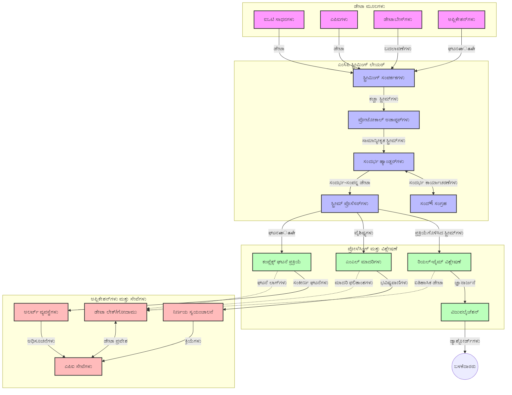

# ರಿಯಲ್-ಟೈಮ್ ಡೇಟಾ ಸ್ಟ್ರೀಮಿಂಗ್‌ಗೆ ಮಾದರಿ ಪ್ರಾಸಂಗ ಪ್ರೋಟೋಕಾಲ್

## ಅವಲೋಕನ

ರಿಯಲ್-ಟೈಮ್ ಡೇಟಾ ಸ್ಟ್ರೀಮಿಂಗ್ ಇಂದಿನ ಡೇಟಾ ಚಾಲಿತ ಜಗತ್ತಿನಲ್ಲಿ ಅಗತ್ಯವಾಯಿತು, ಇಲ್ಲಿ ವ್ಯವಹಾರಗಳು ಮತ್ತು ಅಪ್ಲಿಕೇಶನ್ಗಳು ತ್ವರಿತ ನಿರ್ಧಾರಗಳನ್ನು ತೆಗೆದುಕೊಳ್ಳಲು ತಕ್ಷಣವೇ ಮಾಹಿತಿಗೆ ಪ್ರವೇಶ ಅಗತ್ಯವಿದೆ. ಮಾದರಿ ಪ್ರಾಸಂಗ ಪ್ರೋಟೋಕಾಲ್ (MCP) ಈ ರಿಯಲ್-ಟೈಮ್ ಸ್ಟ್ರೀಮಿಂಗ್ ಪ್ರಕ್ರಿಯೆಗಳ ಪರಿಪೂರ್ಣತೆ, ಡೇಟಾ ಪ್ರಕ್ರಿಯಾಕೃತಿ ಕಾರ್ಯಕ್ಷಮತೆ, ಪ್ರಾಸಂಗಿಕ ಸುಸ್ಥಿತಿ ಮತ್ತು ಮೌಲ್ಯವರ್ಧಿತ ವ್ಯವಸ್ಥೆಯ ಕಾರ್ಯಕ್ಷಮತೆಯನ್ನು ಸುಧಾರಿಸುವ ಮಹತ್ವಪೂರ್ಣ ಪ್ರಗತಿಯನ್ನು ಪ್ರತಿಪಾದಿಸುತ್ತದೆ.

ಈ ಮೌಡುಲ್ MCP ರಿಯಲ್-ಟೈಮ್ ಡೇಟಾ ಸ್ಟ್ರೀಮಿಂಗ್ ಅನ್ನು ಏನೆ ರೀತಿಯಲ್ಲಿ ಪರಿವರ್ತಿಸುತ್ತದೆ ಎಂಬುದನ್ನು ಪರಿಶೀಲಿಸುತ್ತದೆ, ಇದು AI ಮಾದರಿಗಳು, ಸ್ಟ್ರೀಮಿಂಗ್ ವೇದಿಕೆಗಳು ಮತ್ತು ಅಪ್ಲಿಕೇಶನ್ಗಳಲ್ಲಿ ಪ್ರಾಸಂಗ ನಿರ್ವಹಣೆಗೆ ಒಂದು ಸಾಂದರ್ಭಿಕ ಮಾನದಂಡವನ್ನು ಒದಗಿಸುತ್ತದೆ.

## ರಿಯಲ್-ಟೈಮ್ ಡೇಟಾ ಸ್ಟ್ರೀಮಿಂಗ್ ಪರಿಚಯ

ರಿಯಲ್-ಟೈಮ್ ಡೇಟಾ ಸ್ಟ್ರೀಮಿಂಗ್ ಎಂದರೆ ಡೇಟಾ ಉತ್ಪಾದನೆಯಾಗುತ್ತಿರುವಷ್ಟು ತಕ್ಷಣ, ನಿರಂತರವಾಗಿ ಡೇಟಾವನ್ನು ಸ್ಥಳಾಂತರಿಸುವ, ಪ್ರಕ್ರಿಯೆ ಮಾಡುವ ಮತ್ತು ವಿಶ್ಲೇಷಿಸುವ ತಂತ್ರಜ್ಞಾನ ಮಾದರಿ, ಇದು ವ್ಯವಸ್ಥೆಗಳಿಗೆ ನವೀಕೃತ ಮಾಹಿತಿಗೆ ತಕ್ಷಣ ಪ್ರತಿಕ್ರಿಯಿಸುವ ಅವಕಾಶವನ್ನು ನೀಡುತ್ತದೆ. ಸ್ಥಿತಿಸ್ಥಾಪಕ ಗುಂಪುಗಳಿಗೆ ನಿರ್ವಹಣೆಯಾಗುವ ಸಾಂಪ್ರದಾಯಿಕ ಬ್ಯಾಚ್ ಪ್ರಕ್ರಿಯೆಯಿಂದ ಬೇರೆಯಾಗಿ, ಸ್ಟ್ರೀಮಿಂಗ್ ಡೇಟಾ ಚಲನೆಯಲ್ಲಿರುವ ಡೇಟಾವನ್ನು ನಿಖರ ತಡತೆಯನ್ನು ಕಡಿಮೆ ಮಾಡಿ ಒಳನೋಟಗಳು ಮತ್ತು ಕ್ರಿಯೆಗಳು ಒದಗಿಸುತ್ತದೆ.

### ರಿಯಲ್-ಟೈಮ್ ಡೇಟಾ ಸ್ಟ್ರೀಮಿಂಗ್ ಮೂಲ ಸಿದ್ಧಾಂತಗಳು:

- **ನಿರಂತರ ಡೇಟಾ ಪ್ರವಾಹ**: ಡೇಟಾ ಘಟನೆಗಳು ಅಥವಾ ದಾಖಲೆಗಳ ನಿರಂತರ, ಎಂದಿಗೂ ಇಲ್ಲದಂತೆ ಬರುವ ಧಾರೆಯಾಗಿ ಪ್ರಕ್ರಿಯೆಗೊಳ್ಳುತ್ತದೆ.
- **ಕಡಿಮೆ ತಡತೆ ಪ್ರಕ್ರಿಯೆ**: ಡೇಟಾ ಉತ್ಪಾದನೆ ಮತ್ತು ಪ್ರಕ್ರಿಯೆಯ ನಡುವಿನ ಸಮಯವನ್ನು ಕನಿಷ್ಟಗೊಳಿಸುವಂತೆ ವ್ಯವಸ್ಥೆಗಳು ವಿನ್ಯಾಸಗೊಳ್ಳುತ್ತವೆ.
- **ವಿಸ್ತರಣೆ ಸಾಮರ್ಥ್ಯ**: ಸ್ಟ್ರೀಮಿಂಗ್ ವಾಸ್ತುಶಿಲ್ಪಗಳು ಬದಲಾದ ಡೇಟಾ ಪ್ರಮಾಣ ಮತ್ತು ವೇಗವನ್ನು ನಿರ್ವಹಿಸಬೇಕಾಗುತ್ತದೆ.
- **ದೋಷ ಸಹಿಷ್ಣುತೆ**: ಡೇಟಾ ಹರಿವಿಗೆ ನಿರಂತರತೆ ನೀಡಲು ವೈಫಲ್ಯಗಳಿಗೆ ತಾಳ್ಮೆಯನ್ನು ನೀಡಬೇಕಾಗುತ್ತದೆ.
- **ಸ್ಥಿತಿಸ್ಥಾಪಕ ಪ್ರಕ್ರಿಯೆ**: ಘಟನಗಳ ನಡುವೆ ಪ್ರಾಸಂಗದ ನಿರ್ವಹಣೆ ಅರ್ಥಪೂರ್ಣ ವಿಶ್ಲೇಷಣೆಗೆ ಅಗತ್ಯವಾಗಿದೆ.

### ಮಾದರಿ ಪ್ರಾಸಂಗ ಪ್ರೋಟೋಕಾಲ್ ಮತ್ತು ರಿಯಲ್-ಟೈಮ್ ಸ್ಟ್ರೀಮಿಂಗ್

ಮಾದರಿ ಪ್ರಾಸಂಗ ಪ್ರೋಟೋಕಾಲ್ (MCP) ರಿಯಲ್-ಟೈಮ್ ಸ್ಟ್ರೀಮಿಂಗ್ ಪರಿಸರದಲ್ಲಿ ಅನೇಕ ಪ್ರಮುಖ ಸವಾಲುಗಳನ್ನು ಹೊಡ್ಡುತ್ತದೆ:

1. **ಪ್ರಾಸಂಗಿಕ સતતತೆ**: MCP ವಿತರಿತ ಸ್ಟ್ರೀಮಿಂಗ್ ಘಟಕಗಳ ಮಧ್ಯೆ ಪ್ರಾಸಂಗವನ್ನು ನಿರ್ವಹಿಸುವ ಪ್ರಮಾಣಿತ ವಿಧಾನವನ್ನು ಒದಗಿಸುತ್ತದೆ, ಇದರಿಂದ AI ಮಾದರಿಗಳು ಮತ್ತು ಪ್ರಕ್ರಿಯಾ ನೋಡ್ಗಳಿಗೆ ಸತ್ವದ ಇತಿಹಾಸ ಹಾಗೂ ಪರಿಸರ ಪ್ರಾಸಂಗ ಲಭ್ಯವಾಗುತ್ತದೆ.

2. **ದಕ್ಷ ಸ್ಥಿತಿ ನಿರ್ವಹಣೆ**: ಪ್ರಾಸಂಗ ಪ್ರಸರಣಕ್ಕಾಗಿ ರಚನಾತ್ಮಕ ವಿಧಾನಗಳನ್ನು ಒದಗಿಸುವ ಮೂಲಕ MCP ಸ್ಟ್ರೀಮಿಂಗ್ ಪೈಪ್‌ಲೈನ್‌ಗಳಲ್ಲಿ ಸ್ಥಿತಿ ನಿರ್ವಹಣೆಯ ಓವರ್ಹೆಡ್ ಅನ್ನು ಕಡಿಮೆ ಮಾಡುತ್ತದೆ.

3. **ಪರಸ್ಪರ ಕಾರ್ಯಸಾಧ್ಯತೆ**: ವಿವಿಧ ಸ್ಟ್ರೀಮಿಂಗ್ ತಂತ್ರಜ್ಞಾನಗಳು ಮತ್ತು AI ಮಾದರಿಗಳ ನಡುವಣ ಪ್ರಾಸಂಗ ಹಂಚಿಕೆಯ ಸಾಮಾನ್ಯ ಭಾಷೆಯನ್ನು MCP ಸೃಷ್ಟಿಸುತ್ತದೆ, ಇದು ಹೆಚ್ಚು ಲವಚೀತಾ ಮತ್ತು ವಿಸ್ತರಣೀಯ ವಾಸ್ತುಶಿಲ್ಪಗಳನ್ನು ಸಾಧ್ಯಮಾಡುತ್ತದೆ.

4. **ಸ್ಟ್ರೀಮಿಂಗ್-ಅನುವೂಢಿತ ಪ್ರಾಸಂಗ**: MCP ಜಾರಿ ಕ್ಷೇತ್ರಗಳಲ್ಲಿ ಯಾವ ಪ್ರಾಸಂಗ ಅಂಶಗಳು ತ್ವರಿತ ನಿರ್ಧಾರಗಳಿಗೆ ಅತ್ಯಂತ ಸಂಬಂಧಿತವಾದವೋ ಅವುಗಳನ್ನು ಪ್ರಾಥಮ್ಯ ನೀಡಬಹುದು, ಇದು ಕಾರ್ಯಕ್ಷಮತೆ ಮತ್ತು ಶುದ್ಧತೆ ಎರಡರಿಗೂ ಅನುಕೂಲಕರವಾಗಿದೆ.

5. **ಅನುಕೂಲ ಪ್ರಕ್ರಿಯೆ**: MCP ಮೂಲಕ ಸರಿಯಾದ ಪ್ರಾಸಂಗ ನಿರ್ವಹಣೆಯೊಂದಿಗೆ, ಸ್ಟ್ರೀಮಿಂಗ್ ವ್ಯವಸ್ಥೆಗಳು ಡೇಟಾದ ತಾಣಗಳಲ್ಲಿನ ಬೆಳವಣಿಗೆಗಳು ಮತ್ತು ಮಾದರಿಗಳ ಆಧಾರದ ಮೇಲೆ ಪ್ರಕ್ರಿಯೆಯನ್ನು ಗತಿಯುತವಾಗಿ ಹೊಂದಿಕೊಳ್ಳಬಹುದು.

ಇಂದಿನ ಅಪ್ಲಿಕೇಶನ್ಗಳಲ್ಲಿ IoT ಸೆನ್ಸಾರ್ ಜಾಲಗಳಿಂದ ಹಣಕಾಸು ವ್ಯಾಪಾರ ವೇದಿಕೆಗಳವರೆಗೆ MCP ನ ಸಮಾಮೇಳನವು ಹೆಚ್ಚು ಬುದ್ಧಿವಂತಿಕೆ, ಪ್ರಾಸಂಗ-ಜಾಗರೂಕ ಪ್ರಕ್ರಿಯೆಯನ್ನು ಸಾಧ್ಯಮಾಡುತ್ತದೆ, ಇದು ಜಟಿಲ, ವೃದ್ಧಿಯಾಗುತ್ತಿರುವ ಪರಿಸ್ಥಿತಿಗಳಿಗೆ ರಿಯಲ್-ಟೈಮ್‌ನಲ್ಲಿ ಸೂಕ್ತವಾಗಿ ಪ್ರತಿಕ್ರಿಯಿಸುತ್ತದೆ.

## ಕಲಿಕೆಯ ಉದ್ದೇಶಗಳು

ಈ ಪಾಠದ ಕೊನೆಯಲ್ಲಿ ನೀವು:

- ರಿಯಲ್-ಟೈಮ್ ಡೇಟಾ ಸ್ಟ್ರೀಮಿಂಗ್ ಮತ್ತು ಅದರ ಸವಾಲುಗಳ ಮೂಲಭೂತಗಳನ್ನು ಅರ್ಥಮಾಡಿಕೊಳ್ಳಬಹುದು
- ಮಾದರಿ ಪ್ರಾಸಂಗ ಪ್ರೋಟೋಕಾಲ್ (MCP) ರಿಯಲ್-ಟೈಮ್ ಡೇಟಾ ಸ್ಟ್ರೀಮಿಂಗ್ ಅನ್ನು ಹೇಗೆ ಸುಧಾರಿಸುತ್ತದೆ ಎನ್ನುವುದನ್ನು ವಿವರಿಸಬಹುದು
- Kafka ಮತ್ತು Pulsar ಮುಂತಾದ ಜನಪ್ರಿಯ ಫ್ರೇಮ್ವರ್ಕ್‌ಗಳನ್ನು ಉಪಯೋಗಿಸಿ MCP ಆಧಾರಿತ ಸ್ಟ್ರೀಮಿಂಗ್ ಪರಿಹಾರಗಳನ್ನು ಜಾರಿಗೊಳಿಸಬಹುದು
- MCP ಜೊತೆ ದೋಷ ಸಹಿಷ್ಣು, ಉನ್ನತ ಕಾರ್ಯಕ್ಷಮತೆ ಸ್ಟ್ರೀಮಿಂಗ್ ವಾಸ್ತುಶಿಲ್ಪಗಳನ್ನು ವಿನ್ಯಾಸ ಮಾಡಿ ನಿಯೋಜಿಸಬಹುದು
- MCP ಸಿದ್ಧಾಂತಗಳನ್ನು IoT, ಹಣಕಾಸು ವ್ಯಾಪಾರ ಮತ್ತು AI ಚಾಲಿತ ವಿಶ್ಲೇಷಣಾ ಉಪಯೋಗಗಳಿಗೆ ಅನ್ವಯಿಸಬಹುದು
- MCP ಆಧಾರಿತ ಸ್ಟ್ರೀಮಿಂಗ್ ತಂತ್ರಜ್ಞಾನಗಳಲ್ಲಿ ಉದಯೋನ್ಮುಖ ಪ್ರವೃತ್ತಿಗಳು ಮತ್ತು ಭವಿಷ್ಯದ ನವೀನತೆಗಳನ್ನು ಮೌಲ್ಯಮಾಪನ ಮಾಡಬಹುದು

### ವ್ಯಾಖ್ಯಾನ ಮತ್ತು ಮಹತ್ತ್ವ

ರಿಯಲ್-ಟೈಮ್ ಡೇಟಾ ಸ್ಟ್ರೀಮಿಂಗ್ ಎಂದರೆ ಕಡಿಮೆ ತಡತೆಯೊಂದಿಗೆ ಡೇಟಾನ continuous ತೊಳಕುವ, ಪ್ರಕ್ರಿಯೆ ಮಾಡುವ ಮತ್ತು ವಿತರಿಸುವ ನಿರಂತರ ಕಾರ್ಯ. ಬ್ಯಾಚ್ ಪ್ರಕ್ರಿಯೆಯ ಹಾಗೆ ಒಂದೋ ಗುಂಪುಗಳಲ್ಲಿ ಡೇಟಾವನ್ನು ಸಂಗ್ರಹಿಸಿ ಪ್ರಕ್ರಿಯೆ ಮಾಡುವುದರ ಬದಲು, ಸ್ಟ್ರೀಮಿಂಗ್ ಡೇಟಾ ಆಗಮಿಸುವಂತೆ ಪ್ರಕ್ರಿಯೆಗೊಳ್ಳುತ್ತದೆ, ತಕ್ಷಣವೇ ಒಳನೋಟಗಳು ಮತ್ತು ಕ್ರಿಯೆಗಳನ್ನು ಸಾಧ್ಯಮಾಡುತ್ತದೆ.

ರಿಯಲ್-ಟೈಮ್ ಡೇಟಾ ಸ್ಟ್ರೀಮಿಂಗ್ ಮುಖ್ಯ ಲಕ್ಷಣಗಳು:

- **ಕಡಿಮೆ ತಡತೆ**: ಮಿಲಿಸೆಕಂಡ್‌ಗಳಿಂದ ಸೆಕೆಂಡುಗಳೊಳಗಿನ ಡೇಟಾ ಪ್ರಕ್ರಿಯೆ ಮತ್ತು ವಿಶ್ಲೇಷಣೆ
- **ನಿರಂತರ ಪ್ರವಾಹ**: ವಿವಿಧ ಮೂಲಗಳಿಂದ ಡೇಟಾದ ನಿರಂತರ ಸ್ಟ್ರೀಮ್
- **ತಕ್ಷಣ ಪ್ರಕ್ರಿಯೆ**: ಬ್ಯಾಚ್‌ಗಳಿಂದ ಬದಲಾಗಿ ಡೇಟಾ ಆಗಮಿಸುವಂತೆಯೇ ವಿಶ್ಲೇಷಣೆ
- **ಘಟನಾ ಚಾಲಿತ ವಾಸ್ತುಶಿಲ್ಪ**: ಘಟನೆಗಳು ಸಂಭವಿಸುವಂತೆ ಪ್ರತಿಕ್ರಿಯಿಸುತ್ತವೆ

### ಸಾಂಪ್ರದಾಯಿಕ ಡೇಟಾ ಸ್ಟ್ರೀಮಿಂಗ್ ಸಮಸ್ಯೆಗಳು

ಸಾಂಪ್ರದಾಯಿಕ ಡೇಟಾ ಸ್ಟ್ರೀಮಿಂಗ್ ವಿಧಾನಗಳು ಹಲವಾರು ಸೀಮಿತತೆಗಳನ್ನು ಎದುರಿಸುತ್ತವೆ:

1. **ಪ್ರಾಸಂಗ ಹಾನಿ**: ವಿತರಿತ ವ್ಯವಸ್ಥೆಗಳ ನಡುವೆ ಪ್ರಾಸಂಗವನ್ನು ನಿರ್ವಹಿಸುವಲ್ಲಿ ಕಠಿಣತೆ
2. **ವಿಸ್ತರಣ ಸಾಮರ್ಥ್ಯದ ಸಮಸ್ಯೆಗಳು**: ಹೆಚ್ಚಿನ ಪ್ರಮಾಣ ಮತ್ತು ವೇಗದ ಡೇಟಾವನ್ನು ನಿಭಾಯಿಸುವ ಸವಾಲುಗಳು
3. **ಸಂಕೀರ್ಣ ಒಕ್ಕೂಟ**: ವಿಭಿನ್ನ ವ್ಯವಸ್ಥೆಗಳ ನಡುವಣ ಪರಸ್ಪರ ಕಾರ್ಯಸಾಧ್ಯತೆ ಸಮಸ್ಯೆಗಳು
4. **ತಡತೆ ನಿರ್ವಹಣೆ**: ತುಂಬಿಸುವಿಕೆಗೆ ಮತ್ತು ಪ್ರಕ್ರಿಯೆ ಸಮಯಕ್ಕೆ ಸಮತೋಲನೆ
5. **ಡೇಟಾ ಸಮ್ಮತತೆ**: ಸ್ಟ್ರೀಮಿನಲ್ಲಿಯೆಲ್ಲಾ ಡೇಟಾ ನಿಖರತೆ ಮತ್ತು ಪೂರ್ಣತೆಯನ್ನು ಖಚಿತಪಡಿಸುವುದು

## ಮಾದರಿ ಪ್ರಾಸಂಗ ಪ್ರೋಟೋಕಾಲ್ (MCP) ಅರ್ಥಮಾಡಿಕೊಳ್ಳುವುದು

### MCP ಎಂದರೇನು?

ಮಾದರಿ ಪ್ರಾಸಂಗ ಪ್ರೋಟೋಕಾಲ್ (MCP) ಎಂದರೆ AI ಮಾದರಿಗಳ ಮತ್ತು ಅಪ್ಲಿಕೇಶನ್ಗಳ ನಡುವೆ ದಕ್ಷ ಸಂವಹನವನ್ನು ಸುಕರಗೊಳಿಸಲು ರೂಪಿತ ಪ್ರಮಾಣಿತ ಸಂವಹನ ಪ್ರೋಟೋಕಾಲ್. ರಿಯಲ್-ಟೈಮ್ ಡೇಟಾ ಸ್ಟ್ರೀಮಿಂಗಿನಲ್ಲಿ, MCP ಒದಗಿಸುವುದು:

- ಡೇಟಾ ಪೈಪ್‌ಲೈನ್‌ನಲ್ಲಿ ಪ್ರಾಸಂಗ ಉಳಿಸುವುದು
- ಡೇಟಾ ವಿನಿಮಯ ರಚನೆಗಳನ್ನು ಮಾನ್ಯಗೊಳಿಸುವುದು
- ದೊಡ್ಡ ಡೇಟಾಸೆಟ್‌ಗಳ ಪ್ರಸಾರವನ್ನು ಸುಧಾರಿಸುವುದು
- ಮಾದರಿ-ಮಾದರಿ ಮತ್ತು ಮಾದರಿ-ಅಪ್ಲಿಕೇಶನ್ ಸಂವಹನವನ್ನು ಉತ್ತಮಗೊಳಿಸುವುದು

### ಮುಖ್ಯ ಘಟಕಗಳು ಮತ್ತು ವಾಸ್ತುಶಿಲ್ಪ

ರಿಯಲ್-ಟೈಮ್ ಸ್ಟ್ರೀಮಿಂಗ್‌ಗೆ MCP ವಾಸ್ತುಶಿಲ್ಪವು ಕೆಲವು ಪ್ರಮುಖ ಘಟಕಗಳನ್ನು ಒಳಗೊಂಡಿದೆ:

1. **ಪ್ರಾಸಂಗ ನಿರ್ವಾಹಕರು**: ಸ್ಟ್ರೀಮಿಂಗ್ ಪೈಪ್‌ಲೈನ್ ಮೂಲಕ ಪ್ರಾಸಂಗ ಮಾಹಿತಿಯನ್ನು ನಿರ್ವಹಿಸುತ್ತಾರೆ ಮತ್ತು ಕಾಪಾಡಿಕೊಳ್ಳುತ್ತಾರೆ
2. **ಸ್ಟ್ರೀಮ್ ಪ್ರೊಸೆಸರ್ಸ್**: ಪ್ರಾಸಂಗ-ಜಾಗರೂಕ ತಂತ್ರಗಳನ್ನು ಉಪಯೋಗಿಸಿ ಡೇಟಾ ಸ್ಟ್ರೀಮ್‌ಗಳನ್ನು ಪ್ರಕ್ರಿಯೆ ಮಾಡುತ್ತಾರೆ
3. **ಪ್ರೋಟೋಕಾಲ್ ಅಡಾಪ್ಟರ್ಸ್**: ವಿಭಿನ್ನ ಸ್ಟ್ರೀಮಿಂಗ್ ಪ್ರೋಟೋಕಾಲ್‌ಗಳ ನಡುವೆ ಪ್ರಾಸಂಗವನ್ನು ಕಾಪಾಡಿಕೊಂಡು ಪರಿವರ್ತಿಸುತ್ತಾರೆ
4. **ಪ್ರಾಸಂಗ ಸಂಗ್ರಹಣೆ**: ಪ್ರಾಸಂಗ ಮಾಹಿತಿಯನ್ನು ಪರಿಣಾಮಕಾರಿಯಾಗಿ ಸಂಗ್ರಹಿಸುತ್ತಾ ಮರುಸ್ವೀಕರಿಸುತ್ತವೆ
5. **ಸ್ಟ್ರೀಮಿಂಗ್ ಸಂಪರ್ಕಕಾರರು**: ವಿವಿಧ ಸ್ಟ್ರೀಮಿಂಗ್ ವೇದಿಕೆಗಳಿಗೆ ಸಂಪರ್ಕ (Kafka, Pulsar, Kinesis ಇತ್ಯಾದಿ)



### MCP ಹೇಗೆ ರಿಯಲ್-ಟೈಮ್ ಡೇಟಾ ಹ್ಯಾಂಡ್ಲಿಂಗ್ ಅನ್ನು ಸುಧಾರಿಸುತ್ತದೆ

MCP ಸಾಂಪ್ರದಾಯಿಕ ಸ್ಟ್ರೀಮಿಂಗ್ ಸವಾಲುಗಳನ್ನು ಕೆಳಗಿನ ಮೂಲಕ ಪರಿಹರಿಸುತ್ತದೆ:

- **ಪ್ರಾಸಂಗಿಕ ಸಮಗ್ರತೆ**: ಸಂಪೂರ್ಣ ಪೈಪ್‌ಲೈನ್‌ನಾದಾಧಿ ಡೇಟಾ ಬಿಂದುಗಳ ನಡುವೆ ಸಂಬಂಧಗಳನ್ನು ನಿರ್ವಹಿಸುತ್ತದೆ
- **ಅನುಕೂಲಿತ ಪ್ರಸಾರ**: ಬುದ್ಧಿವಂತ ಪ್ರಾಸಂಗ ನಿರ್ವಹಣೆಯ ಮೂಲಕ ಡೇಟಾ ವಿನಿಮಯದಲ್ಲಿ ಪುನರಾವರ್ತನೆಯನ್ನು ಕಡಿಮೆ ಮಾಡುತ್ತದೆ
- **ಪ್ರಮಾಣಿತ ಇಂಟರ್ಫೇಸ್ಗಳು**: ಸ್ಟ್ರೀಮಿಂಗ್ ಘಟಕಗಳಿಗಾಗಿ ಸಹಜ APIs ನೀಡುತ್ತದೆ
- **ತಡತೆ ಕಡಿತ**: ಪರಿಣಾಮಕಾರಿಯಾದ ಪ್ರಾಸಂಗ ನಿರ್ವಹಣೆಯಿಂದ ಪ್ರಕ್ರಿಯೆಯ ಓವರ್ಹೆಡ್ ಕಡಿಮೆ ಮಾಡುತ್ತದೆ
- **ವಿಸ್ತರಣೆ ಹೆಚ್ಚಳ**: ಪ್ರಾಸಂಗ ಉಳಿಸುವಾಗಲೂ ಸಮಾಂತರ ವಿಸ್ತರಣೆ ಸಹಾಯ ಮಾಡುತ್ತದೆ

## ಏಕೀಕೃತಗೊಳಿಸುವಿಕೆ ಮತ್ತು ಜಾರಿಗೊಳಿಸುವಿಕೆ

ರಿಯಲ್-ಟೈಮ್ ಡೇಟಾ ಸ್ಟ್ರೀಮಿಂಗ್ ವ್ಯವಸ್ಥೆಗಳು ಸುಸಜ್ಜಿತ ವಿನ್ಯಾಸ ಮತ್ತು ಜಾರಿಗೊಳಿಸುವಿಕೆಯನ್ನು ಅಗತ್ಯವಿಟ್ಟು ಕಾರ್ಯಕ್ಷಮತೆ ಮತ್ತು ಪ್ರಾಸಂಗಿಕ ಸಮಗ್ರತೆಯನ್ನು ಕಾಪಾಡಿಕೊಳ್ಳಬೇಕು. ಮಾದರಿ ಪ್ರಾಸಂಗ ಪ್ರೋಟೋಕಾಲ್ AI ಮಾದರಿಗಳು ಮತ್ತು ಸ್ಟ್ರೀಮಿಂಗ್ ತಂತ್ರಜ್ಞಾನಗಳನ್ನು ಸಾಂಪ್ರದಾಯಿಕವಾಗಿ ಏಕೀಕರಿಸುವ ಮೂಲಕ ಹೆಚ್ಚು ಕುಶಲ, ಪ್ರಾಸಂಗ-ಜಾಗರೂಕ ಪ್ರಕ್ರಿಯೆ ಪೈಪ್‌ಲೈನ್‌ಗಳನ್ನೂ ಸಾಧ್ಯಮಾಡುತ್ತದೆ.

### ಸ್ಟ್ರೀಮಿಂಗ್ ವಾಸ್ತುಶಿಲ್ಪಗಳಲ್ಲಿ MCP ಏಕೀಕರಣದ ಅವಲೋಕನ

ರಿಯಲ್-ಟೈಮ್ ಸ್ಟ್ರೀಮಿಂಗ್ ಪರಿಸರಗಳಲ್ಲಿ MCP ಜಾರಿಗೊಳಿಸುವಾಗ ಪ್ರಮುಖ ಪರಿಗಣನೆಗಳು:

1. **ಪ್ರಾಸಂಗ ಸರಣಿ ಮತ್ತು ಸಾರಿಗೆ**: MCP ಸ್ಟ್ರೀಮಿಂಗ್ ಡೇಟಾ ಪ್ಯಾಕೆಟ್‌ಗಳ ಒಳಗೆ ಪ್ರಾಸಂಗ ಮಾಹಿತಿಯನ್ನು ಕಡಿಮೆ ಹೊಂಚು ಮತ್ತು ಅನುಮೋದಿತ ಸರಣೀಕರಣ ವಿನ್ಯಾಸಗಳೊಂದಿಗೆ ಸಂಕೇತಿಸಲು ಪರಿಣಾಮಕಾರಿಯಾದ ಮಾರ್ಗಗಳನ್ನು ನೀಡುತ್ತದೆ, ಇದರಿಂದ ಮಹತ್ವಪೂರ್ಣ ಪ್ರಾಸಂಗ ಡೇಟಾ ಪೈಪ್‌ಲೈನಿನಲ್ಲೇ ಹರಿಯುತ್ತದೆ.

2. **ಸ್ಥಿತಿಸ್ಥಾಪಕ ಸ್ಟ್ರೀಮ್ ಪ್ರಕ್ರಿಯೆ**: MCP ನಿರಂತರವಾಗಿ ಪ್ರಾಸಂಗವನ್ನು ಗಣನೆಗೆ ತೆಗೆದುಕೊಳ್ಳುವ ಮೂಲಕ ಪ್ರಕ್ರಿಯಾ ನೋಡ್ಗಳ ನಡುವೆ ಸ್ಥಿತಿಯ ಸಮನ್ವಯವನ್ನು ಸುಗಮಗೊಳಿಸುತ್ತದೆ, ಇದು ವಿತರಿತ ಸ್ಟ್ರೀಮಿಂಗ್ ವಾಸ್ತುಶಿಲ್ಪಗಳಲ್ಲಿ ಸ್ಥಿತಿ ನಿರ್ವಹಣೆಯ ಸವಾಲುಗಳನ್ನು ಅಗ್ಗ ಮಾಡುತ್ತದೆ.

3. **ಘಟನಾ-ಸಮಯ ಮತ್ತು ಪ್ರಕ್ರಿಯೆ-ಸಮಯ ಬೇರ್ಪಾಟು**: MCP ಜಾರಿಗೊಳಿಸುವಿಕೆ ಸ್ಟ್ರೀಮಿಂಗ್ ವ್ಯವಸ್ಥೆಗಳಲ್ಲಿ ಘಟನೆಗಳು ಸಂಭವಿಸಿದ ಸಮಯ ಮತ್ತು ಅವುಗಳನ್ನು ಪ್ರಕ್ರಿಯೆಗೊಳಿಸಿದ ಸಮಯದ ವ್ಯತ್ಯಾಸವನ್ನು ಪರಿಗಣಿಸುವ ಸಾಮಾನ್ಯ ಸವಾಲನ್ನು ತಟ್ಟಿ, ಘಟನಾ ಸಮಯ ವ್ಯಾಖ್ಯಾನಗಳನ್ನು ಉಳಿಸುವ ಪ್ರಾಸಂಗವನ್ನು ಒಳಗೊಂಡಿರಬಹುದು.

4. **ಬ್ಯಾಕ್‌ಪ್ರೆಶರ್ ನಿರ್ವಹಣೆ**: MCP ಪ್ರಮಾಣಿತ ಪ್ರಾಸಂಗ ನಿರ್ವಹಣೆಯ ಮೂಲಕ ಸ್ಟ್ರೀಮಿಂಗ್ ಘಟಕಗಳ ಬ್ಯಾಕ್‌ಪ್ರೆಶರ್ ನಿರ್ವಹಣೆಯನ್ನು ನೆರವು ನೀಡುತ್ತದೆ, ಇದು ಘಟಕಗಳು ತಮ್ಮ ಪ್ರಕ್ರಿಯಾ ಸಾಮರ್ಥ್ಯವನ್ನು ಸಂವಹನ ಮಾಡಿಕೊಳ್ಳಲು ಮತ್ತು ಫ್ಲೋವನ್ನು ಅನುಗುಣವಾಗಿ ಹೊಂದಿಸಲು ಸಹಾಯಮಾಡುತ್ತದೆ.

5. **ಪ್ರಾಸಂಗ ವಿಂಡೋಯಿಂಗ್ ಮತ್ತು ಸಮೂಹಗೊಳಣೆ**: MCP ಕಾಲಾತೀತ ಮತ್ತು ಸಂಬಂಧಿತ ಪ್ರಾಸಂಗಗಳ ರಚನಾತ್ಮಕ ಪ್ರತಿನಿಧಾನವನ್ನು ಒದಗಿಸುವ ಮೂಲಕ ಹೆಚ್ಚು ಜಟಿಲ ವಿಂಡೋ ಕಾರ್ಯಾಚರಣೆಗಳನ್ನೂ ಸಾದ್ಯಮಾಡುತ್ತದೆ, ಇದು ಘಟನೆಗಳ ಸ್ಟ್ರೀಮ್‌ಗಳಲ್ಲಿ ಅರ್ಥಪೂರ್ಣ ಸಮೂಹಗೊಳಣೆಯನ್ನು ಸಾಧ್ಯಮಾಡುತ್ತದೆ.

6. **ಖಚಿತ-ಒಂಬತ್ತು ಪ್ರಕ್ರಿಯೆ**: ಖಚಿತ-ಒಂಬತ್ತು ಸಾಂಯೋಜಕತೆಯನ್ನು ಅವಲಂಬಿಸುವ ಸ್ಟ್ರೀಮಿಂಗ್ ವ್ಯವಸ್ಥೆಗಳಲ್ಲಿ, MCP ಪ್ರಕ್ರಿಯೆ ಸ್ಥಿತಿಯನ್ನು ಟ್ರ್ಯಾಕ್ ಮತ್ತು ಪರಿಶೀಲಿಸಲು ಪ್ರಕ್ರಿಯಾ ಮೆಟಾಡೇಟಾವನ್ನು ಸೇರಿಸಬಹುದು.

ವಿಭಿನ್ನ ಸ್ಟ್ರೀಮಿಂಗ್ ತಂತ್ರಜ್ಞಾನಗಳಲ್ಲಿನ MCP ಜಾರಿ ಅಧಿಕೃತವಾಗಿ ಪ್ರಾಸಂಗ ನಿರ್ವಹಣೆಯ ಏಕೀಕೃತ ವಿಧಾನವನ್ನು ರೂಪಿಸುತ್ತದೆ, ಇತ್ತೀಚೆಗೆ ಜಾಹೀರಾತಿನ ಕಸ್ಟಮ್ ಏಕೀಕರಣ ಕೋಡ್ ಅಗತ್ಯತೆ ಕಡಿಮೆ ಮಾಡುತ್ತಾ, ಡೇಟಾ ಪೈಪ್‌ಲೈನಿನ ಮೂಲಕ ಸಿದ್ಧಾರ್ಥದೊಂದಿಗೆ ಪ್ರಾಸಂಗ ಉಳಿಸುವ ವ್ಯವಸ್ಥೆಯನ್ನು ಸಾಮರ್ಥ್ಯವಂತು ಮಾಡುತ್ತದೆ.

### ವಿಭಿನ್ನ ಡೇಟಾ ಸ್ಟ್ರೀಮಿಂಗ್ ಫ್ರೇಮ್ವರ್ಕ್‌ಗಳಲ್ಲಿ MCP

ಈ ಉದಾಹರಣೆಗಳು ಪ್ರಸ್ತುತ MCP ನಮೂನೆಯೊಂದಿಗೆ JSON-RPC ಆಧಾರಿತ ಪ್ರೋಟೋಕಾಲ್ ಮತ್ತು ವಿಭಿನ್ನ ಸಾರಿಗೆ ಕ್ರಮಗಳನ್ನು ಗಮನಿಸುತ್ತವೆ. ಕೋಡ್ ನಮೂನೆಗಳು Kafka ಮತ್ತು Pulsar ಮುಂತಾದ ಸ್ಟ್ರೀಮಿಂಗ್ ವೇದಿಕೆಗಳನ್ನು MCP ನೊಂದಿಗೆ ಸಂಪೂರ್ಣ ಸಮ್ಮತಿಯನ್ನು ಉಳಿಸಿಕೊಂಡು ಏಕೀಕರಿಸುವದು ಹೇಗೆ ಎನ್ನುವುದನ್ನು ತೋರಿಸುತ್ತವೆ.

ಈ ಉದಾಹರಣೆಗಳು MCPಗಾಗಿ ಕೇಂದ್ರ ವಿಷಯ ಜಾಗೃತಿಯನ್ನು ಉಳಿಸಿಕೊಂಡು ರಿಯಲ್-ಟೈಮ್ ಡೇಟಾ ಪ್ರಕ್ರಿಯೇಷನ್ ಒದಗಿಸಲು ಸ್ಟ್ರೀಮಿಂಗ್ ವೇದಿಕೆಗಳನ್ನು ಹೇಗೆ ಏಕೀಕರಿಸಬಹುದೋ ತೋರಿಸುತ್ತವೆ. ಜೂನ್ 2025 ರ MCP ವಿಶಿಷ್ಟ ಸ್ಥಿತಿಯನ್ನು ನಿಖರವಾಗಿ ಪ್ರತಿಬಿಂಬಿಸುತ್ತವೆ.

MCP ಜನಪ್ರಿಯ ಸ್ಟ್ರೀಮಿಂಗ್ ಫ್ರೇಮ್ವರ್ಕ್‌ಗಳೊಡನೆ ಏಕೀಕರಿಸಬಹುದು:

#### ಅಪಾಚೆ ಕಾಫ್ಕಾ ಏಕೀಕರಣ

```python
import asyncio
import json
from typing import Dict, Any, Optional
from confluent_kafka import Consumer, Producer, KafkaError
from mcp.client import Client, ClientCapabilities
from mcp.core.message import JsonRpcMessage
from mcp.core.transports import Transport

# MCP ಅನ್ನು Kafka ಜೊತೆ ಸೇರುವ ಕಸ್ಟಮ್ ಟ್ರಾನ್ಸ್‌ಪೋರ್ಟ್ ಕ್ಲಾಸ್
class KafkaMCPTransport(Transport):
    def __init__(self, bootstrap_servers: str, input_topic: str, output_topic: str):
        self.bootstrap_servers = bootstrap_servers
        self.input_topic = input_topic
        self.output_topic = output_topic
        self.producer = Producer({'bootstrap.servers': bootstrap_servers})
        self.consumer = Consumer({
            'bootstrap.servers': bootstrap_servers,
            'group.id': 'mcp-client-group',
            'auto.offset.reset': 'earliest'
        })
        self.message_queue = asyncio.Queue()
        self.running = False
        self.consumer_task = None
        
    async def connect(self):
        """Connect to Kafka and start consuming messages"""
        self.consumer.subscribe([self.input_topic])
        self.running = True
        self.consumer_task = asyncio.create_task(self._consume_messages())
        return self
        
    async def _consume_messages(self):
        """Background task to consume messages from Kafka and queue them for processing"""
        while self.running:
            try:
                msg = self.consumer.poll(1.0)
                if msg is None:
                    await asyncio.sleep(0.1)
                    continue
                
                if msg.error():
                    if msg.error().code() == KafkaError._PARTITION_EOF:
                        continue
                    print(f"Consumer error: {msg.error()}")
                    continue
                
                # ಸಂದೇಶ ಮೌಲ್ಯವನ್ನು JSON-RPC ಆಗಿ ವಿಶ್ಲೇಷಿಸಿ
                try:
                    message_str = msg.value().decode('utf-8')
                    message_data = json.loads(message_str)
                    mcp_message = JsonRpcMessage.from_dict(message_data)
                    await self.message_queue.put(mcp_message)
                except Exception as e:
                    print(f"Error parsing message: {e}")
            except Exception as e:
                print(f"Error in consumer loop: {e}")
                await asyncio.sleep(1)
    
    async def read(self) -> Optional[JsonRpcMessage]:
        """Read the next message from the queue"""
        try:
            message = await self.message_queue.get()
            return message
        except Exception as e:
            print(f"Error reading message: {e}")
            return None
    
    async def write(self, message: JsonRpcMessage) -> None:
        """Write a message to the Kafka output topic"""
        try:
            message_json = json.dumps(message.to_dict())
            self.producer.produce(
                self.output_topic,
                message_json.encode('utf-8'),
                callback=self._delivery_report
            )
            self.producer.poll(0)  # ಕಾಲ್ಬ್ಯಾಕ್‌ಗಳನ್ನು ಪ್ರಾರಂಭಿಸಿ
        except Exception as e:
            print(f"Error writing message: {e}")
    
    def _delivery_report(self, err, msg):
        """Kafka producer delivery callback"""
        if err is not None:
            print(f'Message delivery failed: {err}')
        else:
            print(f'Message delivered to {msg.topic()} [{msg.partition()}]')
    
    async def close(self) -> None:
        """Close the transport"""
        self.running = False
        if self.consumer_task:
            self.consumer_task.cancel()
            try:
                await self.consumer_task
            except asyncio.CancelledError:
                pass
        self.consumer.close()
        self.producer.flush()

# Kafka MCP ಟ್ರಾನ್ಸ್‌ಪೋರ್ಟ್‌ನ ಉದಾಹರಣೆಯ ಬಳಕೆ
async def kafka_mcp_example():
    # Kafka ಟ್ರಾನ್ಸ್‌ಪೋರ್ಟ್ ಹೊಂದಿದ MCP ಕ್ಲೈಂಟ್ ಅನ್ನು ರಚಿಸಿ
    client = Client(
        {"name": "kafka-mcp-client", "version": "1.0.0"},
        ClientCapabilities({})
    )
    
    # Kafka ಟ್ರಾನ್ಸ್‌ಪೋರ್ಟ್ ರಚಿಸಿ ಮತ್ತು ಸಂಪರ್ಕಿಸಿ
    transport = KafkaMCPTransport(
        bootstrap_servers="localhost:9092",
        input_topic="mcp-responses",
        output_topic="mcp-requests"
    )
    
    await client.connect(transport)
    
    try:
        # MCP ಸೆಷನ್ ಅನ್ನು ಪ್ರಾರಂಭಿಸಿ
        await client.initialize()
        
        # MCP ಮೂಲಕ ಟೂಲ್ ಅನ್ನು ಕಾರ್ಯನಿರ್ವಹಿಸುವ ಉದಾಹರಣೆ
        response = await client.execute_tool(
            "process_data",
            {
                "data": "sample data",
                "metadata": {
                    "source": "sensor-1",
                    "timestamp": "2025-06-12T10:30:00Z"
                }
            }
        )
        
        print(f"Tool execution response: {response}")
        
        # ಸ್ವಚ್ಛ_shutdown
        await client.shutdown()
    finally:
        await transport.close()

# ಉದಾಹರಣೆ ಅನ್ನು ಚಾಲನೆ ಮಾಡಿ
if __name__ == "__main__":
    asyncio.run(kafka_mcp_example())
```

#### ಅಪಾಖೆ pulsar ಜಾರಿಗೊಳಿಸುವಿಕೆ

```python
import asyncio
import json
import pulsar
from typing import Dict, Any, Optional
from mcp.core.message import JsonRpcMessage
from mcp.core.transports import Transport
from mcp.server import Server, ServerOptions
from mcp.server.tools import Tool, ToolExecutionContext, ToolMetadata

# ಪಲ್ಸರ್ ಬಳಸಿಕೊಂಡು ಕಸ್ಟಮ್ MCP ಸಾರಿಗೆ ರಚಿಸಿ
class PulsarMCPTransport(Transport):
    def __init__(self, service_url: str, request_topic: str, response_topic: str):
        self.service_url = service_url
        self.request_topic = request_topic
        self.response_topic = response_topic
        self.client = pulsar.Client(service_url)
        self.producer = self.client.create_producer(response_topic)
        self.consumer = self.client.subscribe(
            request_topic,
            "mcp-server-subscription",
            consumer_type=pulsar.ConsumerType.Shared
        )
        self.message_queue = asyncio.Queue()
        self.running = False
        self.consumer_task = None
    
    async def connect(self):
        """Connect to Pulsar and start consuming messages"""
        self.running = True
        self.consumer_task = asyncio.create_task(self._consume_messages())
        return self
    
    async def _consume_messages(self):
        """Background task to consume messages from Pulsar and queue them for processing"""
        while self.running:
            try:
                # ಟೈಮೌಟ್‌ನೊಂದಿಗೆ ನಾನ್-ಬ್ಲಾಕಿಂಗ್ ಸ್ವೀಕರಿಸಿ
                msg = self.consumer.receive(timeout_millis=500)
                
                # ಸಂದೇಶ ಸಂಸ್ಕರಿಸಿ
                try:
                    message_str = msg.data().decode('utf-8')
                    message_data = json.loads(message_str)
                    mcp_message = JsonRpcMessage.from_dict(message_data)
                    await self.message_queue.put(mcp_message)
                    
                    # ಸಂದೇಶವನ್ನು ಒಪ್ಪಿಕೊಳ್ಳಿ
                    self.consumer.acknowledge(msg)
                except Exception as e:
                    print(f"Error processing message: {e}")
                    # ದೋಷವಿದ್ದರೆ ನಕಾರಾತ್ಮಕ ಒಪ್ಪಿಗೆಯನ್ನು ನೀಡಿ
                    self.consumer.negative_acknowledge(msg)
            except Exception as e:
                # ಟೈಮೌಟ್ ಅಥವಾ ಇತರ ಹೊರತಾಗುವಿಕೆಗಳನ್ನು ನಿರ್ವಹಿಸಿ
                await asyncio.sleep(0.1)
    
    async def read(self) -> Optional[JsonRpcMessage]:
        """Read the next message from the queue"""
        try:
            message = await self.message_queue.get()
            return message
        except Exception as e:
            print(f"Error reading message: {e}")
            return None
    
    async def write(self, message: JsonRpcMessage) -> None:
        """Write a message to the Pulsar output topic"""
        try:
            message_json = json.dumps(message.to_dict())
            self.producer.send(message_json.encode('utf-8'))
        except Exception as e:
            print(f"Error writing message: {e}")
    
    async def close(self) -> None:
        """Close the transport"""
        self.running = False
        if self.consumer_task:
            self.consumer_task.cancel()
            try:
                await self.consumer_task
            except asyncio.CancelledError:
                pass
        self.consumer.close()
        self.producer.close()
        self.client.close()

# ಸ್ಟ್ರೀಮಿಂಗ್ ಡೇಟಾವನ್ನು ಪ್ರಕ್ರಿಯಾಪಡಿಸುವ ಮಾದರಿ MCP ಉಪಕರಣವನ್ನು ವ್ಯಾಖ್ಯಾನಿಸಿ
@Tool(
    name="process_streaming_data",
    description="Process streaming data with context preservation",
    metadata=ToolMetadata(
        required_capabilities=["streaming"]
    )
)
async def process_streaming_data(
    ctx: ToolExecutionContext,
    data: str,
    source: str,
    priority: str = "medium"
) -> Dict[str, Any]:
    """
    Process streaming data while preserving context
    
    Args:
        ctx: Tool execution context
        data: The data to process
        source: The source of the data
        priority: Priority level (low, medium, high)
        
    Returns:
        Dict containing processed results and context information
    """
    # MCP ಪರಿಚಯವನ್ನು ಉಪಯೋಗಿಸುವ ಉದಾಹರಣೆ ಸಂಸ್ಕರಣೆ
    print(f"Processing data from {source} with priority {priority}")
    
    # MCP ನಿಂದ ಸಂಭಾಷಣೆ ಪರಿಚಯವನ್ನು ಪ್ರವೇಶಿಸಿ
    conversation_id = ctx.conversation_id if hasattr(ctx, 'conversation_id') else "unknown"
    
    # ಹೆಚ್ಚಿಸಲಾಗಿದ ಪರಿಚಯದೊಂದಿಗೆ ಫಲಿತಾಂಶಗಳನ್ನು ಹಿಂತಿರುಗಿಸಿ
    return {
        "processed_data": f"Processed: {data}",
        "context": {
            "conversation_id": conversation_id,
            "source": source,
            "priority": priority,
            "processing_timestamp": ctx.get_current_time_iso()
        }
    }

# ಪಲ್ಸರ್ ಸಾರಿಗೆಯನ್ನು ಬಳಸಿಕೊಂಡು ಉದಾಹರಣೆಯ MCP ಸರ್ವರ್ ಅನುಷ್ಠಾನ
async def run_mcp_server_with_pulsar():
    # MCP ಸರ್ವರ್ ರಚಿಸಿ
    server = Server(
        {"name": "pulsar-mcp-server", "version": "1.0.0"},
        ServerOptions(
            capabilities={"streaming": True}
        )
    )
    
    # ನಮ್ಮ ಉಪಕರಣವನ್ನು ದಾಖಲಿಸಿ
    server.register_tool(process_streaming_data)
    
    # ಪಲ್ಸರ್ ಸಾರಿಗೆ ರಚಿಸಿ ಮತ್ತು ಸಂಪರ್ಕಿಸಿ
    transport = PulsarMCPTransport(
        service_url="pulsar://localhost:6650",
        request_topic="mcp-requests",
        response_topic="mcp-responses"
    )
    
    try:
        # ಪಲ್ಸರ್ ಸಾರಿಗೆಯೊಂದಿಗೆ ಸರ್ವರ್ ಪ್ರಾರಂಭಿಸಿ
        await server.run(transport)
    finally:
        await transport.close()

# ಸರ್ವರ್ ಓಡಿಸಿ
if __name__ == "__main__":
    asyncio.run(run_mcp_server_with_pulsar())
```

### ನಿಯೋಜನೆಗಾಗಿ ಉತ್ತಮ ಪದ್ಧತಿಗಳು

ರಿಯಲ್-ಟೈಮ್ ಸ್ಟ್ರೀಮಿಂಗ್‌ಗೆ MCP ಜಾರಿಗೊಳಿಸುವಾಗ:

1. **ದೋಷ ಸಹಿಷ್ಣುತೆಗಾಗಿ ವಿನ್ಯಾಸ**:
   - ಸೂಕ್ತ ದೋಷ ನಿರ್ವಹಣೆಯನ್ನು ಜಾರಿಗೊಡು
   - ವಿಫಲ ಸಂದೇಶಗಳಿಗೆ ಡೆಡ್-ಲೆಟರ್ ಕ್ಯೂಗಳನ್ನು ಉಪಯೋಗಿಸು
   - ಐಡಂಪೊಟಂಟ್ ಪ್ರೊಸೆಸರ್ಸ್ ವಿನ್ಯಾಸ ಮಾಡು

2. **ಕಾರ್ಯಕ್ಷಮತೆಯ ಮಿತಿಗೂಡು**:
   - ಸೂಕ್ತ ಬಫರ್ ಗಾತ್ರಗಳನ್ನು ಸಂರಚಿಸು
   - ಅನುಕೂಲಪಟ್ಟಲ್ಲಿ ಬ್ಯಾಚಿಂಗ್ ಉಪಯೋಗಿಸು
   - ಬ್ಯಾಕ್‌ಪ್ರೆಶರ್ ವ್ಯವಸ್ಥೆಗಳನ್ನು ಜಾರಿಗೊಡು

3. **ನಿಗಾದರಶಕ ಮತ್ತು ಅವಲೋಕನ**:
   - ಸ್ಟ್ರೀಮ್ ಪ್ರಕ್ರಿಯಾ ಮೀಟ್ರಿಕ್ಗಳನ್ನು ಟ್ರ್ಯಾಕ್ ಮಾಡು
   - ಪ್ರಾಸಂಗ ಪ್ರಸರಣವನ್ನು ತೋರಿಸು
   - ಅಸಾಮಾನ್ಯತೆಯ ಆಲರ್‌ಟ್‌ಗಳನ್ನು ಹೊಂದಿಸು

4. **ನಿಮ್ಮ ಸ್ಟ್ರೀಮ್ಗಳ ಭದ್ರತೆ**:
   - ಸಂವೇದನಶೀಲ ಡೇಟಾಗಾಗಿ ಎನ್ಕ್ರಿಪ್ಷನ್ ಜಾರಿಗೊಡು
   - ಪ್ರಾಮಾಣಿಕತೆ ಮತ್ತು ಅಧಿಕಾರ ನಿರ್ವಹಣೆಯನ್ನು ಉಪಯೋಗಿಸು
   - ಸೂಕ್ತ ಪ್ರವೇಶ ನಿಯಂತ್ರಣಗಳನ್ನು ಅನ್ವಯಿಸು

### IoT ಮತ್ತು ಎಡ್ಜಿ ಕಂಪ್ಯೂಟಿಂಗ್‌ನಲ್ಲಿ MCP

MCP IoT ಸ್ಟ್ರೀಮಿಂಗ್ ಸುಧಾರಣೆ ಮಾಡುತ್ತದೆ:

- ಪ್ರಾಸಂಗವನ್ನು ಯಂತ್ರಾಂಶ ಪೈಪ್‌ಲೈನಿನಾದ್ಯಂತ ಕಾಪಾಡುವುದು
- ಪರಿಣಾಮಕಾರಿ ಎಡ್ಜ್-ದಿಂದ-ಕ್ಲೌಡ್ ಡೇಟಾ ಸ್ಟ್ರೀಮಿಂಗ್ ಸಕ್ರಿಯಗೊಳಿಸುವುದು
- IoT ಡೇಟಾ ಸ್ಟ್ರೀಮ್‌ಗಳ ಮೇಲೆ ರಿಯಲ್-ಟೈಮ್ ವಿಶ್ಲೇಷಣೆಗೆ ಸಹಾಯ
- ಪ್ರಾಸಂಗದೊಂದಿಗೆ ಸಾಧನ-ನಡೆಯಲೂ ಸಂವಹನ ಸುಲಭಮಾಡುವುದು

ಉದಾಹರಣೆ: ಸ್ಮಾರ್ಟ್ ಸಿಟಿ ಸೆನ್ಸಾರ್ ಜಾಲಗಳು  
```
Sensors → Edge Gateways → MCP Stream Processors → Real-time Analytics → Automated Responses
```
  
### ಹಣಕಾಸು ವ್ಯವಹಾರಗಳು ಮತ್ತು ಹೈ-ಫ್ರೀಕ್ವೆನ್ಸಿ ಟ್ರೇಡಿಂಗ್‌ನಲ್ಲಿ ಪಾತ್ರ

MCP ಹಣಕಾಸು ಡೇಟಾ ಸ್ಟ್ರೀಮಿಂಗ್‌ಗೆ ಮಹತ್ವಪೂರ್ಣ ಲಾಭಗಳನ್ನು ಒದಗಿಸುತ್ತದೆ:

- ವ್ಯಾಪಾರ ನಿರ್ಧಾರಗಳಿಗಾಗಿಯಾಗಿ ಅತ್ಯಂತ ಕಡಿಮೆ ತಡತೆ ಪ್ರಕ್ರಿಯೆ
- ಪ್ರಾಸಂಗವನ್ನು ಮುಖಾಂತರವ್ಯವಹಾರ ಪ್ರಕ್ರಿಯೆಗಳಲ್ಲಿ ಕಾಪಾಡುವುದು
- ಪ್ರಾಸಂಗ-ಜಾಗರೂಕತೆಯೊಂದಿಗೆ ಸಂಕೀರ್ಣ ಘಟನೆ ಪ್ರಕ್ರಿಯೆಯನ್ನು ನೆರವು ನೀಡುವುದು
- ವಿತರಿತ ವ್ಯಾಪಾರ ವ್ಯವಸ್ಥೆಗಳಲ್ಲಿ ಡೇಟಾ ನಿಖರತೆ ಒದಗಿಸುವುದು

### AI ಚಾಲಿತ ಡೇಟಾ ವಿಶ್ಲೇಷಣೆಯನ್ನು ಹೆಚ್ಚಿಸುವುದು

MCP ಸ್ಟ್ರೀಮಿಂಗ್ ವಿಶ್ಲೇಷಣೆಗೆ ಹೊಸ ಸಾಧ್ಯತೆಗಳನ್ನು ರಚಿಸುತ್ತದೆ:

- ರಿಯಲ್-ಟೈಮ್ ಮಾದರಿ ತರಬೇತಿ ಮತ್ತು ನಿರೂಪಣೆ
- ಸ್ಟ್ರೀಮಿಂಗ್ ಡೇಟಾದಿಂದ ನಿರಂತರ ಅಧ್ಯಯನ
- ಪ್ರಾಸಂಗ ತಿಳಿವಳಿಕೆಸಹಿತ ವೈಶಿಷ್ಟ್ಯಗಳನ್ನು ಎಡೆಹಾಕುವುದು
- ಪ್ರಾಸಂಗ ಉಳಿಸುವಬಹುದಾದ ಬೃಹತ್ ಮಾದರಿ ನಿರೂಪಣೆ ಪೈಪ್‌ಲೈನ್‌ಗಳು

## ಭವಿಷ್ಯದ ಪ್ರವೃತ್ತಿಗಳು ಮತ್ತು ನವೀನತೆಗಳು

### ರಿಯಲ್-ಟೈಮ್ ಪರಿಸರಗಳಲ್ಲಿ MCP ಸುತ್ತುವಳಿ

ಮುಂದಿನ ಹಾದಿಯಲ್ಲಿ MCP ಈ ವಿಚಾರಗಳನ್ನು ಗಮನಿಸುವ ನಿರೀಕ್ಷೆಯಿದೆ:

- **ಕ್ವಾಂಟಮ್ ಕಂಪ್ಯೂಟಿಂಗ್ ಏಕೀಕರಣ**: ಕ್ವಾಂಟಮ್ ಆಧಾರಿತ ಸ್ಟ್ರೀಮಿಂಗ್ ವ್ಯವಸ್ಥೆಗಳಿಗೆ ಸಿದ್ಧತೆ
- **ಎಡ್ಜ್-ನೇಟಿವ್ ಪ್ರಕ್ರಿಯೆ**: ಹೆಚ್ಚು ಪ್ರಾಸಂಗ-ಜಾಗರೂಕ ಪ್ರಕ್ರಿಯೆಯನ್ನು ಎಡ್ಜ್ ಸಾಧನಗಳಿಗೆ ವರ್ಗಾವಣೆ
- **ಸ್ವಯಂಚಾಲಿತ ಸ್ಟ್ರೀಮ್ ನಿರ್ವಹಣೆ**: ಸ್ವಯಂ-ಗತಿಗೊಳಿಸುವ ಸ್ಟ್ರೀಮಿಂಗ್ ಪೈಪ್‌ಲೈನ್‌ಗಳು
- **ಫೆಡೆರೇಟೆಡ್ ಸ್ಟ್ರೀಮಿಂಗ್**: ಗೌಪ್ಯತೆಯನ್ನು ಉಳಿಸಿಕೊಂಡು ವಿತರಿತ ಪ್ರಕ್ರಿಯೆ

### ತಂತ್ರಜ್ಞಾನದಲ್ಲಿ ಸಾಧ್ಯವಿರುವ ಮುಂದುವರಿಯುವಿಕೆಗಳು

MCP ಸ್ಟ್ರೀಮಿಂಗ್ ಭವಿಷ್ಯವನ್ನು ಆಕಾರ ನೀಡಲಿರುವ ಉದಯೋನ್ಮುಖ ತಂತ್ರಜ್ಞಾನಗಳು:

1. **AI-ಅಭಿಮುಖಿತ ಸ್ಟ್ರೀಮಿಂಗ್ ಪ್ರೋಟೋಕಾಲ್‌ಗಳು**: AI ಕಾರ್ಯಭಾರಗಳಿಗೆ ವಿಶೇಷವಾಗಿ ವಿನ್ಯಾಸಗೊಳ್ಳುವ ಪ್ರೋಟೋಕಾಲ್‌ಗಳು
2. **ನಿಯೋಮಾರ್ಫಿಕ್ ಕಂಪ್ಯೂಟಿಂಗ್ ಏಕೀಕರಣ**: ಸ್ಟ್ರೀಮ್ ಪ್ರಕ್ರಿಯೆಗೆ ಮೆದುಳಿನ ಪ್ರೇರಿತ ಕಂಪ್ಯೂಟಿಂಗ್
3. **ಸರ್ವರ್‌ಲೆಸ್ ಸ್ಟ್ರೀಮಿಂಗ್**: ಘಟನಾಚಾಲಿತ, ವಿಸ್ತರಿಸುವ ಸ್ಟ್ರೀಮಿಂಗ್ ಮೂಲಸೌಕರ್ಯ ನಿರ್ವಹಣೆ ಇಲ್ಲದೆ
4. **ವಿತರಣೆಯ ಪ್ರಾಸಂಗ ಸಂಗ್ರಹಣೆಗಳು**: ಜಾಗತಿಕವಾಗಿ ವಿತರಿತ ಆದರೆ ಅತ್ಯಂತ ಸಮ್ಮತಿತ ಪ್ರಾಸಂಗ ನಿರ್ವಹಣೆ

## ಕೈಗೊಳ್ಳಲು ಅನುಭವಗಳು

### ವ್ಯಾಯಾಮ 1: ಮೂಲ MCP ಸ್ಟ್ರೀಮಿಂಗ್ ಪೈಪ್‌ಲೈನ್ ಸ್ಥಾಪನೆ

ಈ ವ್ಯಾಯಾಮದಲ್ಲಿ ನೀವು ಕಲಿಯುವಿರಿ:

- ಮೂಲ MCP ಸ್ಟ್ರೀಮಿಂಗ್ ವಾತಾವರಣವನ್ನು ಸಂರಚಿಸುವುದು
- ಸ್ಟ್ರೀಮ್ ಪ್ರಕ್ರಿಯೆಗೆ ಪ್ರಾಸಂಗ ನಿರ್ವಾಹಕರನ್ನು ಜಾರಿಗೊಳ್ಳುವದು
- ಪ್ರಾಸಂಗ ಸಂರಕ್ಷಣೆಯನ್ನು ಪರೀಕ್ಷಿಸಿ ಮಾನ್ಯಗೊಳಿಸುವುದು

### ವ್ಯಾಯಾಮ 2: ರಿಯಲ್-ಟೈಮ್ ವಿಶ್ಲೇಷಣಾ ಡ್ಯಾಶ್‌ಬೋರ್ಡ್ ನಿರ್ಮಾಣ

ಸಂಪೂರ್ಣ ಅಪ್ಲಿಕೇಶನ್ ರಚಿಸಿ:

- MCP ಉಪಯೋಗಿಸಿ ಸ್ಟ್ರೀಮಿಂಗ್ ಡೇಟಾ ಪ್ರವೇಶಿಸುವುದು
- ಪ್ರಾಸಂಗವನ್ನು ಕಾಪಾಡಿಕೊಂಡು ಸ್ಟ್ರೀಮ್ ಪ್ರಕ್ರಿಯೆ
- ನಿಜಕಾಲದಲ್ಲಿ ಫಲಿತಾಂಶಗಳನ್ನು ಚಿತ್ರಿಸುವುದು

### ವ್ಯಾಯಾಮ 3: MCP ಮೂಲಕ ಸಂಕೀರ್ಣ ಘಟನೆ ಪ್ರಕ್ರಿಯೆ ಜಾರಿಗೊಳ್ಳುವುದು

ಅಗತ್ಯವಾದ ವ್ಯಾಯಾಮಗಳು:

- ಸ್ಟ್ರೀಮ್‌ಗಳಲ್ಲಿ ಮಾದರಿ ಪತ್ತೆ
- ಹಲವಾರು ಸ್ಟ್ರೀಮ್‌ಗಳ ನಡುವೆ ಪ್ರಾಸಂಗ ಸಂಬಂಧ ಸ್ಥಾಪನೆ
- ಪ್ರಾಸಂಗ ಉಳಿಸಿಕೊಂಡು ಸಂಕೀರ್ಣ ಘಟನೆಗಳ ಉತ್ಪಾದನೆ

## ಹೆಚ್ಚುವರಿ ಸಂಪನ್ಮೂಲಗಳು

- [Model Context Protocol Specification](https://modelcontextprotocol.io) - ಅಧಿಕೃತ MCP ನಿರ್ದಿಷ್ಟತೆ ಮತ್ತು ದಸ್ತಾವೇಜುಗಳು
- [Apache Kafka Documentation](https://kafka.apache.org/documentation/) - ಸ್ಟ್ರೀಮ್ ಪ್ರಕ್ರಿಯೆಗೆ Kafka ಬಗ್ಗೆ ತಿಳಿಯಿರಿ
- [Apache Pulsar](https://pulsar.apache.org/) - ಏಕೀಕೃತ ಸಂದೇಶ ಮತ್ತು ಸ್ಟ್ರೀಮಿಂಗ್ ವೇದಿಕೆ
- [Streaming Systems: The What, Where, When, and How of Large-Scale Data Processing](https://www.oreilly.com/library/view/streaming-systems/9781491983867/) - ವಿಸ್ತೃತ ಸ್ಟ್ರೀಮಿಂಗ್ ವಾಸ್ತುಶಿಲ್ಪಗಳ ಪುಸ್ತಕ
- [Microsoft Azure Event Hubs](https://learn.microsoft.com/azure/event-hubs/event-hubs-about) - ನಿರ್ವಹಿತ ಘಟನೆ ಸ್ಟ್ರೀಮಿಂಗ್ ಸೇವೆ
- [MLflow Documentation](https://mlflow.org/docs/latest/index.html) - ML ಮಾದರಿ ಅನುಕರಣ ಮತ್ತು ನಿಯೋಜನೆಗಾಗಿ
- [Real-Time Analytics with Apache Storm](https://storm.apache.org/releases/current/index.html) - ರಿಯಲ್-ಟೈಮ್ ಗಣನೆಗಾಗಿ ಪ್ರಕ್ರಿಯೆ ಫ್ರೇಮ್ವರ್ಕ್
- [Flink ML](https://nightlies.apache.org/flink/flink-ml-docs-master/) - ಅಪಾಚೆ ಫ್ಲಿಂಕ್‌ನ ಮಷೀನ್ ಲರ್ನಿಂಗ್ ಲೈಬ್ರರಿ
- [LangChain Documentation](https://python.langchain.com/docs/get_started/introduction) - LLMಗಳೊಂದಿಗೆ ಅಪ್ಲಿಕೇಶನ್ಗಳ ನಿರ್ಮಾಣ

## ಕಲಿಕೆಯ ಫಲಿತಾಂಶಗಳು

ಈ ಮೌಡುಲ್ ಪೂರ್ಣಗೊಳಿಸಿದ ಮೇಲೆ ನೀವು:

- ರಿಯಲ್-ಟೈಮ್ ಡೇಟಾ ಸ್ಟ್ರೀಮಿಂಗ್ ಮತ್ತು ಅದರ ಸವಾಲುಗಳ ಮೂಲಭೂತಗಳನ್ನು ಅರ್ಥಮಾಡಿಕೊಳ್ಳಬಹುದು
- ಮಾದರಿ ಪ್ರಾಸಂಗ ಪ್ರೋಟೋಕಾಲ್ (MCP) ರಿಯಲ್-ಟೈಮ್ ಡೇಟಾ ಸ್ಟ್ರೀಮಿಂಗ್ ಅನ್ನು ಹೇಗೆ ಸುಧಾರಿಸುತ್ತದೆ ಎನ್ನುವುದು ವಿವರಿಸಬಹುದು
- Kafka ಮತ್ತು Pulsar ಮುಂತಾದ ಜನಪ್ರಿಯ ಫ್ರೇಮ್ವರ್ಕ್‌ಗಳನ್ನು ಉಪಯೋಗಿಸಿ MCP ಆಧಾರಿತ ಸ್ಟ್ರೀಮಿಂಗ್ ಪರಿಹಾರಗಳನ್ನು ಜಾರಿಗೊಳಿಸಬಹುದು
- MCP ಜೊತೆ ದೋಷ ಸಹಿಷ್ಣು, ಉನ್ನತ ಕಾರ್ಯಕ್ಷಮತೆ ಸ್ಟ್ರೀಮಿಂಗ್ ವಾಸ್ತುಶಿಲ್ಪಗಳನ್ನು ವಿನ್ಯಾಸ ಮತ್ತು ನಿಯೋಜಿಸಬಹುದು
- MCP ಸಿದ್ಧಾಂತಗಳನ್ನು IoT, ಹಣಕಾಸು ವ್ಯಾಪಾರ ಮತ್ತು AI ಚಾಲಿತ ವಿಶ್ಲೇಷಣಾ ಉಪಯೋಗಗಳಿಗೆ ಅನ್ವಯಿಸಬಹುದು
- MCP ಆಧಾರಿತ ಸ್ಟ್ರೀಮಿಂಗ್ ತಂತ್ರಜ್ಞಾನಗಳಲ್ಲಿ ಉದಯೋನ್ಮುಖ ಪ್ರವೃತ್ತಿಗಳು ಮತ್ತು ಭವಿಷ್ಯದ ನವೀನತೆಗಳನ್ನು ಮೌಲ್ಯಮಾಪನ ಮಾಡಬಹುದು

## ಮುಂದೆ ಏನು 

- [5.11 ರಿಯಲ್-ಟೈಂ ಹುಡುಕಾಟ](../mcp-realtimesearch/README.md)

---

<!-- CO-OP TRANSLATOR DISCLAIMER START -->
**ಅಸ್ವೀಕಾರ**:
ಈ ದಸ್ತಾವೇಜು AI ಅನುವಾದ ಸೇವೆ [Co-op Translator](https://github.com/Azure/co-op-translator) ಬಳಸಿ ಅನುವಾದಿಸಲಾಗಿದೆ. ನಾವು ನಿಖರತೆಯನ್ನು ಸಾಧಿಸಲು ಪ್ರಯತ್ನಿಸುತ್ತಿದ್ದರೂ, ದಯವಿಟ್ಟು ಗಮನಿಸಿ, ಸ್ವಯಂಚಾಲಿತ ಅನುವಾದಗಳಲ್ಲಿ ದೋಷಗಳು ಅಥವಾ ಅಸಡ್ಡೆಗಳು ಇರಬಹುದು. ಮೂಲ ಭಾಷೆಯಲ್ಲಿರುವ ಮೂಲ ದಸ್ತಾವೇಜು ಪ್ರಾಮಾಣಿಕ ಮೂಲವೆಂದು ಪರಿಗಣಿಸಬೇಕು. ಪ್ರಮುಖ ಮಾಹಿತಿಗಾಗಿ, ವೃತ್ತಿಪರ ಮಾನವ ಅನುವಾದವನ್ನು ಶಿಫಾರಸು ಮಾಡಲಾಗುತ್ತದೆ. ಈ ಅನುವಾದವನ್ನು ಬಳಸುವ ಮೂಲಕ ಉಂಟಾಗುವ ಯಾವುದೇ ತಪ್ಪು ಅರ್ಥಗಳ ಅಥವಾ ತಪ್ಪು ವ್ಯಾಖ್ಯಾನಗಳ ಬಗ್ಗೆ ನಾವು ಹೊಣೆಗಾರರಲ್ಲ.
<!-- CO-OP TRANSLATOR DISCLAIMER END -->