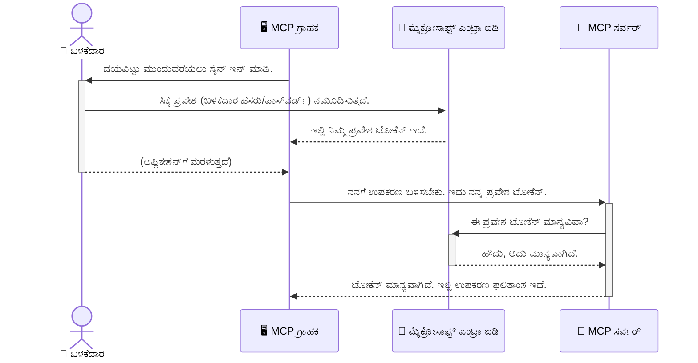

# ಎಐ ಕಾರ್ಯಪ್ರವಾಹಗಳ ಭದ್ರತೆ: ಮಾದರಿ ಕಾನ್ಟೆಕ್ಸ್ಟ್ ಪ್ರೋಟೋಕಾಲ್ ಸೆರ್ವರ್ಗಾಗಿ ಎಂಟ್ರಾ ID ಪ್ರಾಮಾಣಿಕರಣ

## ಪರಿಚಯ
ನಿಮ್ಮ ಮಾದರಿ ಕಾನ್ಟೆಕ್ಸ್ಟ್ ಪ್ರೋಟೋಕಾಲ್ (MCP) ಸೆರ್ವರ್ ಅನ್ನು ಭದ್ರಗೊಳಿಸುವುದು ನಿಮ್ಮ ಮನೆಯ ಮುಂಭಾಗದ ಬಾಗಿಲನ್ನು ಅಮರವಾಗಿ ಬಿಗಿದಿಟ್ಟುಕೊಳ್ಳುವುದನ್ನು ಸಮಾನವಾಗಿದೆ. ನಿಮ್ಮ MCP ಸೆರ್ವರ್ ತೆರಿದಿದ್ದರೆ, ನಿಮ್ಮ ಸಾಧನಗಳು ಮತ್ತು ಡೇಟಾ ಅನುಮತಿಯಿಲ್ಲದ ಪ್ರವೇಶಕ್ಕೆ ಒಳಗಾಗುತ್ತದೆ, ಇದು ಭದ್ರತೆ ಉಲ್ಲಂಘನೆಗಳಿಗೆ ಕಾರಣವಾಗಬಹುದು. ಮೈಕ್ರೋಸಾಫ್ಟ್ ಎಂಟ್ರಾ ID ಒಂದು ಬಲಿಷ್ಠ ಕ್ಲೌಡ್ ಆಧಾರಿತ ಗುರುತು ಮತ್ತು ಪ್ರವೇಶ ನಿರ್ವಹಣಾ ಪರಿಹಾರವನ್ನು ನೀಡುತ್ತದೆ, ಇದು ಕೇವಲ ಅನುಮತಿಸಿತ ಬಳಕೆದಾರರು ಮತ್ತು ಅಪ್ಲಿಕೇಶನ್‌ಗಳು ನಿಮ್ಮ MCP ಸೆರ್ವರ್‌ನಲ್ಲಿ ಸಂವಹನ ಮಾಡಬಹುದು ಎಂದು ಖಚಿತಪಡಿಸುತ್ತದೆ. ಈ ಭಾಗದಲ್ಲಿ, ಎಂಟ್ರಾ ID ಪ್ರಾಮಾಣಿಕರಣ ಬಳಸಿ ನಿಮ್ಮ ಎಐ ಕಾರ್ಯಪ್ರವಾಹಗಳನ್ನು ಹೇಗೆ ರಕ್ಷಿಸಲಾಗುತ್ತದೆ ಎಂದು ನೀವು ಕಲಿಯುತ್ತೀರಿ.

## ಅಧ್ಯಯನ ಗುರಿಗಳು
ಈ ಭಾಗದ ಕೊನೆಯಲ್ಲಿ, ನೀವು ಸಾಧ್ಯವಾಗಲಿದೆ:

- MCP ಸೆರ್ವರ್‌ಗಳನ್ನು ಭದ್ರಗೊಳಿಸುವ ಮಹತ್ವವನ್ನು ಅರ್ಥಮಾಡಿಕೊಳ್ಳುವುದು.
- ಮೈಕ್ರೋಸಾಫ್ಟ್ ಎಂಟ್ರಾ ID ಮತ್ತು OAuth 2.0 ಪ್ರಾಮಾಣಿಕರಣದ ಮೂಲಭೂತಗಳನ್ನು ವಿವರಿಸುವುದು.
- ಸಾರ್ವಜನಿಕ ಮತ್ತು ರಹಸ್ಯ ಗ್ರಾಹಕರ ನಡುವಿನ ವ್ಯತ್ಯಾಸವನ್ನು ಗುರುತಿಸುವುದು.
- ಸ್ಥಳೀಯ (ಸಾರ್ವಜನಿಕ ಗ್ರಾಹಕ) ಮತ್ತು ದೂರಸ್ಥ (ರಹಸ್ಯ ಗ್ರಾಹಕ) MCP ಸೆರ್ವರ್ ಸನ್ನಿವೇಶಗಳಲ್ಲಿ ಎಂಟ್ರಾ ID ಪ್ರಾಮಾಣಿಕರಣವನ್ನು ಅನುಷ್ಠಾನಗೊಳಿಸುವುದು.
- ಎಐ ಕಾರ್ಯಪ್ರವಾಹಗಳನ್ನು ಅಭಿವೃದ್ಧಿಪಡಿಸುವಾಗ ಭದ್ರತಾ ಉತ್ತಮ ಪದ್ಧತಿಗಳನ್ನು ಅನ್ವಯಿಸುವುದು.

## ಭದ್ರತೆ ಮತ್ತು MCP

ನೀವು ನಿಮ್ಮ ಮನೆಯ ಮುಂಭಾಗದ ಬಾಗಿಲನ್ನು ಬಿಗಿದು ಕೊಡುವಂತೆ, ನಿಮ್ಮ MCP ಸೆರ್ವರ್ ಅನ್ನು ಯಾರಿಗೂ ತೆರೆಯುವಂತೆ ಬಿಡಬಾರದು. ನಿಮ್ಮ ಎಐ ಕಾರ್ಯಪ್ರವಾಹಗಳನ್ನು ಭದ್ರಗೊಳಿಸುವುದು ಬಲಿಷ್ಠ, ವಿಶ್ವಾಸಾರ್ಹ ಹಾಗೂ ಸುರಕ್ಷಿತ ಅಪ್ಲಿಕೇಶನ್‌ಗಳನ್ನು ನಿರ್ಮಿಸಲು ಅಗತ್ಯ. ಈ ಅಧ್ಯಾಯವು ಮೈಕ್ರೋಸಾಫ್ಟ್ ಎಂಟ್ರಾ ID ಬಳಸಿ ನಿಮ್ಮ MCP ಸೆರ್ವರ್‌ಗಳನ್ನು ಭದ್ರಗೊಳಿಸುವುದನ್ನು ಪರಿಚಯಿಸುವುದಾದ್ದರಿಂದ, ಕೇವಲ ಅನುಮತಿಸಿತ ಬಳಕೆದಾರರು ಮತ್ತು ಅಪ್ಲಿಕೇಶನ್‌ಗಳು ನಿಮ್ಮ ಸಾಧನಗಳು ಮತ್ತು ಡೇಟಾಗಳೊಂದಿಗೆ ಸಂವಹನ ಮಾಡಬಹುದು.

## MCP ಸೆರ್ವರ್ಗಾಗಿ ಭದ್ರತೆ ಯಾಕೆ ಮುಖ್ಯ

ನಿಮ್ಮ MCP ಸೆರ್ವರ್‌ಗೆ ಒಂದು ಉಪಕರಣವಿದ್ದು ಅದು ಇಮೇಲ್ ಕಳುಹಿಸಬಹುದು ಅಥವಾ ಗ್ರಾಹಕ ಡೇಟಾಬೇಸ್‌ಗೆ ಪ್ರವೇಶ ಪಡೆಯಬಹುದು ಎಂದು ಭಾವಿಸಿ. ಭದ್ರತೆ ಇಲ್ಲದ ಸರ್ವರ್ ಎಂದರೆ ಯಾರು ಬೇಕಾದರೂ ಆ ಉಪಕರಣವನ್ನು ಬಳಸಬಹುದು, ಅದು ಅನುಮತಿಯಿಲ್ಲದ ಡೇಟಾ ಪ್ರವೇಶ, ಸ್ಪ್ಯಾಮ್ ಅಥವಾ ಇತರ ಅಪಾಯಕಾರಿ ಚಟುವಟಿಕೆಗಳಿಗೆ ಕಾರಣವಾಗಬಹುದು.

ಪ್ರಾಮಾಣಿಕರಣವನ್ನು ಅನುಷ್ಠಾನ ಮಾಡುವ ಮೂಲಕ, ನೀವು ಪ್ರತಿಯೊಂದು ವಿನಂತಿಯೂ ಪರಿಶೀಲನೆಗೆ ಒಳಪಟ್ಟಿರುತ್ತದೆ ಎಂದು ಖಚಿತಪಡಿಸುತ್ತೀರಿ, ವಿನಂತಿಯಲ್ಲಿರುವ ಬಳಕೆದಾರ ಅಥವಾ ಅಪ್ಲಿಕೇಶನ್ ಅವರ ಗುರುತನ್ನು ದೃಢಪಡಿಸುತ್ತದೆ. ಇದು ನಿಮ್ಮ ಎಐ ಕಾರ್ಯಪ್ರವಾಹಗಳನ್ನು ಭದ್ರಗೊಳಿಸುವ ಮೊದಲ ಮತ್ತು ಅತ್ಯಂತ ಮಹತ್ವದ ಹಂತವಾಗಿದೆ.

## ಮೈಕ್ರೋಸಾಫ್ಟ್ ಎಂಟ್ರಾ ID ಪರಿಚಯ

[**Microsoft Entra ID**](https://adoption.microsoft.com/microsoft-security/entra/) ಒಂದು ಕ್ಲೌಡ್ ಆಧಾರಿತ ಗುರುತಿನ ಮತ್ತು ಪ್ರವೇಶ ನಿರ್ವಹಣಾ ಸೇವೆಯಾಗಿದೆ. ನಿಮ್ಮ ಅಪ್ಲಿಕೇಶನ್‌ಗಳಿಗೆ ಸರ್ವಾವತಿಯಿಂದ ಭದ್ರತಾ ಗಾರ್ಡ್ ಎಂದು ಭಾವಿಸಿ. ಇದು ಬಳಕೆದಾರ ಗುರುತಿನ ಪರಿಶೀಲನೆ (ಪ್ರಾಮಾಣಿಕರಣ) ಮತ್ತು ಅವರಿಗೆ ಯಾವ ಕ್ರಮಗಳನ್ನು ಅನುಷ್ಠಾನಗೊಳಿಸಲು ಅನುಮತಿಸಲಾಗಿದೆ (ಅಧಿಕಾರ) ಎಂಬುದನ್ನು ನಿರ್ಧರಿಸುವ ಸಂಕೀರ್ಣ ಪ್ರಕ್ರಿಯೆಯನ್ನು ನಿರ್ವಹಿಸುತ್ತದೆ.

ಎಂಟ್ರಾ ID ಬಳಸಿ, ನೀವು:

- ಬಳಕೆದಾರರಿಗಾಗಿ ಸುರಕ್ಷಿತ ಲಾಗಿನ್ ಸಕ್ರಿಯಗೊಳಿಸಬಹುದು.
- API ಗಳು ಮತ್ತು ಸೇವೆಗಳನ್ನು ರಕ್ಷಿಸಬಹುದು.
- ಕೆಂದ್ರ ದೇಶದಿಂದ ಪ್ರವೇಶ ನೀತಿಗಳನ್ನು ನಿರ್ವಹಿಸಬಹುದು.

MCP ಸರ್ವರ್‌ಗಳಿಗಾಗಿ ಎಂಟ್ರಾ ID ನಿಮ್ಮ ಸರ್ವರ್ ಸಾಮರ್ಥ್ಯಗಳಿಗೆ ಯಾರು ಪ್ರವೇಶ ಹೊಂದಬಹುದು ಎಂಬುದನ್ನು ನಿರ್ವಹಿಸುವ ಬಲಿಷ್ಠ ಮತ್ತು ವಿಶ್ವಾಸಾರ್ಹ ಪರಿಹಾರವನ್ನು ನೀಡುತ್ತದೆ.

---

## ಅಡ್ಡಹಸು: ಎಂಟ್ರಾ ID ಪ್ರಾಮಾಣಿಕರಣ ಹೇಗೆ ಕೆಲಸ ಮಾಡುತ್ತದೆ

ಎಂಟ್ರಾ ID ಪ್ರಾಮಾಣಿಕರಣ ನಿರ್ವಹಿಸಲು **OAuth 2.0** ಎಂಬ open standards ಗಳನ್ನು ಬಳಸುತ್ತದೆ. ವಿವರಗಳು ಕೆಲವೊಮ್ಮೆ ಸಂಕೀರ್ಣವಾಗಿರಬಹುದು, ಆದರೆ ಮೂಲಧಾರಣ ಸಂಧರ್ಭವಾಗಿರುವ ಸಮಾನತೆ ಸರಳವಾಗಿದೆ.

### OAuth 2.0 ಗೆ ಸೊಬಗು ಪರಿಚಯ: ವ್ಲೆಟ್ ಕೀ

OAuth 2.0 ಅನ್ನು ನಿಮ್ಮ ಕಾರಿನ ವ್ಯಾಲೆಟ್ ಸೇವೆ ಎಂದು ಊಹಿಸಿ. ನೀವು ರೆಸ್ಟೋರೆಂಟ್‌ಗೆ ಬಂದಾಗ, ನೀವು ವ್ಯಾಲೆಟ್‌ಗೆ ನಿಮ್ಮ ಮಾಸ್ಟರ್ ಕೀ ಕೊಡುವುದಿಲ್ಲ. ಬದಲಿಗೆ, ನೀವು “ವ್ಯಾಲೆಟ್ ಕೀ” ಅನ್ನು ನೀಡುತ್ತೀರಿ. ಅದು ಸೀಮಿತ ಅನುಮತಿಗಳನ್ನು ಹೊಂದಿರುತ್ತದೆ — ಅದು ಕಾರನ್ನು ಚಾಲನೆ ಮಾಡಬಹುದು ಮತ್ತು ಬಾಗಿಲುಗಳನ್ನು ಹಾಕಬಹುದು, ಆದರೆ ಟ್ರಂಕ್ ಅಥವಾ ಗ್ಲೋವ್ ಕಂಪಾರ್ಟ್ಮೆಂಟ್ ತೆರೆಯಲು ಸಾಧ್ಯವಿಲ್ಲ.

ಈ ಸಮಾನತೆಗಳಲ್ಲಿ:

- **ನೀವು** ಆಗಿರುವುದು **ಬಳಕೆದಾರ** (User).
- **ನಿಮ್ಮ ಕಾರು** ಆಗಿರುವುದು ನಿಮ್ಮ **MCP ಸರ್ವರ್** ಜೊತೆಗೆ ಅದರ ಮಹತ್ತರ ಸಾಧನಗಳು ಮತ್ತು ಡೇಟಾ.
- **ವ್ಯಾಲೆಟ್** ಆಗಿರುವುದು **ಮೈಕ್ರೋಸಾಫ್ಟ್ ಎಂಟ್ರಾ ID**.
- **ಪಾರ್ಕಿಂಗ್ ಅಟೆಂಡೆಂಟ್** ಆಗಿರುವುದು **MCP క్లೈಂಟ್** (ಸರ್ವರ್ ಪ್ರವೇಶಿಸಲು ಪ್ರಯತ್ನಿಸುವ ಅಪ್ಲಿಕೇಶನ್).
- **ವ್ಯಾಲೆಟ್ ಕೀ** ಆಗಿರುವುದು **ಪ್ರವೇಶ ಟೋಕನ್**.

ಪ್ರವೇಶ ಟೋಕನ್ ಒಂದು ಸುರಕ್ಷಿತ ಟೆಕ್ಸ್ಟ್ ಸರಣಿಯಾಗಿದ್ದು, MCP ಕ್ಲೈಂಟ್ ನಿಮಗೆ ಸೈನ್ ಇನ್ ಮಾಡಿದ ನಂತರ ಎಂಟ್ರಾ ID ನಿಂದ ಪಡೆಯುತ್ತದೆ. ಬಳಿಕ, ಕ್ಲೈಂಟ್ ಈ ಟೋಕನ್ ಅನ್ನು MCP ಸರ್ವರ್‌ಗೆ ಪ್ರತಿಯೊಂದು ವಿನಂತಿಯಲ್ಲಿಯೂ ನೀಡುತ್ತದೆ. ಸರ್ವರ್ ಈ ಟೋಕನ್ ಪರಿಶೀಲಿಸಿ, ವಿನಂತಿ ಮಾನ್ಯವಾಗಿದೆಯೇ ಹಾಗು ಕ್ಲೈಂಟ್ ಅನುಮತಿಪಡಿಸಲಾಗಿದ್ದ ಕಾರ್ಯಗಳನ್ನು ಹೊಂದಿದೆಯೇ ಎಂದು ದೃಢಪಡಿಸಬಹುದು, ಇದು ನಿಮ್ಮ ನಿಜವಾದ ಖಾತೆ ವಿವರಗಳನ್ನು (ಹಾಗೆ ನಿಮ್ಮ ಪಾಸ್‌ವಡ್) ನಿಭಾಯಿಸುವ ಅಗತ್ಯವಿಲ್ಲದೆ.

### ಪ್ರಾಮಾಣಿಕರಣ ಕಾರ್ಯಪ್ರವಾಹ

ವಾಸ್ತವಿಕವಾಗಿ ಪ್ರಕ್ರಿಯೆ ಹೇಗೆ ನಡೆಯುತ್ತದೆ ನೋಡಿ:



### ಮೈಕ್ರೋಸಾಫ್ಟ್ ಪ್ರಾಮಾಣಿಕರಣ ಲೈಬ್ರರಿ (MSAL) ಪರಿಚಯ

ನಾವು ಕೋಡ್ ನೋಡಮಾಡುವ ಮೊದಲು, ಉದಾಹರಣೆಗಳಲ್ಲಿ ನೀವು ಕಾಣಬಹುದಾದ ಪ್ರಮುಖ ಘಟಕವನ್ನು ಪರಿಚಯಿಸುವುದು ಮುಖ್ಯ: **ಮೈಕ್ರೋಸಾಫ್ಟ್ ಪ್ರಾಮಾಣಿಕರಣ ಲೈಬ್ರರಿ (MSAL)**.

MSAL ಮೈಕ್ರೋಸಾಫ್ಟ್ ಅಭಿವೃದ್ಧಿಪಡಿಸಿದ ಲೈಬ್ರರಿ ಆಗಿದ್ದು, ಇದು ಅಭಿವೃದ್ದಿಕಾರರಿಗೆ ಪ್ರಾಮಾಣಿಕರಣ ನಿಭಾಯಿಸುವುದನ್ನು ತುಂಬಾ ಸುಲಭ ಮಾಡುತ್ತದೆ. ನೀವು ನಿಮ್ಮ ಅಪ್ಲಿಕೇಶನ್‌ಗೆ ಭದ್ರತೆಯ ಟೋಕನ್ಗಳನ್ನು ನಿರ್ವಹಿಸುವ, ಲಾಗಿನ್ ವ್ಯವಸ್ಥೆಯನ್ನು ಮತ್ತು ಸೆಷನ್‌ಗಳನ್ನು ರಿಫ್ರೆಶ್ ಮಾಡುವ ಸಂಕೀರ್ಣ ಕೋಡ್ ಬರೆಯಬೇಕಾಗಿಲ್ಲ.

MSAL ಲೈಬ್ರರಿಯನ್ನು ಬಳಸುವ ಉದ್ದೇಶಗಳು:

- **ಸುರಕ್ಷಿತವಾಗಿದೆ:** ದಶಕಗಳ ಪ್ರಾಂಪ್ಟ ಹಾಗೂ ಸುರಕ್ಷತಾ ಉತ್ತಮ ಪದ್ಧತಿಗಳನ್ನು ಅನುಷ್ಠಾನಗೊಳಿಸುವ ಮೂಲಕ ನಿಮ್ಮ ಕೋಡ್‌ನಲ್ಲಿ ದುರ್ಬಲತೆಗಳ ಅಪಾಯ ಕಡಿಮೆಗೆಡುತ್ತದೆ.
- **ಅಭಿವೃದ್ಧಿಯನ್ನು ಸರಳಗೊಳಿಸುತ್ತದೆ:** OAuth 2.0 ಮತ್ತು OpenID Connect ಪ್ರೋಟೋಕಾಲ್ ನ ಸಂಕೀರ್ಣತೆಗೆ ಮುಂಜಾನೆ ಅಡ್ಡರಿಯದಂತೆ, ಕೆಲವು ಸಾಲುಗಳಲ್ಲಿ ಬಲಿಷ್ಠ ಪ್ರಾಮಾಣಿಕರಣವು ನಿಮ್ಮ ಅಪ್ಲಿಕೇಶನ್‌ಗೆ ಸೇರ್ಪಡೆ ಮಾಡಲು ಅನುಮತಿಸುತ್ತದೆ.
- **ಪೋಷಣೆಯ ಮುಂದೆ ಇದೆ:** ಮೈಕ್ರೋಸಾಫ್ಟ್ ನಿಯಮಿತವಾಗಿ MSAL ಅನ್ನು ಅಪ್ಡೇಟ್ ಮಾಡಿ ಹೊಸ ಭದ್ರತಾ ತಂತ್ರಗಳು ಮತ್ತು ಪ್ಲಾಟ್‌ಫಾರ್ಮ್ ಬದಲಾವಣೆಗಳನ್ನು ಹೊಂದಿಕೊಳ್ಳುತ್ತದೆ.

MSAL .NET, ಜಾವಾಸ್ಕ್ರಿಪ್ಟ್/ಟೈಪ್‌ಸ್ಕ್ರಿಪ್ಟ್,python, ಜಾವಾ, ಗೋ, ಹಾಗೂ ಮೊಬೈಲ್ ಪ್ಲಾಟ್‌ಫಾರ್ಮ್‌ಗಳು (iOS ಮತ್ತು ಆಂಡ್ರಾಯ್ಡ್) ಸೇರಿದಂತೆ ಹಲವಾರು ಭಾಷೆ ಮತ್ತು ಆ್ಯಪ್‌ಫ್ರೇಮ್ವರ್ಕ್‌ಗಳನ್ನು ಬೆಂಬಲಿಸುತ್ತದೆ. ಇದರಿಂದ ನಿಮ್ಮ ಸಾಂದರ್ಭಿಕ ತಂತ್ರಜ್ಞಾನ ಸಂಪುಟದಲ್ಲಿ ಏಕಾಂತರ ಪ್ರಾಮಾಣಿಕರಣ ಮಾದರಿಗಳನ್ನು ಬಳಸಬಹುದು.

MSAL ಬಗ್ಗೆ ಹೆಚ್ಚಿನ ಮಾಹಿತಿಗಾಗಿ ಅಧಿಕೃತ [MSAL ಅವಲೋಕನ ಡಾಕ್ಯುಮೆಂಟೇಶನ್](https://learn.microsoft.com/entra/identity-platform/msal-overview) ನೋಡಿ.

---

## ಎಂಟ್ರಾ ID ಬಳಸಿ ನಿಮ್ಮ MCP ಸರ್ವರ್ ಭದ್ರತೆ: ಹಂತ ಹಂತದ ಮಾರ್ಗದರ್ಶಿ

ಈಗ, ನಾವು ಸ್ಥಳೀಯ MCP ಸರ್ವರ್ (stdio ಮೂಲಕ ಸಂವಹನ ಮಾಡುವ) ಅನ್ನು ಎಂಟ್ರಾ ID ಬಳಸಿ ಹೇಗೆ ಭದ್ರಗೊಳಿಸುವುದನ್ನು ನೋಡೋಣ. ಈ ಉದಾಹರಣೆ ಒಂದು **ಸಾರ್ವಜನಿಕ ಗ್ರಾಹಕ** ಬಳಕೆ ಮಾಡುತ್ತದೆ, ಇದು ಬಳಕೆದಾರರ ಯಂತ್ರದಲ್ಲಿ ನಡೆಯುವ ಅಪ್ಲಿಕೇಶನ್‌ಗಳಿಗೆ ಸೂಕ್ತ, ಉದಾ: ಡೆಸ್ಕ್‌ಟಾಪ್ ಅಪ್ಲಿಕೇಶನ್ ಅಥವಾ ಸ್ಥಳೀಯ ಅಭಿವೃದ್ಧಿ ಸರ್ವರ್.

### ಸನ್ನಿವೇಶ 1: ಸ್ಥಳೀಯ MCP ಸರ್ವರ್ ಭದ್ರತೆ (ಸಾರ್ವಜನಿಕ ಗ್ರಾಹಕದೊಂದಿಗೆ)

ಈ ಸನ್ನಿವೇಶದಲ್ಲಿ, ನಾವು ಸ್ಥಳೀಯವಾಗಿ ನಡೆಯುವ, stdio ಮೂಲಕ ಸಂವಹನ ಮಾಡುವ MCP ಸರ್ವರ್ ಅನ್ನು ನೋಡುತ್ತೇವೆ. ಇದು ಬಳಕೆದಾರನ ಮೊದಲನೆ ಪ್ರವೇಶಕ್ಕೂ ಮುಂಚೆ ಎಂಟ್ರಾ ID ಮೂಲಕ ಪ್ರಾಮಾಣಿಕರಣ ಮಾಡಲು ಉಪಕರಣಗಳನ್ನು ಬಳಸುತ್ತದೆ. ಸರ್ವರ್‌ ಒಂದೇ ಉಪಕರಣವು ಮೈಕ್ರೋಸಾಫ್ಟ್ ಗ್ರಾಫ್ API ಇಂದ ಬಳಕೆದಾರನ ಪ್ರೊಫೈಲ್ ಮಾಹಿತಿಯನ್ನು ಪಡೆಯುತ್ತದೆ.

#### 1. ಎಂಟ್ರಾ ID ನಲ್ಲಿ ಅಪ್ಲಿಕೇಶನ್ ಸೆಟ್ ಅಪ್ ಮಾಡುವುದು

ಯಾವುದೇ ಕೋಡ್ ಬರೆಯುವುದಕ್ಕೂ ಮೊದಲು, ನಿಮ್ಮ ಅಪ್ಲಿಕೇಶನ್ ಅನ್ನು ಮೈಕ್ರೋಸಾಫ್ಟ್ ಎಂಟ್ರಾ ID ನಲ್ಲಿ ನೋಂದಾಯಿಸಬೇಕಾಗುತ್ತದೆ. ಇದರಿಂದ ಎಂಟ್ರಾ ID ನಿಮ್ಮ ಅಪ್ಲಿಕೇಶನ್ ಬಗ್ಗೆ ತಿಳಿದುಕೊಳ್ಳಿ ಮತ್ತು ಪ್ರಾಮಾಣಿಕರಣ ಸೇವೆಯನ್ನು ಬಳಸಲು ಅನುಮತಿ ನೀಡುತ್ತದೆ.

1. **[Microsoft Entra portal](https://entra.microsoft.com/)** ಗೆ ಹೋಗಿ.
2. **App registrations** ಗೆ ಹೋಗಿ ಮತ್ತು **New registration** ಕ್ಲಿಕ್ ಮಾಡಿ.
3. ನಿಮ್ಮ ಅಪ್ಲಿಕೇಶನಿಗೆ ಹೆಸರು ನೀಡಿ (ಉದಾ. "My Local MCP Server").
4. **Supported account types** ನಲ್ಲಿ **Accounts in this organizational directory only** ಆಯ್ಕೆಮಾಡಿ.
5. ಈ ಉದಾಹರಣೆಗೆ **Redirect URI** ಖಾಲಿಯಾಗಿರಬಹುದು.
6. **Register** ಕ್ಲಿಕ್ ಮಾಡಿ.

ನೋಂದಾಯಿಸಿದ ನಂತರ, ನಿಮ್ಮ **Application (client) ID** ಮತ್ತು **Directory (tenant) ID** ನೆನಪಿಡಿ. ನೀವು ಅವನ್ನು ನಿಮ್ಮ ಕೋಡ್‌ನಲ್ಲಿ ಬಳಸಬೇಕಾಗುತ್ತದೆ.

#### 2. ಕೋಡ್: ವಿಭಜನೆ

ಪ್ರಾಮಾಣಿಕರಣವನ್ನು ನಿಭಾಯಿಸುವ ಪ್ರಮುಖ ಭಾಗಗಳನ್ನು ನೋಡಿಯಿರಿ. ಈ ಉದಾಹರಣೆಯ ಸಂಪೂರ್ಣ ಕೋಡ್ ಅನ್ನು [Entra ID - Local - WAM](https://github.com/Azure-Samples/mcp-auth-servers/tree/main/src/entra-id-local-wam) ಫೋಲ್ಡರ್‌ನಲ್ಲಿ [mcp-auth-servers GitHub ರಿಪೊ](https://github.com/Azure-Samples/mcp-auth-servers) ನಲ್ಲಿ ಕಂಡುಹಿಡಿಯಬಹುದು.

**`AuthenticationService.cs`**

ಈ ತರಗತಿ ಎಂಟ್ರಾ ID ಜೊತೆ ಸಂವಹನದ ಜವಾಬ್ದಾರಿಯನ್ನು ಹೊರುತ್ತದೆ.

- **`CreateAsync`**: ಈ ವಿಧಾನವು MSAL (ಮೈಕ್ರೋಸಾಫ್ಟ್ ಪ್ರಾಮಾಣಿಕರಣ ಲೈಬ್ರರಿ) ನಿಂದ `PublicClientApplication` ನ್ನು ಪ್ರಾರಂಭಿಸುತ್ತದೆ. ಇದು ನಿಮ್ಮ ಅಪ್ಲಿಕೇಶನ್ ನ `clientId` ಮತ್ತು `tenantId` ಬಳಸಿ ಕಾನ್ಫಿಗರ್ ಮಾಡಲಾಗಿದೆ.  
- **`WithBroker`**: ಬ್ರೋಕರನ್ನು (ವಿಂಡೋಸ್ ವೆಬ್ ಅಕೌಂಟ್ ಮ್ಯಾನೇಜರ್ ಲాంటి) ಬಳಕೆಗೆ ಅನುಮತಿಸುತ್ತದೆ, ಇದು ಭದ್ರತೆಯೊಂದಿಗೆ ಸುಗಮವಾದ ಸಿಂಗಲ್ ಸೈನ್-ಆನ್ ಅನುಭವ ನೀಡುತ್ತದೆ.  
- **`AcquireTokenAsync`**: ಇದು ಕೇಂದ್ರ ವಿಧಾನ. ಮೊದಲು, ಇದು ಟೋಕನನ್ನು ನಿಶ್ಶಬ್ದವಾಗಿ ಪಡೆಯಲು ಪ್ರಯತ್ನಿಸುತ್ತದೆ (ಅಂದರೆ ಬಳಕೆದಾರ ಲಾಗಿನ್ ಆಗಿದ್ದರೆ ಮುನ್ನುಡಿಸುವ ಅಗತ್ಯವಿಲ್ಲ). ನಿಶ್ಶಬ್ದ ಟೋಕನ ದೊರಕದಿದ್ದರೆ, ಇದು ಬಳಕೆದಾರನಿಂದ ಸಂಪರ್ಕಕ್ಕಾಗಿ ಪುಸ್ತಕ ನೀಡುತ್ತದೆ.

```csharp
// Simplified for clarity
public static async Task<AuthenticationService> CreateAsync(ILogger<AuthenticationService> logger)
{
    var msalClient = PublicClientApplicationBuilder
        .Create(_clientId) // Your Application (client) ID
        .WithAuthority(AadAuthorityAudience.AzureAdMyOrg)
        .WithTenantId(_tenantId) // Your Directory (tenant) ID
        .WithBroker(new BrokerOptions(BrokerOptions.OperatingSystems.Windows))
        .Build();

    // ... cache registration ...

    return new AuthenticationService(logger, msalClient);
}

public async Task<string> AcquireTokenAsync()
{
    try
    {
        // Try silent authentication first
        var accounts = await _msalClient.GetAccountsAsync();
        var account = accounts.FirstOrDefault();

        AuthenticationResult? result = null;

        if (account != null)
        {
            result = await _msalClient.AcquireTokenSilent(_scopes, account).ExecuteAsync();
        }
        else
        {
            // If no account, or silent fails, go interactive
            result = await _msalClient.AcquireTokenInteractive(_scopes).ExecuteAsync();
        }

        return result.AccessToken;
    }
    catch (Exception ex)
    {
        _logger.LogError(ex, "An error occurred while acquiring the token.");
        throw; // Optionally rethrow the exception for higher-level handling
    }
}
```

**`Program.cs`**

ಇಲ್ಲಿ MCP ಸರ್ವರ್ ಅನ್ನು ಸಜ್ಜುಗೊಳಿಸಲಾಗಿದ್ದು ಮತ್ತು ಪ್ರಾಮಾಣಿಕರಣ ಸೇವೆಯನ್ನು ಏರಿಸಲಾಗಿದೆ.

- **`AddSingleton<AuthenticationService>`**: ಇದು `AuthenticationService` ನ್ನು ಡಿಪೆಂಡೆನ್ಸಿ ಇಂಜೆಕ್ಷನ್ ಕಂಟೇನರ್‌ನಲ್ಲಿ ನೋಂದಾಯಿಸುತ್ತದೆ, ಇತರ ವಿಭಾಗಗಳು (ಉದಾ: ನಮ್ಮ ಉಪಕರಣ) ಬಳಕೆ ಮಾಡಬಹುದು.
- **`GetUserDetailsFromGraph` ಉಪಕರಣ**: ಈ ಉಪಕರಣಕ್ಕೆ `AuthenticationService` ನ ಒಂದು ಉದಾಹರಣಿಯ ಅಗತ್ಯವಿದೆ. ಇದು ಕಾರ್ಯನಿರ್ವಹಿಸುವ ಮೊದಲು `authService.AcquireTokenAsync()` ಕರೆ ಮಾಡುತ್ತದೆ ಸರಿಯಾದ ಪ್ರವೇಶ ಟೋಕನ್ಗೆ. ಪ್ರಾಮಾಣಿಕರಣ ಯಶಸ್ವಿಯಾದರೆ, ಟೋಕನ್ ಬಳಸಿ ಮೈಕ್ರೋಸಾಫ್ಟ್ ಗ್ರಾಫ್ API ಕರೆದೊಯ್ದು ಬಳಕೆದಾರ ವಿವರಗಳನ್ನು ಪಡೆಯುತ್ತದೆ.

```csharp
// Simplified for clarity
[McpServerTool(Name = "GetUserDetailsFromGraph")]
public static async Task<string> GetUserDetailsFromGraph(
    AuthenticationService authService)
{
    try
    {
        // This will trigger the authentication flow
        var accessToken = await authService.AcquireTokenAsync();

        // Use the token to create a GraphServiceClient
        var graphClient = new GraphServiceClient(
            new BaseBearerTokenAuthenticationProvider(new TokenProvider(authService)));

        var user = await graphClient.Me.GetAsync();

        return System.Text.Json.JsonSerializer.Serialize(user);
    }
    catch (Exception ex)
    {
        return $"Error: {ex.Message}";
    }
}
```

#### 3. ಎಲ್ಲವು ಹೇಗೆ ಸೇರಿಕೊಂಡು ಕೆಲಸ ಮಾಡುತ್ತದೆ

1. MCP ಕ್ಲೈಂಟ್ `GetUserDetailsFromGraph` ಉಪಕರಣ ಬಳಸಲು ಪ್ರಯತ್ನಿಸುವಾಗ, ಉಪಕರಣ ಮೊದಲಿಗೆ `AcquireTokenAsync` ಅನ್ನು ಕರೆ ಮಾಡುತ್ತದೆ.
2. `AcquireTokenAsync` MSAL ಲೈಬ್ರರಿಯನ್ನು ಸರಿಯಾದ ಟೋಕನಿಗಾಗಿ ತಪಾಸಣೆ ಮಾಡಲು ಪ್ರೇರೇಪಿಸುತ್ತದೆ.
3. ಟೋಕನ ಕಂಡುಬಂದಿಲ್ಲದಿದ್ದರೆ, MSAL ಬ್ರೋಕರ ಮೂಲಕ ಬಳಕೆದಾರನಿಗೆ ಎಂಟ್ರಾ ID ಖಾತೆಯಿಂದ ಲಾಗಿನ್ ಮಾಡಲು ಸೂಚಿಸುತ್ತದೆ.
4. ಬಳಕೆದಾರ ಲಾಗಿನ್ ಮಾಡಿದ ಬಳಿಕ, ಎಂಟ್ರಾ ID ಪ್ರವೇಶ ಟೋಕನ್ ಬಿಡುಗಡೆ ಮಾಡುತ್ತದೆ.
5. ಉಪಕರಣ ಟೋಕನ ಪಡೆಯುತ್ತದೆ ಮತ್ತು ಅದನ್ನು ಬಳಸಿ Microsoft Graph API ಗೆ ಸುರಕ್ಷಿತ ಕರೆ ಮಾಡುತ್ತದೆ.
6. ಬಳಕೆದಾರ ವಿವರಗಳು MCP ಕ್ಲೈಂಟಿಗೆ ಹಿಂತಿರುಗಿಸಲಾಗುತ್ತದೆ.

ಈ ಪ್ರಕ್ರಿಯೆ ಭದ್ರತೆಯಾದ ಬಳಕೆದಾರರಷ್ಟೇ ಉಪಕರಣವನ್ನು ಬಳಸಲು ಸಾಧ್ಯವಿದೆ ಎಂಬುದನ್ನು ಖಚಿತಪಡಿಸುತ್ತದೆ, ಪರಿಣಾಮವಾಗಿ ನಿಮ್ಮ ಸ್ಥಳೀಯ MCP ಸರ್ವರ್ ಭದ್ರವಾಗಿರುತ್ತದೆ.

### ಸನ್ನಿವೇಶ 2: ದೂರಸ್ಥ MCP ಸರ್ವರ್ ಭದ್ರತೆ (ರಹಸ್ಯ ಗ್ರಾಹಕದೊಂದಿಗೆ)

ನಿಮ್ಮ MCP ಸರ್ವರ್ ದೂರದ ಗಣಕದಲ್ಲಿ (ಉದಾ. ಕ್ಲೌಡ್ ಸರ್ವರ್) ಕಾರ್ಯನಿರ್ವಹಿಸುತ್ತಿದ್ದರೆ ಮತ್ತು HTTP ಸ್ಟ್ರೀಮಿಂಗ್ ಹಾಗು ಇತರ ಪ್ರೋಟೋಕಾಲ್‌ಗಳ ಮೂಲಕ ಸಂವಹನ ಮಾಡುತ್ತಿದ್ದರೆ, ಭದ್ರತೆ ಅಗತ್ಯ ಬೇರೆ ಆಗಿರುತ್ತದೆ. ಈ ಸಂದರ್ಭದಲ್ಲಿ ನೀವು **ರಹಸ್ಯ ಗ್ರಾಹಕ** ಮತ್ತು **Authorization Code Flow** ಬಳಸಬೇಕು. ಇದು ಹೆಚ್ಚು ಭದ್ರತೆಯ ವಿಧಾನ ಏಕೆಂದರೆ ಅಪ್ಲಿಕೇಶನ್ ರಹಸ್ಯಗಳನ್ನು ಬ್ರೌಸರ್‌ಗೆ ಬಹಿರಂಗಪಡಿಸುವುದಿಲ್ಲ.

ಈ ಉದಾಹರಣೆಯು TypeScript ಆಧಾರಿತ MCP ಸರ್ವರ್ ಅನ್ನು ಬಳಸುತ್ತದೆ ಮತ್ತು Express.js ಮೂಲಕ HTTP ವಿನಂತಿಗಳನ್ನು ನಿರ್ವಹಿಸುತ್ತದೆ.

#### 1. ಎಂಟ್ರಾ ID ನಲ್ಲಿ ಅಪ್ಲಿಕೇಶನ್ ಸೆಟ್ ಅಪ್ ಮಾಡುವುದು

ಎಂಟ್ರಾ ID ನಲ್ಲಿ ಸೆಟ್ ಅಪ್ ಸ್ಥಳೀಯ ಸಾರ್ವಜನಿಕ ಗ್ರಾಹಕದಂತೆ ತಾನೆ, ಆದರೆ ನಿಮ್ಮನ್ನು ಕಲಿಯಬೇಕಿರುವ ಪ್ರಮುಖ ವ್ಯತ್ಯಾಸವೇನೆಂದರೆ: **ಕ್ಲೈಂಟ್ ಸೀಕ್ರೆಟ್** ರಚಿಸಬೇಕಾಗಿದೆ.

1. **[Microsoft Entra portal](https://entra.microsoft.com/)** ಗೆ ಹೋಗಿ.
2. ನಿಮ್ಮ ಅಪ್ಲಿಕೇಶನ್ ನೋಂದಾಯಣದಲ್ಲಿಗೆ ಹೋಗಿ, **Certificates & secrets** ಟ್ಯಾಬ್ಗೆ ತಲುಪಿರಿ.
3. **New client secret** ಕ್ಲಿಕ್ ಮಾಡಿ, ವಿವರಣೆ ನೀಡಿ ಮತ್ತು **Add** ಕ್ಲಿಕ್ ಮಾಡಿ.
4. **ಪ್ರಮುಖ:** ಸೀಕ್ರೆಟ್ ಮೌಲ್ಯವನ್ನು ತಕ್ಷಣ प्रति ನಕಲು ಮಾಡಿ. ಮುಂದಿನ ಸಾರಿ ಇದನ್ನು ನೋಡಲು ಸಾಧ್ಯವಿಲ್ಲ.
5. **Redirect URI** ಕೂಡ ಕಾನ್ಫಿಗರ್ ಮಾಡಬೇಕು. **Authentication** ಟ್ಯಾಬ್ ಗೆ ಹೋಗಿ, **Add a platform** ಕ್ಲಿಕ್ ಮಾಡಿ, **Web** ಆಯ್ಕೆ ಮಾಡಿ, ಮತ್ತು ನಿಮ್ಮ ಅಪ್ಲಿಕೇಶನ್ Redirect URI‌ಗೆ (ಉದಾ. `http://localhost:3001/auth/callback`) ಹಿನ್ನೆಲೆ ನೀಡಿ.

> **⚠️ ಪ್ರಮುಖ ಭದ್ರತಾ ಟಿಪ್ಪಣಿ:** ಉತ್ಪಾದನಾ ಅಪ್ಲಿಕೇಶನ್ಗಳಿಗಾಗಿ, ಮೈಕ್ರೋಸಾಫ್ಟ್ **ಕ್ಲೈಂಟ್ ಸೀಕ್ರೆಟ್‌ಗಳ ಬದಲಿಗೆ** **Managed Identity** ಅಥವಾ **Workload Identity Federation** ಮುಂತಾದ **ಸೀಕ್ರೆಟ್ ರಹಿತ ಪ್ರಾಮಾಣಿಕರಣ** ವಿಧಾನಗಳನ್ನು ಶಿಫಾರಸು ಮಾಡುತ್ತದೆ. ಕ್ಲೈಂಟ್ ಸೀಕ್ರೆಟ್‌ಗಳು ಬಹಿರಂಗವಾಗಿ ಬಿದ್ದರೆ ಅಥವಾ ಹಾಳಾಗಬಹುದು ಎಂದರೆ ಭದ್ರತೆಯ ಅಪಾಯ ಉಂಟಾಗುತ್ತದೆ. ಮ್ಯಾನೆಜ್ಡ್ ಐಡೆಂಟಿಟಿಗಳು ನಿಮ್ಮ ಕೋಡ್ ಅಥವಾ ಸಂರಚನೆಯಲ್ಲಿ ಗುಪ್ತ ಮಾಹಿತಿ ಸಂಗ್ರಹಿಸುವ ಅಗತ್ಯಗಳನ್ನು ನಿಗ್ರಹಿಸುವುದರಿಂದ ಹೆಚ್ಚು ಸುರಕ್ಷಿತ ವಿಧಾನ ನೀಡುತ್ತವೆ.  
>  
> ಹೆಚ್ಚಿನ ಮಾಹಿತಿಗಾಗಿ [Managed identities for Azure resources overview](https://learn.microsoft.com/entra/identity/managed-identities-azure-resources/overview) ನೋಡಿ.

#### 2. ಕೋಡ್: ವಿಭಜನೆ

ಈ ಉದಾಹರಣೆ ಸೆಷನ್ ಆಧಾರಿತ ವಿಧಾನವನ್ನು ಬಳಸುತ್ತದೆ. ಬಳಕೆದಾರನು ಪ್ರಾಮಾಣಿಕರಿಸಿದಾಗ, ಸರ್ವರ್ ಪ್ರವೇಶ ಟೋಕನ್ ಮತ್ತು ರಿಫ್ರೆಶ್ ಟೋಕನ್ ಅನ್ನು ಸೆಷನ್‌ನಲ್ಲಿ ಸಂಗ್ರಹಿಸೋದು ಮತ್ತು ಬಳಕೆದಾರನಿಗೆ ಸೆಷನ್ ಟೋಕನ್ ನೀಡುತ್ತದೆ. ಬಳಿಕ ಈ ಸೆಷನ್ ಟೋಕನ್ ಅನ್ನು ಮುಂದಿನ ವಿನಂತಿಗಳಿಗಾಗಿ ಬಳಸಲಾಗುತ್ತದೆ. ಈ ಉದಾಹರಣೆಯ ಸಂಪೂರ್ಣ ಕೋಡ್ [Entra ID - Confidential client](https://github.com/Azure-Samples/mcp-auth-servers/tree/main/src/entra-id-cca-session) ಫೋಲ್ಡರ್‌ನಲ್ಲಿ [mcp-auth-servers GitHub ರಿಪೊ](https://github.com/Azure-Samples/mcp-auth-servers)ದಲ್ಲಿ ಲಭ್ಯವಿದೆ.

**`Server.ts`**

ಈ ֆೈಲ್ Express ಸರ್ವರ್ ಮತ್ತು MCP ಸಾರಿಗೆ ಪದರವನ್ನು ಸಜ್ಜುಗೊಳಿಸುತ್ತದೆ.

- **`requireBearerAuth`**: ಇದು ಮಧ್ಯವರ್ತಿ ಮಿಡಲ್‌ವೇರ್ ಆಗಿದ್ದು `/sse` ಮತ್ತು `/message` ಎಂಡ್ಪಾಯಿಂಟ್‌ಗಳನ್ನು ರಕ್ಷಿಸುತ್ತದೆ. ಈ ಮಿಡಲ್‌ವೇರ್ ವಿನಂತಿಯ `Authorization` ಹೆಡರ್‌ನಲ್ಲಿ ವಾಹಕ ಟೋಕನ್ (Bearer Token) ಯೋಗ್ಯತೆ ಪರಿಶೀಲಿಸುತ್ತದೆ.
- **`EntraIdServerAuthProvider`**: ಇದು ಕಸ್ಟಮ್ ಕ್ಲಾಸ್ ಆಗಿದ್ದು `McpServerAuthorizationProvider` ಇಂಟರ್ಫೇಸ್ ಅನುಷ್ಠಾನಗೊಳಿಸುತ್ತದೆ. ಇದು OAuth 2.0 ಕಾರ್ಯಪ್ರವಾಹವನ್ನು ನಿಭಾಯಿಸುವ ಜವಾಬ್ದಾರಿ ಹೊಂದಿದೆ.
- **`/auth/callback`**: ಬಳಕೆದಾರ ಪ್ರಾಮಾಣಿಕರಣ ಮಾಡಿದ ನಂತರ ಎಂಟ್ರಾ ID ನಿಂದ Redirect ಆಗುವ ಎಂಡ್ಪಾಯಿಂಟ್. ಇದು ಅನುಮತಿ ಕೋಡ್ ಅನ್ನು ಪ್ರವೇಶ ಟೋಕನ್ ಮತ್ತು ರಿಫ್ರೆಶ್ ಟೋಕನ್‌ಗೆ ವಿನಿಮಯ ಮಾಡಿಕೊಳ್ಳುತ್ತದೆ.

```typescript
// ಪರಿಶುದ್ಧತೆಯಗಾಗಿ ಸರಳೀಕರಿಸಲಾಗಿದೆ
const app = express();
const { server } = createServer();
const provider = new EntraIdServerAuthProvider();

// SSE ಅಂತಿಮ ಬಿಂದುವನ್ನು ರಕ್ಷಿಸಿ
app.get("/sse", requireBearerAuth({
  provider,
  requiredScopes: ["User.Read"]
}), async (req, res) => {
  // ... ಸಾರಿಗೆಗೆ ಸಂಪರ್ಕಿಸಿ ...
});

// ಸಂದೇಶ ಅಂತಿಮ ಬಿಂದುವನ್ನು ರಕ್ಷಿಸಿ
app.post("/message", requireBearerAuth({
  provider,
  requiredScopes: ["User.Read"]
}), async (req, res) => {
  // ... ಸಂದೇಶವನ್ನು ಹ್ಯಾಂಡಲ್ ಮಾಡಿ ...
});

// OAuth 2.0 ಕಾಲ್ಬ್ಯಾಕ್ ಅನ್ನು ಹ್ಯಾಂಡಲ್ ಮಾಡಿ
app.get("/auth/callback", (req, res) => {
  provider.handleCallback(req.query.code, req.query.state)
    .then(result => {
      // ... ಯಶಸ್ಸು ಅಥವಾ ವಿಫಲತೆಯನ್ನು ಹ್ಯಾಂಡಲ್ ಮಾಡಿ ...
    });
});
```

**`Tools.ts`**

ಈ ಫೈಲ್ MCP ಸರ್ವರ್ ಒದಗಿಸುವ ಉಪಕರಣಗಳನ್ನು ವ್ಯಾಖ್ಯಾನಿಸುತ್ತದೆ. `getUserDetails` ಉಪಕರಣ ಹೀಗೆಯೇ, ಆದರೆ ಇದು ಸೆಷನ್‌ನಿಂದ ಪ್ರವೇಶ ಟೋಕನನ್ನು ಪಡೆಯುತ್ತದೆ.

```typescript
// ಸ್ಪಷ್ಟತೆಗಾಗಿ ಸರಳೀಕರಿಸಲಾಗಿದೆ
server.setRequestHandler(CallToolRequestSchema, async (request) => {
  const { name } = request.params;
  const context = request.params?.context as { token?: string } | undefined;
  const sessionToken = context?.token;

  if (name === ToolName.GET_USER_DETAILS) {
    if (!sessionToken) {
      throw new AuthenticationError("Authentication token is missing or invalid. Ensure the token is provided in the request context.");
    }

    // ಸೆಷನ್ ಸ್ಟೋರ್‌ನಿಂದ ಎಂಟ್ರಾ ಐಡಿ ಟೋಕನ್ ಪಡೆಯಿರಿ
    const tokenData = tokenStore.getToken(sessionToken);
    const entraIdToken = tokenData.accessToken;

    const graphClient = Client.init({
      authProvider: (done) => {
        done(null, entraIdToken);
      }
    });

    const user = await graphClient.api('/me').get();

    // ... ಬಳಕೆದಾರ ವಿವರಗಳನ್ನು ಹಿಂತಿರುಗಿಸಿ ...
  }
});
```

**`auth/EntraIdServerAuthProvider.ts`**

ಈ ತರಗತಿ ಕೆಳಗಿನ ಕೆಲಸಗಳನ್ನು ನಿಭಾಯಿಸುತ್ತದೆ:

- ಬಳಕೆದಾರನನ್ನು ಎಂಟ್ರಾ ID ಲಾಗಿನ್ ಪುಟಕ್ಕೆ ಮಾರ್ಗದರ್ಶನ ಮಾಡುವುದು.
- ಅನುಮತಿ ಕೋಡ್ ಅನ್ನು ಪ್ರವೇಶ ಟೋಕನ್ ಗೆ ವಿನಿಮಯ ಮಾಡಿಕೊಳ್ಳುವುದು.
- ಟೋಕನ್‌ಗಳನ್ನು `tokenStore` ನಲ್ಲಿ ಸರಿಯದೇ ಸಂಗ್ರಹಿಸುವುದು.
- ಪ್ರವೇಶ ಟೋಕನ್ ಅವಧಿ ಮುಗಿದಾಗ ಅದನ್ನು ರಿಫ್ರೆಶ್ ಮಾಡುವುದು.

#### 3. ಎಲ್ಲವು ಹೇಗೆ ಸೇರಿಕೊಂಡು ಕೆಲಸ ಮಾಡುತ್ತದೆ

1. ಬಳಕೆದಾರ ಮೊದಲ ಸಲ MCP ಸರ್ವರ್ ಗೆ ಸಂಪರ್ಕಿಸಲು ಪ್ರಯತ್ನಿಸುವಾಗ, `requireBearerAuth` ಮಿಡ್ಲ್‌ವೇರ್ ಅವರಿಗೆ ಮಾನ್ಯ ಸೆಷನ್ ಇಲ್ಲ ಎಂದು ಕಂಡುಬಂದರೆ ಅವರನ್ನು ಎಂಟ್ರಾ ID ಲಾಗಿನ್ ಪುಟಕ್ಕೆ ಮಾರ್ಗದರ್ಶನ ಮಾಡುತ್ತದೆ.
2. ಬಳಕೆದಾರ ಎಂಟ್ರಾ ID ಖಾತೆ ಬಳಸಿ ಲಾಗಿನ್ ಆಗುತ್ತಾನೆ.
3. Entra ID ಬಳಕೆದಾರರನ್ನು `/auth/callback` ಎಂಡ್ಪಾಯಿಂಟ್‌ಗೆ ಪ್ರಾಧಿಕಾರ ಕೋಡ್‌ನೊಂದಿಗೆ ಹಿಂದಿರುಗಿಸುತ್ತದೆ.  
4. ಸರ್ವರ್ ಕೋಡ್‌ನ್ನು ಒಂದು ಪ್ರವೇಶ ಟೋಕನ್ ಮತ್ತು ರಿಫ್ರೆಶ್ ಟೋಕನ್‌ಗೆ ವಿನಿಮಯ ಮಾಡುತ್ತದೆ, ಅವುಗಳನ್ನು ಸಂಗ್ರಹಿಸುತ್ತದೆ ಮತ್ತು ಸೆಶನ್ ಟೋಕನ್ ಸೃಷ್ಟಿಸಿ ಕ್ಲೈಂಟ್‌ಗೆ ಕಳುಹಿಸುತ್ತದೆ.  
5. ಕ್ಲೈಂಟ್ ಈಗ MCP ಸರ್ವರ್ಗೆ ಭವಿಷ್ಯದಲ್ಲಿ ಆಗುವ ಎಲ್ಲಾ ವಿನಂತಿಗಳಿಗಾಗಿ `Authorization` ಹೆಡರ್‌ನಲ್ಲಿ ಈ ಸೆಶನ್ ಟೋಕನ್ ಅನ್ನು ಬಳಸಬಹುದು.  
6. `getUserDetails` ಟೂಲ್ ಕರೆ ಮಾಡದಾಗ, ಅದು ಸೆಶನ್ ಟೋಕನ್ ಬಳಸಿ Entra ID ಪ್ರವೇಶ ಟೋಕನ್ ಅನ್ನು ಹುಡುಕುತ್ತದೆ ಮತ್ತು ನಂತರ ಆ ಟೋಕನ್ ಬಳಸಿ Microsoft Graph API ಕರೆಯುತ್ತದೆ.

ಈ ಪ್ರಕ್ರಿಯೆ ಸಾರ್ವಜನಿಕ ಕ್ಲೈಂಟ್ ಫ್ಲೋ ಕಿಂತ ಹೆಚ್ಚು ಸಂಕೀರ್ಣವಾಗಿದೆ ಆದರೆ ಇಂಟರ್ನೆಟ್-ಮುಖಾಂತರ ಎন্ড್ಪಾಯಿಂಟ್‌ಗಳಿಗೆ ಅಗತ್ಯವಿದೆ. ದೂರಸ್ಥ MCP ಸರ್ವರ್‌ಗಳು ಸಾರ್ವಜನಿಕ ಇಂಟರ್ನೆಟ್ ಮೂಲಕ ಪ್ರವೇಶವಾಗುವದು ಹಿನ್ನೆಲೆಯಲ್ಲಿ, ಅವುಗಳ ಮೇಲೆ ಅನಧಿಕೃತ ಪ್ರವೇಶ ಮತ್ತು ಸಾಧ್ಯವಾದ ಆಕ್ರಮಣಗಳಿಂದ ರಕ್ಷಿಸುವುದಕ್ಕಾಗಿ ಬಲವಾದ ಸುರಕ್ಷತಾ ಕ್ರಮಗಳು ಅಗತ್ಯ.

## ಭದ್ರತೆ ಅತ್ಯುತ್ತಮ ಪದ್ಧತಿಗಳು

- **ಹೆಚ್ಚುಮಟ್ಟದ ಸುರಕ್ಷತೆಗಾಗಿ ಯಾವಾಗಲೂ HTTPS ಬಳಸಿ**: ಟೋಕನ್ ಗಳನ್ನು ಪಕಡಿಸುವುದರಿಂದ ರಕ್ಷಿಸಲು ಕ್ಲೈಂಟ್ ಮತ್ತು ಸರ್ವರ್ ನಡುವೆ ಸಂವಹನವನ್ನು ಎನ್ಕ್ರಿಪ್ಟ್ ಮಾಡಿ.  
- **ಭೂಮಿಕಾ ಆಧಾರಿತ ಪ್ರವೇಶ ನಿಯಂತ್ರಣ (RBAC)ನ್ನು ಅನುಷ್ಠಾನಗೊಳಿಸಿ**: ಬಳಕೆದಾರನು ಪ್ರಮಾಣೀಕೃತವೋ ಎಂದು ಮಾತ್ರ ಪರಿಶೀಲಿಸುವುದಲ್ಲದೆ ಅವನು ಯಾವ ಕ್ರಿಯೆಗಳನ್ನು ಮಾಡಲು ಅರ್ಹನೋ ಅದನ್ನೂ ಪರಿಶೀಲಿಸಿ. ನೀವು Entra ID ನಲ್ಲಿ ಪಾತ್ರಗಳನ್ನು ವರ್ಣಿಸಿ ನಿಮ್ಮ MCP ಸರ್ವರ್‌ನಲ್ಲಿ ಅವುಗಳನ್ನು ಪರಿಶೀಲಿಸಬಹುದು.  
- **ನಿರೀಕ್ಷಣೆ ಮತ್ತು ಆಡೆಟ್ ಮಾಡುವುದು**: ಎಲ್ಲಾ ಪ್ರಮಾಣೀಕರಣ ಘಟನೆಗಳನ್ನು ಲಾಗ್ ಮಾಡಿ, ಹರಿತ್ತನ ಚಟುವಟಿಕೆಯನ್ನು ಪತ್ತೆಹಚ್ಚಲು ಮತ್ತು ಪ್ರತಿಕ್ರಿಯಿಸಲು.  
- **ರೇಟ್ ಲಿಮಿಟಿಂಗ್ ಮತ್ತು ಥ್ರಾಟ್ಲಿಂಗ್ ವ್ಯವಹರಿಸಿ**: Microsoft Graph ಮತ್ತು ಇತರ API ಗಳು ದುರ್ಚಟುಗಳಿಂದ ರಕ್ಷಿಸಲು ಗಣನೀಯ ಪ್ರಮಾಣದಲ್ಲಿ ವಿನಂತಿಗಳನ್ನು ನಿಯಂತ್ರಿಸುತ್ತವೆ. ನಿಮ್ಮ MCP ಸರ್ವರ್‌ನಲ್ಲಿ ಘಾತಕ ಪ್ರಮಾಣ ಕಡಿತ ಮತ್ತು ಮರುಪ್ರಯತ್ನ ತಂತ್ರಗಳನ್ನು ಅನುಷ್ಠಾನಗೊಳಿಸಿ HTTP 429 (ಹೆಚ್ಚಿನ ವಿನಂತಿಗಳು) ಪ್ರತಿಕ್ರಿಯೆಗಳನ್ನು ಚೆನ್ನಾಗಿ ನಿರ್ವಹಿಸಲು. ಶೇರುಮಾಡಿದ ಮಾಹಿತಿಯನ್ನು ಕ್ಯಾಸಿಂಗ್ ಮಾಡುವುದು API ಕರೆಗಳನ್ನು ಕಡಿಮೆ ಮಾಡುವಲ್ಲಿ ಸಹಾಯಕಾರಿಯಾಗಬಹುದು.  
- **ಟೋಕನ್ ಸಂಗ್ರಹಣೆ ಸುರಕ್ಷಿತವಾಗಿ ಮಾಡಿ**: ಪ್ರವೇಶ ಟೋಕನ್ ಮತ್ತು ರಿಫ್ರೆಶ್ ಟೋಕನ್ ಗಳನ್ನು ಸುರಕ್ಷಿತವಾಗಿ ಸಂಗ್ರಹಿಸಿ. ಸ್ಥಳೀಯ ಅಪ್ಲಿಕೇಶನ್ ಗಾಗಿ, ಸಿಸ್ಟಮ್ ಸುರಕ್ಷಿತ ಸಂಗ್ರಹಣಾ ಯಂತ್ರಗಳನ್ನು ಬಳಸಿ. ಸರ್ವರ್ ಅಪ್ಲಿಕೇಶನ್ ಗಾಗಿ, ಎನ್ಕ್ರಿಪ್ಟೆಡ್ ಸಂಗ್ರಹಣೆ ಅಥವಾ Azure Key Vault ಹಾಗು ಸುರಕ್ಷಿತ ಕೀ ನಿರ್ವಹಣಾ ಸೇವೆಗಳ ಬಳಕೆಯನ್ನು ಪರಿಗಣಿಸಿ.  
- **ಟೋಕನ್ ಅವಧಿ ನಿರ್ವಹಣೆ**: ಪ್ರವೇಶ ಟೋಕನ್ಗಳಿಗೆ ಒಂದು ನಿಶ್ಚಿತ ಕಾಲಾವಧಿ ಇರುತ್ತದೆ. ಪುನಃ ಪ್ರಮಾಣೀಕರಣ ಅಗತ್ಯವಿಲ್ಲದೆ ಬಳಕೆದಾರ ಅನುಭವವನ್ನು ನಿರಂತರವಾಗಿರಿಸಲು ರಿಫ್ರೆಶ್ ಟೋಕನ್ ಬಳಸಿ ಸ್ವಯಂಚಾಲಿತ ಟೋಕನ್ ನವೀಕರಣವನ್ನು ಅನುಷ್ಠಾನಗೊಳಿಸಿ.  
- **Azure API ನಿರ್ವಹಣೆಯನ್ನು ಪರಿಗಣಿಸಿ**: MCP ಸರ್ವರ್‌ನಲ್ಲಿ ನೇರವಾಗಿ ಭದ್ರತೆಯನ್ನು ಅನುಷ್ಠಾನಗೊಳಿಸುವುದರಿಂದ ಸೂಕ್ಷ್ಮ ನಿಯಂತ್ರಣ ಸಿಗಬಹುದು, ಆದರೆ Azure API Management (APIM) ಸರಣಿ ಭದ್ರತಾ ಪ್ರಶ್ನೆಗಳನ್ನು ಸ್ವಯಂಚಾಲಿತವಾಗಿ, ಹಾಗು ಪ್ರಮಾಣೀಕರಣೆ, ಪ್ರಾಧಿಕಾರ, ರೇಟ್ ಲಿಮಿಟಿಂಗ್ ಮತ್ತು ನಿಗರೂಪಣೆಯನ್ನು ಕೂಡ ಕಲ್ಪಿಸುತ್ತದೆ. APIM ಒಂದು ಕೇಂದ್ರಿತ ಭದ್ರತಾ ಪದರವನ್ನು ಒದಗಿಸುತ್ತದೆ, ಇದು ನಿಮ್ಮ ಕ್ಲೈಂಟ್‌ಗಳು ಮತ್ತು MCP ಸರ್ವರ್‌ಗಳ ನಡುವೆ ఉంటుంది. MCP ಗಾಗಿ API ಗೇಟ್‌ವೇಗಳ ಬಳಕೆಯ ವಿವರಗಳಿಗೆ, ನಮಗೆ ಈ [Azure API Management Your Auth Gateway For MCP Servers](https://techcommunity.microsoft.com/blog/integrationsonazureblog/azure-api-management-your-auth-gateway-for-mcp-servers/4402690) ಒಳಗೆ ನೋಡಿರಿ.

## ಮುಖ್ಯ ಅಂಶಗಳು

- ನಿಮ್ಮ MCP ಸರ್ವರ್‌ನ್ನು ಸುರಕ್ಷಿತಗೊಳಿಸುವುದು ನಿಮ್ಮ ಡೇಟಾ ಮತ್ತು ಉಪಕರಣಗಳನ್ನು ರಕ್ಷಿಸುವಲ್ಲಿ ಅನಿವಾರ್ಯ.  
- Microsoft Entra ID ಪ್ರಮಾಣೀಕರಣೆ ಮತ್ತು ಪ್ರಾಧಿಕಾರಕ್ಕಾಗಿ ಬಲವಾದ ಹಾಗೂ ವ್ಯಾಪಕ ಪರಿಹಾರ ಒದಗಿಸುತ್ತದೆ.  
- ಸ್ಥಳೀಯ ಅಪ್ಲಿಕೇಶನ್ ಗಾಗಿ **ಸಾರ್ವಜನಿಕ ಕ್ಲೈಂಟ್** ಬಳಸಿ ಮತ್ತು ದೂರಸ್ಥ ಸರ್ವರ್ ಗಾಗಿ **ಗೌಪ್ಯ 클ೈಂಟ್** ಬಳಸಿ.  
- **ಪ್ರಾಧಿಕಾರ ಕೋಡ್ ಫ್ಲೋ** ವೆಬ್ ಅಪ್ಲಿಕೇಶನ್‌ಗಳಿಗೆ ಅತ್ಯಂತ ಸುರಕ್ಷಿತ ಆಯ್ಕೆಯಾಗಿದ್ದು.

## ವ್ಯಾಯಾಮ

1. ನೀವು ನಿರ್ಮಿಸಲು ಬಯಸುವ MCP ಸರ್ವರ್ ಬಗ್ಗೆ ಚಿಂತಿಸಿ. ಅದು ಸ್ಥಳೀಯ ಸರ್ವರ್ ಅಥವಾ ದೂರಸ್ಥ ಸರ್ವರ್ ಆಗಿರಬಹುದಾ?  
2. ನಿಮ್ಮ ಉತ್ತರದ ಆಧಾರದ ಮೇಲೆ, ನೀವು ಸಾರ್ವಜನಿಕ ಅಥವಾ ಗೌಪ್ಯ 클ೈಂಟ್ ಅನ್ನು ಬಳಸುತ್ತೀರಾ?  
3. Microsoft Graph ವಿರುದ್ಧ ಮಧ್ಯಸ್ಥಿಕೆ ಮಾಡಲು ನಿಮ್ಮ MCP ಸರ್ವರ್ ಯಾವ ಅನುಮತಿಯನ್ನು ಕೇಳಿಕೊಳ್ಳುತ್ತದೆ?

## ಪ್ರಾಯೋಗಿಕ ವ್ಯಾಯಾಮಗಳು

### ವ್ಯಾಯಾಮ 1: Entra ID ನಲ್ಲಿ ಅಪ್ಲಿಕೇಶನ್ ನೋಂದಣಿ ಮಾಡಿ  
Microsoft Entra ಪೋರ್ಟಲ್‌ಗೆ ಹೋಗಿ.  
ನಿಮ್ಮ MCP ಸರ್ವರ್‌ಗಾಗಿ ಹೊಸ ಅಪ್ಲಿಕೇಶನ್ ಅನ್ನು ನೋಂದಣಿ ಮಾಡಿ.  
ಅಪ್ಲಿಕೇಶನ್ (ಕ್ಲೈಂಟ್) ID ಮತ್ತು ಡೈರೆಕ್ಟರಿ (ಟೆನಂಟ್) ID ದಾಖಲೆ ಮಾಡಿಕೊಳ್ಳಿ.

### ವ್ಯಾಯಾಮ 2: ಸ್ಥಳೀಯ MCP ಸರ್ವರ್ (ಸಾರ್ವಜನಿಕ ಕ್ಲೈಂಟ್) ಸುರಕ್ಷಿತಗೊಳಿಸಿ  
- ಬಳಕೆದಾರ ಪ್ರಮಾಣೀಕರಣಕ್ಕೆ MSAL (Microsoft Authentication Library) ಅನ್ನು ಸಂಯೋಜಿಸಲು ಕೋಡ್ ಉದಾಹರಣೆಯನ್ನು ಅನುಸರಿಸಿ.  
- Microsoft Graph ನಿಂದ ಬಳಕೆದಾರ ವಿವರಗಳನ್ನು ತರಲು MCP ಟೂಲ್ ಅನ್ನು ಕರೆ ಮಾಡಿ ಮತ್ತು ಪ್ರಮಾಣೀಕರಣ ಫ್ಲೋ ಪರೀಕ್ಷಿಸಿ.

### ವ್ಯಾಯಾಮ 3: ದೂರ MCP ಸರ್ವರ್ (ಗೌಪ್ಯ 클ೈಂಟ್) ಸುರಕ್ಷಿತಗೊಳಿಸಿ  
- Entra ID ನಲ್ಲಿ ಗೌಪ್ಯ 클ೈಂಟ್ ನೋಂದಣಿ ಮಾಡಿ ಮತ್ತು ಕ್ಲೈಂಟ್ ರಹಸ್ಯ ಸೃಷ್ಟಿಸಿ.  
- ನಿಮ್ಮ Express.js MCP ಸರ್ವರ್ ಅನ್ನು ಪ್ರಾಧಿಕಾರ ಕೋಡ್ ಫ್ಲೋ ಬಳಕೆ ಮಾಡಲು ಸಂರಚಿಸಿ.  
- ರಕ್ಷಿತ ಎಂಡ್ಪಾಯಿಂಟ್‌ಗಳನ್ನು ಪರೀಕ್ಷಿಸಿ ಮತ್ತು ಟೋಕನ್ ಆಧಾರಿತ ಪ್ರವೇಶವನ್ನು ದೃಢೀಕರಿಸಿ.

### ವ್ಯಾಯಾಮ 4: ಸುರಕ್ಷತಾ ಉತ್ತಮ ವಿಧಾನಗಳನ್ನು ಅನ್ವಯಿಸಿ  
- ನಿಮ್ಮ ಸ್ಥಳೀಯ ಅಥವಾ ದೂರ ಸರ್ವರ್‌ಗೆ HTTPS ಸಕ್ರಿಯಗೊಳಿಸಿ.  
- ನಿಮ್ಮ ಸರ್ವರ್ ಲಾಜಿಕ್‌ನಲ್ಲಿ ಭೂಮಿಕಾ ಆಧಾರಿತ ಪ್ರವೇಶ ನಿಯಂತ್ರಣವನ್ನು (RBAC) ಅನುಷ್ಠಾನಗೊಳಿಸಿ.  
- ಟೋಕನ್ ಅವಧಿ ನಿರ್ವಹಣೆ ಮತ್ತು ಸುರಕ್ಷಿತ ಟೋಕನ್ ಸಂಗ್ರಹಣೆ ಸೇರಿಸಿ.

## ಸಂಪನ್ಮೂಲಗಳು

1. **MSAL ಅವಲೋಕನ ದಾಖಲೆ**  
   Microsoft Authentication Library (MSAL) ಹೇಗೆ ಹಲವಾರು ವೇದಿಕೆಗಳಲ್ಲಿ ಸುರಕ್ಷಿತ ಟೋಕನ್ ಗಳನ್ನು ಪಡೆಯಲು ಸಹಾಯಮಾಡುತ್ತದೆ ಎಂಬುದರ ಬಗ್ಗೆ ತಿಳಿದುಕೊಳ್ಳಿ:  
   [MSAL Overview on Microsoft Learn](https://learn.microsoft.com/en-gb/entra/msal/overview)  

2. **Azure-Samples/mcp-auth-servers GitHub ರೆಪೊ:**
   MCP ಸರ್ವರ್‌ಗಳಲ್ಲಿ ಪ್ರಮಾಣೀಕರಣ ಫ್ಲೋಗಳನ್ನು ತೋರಿಸುವ ಉದಾಹರಣೆಗಳು:  
   [Azure-Samples/mcp-auth-servers on GitHub](https://github.com/Azure-Samples/mcp-auth-servers)  

3. **Azure ಸಂಪನ್ಮೂಲಗಳಿಗಾಗಿ ನಿರ್ವಹಿತ ಐಡೆಂಟಿಟಿಗಳು ಅವಲೋಕನ**  
   ಸಿಸ್ಟಮ್ ಅಥವಾ ಬಳಕೆದಾರ-ನಿಗದಿತ ನಿರ್ವಹಿತ ಐಡೆಂಟಿಟಿಗಳನ್ನು ಬಳಸಿಕೊಂಡು ರಹಸ್ಯಗಳನ್ನು ನಿವಾರಿಸಲು ತಿಳಿದುಕೊಳ್ಳಿ:  
   [Managed Identities Overview on Microsoft Learn](https://learn.microsoft.com/en-us/entra/identity/managed-identities-azure-resources/)  

4. **Azure API ನಿರ್ವಹಣೆ: MCP ಸರ್ವರ್‌ಗಳಿಗಾಗಿ ನಿಮ್ಮ ಪ್ರಮಾಣೀಕರಣ ಗೇಟ್‌ವೇ**  
   MCP ಸರ್ವರ್‌ಗಳಿಗೆ ಸುರಕ್ಷಿತ OAuth2 ಗೇಟ್‌ವೇ ಆಗಿ APIM ನ ಬಳಕೆಯ ಗಡಿಸಲಮಗಳು:  
   [Azure API Management Your Auth Gateway For MCP Servers](https://techcommunity.microsoft.com/blog/integrationsonazureblog/azure-api-management-your-auth-gateway-for-mcp-servers/4402690)  

5. **Microsoft Graph ಅನುಮತಿಗಳ ಸೂಚಿಸು**  
   Microsoft Graph ಗೆ ನಿಯೋಜಿತ ಮತ್ತು ಅಪ್ಲಿಕೇಶನ್ ಅನುಮತಿಗಳ ಸಂಪೂರ್ಣ ಪಟ್ಟಿ:  
   [Microsoft Graph Permissions Reference](https://learn.microsoft.com/zh-tw/graph/permissions-reference)  

## ಕಲಿಕ ಲಾಭಗಳು  
ಈ ವಿಭಾಗವನ್ನು ಪೂರ್ಣಗೊಳಿಸಿದ ಮೇಲೆ ನೀವು:  

- MCP ಸರ್ವರ್‌ಗಳು ಮತ್ತು AI ಕಾರ್ಯವಾಹಕಗಳಿಗೆ ಪ್ರಮಾಣೀಕರಣ ಎಷ್ಟು ಮಹತ್ವದದ್ದೆಂದು ವಿವರಿಸಬಹುದು.  
- ಸ್ಥಳೀಯ ಮತ್ತು ದೂರ MCP ಸರ್ವರ್ ಸಂದರ್ಭಗಳಿಗೆ Entra ID ಪ್ರಮಾಣೀಕರಣವನ್ನು ಸ್ಥಾಪಿಸಿ ಸಂರಚಿಸಬಹುದು.  
- ನಿಮ್ಮ ಸರ್ವರ್‌ನ ತಳಿಹಾಕಿಕೆಗೆ ತಕ್ಕಮಟ್ಟಿಗೆ ಸೂಕ್ತ ಕ್ಲೈಂಟ್ ಪ್ರಕಾರ (ಸಾರ್ವಜನಿಕ ಅಥವಾ ಗೌಪ್ಯ) ಆಯ್ಕೆ ಮಾಡಬಹುದು.  
- ಸುರಕ್ಷಿತ ಕೋಡಿಂಗ್ ಪದ್ಧತಿಗಳನ್ನು, ಟೋಕನ್ ಸಂಗ್ರಹಣೆ ಮತ್ತು ಭೂಮಿಕಾ ಆಧಾರಿತ ಪ್ರಾಧಿಕಾರವನ್ನು ಪ್ರಾಯೋಗಿಕವಾಗಿ ಅನ್ವಯಿಸಬಹುದು.  
- ನಿಮ್ಮ MCP ಸರ್ವರ್ ಮತ್ತು ಅದರ ಉಪಕರಣಗಳನ್ನು ಅನಧಿಕೃತ ಪ್ರವೇಶದಿಂದ ವಿಶ್ವಾಸವಾಗಿ ರಕ್ಷಿಸಬಹುದು.

## ಮುಂದಿನ ಹಂತ 

- [5.13 ಮಾದರಿ ಪರಿಸರ ಪ್ರೋಟೋಕಾಲ್ (MCP)ನ್ನ Microsoft Foundry ಜೊತೆಗೆ ಸಂಯೋಜನೆ](../mcp-foundry-agent-integration/README.md)

---

<!-- CO-OP TRANSLATOR DISCLAIMER START -->
**ಅಸ್ವೀಕಾರ**:
ಈ ದಸ್ತಾವೇಜು AI ಅನುವಾದ ಸೇವೆ [Co-op Translator](https://github.com/Azure/co-op-translator) ಬಳಸಿ ಅನುವಾದಿಸಲಾಗಿದೆ. ನಾವು ನಿಖರತೆಯನ್ನು ಸಾಧಿಸಲು ಪ್ರಯತ್ನಿಸುತ್ತಿದ್ದರೂ, ದಯವಿಟ್ಟು ಗಮನಿಸಿ, ಸ್ವಯಂಚಾಲಿತ ಅನುವಾದಗಳಲ್ಲಿ ದೋಷಗಳು ಅಥವಾ ಅಸಡ್ಡೆಗಳು ಇರಬಹುದು. ಮೂಲ ಭಾಷೆಯಲ್ಲಿರುವ ಮೂಲ ದಸ್ತಾವೇಜು ಪ್ರಾಮಾಣಿಕ ಮೂಲವೆಂದು ಪರಿಗಣಿಸಬೇಕು. ಪ್ರಮುಖ ಮಾಹಿತಿಗಾಗಿ, ವೃತ್ತಿಪರ ಮಾನವ ಅನುವಾದವನ್ನು ಶಿಫಾರಸು ಮಾಡಲಾಗುತ್ತದೆ. ಈ ಅನುವಾದವನ್ನು ಬಳಸುವ ಮೂಲಕ ಉಂಟಾಗುವ ಯಾವುದೇ ತಪ್ಪು ಅರ್ಥಗಳ ಅಥವಾ ತಪ್ಪು ವ್ಯಾಖ್ಯಾನಗಳ ಬಗ್ಗೆ ನಾವು ಹೊಣೆಗಾರರಲ್ಲ.
<!-- CO-OP TRANSLATOR DISCLAIMER END -->