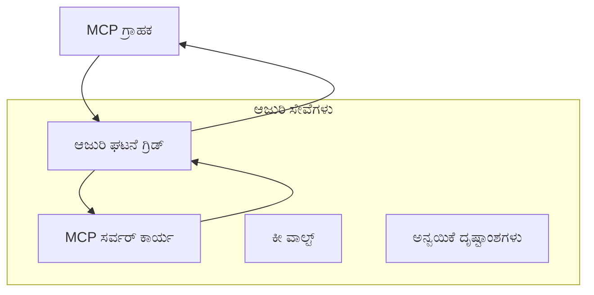
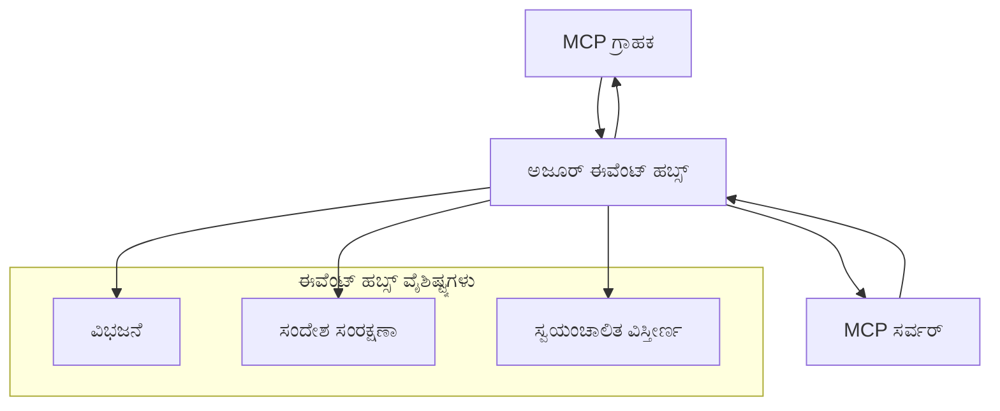

# MCP ಕಸ್ಟಮ್ ಟ್ರಾನ್ಸ್‌ಪೋರ್ಟ್‌ಗಳು - ನಿಯತ ನಿಭಂಧನೆಗಳ ಮಾರ್ಗದರ್ಶಿ

ಮಾದರಿ ಪ್ರಥಮಿಕೆ ಪ್ರೋಟೋಕಾಲ್ (MCP) ಸಾರಿಗೆ ಕ್ರಮಗಳಲ್ಲಿ ಉಪಯೋಗಕ್ಕೆ ಅನುವು ಮಾಡಿಕೊಡುವುದು, ತಜ್ಞತೆಯ ಉಪಕ್ರಮಗಳಿಗೆ ವಿಶೇಷ ಹೂಡಿಕೆಗಳನ್ನು ಮಾಡಬಹುದಾಗಿದೆ. ಈ ನಿಯತ ಮಾರ್ಗದರ್ಶಿ, ವಿಸ್ತೀರ್ಣ ಮತ್ತು ಮೋಡ-ಜಾತೀಯ MCP ಪರಿಹಾರಗಳನ್ನು ರೂಪಿಸಲು ಕಾರ್ಯಾಚರಣಾತ್ಮಕ ಉದಾಹರಣೆಗಳಾಗಿ ಅಜೂರ್ ಈವೆಂಟ್ ಗ್ರಿಡ್ ಮತ್ತು ಅಜೂರ್ ಈವೆಂಟ್ ಹಬ್ಸ್ ಬಳಸಿ ಕಸ್ಟಮ್ ಟ್ರಾನ್ಸ್‌ಪೋರ್ಟ್ ಅನುಷ್ಠಾನಗಳನ್ನು ಪರಿಶೀಲಿಸುತ್ತದೆ.

## ಪರಿಚಯ

MCP ನ ಹಿಂದುಮುಂದು ಪದ್ದತಿ ಸಾರಿಗೆಗಳು (stdio ಮತ್ತು HTTP ಸ್ಟ್ರೀಮಿಂಗ್) ಬಹುತೇಕ ಬಳಕೆಗಳಲ್ಲಿ ಸೇವೆ ನೀಡುತ್ತವೆ, ಆದರೆ ಉದ್ಯಮಿಕ ಪರಿಸರಗಳು ಹೆಚ್ಚಿನ ವಿಸ್ತೀರ್ಣ, ವಿಶ್ವಾಸಾರ್ಹತೆ ಮತ್ತು ಈಗಿರುವ ಮೋಡ ಮೂಲಸೌಕರ್ಯಗಳೊಡನೆ ಸಂಯೋಜನೆಗಾಗಿ ವಿಶೇಷ ಸಾರಿಗೆ ಕ್ರಮಗಳನ್ನು ಬಯಸುತ್ತವೆ. ಕಸ್ಟಮ್ ಟ್ರಾನ್ಸ್‌ಪೋರ್ಟ್‌ಗಳು MCPಗೆ ಮೋಡ-ಜಾತೀಯ ಸಂದೇಶ ಸೇವೆಗಳ ಪ್ರಯೋಜನಗಳನ್ನು ಬಳಸಲು ನೀಡುತ್ತವೆ; ಅಸಮಯ ಸಂವಹನ, ಈವೆಂಟ್ ಚಾಲಿತ ಸ್ಥಾಪನೆಗಳು ಮತ್ತು ವಿತರಿತ ಪ್ರಕ್ರಿಯೆಗಳಿಗಾಗಿ.

ಈ ಪಾಠವು ಇತ್ತೀಚಿನ MCP ನಿರ್ದಿಷ್ಟಿಕೆ (2025-11-25), ಅಜೂರ್ ಸಂದೇಶ ಸೇವೆಗಳು ಮತ್ತು ಸ್ಥಾಪಿತ ಉದ್ಯಮ ಸಮ್ಮಿಲನ ಮಾದರಿಗಳ ಆಧಾರದ ಮೇಲೆ ಉನ್ನತಸೌಲಭ್ಯ ಸಾರಿಗೆ ಅನುಷ್ಠಾನಗಳನ್ನು ಪರಿಶೀಲಿಸುತ್ತದೆ.

### **MCP ಸಾರಿಗೆ ವಾಸ್ತುಶಿಲ್ಪ**

**MCP ನಿರ್ದಿಷ್ಟಿಕೆ (2025-11-25) ಯಿಂದ:**

- **ಪ್ರಮಾಣಿತ ಸಾರಿಗೆಗಳು**: stdio ( ಶಿಫಾರಸು), HTTP ಸ್ಟ್ರೀಮಿಂಗ್ (ದೂರಸ್ಥ ಪರಿಸರಗಳಿಗೆ)
- **ಕಸ್ಟಮ್ ಸಾರಿಗೆಗಳು**: MCP ಸಂದೇಶ ವಿನಿಮಯ ಪ್ರೋಟೋಕಾಲ್ ಅನ್ವಯಿಸುವ ಎಲ್ಲ ಸಾರಿಗೆಗಳು
- **ಸಂದೇಶ ಸಲ್ಲಿಕೆ**: JSON-RPC 2.0 MCP ವಿಶೇಷ ವಿಸ್ತಾರಗಳೊಂದಿಗೆ
- **ಎರಡುಮುರಿ ಸಂವಹನ**: ನೋಟಿಫಿಕೇಶನ್‌ಗಳು ಮತ್ತು ಪ್ರತಿಕ್ರಿಯೆಗಳಿಗಾಗಿ ಸಂಪೂರ್ಣ ದ್ವಿಮುಖ ಸಂವಹನ ಅಗತ್ಯ

## ಕಲಿಕೆಯ ಗುರಿಗಳು

ಈ ಉನ್ನತ ಪಾಠದ ಕೊನೆಗೆ, ನೀವು ಸಾಮರ್ಥ್ಯ ಹೊಂದಿರುತ್ತೀರಿ:

- **ಕಸ್ಟಮ್ ಸಾರಿಗೆ ಅಗತ್ಯಗಳನ್ನು ಅರಿವಾಗು**: MCP ಪ್ರೋಟೋಕಾಲ್ ಅನ್ನು ಯಾವುದೇ ಸಾರಿಗೆ ಪದರದಲ್ಲಿ ಅನುಷ್ಠಾನಗೊಳಿಸುವಾಗ ಪಾಲನೆಯೊಂದಿಗೆ
- **ಅಜೂರ್ ಈವೆಂಟ್ ಗ್ರಿಡ್ ಸಾರಿಗೆ ನಿರ್ಮಾಣ**: ಸರ್ವರ್‌ಲೆಸ್ ವಿಸ್ತೀರ್ಣಕ್ಕಾಗಿ ಅಜೂರ್ ಈವೆಂಟ್ ಗ್ರಿಡ್ ಬಳಸಿ ಈವೆಂಟ್ ಚಾಲಿತ MCP ಸರ್ವರ್ಗಳ ರಚನೆ
- **ಅಜೂರ್ ಈವೆಂಟ್ ಹಬ್ಸ್ ಪರಿಣತ್ರಣ**: ರಿಯಲ್-ಟೈಮ್ ಸ್ಟ್ರೀಮಿಂಗ್‌ಗೆ ಆಧಾರಿತ ಉನ್ನತ-ಪ್ರವಾಹ MCP ಪರಿಹಾರಗಳ ವಿನ್ಯಾಸ
- **ಉದ್ಯಮ ಮಾದರಿಗಳನ್ನು ಅನ್ವಯಿಸುವುದು**: ಇತ್ತೀಚಿನ ಅಜೂರ್ ಮೂಲಸೌಕರ್ಯ ಮತ್ತು ಸುರಕ್ಷತಾ ಮಾದರಿಗಳೊಡನೆ ಕಸ್ಟಮ್ ಸಾರಿಗೆ ಏಕರೂಪಿಕೆ
- **ಸಾರಿಗೆ ವಿಶ್ವಾಸಾರ್ಹತೆ ನಿರ್ವಹಣೆ**: ಸಂದೇಶ ಸ್ಥಿರತೆ, ಕ್ರಮ ಅಳವಡಿಕೆ ಮತ್ತು ದೋಷ ನಿರ್ವಹಣೆ ಕೈಗೊಳ್ಳುವುದು
- **ಕಾರ್ಯಕ್ಷಮತೆಯನ್ನು ಸುಧಾರಿಸುವುದು**: ವಿಸ್ತೀರ್ಣ, ವಿಳಂಬ ಮತ್ತು ಸಂಪ್ರೇಕ್ಷಣಾ ಅಗತ್ಯಗಳಿಗೆ ಅನುಗುಣವಾಗಿ ಸಾರಿಗೆ ಪರಿಹಾರ ವಿನ್ಯಾಸ

## **ಸಾರಿಗೆ ಅಗತ್ಯಗಳು**

### **MCP ನಿರ್ದಿಷ್ಟಿಕೆ (2025-11-25) ನಿಂದ ಮೌಲಿಕ ಅಗತ್ಯಗಳು:**

```yaml
Message Protocol:
  format: "JSON-RPC 2.0 with MCP extensions"
  bidirectional: "Full duplex communication required"
  ordering: "Message ordering must be preserved per session"
  
Transport Layer:
  reliability: "Transport MUST handle connection failures gracefully"
  security: "Transport MUST support secure communication"
  identification: "Each session MUST have unique identifier"
  
Custom Transport:
  compliance: "MUST implement complete MCP message exchange"
  extensibility: "MAY add transport-specific features"
  interoperability: "MUST maintain protocol compatibility"
```

## **ಅಜೂರ್ ಈವೆಂಟ್ ಗ್ರಿಡ್ ಸಾರಿಗೆ ಅನುಷ್ಠಾನ**

ಅಜೂರ್ ಈವೆಂಟ್ ಗ್ರಿಡ್ ಸರ್ವರ್‌ಲೆಸ್ ಈವೆಂಟ್ ರೌಟಿಂಗ್ ಸೇವೆಯನ್ನು ಒದಗಿಸುತ್ತದೆ, ಇದು ಈವೆಂಟ್ ಚಾಲಿತ MCP ವಾಸ್ತುಶಿಲ್ಪಗಳಿಗೆ ಸೂಕ್ತವಾಗಿದೆ. ಈ ಅನುಷ್ಠಾನವು ವಿಸ್ತಾರಗೊಳ್ಳುವ ಮತ್ತು ಸಡಿಲವಾಗಿ ಸಂಯೋಜಿತ MCP ವ್ಯವಸ್ಥೆಗಳ ನಿರ್ಮಾಣವನ್ನು ತೋರಿಸುತ್ತದೆ.

### **ವಾಸ್ತುಶಿಲ್ಪವನ್ನು ಅವಲೋಕನ**



### **C# ಅನುಷ್ಠಾನ - ಈವೆಂಟ್ ಗ್ರಿಡ್ ಸಾರಿಗೆ**

```csharp
using Azure.Messaging.EventGrid;
using Microsoft.Extensions.Azure;
using System.Text.Json;

public class EventGridMcpTransport : IMcpTransport
{
    private readonly EventGridPublisherClient _publisher;
    private readonly string _topicEndpoint;
    private readonly string _clientId;
    
    public EventGridMcpTransport(string topicEndpoint, string accessKey, string clientId)
    {
        _publisher = new EventGridPublisherClient(
            new Uri(topicEndpoint), 
            new AzureKeyCredential(accessKey));
        _topicEndpoint = topicEndpoint;
        _clientId = clientId;
    }
    
    public async Task SendMessageAsync(McpMessage message)
    {
        var eventGridEvent = new EventGridEvent(
            subject: $"mcp/{_clientId}",
            eventType: "MCP.MessageReceived",
            dataVersion: "1.0",
            data: JsonSerializer.Serialize(message))
        {
            Id = Guid.NewGuid().ToString(),
            EventTime = DateTimeOffset.UtcNow
        };
        
        await _publisher.SendEventAsync(eventGridEvent);
    }
    
    public async Task<McpMessage> ReceiveMessageAsync(CancellationToken cancellationToken)
    {
        // Event Grid is push-based, so implement webhook receiver
        // This would typically be handled by Azure Functions trigger
        throw new NotImplementedException("Use EventGridTrigger in Azure Functions");
    }
}

// Azure Function for receiving Event Grid events
[FunctionName("McpEventGridReceiver")]
public async Task<IActionResult> HandleEventGridMessage(
    [EventGridTrigger] EventGridEvent eventGridEvent,
    ILogger log)
{
    try
    {
        var mcpMessage = JsonSerializer.Deserialize<McpMessage>(
            eventGridEvent.Data.ToString());
        
        // Process MCP message
        var response = await _mcpServer.ProcessMessageAsync(mcpMessage);
        
        // Send response back via Event Grid
        await _transport.SendMessageAsync(response);
        
        return new OkResult();
    }
    catch (Exception ex)
    {
        log.LogError(ex, "Error processing Event Grid MCP message");
        return new BadRequestResult();
    }
}
```

### **TypeScript ಅನುಷ್ಠಾನ - ಈವೆಂಟ್ ಗ್ರಿಡ್ ಸಾರಿಗೆ**

```typescript
import { EventGridPublisherClient, AzureKeyCredential } from "@azure/eventgrid";
import { McpTransport, McpMessage } from "./mcp-types";

export class EventGridMcpTransport implements McpTransport {
    private publisher: EventGridPublisherClient;
    private clientId: string;
    
    constructor(
        private topicEndpoint: string,
        private accessKey: string,
        clientId: string
    ) {
        this.publisher = new EventGridPublisherClient(
            topicEndpoint,
            new AzureKeyCredential(accessKey)
        );
        this.clientId = clientId;
    }
    
    async sendMessage(message: McpMessage): Promise<void> {
        const event = {
            id: crypto.randomUUID(),
            source: `mcp-client-${this.clientId}`,
            type: "MCP.MessageReceived",
            time: new Date(),
            data: message
        };
        
        await this.publisher.sendEvents([event]);
    }
    
    // ಇವೆಂಟ್-ಚಾಲಿತ ಸ್ವೀಕೃತಿ ಜೊತೆಗೆ ಅಜೂರ್ ಫಂಕ್ಷನ್ಸ್
    onMessage(handler: (message: McpMessage) => Promise<void>): void {
        // ಅಳವಡಿಕೆ ಅಜೂರ್ ಫಂಕ್ಷನ್ಸ್ ಇವೆಂಟ್ ಗ್ರಿಡ್ ಟ್ರಿಗರ್ ಬಳಸುತ್ತದೆ
        // ಇದು ವೆಬ್‌ಹುಕ್ ಸ್ವೀಕರಿಸುವವರಿಗೆ ಸಂಪ್ರದಾಯಾತ್ಮಕ ಇಂಟರ್ಫೇಸ್
    }
}

// ಅಜೂರ್ ಫಂಕ್ಷನ್ಸ್ ಅಳವಡಿಕೆ
import { app, InvocationContext, EventGridEvent } from "@azure/functions";

app.eventGrid("mcpEventGridHandler", {
    handler: async (event: EventGridEvent, context: InvocationContext) => {
        try {
            const mcpMessage = event.data as McpMessage;
            
            // MCP ಸಂದೇಶವನ್ನು ಕೈಗಾರಿಕೆ ಮಾಡಿ
            const response = await mcpServer.processMessage(mcpMessage);
            
            // ಇವೆಂಟ್ ಗ್ರಿಡ್ ಮೂಲಕ ಪ್ರತಿಕ್ರಿಯೆಯನ್ನು ಕಳುಹಿಸಿ
            await transport.sendMessage(response);
            
        } catch (error) {
            context.error("Error processing MCP message:", error);
            throw error;
        }
    }
});
```

### **Python ಅನುಷ್ಠಾನ - ಈವೆಂಟ್ ಗ್ರಿಡ್ ಸಾರಿಗೆ**

```python
from azure.eventgrid import EventGridPublisherClient, EventGridEvent
from azure.core.credentials import AzureKeyCredential
import asyncio
import json
from typing import Callable, Optional
import uuid
from datetime import datetime

class EventGridMcpTransport:
    def __init__(self, topic_endpoint: str, access_key: str, client_id: str):
        self.client = EventGridPublisherClient(
            topic_endpoint, 
            AzureKeyCredential(access_key)
        )
        self.client_id = client_id
        self.message_handler: Optional[Callable] = None
    
    async def send_message(self, message: dict) -> None:
        """Send MCP message via Event Grid"""
        event = EventGridEvent(
            data=message,
            subject=f"mcp/{self.client_id}",
            event_type="MCP.MessageReceived",
            data_version="1.0"
        )
        
        await self.client.send(event)
    
    def on_message(self, handler: Callable[[dict], None]) -> None:
        """Register message handler for incoming events"""
        self.message_handler = handler

# ಅಜೂರ್ ಫಂಕ್ಷನ್‌ಗಳ ಅನುಷ್ಠಾನ
import azure.functions as func
import logging

def main(event: func.EventGridEvent) -> None:
    """Azure Functions Event Grid trigger for MCP messages"""
    try:
        # ಇವೆಂಟ್ ಗ್ರಿಡ್ ಈವೆಂಟ್‌ನಿಂದ MCP ಸಂದೇಶವನ್ನು ವಿಶ್ಲೇಷಿಸಿ
        mcp_message = json.loads(event.get_body().decode('utf-8'))
        
        # MCP ಸಂದೇಶವನ್ನು ಪ್ರಕ್ರಿಯೆಗೊಳಿಸಿ
        response = process_mcp_message(mcp_message)
        
        # ಇವೆಂಟ್ ಗ್ರಿಡ್ ಮೂಲಕ ಪ್ರತಿಕ್ರಿಯೆಯನ್ನು ಹಿಂತಿರುಗಿಸಿ
        # (ಅನುಷ್ಠಾನವು ಹೊಸ ಇವೆಂಟ್ ಗ್ರಿಡ್ ಕ್ಲೈಯಂಟ್ ಅನ್ನು ರಚಿಸುವದು)
        
    except Exception as e:
        logging.error(f"Error processing MCP Event Grid message: {e}")
        raise
```

## **ಅಜೂರ್ ಈವೆಂಟ್ ಹಬ್ಸ್ ಸಾರಿಗೆ ಅನುಷ್ಠಾನ**

ಅಜೂರ್ ಈವೆಂಟ್ ಹಬ್ಸ್ MCP ಪರಿಸರಗಳಿಗೆ ಕಡಿಮೆ ವಿಳಂಬ ಮತ್ತು ಹೆಚ್ಚಿನ ಸಂದೇಶ ಪ್ರಮಾಣದ ರಿಯಲ್-ಟೈಮ್ ಸ್ಟ್ರೀಮಿಂಗ್ ಸಾಮರ್ಥ್ಯಗಳನ್ನು ಒದಗಿಸುತ್ತದೆ.

### **ವಾಸ್ತುಶಿಲ್ಪವನ್ನು ಅವಲೋಕನ**



### **C# ಅನುಷ್ಠಾನ - ಈವೆಂಟ್ ಹಬ್ಸ್ ಸಾರಿಗೆ**

```csharp
using Azure.Messaging.EventHubs;
using Azure.Messaging.EventHubs.Producer;
using Azure.Messaging.EventHubs.Consumer;
using System.Text;

public class EventHubsMcpTransport : IMcpTransport, IDisposable
{
    private readonly EventHubProducerClient _producer;
    private readonly EventHubConsumerClient _consumer;
    private readonly string _consumerGroup;
    private readonly CancellationTokenSource _cancellationTokenSource;
    
    public EventHubsMcpTransport(
        string connectionString, 
        string eventHubName,
        string consumerGroup = "$Default")
    {
        _producer = new EventHubProducerClient(connectionString, eventHubName);
        _consumer = new EventHubConsumerClient(
            consumerGroup, 
            connectionString, 
            eventHubName);
        _consumerGroup = consumerGroup;
        _cancellationTokenSource = new CancellationTokenSource();
    }
    
    public async Task SendMessageAsync(McpMessage message)
    {
        var messageBody = JsonSerializer.Serialize(message);
        var eventData = new EventData(Encoding.UTF8.GetBytes(messageBody));
        
        // Add MCP-specific properties
        eventData.Properties.Add("MessageType", message.Method ?? "response");
        eventData.Properties.Add("MessageId", message.Id);
        eventData.Properties.Add("Timestamp", DateTimeOffset.UtcNow);
        
        await _producer.SendAsync(new[] { eventData });
    }
    
    public async Task StartReceivingAsync(
        Func<McpMessage, Task> messageHandler)
    {
        await foreach (PartitionEvent partitionEvent in _consumer.ReadEventsAsync(
            _cancellationTokenSource.Token))
        {
            try
            {
                var messageBody = Encoding.UTF8.GetString(
                    partitionEvent.Data.EventBody.ToArray());
                var mcpMessage = JsonSerializer.Deserialize<McpMessage>(messageBody);
                
                await messageHandler(mcpMessage);
            }
            catch (Exception ex)
            {
                // Handle deserialization or processing errors
                Console.WriteLine($"Error processing message: {ex.Message}");
            }
        }
    }
    
    public void Dispose()
    {
        _cancellationTokenSource?.Cancel();
        _producer?.DisposeAsync().AsTask().Wait();
        _consumer?.DisposeAsync().AsTask().Wait();
        _cancellationTokenSource?.Dispose();
    }
}
```

### **TypeScript ಅನುಷ್ಠಾನ - ಈವೆಂಟ್ ಹಬ್ಸ್ ಸಾರಿಗೆ**

```typescript
import { 
    EventHubProducerClient, 
    EventHubConsumerClient, 
    EventData 
} from "@azure/event-hubs";

export class EventHubsMcpTransport implements McpTransport {
    private producer: EventHubProducerClient;
    private consumer: EventHubConsumerClient;
    private isReceiving = false;
    
    constructor(
        private connectionString: string,
        private eventHubName: string,
        private consumerGroup: string = "$Default"
    ) {
        this.producer = new EventHubProducerClient(
            connectionString, 
            eventHubName
        );
        this.consumer = new EventHubConsumerClient(
            consumerGroup,
            connectionString,
            eventHubName
        );
    }
    
    async sendMessage(message: McpMessage): Promise<void> {
        const eventData: EventData = {
            body: JSON.stringify(message),
            properties: {
                messageType: message.method || "response",
                messageId: message.id,
                timestamp: new Date().toISOString()
            }
        };
        
        await this.producer.sendBatch([eventData]);
    }
    
    async startReceiving(
        messageHandler: (message: McpMessage) => Promise<void>
    ): Promise<void> {
        if (this.isReceiving) return;
        
        this.isReceiving = true;
        
        const subscription = this.consumer.subscribe({
            processEvents: async (events, context) => {
                for (const event of events) {
                    try {
                        const messageBody = event.body as string;
                        const mcpMessage: McpMessage = JSON.parse(messageBody);
                        
                        await messageHandler(mcpMessage);
                        
                        // ಕನಿಷ್ಠ-ಒಮ್ಮೆ ವಿತರಣೆಗೆ ಚೇಖ್‌ಪಾಯಿಂಟ್ ನವೀಕರಿಸಿ
                        await context.updateCheckpoint(event);
                    } catch (error) {
                        console.error("Error processing Event Hubs message:", error);
                    }
                }
            },
            processError: async (err, context) => {
                console.error("Event Hubs error:", err);
            }
        });
    }
    
    async close(): Promise<void> {
        this.isReceiving = false;
        await this.producer.close();
        await this.consumer.close();
    }
}
```

### **Python ಅನುಷ್ಠಾನ - ಈವೆಂಟ್ ಹಬ್ಸ್ ಸಾರಿಗೆ**

```python
from azure.eventhub import EventHubProducerClient, EventHubConsumerClient
from azure.eventhub import EventData
import json
import asyncio
from typing import Callable, Dict, Any
import logging

class EventHubsMcpTransport:
    def __init__(
        self, 
        connection_string: str, 
        eventhub_name: str,
        consumer_group: str = "$Default"
    ):
        self.producer = EventHubProducerClient.from_connection_string(
            connection_string, 
            eventhub_name=eventhub_name
        )
        self.consumer = EventHubConsumerClient.from_connection_string(
            connection_string,
            consumer_group=consumer_group,
            eventhub_name=eventhub_name
        )
        self.is_receiving = False
    
    async def send_message(self, message: Dict[str, Any]) -> None:
        """Send MCP message via Event Hubs"""
        event_data = EventData(json.dumps(message))
        
        # MCP-ನಿರ್ದಿಷ್ಟ ಗುಣ ಲಕ್ಷಣಗಳನ್ನು ಸೇರಿಸಿ
        event_data.properties = {
            "messageType": message.get("method", "response"),
            "messageId": message.get("id"),
            "timestamp": "2025-01-14T10:30:00Z"  # ವಾಸ್ತವಿಕ ಕಾಲಮುದ್ರೆಯನ್ನು ಬಳಸಿ
        }
        
        async with self.producer:
            event_data_batch = await self.producer.create_batch()
            event_data_batch.add(event_data)
            await self.producer.send_batch(event_data_batch)
    
    async def start_receiving(
        self, 
        message_handler: Callable[[Dict[str, Any]], None]
    ) -> None:
        """Start receiving MCP messages from Event Hubs"""
        if self.is_receiving:
            return
        
        self.is_receiving = True
        
        async with self.consumer:
            await self.consumer.receive(
                on_event=self._on_event_received(message_handler),
                starting_position="-1"  # ಆರಂಭದಿಂದ ಪ್ರಾರಂಭಿಸಿ
            )
    
    def _on_event_received(self, handler: Callable):
        """Internal event handler wrapper"""
        async def handle_event(partition_context, event):
            try:
                # ಈವೆಂಟ್ ಹಬ್‌ಗಳ ಈವೆಂಟ್‌ನಿಂದ MCP ಸಂದೇಶವನ್ನು ವ್ಯಾಖ್ಯಾನಿಸಿ
                message_body = event.body_as_str(encoding='UTF-8')
                mcp_message = json.loads(message_body)
                
                # MCP ಸಂದೇಶವನ್ನು ಪ್ರಕ್ರಿಯೆ ಮಾಡಿ
                await handler(mcp_message)
                
                # ಕನಿಷ್ಠ-ಒಂದು ಬಾರಿ ವಿತರಣೆಗಾಗಿ ಚೆಕ್‌ಪಾಯಿಂಟ್ ಅನ್ನು ನವೀಕರಿಸಿ
                await partition_context.update_checkpoint(event)
                
            except Exception as e:
                logging.error(f"Error processing Event Hubs message: {e}")
        
        return handle_event
    
    async def close(self) -> None:
        """Clean up transport resources"""
        self.is_receiving = False
        await self.producer.close()
        await self.consumer.close()
```

## **ಉನ್ನತ ಸಾರಿಗೆ ಮಾದರಿಗಳು**

### **ಸಂದೇಶ ಸ್ಥಿರತೆ ಮತ್ತು ವಿಶ್ವಾಸಾರ್ಹತೆ**

```csharp
// Implementing message durability with retry logic
public class ReliableTransportWrapper : IMcpTransport
{
    private readonly IMcpTransport _innerTransport;
    private readonly RetryPolicy _retryPolicy;
    
    public async Task SendMessageAsync(McpMessage message)
    {
        await _retryPolicy.ExecuteAsync(async () =>
        {
            try
            {
                await _innerTransport.SendMessageAsync(message);
            }
            catch (TransportException ex) when (ex.IsRetryable)
            {
                // Log and retry
                throw;
            }
        });
    }
}
```

### **ಸಾರಿಗೆ ಸುರಕ್ಷತಾ ಏಕರೂಪಿಕೆ**

```csharp
// Integrating Azure Key Vault for transport security
public class SecureTransportFactory
{
    private readonly SecretClient _keyVaultClient;
    
    public async Task<IMcpTransport> CreateEventGridTransportAsync()
    {
        var accessKey = await _keyVaultClient.GetSecretAsync("EventGridAccessKey");
        var topicEndpoint = await _keyVaultClient.GetSecretAsync("EventGridTopic");
        
        return new EventGridMcpTransport(
            topicEndpoint.Value.Value,
            accessKey.Value.Value,
            Environment.MachineName
        );
    }
}
```

### **ಸಾರಿಗೆ ನಿರೀಕ್ಷಣೆ ಮತ್ತು ಗಮನಾರ್ಹತೆ**

```csharp
// Adding telemetry to custom transports
public class ObservableTransport : IMcpTransport
{
    private readonly IMcpTransport _transport;
    private readonly ILogger _logger;
    private readonly TelemetryClient _telemetryClient;
    
    public async Task SendMessageAsync(McpMessage message)
    {
        using var activity = Activity.StartActivity("MCP.Transport.Send");
        activity?.SetTag("transport.type", "EventGrid");
        activity?.SetTag("message.method", message.Method);
        
        var stopwatch = Stopwatch.StartNew();
        
        try
        {
            await _transport.SendMessageAsync(message);
            
            _telemetryClient.TrackDependency(
                "EventGrid",
                "SendMessage",
                DateTime.UtcNow.Subtract(stopwatch.Elapsed),
                stopwatch.Elapsed,
                true
            );
        }
        catch (Exception ex)
        {
            _telemetryClient.TrackException(ex);
            throw;
        }
    }
}
```

## **ಉದ್ಯಮ ಸಮ್ಮಿಲನ ಪರಿಸ್ಥಿತಿಗಳು**

### **ಪರಿಸ್ಥಿತಿ 1: ವಿತರಿತ MCP ಪ್ರಕ್ರಿಯೆ**

ಬಹು ಪ್ರಕ್ರಿಯೆಗತ ಶೃಂಖಲೆಗಳಿಗೆ MCP ವಿನಂತಿಗಳನ್ನು ವಿತರಿಸುವುದಕ್ಕೆ ಅಜೂರ್ ಈವೆಂಟ್ ಗ್ರಿಡ್ ಉಪಯೋಗಿಸುವುದು:

```yaml
Architecture:
  - MCP Client sends requests to Event Grid topic
  - Multiple Azure Functions subscribe to process different tool types
  - Results aggregated and returned via separate response topic
  
Benefits:
  - Horizontal scaling based on message volume
  - Fault tolerance through redundant processors
  - Cost optimization with serverless compute
```

### **ಪರಿಸ್ಥಿತಿ 2: ರಿಯಲ್-ಟೈಮ್ MCP ಸ್ಟ್ರೀಮಿಂಗ್**

ಸಂಭಾಷಣೆ־ಮಾಹಿತಿ ಕ್ರಿಯೆಗಳು ಹೆಚ್ಚಿನ ಆವೃತ್ತಿಯ MCP ಪರಸ್ಪರ ಕ್ರಿಯೆಗಳಿಗಾಗಿ ಅಜೂರ್ ಈವೆಂಟ್ ಹಬ್ಸ್ ಬಳಕೆ:

```yaml
Architecture:
  - MCP Client streams continuous requests via Event Hubs
  - Stream Analytics processes and routes messages
  - Multiple consumers handle different aspect of processing
  
Benefits:
  - Low latency for real-time scenarios
  - High throughput for batch processing
  - Built-in partitioning for parallel processing
```

### **ಪರಿಸ್ಥಿತಿ 3: ಸಂಯುಕ್ತ ಸಾರಿಗೆ ವಾಸ್ತುಶಿಲ್ಪ**

ವಿವಿಧ ಬಳಕೆಗಳಿಗಾಗಿ ಹಲವು ಸಾರಿಗೆಗಳನ್ನು ಸಂಯೋಜನೆ ಮಾಡುವುದು:

```csharp
public class HybridMcpTransport : IMcpTransport
{
    private readonly IMcpTransport _realtimeTransport; // Event Hubs
    private readonly IMcpTransport _batchTransport;    // Event Grid
    private readonly IMcpTransport _fallbackTransport; // HTTP Streaming
    
    public async Task SendMessageAsync(McpMessage message)
    {
        // Route based on message characteristics
        var transport = message.Method switch
        {
            "tools/call" when IsRealtime(message) => _realtimeTransport,
            "resources/read" when IsBatch(message) => _batchTransport,
            _ => _fallbackTransport
        };
        
        await transport.SendMessageAsync(message);
    }
}
```

## **ಕಾರ್ಯಕ್ಷಮತೆ ಸುಧಾರಣೆ**

### **ಈವೆಂಟ್ ಗ್ರಿಡ್‌ಗೆ ಸಂದೇಶ ಗುಚ್ಛೀಕರಣ**

```csharp
public class BatchingEventGridTransport : IMcpTransport
{
    private readonly List<McpMessage> _messageBuffer = new();
    private readonly Timer _flushTimer;
    private const int MaxBatchSize = 100;
    
    public async Task SendMessageAsync(McpMessage message)
    {
        lock (_messageBuffer)
        {
            _messageBuffer.Add(message);
            
            if (_messageBuffer.Count >= MaxBatchSize)
            {
                _ = Task.Run(FlushMessages);
            }
        }
    }
    
    private async Task FlushMessages()
    {
        List<McpMessage> toSend;
        lock (_messageBuffer)
        {
            toSend = new List<McpMessage>(_messageBuffer);
            _messageBuffer.Clear();
        }
        
        if (toSend.Any())
        {
            var events = toSend.Select(CreateEventGridEvent);
            await _publisher.SendEventsAsync(events);
        }
    }
}
```

### **ಈವೆಂಟ್ ಹಬ್ಸ್‌ಗಾಗಿ ವಿಭಾಗೀಕರಣ ನೀತಿ**

```csharp
public class PartitionedEventHubsTransport : IMcpTransport
{
    public async Task SendMessageAsync(McpMessage message)
    {
        // Partition by client ID for session affinity
        var partitionKey = ExtractClientId(message);
        
        var eventData = new EventData(JsonSerializer.SerializeToUtf8Bytes(message))
        {
            PartitionKey = partitionKey
        };
        
        await _producer.SendAsync(new[] { eventData });
    }
}
```

## **ಕಸ್ಟಮ್ ಸಾರಿಗೆಗಳ ಪರೀಕ್ಷಣೆ**

### **ಟೆಸ್ಟ್ ಡಬಲ್ಸ್‌ ಜೊತೆ ಯುನಿಟ್ ಟೆಸ್ಟಿಂಗ್**

```csharp
[Test]
public async Task EventGridTransport_SendMessage_PublishesCorrectEvent()
{
    // Arrange
    var mockPublisher = new Mock<EventGridPublisherClient>();
    var transport = new EventGridMcpTransport(mockPublisher.Object);
    var message = new McpMessage { Method = "tools/list", Id = "test-123" };
    
    // Act
    await transport.SendMessageAsync(message);
    
    // Assert
    mockPublisher.Verify(
        x => x.SendEventAsync(
            It.Is<EventGridEvent>(e => 
                e.EventType == "MCP.MessageReceived" &&
                e.Subject == "mcp/test-client"
            )
        ),
        Times.Once
    );
}
```

### **ಅಜೂರ್ ಟೆಸ್ಟ್ ಕಂಟೈನರ್‌ಗಳೊಂದಿಗೆ ಸಮ್ಮಿಲನ ಪರೀಕ್ಷಣೆ**

```csharp
[Test]
public async Task EventHubsTransport_IntegrationTest()
{
    // Using Testcontainers for integration testing
    var eventHubsContainer = new EventHubsContainer()
        .WithEventHub("test-hub");
    
    await eventHubsContainer.StartAsync();
    
    var transport = new EventHubsMcpTransport(
        eventHubsContainer.GetConnectionString(),
        "test-hub"
    );
    
    // Test message round-trip
    var sentMessage = new McpMessage { Method = "test", Id = "123" };
    McpMessage receivedMessage = null;
    
    await transport.StartReceivingAsync(msg => {
        receivedMessage = msg;
        return Task.CompletedTask;
    });
    
    await transport.SendMessageAsync(sentMessage);
    await Task.Delay(1000); // Allow for message processing
    
    Assert.That(receivedMessage?.Id, Is.EqualTo("123"));
}
```

## **ಶ್ರೇಷ್ಠ ಅಭ್ಯಾಸಗಳು ಮತ್ತು ಮಾರ್ಗನಿರ್ದೇಶನಗಳು**

### **ಸಾರಿಗೆ ವಿನ್ಯಾಸ ತತ್ವಗಳು**

1. **ಐಡಂಪೋಟೆನ್ಸಿ**: ನಕಲಿ ಪ್ರಕ್ರಿಯೆ ತಪ್ಪಿಸಲು ಸಂದೇಶ ಪ್ರಕ್ರಿಯೆ ಐಡಂಪೋಟೆಂಟ್ ಇರಲಿ
2. **ದೋಷ ನಿರ್ವಹಣೆ**: ಸಂಪूर्ण ದೋಷ ನಿರ್ವಹಣೆ ಮತ್ತು ಡೇಡ್ ಲೆಟರ್ ಕ್ಯೂಗಳನ್ನು ಅನುಷ್ಠಾನಗೊಳಿಸಿ
3. **ನಿಗಾವಳಿ**: ವಿಸ್ತೃತ ಟೆಲಿಮೆಟ್ರಿ ಮತ್ತು ಆರೋಗ್ಯ ಪರಿಶೀಲನೆಗಳನ್ನು ಸೇರಿಸಿ
4. **ಸುರಕ್ಷತೆ**: ನಿರ್ವಹಿತ ಭಯಾಂಕರತೆ ಮತ್ತು ಕನಿಷ್ಟ ಪ್ರವೇಶ ಹಕ್ಕುಗಳನ್ನು ಬಳಸಿ
5. **ಕಾರ್ಯಕ್ಷಮತೆ**: ನಿಮ್ಮ ವಿಶೇಷ ವಿಳಂಬ ಮತ್ತು ಸಂಪ್ರೇಕ್ಷಣಾ ಅಗತ್ಯಗಳಿಗೆ ವಿನ್ಯಾಸ ರೂಪಿಸಿ

### **ಅಜೂರ್-ನ್ದ ವಿಶೇಷ ಶಿಫಾರಸುಗಳು**

1. **ನಿರ್ವಹಿತ ಗುರುತು ಬಳಸಿ**: ಉತ್ಪಾದನೆಯಲ್ಲಿ ಸಂಪರ್ಕ ಸರಪಳಿಗಳನ್ನು ತಪ್ಪಿಸಿ
2. **ಸರ್ಕ್ಯೂಟ್ ಬ್ರೇಕರ್ಸ್ ಅನುಷ್ಠಾನಗೊಳಿಸಿ**: ಅಜೂರ್ ಸೇವಾ ನಿಷ್ಕ್ರಿಯೆಗಳಿಂದ ರಕ್ಷಣೆ
3. **ವೆಚ್ಚವನ್ನು ಗಮನಿಸಿ**: ಸಂದೇಶ ವಾಲ್ಯುಮ್ ಮತ್ತು ಪ್ರಕ್ರಿಯೆ ವೆಚ್ಚವನ್ನು ಟ್ರ್ಯಾಕ್ ಮಾಡಿ
4. **ವಿಸ್ತೀರ್ಣಕ್ಕಾಗಿ ಯೋಜಿಸಿ**: ವಿಭಾಗೀಕರಣ ಮತ್ತು ವಿಸ್ತರಣೆ ನೀತಿಗಳನ್ನು ಆರಂಭದಲ್ಲಿಯೇ ವಿನ್ಯಾಸಗೊಳಿಸಿ
5. **ಸಂಪೂರ್ಣವಾಗಿ ಪರೀಕ್ಷಿಸಿ**: ಸಮಗ್ರ ಪರೀಕ್ಷೆಗೆ ಅಜೂರ್ ಡೆವ್‌ಟೆಸ್ಟ್ ಲ್ಯಾಬ್‌ಗಳ ಉಪಯೋಗ

## **ಸಮಾರೋಪ**

ಕಸ್ಟಮ್ MCP ಸಾರಿಗೆಗಳು ಅಜೂರ್ ಸಂದೇಶ ಸೇವೆಗಳ ಬಳಕೆ ಮೂಲಕ ಶಕ್ತಿಶಾಲಿ ಉದ್ಯಮ ಪರಿಸ್ಥಿತಿಗಳನ್ನು ಸಾಧ್ಯ ಮಾಡುತ್ತವೆ. ಈವೆಂಟ್ ಗ್ರಿಡ್ ಅಥವಾ ಈವೆಂಟ್ ಹಬ್ಸ್ ಸಾರಿಗೆಗಳನ್ನು ಅನುಷ್ಠಾನಗೊಳಿಸುವ ಮೂಲಕ, ನೀವು ವಿಸ್ತಾರಗೊಳ್ಳುವ, ವಿಶ್ವಾಸಾರ್ಹ MCP ಪರಿಹಾರಗಳನ್ನು ನಿರ್ಮಿಸಬಹುದು, ಇತ್ತೀಚಿನ ಅಜೂರ್ ಮೂಲಸೌಕರ್ಯ ಮತ್ತು ನೀತಿಗಳೊಡನೆ ಹಮ್ಮಿಕೊಳ್ಳುವಂತಿವೆ.

ಕೊಟ್ಟಿರುವ ಉದಾಹರಣೆಗಳು ಕಸ್ಟಮ್ ಸಾರಿಗೆಗಳ MCP ಪ್ರೋಟೋಕಾಲ್ ಪಾಲನೆಯುಳ್ಳ ಮತ್ತು ಅಜೂರ್ ಉತ್ಕೃಷ್ಟ ಅಭ್ಯಾಸಗಳನ್ನು ಕಾಪಾಡುತ್ತಾ ನಿರ್ವಹಣೆ ಮಾಡಲು ತಯಾರಾದ ಮಾದರಿಗಳನ್ನು ತೋರಿಸುತ್ತವೆ.

## **ಹೆಚ್ಚಿನ ಸಂಪನ್ಮೂಲಗಳು**

- [MCP Specification 2025-11-25](https://modelcontextprotocol.io/specification/2025-11-25/)
- [Azure Event Grid Documentation](https://docs.microsoft.com/azure/event-grid/)
- [Azure Event Hubs Documentation](https://docs.microsoft.com/azure/event-hubs/)
- [Azure Functions Event Grid Trigger](https://docs.microsoft.com/azure/azure-functions/functions-bindings-event-grid)
- [Azure SDK for .NET](https://github.com/Azure/azure-sdk-for-net)
- [Azure SDK for TypeScript](https://github.com/Azure/azure-sdk-for-js)
- [Azure SDK for Python](https://github.com/Azure/azure-sdk-for-python)

---

> *ಈ ಮಾರ್ಗದರ್ಶಿ ಉತ್ಪಾದನಾ MCP ವ್ಯವಸ್ಥೆಗಳಿಗೆ ಕಾರ್ಯಾಚರಣಾತ್ಮಕ ಅನುಷ್ಠಾನ ಮಾದರಿಗಳ ಮೇಲೆ ಕೇಂದ್ರೀಕರಿಸಿದೆ. ಸದಾ ನಿಮ್ಮ ವಿಶಿಷ್ಟ ಅಗತ್ಯಗಳು ಮತ್ತು ಅಜೂರ್ ಸೇವಾ ಮಿತಿಗಳೊಂದಿಗೆ ಸಾರಿಗೆ ಅನುಷ್ಠಾನಗಳನ್ನು ಪರಿಶೀಲಿಸಿ.*
> **ಪ್ರಸ್ತುತ ಪ್ರಮಾಣಿತ**: ಈ ಮಾರ್ಗದರ್ಶಿ [MCP Specification 2025-11-25](https://modelcontextprotocol.io/specification/2025-11-25/) ಸಾರಿಗೆ ಅಗತ್ಯಗಳು ಮತ್ತು ಉನ್ನತ ಸಾರಿಗೆ ಮಾದರಿಗಳನ್ನು ಉದ್ಯಮ ಪರಿಸರಗಳಿಗೆ ಪ್ರತಿಬಿಂಬಿಸುತ್ತದೆ.


## ಮುಂದೇನು
- [6. ಸಮುದಾಯ ಕೊಡುಗೆಗಳು](../../06-CommunityContributions/README.md)

---

<!-- CO-OP TRANSLATOR DISCLAIMER START -->
**ಅಸ್ವೀಕಾರ**:
ಈ ದಸ್ತಾವೇಜು AI ಅನುವಾದ ಸೇವೆ [Co-op Translator](https://github.com/Azure/co-op-translator) ಬಳಸಿ ಅನುವಾದಿಸಲಾಗಿದೆ. ನಾವು ನಿಖರತೆಯನ್ನು ಸಾಧಿಸಲು ಪ್ರಯತ್ನಿಸುತ್ತಿದ್ದರೂ, ದಯವಿಟ್ಟು ಗಮನಿಸಿ, ಸ್ವಯಂಚಾಲಿತ ಅನುವಾದಗಳಲ್ಲಿ ದೋಷಗಳು ಅಥವಾ ಅಸಡ್ಡೆಗಳು ಇರಬಹುದು. ಮೂಲ ಭಾಷೆಯಲ್ಲಿರುವ ಮೂಲ ದಸ್ತಾವೇಜು ಪ್ರಾಮಾಣಿಕ ಮೂಲವೆಂದು ಪರಿಗಣಿಸಬೇಕು. ಪ್ರಮುಖ ಮಾಹಿತಿಗಾಗಿ, ವೃತ್ತಿಪರ ಮಾನವ ಅನುವಾದವನ್ನು ಶಿಫಾರಸು ಮಾಡಲಾಗುತ್ತದೆ. ಈ ಅನುವಾದವನ್ನು ಬಳಸುವ ಮೂಲಕ ಉಂಟಾಗುವ ಯಾವುದೇ ತಪ್ಪು ಅರ್ಥಗಳ ಅಥವಾ ತಪ್ಪು ವ್ಯಾಖ್ಯಾನಗಳ ಬಗ್ಗೆ ನಾವು ಹೊಣೆಗಾರರಲ್ಲ.
<!-- CO-OP TRANSLATOR DISCLAIMER END -->