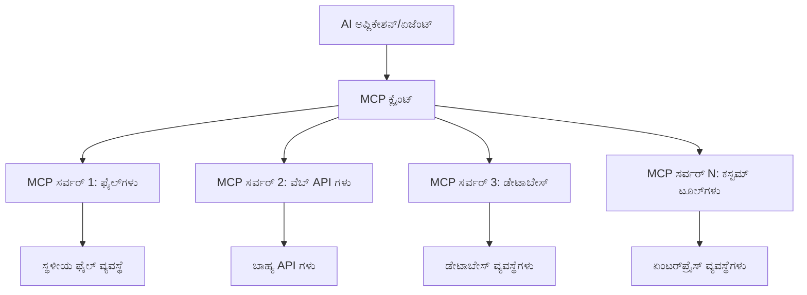

# 🌐 ಮೋಡ್ಯೂಲ್ 2: Microsoft Foundry Toolkit ಮೂಲತತ್ವಗಳೊಂದಿಗೆ MCP

[]()
[]()
[]()

## 📋 ಅಧ್ಯಯನ ಗುರಿಗಳು

ಈ ಮೋಡ್ಯೂಲ್ ಅಂತ್ಯಕ್ಕೆ, ನೀವು ಸಾಮರ್ಥ್ಯವನ್ನು ಹೊಂದಿರುತ್ತೀರಿ:
- ✅ ಮಾದರಿ ಸಂದರ್ಭ ಪ್ರೋಟೋಕಾಲಿನ (MCP) ವಾಸ್ತುಶಿಲ್ಪ ಮತ್ತು ಲಾಭಗಳನ್ನು ಅರ್ಥಮಾಡಿಕೊಳ್ಳಿ
- ✅ Microsoft ನ MCP ಸರ್ವರ್ ಪರಿಸರವನ್ನು ಅನ್ವೇಷಿಸಿ
- ✅ MCP ಸರ್ವರ್ ಗಳನ್ನು Microsoft Foundry Toolkit Agent Builder ಜೊತೆಗೆ ಸಂಯೋಜಿಸಿ
- ✅ Playwright MCP ಬಳಸಿಕೊಂಡು ಕಾರ್ಯನಿರ್ವಹಿಸುವ ಬ್ರೌಸರ್ ಸ್ವಯಂಚಾಲಿತ ಏಜೆಂಟ್ ಅನ್ನು ನಿರ್ಮಿಸಿ
- ✅ ನಿಮ್ಮ ಏಜೆಂಟ್‌ಗಳಲ್ಲಿ MCP ಸಾಧನಗಳನ್ನು ಸಂರಚಿಸಿ ಮತ್ತು ಪರೀಕ್ಷಿಸಿ
- ✅ ಉತ್ಪಾದನಾ ಬಳಕೆಗೆ MCP ಚಾಲಿತ ಏಜೆಂಟ್‌ಗಳನ್ನು ರಫ್ತಿ ಮಾಡಿ ಮತ್ತು ನಿಯೋಜಿಸಿ

## 🎯 ಮೋಡ್ಯೂಲ್ 1 ಆಧಾರಿತ ನಿರ್ಮಾಣ

ಮೋಡ್ಯೂಲ್ 1 ರಲ್ಲಿ, ನಾವು Microsoft Foundry Toolkit ಮೂಲತತ್ವಗಳನ್ನು ಮೆಚ್ಚಿಕೊಳ್ಳುತ್ತಿದ್ದೇವೆ ಮತ್ತು ನಮ್ಮ ಮೊದಲ Python ಏಜೆಂಟ್ ಅನ್ನು ನಿರ್ಮಿಸಿದ್ದೇವೆ. ಈಗ ನಾವು ನಿಮ್ಮ ಏಜೆಂಟ್‌ಗಳನ್ನು **ಶಕ್ತಿಶಾಲೀಕರಿಸಲು** ಹೊರಗಿನ ಸಾಧನಗಳು ಮತ್ತು ಸೇವೆಗಳೊಂದಿಗೆ ಕ್ರಾಂತಿಕಾರಿ **ಮಾಡೆಲ್ ಸಂದರ್ಭ ಪ್ರೋಟೋಕಾಲ್ (MCP)** ಮೂಲಕ ಸಂಪರ್ಕ ಮಾಡುತ್ತೇವೆ.

ಇದನ್ನು ಮೂಲ ಗಣಕಯಂತ್ರದಿಂದ ಸಂಪೂರ್ಣ ಕಂಪ್ಯೂಟರ್ ಗೆ ಹೋಲಿಸಬಹುದು - ನಿಮ್ಮ AI ಏಜೆಂಟ್‌ಗಳು ಈ ಸಾಮರ್ಥ್ಯಗಳನ್ನು ಪಡೆಯುತ್ತವೆ:
- 🌐 ವೆಬ್‌ಸೈಟ್‌ಗಳನ್ನು ಬ್ರೌಜ್ ಮಾಡಿ ಮತ್ತು ಸಂವಹನ ಮಾಡಿ
- 📁 ಕಡತಗಳನ್ನು ಪ್ರವೇಶಿಸಿ ಮತ್ತು ನಿರ್ವಹಿಸಿ
- 🔧 ಉದ್ಯಮ ವ್ಯವಸ್ಥೆಗಳಿಗೆ ինտಿಗ್ರೇಟ್ ಮಾಡಿ
- 📊 API ಗಳಿಂದ ನೈಜ-ಸಮಯ ಡೇಟಾ ಪ್ರಕ್ರಿಯೆ

## 🧠 ಮಾದರಿ ಸಂದರ್ಭ ಪ್ರೋಟೋಕಾಲಿನ (MCP) ಕುರಿತು ಅರ್ಥಮಾಡಿಕೊಳ್ಳಿ

### 🔍 MCP ಎಂದರೆ ಏನು?

ಮಾಡೆಲ್ ಸಂದರ್ಭ ಪ್ರೋಟೋಕಾಲ್ (MCP) ಎಂದ್ರೆ **"AI ಅಪ್ಲಿಕೇಶನ್‌ಗಳಿಗೆ USB-C"** - ದೊಡ್ಡ ಭಾಷಾ ಮಾದರಿಗಳನ್ನು (LLMs) ಹೊರಗಿನ ಸಾಧನಗಳು, ಡೇಟಾ ಮೂಲಗಳು ಮತ್ತು ಸೇವೆಗಳೊಂದಿಗೆ ಸಂಪರ್ಕಿಸುವ ಕ್ರಾಂತಿಕಾರಿ ಓಪನ್ ಸ್ಟ್ಯಾಂಡರ್ಡ್. USB-C ಬೆನ್ನೋಲಿಸುವಷ್ಟು ತಂತಿ ಗೊಂದಲವನ್ನು ತಪ್ಪಿಸಿ ಒಂದು ಜಾಗತಿಕ ಸಂಪರ್ಕವನ್ನು ನೀಡಿದಂತೆಯೇ, MCP ಕೂಡ AI ಸಂಯೋಜನೆಯ ಸಂಕುಲತೆಯನ್ನು ಒಂದು ಮಾನಕ ಪ್ರೋಟೋಕಾಲ್ನಿಂದ ನಿವಾರಿಸುತ್ತದೆ.

### 🎯 MCP ಪರಿಹರಿಸುವ ಸಮಸ್ಯೆ

**MCP ಮುಂಚೆ:**
- 🔧 ಪ್ರತಿಯೊಂದು ಸಾಧನದ ವೈಶಿಷ್ಟ್ಯಯುತ ಸಂಯೋಜನೆಗಳು
- 🔄 ಸ್ವಾಧೀನ ಪರಿಹಾರಗಳೊಂದಿಗೆ ವ್ಯಾವಸಾಯಿಕ ಲಾಕ್-ಇನ್
- 🔒 ಬ್ಯಾಕ್ಟುಲು ಸಂಯೋಜನೆಗಳಿಂದ ಭದ್ರತಾ ದುರ್ಬಲತೆಗಳು
- ⏱️ ಮೂಲಿಕ ಸಂಯೋಜನೆಗಳಿಗೆ ತಿಂಗಳುಗಳಿಗಿಂತ ಹೆಚ್ಚು ಅಭಿವೃದ್ಧಿ ಸಮಯ

**MCP ಜೊತೆಗೆ:**
- ⚡ ತ್ವರಿತ ಸಂಯೋಜನೆ ಮತ್ತು ಉಪಯೋಗ
- 🔄 ವಿಸ್ತರಿಸುವ ಮೂಲಕ vendor ಆಧಾರವಿಲ್ಲದ ವಾಸ್ತುಶಿಲ್ಪ
- 🛡️ ಒಳಗೊಂಡ ಭದ್ರತಾ ಉತ್ತಮ ಅಭ್ಯಾಸಗಳು
- 🚀 ಹೊಸ ಸಾಮರ್ಥ್ಯಗಳನ್ನು ಸೇರಿಸಲು ನಿಮಿಷಗಳು

### 🏗️ MCP ವಾಸ್ತುಶಿಲ್ಪದ ಆಳಗಿನ ಅವಲೋಕನ

MCP ಹೀಗೊಂದು **ಕ್ಲೈಯಂಟ್-ಸರ್ವರ್ ವಾಸ್ತುಶಿಲ್ಪ** ಅನುಸರಿಸುತ್ತದೆ, ಇದು ಸುರಕ್ಷಿತ, ವಿಸ್ತರಣಾಶೀಲ ಪರಿಸರವನ್ನು ರಚಿಸುತ್ತದೆ:



**🔧 ಮುಖ್ಯ ಘಟಕಗಳು:**

| ಘಟಕ | ಪಾತ್ರ | ಉದಾಹರಣೆಗಳು |
|-----------|------|----------|
| **MCP ಹೋಸ್ಟ್‌ಗಳು** | MCP ಸೇವೆಗಳನ್ನು ಉಪಯೋಗಿಸುವ ಅಪ್ಲಿಕೇಶನ್ಗಳು | Claude Desktop, VS Code, Microsoft Foundry Toolkit |
| **MCP ಕ್ಲೈಯಂಟ್‌ಗಳು** | ಪ್ರೋಟೋಕಾಲು ಹ್ಯಾಂಡ್ಲರ್ ಗಳು (ಸರ್ವರ್‌ಗಳೊಂದಿಗೆ 1:1) | ಹೋಸ್ಟ್ ಅಪ್ಲಿಕೇಶನ್‌ಗಳಲ್ಲಿ ನಿರ್ಮಿತ |
| **MCP ಸರ್ವರ್‌ಗಳು** | ಮಾನಕ ಪ್ರೋಟೋಕಾಲಿನಿಂದ ಸಾಮರ್ಥ್ಯಗಳನ್ನು ಬಹಿರಂಗಗೊಳಿಸುತ್ತವೆ | Playwright, ಫೈಲುಗಳು, Azure, GitHub |
| **ಟ್ರಾನ್ಸ್‌ಪೋರ್ಟ್ ಲೇಯರ್** | ಸಂವಹನ ವಿಧಾನಗಳು | stdio, HTTP, WebSockets |


## 🏢 Microsoft ನ MCP ಸರ್ವರ್ ಪರಿಸರ

Microsoft MCP ಪರಿಸರದಲ್ಲಿ ವ್ಯಾಪಕ ಉದ್ಯಮ-ಮಟ್ಟದ ಸರ್ವರ್‌ಗಳ ಸಮೂಹವನ್ನು ಮುನ್ನಡೆಸುತ್ತದೆ, ಅವು ಸತ್ಯ ಜಾಗತಿಕ ವ್ಯಾಪಾರ ಅವಶ್ಯಕತೆಗಳನ್ನು ಪೂರೈಸುತ್ತವೆ.

### 🌟 Microsoft MCP ಸರ್ವರ್‌ಗಳ ವೈಶಿಷ್ಟ್ಯಗಳು

#### 1. ☁️ Azure MCP ಸರ್ವರ್
**🔗 ರೆಪೊಸಿಟರಿ**: [azure/azure-mcp](https://github.com/azure/azure-mcp)
**🎯 ಉದ್ದೇಶ**: AI ಸಂಯೋಜನೆಯೊಂದಿಗೆ ಸಮಗ್ರ Azure ಸಂಪನ್ಮೂಲ ನಿರ್ವಹಣೆ

**✨ ಪ್ರಮುಖ ವೈಶಿಷ್ಟ್ಯಗಳು:**
- ಘೋಷಿಸಲಾದ ಮೂಲಸೌಕರ್ಯ ನಿಯೋಜನೆ
- ನೈಜ-ಸಮಯ ಸಂಪನ್ಮೂಲ ಮಾನಿಟರಿಂಗ್
- ವೆಚ್ಚ ಮಾರ್ಗದರ್ಶನ ಸಲಹೆಗಳು
- ಭದ್ರತಾ ಅನುಕೂಲತೆ ಪರಿಶೀಲನೆ

**🚀 ಉಪಯೋಗಗಳು:**
- AI ಸಹಾಯದಿಂದ ಮೂಲಸೌಕರ್ಯ-ಆಸ್-ಕೋಡ್
- ಸ್ವಯಂಚಾಲಿತ ಸಂಪನ್ಮೂಲ ವಿಸ್ತರಣೆ
- ಕ್ಲೌಡ್ ವೆಚ್ಚದ ಪರಿಣಾಮಕಾರಿತ್ವ
- DevOps ಕೆಲಸದ ಹರಿವು ಸ್ವಯಂಚಾಲನೆ

#### 2. 📊 Microsoft Dataverse MCP
**📚 ಡಾಕ್ಯುಮೆಂಟೇಶನ್**: [Microsoft Dataverse Integration](https://go.microsoft.com/fwlink/?linkid=2320176)
**🎯 ಉದ್ದೇಶ**: ವ್ಯವಹಾರ ಡೇಟಾಗಾಗಿ ನೈಸರ್ಗಿಕ ಭಾಷಾ ಇಂಟರ್ಫೇಸ್

**✨ ಪ್ರಮುಖ ವೈಶಿಷ್ಟ್ಯಗಳು:**
- ನೈಸರ್ಗಿಕ ಭಾಷೆಯ ಡೇಟಾಬೇಸ್ ಪ್ರಶ್ನೆಗಳು
- ವ್ಯಾಪಾರದ ಸಂದರ್ಭ ಅರಿವು
- ಕಸ್ಟಮ್ ಪ್ರಾಂಪ್ಟ್ ಟೆಂಪ್ಲೇಟ್ಗಳು
- ಉದ್ಯಮ ಡೇಟಾ ಆಡಳಿತ

**🚀 ಉಪಯೋಗಗಳು:**
- ವ್ಯಾಪಾರ ಬುದ್ಧಿವಂತಿಕೆ ವರದಿ
- ಗ್ರಾಹಕ ಡೇಟಾ ವಿಶ್ಲೇಷಣೆ
- ಮಾರಾಟ ಪೈಪ್‌ಲೈನ್ ಒಳನೋಟಗಳು
- ಅನುಕೂಲತಾ ಡೇಟಾ ಪ್ರಶ್ನೆಗಳು

#### 3. 🌐 Playwright MCP ಸರ್ವರ್
**🔗 ರೆಪೊಸಿಟರಿ**: [microsoft/playwright-mcp](https://github.com/microsoft/playwright-mcp)
**🎯 ಉದ್ದೇಶ**: ಬ್ರೌಸರ್ ಸ್ವಯಂಚಾಲನೆ ಮತ್ತು ವೆಬ್ ಸಂವಹನ ಸಾಮರ್ಥ್ಯಗಳು

**✨ ಪ್ರಮುಖ ವೈಶಿಷ್ಟ್ಯಗಳು:**
- ಕ್ರಾಸ್-ಬ್ರೌಸರ್ ಸ್ವಯಂಚಾಲನೆ (Chrome, Firefox, Safari)
- ಬುದ್ಧಿವಂತಿಕೆಯಿಂದ ಅಂಶ ಪತ್ತೆ
- ಸ್ಕ್ರೀನ್‌ಶಾಟ್ ಮತ್ತು PDF ತಯಾರಿಕೆ
- ನেটವರ್ಕ್ ಟ್ರಾಫಿಕ್ ಮಾನಿಟರಿಂಗ್

**🚀 ಉಪಯೋಗಗಳು:**
- ಸ್ವಯಂಚಾಲಿತ ಪರೀಕ್ಷಾ ಕಾರ್ಯ ಪ್ರಕ್ರಿಯೆಗಳು
- ವೆಬ್‌ಸ್ಕ್ರಾಪಿಂಗ್ ಮತ್ತು ಡೇಟಾ ತೆಗೆದಾಟ
- UI/UX ಮಾನಿಟರಿಂಗ್
- ಸ್ಪರ್ಧಾತ್ಮಕ ವಿಶ್ಲೇಷಣೆ ಸ್ವಯಂಚಾಲನೆ

#### 4. 📁 ಫೈಲು MCP ಸರ್ವರ್
**🔗 ರೆಪೊಸಿಟರಿ**: [microsoft/files-mcp-server](https://github.com/microsoft/files-mcp-server)
**🎯 ಉದ್ದೇಶ**: ಬುದ್ಧಿವಂತಿಕೆಯಿಂದ ಫೈಲು ವ್ಯವಸ್ಥಾಪನಾ ಕಾರ್ಯಗಳು

**✨ ಪ್ರಮುಖ ವೈಶಿಷ್ಟ್ಯಗಳು:**
- ಘೋಷಿತ ಫೈಲು ನಿರ್ವಹಣೆ
- ವಿಷಯ ಸಿಂಕ್ರೊನೈಜೇಶನ್
- ಆವೃತ್ತಿ ನಿಯಂತ್ರಣ ಸಂಯೋಜನೆ
- ಮೆಟಾಡೇಟಾ ತೆಗೆಯುವಿಕೆ

**🚀 ಉಪಯೋಗಗಳು:**
- ದಾಖಲೆ ನಿರ್ವಹಣಾ ಕಾರ್ಯಾಚರಣೆಗಳು
- ಕೋಡ್ ರೆಪೊಸಿಟರಿ ಸಂಘಟನೆ
- ವಿಷಯ ಪ್ರಕಾಶನ ಕಾರ್ಯ ಪ್ರಕ್ರಿಯೆಗಳು
- ಡೇಟಾ ಪೈಪ್ಲೈನ್ ಫೈಲು ನಿರ್ವಹಣೆ

#### 5. 📝 MarkItDown MCP ಸರ್ವರ್
**🔗 ರೆಪೊಸಿಟರಿ**: [microsoft/markitdown](https://github.com/microsoft/markitdown)
**🎯 ಉದ್ದೇಶ**: ಮುಂದುವರೆದ Markdown ಪ್ರಕ್ರಿಯೆ ಮತ್ತು ನಿರ್ವಹಣೆ

**✨ ಪ್ರಮುಖ ವೈಶಿಷ್ಟ್ಯಗಳು:**
- ಸಮೃದ್ಧ Markdown ವಿಶ್ಲೇಷಣೆ
- ಸ್ವರೂಪ ಪರಿವರ್ತನೆ (MD ↔ HTML ↔ PDF)
- ವಿಷಯ ರಚನೆ ವಿಶ್ಲೇಷಣೆ
- ಟೆಂಪ್ಲೇಟ್ ಪ್ರಕ್ರಿಯೆ

**🚀 ಉಪಯೋಗಗಳು:**
- ತಾಂತ್ರಿಕ ದಾಖಲೆ ಕಾರ್ಯವಿಧಾನಗಳು
- ವಿಷಯ ನಿರ್ವಹಣೆ ವ್ಯವಸ್ಥೆಗಳು
- ವರದಿ ತಯಾರಿಕೆ
- ಜ್ಞಾನ ಆಧಾರ ಸ್ವಯಂಚಾಲನೆ

#### 6. 📈 Clarity MCP ಸರ್ವರ್
**📦 ಪ್ಯಾಕೇಜ್**: [@microsoft/clarity-mcp-server](https://www.npmjs.com/package/@microsoft/clarity-mcp-server)
**🎯 ಉದ್ದೇಶ**: ವೆಬ್ ವಿಶ್ಲೇಷಣೆ ಮತ್ತು ಬಳಕೆದಾರ ನಡವಳಿಕೆ ಒಳನೋಟಗಳು

**✨ ಪ್ರಮುಖ ವೈಶಿಷ್ಟ್ಯಗಳು:**
- ಹೀಟ್ಮ್ಯಾಪ್ ಡೇಟಾ ವಿಶ್ಲೇಷಣೆ
- ಬಳಕೆದಾರ ಸೆಷನ್ ರೆಕಾರ್ಡಿಂಗ್
- ಕಾರ್ಯಕ್ಷಮತಾ ಅಂಕೆಗಳು
- ಪರಿವರ್ತನೆ ಫನಲ್ ವಿಶ್ಲೇಷಣೆ

**🚀 ಉಪಯೋಗಗಳು:**
- ವೆಬ್‌ಸೈಟ್ ಪರಿಣಾಮಕಾರಿ ಮಾಡಿ
- ಬಳಕೆದಾರ ಅನುಭವ ಸಂಶೋಧನೆ
- A/B ಪರೀಕ್ಷೆ ವಿಶ್ಲೇಷಣೆ
- ವ್ಯಾಪಾರ ಬುದ್ಧಿವಂತಿಕೆ ಡ್ಯಾಷ್‌ಬೋರ್ಡ್‌ಗಳು

### 🌍 ಸಮುದಾಯ ಪರಿಸರ

Microsoft ಸರ್ವರ್‌ಗಳ ಹೊರತಾಗಿ, MCP ಪರಿಸರದಲ್ಲಿ ఉన్నాయి:
- **🐙 GitHub MCP**: ರೆಪೊಸಿಟರಿ ನಿರ್ವಹಣೆ ಮತ್ತು ಕೋಡ್ ವಿಶ್ಲೇಷಣೆ
- **🗄️ ಡೇಟಾಬೇಸ್ MCPಗಳು**: PostgreSQL, MySQL, MongoDB ಸಂಯೋಜನೆಗಳು
- **☁️ ಕ್ಲೌಡ್ ಪೂರೈಕೆದಾರ MCPಗಳು**: AWS, GCP, Digital Ocean ಸಾಧನಗಳು
- **📧 ಸಂವಹನ MCPಗಳು**: Slack, Teams, ಇಮೇಲ್ ಸಂಯೋಜನೆಗಳು

## 🛠️ ಪ್ರಾಯೋಗಿಕ ಪ್ರಯೋಗ: ಬ್ರೌಸರ್ ಸ್ವಯಂಚಾಲಿತ ಏಜೆಂಟ್ ನಿರ್ಮಾಣ

**🎯 ಪ್ರೋಜೆಕ್ಟ್ ಗುರಿ**: Playwright MCP ಸರ್ವರ್ ಬಳಸಿ ಬುದ್ಧಿವಂತ ಬ್ರೌಸರ್ ಸ್ವಯಂಚಾಲಿತ ಏಜೆಂಟ್ ಅನ್ನು ಸೃಷ್ಟಿಸಿ, ಇದು ವೆಬ್‌ಸೈಟ್‌ಗಳನ್ನು ಸಂಚಾರ ಮಾಡುತ್ತದೆ, ಮಾಹಿತಿಯನ್ನು ತೆಗೆದುಕೊಳ್ಳುತ್ತದೆ ಮತ್ತು ಜಟಿಲ ವೆಬ್ ಸಂವಹನಗಳನ್ನು ನಿರ್ವಹಿಸುತ್ತದೆ.

### 🚀 ಹಂತ 1: ಏಜೆಂಟ್ ಮೂಲ ಸ್ಥಾಪನೆ

#### ಹಂತ 1: ನಿಮ್ಮ ಏಜೆಂಟ್ ಪ್ರಾರಂಭಿಸಿ
1. **Microsoft Foundry Toolkit Agent Builder ಅನ್ನು ತೆರೆಯಿರಿ**
2. **ಕீழಗಿನ ಸಂರಚನೆಯೊಂದಿಗೆ ಹೊಸ ಏಜೆಂಟ್ ರಚಿಸಿ**:
   - **ಹೆಸರು**: `BrowserAgent`
   - **ಮಾದರಿ**: GPT-4o ಆಯ್ಕೆಮಾಡಿ


### 🔧 ಹಂತ 2: MCP ಸಂಯೋಜನೆ ಕಾರ್ಯಪ್ರವಾಹ

#### ಹಂತ 3: MCP ಸರ್ವರ್ ಸಂಯೋಜನೆ ಸೇರಿಸಿ
1. **Agent Builder ನಲ್ಲಿ Tools ವಿಭಾಗಕ್ಕೆ ಹೋಗಿ**
2. **"Add Tool" ಕ್ಲಿಕ್ ಮಾಡಿ** ಸಂಯೋಜನೆ ಮೆನುವನ್ನು ತೆರೆಯಲು
3. **ಲಭ್ಯವಿರುವ ಆಯ್ಕೆಗಳಿಂದ "MCP Server" ಆಯ್ಕೆಮಾಡಿ**


**🔍 ಸಾಧನ ರೀತಿಗಳನ್ನು ಅರ್ಥಮಾಡಿಕೊಳ್ಳಿ:**
- **ನಿರ್ಮಿತ ಸಾಧನಗಳು**: ಪೂರ್ವ-ವ್ಯವಸ್ಥೆಯ Microsoft Foundry Toolkit ಕಾರ್ಯಗಳು
- **MCP ಸರ್ವರ್‌ಗಳು**: ಹೊರಗಿನ ಸೇವೆಗಳ ಸಂಯೋಜನೆಗಳು
- **ಕಸ್ಟಮ್ APIಗಳು**: ನಿಮ್ಮ ಸ್ವಂತ ಸೇವೆ ಅಂತಿಮಾಂಕಗಳು
- **ಫಂಕ್ಷನ್ ಕಾಲಿಂಗ್**: ನೇರ ಮಾದರಿ ಕಾರ್ಯ ಪ್ರವೇಶ

#### ಹಂತ 4: MCP ಸರ್ವರ್ ಆಯ್ಕೆ
1. **ಮುಂದುವರಿಸಲು "MCP Server" ಆಯ್ಕೆಮಾಡಿ**


2. **ಲಭ್ಯವಿರುವ ಸಂಯೋಜನೆಗಳನ್ನು ಅನ್ವೇಷಿಸಲು MCP ಕ್ಯಾಟಲಾಗ್ ಬ್ರೌಸ್ ಮಾಡಿ**


### 🎮 ಹಂತ 3: Playwright MCP ಸಂರಚನೆ

#### ಹಂತ 5: Playwright ಆಯ್ಕೆಮಾಡಿ ಮತ್ತು ಸಂರಚಿಸಿ
1. **Microsoft ನ ಪರಿಶೀಲಿತ ಸರ್ವರ್‌ಗಳನ್ನು ಪ್ರವೇಶಿಸಲು "Use Featured MCP Servers" ಕ್ಲಿಕ್ ಮಾಡಿ**
2. **ಲಭ್ಯವಿರುವ ಪಟ್ಟಿಯಿಂದ "Playwright" ಆಯ್ಕೆಮಾಡಿ**
3. **ಡಿಫಾಲ್ಟ್ MCP ID ಅನ್ನು ಅಂಗೀಕರಿಸಿ ಅಥವಾ ನಿಮ್ಮ ಪರಿಸರಕ್ಕೆ ತಿದ್ದುಪಡಿದೊಡ್ಡಿ**


#### ಹಂತ 6: Playwright ಸಾಮರ್ಥ್ಯಗಳನ್ನು ಸಕ್ರಿಯಗೊಳಿಸಿ
**🔑 ಪ್ರಮುಖ ಹಂತ**: ಗರಿಷ್ಠ ಕಾರ್ಯಕ್ಷಮತೆಗಾಗಿ ಲಭ್ಯವಿರುವ ಎಲ್ಲಾ Playwright ವಿಧಾನಗಳನ್ನು ಆಯ್ಕೆಮಾಡಿ


**🛠️ ಅತಿಭಾವ ವಿರುವ Playwright ಸಾಧನಗಳು:**
- **ಸಂಚಾರ**: `goto`, `goBack`, `goForward`, `reload`
- **ಸಂಬಂಧ**: `click`, `fill`, `press`, `hover`, `drag`
- **ತೆಗೆದುಹಾಕುವಿಕೆ**: `textContent`, `innerHTML`, `getAttribute`
- **ಪರಿಶೀಲನೆ**: `isVisible`, `isEnabled`, `waitForSelector`
- **ಆನ್‌ಲೀಟ್**: `screenshot`, `pdf`, `video`
- **ಜಾಲ**: `setExtraHTTPHeaders`, `route`, `waitForResponse`

#### ಹಂತ 7: ಸಂಯೋಜನೆ ಯಶಸ್ಸು ಪರಿಶೀಲಿಸಿ
**✅ ಯಶಸ್ಸಿನ ಸೂಚನೆಗಳು:**
- ಎಲ್ಲಾ ಸಾಧನಗಳು Agent Builder ಇಂಟರ್‌ಫೇಸಿನಲ್ಲಿ ಕಾಣಿಸುತ್ತವೆ
- ಸಂಯೋಜನೆ ಪ್ಯಾನಲಿನಲ್ಲಿ ಯಾವುದೇ ಎರರ್ ಸಂದೇಶಗಳಿಲ್ಲ
- Playwright ಸರ್ವರ್ ಸ್ಥಿತಿ "Connected" ತೋರಿಸುತ್ತದೆ


**🔧 ಸಾಮಾನ್ಯ ಸಮಸ್ಯೆಗಳ ಪರಿಹಾರ:**
- **ಸಂಪರ್ಕ ವಿಫಲ**: ಇಂಟರ್ನೆಟ್ ಸಂಪರ್ಕ ಮತ್ತು ಫೈರ್‌ವಾಲ್ ಸೆಟ್ಟಿಂಗ್ಸ್ ಪರಿಶೀಲಿಸಿ
- **ಸಾಧನಗಳು ಕಾಣದೆ**: ಸಂಯೋಜನೆ ಸಮಯದಲ್ಲಿ ಎಲ್ಲಾ ಸಾಮರ್ಥ್ಯಗಳನ್ನು ಆಯ್ಕೆಮಾಡಿರುವುದು ಖಚಿತಪಡಿಸಿಕೊಳ್ಳಿ
- **ಅನುಮತಿ ದೋಷಗಳು**: VS Code ಗೆ ಅಗತ್ಯ ಸಿಸ್ಟಂ ಅನುಮತಿ ಇದೆ ಎಂದು ಪರಿಶೀಲಿಸಿ

### 🎯 ಹಂತ 4: ಉತ್ತಮ ಪ್ರಾಂಪ್ಟ್ ಎಂಜಿನಿಯರಿಂಗ್

#### ಹಂತ 8: ಬುದ್ಧಿವಂತ ವ್ಯವಸ್ಥೆ ಪ್ರಾಂಪ್ಟ್ ವಿನ್ಯಾಸ ಮಾಡಿ
Playwright ನ ಸಂಪೂರ್ಣ ಸಾಮರ್ಥ್ಯಗಳನ್ನು ಬಳಸುವ ಪ್ರಾಂಪ್ಟ್‌ಗಳನ್ನು ಬಗೆಹರಿಸಿ:

```markdown
# Web Automation Expert System Prompt

## Core Identity
You are an advanced web automation specialist with deep expertise in browser automation, web scraping, and user experience analysis. You have access to Playwright tools for comprehensive browser control.

## Capabilities & Approach
### Navigation Strategy
- Always start with screenshots to understand page layout
- Use semantic selectors (text content, labels) when possible
- Implement wait strategies for dynamic content
- Handle single-page applications (SPAs) effectively

### Error Handling
- Retry failed operations with exponential backoff
- Provide clear error descriptions and solutions
- Suggest alternative approaches when primary methods fail
- Always capture diagnostic screenshots on errors

### Data Extraction
- Extract structured data in JSON format when possible
- Provide confidence scores for extracted information
- Validate data completeness and accuracy
- Handle pagination and infinite scroll scenarios

### Reporting
- Include step-by-step execution logs
- Provide before/after screenshots for verification
- Suggest optimizations and alternative approaches
- Document any limitations or edge cases encountered

## Ethical Guidelines
- Respect robots.txt and rate limiting
- Avoid overloading target servers
- Only extract publicly available information
- Follow website terms of service
```

#### ಹಂತ 9: ಡಿನಾಮಿಕ್ ಬಳಕೆದಾರ ಪ್ರಾಂಪ್ಟ್ ಸೃಷ್ಟಿಸಿ
ವಿವಿಧ ಸಾಮರ್ಥ್ಯಗಳನ್ನು ಪ್ರದರ್ಶಿಸುವ ಪ್ರಾಂಪ್ಟ್‌ಗಳನ್ನು ವಿನ್ಯಾಸ ಮಾಡಿ:

**🌐 ವೆಬ್ ವಿಶ್ಲೇಷಣೆ ಉದಾಹರಣೆ:**
```markdown
Navigate to github.com/kinfey and provide a comprehensive analysis including:
1. Repository structure and organization
2. Recent activity and contribution patterns  
3. Documentation quality assessment
4. Technology stack identification
5. Community engagement metrics
6. Notable projects and their purposes

Include screenshots at key steps and provide actionable insights.
```


### 🚀 ಹಂತ 5: ಕಾರ್ಯಗತಗೊಡು ಮತ್ತು ಪರೀಕ್ಷೆ

#### ಹಂತ 10: ನಿಮ್ಮ ಮೊದಲ ಸ್ವಯಂಚಾಲಿತ ಕಾರ್ಯಗತಗೊಡು
1. **ಸ್ವಯಂಚಾಲಿತ ಶ್ರೇಣಿಯನ್ನು ಪ್ರಾರಂಭಿಸಲು "Run" ಕ್ಲಿಕ್ ಮಾಡಿ**
2. **ನೈಜ-ಸಮಯ ಕಾರ್ಯಗತಗೊಳಿಸುವಿಕೆ ಮೇಲ್ವಿಚಾರಣೆ**:
   - Chrome ಬ್ರೌಸರ್ ಸ್ವಯಂಚಾಲಿತವಾಗಿ ಆರಂಭವಾಗುತ್ತದೆ
   - ಏಜೆಂಟ್ ಗುರಿ ವೆಬ್‌ಸೈಟ್‌ಗೆ ಸಂಚರಿಸುತ್ತದೆ
   - ಪ್ರಮುಖ ಹಂತಗಳ ಸ್ಕ್ರೀನ್‌ಶಾಟ್‌ಗಳು ತೆಗೆಯಲ್ಪಡುತ್ತವೆ
   - ವಿಶ್ಲೇಷಣೆಯ ಫಲಿತಾಂಶಗಳು ನೈಜ-ಸಮಯದಲ್ಲಿ ಹರೀತಾಗುತ್ತವೆ


#### ಹಂತ 11: ಫಲಿತಾಂಶ ಮತ್ತು ಒಳನೋಟಗಳನ್ನು ವಿಶ್ಲೇಷಿಸಿ
Agent Builder ಇಂಟರ್‌ಫೇಸಿನಲ್ಲಿ ಸಂಪೂರ್ಣ ವಿಶ್ಲೇಷಣೆಯನ್ನು ಪರಿಶೀಲಿಸಿ:


### 🌟 ಹಂತ 6: ಮುಂದುವರೆದ ಸಾಮರ್ಥ್ಯಗಳು ಮತ್ತು ನಿಯೋಜನೆ

#### ಹಂತ 12: ರಫ್ತಿ ಮತ್ತು ಉತ್ಪಾದನಾ ನಿಯೋಜನೆ
Agent Builder ಹಲವು ನಿಯೋಜನಾ ಆಯ್ಕೆಗಳನ್ನು ಬೆಂಬಲಿಸುತ್ತದೆ:


## 🎓 ಮೋಡ್ಯೂಲ್ 2 ಸಾರಾಂಶ ಮತ್ತು ಮುಂದಿನ ಹಂತಗಳು

### 🏆 ಸಾಧನೆ ಮುಕ್ತಾಯವಾಯಿತು: MCP ಸಂಯೋಜನೆ ಮಾಸ್ಟರ್

**✅ ಕೌಶಲ್ಗಳು ಮಾಸ್ಟರ್ ಮಾಡಲಾಗಿದೆ:**
- [ ] MCP ವಾಸ್ತುಶಿಲ್ಪ ಮತ್ತು ಲಾಭಗಳನ್ನು ಅರ್ಥಮಾಡಿಕೊಳ್ಳುವುದು
- [ ] Microsoft ನ MCP ಸರ್ವರ್ ಪರಿಸರದಲ್ಲಿ ಸಂಚರಿಸುವುದು
- [ ] Playwright MCP ನ್ನು Microsoft Foundry Toolkit ಜೊತೆಗೆ ಸಂಯೋಜಿಸುವುದು
- [ ] ಜಟಿಲ ಬ್ರೌಸರ್ ಸ್ವಯಂಚಾಲಿತ ಏಜೆಂಟ್‌ಗಳ ನಿರ್ಮಾಣ
- [ ] ವೆಬ್ ಸ್ವಯಂಚಾಲನೆಗೆ ಮುಂದುವರೆದ ಪ್ರಾಂಪ್ಟ್ ಎಂಜಿನಿಯರಿಂಗ್

### 📚 ಹೆಚ್ಚುವರಿ ಸಂಪನ್ಮೂಲಗಳು

- **🔗 MCP ವೈಶಿಷ್ಟ್ಯಗಳು**: [ಅಧಿಕೃತ ಪ್ರೋಟೋಕಾಲ್ ಡಾಕ್ಯುಮೆಂಟೇಶನ್](https://modelcontextprotocol.io/)
- **🛠️ Playwright API**: [ಸಂಪೂರ್ಣ ವಿಧಾನ ಮಾರ್ಗಸೂಚಿ](https://playwright.dev/docs/api/class-playwright)
- **🏢 Microsoft MCP ಸರ್ವರ್‌ಗಳು**: [ಉದ್ಯಮ ಸಂಯೋಜನೆ ಮಾರ್ಗದರ್ಶಿ](https://github.com/microsoft/mcp-servers)
- **🌍 ಸಮುದಾಯ ಉದಾಹರಣೆಗಳು**: [MCP ಸರ್ವರ್ ಗ್ಯಾಲರಿ](https://github.com/modelcontextprotocol/servers)

**🎉 ಅಭಿನಂದನೆಗಳು!** ನೀವು ಯಶಸ್ವಿಯಾಗಿ MCP ಸಂಯೋಜನೆಯಲ್ಲಿ ಮಾಸ್ಟರ್ ಆಗಿದ್ದೀರಿ ಮತ್ತು ಈಗ ಹೊರಗಿನ ಸಾಧನ ಸಾಮರ್ಥ್ಯಗಳೊಂದಿಗೆ ಉತ್ಪಾದನಾ-ತಯಾರ AI ಏಜೆಂಟ್‌ಗಳನ್ನು ನಿರ್ಮಿಸಬಹುದು!


### 🔜 ಮುಂದಿನ ಮೋಡ್ಯೂಲ್‌ಗೆ ಮುಂದುವರೆಯಿರಿ

ನಿಮ್ಮ MCP ಕೌಶಲ್ಗಳನ್ನು ಮುಂದಿನ ಮಟ್ಟಕ್ಕೆ ತೆಗೆದು ಹೋಗಲು ತಯಾರಾಗಿದ್ದೀರಾ? **[ಮೋಡ್ಯೂಲ್ 3: Microsoft Foundry Toolkit ನೊಂದಿಗೆ ಮುಂದುವರೆದ MCP ಅಭಿವೃದ್ಧಿ](../lab3/README.md)** ಗೆ ಮುನ್ನಡೆಸಿ, ಅಲ್ಲಿ ನೀವು ಕಲಿತೀರಿ:
- ನಿಮ್ಮ ಸ್ವಂತ ಕಸ್ಟಮ್ MCP ಸರ್ವರ್‌ಗಳನ್ನು ನಿರ್ಮಿಸುವುದು
- ಇತ್ತೀಚಿನ MCP Python SDK ಅನ್ನು ಸಂರಚಿಸಿ ಮತ್ತು ಬಳಸುವುದು
- ಡಿಬಗ್ ಮಾಡಲು MCP ಇನ್ಸ್‌ಪೆಕ್ಟರ್‌ ಅನ್ನು ಸ್ಥಾಪಿಸುವುದು
- ಮುಂದುವರೆದ MCP ಸರ್ವರ್ ಅಭಿವೃದ್ಧಿ ಕಾರ್ಯವಿಧಾನಗಳನ್ನು ಮಾಸ್ಟರ್ ಮಾಡುವುದು
- ಆರಂಭದಿಂದಲೇ ವಾತಾವರಣ MCP ಸರ್ವರ್ ನಿರ್ಮಿಸುವುದು

---

<!-- CO-OP TRANSLATOR DISCLAIMER START -->
**ಅಸ್ವೀಕಾರ**:
ಈ ದಸ್ತಾವೇಜು AI ಅನುವಾದ ಸೇವೆ [Co-op Translator](https://github.com/Azure/co-op-translator) ಬಳಸಿ ಅನುವಾದಿಸಲಾಗಿದೆ. ನಾವು ನಿಖರತೆಯನ್ನು ಸಾಧಿಸಲು ಪ್ರಯತ್ನಿಸುತ್ತಿದ್ದರೂ, ದಯವಿಟ್ಟು ಗಮನಿಸಿ, ಸ್ವಯಂಚಾಲಿತ ಅನುವಾದಗಳಲ್ಲಿ ದೋಷಗಳು ಅಥವಾ ಅಸಡ್ಡೆಗಳು ಇರಬಹುದು. ಮೂಲ ಭಾಷೆಯಲ್ಲಿರುವ ಮೂಲ ದಸ್ತಾವೇಜು ಪ್ರಾಮಾಣಿಕ ಮೂಲವೆಂದು ಪರಿಗಣಿಸಬೇಕು. ಪ್ರಮುಖ ಮಾಹಿತಿಗಾಗಿ, ವೃತ್ತಿಪರ ಮಾನವ ಅನುವಾದವನ್ನು ಶಿಫಾರಸು ಮಾಡಲಾಗುತ್ತದೆ. ಈ ಅನುವಾದವನ್ನು ಬಳಸುವ ಮೂಲಕ ಉಂಟಾಗುವ ಯಾವುದೇ ತಪ್ಪು ಅರ್ಥಗಳ ಅಥವಾ ತಪ್ಪು ವ್ಯಾಖ್ಯಾನಗಳ ಬಗ್ಗೆ ನಾವು ಹೊಣೆಗಾರರಲ್ಲ.
<!-- CO-OP TRANSLATOR DISCLAIMER END -->