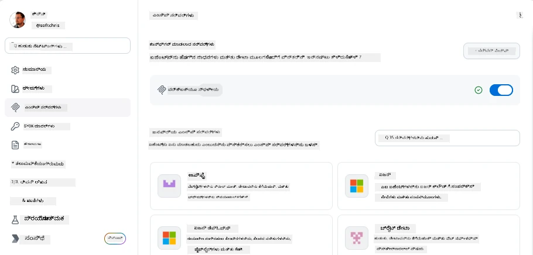
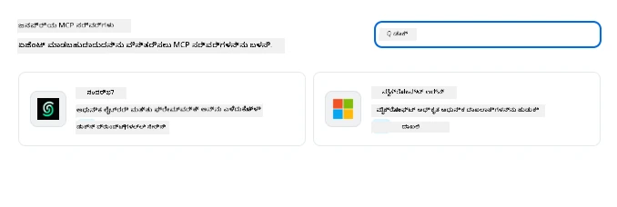
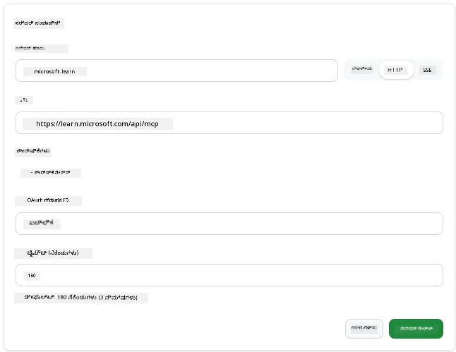
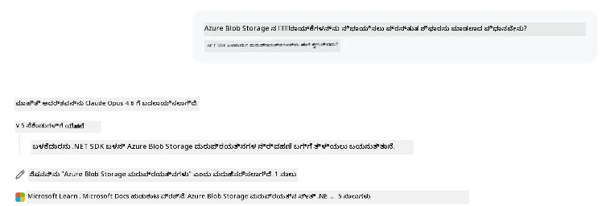
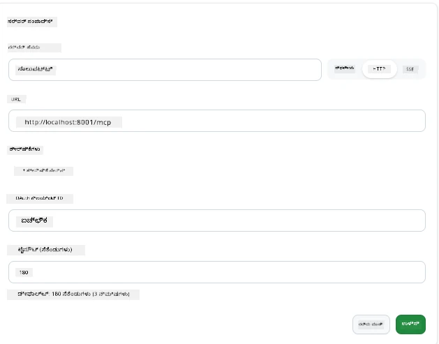
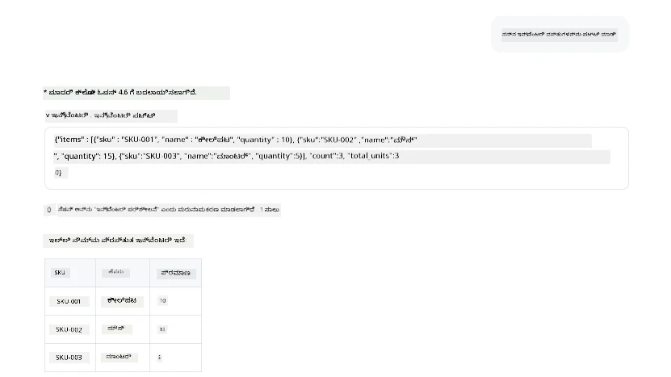
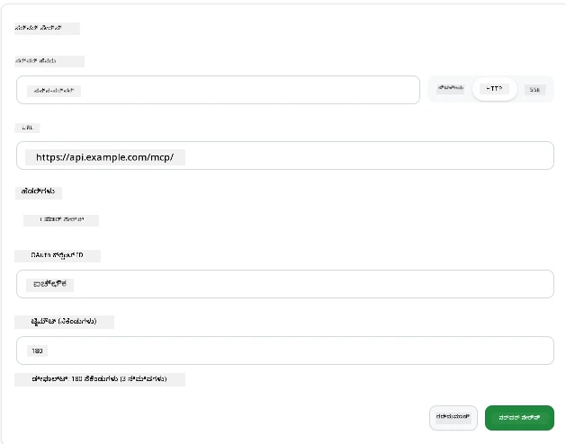
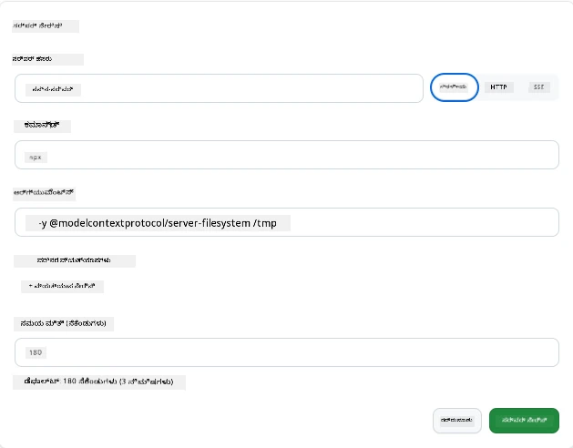

# GitHub Copilot ಅಪ್ಲಿಕೇಶನ್‌ನಲ್ಲಿ MCP ಸರ್ವರ್ಗಳನ್ನು ಬಳಸುವುದು

ಈಗಾಗಲೇ ನೀವು MCP ಹೇಗೆ ಕೆಲಸ ಮಾಡುತ್ತದೆ ಎಂದು ತಿಳಿದಿರುವಿರಿ. ನೀವು ಸರ್ವರ್‌ಗಳನ್ನು ನಿರ್ಮಿಸಿದ್ದೀರಿ, ಉಪಕರಣಗಳು ಮತ್ತು ಸಂಪನ್ಮೂಲಗಳನ್ನು ನಿರ್ಧರಿಸಿದ್ದೀರಿ ಮತ್ತು ಕ್ಲೈಂಟ್‌ಗಳನ್ನು ಕನೆಕ್ಟ್ ಮಾಡಿದ್ದೀರಿ. ನಾವು ಇನ್ನೂ ಮಾಡದಿರುವುದು ದೃಷ್ಟಿಕೋನವನ್ನು ತಿರುವು ಮಾಡುವುದಾಗಿದೆ: ನೀವು ಸರ್ವರ್ ಕಟ್ಟುತ್ತಿರುವವನಾಗಿದ್ದೀರಿ ಬದಲು, MCP ಬೆಂಬಲಿಸುವ AI ಚಾಲಿತ ಅಪ್ಲಿಕೇಶನ್ನಿನ ಬಳಕೆದಾರನಾಗಿ *ಬಳಕೆ ಮಾಡುವ* ಬದಿಯಿಂದ ಇದು ಹೇಗಿರುತ್ತದೆ?

[GitHub Copilot App](https://github.com/github/app) MCP ಸರ್ವರ್‌ಗಳನ್ನು ಬಳಸಿ ಬಹುದಾದ ಡೆಸ್ಕ್‌ಟಾಪ್ ಅಪ್ಲಿಕೇಶನಾಗಿದೆ. ಇದಕ್ಕೆ MCP ಸರ್ವರ್‌ಗಳನ್ನು ಸಂಪರ್ಕಿಸುವ ಮೂಲಕ ನೀವು ಹೊಸ ಮಟ್ಟವನ್ನು ಅನ್ಲಾಕ್ ಮಾಡುತ್ತೀರಿ: ನಿಮ್ಮ ಡಾಕ್ಯುಮೆಂಟ್‌ೇಷನ್, ಆಂತರಿಕ APIಗಳನ್ನು ಕರೆ ಮಾಡುವುದು, ಡೇಟಾಬೇಸ್‌ಗೆ ಪ್ರಶ್ನೆಿಸುವುದು ಅಥವಾ ನೀವು ಸರ್ವರ್‌ನಲ್ಲಿ ರ್ಯಾಪ್ ಮಾಡಿದ ಯಾವುದೇ ಸೇವೆಯನ್ನು ಸಂಪರ್ಕಿಸುವುದು. ಅಪ್ಲಿಕೇಶನ್ ಆತಿಥ್ಯ ನೀಡುವಹಾಗಿರುತ್ತದೆ; ನಿಮ್ಮ MCP ಸರ್ವರ್‌ಗಳು ಅದರ ಉಪಕರಣಗಳಾಗುತ್ತವೆ.

ಈ ಪಾಠವು ಆ ಅನುಭವವನ್ನು ಹಂತ ಹಂತವಾಗಿ ನಿಮಗೆ ತೋರಿಸುವುದು — MCP ಸೆಟ್ಟಿಂಗ್ಸ್ ಪ್ಯಾನೆಲ್ ಅನ್ನು ಹುಡುಕುವುದು, ನಿಜವಾದ ಡಾಕ್ಯುಮೆಂಟ್ ಸರ್ವರ್ ಅನ್ನು ಸಂಪರ್ಕಿಸುವುದು ಮತ್ತು ನಂತರ ನಿಮ್ಮದೇ ಕಸ್ಟಮ್ ಸರ್ವರ್ ಅನ್ನು ಸಂಪರ್ಕಿಸುವುದು.

## ಕಲಿಕೆ ಉದ್ದೇಶಗಳು

ಈ ಪಾಠದ ಕೊನೆಗೆ, ನೀವು ಮಾಡಬಹುದಾದವು:

- Copilot ಅಪ್ಲಿಕೇಶನ್ ಸೆಟ್ಟಿಂಗ್ಸ್‌ನಲ್ಲಿ MCP ಸರ್ವರ್ಸ್ ಪ್ಯಾನೆಲ್ ಅನ್ನು ಸಿಕ್ಕಿಸಿ ಮತ್ತು ಆತಂತ್ರಣ ಮಾಡಿ.
- ಆ್ಯಕ್ಸಸ್ ಹೊಂದಿದ ಡಾಕ್ಯುಮೆಂಟ್ ಸರ್ವರ್ ಅನ್ನು ಸಂಪರ್ಕಿಸಿ ಮತ್ತು ಸೆಷನ್‌ನಲ್ಲಿ ಬಳಸುವುದು.
- ಕಸ್ಟಮ್ ಸರ್ವರ್ ಅನ್ನು ನೋಂದಾಯಿಸಿ ಮತ್ತು Copilot ಅದರ ಉಪಕರಣಗಳನ್ನು ಕರೆ ಮಾಡಬಲ್ಲದು ಎಂದು ದೃಢೀಕರಿಸಿ.
- ಸರ್ವರ್ ಅನ್ನು ಹೇಗೆ ಕರೆಮಾಡುವುದು ಅನ್ನುವುದನ್ನು ವಾತಾವರಣ ಚರಗಳು ಅಥವಾ ಕಸ್ಟಮ್ ಹೆಡರ್‌ಗಳ ಮೂಲಕ (HTTP ಇದ್ದರೆ) ಸಂರಚಿಸಿ.

## MCP ಆತಿಥ್ಯವಾಗಿರುವ Copilot ಅಪ್ಲಿಕೇಶನ್

ಮೂಲಭೂತ ಕಲ್ಪನೆ ಇದು: **Copilot ನ ಏಜೆಂಟ್ಗಳು ನುಡಿಯಂತೆಯೇ ಸ್ಮಾರ್ಟ್, ಆದರೆ ನೀವು ಅವರಿಗೆ ಹೇಳಿದಷ್ಟೇ ತಿಳಿದುಕೊಳ್ಳುತ್ತಾರೆ.** ಸಾಮಾನ್ಯವಾಗಿ, ಏಜೆಂಟ್ ನಿಮ್ಮ ವರ್ಕ್‌ಸ್ಪೇಸ್‌ನ ಕಡತಗಳನ್ನು ಓದಲು ಮತ್ತು ಟರ್ಮಿನಲ್ ಆದೇಶಗಳನ್ನು ಕಾರ್ಯಗತಪಡಿಸಲು ಸಾಧ್ಯವಾಗುತ್ತದೆ, ಆದರೆ ಡೇಟಾಬೇಸ್‌ಗೆ ಪ್ರಶ್ನೆಿಸುವುದು, ಕ್ಯಾಲೆಂಡರ್ ನೋಡುವುದು, ಅಥವಾ ಕಸ್ಟಮ್ API ಅನ್ನು ಕರೆ ಮಾಡುವುದಕ್ಕೆ ಸಹಾಯವಿಲ್ಲ. ಅಲ್ಲಿ MCP ಸರ್ವರ್‌ಗಳು ಪ್ರತ್ಯೆಕ ಸೇತುವೆಗಳಾಗಿ ಕಾರ್ಯನಿರ್ವಹಿಸುತ್ತವೆ — Copilot ಮತ್ತು ನಿಮ್ಮ ವ್ಯವಸ್ಥೆಗಳ ಮಧ್ಯೆ — ಡೇಟಾಬೇಸ್‌ಗಳು, ಸಂಸ್ಕರಣಾ ನಿಯಂತ್ರಣೆ, APIಗಳು, ವಿನ್ಯಾಸ ಉಪಕರಣಗಳು — ಏಜೆಂಟ್‌ಗಳಿಗೆ ಕೆಲಸ ಮುಗಿಸಲು ಬೇಕಾದ ಮಾಹಿತಿಗೆ ಮತ್ತು ಕ್ರಿಯೆಗಳಿಗೆ ಪ್ರವೇಶ ನೀಡುತ್ತವೆ.

ನಿಮ್ಮ ಅಪ್ಲಿಕೇಶನ್ MCP ಸರ್ವರ್‌ಗಳನ್ನು ನಿರ್ವಹಿಸುವ ಸೆಟ್ಟಿಂಗ್ಸ್ ಹುಡುಕудан ಶುರು ಮಾಡೋಣ.

## ಹಂತ 1: MCP ಸೆಟ್ಟಿಂಗ್ಸ್ ಪ್ಯಾನೆಲ್ ಹುಡುಕುವುದು

Copilot ಅಪ್ಲಿಕೇಶನ್ ತೆರೆದು ಕೆಳಗಡೆಯಲ್ಲಿ ಎಡ ಬದಿ ಇದ್ದ ಕಾಗ್ ಐಕಾನ್ ಅನ್ನು ಪಡೆಯಿರಿ ಮತ್ತು ಅದನ್ನು ಕ್ಲಿಕ್ ಮಾಡಿ.


"MCP Servers" ಆಯ್ಕೆಮಾಡಿ. ಈಗ ನೀವು ಮೇಲ್ಭಾಗದಲ್ಲಿ ನಿಮ್ಮ ಈಗಾಗಲೇ ಸಂರಚಿತ ಸರ್ವರ್‌ಗಳು, ಕೆಳಭಾಗದಲ್ಲಿ ಜನಪ್ರಿಯ ಸರ್ವರ್‌ಗಳ ಮಾರುಕಟ್ಟೆ ಮತ್ತು ಮೇಲ್ಭಾಗದಲ್ಲಿ "Add Server" ಬಟನ್ ಅನ್ನು ನೋಡಬಹುದು:



ಇದು ನಿಮ್ಮ ನಿಯಂತ್ರಣ ಕೇಂದ್ರ. ನೀವು ಸರ್ವರ್‌ಗಳನ್ನು ಸೇರಿಸಲು, ತೆಗೆದುಹಾಕಲು, ಸಕ್ರಿಯ ಅಥವಾ ನಿಷ্ক್ರಿಯಗೊಳಿಸಲು ಇಲ್ಲಿ ಮಾಡಬಹುದು. ಬದಲಾವಣೆಗಳು ಹೊಸ ಸೆಷನ್‌ಗಳಿಗೆ ಪರಿಗಣನೆಗೆ ಬರುತ್ತವೆ; ಸೆಷನ್ ತೆರೆಯಬೇಕಾದಾಗ ನೀವು ಹೊಸದು ಆರಂಭಿಸಬೇಕಾಗುತ್ತದೆ.

## ಹಂತ 2: ಡಾಕ್ಯುಮೆಂಟ್ ಸರ್ವರ್ ಸಂಪರ್ಕಿಸುವುದು

ತಕ್ಷಣ ಉಪಯುಕ್ತವಾದ ಕೆಲಸವನ್ನು ಮಾಡೋಣ. Microsoft Docs MCP ಸರ್ವರ್ Copilotಗೆ ಅಧಿಕೃತ Microsoft ಡಾಕ್ಯುಮೆಂಟ್‌ಷನ್‌ಗಳಿಗೆ ಪ್ರವೇಶ ನೀಡುತ್ತದೆ. ಇದರಲ್ಲಿ Azure, .NET, TypeScript ಮತ್ತು ಮತ್ತಿಬೇಕು. ಏಜೆಂಟ್ ತನ್ನ ತರಬೇತಿನ ಡೇಟಾದ ಮೇಲೆ ಅವಲಂಬಿಸಿ (ಕಟ್‌ಆಫ್ ದಿನಾಂಕ ಹೊಂದಿರುವುದು), ಬದಲಾಗಿ ಪ್ರಸ್ತುತ ಡಾಕ್ಯುಮೆಂಟ್‌ಗಳನ್ನು ಕರೆ ಮಾಡಬಹುದು.

ಇದನ್ನು ಸೇರಿಸುವುದು ಹೀಗೆ:

1. ಜನಪ್ರಿಯ ಸರ್ವರ್ ಗ್ರೀಡಿನಲ್ಲಿ **learn** ಅನ್ನು ಟೈಪ್ ಮಾಡಿ, "Microsoft Learn" ಎಂಬ ಸರ್ವರ್ ಆಯ್ಕೆಮಾಡಿ.

   

   ಕ್ಲಿಕ್ ಮಾಡಿದ ಮೇಲೆ, ಹೆಸರು, ಬೈಕಾಬ್ ಪ್ರಕಾರ ಮತ್ತು URL ಪೂರ್ವನಿರ্ধರಿತವಾಗಿರುವ ಫಾರ್ಮ್ ಅನ್ನು ತೋರಿಸುತ್ತದೆ. ನೀವು "Add Server" ಕ್ಲಿಕ್ ಮಾಡಬೇಕಾಗುತ್ತದೆ.

2. "Add Server" ಕ್ಲಿಕ್ ಮಾಡಿ, ಸರ್ವರ್ ಗೆ ಸಂಪರ್ಕ ತೋರುವಲ್ಲಿ ಕೆಲವು ಸೆಕೆಂಡುಗಳು ತೆಗೆದುಕೊಳ್ಳಬಹುದು.

   

3. ಸೇರ್ಪಡೆಗೊಂಡ ಮೇಲೆ ಮೇಲ್ಭಾಗದಲ್ಲಿ ಸಂರಚಿತ ಸರ್ವರ್ ಆಗಿ ಕಾಣಿಸಿಕೊಳ್ಳುತ್ತದೆ. ಮುಂದಿನ ಹಂತದಲ್ಲಿ ಪ್ರಯತ್ನಿಸೋಣ.

4. ಡೈಲಾಗ್ ಅನ್ನು ಮುಚ್ಚಿ ಮತ್ತು Quick chat ಆಯ್ಕೆಮಾಡಿ.

5. ಕೆಳಗಿನ ಪ್ರಾಂಪ್ಟ್ ಅನ್ನು ಟೈಪ್ ಮಾಡಿ, Microsoft Learn ಸರ್ವರ್‌ನ ಉಪಕರಣವನ್ನು ಟ್ರಿಗರ್ ಮಾಡಲಾಗುತ್ತದೆ.

   ```text
   What's the current recommended approach for handling Azure Blob Storage 
   retries using the .NET SDK?
   ```

   

ನೀವು ಈಗ ನಾವು ಸೇರಿಸಿದ MCP ಸರ್ವರ್ ಅನ್ನು ಹೇಗೆ ಉಲ್ಲೇಖಿಸುತ್ತಾಳೆ ಎಂದು ನೋಡಬಹುದು.

## ಹಂತ 3: ಕಸ್ಟಮ್ stdio ಸರ್ವರ್ ಸಂಪರ್ಕಿಸುವುದು

ಪ್ರೀಸೆಟ್‌ಗಳು ಅನುಕೂಲಕರವಾಗಿವೆ, ಆದರೆ ನಿಜವಾದ ಶಕ್ತಿ ನಿಮ್ಮದೇ ಸರ್ವರ್‌ಗಳನ್ನು ಸಂಪರ್ಕಿಸುವುದರಲ್ಲಿ ಇದೆ. ನೀವು ನಿಮ್ಮ ಆಂತರಿಕ API ಅಥವಾ ಕಂಪನಿಯ ಜ್ಞಾನ ಪ್ರಮುಖವನ್ನು ಪ್ರದರ್ಶಿಸುವ ಸರ್ವರ್ ಅನ್ನು ನಿರ್ಮಿಸಿದೆ ಎಂದು ಹೇಳಿ. ಈ ಸಂದರ್ಭದಲ್ಲಿ ನಾವು ನಿರ್ಮಿಸಿದ MCP ಸರ್ವರ್ ಅನ್ನು ಬಳಸಿ ಕಂಪನಿಯ ಇನ್‌ವೆಂಟರಿ ನಿರ್ವಹಣೆಯನ್ನು ನೋಡೋಣ.

1. ಕಾಗ್ ಕ್ಲಿಕ್ ಮಾಡಿ ಮತ್ತೊಮ್ಮೆ "MCP servers" ಆಯ್ಕೆಮಾಡಿ.

2. "Add Server" ಮತ್ತು "+ Add Custom server" ಆಯ್ಕೆ ಮಾಡಿ. ಕೆಳಗಿನ ಮೌಲ್ಯಗಳನ್ನು ನೀಡಿ:

   - ಹೆಸರು: `Inventory Server`
   - ಬಲಬದಿ ಶೋರ್ಟ್ಕಟ್ ಇಡೋಣ, **http**

   "Add Server" ಆಯ್ಕೆಮಾಡಿ, ಇದು ನಿಮ್ಮ ಸಂರಚಿಸಿದ ಸರ್ವರ್ ಪಟ್ಟಿ‌ನಲ್ಲಿ ಕಾಣಿಸುವುದು.

   

3. ಪ್ರಯತ್ನಿಸಲು, ಈ ಕೆಳಗಿನ ಪ್ರಾಂಪ್ಟ್ ನ್ನು ಬಳಸಿರಿ:

    ```
    list inventory
    ```

   

ನೀವು ಈಗ ನಿಮ್ಮ ಕಸ್ಟಮ್ ಸರ್ವರ್‌ನಿಂದ ಇನ್‌ವೆಂಟರಿ ಐಟಂಗಳ ಪಟ್ಟಿ ನೋಡಬಹುದು.

ಚೆನ್ನಾಗಿದ್ದು, ನೀವು ಈಗ Copilot ಅಪ್ಲಿಕೇಶನ್‌ಗೆ ಹೊರಗಿನ ಮತ್ತು ನಿಮ್ಮದೇ MCP ಸರ್ವರ್‌ಗಳನ್ನು ಸೇರಿಸುವ ಬಗ್ಗೆ ಚೆನ್ನಾಗಿ ತಿಳಿದಿದ್ದೀರಿ. ಮುಂದಿನದಾಗಿ ಗುಪ್ತಚರಿಕೆ ಮತ್ತು ವಾತಾವರಣ ಚರಗಳನ್ನು ನಿರ್ವಹಿಸುವುದನ್ನು ನೋಡೋಣ.

## ಹಂತ 4: ಹೆಚ್ಚಾದ ಸೆಟ್ಟಿಂಗ್ಸ್

ಈ ವರೆಗೆ, ನೀವು ಹೆಸರು ಮತ್ತು URL ಮಾತ್ರ ನೀಡಿ MCP ಸರ್ವರ್‌ಗಳನ್ನು ಸೇರಿಸುವುದನ್ನು ನೋಡಿದ್ದೀರಿ. ಆದರೆ ನಿಮ್ಮ ಸರ್ವರ್‌ಗೆ API ಕೀ ಅಥವಾ ಇನ್ನೊಂದು ಮೌಲ್ಯ ಬೇಕಾದರೆ? ಬಸ್, ಬಾಹ್ಯ ಸಂಗ್ರಹಣಾ ವಿಧಾನದ ಪ್ರಕಾರ ನಾವು ಅಗತ್ಯವಿರುವ ಮೌಲ್ಯಗಳನ್ನು ಒದಗಿಸಬಹುದು.

- **http ಅಥವಾ SSE ಸಂಗ್ರಹಣೆ**: ನಾವು ಬೇಕಾದಂತೆ ಹೆಡರ್‌ಗಳನ್ನು ಹೊಂದಿಸಬಹುದು.

   ಪ್ರಾಮಾಣೀಕರಣಕ್ಕಾಗಿ, ಉದಾಹರಣೆಗೆ Authorization ಹೆಡರ್ ಅನ್ನು ಸೂಚಿಸಬಹುದು. ಮೌಲ್ಯ ಸ್ಥಿರ ಸ್ಟ್ರಿಂಗ್ ಆಗಿರಬಹುದು. ನೀವು OAuth ಬಳಸಿದರೆ, ಅದಕ್ಕೆ ಬದಲಿ OAuth ಕ್ಲೈಂಟ್ ID ಒದಗಿಸಬಹುದು.

   

- **stdio ಸಂಗ್ರಹಣೆ**: ವಾತಾವರಣ ಚರಗಳು (environment variables) ಅನ್ನು ಕಾನ್ಫಿಗರ್ ಮಾಡಬಹುದು.

   ನೀವು ಸರ್ವರ್ ಪ್ರಾರಂಭಿಸುವಾಗ ಈ ವಾತಾವರಣ ಚರಗಳನ್ನು ಬಳಸಿ ಸರ್ವರ್‌ಗೆ ಆ ಹಾಕಬಹುದು.

   

## ಸಾರಾಂಶ

Copilot ಅಪ್ಲಿಕೇಶನ್ MCP ಸರ್ವರ್‌ಗಳನ್ನು ಏಜೆಂಟ್‌ಗಳ ಸಾಮರ್ಥ್ಯದ ಪ್ರಥಮ ದರ್ಜೆಯ ವಿಸ್ತರಣೆಯಂತೆ ತಿಳಿಸುತ್ತದೆ. ನೀವು ಈ ಪಾಠದಲ್ಲಿ MCP ಸರ್ವರ್‌ಗಳನ್ನು ಸೇರಿಸುವುದರಿಂದ ಮುಂದೆ ದಾಖಲಿಸುವವರೆಗಿನ ಪ್ರಯಾಣವನ್ನು ಸಂಪೂರ್ಣವಾಗಿ ನೋಡಿದ್ದೀರಿ. ನೀವು ಸಾರ್ವಜನಿಕ ಸರ್ವರ್‌ಗಳು, ಆಂತರಿಕ APIಗಳು ಮತ್ತು ಕಸ್ಟಮ್ ಉಪಕರಣಗಳನ್ನು ಸಂಪರ್ಕಿಸಬಹುದು, ನಿಮ್ಮ ಏಜೆಂಟ್‌ಗಳಿಗೆ ಸ್ವತಂತ್ರವಾಗಿ ಕಾರ್ಯಗಳನ್ನು ಪೂರ್ಣಗೊಳಿಸಲು ಅಗತ್ಯವಿರುವ ಮಾಹಿತಿ ಮತ್ತು ಕ್ರಿಯೆಗಳಿಗೆ ಪ್ರವೇಶವನ್ನು ನೀಡುತ್ತೀರಿ.

## 📚 ಹೆಚ್ಚುವರಿ ಸಂಪನ್ಮೂಲಗಳು

### ಅಧಿಕೃತ ಡಾಕ್ಯುಮೆಂಟ್‌ಗಳು

- [GitHub Copilot App](https://github.com/github/app)
- [MCP Specification](https://modelcontextprotocol.io/specification/2025-03-26) - ಮಾದರಿ ಸಾಂದರ್ಭಿಕ ಪ್ರೋಟೋಕಾಲ್ ವಿಧಿ

### ಸಮುದಾಯ
- [MCP Community Discord](https://discord.com/invite/ByRwuEEgH4) - ಲೈವ್ ಚರ್ಚೆಗಳು
- [GitHub Discussions](https://github.com/microsoft/MCP-Server-and-PostgreSQL-Sample-Retail/discussions) - ಪ್ರಶ್ನೆ ಮತ್ತು ಉತ್ತರ ಹಾಗೂ ಹಂಚಿಕೆ
- [Stack Overflow](https://stackoverflow.com/questions/tagged/model-context-protocol) - ತಾಂತ್ರಿಕ ಪ್ರಶ್ನೆಗಳು

---

<!-- CO-OP TRANSLATOR DISCLAIMER START -->
**ಅಸ್ವೀಕಾರ**:
ಈ ದಸ್ತಾವೇಜು AI ಅನುವಾದ ಸೇವೆ [Co-op Translator](https://github.com/Azure/co-op-translator) ಬಳಸಿ ಅನುವಾದಿಸಲಾಗಿದೆ. ನಾವು ನಿಖರತೆಯನ್ನು ಸಾಧಿಸಲು ಪ್ರಯತ್ನಿಸುತ್ತಿದ್ದರೂ, ದಯವಿಟ್ಟು ಗಮನಿಸಿ, ಸ್ವಯಂಚಾಲಿತ ಅನುವಾದಗಳಲ್ಲಿ ದೋಷಗಳು ಅಥವಾ ಅಸಡ್ಡೆಗಳು ಇರಬಹುದು. ಮೂಲ ಭಾಷೆಯಲ್ಲಿರುವ ಮೂಲ ದಸ್ತಾವೇಜು ಪ್ರಾಮಾಣಿಕ ಮೂಲವೆಂದು ಪರಿಗಣಿಸಬೇಕು. ಪ್ರಮುಖ ಮಾಹಿತಿಗಾಗಿ, ವೃತ್ತಿಪರ ಮಾನವ ಅನುವಾದವನ್ನು ಶಿಫಾರಸು ಮಾಡಲಾಗುತ್ತದೆ. ಈ ಅನುವಾದವನ್ನು ಬಳಸುವ ಮೂಲಕ ಉಂಟಾಗುವ ಯಾವುದೇ ತಪ್ಪು ಅರ್ಥಗಳ ಅಥವಾ ತಪ್ಪು ವ್ಯಾಖ್ಯಾನಗಳ ಬಗ್ಗೆ ನಾವು ಹೊಣೆಗಾರರಲ್ಲ.
<!-- CO-OP TRANSLATOR DISCLAIMER END -->