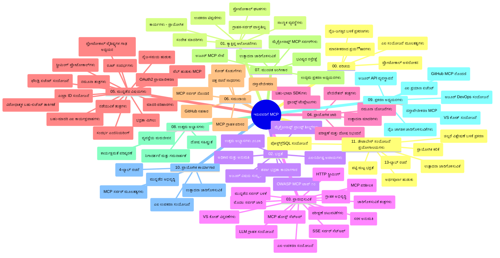

# ಆರಂಭಿಕರಿಗಾಗಿ ಮಾದರಿ ಸಾಂದರ್ಭಿಕ ಪ್ರೋಟೋಕಾಲ್ (MCP) - ಅಧ್ಯಯನ ಮಾರ್ಗದರ್ಶನ

ಈ ಅಧ್ಯಯನ ಮಾರ್ಗದರ್ಶನವು "ಆರಂಭಿಕರಿಗಾಗಿ ಮಾದರಿ ಸಾಂದರ್ಭಿಕ ಪ್ರೋಟೋಕಾಲ್ (MCP)" ಕಲಿಕೆಯ ಕಾರ್ಯಕ್ರಮದಿಗಾಗಿ ರೆಪೊಸಿಟರಿ ರಚನೆ ಮತ್ತು ವಿಷಯದ ಒವರ್ವ್ಯೂ ಅನ್ನು ನೀಡುತ್ತದೆ. ಈ ಮಾರ್ಗದರ್ಶನವನ್ನು ರೆಪೊಸಿಟರಿಯನ್ನು ಪರಿಣಾಮಕಾರಿಯಾಗಿ ನ್ಯಾವಿಗೇಟ್ ಮಾಡಲು ಮತ್ತು ಲಭ್ಯವಿರುವ ಸಂಪನ್ಮೂಲಗಳ ಅತ್ಯುತ್ತಮ ಪ್ರಯೋಜನವನ್ನು ಪಡೆಯಲು ಬಳಸಿ.

## ರೆಪೊಸಿಟರಿ ಒವರ್ವ್ಯೂ

ಮಾದರಿ ಸಾಂದರ್ಭಿಕ ಪ್ರೋಟೋಕಾಲ್ (MCP) ಎಂಬುದು AI ಮಾದರಿಗಳು ಮತ್ತು ಕ್ಲೈಂಟ್ ಅಪ್ಲಿಕೇಶನ್‌ಗಳ ನಡುವೆ ಸಂವಹನಕ್ಕಾಗಿ ಸ್ತರೀಕೃತ ಫ್ರೇಮ್ವರ್ಕ್ ಆಗಿದೆ. ಪ್ರಾರಂಭದಲ್ಲಿ Anthropic ರಚಿಸಿದ MCP ಅನ್ನು ಇತ್ತೀಚೆಗೆ ಅಧಿಕೃತ GitHub ಸಂಘಟನೆಯ ಮೂಲಕ MCP ಸಮುದಾಯದಲ್ಲಿ ನಿರ್ವಹಿಸಲಾಗುತ್ತಿದೆ. ಈ ರೆಪೊಸಿಟರಿ C#, Java, JavaScript, Python ಮತ್ತು TypeScript ನಲ್ಲಿ ಕೈಯಲ್ಲಿ ಮಾಡುವ ಕೋಡ್ ಉದಾಹರಣೆಗಳೊಂದಿಗೆ ಸುಲಭವಾಗಿ ಕಲಿಯಬಹುದಾದ ಸಮಗ್ರ ಪಠ್ಯಕ್ರಮವನ್ನು ಒದಗಿಸುತ್ತದೆ, ಇದು AI ಅಭಿವೃದ್ಧಿಪಡಿಸುವವರು, ವ್ಯವಸ್ಥೆಯ ಆರ್ಕಿಟೆಕ್ಟ್‌ಗಳು ಮತ್ತು ಸಾಫ್ಟ್‌ವೇರ್ ಎಂಜಿನಿಯರ್‌ಗಳಿಗೆ ವಿನ್ಯಾಸಗೊಳಿಸಲಾಗಿದೆ.

## ದೃಶ್ಯ ಪಠ್ಯಕ್ರಮ ನಕ್ಷೆ

## ರೆಪೊಸಿಟರಿ ರಚನೆ

ರೆಪೊಸಿಟರಿ ಓರಡನೆ ಹತ್ತೊಂದು ಮುಖ್ಯ ವಿಭಾಗಗಳಾಗಿ ವಿಂಗಡಿಸಲಾಗಿದೆ, ಪ್ರತಿ ವಿಭಾಗವು MCP ಮೂಲಕ ವಿಭಿನ್ನ ಅಂಶಗಳನ್ನು ಕೇಂದ್ರೀಕರಿಸುತ್ತದೆ:

1. **ಪರಿಚಯ (00-Introduction/)**
   - ಮಾದರಿ ಸಾಂದರ್ಭಿಕ ಪ್ರೋಟೋಕಾಲ್ ಪರಿಚಯ
   - AI ಪೈಪ್‌ಲೈನ್ಗಳಲ್ಲಿ ಮಾನಕೀಕರಣದ ಮಹತ್ವ
   - ಪ್ರಾಯೋಗಿಕ ಉಪಯೋಗಗಳು ಮತ್ತು ಲಾಭಗಳು

2. **ಮೂಲ ತತ್ವಗಳು (01-CoreConcepts/)**
   - ಕ್ಲೈಂಟ್-ಸರ್ವರ್ ವಾಸ್ತುಶಿಲ್ಪ
   - ಪ್ರಮುಖ ಪ್ರೋಟೋಕಾಲ್ ಅಂಗಾಂಶಗಳು
   - MCP ನಲ್ಲಿ ಸಂದೇಶPatterns

3. **ಸುರಕ್ಷತೆ (02-Security/)**
   - MCP ಆಧಾರಿತ ವ್ಯವಸ್ಥೆಗಳ ಭದ್ರತಾ ಅಪಾಯಗಳು
   - ಅನುಷ್ಠಾನದ ಭದ್ರತೆಗಾಗಿ ಉತ್ತಮ ಅಭ್ಯಾಸಗಳು
   - ಪ್ರಾಮಾಣೀಕತ ಮತ್ತು ಹಕ್ಕಿನ ನಿಯಂತ್ರಣ ತಂತ್ರಗಳು
   - **ಸಮಗ್ರ ಭದ್ರತಾ ದಸ್ತಾವೇಜು**:
     - MCP ಭದ್ರತಾ ಉತ್ತಮ ಅಭ್ಯಾಸಗಳು 2025
     - ಅಜೂರ್ ಕಂಟೆಂಟ್ ಸೆಫ್ಟಿ ಅನುಷ್ಠಾನ ಮಾರ್ಗದರ್ಶನ
     - MCP ಭದ್ರತಾ ನಿಯಂತ್ರಣಗಳು ಮತ್ತು ತಂತ್ರಗಳು
     - MCP ಉತ್ತಮ ಅಭ್ಯಾಸಗಳು ಶೀಘ್ರ సూచನೆ
   - **ಪ್ರಮುಖ ಭದ್ರತಾ ವಿಷಯಗಳು**:
     - ಪ್ರಾಂಪ್ಟ್ ಇಂಜೆಕ್ಷನ್ ಮತ್ತು ಉಪಕರಣ ವಿಷಕಾರಕ ದಾಳಿಗಳು
     - ಸೆಷನ್ ಹೈಜ್ಯಾಕಿಂಗ್ ಮತ್ತು ಗೊಂದಲಗೊಳಿಸಿದ ಡೆಪ್ಯೂ ಸಮಸ್ಯೆಗಳು
     - ಟೋಕೆನ್ ಪಾಸ್ತ್ರೂ ದೌರ್ಬಲ್ಯಗಳು
     - ಜಾಸ್ತಿ ಅನುಮತಿಗಳು ಮತ್ತು ಪ್ರವೇಶ ನಿಯಂತ್ರಣ
     - AI ಘಟಕಗಳ ಸರಬರಾಜು ಸರಣಿ ಭದ್ರತೆ
     - ಮೈಕ್ರೋಸಾಫ್ಟ್ ಪ್ರಾಂಪ್ಟ್ ಶೀಲ್ಡ್‌ಗಳ ಸಮ್ಮಿಲನ

4. **ಪ್ರಾರಂಭಿಸುವುದು (03-GettingStarted/)**
   - ಪರಿಸರ ಸಿದ್ಧತೆ ಮತ್ತು ಸಂರಚನೆ
   - ಮೂಲ MCP ಸರ್ವರ್ ಮತ್ತು ಕ್ಲೈಂಟ್ ನಿರ್ಮಾಣ
   - ಇರುವ ಅಪ್ಲಿಕೇಶನ್‌ಗಳೊಂದಿಗೆ ಏಕರೂಪಗೊಳಿಸುವಿಕೆ
   - ಒಳಗೊಂಡಿವೆ:
     - ಮೊದಲ ಸರ್ವರ್ ಅನುಷ್ಠಾನ
     - ಕ್ಲೈಂಟ್ ಅಭಿವೃದ್ಧಿ
     - LLM ಕ್ಲೈಂಟ್ ಏಕರೂಪತೆ
     - VS ಕೋಡ್ ಏಕರೂಪತೆ
     - ಸರ್ವರ್-ಸೇಂಟ್ ಇವೆಂಟ್ಸ್ (SSE) ಸರ್ವರ್
     - ಉನ್ನತ ಸರ್ವರ್ ಬಳಕೆ
     - HTTP ಸ್ಟ್ರೀಮಿಂಗ್
     - AI ಟೂಲ್ಕಿಟ್ ಏಕರೂಪತೆ
     - ಪರೀಕ್ಷಾ ತಂತ್ರಗಳು
     - ನಿಯೋಜನೆ ಮಾರ್ಗದರ್ಶನ

5. **ಪ್ರಾಯೋಗಿಕ ಅನುಷ್ಠಾನ (04-PracticalImplementation/)**
   - ವಿಭಿನ್ನ ಪ್ರೋಗ್ರಾಮಿಂಗ್ ಭಾಷೆಗಳಲ್ಲಿ SDK ಉಪಯೋಗಿಸುವುದು
   - ಡಿಬಗ್, ಪರೀಕ್ಷೆ ಮತ್ತು ಮಾನ್ಯತೆ ತಂತ್ರಗಳು
   - ಮರುಬಳಕೆ ಮಾಡಬಹುದಾದ ಪ್ರಾಂಪ್ಟ್ ಟೆಂಪ್ಲೇಟು ಮತ್ತು ವರ್ಕ್‌ಫ್ಲೋ ನಿರ್ಮಾಣ
   - ಅನುಷ್ಠಾನ ಉದಾಹರಣೆಗಳೊಂದಿಗೆ ಮಾದರಿ ಯೋಜನೆಗಳು

6. **ಉನ್ನತ ವಿಷಯಗಳು (05-AdvancedTopics/)**
   - ಸಾಂದರ್ಭಿಕ ಎಂಜಿನಿಯರಿಂಗ್ ತಂತ್ರಗಳು
   - ಫೌಂಡ್ರಿ ಏಜೆಂಟ್ ಏಕರೂಪತೆ
   - ಬಹು ಮಾದರಿ AI ವರ್ಕ್‌ಫ್ಲೋಗಳು
   - OAuth2 ಪ್ರಾಮಾಣೀಕರಣ ಡೆಮೋಗಳು
   - ಲೈವ್ ಹುಡುಕಾಟ ಯುಕ್ತಿಗಳು
   - ಲೈವ್ ಸ್ಟ್ರೀಮಿಂಗ್
   - ರೂಟ್ ಸಾಂದರ್ಭಗಳು ಅನುಷ್ಠಾನ
   - ಮಾರ್ಗ ನಿರ್ವಹಣಾ ತಂತ್ರಗಳು
   - ಸಮೀಪಣ (ಸೆಂಪ್ಲಿಂಗ್) ತಂತ್ರಗಳು
   - ಮಾಪಕತೆ ಗುರ್ತಿಸುವುದು
   - ಭದ್ರತಾ ಪರಿಗಣನೆಗಳು
   - Entra ID ಭದ್ರತಾ ಏಕರೂಪತೆ
   - ವೆಬ್ ಹುಡುಕಾಟ ಏಕರೂಪತೆ
   - ವೈರಾದ್ವಿತ ಬಹು ಏಜೆಂಟ್ ಯುಕ್ತಿ (ತರ್ಕ ಮಾದರಿಗಳು)

7. **ಸಮುದಾಯ ಕೊಡುಗೆಗಳು (06-CommunityContributions/)**
   - ಕೋಡ್ ಮತ್ತು ದಸ್ತಾವೇಜುಗಳಿಗೆ ಹೇಗೆ ಕೊಡುಗೆ ನೀಡುವುದು
   - GitHub ಮೂಲಕ ಸಹಯೋಗ
   - ಸಮುದಾಯ ಸಂಚಾಲಿತ ಸುಧಾರಣೆಗಳು ಮತ್ತು ಪ್ರತಿಕ್ರಿಯೆ
   - ವಿವಿಧ MCP ಕ್ಲೈಂಟ್ ಗಳ ಬಳಕೆ (Claude ಡೆಸ್ಕ್‌ಟಾಪ್, Cline, VSCode)
   - ಜನಪ್ರಿಯ MCP ಸರ್ವರ್‌ಗಳೊಂದಿಗೆ ಕೆಲಸ ಮಾಡುವುದು ಚಿತ್ರ ಉತ್ಪಾದನೆ ಸೇರಿದಂತೆ

8. **ಆರಂಭಿಕ ಸ್ವೀಕಾರದಿಂದ ಪಾಠಗಳು (07-LessonsfromEarlyAdoption/)**
   - ವಾಸ್ತವಿಕ ಅನುಷ್ಠಾನ ಮತ್ತು ಯಶೋಗಾಥೆಗಳು
   - MCP ಆಧಾರಿತ ಪರಿಹಾರಗಳ ನಿರ್ಮಾಣ ಮತ್ತು ನಿಯೋಜನೆ
   - ಪ್ರವೃತ್ತಿಗಳು ಮತ್ತು ಭವಿಷ್ಯದ ಪಥಸೂಚಿ
   - **ಮೈಕ್ರೋಸಾಫ್ಟ್ MCP ಸರ್ವರ್ ಮಾರ್ಗದರ್ಶಿ**: 10 ಉತ್ಪಾದನಾ ತಯಾರ MCP ಸರ್ವರ್‌ಗಳ ಸಮಗ್ರ ಮಾರ್ಗದರ್ಶನ, ಅಂತರ್ಗತ:
     - Microsoft Learn Docs MCP Server
     - Azure MCP Server (15+ ವಿಶೇಷ ಸಂಪರ್ಕಗಳು)
     - GitHub MCP Server
     - Azure DevOps MCP Server
     - MarkItDown MCP Server
     - SQL Server MCP Server
     - Playwright MCP Server
     - Dev Box MCP Server
     - Microsoft Foundry MCP Server
     - Microsoft 365 Agents Toolkit MCP Server

9. **ಉತ್ತಮ ಅಭ್ಯಾಸಗಳು (08-BestPractices/)**
   - ಕಾರ್ಯಕ್ಷಮತೆ ಟುನಿಂಗ್ ಮತ್ತು ಉತ್ತಮೀಕರಣ
   - ದೋಷ ಸಹಿಷ್ಣುತಾಪೂರ್ಣ MCP ವ್ಯವಸ್ಥೆಗಳ ವಿನ್ಯಾಸ
   - ಪರೀಕ್ಷೆ ಮತ್ತು ಪ್ರತಿರೋಧ ತಂತ್ರಗಳು

10. **ಕೇಸು ಅಧ್ಯಯನಗಳು (09-CaseStudy/)**
    - MCP ವಿವಿಧ ಸಂದರ್ಭಗಳಲ್ಲಿ ಹಲವಾರು ಸವಾರು ಬಳಸಿಕೊಳ್ತಿದ **ಏಳು ಸಮಗ್ರ ಕೇಸು ಅಧ್ಯಯನಗಳು**:
    - **ಅಜೂರ್ AI ಪ್ರಯಾಣ ಏಜೆಂಟ್‌ಗಳು**: ಅಜೂರ್ OpenAI ಮತ್ತು AI ಹುಡುಕಾಟದೊಂದಿಗೆ ಬಹು ಏಜೆಂಟ್ ವ್ಯವಸ್ಥೆ
    - **ಅಜೂರ್ DevOps ಏಕರೂಪತೆ**: YouTube ಡೇಟಾ ನವೀಕರಣದೊಂದಿಗೆ ಕಾರ್ಯಪ್ರವಾಹ ಶೃಂಗ
    - **ಲೈವ್ ದಸ್ತಾವೇಜು ಪಡೆದುಕೊಳ್ಳುವುದು**: Python ಕಾಗ್ನೋಲ್ ಕ್ಲೈಂಟ್‌ ಮತ್ತು HTTP ಸ್ಟ್ರೀಮಿಂಗ್
    - **ಪರಸ್ಪರ ಸಂವಾದದ ಅಧ್ಯಯನ ಯೋಜನೆಯ ಜನರೇಟರ್**: Chainlit ವೆಬ್ ಅಪ್ಲಿಕೇಶನ್ ಸಂವಾದಾತ್ಮಕ AI ಜೊತೆಗೆ
    - **ಇನ್-ಎಡಿಟರ್ ದಸ್ತಾವೇಜು**: VS ಕೋಡ್ GitHub Copilot ವರ್ಕ್‌ಫ್ಲೋಗಳೊಂದಿಗೆ ಏಕರೂಪತೆ
    - **ಅಜೂರ್ API ನಿರ್ವಹಣೆ**: MCP ಸರ್ವರ್ ನಿರ್ಮಾಣದೊಂದಿಗೆ ಎಂಟರ್ಪ್ರೈಸ್ API ಏಕರೂಪತೆ
    - **GitHub MCP ರೆಜಿಸ್ಟ್ರೀ**: ಪರಿಕಲ್ಪನೆ ಅಭಿವೃದ್ಧಿ ಮತ್ತು ಏಜೆಂಟಿಕ್ ಏಕರೂಪತೆಯ ವೇದಿಕೆ
    - ಎಂಟರ್ಪ್ರೈಸ್ ಏಕರೂಪತೆ, ಡೆವಲಪರ್ ಉತ್ಪಾದಕತೆ ಮತ್ತು ಪರಿಸರ ಅಭಿವೃದ್ಧಿಯ ಉದಾಹರಣೆಗಳು

11. **ಹಸ್ತಕ್ಷೇಪ ಕಾರ್ಯಾಗಾರ (10-StreamliningAIWorkflowsBuildingAnMCPServerWithAIToolkit/)**
    - MCP ಮತ್ತು AI ಟೂಲ್ಕಿಟ್ ಸಂಯೋಜನೆಯೊಂದಿಗೆ ಸಮಗ್ರ ಹಸ್ತಕ್ಷೇಪ ಕಾರ್ಯಾಗಾರ
    - AI ಮಾದರಿಗಳನ್ನು ವಾಸ್ತುಶಿಲ್ಪ ಹಾಗೂ ಯಥಾರ್ಥಿಕ ಸಾಧನಗಳೊಂದಿಗೆ ಸೇರುವ ಬುದ್ಧಿವಂತ ಅಪ್ಲಿಕೇಶನ್ ನಿರ್ಮಾಣ
    - ಮೂಲಭೂತ, ಕಸ್ಟಮ್ ಸರ್ವರ್ ಅಭಿವೃದ್ಧಿ ಮತ್ತು ಉತ್ಪಾದನಾ ನಿಯೋಜನೆ ತಂತ್ರಗಳ ಪ್ರಾಯೋಗಿಕ ಘಟಕಗಳು
    - **ಪ್ರಯೋಗಾಲಯ ರಚನೆ**:
      - ಪ್ರಯೋಗಾಲಯ 1: MCP ಸರ್ವರ್ ಮೂಲಭೂತಗಳು
      - ಪ್ರಯೋಗಾಲಯ 2: ಉನ್ನತ MCP ಸರ್ವರ್ ಅಭಿವೃದ್ಧಿ
      - ಪ್ರಯೋಗಾಲಯ 3: AI ಟೂಲ್ಕಿಟ್ ಏಕರೂಪತೆ
      - ಪ್ರಯೋಗಾಲಯ 4: ಉತ್ಪಾದನಾ ನಿಯೋಜನೆ ಮತ್ತು ಸಮಯೋಪಯೋಗಿ ವಿಸ್ತರಣೆ
    - ಕ್ರಮವಾಗಿ ಹೇಳಿಕೆಯ ಪ್ರಕಾರ ಪ್ರಯೋಗಾಲಯ ಆಧಾರಿತ ಕಲಿಕೆ

12. **MCP ಸರ್ವರ್ ಡೇಟಾಬೇಸ್ ಏಕರೂಪತೆ ಪ್ರಯೋಗಾಲಯಗಳು (11-MCPServerHandsOnLabs/)**
    - PostgreSQL ಏಕರೂಪತೆಯೊಂದಿಗೆ ಉತ್ಪಾದನಾ-ತಯಾರ MCP ಸರ್ವರ್ ನಿರ್ಮಾಣಕ್ಕೆ **13-ಪ್ರಯೋಗಾಲಯಗಳ ಸಮಗ್ರ ಕಲಿಕೆ ಮಾರ್ಗ**
    - Zava Retail ಬಳಕೆ ಪ್ರಕರಣದ ಮೂಲಕ ವಾಸ್ತವಿಕ ಚಿಲ್ಲರೆ ಗುಣಲಕ್ಷಣಗಳ ಅನುಷ್ಠಾನ
    - ರೋ ಲೆವೆಲ್ ಸಿಕ್ಯುರಿಟಿ (RLS), ಅರ್ಥಪೂರ್ಣ ಹುಡುಕಾಟ ಮತ್ತು ಬಹುತಂದಿ ಡೇಟಾ ಪ್ರವೇಶ ಸೇರಿದಂತೆ ಎಂಟರ್ಪ್ರೈಸ್ ತರದ ಮಾದರಿಗಳು
    - **ಪೂರ್ಣ ಪ್ರಯೋಗಾಲಯ ರಚನೆ**:
      - **ಪ್ರಯೋಗಾಲಯ 00-03: ಆಧಾರಗಳು** - ಪರಿಚಯ, ವಾಸ್ತುಶಿಲ್ಪ, ಭದ್ರತೆ, ಪರಿಸರ ಸಿದ್ಧತೆ
      - **ಪ್ರಯೋಗಾಲಯ 04-06: MCP ಸರ್ವರ್ ನಿರ್ಮಾಣ** - ಡೇಟಾಬೇಸ್ ವಿನ್ಯಾಸ, MCP ಸರ್ವರ್ ಅನುಷ್ಠಾನ, ಉಪಕರಣ ಅಭಿವೃದ್ಧಿ
      - **ಪ್ರಯೋಗಾಲಯ 07-09: ಉನ್ನತ ವೈಶಿಷ್ಟ್ಯಗಳು** - ಅರ್ಥಪೂರ್ಣ ಹುಡುಕಾಟ, ಪರೀಕ್ಷೆ ಮತ್ತು ಡಿಬಗ್, VS ಕೋಡ್ ಏಕರೂಪತೆ
      - **ಪ್ರಯೋಗಾಲಯ 10-12: ಉತ್ಪಾದನೆ ಮತ್ತು ಉತ್ತಮ ಅಭ್ಯಾಸಗಳು** - ನಿಯೋಜನೆ, ಮೇಲ್ವಿಚಾರಣೆ, ಉತ್ತಮೀಕರಣ
    - **ಸಾಂದರ್ಭಿಕ ತಂತ್ರಜ್ಞಾನಗಳು**: FastMCP ಫ್ರೇಮ್ವರ್ಕ್, PostgreSQL, Azure OpenAI, Azure ಕಂಟೇನರ್ ಅಪ್ಲಿಕೇಶನ್ಸ್, ಅಪ್ಲಿಕೇಶನ್ ಇನ್ಸೈಟ್ಸ್
    - **ಕಲಿಕಾ ಫಲಿತಾಂಶಗಳು**: ಉತ್ಪಾದನಾ-ಸಿದ್ಧ MCP ಸರ್ವರ್‌ಗಳು, ಡೇಟಾಬೇಸ್ ಏಕರೂಪಣೆ ಮಾದರಿಗಳು, AI-ಸಚಾಲಿತ ವಿಶ್ಲೇಷಣೆ, ಎಂಟರ್ಪ್ರೈಸ್ ಭದ್ರತೆ

## ಹೆಚ್ಚುವರಿ ಸಂಪನ್ಮೂಲಗಳು

ರೆಪೊಸಿಟರಿ ಅಂತರ್ಗತ ಬೆಂಬಲ ಸಂಪನ್ಮೂಲಗಳು:

- **ಚಿತ್ರಗಳ ಫೋಲ್ಡರ್**: ಪಠ್ಯಕ್ರಮದಾದ್ಯಾಂತ ಬಳಸಲಾಗುವ ಆವರಣ ಚಿತ್ರಗಳು ಮತ್ತು ಚಿತ್ರರೇಖೆಗಳು
- **ಭಾಷಾಂತರಗಳು**: ಬಹುಭಾಷಾ ಬೆಂಬಲ, ದಸ್ತಾವೇಜುಗಳ ಸ್ವಯಂ ಕಾರ್ಯಗತಿಯಾದ ಭಾಷಾಂತರಗಳು
- **ಅಧಿಕೃತ MCP ಸಂಪನ್ಮೂಲಗಳು**:
  - [MCP ದಾಖಲೆ](https://modelcontextprotocol.io/)
  - [MCP ಸ್ಪೆಸಿಫಿಕೇಶನ್](https://spec.modelcontextprotocol.io/)
  - [MCP GitHub ರೆಪೊಸಿಟರಿ](https://github.com/modelcontextprotocol)

## ಈ ರೆಪೊಸಿಟರಿಯನ್ನು ಹೇಗೆ ಬಳಸುವುದು

1. **ಕ್ರಮಬದ್ಧ ಕಲಿಕೆ**: ಅಧ್ಯಾಯಗಳನ್ನು ಕ್ರಮವಾಗಿ (00 ರಿಂದ 11) ಅನುಸರಿಸಿ ನಿರ್ಮಿತ ಕಲಿಕೆ ಅನುಭವಕ್ಕಾಗಿ.
2. **ಭಾಷಾ ವಿಶಿಷ್ಟ ಗಮನ**: ನಿಮಗೆ ಇಷ್ಟವಾದ ಪ್ರೋಗ್ರಾಮಿಂಗ್ ಭಾಷೆಯ ನಿದರ್ಶನಕ್ಕಾಗಿ ಅದರ ಅನುಷ್ಠಾನ ಫೋಲ್ಡರ್ ಅನ್ವೇಷಿಸಿ.
3. **ಪ್ರಾಯೋಗಿಕ ಅನುಷ್ಠಾನ**: ಪಥ ಆರಂಭಿಸುವ ವಿಭಾಗದಿಂದ your ಪರಿಸರ ಸಿದ್ಧಪಡಿಸಿ ಮತ್ತು ನಿಮ್ಮ ಮೊದಲ MCP ಸರ್ವರ್ ಮತ್ತು ಕ್ಲೈಂಟ್ ಗುರುತಿಸಿ.
4. **ಉನ್ನತ ಅನ್ವೇಷಣೆ**: ಮೂಲಭೂತಗಳನ್ನು ಅರಿತ ಬಳಿಕ ಉನ್ನತ ವಿಷಯಗಳನ್ನು ಅಧ್ಯಯನ ಮಾಡಿ ನಿಮ್ಮ ಜ್ಞಾನವನ್ನು ವಿಸ್ತರಿಸಿ.
5. **ಸಮುದಾಯ ಸಂವಹನ**: MCP ಸಮುದಾಯದ GitHub ಚರ್ಚೆಗಳು ಮತ್ತು Discord ಚಾನಲ್‌ಗಳಲ್ಲಿ ಸೇರಿ ತಜ್ಞರು ಹಾಗೂ ಇದೇ ಜಾಗೃತರೊಂದಿಗೆ ಸಂವಹನ ಮಾಡಿಕೊಳ್ಳಿ.

## MCP ಕ್ಲೈಂಟ್‌ಗಳು ಮತ್ತು ಸಾಧನಗಳು

ಪಠ್ಯಕ್ರಮದಲ್ಲಿ ವಿವಿಧ MCP ಕ್ಲೈಂಟ್‌ಗಳು ಮತ್ತು ಸಾಧನಗಳನ್ನು ಒಳಗೊಂಡಿದೆ:

1. **ಅಧಿಕೃತ ಕ್ಲೈಂಟ್‌ಗಳು**:
   - Visual Studio Code
   - MCP in Visual Studio Code
   - Claude ಡೆಸ್ಕ್‌ಟಾಪ್
   - Claude in VSCode
   - Claude API

2. **ಸಮುದಾಯ ಕ್ಲೈಂಟ್‌ಗಳು**:
   - Cline (ಟರ್ಮಿನಲ್ ಆಧಾರಿತ)
   - Cursor (ಕೋಡ್ ಎಡಿಟರ್)
   - ChatMCP
   - Windsurf

3. **MCP ನಿರ್ವಹಣೆ ಸಾಧನಗಳು**:
   - MCP CLI
   - MCP Manager
   - MCP Linker
   - MCP Router

## ಜನಪ್ರಿಯ MCP ಸರ್ವರ್‌ಗಳು

ರೆಪೊಸಿಟರಿ ವಿವಿಧ MCP ಸರ್ವರ್‌ಗಳನ್ನು ಪರಿಚಯಿಸುತ್ತದೆ, ಅವುಗಳ ಪೈಕಿ:

1. **ಅಧಿಕೃತ ಮೈಕ್ರೋಸಾಫ್ಟ್ MCP ಸರ್ವರ್‌ಗಳು**:
   - Microsoft Learn Docs MCP Server
   - Azure MCP Server (15+ ವಿಶೇಷ ಸಂಪರ್ಕಗಳು)
   - GitHub MCP Server
   - Azure DevOps MCP Server
   - MarkItDown MCP Server
   - SQL Server MCP Server
   - Playwright MCP Server
   - Dev Box MCP Server
   - Microsoft Foundry MCP Server
   - Microsoft 365 Agents Toolkit MCP Server

2. **ಅಧಿಕೃತ ರೆಫರೆನ್ಸ್ ಸರ್ವರ್‌ಗಳು**:
   - ಫೈಲ್‌ಸಿಸ್ಟಮ್
   - ಫೆಚ್
   - ಮೆಮೊರಿ
   - ಕ್ರಮಬದ್ಧ ಚಿಂತನೆ

3. **ಚಿತ್ರ ತಯಾರಿಕೆ**:
   - Azure OpenAI DALL-E 3
   - Stable Diffusion WebUI
   - Replicate

4. **ಅಭಿವೃದ್ದಿ ಸಾಧನಗಳು**:
   - Git MCP
   - ಟರ್ಮಿನಲ್ ನಿಯಂತ್ರಣ
   - ಕೋಡ್ ಸಹಾಯಕ

5. **ವಿಶೇಷ ಸರ್ವರ್‌ಗಳು**:
   - Salesforce
   - Microsoft Teams
   - Jira & Confluence

## ಕೊಡುಗೆ ನೀಡುವುದು

ಈ ರೆಪೊಸಿಟರಿ ಸಮುದಾಯದಿಂದ ಕೊಡುಗೆಗಳನ್ನು ಸ್ವಾಗತಿಸುತ್ತದೆ. MCP ಪರಿಸರದಲ್ಲಿ ಪರಿಣಾಮಕಾರಿಯಾಗಿ ಕೊಡುಗೆ ನೀಡಲು ಸಮುದಾಯ ಕೊಡುಗೆಗಳು ವಿಭಾಗದ ಮಾರ್ಗದರ್ಶನವನ್ನು ನೋಡಿ.

----

*ಈ ಅಧ್ಯಯನ ಮಾರ್ಗದರ್ಶನವು ಕೊನೆಯದಾಗಿ ಫೆಬ್ರವರಿ 5, 2026 ರಂದು ನವೀಕರಿಸಲಾಗಿದ್ದು, ನವೀನ MCP ಸ್ಪೆಸಿಫಿಕೇಶನ್ 2025-11-25 ಪ್ರಕಾರ ಮತ್ತು ಆ ದಿನಾಂಕದ ರೆಪೊಸಿಟರಿ ಅವಲೋಕನವನ್ನು ನೀಡುತ್ತದೆ. ಈ ದಿನಾಂಕದ ನಂತರ ರೆಪೊಸಿಟರಿ ವಿಷಯವನ್ನು ನವೀಕರಿಸಲಾಗಬಹುದು.*

---

<!-- CO-OP TRANSLATOR DISCLAIMER START -->
**ಅಸ್ವೀಕಾರ**:
ಈ ದಸ್ತಾವೇಜು AI ಅನುವಾದ ಸೇವೆ [Co-op Translator](https://github.com/Azure/co-op-translator) ಬಳಸಿ ಅನುವಾದಿಸಲಾಗಿದೆ. ನಾವು ನಿಖರತೆಯನ್ನು ಸಾಧಿಸಲು ಪ್ರಯತ್ನಿಸುತ್ತಿದ್ದರೂ, ದಯವಿಟ್ಟು ಗಮನಿಸಿ, ಸ್ವಯಂಚಾಲಿತ ಅನುವಾದಗಳಲ್ಲಿ ದೋಷಗಳು ಅಥವಾ ಅಸಡ್ಡೆಗಳು ಇರಬಹುದು. ಮೂಲ ಭಾಷೆಯಲ್ಲಿರುವ ಮೂಲ ದಸ್ತಾವೇಜು ಪ್ರಾಮಾಣಿಕ ಮೂಲವೆಂದು ಪರಿಗಣಿಸಬೇಕು. ಪ್ರಮುಖ ಮಾಹಿತಿಗಾಗಿ, ವೃತ್ತಿಪರ ಮಾನವ ಅನುವಾದವನ್ನು ಶಿಫಾರಸು ಮಾಡಲಾಗುತ್ತದೆ. ಈ ಅನುವಾದವನ್ನು ಬಳಸುವ ಮೂಲಕ ಉಂಟಾಗುವ ಯಾವುದೇ ತಪ್ಪು ಅರ್ಥಗಳ ಅಥವಾ ತಪ್ಪು ವ್ಯಾಖ್ಯಾನಗಳ ಬಗ್ಗೆ ನಾವು ಹೊಣೆಗಾರರಲ್ಲ.
<!-- CO-OP TRANSLATOR DISCLAIMER END -->