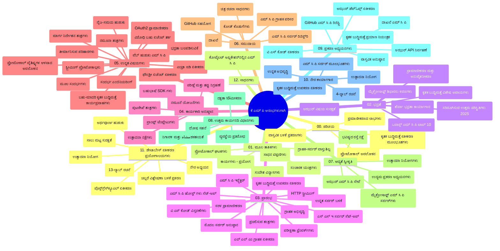

# ಆರಂಭಿಕರಿಗಾಗಿ ಮಾದರಿ ಪ್ರಾಸಂಗಿಕ ಪ್ರೋಟೋಕಾಲ್ (MCP) - ಅಧ್ಯಯನ ಮಾರ್ಗದರ್ಶಿ

ಈ ಅಧ್ಯಯನ ಮಾರ್ಗದರ್ಶಿ "ಆರಂಭಿಕರಿಗಾಗಿ ಮಾದರಿ ಪ್ರಾಸಂಗಿಕ ಪ್ರೋಟೋಕಾಲ್ (MCP)" ಪಠ್ಯಕ್ರಮದ ರೆಪೊಸಿಟರಿ ഘಟನೆ ಮತ್ತು ವಿಷಯದ ಅವಲೋಕನವನ್ನು ಒದಗಿಸುತ್ತದೆ. ರೆಪೊಸಿಟರಿಯನ್ನು ಪರಿಣಾಮಕಾರಿಯಾಗಿ ನಾವಿಗೇಟ್ ಮಾಡಲು ಮತ್ತು ಲಭ್ಯವಿರುವ ಸಂಪನ್ಮೂಲಗಳನ್ನು ಪೂರ್ಣವಾಗಿ ಬಳಸಲು ಈ ಮಾರ್ಗದರ್ಶಿಯನ್ನು ಬಳಸಿ.

## ರೆಪೊಸಿಟರಿ ಅವಲೋಕನ

ಮಾದರಿ ಪ್ರಾಸಂಗಿಕ ಪ್ರೋಟೋಕಾಲ್ (MCP) ಯಂತ್ರಮಾನವ ಮಾದರಿಗಳು ಮತ್ತು ಗ್ರಾಹಕ ಆಪ್ಲಿಕೇಶನ್‌ಗಳ ನಡುವೆ ಸಂವಹನಕ್ಕೆ ಮಾನಕರೂಪದ ಫ್ರೆಮೊರ್ಕ್ ಆಗಿದೆ. ಮೂಲತಃ ಅಂಥ್ರೋಪಿಕ್ тарабынан ರಚಿಸಲ್ಪಟ್ಟ MCPನ್ನು ಈಗ ಅಧಿಕೃತ GitHub ಸಂಸ್ಥೆಯಾದ MCP ಸಮುದಾಯವು ನಿರ್ವಹಿಸುತ್ತಿದೆ. ಈ ರೆಪೊಸಿಟರಿ C#, ಜಾವಾ, ಜಾವಾಸ್ಕ್ರಿಪ್ಟ್, ಪೈಥಾನ್ ಮತ್ತು ಟೈಪ್ಸ್ಕ್ರಿಪ್ಟ್‌ನಲ್ಲಿ ಪ್ರಾಯೋಗಿಕ ಕೋಡ್ ಉದಾಹರಣೆಗಳೊಂದಿಗೆ ಸಮಗ್ರ ಪಠ್ಯಕ್ರಮವನ್ನು ಒದಗಿಸುತ್ತದೆ, ಇದು AI ಡೆವಲಪರ್‌ಗಳು, ಸಿಸ್ಟಮ್ ವಾಸ್ತುಶಿಲ್ಪಿಗಳು ಮತ್ತು ಸಾಫ್ಟ್‌ವೇರ್ ಇಂಜಿನಿಯರ್‌ಗಳಿಗಾಗಿ ವಿನ್ಯಾಸಗೊಳಿಸಲಾಗಿದೆ.

## ದೃಶ್ಯ ಪಠ್ಯಕ್ರಮ ನಕ್ಷೆ

## ರೆಪೊಸಿಟರಿ ರಚನೆ

ರೆಪೊಸಿಟರಿ ಪ್ರಾಥಮಿಕವಾಗಿ ಹನ್ನೆರಡು ವಿಭಾಗಗಳಾಗಿ ಸಂಘಟಿತವಾಗಿದೆ, ಪ್ರತಿಯೊಂದು MCPನ ವಿಭಿನ್ನ ಅಂಶಗಳ ಮೇಲೆ ಕೇಂದ್ರೀಕೃತವಾಗಿದೆ:

1. **ಪರಿಚಯ (00-Introduction/)**
   - ಮಾದರಿ ಪ್ರಾಸಂಗಿಕ ಪ್ರೋಟೋಕಾಲ್ ಅವಲೋಕನ
   - AI ಪೈಪ್‌ಲೈನ್ಗಳಲ್ಲಿ ಮಾನಕೀಕರಣದ ಮಹತ್ವ
   - ಅನುಭವೆಯನ್ನು ಉಪಯೋಗಿಸುವುದು ಮತ್ತು ಲಾಭಗಳು

2. **ಮೂಲಭೂತ ಕಲ್ಪನೆಗಳು (01-CoreConcepts/)**
   - ಕ್ಲೈಂಟ್-ಸರ್ವರ್ ವಾಸ್ತುಶಿಲ್ಪ
   - ಪ್ರಮುಖ ಪ್ರೋಟೋಕಾಲ್ ಭಾಗಗಳು
   - MCPನಲ್ಲಿ ಸಂದೇಶ ವಿನ್ಯಾಸ மாதರಿಗಳು

3. **ಸುರಕ್ಷತೆ (02-Security/)**
   - MCP ಆಧಾರಿತ ವ್ಯವಸ್ಥೆಗಳ ಸುರಕ್ಷತಾ ಅಪಾಯಗಳು
   - ಅನುಷ್ಠಾನಗಳನ್ನು ಸುರಕ್ಷಿತಗೊಳಿಸುವ ಉತ್ತಮ ಅಭ್ಯಾಸಗಳು
   - ಪ್ರಮಾಣೀಕರಣ ಮತ್ತು ಅನುಮತಿ ತಂತ್ರಗಳು
   - **ಸಮಗ್ರ ಸುರಕ್ಷತಾ ಡಾಕ್ಯುಮೆಂಟೇಶನ್**:
     - MCP ಸುರಕ್ಷತಾ ಉತ್ತಮ ಅಭ್ಯಾಸಗಳು 2025
     - ಅಜೂರ್ ಕಂಟೆಂಟ್ ಸೆಫ್ಟಿ ಅನುಷ್ಠಾನ ಮಾರ್ಗದರ್ಶಿ
     - MCP ಸುರಕ್ಷತಾ ನಿಯಂತ್ರಣಗಳು ಮತ್ತು ತಂತ್ರಗಳು
     - MCP ಉತ್ತಮ ಅಭ್ಯಾಸಗಳ ಚುಟುಕು ಸೂಚನೆ
   - **ಪ್ರಮುಖ ಸುರಕ್ಷತಾ ವಿಷಯಗಳು**:
     - ಪ್ರಾಂಪ್ಟ್ ಇಂಜೆಕ್ಷನ್ ಮತ್ತು ಉಪಕರಣ ವಿಷಕಾರಕ ದಾಳಿ
     - ಸೆಷನ್ ಹೈಜ್ಯಾಕಿಂಗ್ ಮತ್ತು ಗೊಂದಲವಾದ ಉಪನ್ಯಾಯಕರ ಸಮಸ್ಯೆಗಳು
     - ಟೋಕನ್ ಪಾಸ್‌ಥ್ರೂ ದುರ್ಬಲತೆಗಳು
     - ಅಧಿಕೃತ ಅನುಮತಿಗಳು ಮತ್ತು ಪ್ರವೇಶ ನಿಯಂತ್ರಣ
     - AI ಘಟಕಗಳ ಸಾಲ ಸರಪಳಿಯ ಸುರಕ್ಷತೆ
     - ಮೈಕ್ರೋಸಾಫ್ಟ್ ಪ್ರಾಂಪ್ಟ್ ಶೀಲ್ಡ್ ಸಂಯೋಜನೆ

4. **ಪ್ರಾರಂಭಿಸುವುದು (03-GettingStarted/)**
   - ವಾತಾವರಣ ಸ್ಥಾಪನೆ ಮತ್ತು ಸಂರಚನೆ
   - ಮೂಲ MCP ಸರ್ವರ್‌ಗಳು ಮತ್ತು ಕ್ಲೈಂಟ್‌ಗಳನ್ನು ರಚಿಸುವುದು
   - ಇತರ ಅಪ್ಲಿಕೇಶನ್‌ಗಳೊಂದಿಗೆ ಸಂಯೋಜನೆ
   - ಒಳಗೊಂಡ ವಿಭಾಗಗಳು:
     - ಪ್ರಥಮ ಸರ್ವರ್ ಅನುಷ್ಠಾನ
     - ಕ್ಲೈಂಟ್ ಅಭಿವೃದ್ಧಿ
     - LLM ಕ್ಲೈಂಟ್ ಸಂಯೋಜನೆ
     - VS ಕೋಡ್ ಸಂಯೋಜನೆ
     - ಸರ್ವರ್-ಸೆಂಟ್ ಈವೆಂಟ್ಸ್ (SSE) ಸರ್ವರ್
     - ಸುಧಾರಿತ ಸರ್ವರ್ ಬಳಕೆ
     - HTTP ಸ್ಟ್ರೀಮಿಂಗ್
     - AI ಟೂಲ್‌ಕಿಟ್ ಸಂಯೋಜನೆ
     - ಪರೀಕ್ಷಿಸುವ ತಂತ್ರಗಳು
     - ನಿಯೋಜನ ಮಾರ್ಗಸೂಚಿ

5. **ಪ್ರಾಯೋಗಿಕ ಅನುಷ್ಠಾನ (04-PracticalImplementation/)**
   - ವಿವಿಧ ಪ್ರೋಗ್ರಾಮಿಂಗ್ ಭಾಷೆಗಳಲ್ಲಿ SDK ಗಳ ಬಳಕೆ
   - ಡಿಬಗ್ಗಿಂಗ್, ಪರೀಕ್ಷೆ ಮತ್ತು ಮಾನ್ಯತೆ ತಂತ್ರಗಳು
   - ಪುನಃಬಳಕೆಗೆ ಯೋಗ್ಯ ಪ್ರಾಂಪ್ಟ್ ಟೆಂಪ್ಲೇಟುಗಳು ಮತ್ತು ಕಾರ್ಯವಿಧಾನಗಳು ರೂಪಿಸುವುದು
   - ಅನುಷ್ಠಾನ ಉದಾಹರಣೆಗಳೊಂದಿಗೆ ಮಾದರಿ ಯೋಜನೆಗಳು

6. **ಉನ್ನತ ವಿಷಯಗಳು (05-AdvancedTopics/)**
   - ಪ್ರಾಸಂಗಿಕ ಇಂಜಿನೀಯರಿಂಗ್ ತಂತ್ರಗಳು
   - ಫೌಂಡ್ರಿ ಏಜೆಂಟ್ ಸಂಯೋಜನೆ
   - ಬಹುಮಾಧ್ಯಮ AI ಕಾರ್ಯವಿಧಾನಗಳು
   - OAuth2 ಪ್ರಮಾಣೀಕರಣ ಪ್ರದರ್ಶನಗಳು
   - ರಿಯಲ್-ಟೈಮ್ ಶೋಧ ಸಾಮರ್ಥ್ಯಗಳು
   - ರಿಯಲ್-ಟೈಮ್ ಸ್ಟ್ರೀಮಿಂಗ್
   - ರೂಟ್ ಪ್ರಾಸಂಗಗಳ ಅನುಷ್ಠಾನ
   - ರೌಟಿಂಗ್ ತಂತ್ರಗಳು
   - ನಿದರ್ಶನ ತಂತ್ರಗಳು
   - ಪ್ರಮಾಣವನ್ನು ವಿಸ್ತರಿಸುವ ವಿಧಾನಗಳು
   - ಸುರಕ್ಷತಾ ಪರಿಗಣನೆಗಳು
   - ಎಂಟ್ರಾ ID ಸುರಕ್ಷತಾ ಸಂಯೋಜನೆ
   - ವೆಬ್ ಶೋಧ ಸಂಯೋಜನೆ
   - ವಿರೋಧಾತ್ಮಕ ಬಹು-ಏಜೆಂಟ್ ತರ್ಕ (ಚರ್ಚಾ ಮಾದರಿಗಳು)

7. **ಸಮುದಾಯ ಕೊಡುಗೆಗಳು (06-CommunityContributions/)**
   - ಕೋಡ್ ಮತ್ತು ಡಾಕ್ಯುಮೆಂಟೇಶನ್ ಕೊಡುಗೆ ನೀಡುವ ವಿಧಾನಗಳು
   - GitHub ಮೂಲಕ ಸಹಯೋಗ
   - ಸಮುದಾಯ ಚಾಲಿತ ಸುಧಾರಣೆಗಳು ಮತ್ತು ಪ್ರತಿಕ್ರಿಯೆಗಳು
   - ವಿವಿಧ MCP ಕ್ಲೈಂಟ್‌ಗಳ ಬಳಕೆ (Claude ಡೆಸ್ಕ್‌ಟಾಪ್, Cline, VSCode)
   - ಜನಪ್ರಿಯ MCP ಸರ್ವರ್‌ಗಳೊಂದಿಗೆ ಕೆಲಸ ಮಾಡುವುದು ಮುಂತಾದವು

8. **ಪ್ರಾಥಮಿಕ ಸ್ವೀಕೃತಿಯಿಂದ ಪಾಠಗಳು (07-LessonsfromEarlyAdoption/)**
   - ವಾಸ್ತವ ಜಗತ್ತಿನ ಅನುಷ್ಠಾನಗಳು ಮತ್ತು ಯಶೋಮುಖ ಕಥೆಗಳು
   - MCP ಆಧಾರಿತ ಪರಿಹಾರಗಳನ್ನು ನಿರ್ಮಿಸಿ ನಿಯೋಜಿಸುವುದು
   - ಪ್ರವೃತ್ತಿಗಳು ಮತ್ತು ಭವಿಷ್ಯದ ರಸ್ತೆನಕ್ಷೆ
   - **Microsoft MCP ಸರ್ವರ್‌ಗಳ ಮಾರ್ಗದರ್ಶಿ**: 10 ಉತ್ಪಾದನೆ-ಸಿದ್ಧ Microsoft MCP ಸರ್ವರ್‌ಗಳ ಸಂಪೂರ್ಣ ಮಾರ್ಗದರ್ಶಿ, ಇದರಲ್ಲಿ ಸೇರಿವೆ:
     - Microsoft Learn Docs MCP Server
     - ಅಜೂರ್ MCP ಸರ್ವರ್ (15+ ವಿಶೇಷ ಸಂಪರ್ಕಕಾರಿಗಳು)
     - GitHub MCP ಸರ್ವರ್
     - ಅಜೂರ್ DevOps MCP ಸರ್ವರ್
     - MarkItDown MCP ಸರ್ವರ್
     - SQL ಸರ್ವರ್ MCP ಸರ್ವರ್
     - Playwright MCP ಸರ್ವರ್
     - Dev Box MCP ಸರ್ವರ್
     - Microsoft Foundry MCP ಸರ್ವರ್
     - Microsoft 365 ಏಜೆಂಟ್‌ಗಳು ಟೂಲ್‌ಕಿಟ್ MCP ಸರ್ವರ್

9. **ಉತ್ತಮ ಅಭ್ಯಾಸಗಳು (08-BestPractices/)**
   - ಕಾರ್ಯಕ್ಷಮತೆ ಸೂಕ್ತಗೊಳಿಸುವಿಕೆ ಮತ್ತು ಆಪ್ಟಿಮೈಜೆಷನ್
   - ದೋಷ ತಾಳುವ MCP ವ್ಯವಸ್ಥೆಗಳ ವಿನ್ಯಾಸ
   - ಪರೀಕ್ಷೆ ಮತ್ತು ಸ್ಪಂದನಾ ತಂತ್ರಗಳು

10. **ಕೇಸ್ مطالعೆಗಳು (09-CaseStudy/)**
    - MCP ಬದ್ಧತೆಯನ್ನು ವಿವಿಧ ಸಂದರ್ಭಗಳಲ್ಲಿ ತೋರಿಸುವ **ಏಳು ಸಮಗ್ರ ಕೇಸ್ ಅಧ್ಯಯನಗಳು**:
    - **ಅಜೂರ್ AI ಟ್ರಾವೆಲ್ ಏಜೆಂಟ್‌ಗಳು**: ಅಜೂರ್ OpenAI ಮತ್ತು AI ಶೋಧದೊಂದಿಗೆ ಬಹು ಏಜೆಂಟ್ ಸಂಘಟನೆ
    - **ಅಜೂರ್ DevOps ಸಂಯೋಜನೆ**: YouTube ಡೇಟಾ ನವೀಕರಣಗಳೊಂದಿಗೆ ಕಾರ್ಯವಾಹಿಕೆ ಪ್ರಕ್ರಿಯೆಗಳ ಸ್ವಯಂಚಾಲನ
    - **ರಿಯಲ್-ಟೈಮ್ ಡಾಕ್ಯುಮೆಂಟೇಶನ್ ಪಡೆದುಕೊಳ್ಳುವುದು**: ಪೈಥಾನ್ ಕನಸೋಲ್ ಕ್ಲೈಂಟ್ ಮತ್ತು ಸ್ಟ್ರೀಮಿಂಗ್ HTTP
    - **ಇಂಟರ್ಯಾಕ್ಟಿವ್ ಅಧ್ಯಯನ ಯೋಜನೆ ಜನರೇಟರ್**: ಚೈನ್‌ಲಿಟ್ ವೆಬ್ ಆಪ್ ಮತ್ತು ಸಂವಾದಾತ್ಮಕ AI
    - **ಎಡಿಟರ್ ಒಳಗಿನ ಡಾಕ್ಯುಮೆಂಟೇಶನ್**: VS ಕೋಡ್ ಮತ್ತು GitHub Copilot ಕಾರ್ಯವಿಧಾನಗಳು
    - **ಅಜೂರ್ API ನಿರ್ವಹಣೆ**: MCP ಸರ್ವರ್ ರಚನೆಯೊಂದಿಗೆ ಎಂಟರ್‌ಪ್ರೈಸ್ API ಸಂಯೋಜನೆ
    - **GitHub MCP ರಜೆಸ್ಟ್ರಿ**: ಎಕೋಸಿಸ್ಟಮ್ ಅಭಿವೃದ್ದಿ ಮತ್ತು ಏಜೆಂಟ್ ಸಂಯೋಜನಾ ವೇದಿಕೆ
    - ಎಂಟರ್‌ಪ್ರೈಸ್ ಸಂಯೋಜನೆ, ಡೆವಲಪರ್ ಉತ್ಪಾದಕತೆ ಮತ್ತು ಎಕೋಸಿಸ್ಟಮ್ ಅಭಿವೃದ್ಧಿಯ ಅನುಷ್ಠಾನ ಉದಾಹರಣೆಗಳು

11. **ಪ್ರಾಯೋಗಿಕ ಕಾರ್ಯಾಗಾರ (10-StreamliningAIWorkflowsBuildingAnMCPServerWithAIToolkit/)**
    - MCP ಮತ್ತು AI ಟೂಲ್‌ಕಿಟ್‌ಗಳನ್ನು ಸಂಯೋಜಿಸುವ ಸಮಗ್ರ ಪ್ರಾಯೋಗಿಕ ಕಾರ್ಯಾಗಾರ
    - ಯಂತ್ರಮಾನವ ಮಾದರಿಗಳನ್ನು ವಾಸ್ತವಿಕ ಉಪಕರಣಗಳೊಂದಿಗೆ ಸೇರುವ ತಿಳಿವಳಿಕೆಯ ಆಪ್ಲಿಕೇಶನ್‌ಗಳ ನಿರ್ಮಾಣ
    - ಮೂಲಭೂತಗಳು, ಕಸ್ಟಮ್ ಸರ್ವರ್ ಅಭಿವೃದ್ಧಿ ಮತ್ತು ಉತ್ಪಾದನಾ ನಿಯೋಜನೆ ತಂತ್ರಗಳನ್ನು ಒಳಗೊಂಡ ಪ್ರಾಯೋಗಿಕ ಘಟಕಗಳು
    - **ಪ್ರಾಯೋಗಾಲಯದ ರಚನೆ**:
      - ಪ್ರಾಯೋಗಾಲಯ 1: MCP ಸರ್ವರ್ ಮೂಲಭೂತಗಳು
      - ಪ್ರಾಯೋಗಾಲಯ 2: ಸುಧಾರಿತ MCP ಸರ್ವರ್ ಅಭಿವೃದ್ಧಿ
      - ಪ್ರಾಯೋಗಾಲಯ 3: AI ಟೂಲ್‌ಕಿಟ್ ಸಂಯೋಜನೆ
      - ಪ್ರಾಯೋಗಾಲಯ 4: ಉತ್ಪಾದನಾ ನಿಯೋಜನೆ ಮತ್ತು ಪ್ರಮಾಣವನ್ನು ವಿಸ್ತರಿಸುವುದು
    - ಹಂತ ಹಂತದ ಸೂಚನೆಗಳೊಂದಿಗೆ ಪ್ರಾಯೋಗಾಲಯ ಆಧಾರಿತ ಅಧ್ಯಯನ ವಿಧಾನ

12. **MCP ಸರ್ವರ್ ಡೇಟಾಬೇಸ್ ಸಂಯೋಜನಾ ಪ್ರಯೋಗಾಲಯಗಳು (11-MCPServerHandsOnLabs/)**
    - PostgreSQL ಸಂಯೋಜನೆಯೊಂದಿಗೆ ಉತ್ಪಾದನಾ-ಸಿದ್ಧ MCP ಸರ್ವರ್‌ಗಳನ್ನು ನಿರ್ಮಿಸುವ **13-ಪ್ರಾಯೋಗಾಲಯದ ಸಮಗ್ರ ಕಲಿಕೆಯ ಪಥ**
    - Zava Retail ಬಳಕೆಕೇಸ್ ಬಳಸಿ ವಾಸ್ತವಿಕ ಚಿಲ್ಲರೆ ವಿಶ್ಲೇಷಣೆ ಅನುಷ್ಠಾನ
    - ಎಂಟರ್‌ಪ್ರೈಸ್-ತಲ ವೈಶಿಷ್ಟ್ಯಗಳು ಒಳಗೊಂಡಿವೆ ರೋ ಲೆವೆಲ್ ಸೆಕ್ಯೂರಿಟಿ (RLS), ಅರ್ಧಾರ್ಥಕ ಶೋಧ ಮತ್ತು ಬಹು-ಟೆನಂಟ್ ಡೇಟಾ ಪ್ರವೇಶ
    - **ಸಂಪೂರ್ಣ ಪ್ರಯೋಗಾಲಯ ರಚನೆ**:
      - **ಪ್ರಯೋಗಾಲಯಗಳು 00-03: ಮೂಲಭೂತಗಳು** - ಪರಿಚಯ, ವಾಸ್ತುಶಿಲ್ಪ, ಸುರಕ್ಷತೆ, ವಾತಾವರಣ ಸ್ಥಾಪನೆ
      - **ಪ್ರಯೋಗಾಲಯಗಳು 04-06: MCP ಸರ್ವರ್ ನಿರ್ಮಾಣ** - ಡೇಟಾಬೇಸ್ ವಿನ್ಯಾಸ, MCP ಸರ್ವರ್ ಅನುಷ್ಠಾನ, ಉಪಕರಣ ಅಭಿವೃದ್ಧಿ
      - **ಪ್ರಯೋಗಾಲಯಗಳು 07-09: ಸುಧಾರಿತ ವೈಶಿಷ್ಟ್ಯಗಳು** - ಅರ್ಧಾರ್ಥಕ ಶೋಧ, ಪರೀಕ್ಷೆ ಮತ್ತು ಡಿಬಗ್ಗಿಂಗ್, VS ಕೋಡ್ ಸಂಯೋಜನೆ
      - **ಪ್ರಯೋಗಾಲಯಗಳು 10-12: ಉತ್ಪಾದನೆ ಮತ್ತು ಉತ್ತಮ ಅಭ್ಯಾಸಗಳು** - ನಿಯೋಜನೆ, ನಿಗಾ, ಆಪ್ಟಿಮೈಜೇಶನ್
    - **ಸಂಸ್ಕೃತ ತಂತ್ರಜ್ಞಾನಗಳು**: FastMCP ಫ್ರೆಮೊರ್ಕ್, PostgreSQL, ಅಜೂರ್ OpenAI, ಅಜೂರ್ ಕಂಟೇನರ್ ಆ್ಯಪ್ಸ್, ಅ್ಯಪ್ಲಿಕೇಶನ್ ಇನ್ಸೈಟ್ಸ್
    - **ಕಲಿಕೆಯ ಫಲಿತಾಂಶಗಳು**: ಉತ್ಪಾದನಾ-ಸಿದ್ಧ MCP ಸರ್ವರ್‌ಗಳು, ಡೇಟಾಬೇಸ್ ಸಂಯೋಜನಾ ಮಾದರಿಗಳು, AI-ಚಾಲಿತ ವಿಶ್ಲೇಷಣೆ, ಎಂಟರ್‌ಪ್ರೈಸ್ ಸುರಕ್ಷತೆ

13. **ಟೂಲಿಂಗ್ (12-tooling/)**
    - MCP ಅನ್ನು Copilot ಆ್ಯಪ್ ಮತ್ತು ಇತರೆ ಉಪಕರಣಗಳಲ್ಲಿ ಬಳಸುವ ವಿಧಾನಗಳನ್ನು ತಿಳಿಯಿರಿ

## ಹೆಚ್ಚಿನ ಸಂಪನ್ಮೂಲಗಳು

ರೆಪೊಸಿಟರಿಯಲ್ಲಿ ಬೆಂಬಲಿಸುವ ಸಂಪನ್ಮೂಲಗಳು ಅಳುಪಿವೆ:

- **ಚಿತ್ರಗಳ ಫೋಲ್ಡರ್**: ಪಠ್ಯಕ್ರಮದಲ್ಲಿ ಬಳಕೆಯಾದ ಚಿತ್ರರೇಖೆಗಳು ಮತ್ತು ಸಾಂದರ್ಭಿಕ ಚಿತ್ರಗಳು
- **ಅನುವಾದಗಳು**: ದಸ್ತಾವೇಜಿನ ಸ್ವಯಂಕ್ರಿಯ ಅನುವಾದಗಳೊಂದಿಗೆ ಬಹುಭಾಷಾ ಬೆಂಬಲ
- **ಅಧಿಕೃತ MCP ಸಂಪನ್ಮೂಲಗಳು**:
  - [MCP ಡಾಕ್ಯುಮೆಂಟೇಶನ್](https://modelcontextprotocol.io/)
  - [MCP ವಿವರಣೆ](https://spec.modelcontextprotocol.io/)
  - [MCP GitHub ರೆಪೊಸಿಟರಿ](https://github.com/modelcontextprotocol)

## ಈ ರೆಪೊಸಿಟರಿಯನ್ನು ಹೇಗೆ ಬಳಸುವುದು

1. **ಕ್ರಮಾನುಗತ ಅಧ್ಯಯನ**: ರಚನೆಗಾಗಿ ಅಧ್ಯಾಯಗಳನ್ನು ಕ್ರಮವಾಗಿ ಅನುಸರಿಸಿ (00ರಿಂದ 11ರವರೆಗೆ).
2. **ಭಾಷಾ-ನಿರ್ದಿಷ್ಟ ಗಮನ**: ನೀವು ನಿರ್ದಿಷ್ಟ ಪ್ರೋಗ್ರಾಮಿಂಗ್ ಭಾಷೆಯಲ್ಲಿ ಆಸಕ್ತರಾಗಿದ್ದರೆ, ನಿಮ್ಮ ಇಚ್ಛಿತ ಭಾಷೆಗಳಿಗೆ ಸಾಮಾನ್ಯ ಪ್ರದರ್ಶನಗಳಿಗಾಗಿ ಮಾದರಿ ಡೈರೆಕ್ಟರಿಗಳನ್ನು ಅನ್ವೇಷಿಸಿ.
3. **ಪ್ರಾಯೋಗಿಕ ಅನುಷ್ಠಾನ**: ನಿಮ್ಮ ವಾತಾವರಣವನ್ನು ಹಂಚಿಕೊಳ್ಳಲು ಮತ್ತು ನಿಮ್ಮ ಮೊದಲ MCP ಸರ್ವರ್ ಮತ್ತು ಕ್ಲೈಂಟ್ ನಿರ್ಮಾಣ ಮಾಡಲು "ಪ್ರಾರಂಭಿಸುವುದು" ವಿಭಾಗದಿಂದ ಪ್ರಾರಂಭಿಸಿ.
4. **ಉನ್ನತ ಅನ್ವೇಷಣೆ**: ಮೂಲಭೂತ ವಿಷಯಗಳನ್ನು ಅರಿತುಕೊಂಡ ನಂತರ, ನಿಮ್ಮ ಜ್ಞಾನವನ್ನು ವಿಸ್ತರಿಸಲು ಉನ್ನತ ವಿಷಯಗಳಿಗೆ ಮುಗುಳ್ನಗೆ.
5. **ಸಮುದಾಯ ಭಾಗವಹಿಸುವಿಕೆ**: GitHub ಚರ್ಚೆಗಳು ಮತ್ತು ಡಿಸ್ಕೋರ್ಡ್ ಚಾನಲ್‌ಗಳ ಮೂಲಕ MCP ಸಮುದಾಯದಲ್ಲಿ ಸೇರಿ, ಪರಿಣಿತರು ಮತ್ತು ಸಹ ಡೆವಲಪರ್‌ಗಳೊಂದಿಗೆ ಸಂಪರ್ಕಿಸಿ.

## MCP ಕ್ಲೈಂಟ್‌ಗಳು ಮತ್ತು ಉಪಕರಣಗಳು

ಪಠ್ಯಕ್ರಮವು ವಿವಿಧ MCP ಕ್ಲೈಂಟ್‌ಗಳು ಮತ್ತು ಉಪಕರಣಗಳನ್ನು ಒಳಗೊಂಡಿದೆ:

1. **ಅಧಿಕೃತ ಕ್ಲೈಂಟ್‌ಗಳು**:
   - Visual Studio Code 
   - Visual Studio Codeನಲ್ಲಿ MCP
   - Claude ಡೆಸ್ಕ್‌ಟಾಪ್
   - VSCodeನಲ್ಲಿ Claude 
   - Claude API

2. **ಸಮುದಾಯ ಕ್ಲೈಂಟ್‌ಗಳು**:
   - Cline (ಟರ್ಮಿನಲ್ ಆಧಾರಿತ)
   - Cursor (ಕೋಡ್ ಸಂಪಾದಕ)
   - ChatMCP
   - Windsurf

3. **MCP ನಿರ್ವಹಣಾ ಉಪಕರಣಗಳು**:
   - MCP CLI
   - MCP ಮ್ಯಾನೇಜರ್
   - MCP ಲಿಂಕರ್
   - MCP ರೌಟರ್

## ಜನಪ್ರಿಯ MCP ಸರ್ವರ್‌ಗಳು

ರೆಪೊಸಿಟರಿ ವಿವಿಧ MCP ಸರ್ವರ್‌ಗಳ ಪರಿಚಯ ನೀಡುತ್ತದೆ, ಇದರಲ್ಲಿ ಸೇರಿವೆ:

1. **ಅಧಿಕೃತ ಮೈಕ್ರೋಸಾಫ್ಟ್ MCP ಸರ್ವರ್‌ಗಳು**:
   - Microsoft Learn Docs MCP Server
   - ಅಜೂರ್ MCP ಸರ್ವರ್ (15+ ವಿಶಿಷ್ಟ ಸಂಪರ್ಕಕಾರಿಗಳು)
   - GitHub MCP ಸರ್ವರ್
   - ಅಜೂರ್ DevOps MCP ಸರ್ವರ್
   - MarkItDown MCP ಸರ್ವರ್
   - SQL ಸರ್ವರ್ MCP ಸರ್ವರ್
   - Playwright MCP ಸರ್ವರ್
   - Dev Box MCP ಸರ್ವರ್
   - Microsoft Foundry MCP ಸರ್ವರ್
   - Microsoft 365 ಏಜೆಂಟ್‌ಗಳು ಟೂಲ್‌ಕಿಟ್ MCP ಸರ್ವರ್

2. **ಅಧಿಕೃತ ಸೂಚನಾ ಸರ್ವರ್‌ಗಳು**:
   - ಫೈಲ್‌ಸಿಸ್ಟಮ್
   - ಫೆಚ್
   - ಮೆಮರಿ
   - ಕ್ರಮಾನುಗತ ಚಿಂತನೆ

3. **ಚಿತ್ರ ಉತ್ಪಾದನೆ**:
   - ಅಜೂರ್ OpenAI DALL-E 3
   - ಸ್ಟೇಬಲ್ ಡಿಫ್ಯೂಷನ್ ವೆಬ್‌ಯುಐ
   - ರೆಪ್ಲಿಕೇಟ್

4. **ಅಭಿವೃದ್ಧಿ ಉಪಕರಣಗಳು**:
   - Git MCP
   - ಟರ್ಮಿನಲ್ ನಿಯಂತ್ರಣ
   - ಕೋಡ್ ಸಹಾಯಕ

5. **ವಿಶಿಷ್ಟ ಸರ್ವರ್‌ಗಳು**:
   - Salesforce
   - Microsoft Teams
   - Jira ಮತ್ತು Confluence

## ಕೊಡುಗೆ ನೀಡಿ

ಈ ರೆಪೊಸಿಟರಿ ಸಮುದಾಯದಿಂದ ನೀಡಲಾದ ಕೊಡುಗೆಗಳನ್ನು ಸ್ವಾಗತಿಸುತ್ತದೆ. MCP ಪರಿಸರದಲ್ಲಿ ಪರಿಣಾಮಕಾರಿಯಾಗಿ ಕೊಡುಗೆ ನೀಡುವ ಮಾರ್ಗದರ್ಶನಕ್ಕಾಗಿ ಸಮುದಾಯ ಕೊಡುಗೆಗಳು ವಿಭಾಗವನ್ನು ನೋಡು.

----

*ಈ ಅಧ್ಯಯನ ಮಾರ್ಗದರ್ಶಿಯನ್ನು ಫೆಬ್ರವರಿ 5, 2026 ರಂದು ಕೊನೆಯದುಮಾಡಲಾಗಿದೆ, ಇದು ಇತ್ತೀಚಿನ MCP ನಿರ್ದಿಷ್ಟತೆ 2025-11-25 ಅನ್ನು ಪ್ರತಿಬಿಂಬಿಸುತ್ತದೆ ಮತ್ತು ಆ ದಿನಾಂಕದ ರೆಪೊಸಿಟರಿ ಅವಲೋಕನವನ್ನು ಒದಗಿಸುತ್ತದೆ. ಈ ದಿನಾಂಕದ ನಂತರ ರೆಪೊಸಿಟರಿ ವಿಷಯವನ್ನು ನವೀಕರಿಸಬಹುದು.*

---

<!-- CO-OP TRANSLATOR DISCLAIMER START -->
**ಅಸ್ವೀಕಾರ**:
ಈ ದಸ್ತಾವೇಜು AI ಅನುವಾದ ಸೇವೆ [Co-op Translator](https://github.com/Azure/co-op-translator) ಬಳಸಿ ಅನುವಾದಿಸಲಾಗಿದೆ. ನಾವು ನಿಖರತೆಯನ್ನು ಸಾಧಿಸಲು ಪ್ರಯತ್ನಿಸುತ್ತಿದ್ದರೂ, ದಯವಿಟ್ಟು ಗಮನಿಸಿ, ಸ್ವಯಂಚಾಲಿತ ಅನುವಾದಗಳಲ್ಲಿ ದೋಷಗಳು ಅಥವಾ ಅಸಡ್ಡೆಗಳು ಇರಬಹುದು. ಮೂಲ ಭಾಷೆಯಲ್ಲಿರುವ ಮೂಲ ದಸ್ತಾವೇಜು ಪ್ರಾಮಾಣಿಕ ಮೂಲವೆಂದು ಪರಿಗಣಿಸಬೇಕು. ಪ್ರಮುಖ ಮಾಹಿತಿಗಾಗಿ, ವೃತ್ತಿಪರ ಮಾನವ ಅನುವಾದವನ್ನು ಶಿಫಾರಸು ಮಾಡಲಾಗುತ್ತದೆ. ಈ ಅನುವಾದವನ್ನು ಬಳಸುವ ಮೂಲಕ ಉಂಟಾಗುವ ಯಾವುದೇ ತಪ್ಪು ಅರ್ಥಗಳ ಅಥವಾ ತಪ್ಪು ವ್ಯಾಖ್ಯಾನಗಳ ಬಗ್ಗೆ ನಾವು ಹೊಣೆಗಾರರಲ್ಲ.
<!-- CO-OP TRANSLATOR DISCLAIMER END -->