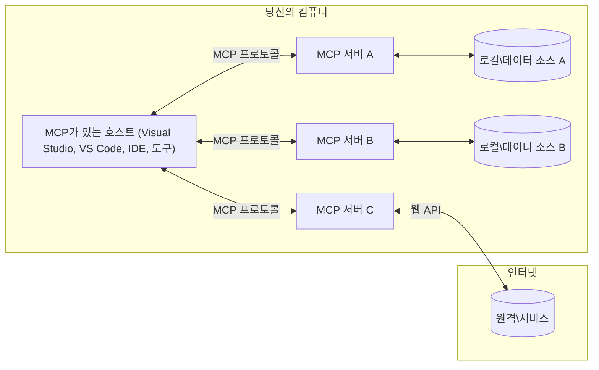

# MCP 핵심 개념: AI 통합을 위한 모델 컨텍스트 프로토콜 마스터하기

[](https://youtu.be/earDzWGtE84)

_(위 이미지를 클릭하여 이 강의의 영상을 시청하세요)_

[Model Context Protocol (MCP)](https://github.com/modelcontextprotocol)은 대형 언어 모델(LLM)과 외부 도구, 애플리케이션, 데이터 소스 간의 통신을 최적화하는 강력한 표준화된 프레임워크입니다.  
이 가이드에서는 MCP의 핵심 개념을 안내합니다. 클라이언트-서버 아키텍처, 주요 구성 요소, 통신 메커니즘 및 구현 모범 사례에 대해 배우게 됩니다.

- **명시적 사용자 동의**: 모든 데이터 접근 및 작업은 실행 전에 명확한 사용자 승인을 필요로 합니다. 사용자는 어떤 데이터가 접근되는지, 어떤 작업이 수행되는지 명확히 이해하고, 권한 및 인가에 대해 세분화된 제어를 가져야 합니다.

- **데이터 프라이버시 보호**: 사용자 데이터는 명시적 동의가 있을 때만 노출되며, 상호 작용 전체 라이프사이클에 걸쳐 강력한 접근 제어로 보호되어야 합니다. 무단 데이터 전송을 방지하고 엄격한 프라이버시 경계를 유지해야 합니다.

- **도구 실행 안전성**: 모든 도구 호출은 해당 도구의 기능, 매개변수, 잠재적 영향을 명확히 이해하는 명시적 사용자 동의를 요구합니다. 견고한 보안 경계는 의도치 않은, 안전하지 않거나 악의적인 도구 실행을 방지해야 합니다.

- **전송 계층 보안**: 모든 통신 채널은 적절한 암호화 및 인증 메커니즘을 사용해야 합니다. 원격 연결은 안전한 전송 프로토콜 및 적절한 자격 증명 관리를 구현해야 합니다.

#### 구현 지침:

- **권한 관리**: 사용자가 접근 가능한 서버, 도구, 리소스를 세밀하게 제어할 수 있는 권한 시스템 구현  
- **인증 및 인가**: 안전한 인증 방법(OAuth, API 키)과 적절한 토큰 관리 및 만료 처리  
- **입력 검증**: 정의된 스키마에 따라 모든 매개변수 및 데이터 입력 검증하여 인젝션 공격 방지  
- **감사 로깅**: 보안 모니터링 및 컴플라이언스를 위한 모든 작업의 포괄적 로그 유지

## 개요

이 강의에서는 Model Context Protocol(MCP) 생태계를 구성하는 기본 아키텍처와 구성 요소를 탐구합니다. MCP 상호작용을 지원하는 클라이언트-서버 아키텍처, 주요 구성 요소 및 통신 메커니즘에 대해 배우게 됩니다.

## 주요 학습 목표

이 강의가 끝나면 다음을 이해할 수 있습니다:

- MCP 클라이언트-서버 아키텍처  
- 호스트, 클라이언트, 서버의 역할과 책임 식별  
- MCP를 유연한 통합 계층으로 만드는 핵심 특징 분석  
- MCP 생태계 내 정보 흐름 이해  
- .NET, Java, Python, JavaScript의 코드 예제를 통한 실용적 통찰 획득

## MCP 아키텍처: 심층 분석

MCP 생태계는 클라이언트-서버 모델로 구축되어 있습니다. 이 모듈식 구조는 AI 애플리케이션이 도구, 데이터베이스, API 및 컨텍스트 리소스와 효율적으로 상호작용할 수 있게 합니다. 이 아키텍처를 핵심 구성 요소로 나누어 살펴보겠습니다.

기본적으로 MCP는 하나의 호스트 애플리케이션이 여러 서버에 연결할 수 있는 클라이언트-서버 아키텍처를 따릅니다:


- **MCP 호스트**: VSCode, Claude Desktop, IDE 또는 MCP를 통해 데이터에 접근하고자 하는 AI 도구 프로그램  
- **MCP 클라이언트**: 서버와 1:1 연결을 유지하는 프로토콜 클라이언트  
- **MCP 서버**: 표준화된 Model Context Protocol을 통해 특정 기능을 노출하는 경량 프로그램  
- **로컬 데이터 소스**: MCP 서버가 안전하게 접근할 수 있는 컴퓨터 내 파일, 데이터베이스, 서비스  
- **원격 서비스**: 인터넷을 통해 MCP 서버가 API로 연결할 수 있는 외부 시스템

MCP 프로토콜은 날짜 기반 버전 관리(YYYY-MM-DD 형식)를 사용하는 진화하는 표준입니다. 현재 프로토콜 버전은 **2025-11-25**입니다. 최신 업데이트는 [프로토콜 명세](https://modelcontextprotocol.io/specification/2025-11-25/)에서 확인할 수 있습니다.

### 1. 호스트

Model Context Protocol(MCP)에서 **호스트**는 사용자가 프로토콜과 상호작용하는 주요 인터페이스 역할을 하는 AI 애플리케이션입니다. 호스트는 각 서버 연결을 위해 전용 MCP 클라이언트를 생성하여 여러 MCP 서버와의 연결을 조율하고 관리합니다. 호스트의 예시는 다음과 같습니다:

- **AI 애플리케이션**: Claude Desktop, Visual Studio Code, Claude Code  
- **개발 환경**: MCP 통합이 된 IDE 및 코드 편집기  
- **맞춤형 애플리케이션**: 특수 목적의 AI 에이전트 및 도구

**호스트**는 AI 모델 상호작용을 조율하는 애플리케이션입니다. 그들은:

- **AI 모델 오케스트레이션**: LLM과 상호작용하여 응답 생성 및 AI 워크플로 조정  
- **클라이언트 연결 관리**: MCP 서버 연결마다 하나의 MCP 클라이언트 생성 및 유지  
- **사용자 인터페이스 제어**: 대화 흐름, 사용자 상호작용, 응답 표시 관리  
- **보안 적용**: 권한, 보안 제약 및 인증 제어  
- **사용자 동의 처리**: 데이터 공유 및 도구 실행에 대한 사용자 승인 관리

### 2. 클라이언트

**클라이언트**는 호스트와 MCP 서버 간의 전용 1:1 연결을 유지하는 핵심 구성 요소입니다. 각 MCP 클라이언트는 호스트에 의해 특정 MCP 서버에 연결하기 위해 인스턴스화되어 조직적이고 안전한 통신 채널을 보장합니다. 여러 클라이언트는 호스트가 동시에 여러 서버에 연결할 수 있게 합니다.

**클라이언트**는 호스트 애플리케이션 내 연결자 역할 구성 요소입니다. 그들은:

- **프로토콜 통신**: 요청과 지침을 JSON-RPC 2.0 형식으로 서버에 전송  
- **기능 협상**: 초기화 시 서버와 지원 기능 및 프로토콜 버전을 협상  
- **도구 실행 관리**: 모델의 도구 실행 요청 관리 및 응답 처리  
- **실시간 업데이트 처리**: 서버의 알림 및 실시간 업데이트 처리  
- **응답 처리**: 서버 응답을 사용자에게 표시할 형식으로 가공

### 3. 서버

**서버**는 MCP 클라이언트에 컨텍스트, 도구, 기능을 제공하는 프로그램입니다. 로컬(호스트와 같은 머신) 또는 원격(외부 플랫폼)으로 실행 가능하며, 클라이언트 요청을 처리하고 구조화된 응답을 제공합니다. 서버는 표준화된 Model Context Protocol을 통해 특정 기능을 노출합니다.

**서버**는 컨텍스트 및 기능을 제공하는 서비스입니다. 그들은:

- **기능 등록**: 클라이언트에 사용 가능한 원시 기능(리소스, 프롬프트, 도구) 등록 및 노출  
- **요청 처리**: 클라이언트로부터 도구 호출, 리소스 요청, 프롬프트 요청 접수 및 실행  
- **컨텍스트 제공**: 모델 응답을 향상시키기 위한 맥락 정보 및 데이터 제공  
- **상태 관리**: 세션 상태 유지 및 상태 기반 상호작용 처리  
- **실시간 알림**: 기능 변경 및 업데이트에 대한 알림을 연결된 클라이언트에 전송

서버는 누구나 특화된 기능으로 모델 역량을 확장하기 위해 개발할 수 있으며, 로컬 및 원격 배포 시나리오를 모두 지원합니다.

### 4. 서버 원시 기능

Model Context Protocol(MCP) 내 서버는 클라이언트, 호스트 및 언어 모델 간의 풍부한 상호작용을 위한 기본 구성 요소인 세 가지 핵심 **원시 기능**을 제공합니다. 이 원시 기능은 프로토콜을 통해 제공되는 컨텍스트 정보와 가능한 동작 유형을 정의합니다.

MCP 서버는 다음 세 가지 핵심 원시 기능 중 임의의 조합을 노출할 수 있습니다:

#### 리소스

**리소스**는 AI 애플리케이션에 컨텍스트 정보를 제공하는 데이터 소스입니다. 정적 또는 동적 콘텐츠로서 모델의 이해력과 의사결정을 향상시킵니다:

- **컨텍스트 데이터**: AI 모델 소비를 위한 구조화된 정보 및 컨텍스트  
- **지식 베이스**: 문서 저장소, 기사, 매뉴얼, 연구 논문  
- **로컬 데이터 소스**: 파일, 데이터베이스, 로컬 시스템 정보  
- **외부 데이터**: API 응답, 웹 서비스, 원격 시스템 데이터  
- **동적 콘텐츠**: 외부 조건에 따라 실시간으로 업데이트되는 데이터

리소스는 URI로 식별되며 `resources/list`를 통한 검색 및 `resources/read`를 통한 조회를 지원합니다:

```text
file://documents/project-spec.md
database://production/users/schema
api://weather/current
```

#### 프롬프트

**프롬프트**는 언어 모델과의 상호작용을 구조화하는 재사용 가능한 템플릿입니다. 표준화된 상호작용 패턴과 템플릿화된 워크플로를 제공합니다:

- **템플릿 기반 상호작용**: 사전 구조화된 메시지와 대화 시작 문구  
- **워크플로 템플릿**: 공통 작업과 상호작용을 위한 표준화된 시퀀스  
- **소수 예시(Few-shot) 예제**: 모델 지시를 위한 예제 기반 템플릿  
- **시스템 프롬프트**: 모델 동작 및 컨텍스트를 정의하는 기본 프롬프트  
- **동적 템플릿**: 특정 컨텍스트에 맞춰 매개변수를 조정하는 프롬프트

프롬프트는 변수 치환을 지원하며 `prompts/list`를 통해 검색, `prompts/get`으로 조회할 수 있습니다:

```markdown
Generate a {{task_type}} for {{product}} targeting {{audience}} with the following requirements: {{requirements}}
```

#### 도구

**도구**는 AI 모델이 특정 작업을 수행하기 위해 호출할 수 있는 실행 가능한 함수입니다. MCP 생태계 내 "동사" 역할을 하며 모델이 외부 시스템과 상호작용할 수 있게 합니다:

- **실행 가능한 함수**: 모델이 특정 매개변수로 호출할 수 있는 개별 작업  
- **외부 시스템 통합**: API 호출, 데이터베이스 쿼리, 파일 작업, 계산  
- **고유 식별자**: 각 도구는 독특한 이름, 설명, 매개변수 스키마를 가짐  
- **구조화된 입출력**: 도구는 검증된 매개변수를 받고 구조화되고 타입이 명확한 응답을 반환  
- **행동 가능 능력**: 모델이 실제 세계 작업을 수행하고 실시간 데이터를 가져올 수 있도록 함

도구는 매개변수 검증을 위한 JSON Schema로 정의되며 `tools/list`로 검색, `tools/call`로 실행됩니다. 도구는 UI 표현 강화를 위해 **아이콘**을 부가 메타데이터로 포함할 수 있습니다.

**도구 주석**: 도구는 읽기 전용(`readOnlyHint`), 파괴적(`destructiveHint`) 등 행태 주석을 지원하여 도구 실행에 관한 클라이언트의 정보 기반 판단을 돕습니다.

도구 정의 예시:

```typescript
server.tool(
  "search_products", 
  {
    query: z.string().describe("Search query for products"),
    category: z.string().optional().describe("Product category filter"),
    max_results: z.number().default(10).describe("Maximum results to return")
  }, 
  async (params) => {
    // 검색을 실행하고 구조화된 결과를 반환합니다
    return await productService.search(params);
  }
);
```

## 클라이언트 원시 기능

Model Context Protocol(MCP)에서 **클라이언트**는 서버가 호스트 애플리케이션에 추가 기능을 요청할 수 있도록 원시 기능을 노출할 수 있습니다. 이 클라이언트 측 원시 기능은 AI 모델 기능 및 사용자 상호작용에 접근하는 더 풍부하고 상호작용적인 서버 구현을 가능하게 합니다.

### 샘플링

**샘플링**은 서버가 클라이언트의 AI 애플리케이션에서 언어 모델 완성을 요청할 수 있게 합니다. 이 원시 기능은 서버가 자체 모델 종속성을 포함하지 않고도 LLM 기능에 접근할 수 있게 합니다:

- **모델 독립적 접근**: 서버가 LLM SDK 포함 없이 완성 요청 가능  
- **서버 주도 AI**: 서버가 클라이언트의 AI 모델을 사용하여 자율적으로 콘텐츠 생성 가능  
- **재귀적 LLM 상호작용**: 서버가 AI 지원이 필요한 복잡한 시나리오 지원  
- **동적 콘텐츠 생성**: 서버가 호스트 모델을 사용해 컨텍스트 응답 생성 가능  
- **도구 호출 지원**: 서버가 샘플링 도중 클라이언트 모델의 도구 호출을 위해 `tools` 및 `toolChoice` 매개변수 포함 가능

샘플링은 `sampling/complete` 메서드를 통해 서버가 클라이언트에 완성 요청을 전송하는 것으로 시작됩니다.

### 루트

**루트**는 클라이언트가 파일 시스템 경계를 서버에 노출하는 표준화된 방법을 제공합니다. 이를 통해 서버가 접근 가능한 디렉터리 및 파일 범위를 이해할 수 있습니다:

- **파일 시스템 경계 지정**: 서버가 파일 시스템 내에서 작동 가능한 경계 정의  
- **접근 제어 파악**: 서버가 어느 디렉터리 및 파일에 접근 권한 있는지 인지  
- **동적 업데이트**: 클라이언트가 루트 목록 변경 시 서버에 알림 전송  
- **URI 기반 식별**: `file://` URI를 사용하여 접근 가능한 디렉터리 및 파일 식별

루트는 `roots/list`를 통해 검색하며, 클라이언트는 루트 변경 시 `notifications/roots/list_changed`를 보냅니다.

### 정보 요청 (Elicitation)

**정보 요청**은 서버가 클라이언트 인터페이스를 통해 사용자로부터 추가 정보나 확인을 요청할 수 있도록 합니다:

- **사용자 입력 요청**: 도구 실행에 필요한 추가 정보 요청  
- **확인 대화상자**: 민감하거나 영향력 있는 작업에 대한 사용자 승인 요청  
- **상호작용 워크플로**: 단계별 사용자 상호작용 구현 지원  
- **동적 매개변수 수집**: 도구 실행 중 누락되거나 선택적 매개변수 수집

정보 요청은 클라이언트 인터페이스를 통해 사용자 입력을 수집하는 `elicitation/request` 메서드를 사용합니다.

**URL 모드 정보 요청**: 서버는 URL 기반 사용자 상호작용도 요청할 수 있어, 인증, 승인 또는 데이터 입력을 위해 사용자를 외부 웹페이지로 안내할 수 있습니다.

### 로깅

**로깅**은 서버가 디버깅, 모니터링, 운영 투명성을 위해 클라이언트에 구조화된 로그 메시지를 전송할 수 있게 합니다:

- **디버깅 지원**: 문제 해결을 위한 상세 실행 로그 제공  
- **운영 모니터링**: 상태 업데이트 및 성능 지표 전송  
- **오류 보고**: 상세 오류 맥락 및 진단 정보 제공  
- **감사 추적**: 서버 작업 및 결정에 대한 포괄적 로그 생성

로깅 메시지는 서버 운영의 투명성을 제공하고 디버깅을 용이하게 하기 위해 클라이언트에 전송됩니다.

## MCP 내 정보 흐름

Model Context Protocol(MCP)은 호스트, 클라이언트, 서버, 모델 간에 구조화된 정보 흐름을 정의합니다.  
이 흐름을 이해하면 사용자의 요청이 처리되는 방식과 외부 도구 및 데이터가 모델 응답에 통합되는 방식을 명확히 알 수 있습니다.
- **호스트가 연결을 시작함**  
  호스트 애플리케이션(IDE나 채팅 인터페이스 등)이 보통 STDIO, WebSocket 또는 기타 지원되는 전송 방식을 통해 MCP 서버에 연결을 설정합니다.

- **기능 협상**  
  클라이언트(호스트에 내장됨)와 서버는 지원되는 기능, 도구, 리소스 및 프로토콜 버전에 관한 정보를 교환합니다. 이를 통해 양측이 세션에서 사용 가능한 기능을 확실히 이해합니다.

- **사용자 요청**  
  사용자가 호스트와 상호작용합니다(예: 프롬프트나 명령어 입력). 호스트는 이 입력을 수집하여 처리용으로 클라이언트에 전달합니다.

- **리소스 또는 도구 사용**  
  - 클라이언트는 모델의 이해를 돕기 위해 서버에 추가 컨텍스트나 리소스(파일, 데이터베이스 항목, 지식베이스 문서 등)를 요청할 수 있습니다.  
  - 모델이 도구 사용이 필요하다고 판단하면(예: 데이터 조회, 계산 수행, API 호출) 클라이언트는 도구 이름과 매개변수를 명시하여 도구 호출 요청을 서버에 보냅니다.

- **서버 실행**  
  서버는 리소스나 도구 요청을 받고 필요한 작업(함수 실행, 데이터베이스 쿼리, 파일 조회 등)을 수행한 뒤 결과를 구조화된 형식으로 클라이언트에 반환합니다.

- **응답 생성**  
  클라이언트는 서버의 응답(리소스 데이터, 도구 출력 등)을 모델 상호작용에 통합합니다. 모델은 이 정보를 활용해 포괄적이고 문맥에 맞는 응답을 생성합니다.

- **결과 표시**  
  호스트는 클라이언트로부터 최종 출력을 받아 사용자에게 제공합니다. 여기에는 모델이 생성한 텍스트와 도구 실행 또는 리소스 조회 결과가 포함될 수 있습니다.

이 흐름은 모델과 외부 도구 및 데이터 소스를 원활히 연결하여 MCP가 고급 인터랙티브, 컨텍스트 인지 AI 애플리케이션을 지원하도록 합니다.

## 프로토콜 아키텍처 & 계층

MCP는 완전한 통신 프레임워크를 제공하기 위해 함께 작동하는 두 가지 뚜렷한 아키텍처 계층으로 구성됩니다:

### 데이터 계층

**데이터 계층**은 **JSON-RPC 2.0**을 기반으로 MCP 프로토콜의 핵심을 구현합니다. 이 계층은 메시지 구조, 의미론, 상호작용 패턴을 정의합니다:

#### 핵심 구성 요소:

- **JSON-RPC 2.0 프로토콜**: 모든 통신이 표준화된 JSON-RPC 2.0 메시지 형식(메서드 호출, 응답, 알림) 사용  
- **라이프사이클 관리**: 클라이언트와 서버 간 연결 초기화, 기능 협상, 세션 종료 처리  
- **서버 프리미티브**: 도구, 리소스, 프롬프트를 통해 서버가 핵심 기능을 제공할 수 있게 함  
- **클라이언트 프리미티브**: 서버가 LLM 샘플링 요청, 사용자 입력 요청, 로그 메시지 전송 가능  
- **실시간 알림**: 폴링 없이 동적 업데이트를 위한 비동기 알림 지원

#### 주요 특징:

- **프로토콜 버전 협상**: YYYY-MM-DD 형식의 날짜 기반 버전 관리를 사용해 호환성 보장  
- **기능 탐색**: 초기화 시 클라이언트와 서버가 지원하는 기능 정보를 교환  
- **상태 유지 세션**: 다중 상호작용 간 연결 상태 유지로 문맥 연속성 보장

### 전송 계층

**전송 계층**은 MCP 참가자 간 통신 채널, 메시지 프레이밍, 인증을 관리합니다:

#### 지원되는 전송 방식:

1. **STDIO 전송**:  
   - 표준 입력/출력 스트림을 사용해 직접 프로세스 간 통신  
   - 네트워크 오버헤드가 없는 동일 머신의 로컬 프로세스에 최적화  
   - 로컬 MCP 서버 구현에서 흔히 사용됨

2. **스트리밍 HTTP 전송**:  
   - 클라이언트에서 서버로 HTTP POST 방식 사용  
   - 선택적 서버-발행 이벤트(SSE)를 통해 서버에서 클라이언트로 스트리밍 가능  
   - 네트워크를 통한 원격 서버 통신 지원  
   - 표준 HTTP 인증(Bearer 토큰, API 키, 커스텀 헤더) 지원  
   - MCP는 보안 토큰 인증을 위해 OAuth 사용 권장

#### 전송 추상화:

전송 계층은 데이터 계층과 별개로 통신 세부사항을 추상화하여 모든 전송 방식에서 동일한 JSON-RPC 2.0 메시지 형식을 사용할 수 있게 합니다. 이를 통해 응용 프로그램이 로컬과 원격 서버 간 전환을 원활히 수행할 수 있습니다.

### 보안 고려사항

MCP 구현체는 모든 프로토콜 작업에서 안전하고 신뢰할 수 있으며 보안을 보장하기 위한 여러 중요한 보안 원칙을 준수해야 합니다:

- **사용자 동의 및 제어**: 데이터 액세스나 작업 수행 전에 명확한 사용자 동의를 받아야 하며, 사용자는 공유되는 데이터와 승인된 작업을 직관적인 UI를 통해 명확하게 통제할 수 있어야 합니다.

- **데이터 프라이버시**: 사용자 데이터는 명시적 동의가 있는 경우에만 노출되며 적절한 접근 제어로 보호되어야 합니다. MCP 구현체는 무단 데이터 전송을 방지하고 모든 상호작용에서 프라이버시가 유지되도록 해야 합니다.

- **도구 안전성**: 도구 호출 전 명백한 사용자 동의를 요구합니다. 사용자는 각 도구 기능을 명확히 이해해야 하며, 의도하지 않은 혹은 안전하지 않은 도구 실행을 방지하기 위한 강력한 보안 경계가 필요합니다.

이 보안 원칙을 준수함으로써 MCP는 강력한 AI 통합 기능을 제공하면서도 사용자 신뢰, 프라이버시, 안전을 보장합니다.

## 코드 예제: 주요 구성 요소

아래는 여러 인기 프로그래밍 언어로 MCP 서버 핵심 구성 요소와 도구 구현 방법을 보여주는 코드 예제입니다.

### .NET 예제: 도구가 포함된 간단한 MCP 서버 생성

아래는 맞춤 도구 정의, 등록, 요청 처리, 그리고 Model Context Protocol을 사용해 서버와 연결하는 간단한 MCP 서버 구현 예제입니다.

```csharp
using System;
using System.Threading.Tasks;
using ModelContextProtocol.Server;
using ModelContextProtocol.Server.Transport;
using ModelContextProtocol.Server.Tools;

public class WeatherServer
{
    public static async Task Main(string[] args)
    {
        // Create an MCP server
        var server = new McpServer(
            name: "Weather MCP Server",
            version: "1.0.0"
        );
        
        // Register our custom weather tool
        server.AddTool<string, WeatherData>("weatherTool", 
            description: "Gets current weather for a location",
            execute: async (location) => {
                // Call weather API (simplified)
                var weatherData = await GetWeatherDataAsync(location);
                return weatherData;
            });
        
        // Connect the server using stdio transport
        var transport = new StdioServerTransport();
        await server.ConnectAsync(transport);
        
        Console.WriteLine("Weather MCP Server started");
        
        // Keep the server running until process is terminated
        await Task.Delay(-1);
    }
    
    private static async Task<WeatherData> GetWeatherDataAsync(string location)
    {
        // This would normally call a weather API
        // Simplified for demonstration
        await Task.Delay(100); // Simulate API call
        return new WeatherData { 
            Temperature = 72.5,
            Conditions = "Sunny",
            Location = location
        };
    }
}

public class WeatherData
{
    public double Temperature { get; set; }
    public string Conditions { get; set; }
    public string Location { get; set; }
}
```

### Java 예제: MCP 서버 구성 요소

이 예제는 위 .NET 예제와 동일한 MCP 서버 및 도구 등록을 Java로 구현한 것입니다.

```java
import io.modelcontextprotocol.server.McpServer;
import io.modelcontextprotocol.server.McpToolDefinition;
import io.modelcontextprotocol.server.transport.StdioServerTransport;
import io.modelcontextprotocol.server.tool.ToolExecutionContext;
import io.modelcontextprotocol.server.tool.ToolResponse;

public class WeatherMcpServer {
    public static void main(String[] args) throws Exception {
        // MCP 서버 생성
        McpServer server = McpServer.builder()
            .name("Weather MCP Server")
            .version("1.0.0")
            .build();
            
        // 날씨 도구 등록
        server.registerTool(McpToolDefinition.builder("weatherTool")
            .description("Gets current weather for a location")
            .parameter("location", String.class)
            .execute((ToolExecutionContext ctx) -> {
                String location = ctx.getParameter("location", String.class);
                
                // 날씨 데이터 가져오기 (단순화됨)
                WeatherData data = getWeatherData(location);
                
                // 형식화된 응답 반환
                return ToolResponse.content(
                    String.format("Temperature: %.1f°F, Conditions: %s, Location: %s", 
                    data.getTemperature(), 
                    data.getConditions(), 
                    data.getLocation())
                );
            })
            .build());
        
        // stdio 전송을 사용하여 서버에 연결
        try (StdioServerTransport transport = new StdioServerTransport()) {
            server.connect(transport);
            System.out.println("Weather MCP Server started");
            // 프로세스가 종료될 때까지 서버 실행 유지
            Thread.currentThread().join();
        }
    }
    
    private static WeatherData getWeatherData(String location) {
        // 구현 시 날씨 API 호출
        // 예제 목적으로 단순화됨
        return new WeatherData(72.5, "Sunny", location);
    }
}

class WeatherData {
    private double temperature;
    private String conditions;
    private String location;
    
    public WeatherData(double temperature, String conditions, String location) {
        this.temperature = temperature;
        this.conditions = conditions;
        this.location = location;
    }
    
    public double getTemperature() {
        return temperature;
    }
    
    public String getConditions() {
        return conditions;
    }
    
    public String getLocation() {
        return location;
    }
}
```

### Python 예제: MCP 서버 구축

이 예제는 fastmcp를 사용하므로 먼저 설치해 주세요:

```python
pip install fastmcp
```
코드 샘플:

```python
#!/usr/bin/env python3
import asyncio
from fastmcp import FastMCP
from fastmcp.transports.stdio import serve_stdio

# FastMCP 서버 생성
mcp = FastMCP(
    name="Weather MCP Server",
    version="1.0.0"
)

@mcp.tool()
def get_weather(location: str) -> dict:
    """Gets current weather for a location."""
    return {
        "temperature": 72.5,
        "conditions": "Sunny",
        "location": location
    }

# 클래스를 사용하는 대체 방법
class WeatherTools:
    @mcp.tool()
    def forecast(self, location: str, days: int = 1) -> dict:
        """Gets weather forecast for a location for the specified number of days."""
        return {
            "location": location,
            "forecast": [
                {"day": i+1, "temperature": 70 + i, "conditions": "Partly Cloudy"}
                for i in range(days)
            ]
        }

# 클래스 도구 등록
weather_tools = WeatherTools()

# 서버 시작
if __name__ == "__main__":
    asyncio.run(serve_stdio(mcp))
```

### JavaScript 예제: MCP 서버 생성

이 예제는 JavaScript로 MCP 서버를 생성하고 두 개의 날씨 관련 도구를 등록하는 방법을 보여줍니다.

```javascript
// 공식 모델 컨텍스트 프로토콜 SDK 사용
import { McpServer } from "@modelcontextprotocol/sdk/server/mcp.js";
import { StdioServerTransport } from "@modelcontextprotocol/sdk/server/stdio.js";
import { z } from "zod"; // 매개변수 유효성 검사용

// MCP 서버 생성
const server = new McpServer({
  name: "Weather MCP Server",
  version: "1.0.0"
});

// 날씨 도구 정의
server.tool(
  "weatherTool",
  {
    location: z.string().describe("The location to get weather for")
  },
  async ({ location }) => {
    // 일반적으로 날씨 API를 호출함
    // 데모를 위해 단순화됨
    const weatherData = await getWeatherData(location);
    
    return {
      content: [
        { 
          type: "text", 
          text: `Temperature: ${weatherData.temperature}°F, Conditions: ${weatherData.conditions}, Location: ${weatherData.location}` 
        }
      ]
    };
  }
);

// 예보 도구 정의
server.tool(
  "forecastTool",
  {
    location: z.string(),
    days: z.number().default(3).describe("Number of days for forecast")
  },
  async ({ location, days }) => {
    // 일반적으로 날씨 API를 호출함
    // 데모를 위해 단순화됨
    const forecast = await getForecastData(location, days);
    
    return {
      content: [
        { 
          type: "text", 
          text: `${days}-day forecast for ${location}: ${JSON.stringify(forecast)}` 
        }
      ]
    };
  }
);

// 도우미 함수들
async function getWeatherData(location) {
  // API 호출 시뮬레이션
  return {
    temperature: 72.5,
    conditions: "Sunny",
    location: location
  };
}

async function getForecastData(location, days) {
  // API 호출 시뮬레이션
  return Array.from({ length: days }, (_, i) => ({
    day: i + 1,
    temperature: 70 + Math.floor(Math.random() * 10),
    conditions: i % 2 === 0 ? "Sunny" : "Partly Cloudy"
  }));
}

// stdio 전송을 사용하여 서버 연결
const transport = new StdioServerTransport();
server.connect(transport).catch(console.error);

console.log("Weather MCP Server started");
```

이 JavaScript 예제는 Model Context Protocol SDK를 사용해 MCP 서버를 만드는 방법을 설명합니다. `weatherTool`과 `forecastTool`이라는 두 도구를 등록하고 `StdioServerTransport`를 통해 MCP 클라이언트에 제공하는 과정이 나와 있습니다.

## 보안 및 권한 부여

MCP는 프로토콜 전반에 걸쳐 보안 및 권한 관리용 기본 개념과 메커니즘을 다음과 같이 포함합니다:

1. **도구 권한 제어**  
  클라이언트는 세션 동안 모델이 사용할 수 있는 도구를 지정할 수 있습니다. 이를 통해 명시적으로 허가된 도구만 접근 가능하게 하여 의도하지 않았거나 안전하지 않은 작업 위험을 줄입니다. 권한은 사용자 설정, 조직 정책 또는 상호작용 문맥에 따라 동적으로 구성할 수 있습니다.

2. **인증**  
  서버는 도구, 리소스, 민감한 작업 접근 권한 부여 전에 인증을 요구할 수 있습니다. API 키, OAuth 토큰, 기타 인증 방식을 사용할 수 있습니다. 올바른 인증은 신뢰할 수 있는 클라이언트와 사용자만 서버 기능을 호출할 수 있게 보장합니다.

3. **검증**  
  모든 도구 호출에 대해 매개변수 검증을 수행합니다. 각 도구는 예상 타입, 형식, 제약 조건을 정의하며 서버는 들어오는 요청을 이에 맞게 검증합니다. 이를 통해 잘못되거나 악의적인 입력이 도구 구현에 도달하지 않게 하고 작업 무결성을 유지합니다.

4. **요율 제한**  
  오용 방지와 공정한 서버 자원 사용을 위해 MCP 서버는 도구 호출 및 리소스 접근에 대해 요율 제한을 구현할 수 있습니다. 사용자별, 세션별, 전체 단위로 제한을 적용하며 서비스 거부 공격이나 과도한 자원 소비를 방지합니다.

이 메커니즘을 통합해 MCP는 언어 모델과 외부 도구 및 데이터 소스 통합을 위한 안전한 기반을 제공하며, 사용자와 개발자가 접근 및 사용을 세밀하게 제어할 수 있도록 합니다.

## 프로토콜 메시지 & 통신 흐름

MCP 통신은 명확하고 신뢰할 수 있는 상호작용을 위해 구조화된 **JSON-RPC 2.0** 메시지를 사용합니다. 프로토콜은 다양한 작업 유형별로 특정 메시지 패턴을 정의합니다:

### 핵심 메시지 유형:

#### **초기화 메시지**
- **`initialize` 요청**: 연결 수립 및 프로토콜 버전과 기능 협상  
- **`initialize` 응답**: 지원하는 기능 및 서버 정보 확인  
- **`notifications/initialized`**: 초기화 완료 및 세션 준비 완료 신호

#### **탐색 메시지**
- **`tools/list` 요청**: 서버에서 사용 가능한 도구 조회  
- **`resources/list` 요청**: 사용 가능한 리소스(데이터 소스) 목록 요청  
- **`prompts/list` 요청**: 사용 가능한 프롬프트 템플릿 조회

#### **실행 메시지**  
- **`tools/call` 요청**: 특정 도구를 매개변수와 함께 실행  
- **`resources/read` 요청**: 특정 리소스의 내용 조회  
- **`prompts/get` 요청**: 선택적 매개변수와 함께 프롬프트 템플릿 가져오기

#### **클라이언트 측 메시지**
- **`sampling/complete` 요청**: 서버가 클라이언트에 LLM 완료를 요청  
- **`elicitation/request`**: 서버가 클라이언트를 통해 사용자 입력 요청  
- **로깅 메시지**: 서버가 클라이언트에 구조화된 로그 메시지를 전송

#### **알림 메시지**
- **`notifications/tools/list_changed`**: 서버가 도구 변경 사항을 클라이언트에 알림  
- **`notifications/resources/list_changed`**: 서버가 리소스 변경 사항을 클라이언트에 알림  
- **`notifications/prompts/list_changed`**: 서버가 프롬프트 변경 사항을 클라이언트에 알림

### 메시지 구조:

모든 MCP 메시지는 JSON-RPC 2.0 형식을 따르며:  
- **요청 메시지**: `id`, `method`, 선택적 `params` 포함  
- **응답 메시지**: `id` 및 `result` 또는 `error` 포함  
- **알림 메시지**: `method` 및 선택적 `params` 포함(`id` 없음, 응답 기대 안함)

이 구조화된 통신은 실시간 업데이트, 도구 체인, 견고한 오류 처리 등 고급 시나리오를 지원하면서 신뢰성 있고 추적 가능하며 확장 가능한 상호작용을 보장합니다.

### 작업(실험적)

**작업(tasks)**은 MCP 요청에 대해 결과 지연 수령과 상태 추적이 가능한 지속적 실행 래퍼를 제공하는 실험적 기능입니다:

- **장기 실행 작업**: 비용이 많이 드는 계산, 작업 흐름 자동화, 배치 처리 추적  
- **결과 지연 수령**: 작업 상태를 폴링하고 완료 시 결과 수신  
- **상태 추적**: 정의된 라이프사이클 상태를 통해 작업 진행 상황 모니터링  
- **다단계 작업**: 다수 상호작용에 걸친 복잡한 작업 흐름 지원

작업은 즉시 완료되지 않는 작업에 대해 비동기 실행 패턴을 가능하게 하도록 표준 MCP 요청을 래핑합니다.

## 주요 요점

- **아키텍처**: MCP는 호스트가 다수 클라이언트 연결을 서버에 관리하는 클라이언트-서버 아키텍처  
- **참가자**: 호스트(AI 애플리케이션), 클라이언트(프로토콜 커넥터), 서버(기능 제공자) 포함  
- **전송 방식**: STDIO(로컬) 및 스트리밍 HTTP + 선택적 SSE(원격) 지원  
- **핵심 프리미티브**: 서버는 도구(실행 함수), 리소스(데이터 소스), 프롬프트(템플릿)를 노출  
- **클라이언트 프리미티브**: 서버는 클라이언트에 샘플링(도구 호출 포함 LLM 완료), 사용자 입력, 루트(파일시스템 경계), 로깅 요청 가능  
- **실험 기능**: 작업 기능은 장기 실행 작업에 대한 지속 실행 래퍼 제공  
- **프로토콜 기반**: JSON-RPC 2.0과 날짜 기반 버전 관리(현재 버전: 2025-11-25)  
- **실시간 기능**: 동적 업데이트 및 실시간 동기화를 위한 알림 지원  
- **보안 최우선**: 명확한 사용자 동의, 데이터 프라이버시 보호, 안전한 전송이 핵심 요구사항

## 실습

당신의 영역에서 유용할 간단한 MCP 도구를 설계해 보십시오. 정의할 내용:  
1. 도구 이름  
2. 수락할 매개변수  
3. 반환할 출력  
4. 모델이 이 도구를 사용해 사용자 문제를 해결하는 방법

---

## 다음 내용

다음: [2장: 보안](../02-Security/README.md)

---

<!-- CO-OP TRANSLATOR DISCLAIMER START -->
**면책 조항**:  
이 문서는 AI 번역 서비스 [Co-op Translator](https://github.com/Azure/co-op-translator)를 사용하여 번역되었습니다. 정확성을 위해 노력하고 있으나, 자동 번역에는 오류나 부정확한 내용이 포함될 수 있음을 유의하시기 바랍니다. 원본 문서의 원어 버전을 권위 있는 자료로 간주해야 합니다. 중요한 정보의 경우 전문 인력에 의한 번역을 권장합니다. 본 번역 사용으로 인한 오해나 잘못된 해석에 대해서는 책임을 지지 않습니다.
<!-- CO-OP TRANSLATOR DISCLAIMER END -->