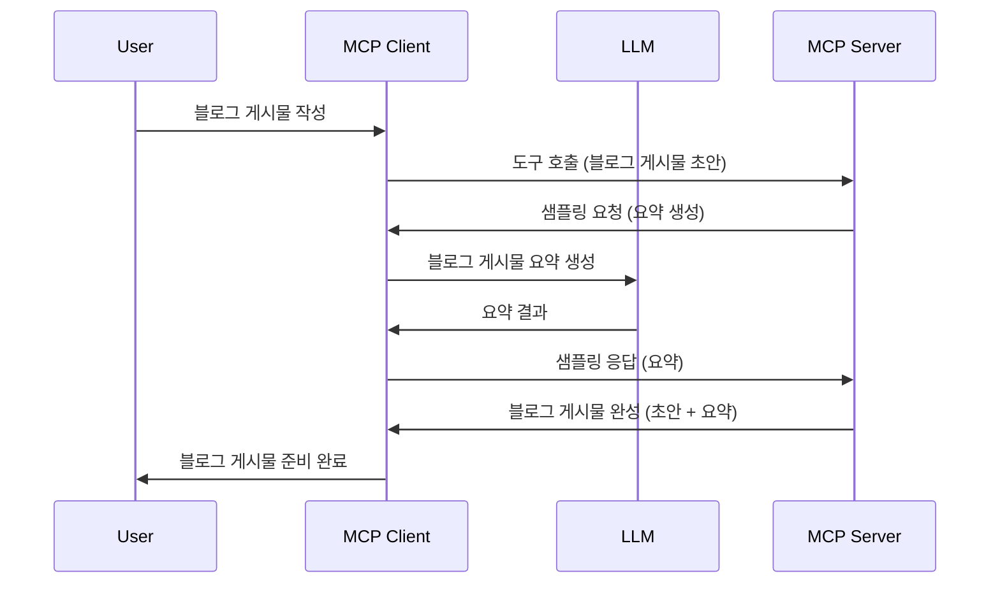

# 샘플링 - 클라이언트에 기능 위임하기

때때로 MCP 클라이언트와 MCP 서버가 공동의 목표를 달성하기 위해 협력해야 할 때가 있습니다. 서버 측에서 클라이언트에 위치한 LLM의 도움이 필요한 경우가 있을 수 있습니다. 이럴 때 사용할 기능이 바로 샘플링입니다.

샘플링 사용 사례들과 이를 활용한 솔루션 구축 방법을 살펴보겠습니다.

## 개요

이 수업에서는 샘플링을 언제, 어디서 사용해야 하는지와 샘플링 구성 방법을 중점적으로 설명합니다.

## 학습 목표

이번 장에서는 다음을 다룹니다:

- 샘플링이 무엇이고 언제 사용하는지 설명합니다.
- MCP에서 샘플링을 구성하는 방법을 보여줍니다.
- 샘플링이 작동하는 예시를 제공합니다.

## 샘플링이란 무엇이며 왜 사용하는가?

샘플링은 다음과 같이 동작하는 고급 기능입니다:



### 샘플링 요청

좋습니다. 이제 그럴듯한 시나리오의 큰 그림을 보았으니, 서버가 클라이언트에 보내는 샘플링 요청에 대해 이야기해보겠습니다. JSON-RPC 형식의 요청 예시는 다음과 같습니다:

```json
{
  "jsonrpc": "2.0",
  "id": 1,
  "method": "sampling/createMessage",
  "params": {
    "messages": [
      {
        "role": "user",
        "content": {
          "type": "text",
          "text": "Create a blog post summary of the following blog post: <BLOG POST>"
        }
      }
    ],
    "modelPreferences": {
      "hints": [
        {
          "name": "claude-3-sonnet"
        }
      ],
      "intelligencePriority": 0.8,
      "speedPriority": 0.5
    },
    "systemPrompt": "You are a helpful assistant.",
    "maxTokens": 100
  }
}
```

여기서 주의할 점은 다음과 같습니다:

- content -> text 아래의 Prompt는 LLM에게 블로그 글 내용을 요약하도록 지시하는 프롬프트입니다.

- **modelPreferences**. 이 섹션은 단지 선호사항으로, LLM에 어떤 구성으로 작업할지에 대한 권고입니다. 사용자는 권고를 따르거나 변경할 수 있습니다. 이 경우, 사용할 모델과 속도 및 지능 우선순위에 대한 권고가 있습니다.
- <strong>systemPrompt</strong>는 일반적인 시스템 프롬프트로, LLM에 개성을 부여하고 지침을 포함합니다.
- <strong>maxTokens</strong>는 이 작업에 권고되는 최대 토큰 수를 나타내는 속성입니다.

### 샘플링 응답

이 응답은 MCP 클라이언트가 LLM에 호출하고 응답을 받아 구성하여 MCP 서버에 다시 보내는 메시지입니다. JSON-RPC 예시는 다음과 같습니다:

```json
{
  "jsonrpc": "2.0",
  "id": 1,
  "result": {
    "role": "assistant",
    "content": {
      "type": "text",
      "text": "Here's your abstract <ABSTRACT>"
    },
    "model": "gpt-5",
    "stopReason": "endTurn"
  }
}
```

응답이 요청한 대로 블로그 글 요약임을 확인할 수 있습니다. 또한 사용된 `model`이 요청한 모델이 아닌 "gpt-5"(요청된 "claude-3-sonnet" 대신)라는 점도 확인할 수 있습니다. 이는 사용자가 어떤 모델을 사용할지 마음을 바꿀 수 있으며, 샘플링 요청은 권고임을 보여주기 위함입니다.

이제 주요 흐름과 유용한 작업인 "블로그 글 생성 + 요약"에 대해 이해했으니, 정상 작동을 위해 해야 할 일을 살펴보겠습니다.

### 메시지 유형

샘플링 메시지는 단순 텍스트에 한정되지 않고, 이미지나 오디오도 보낼 수 있습니다. JSON-RPC의 차이점은 다음과 같습니다:

<strong>텍스트</strong>

```json
{
  "type": "text",
  "text": "The message content"
}
```

**이미지 콘텐츠**

```json
{
  "type": "image",
  "data": "base64-encoded-image-data",
  "mimeType": "image/jpeg"
}
```

**오디오 콘텐츠**

```json
{
  "type": "audio",
  "data": "base64-encoded-audio-data",
  "mimeType": "audio/wav"
}
```

> NOTE: 샘플링에 대한 자세한 정보는 [공식 문서](https://modelcontextprotocol.io/specification/2025-11-25/client/sampling)를 참고하세요.

## 클라이언트에서 샘플링 구성 방법

> 참고: 서버만 구축하는 경우에는 여기서 특별히 할 일이 많지 않습니다.

클라이언트에서는 다음과 같이 해당 기능을 지정해야 합니다:

```json
{
  "capabilities": {
    "sampling": {}
  }
}
```

선택한 클라이언트가 서버와 초기화될 때 이 설정이 반영됩니다.

## 샘플링 사용 예시 - 블로그 글 작성하기

함께 샘플링 서버 코드를 작성해 봅시다. 다음을 수행해야 합니다:

1. 서버에서 툴을 생성합니다.
1. 해당 툴에서 샘플링 요청을 생성해야 합니다.
1. 클라이언트의 샘플링 요청 답변을 기다립니다.
1. 툴이 결과를 생성합니다.

단계별 코드를 살펴보겠습니다:

### -1- 툴 생성하기

**python**

```python
@mcp.tool()
async def create_blog(title: str, content: str, ctx: Context[ServerSession, None]) -> str:
    """Create a blog post and generate a summary"""

```

### -2- 샘플링 요청 생성하기

툴을 다음 코드로 확장하세요:

**python**

```python
post = BlogPost(
        id=len(posts) + 1,
        title=title,
        content=content,
        abstract=""
    )

prompt = f"Create an abstract of the following blog post: title: {title} and draft: {content} "

result = await ctx.session.create_message(
        messages=[
            SamplingMessage(
                role="user",
                content=TextContent(type="text", text=prompt),
            )
        ],
        max_tokens=100,
)

```

### -3- 응답 기다리고 반환하기

**python**

```python
post.abstract = result.content.text

posts.append(post)

# 완성된 제품을 반환하십시오
return json.dumps({
    "id": post.title,
    "abstract": post.abstract
})
```

### -4- 전체 코드

**python**

```python
from starlette.applications import Starlette
from starlette.routing import Mount, Host

from mcp.server.fastmcp import Context, FastMCP

from mcp.server.session import ServerSession
from mcp.types import SamplingMessage, TextContent

import json


from uuid import uuid4
from typing import List
from pydantic import BaseModel


mcp = FastMCP("Blog post generator")

# app = FastAPI()

posts = []

class BlogPost(BaseModel):
    id: int
    title: str
    content: str
    abstract: str

posts: List[BlogPost] = []

@mcp.tool()
async def create_blog(title: str, content: str, ctx: Context[ServerSession, None]) -> str:
    """Create a blog post and generate a summary"""

    post = BlogPost(
        id=len(posts) + 1,
        title=title,
        content=content,
        abstract=""
    )

    prompt = f"Create an abstract of the following blog post: title: {title} and draft: {content} "

    result = await ctx.session.create_message(
        messages=[
            SamplingMessage(
                role="user",
                content=TextContent(type="text", text=prompt),
            )
        ],
        max_tokens=100,
    )

    post.abstract = result.content.text

    posts.append(post)

    # 완성된 블로그 게시물을 반환합니다
    return json.dumps({
        "id": post.title,
        "abstract": post.abstract
    })

if __name__ == "__main__":
    print("Starting server...")
    # mcp.run()
    mcp.run(transport="streamable-http")

# 다음 명령으로 앱을 실행합니다: python server.py
```

### -5- Visual Studio Code에서 테스트하기

Visual Studio Code에서 테스트하려면 다음을 실행하세요:

1. 터미널에서 서버를 시작합니다.
1. <em>mcp.json</em>에 추가하고(서버가 실행 중인지 확인) 다음과 같이 설정합니다:

   ```json
   "servers": {
      "blog-server": {
        "type": "http",
        "url": "http://localhost:8000/mcp"
      }
   }
   ```

1. 프롬프트를 입력하세요:

   ```text
   create a blog post named "Where Python comes from", the content is "Python is actually named after Monty Python Flying Circus"
   ```

1. 샘플링이 진행되도록 합니다. 처음 테스트할 때는 추가 대화창이 나타나며 수락해야 하고, 이후에는 툴 실행 요청 대화창이 정상적으로 표시됩니다.

1. 결과를 확인하세요. 결과는 깔끔하게 GitHub Copilot Chat에서 렌더링되며, 원시 JSON 응답도 확인할 수 있습니다.

<strong>보너스</strong>. Visual Studio Code 도구는 샘플링을 훌륭히 지원합니다. 설치된 서버의 샘플링 접근 권한을 설정하려면 다음과 같이 하세요:

1. 확장(Extensions) 섹션으로 이동합니다.
1. "MCP SERVERS - INSTALLED" 구역에서 설치된 서버의 톱니바퀴 아이콘을 선택합니다.
1. "Configure Model Access"를 선택하면, GitHub Copilot이 샘플링할 때 사용할 수 있는 모델을 설정할 수 있습니다. "Show Sampling requests"를 선택하면 최근 발생한 모든 샘플링 요청을 볼 수 있습니다.

## 과제

이번 과제에서는 약간 다른 샘플링, 즉 제품 설명 생성 기능을 지원하는 샘플링 통합을 만듭니다. 시나리오는 다음과 같습니다:

<strong>시나리오</strong>: 전자상거래 백오피스 직원은 제품 설명을 작성하는 데 너무 많은 시간이 걸립니다. 따라서 "title"과 "keywords"를 인자로 받아 "description" 필드를 클라이언트의 LLM으로 채워 완성된 제품을 생성하는 "create_product" 툴을 호출할 수 있는 솔루션을 만듭니다.

TIP: 이전에 배운 내용을 활용해 샘플링 요청을 사용하여 이 서버와 툴을 구성하세요.

## 솔루션

[솔루션](./solution/README.md)

## 주요 내용 요약

샘플링은 서버가 LLM 도움이 필요할 때 클라이언트에 작업을 위임할 수 있게 해주는 강력한 기능입니다.

## 다음 학습 내용

- [4장 - 실전 구현](../../04-PracticalImplementation/README.md)

---

<!-- CO-OP TRANSLATOR DISCLAIMER START -->
**면책 조항**:
이 문서는 AI 번역 서비스 [Co-op Translator](https://github.com/Azure/co-op-translator)를 사용하여 번역되었습니다. 정확성을 기하기 위해 노력하고 있으나, 자동 번역은 오류나 부정확한 부분이 있을 수 있음을 유의하시기 바랍니다. 원본 문서의 원어본이 권위 있는 자료로 간주되어야 합니다. 중요한 정보의 경우, 전문가의 인간 번역을 권장합니다. 이 번역 사용으로 인해 발생하는 오해나 잘못된 해석에 대해 당사는 책임을 지지 않습니다.
<!-- CO-OP TRANSLATOR DISCLAIMER END -->