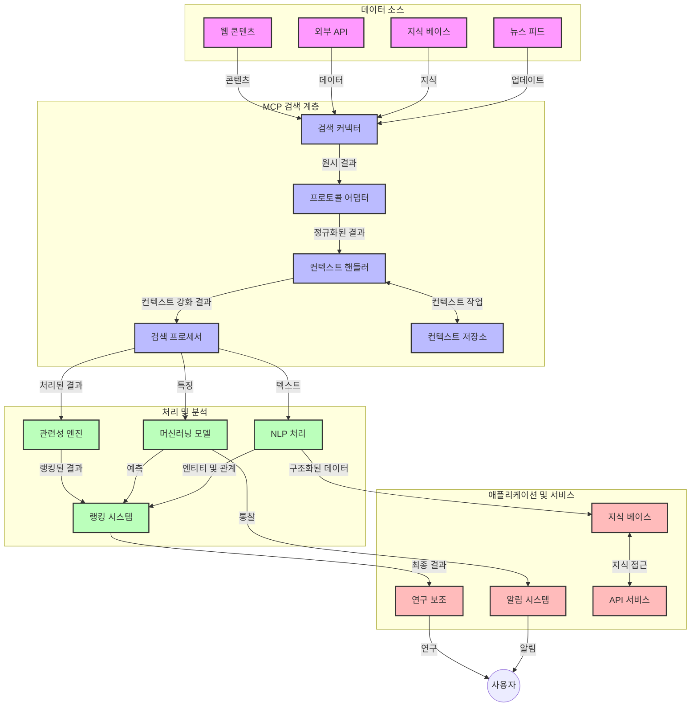
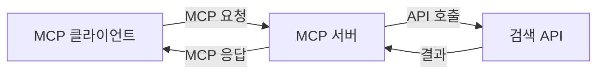
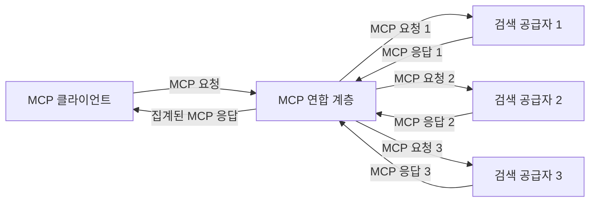
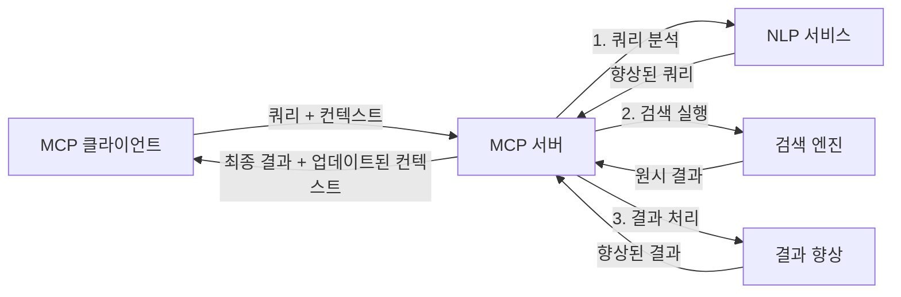

# 실시간 웹 검색을 위한 모델 컨텍스트 프로토콜

## 개요

실시간 웹 검색은 오늘날 정보 중심 환경에서 필수적이며, 애플리케이션이 관련 있고 시기적절한 응답을 제공하기 위해 인터넷 전반의 최신 정보에 즉시 접근해야 하는 상황에서 중요합니다. 모델 컨텍스트 프로토콜(MCP)은 이러한 실시간 검색 프로세스를 최적화하여 검색 효율성을 향상시키고, 컨텍스트 무결성을 유지하며, 전체 시스템 성능을 개선하는 중요한 발전을 나타냅니다.

이 모듈은 MCP가 AI 모델, 검색 엔진 및 애플리케이션 전반에 걸쳐 컨텍스트 관리를 표준화된 방식으로 제공함으로써 실시간 웹 검색을 어떻게 변화시키는지 탐구합니다.

### 학습할 내용

이 종합 가이드에서는 다음과 같은 내용을 배우게 됩니다:

- MCP가 AI 모델과 실시간 웹 검색 기능 사이에 끊김 없는 다리를 어떻게 구축하는지
- MCP를 활용한 효율적이고 확장 가능한 검색 솔루션 구현을 위한 아키텍처 패턴
- 여러 쿼리와 상호작용에 걸쳐 검색 컨텍스트를 유지하는 기법
- 다양한 검색 시나리오에 대한 Python과 JavaScript 실용 코드 구현
- MCP 기반 검색 시스템에서 관련성, 최신성 및 성능을 균형있게 조절하는 방법

## 실시간 웹 검색 소개

실시간 웹 검색은 웹 기반 정보가 게시되거나 업데이트되는 대로 지속적으로 쿼리, 처리 및 분석하도록 하는 기술적 접근법으로, 시스템이 지연을 최소화하여 신선하고 관련성 있는 정보를 제공할 수 있도록 합니다. 전통적인 검색 시스템이 수 시간 또는 수 일 전에 인덱싱된 데이터를 사용하는 것과 달리, 실시간 검색은 웹의 실시간 데이터를 처리하여 온라인 콘텐츠의 현재 상태를 반영하는 통찰과 정보를 제공합니다.

### 실시간 웹 검색의 핵심 개념:

- **지속적 쿼리 처리**: 검색 쿼리가 끊임없이 업데이트되는 데이터 소스에 대해 처리됨
- **최신성 우선순위 부여**: 신선한 정보에 우선순위를 둠
- **관련성 균형 유지**: 관련성과 최신성 사이의 조화 유지
- **확장 가능한 아키텍처**: 변화하는 쿼리 부하와 데이터 볼륨을 감당할 수 있어야 함
- **컨텍스트 이해**: 검색 반복 간 사용자 컨텍스트를 유지하여 의미 있는 결과 제공
- **동적 쿼리 재구성**: 컨텍스트와 이전 결과에 기반해 쿼리를 적응적으로 조정
- **다중 소스 통합**: 여러 검색 제공자 및 웹 소스의 결과 결합
- **의미 기반 이해**: 단순 키워드가 아닌 의미를 기반으로 쿼리 및 콘텐츠 처리
- **실시간 랭킹**: 새로운 정보 입수에 따라 결과 순위 지속적으로 조정

### 모델 컨텍스트 프로토콜과 실시간 웹 검색

모델 컨텍스트 프로토콜(MCP)은 실시간 웹 검색 환경의 여러 핵심 문제를 해결합니다:

1. **검색 컨텍스트 보존**: MCP는 분산된 검색 구성 요소 전반에서 컨텍스트를 유지하는 방식을 표준화하여 AI 모델과 처리 노드가 관련 쿼리 이력과 사용자 선호 정보를 활용할 수 있게 합니다.

2. **효율적인 쿼리 관리**: 컨텍스트 전송을 위한 구조화된 메커니즘을 제공하여 각 검색 반복에서 컨텍스트를 반복하는 오버헤드를 줄입니다.

3. <strong>상호운용성</strong>: MCP는 다양한 검색 기술과 AI 모델 사이에서 컨텍스트 공유를 위한 공통 언어를 만들어 더 유연하고 확장 가능한 아키텍처를 가능하게 합니다.

4. **검색 최적화 컨텍스트**: MCP 구현은 효과적인 검색을 위해 가장 중요한 컨텍스트 요소를 우선시하여 성능과 정확성을 모두 최적화할 수 있습니다.

5. **적응형 검색 처리**: MCP를 통한 적절한 컨텍스트 관리로, 검색 시스템은 변화하는 사용자 요구와 정보 환경에 따라 처리 방식을 동적으로 조절할 수 있습니다.

뉴스 집계부터 연구 지원 도구에 이르기까지 현대 애플리케이션에서 MCP와 웹 검색 기술의 통합은 사용자 상호작용이 지속될수록 점점 더 관련성 높은 결과를 제공하는 지능형 컨텍스트 인식 검색을 가능하게 합니다.

## 학습 목표

본 강의를 마치면 다음을 수행할 수 있습니다:

- 현대 애플리케이션에서 실시간 웹 검색의 기본 개념과 도전 과제를 이해
- 모델 컨텍스트 프로토콜(MCP)이 실시간 웹 검색 기능을 어떻게 향상시키는지 설명
- 인기 있는 프레임워크와 API를 이용해 MCP 기반 검색 솔루션 구현
- MCP를 활용한 확장 가능하고 고성능 검색 아키텍처 설계 및 배포
- 시맨틱 검색, 연구 지원, AI 증강 브라우징 등 다양한 사용 사례에 MCP 개념 적용
- MCP 기반 검색 기술의 신흥 트렌드와 미래 혁신 평가
- 사용자 상호작용을 학습하는 컨텍스트 인식 검색 시스템 개발
- 표준화된 MCP 프로토콜을 사용해 AI 어시스턴트에 웹 검색 기능 통합
- 컨텍스트 기반 점진적 결과 개선을 위한 다단계 검색 파이프라인 생성
- 포괄적인 컨텍스트 인식을 유지하며 검색 성능 최적화

### 정의 및 중요성

실시간 웹 검색은 지연을 최소화하여 웹 기반 정보를 지속적으로 쿼리, 검색, 전달하는 것을 의미합니다. 전통적인 검색 엔진이 주기적으로 웹을 크롤링하고 인덱싱하는 것과 달리, 실시간 검색은 정보가 제공되는 즉시 이를 노출시키는 것을 목표로 하며, 가장 최신 콘텐츠에 즉시 접근할 수 있게 합니다.

실시간 웹 검색의 주요 특징은 다음과 같습니다:

- <strong>신선도</strong>: 최근 콘텐츠와 업데이트에 우선순위 부여
- **지속적 처리**: 새로운 정보를 끊임없이 모니터링
- **쿼리 적응**: 컨텍스트와 피드백에 따라 검색 쿼리 정제
- **즉시 제공**: 지연 없이 검색 결과 제공
- **컨텍스트 유지**: 이전 쿼리를 기반으로 관련성 향상

### 전통적 웹 검색의 한계

전통적인 웹 검색 방식은 실시간 시나리오에 적용할 때 다음과 같은 한계에 직면합니다:

1. **컨텍스트 단절**: 여러 쿼리에 걸친 검색 컨텍스트 유지의 어려움
2. **정보 신선도**: 최신 정보를 접속하고 우선순위를 정하는 데 어려움
3. **통합 복잡성**: 검색 시스템과 애플리케이션 간 상호운용성 문제
4. **지연 문제**: 포괄적 검색과 응답 시간 요건 간 균형 잡기
5. **관련성 조정**: 최신성을 우선시하면서 정확성과 관련성 유지

## 검색을 위한 모델 컨텍스트 프로토콜(MCP)의 이해

### 검색 컨텍스트에서 MCP란?

모델 컨텍스트 프로토콜(MCP)은 AI 모델과 애플리케이션 간의 효율적인 상호작용을 돕기 위해 설계된 표준화된 통신 프로토콜입니다. 실시간 웹 검색 맥락에서 MCP는 다음을 위한 프레임워크를 제공합니다:

- 쿼리 연속성 전반에 걸친 검색 컨텍스트 보존
- 검색 쿼리 및 결과 형식의 표준화
- 검색 매개변수 및 결과 전송 최적화
- 모델과 검색 엔진 간 통신 강화

### 핵심 구성 요소 및 아키텍처

실시간 웹 검색을 위한 MCP 아키텍처는 주요 구성 요소들로 이루어져 있습니다:

1. **쿼리 컨텍스트 핸들러**: 여러 쿼리에 걸친 검색 컨텍스트를 관리 및 유지
2. **검색 프로세서**: 컨텍스트 인식 기술로 들어오는 검색 요청 처리
3. **프로토콜 어댑터**: 컨텍스트를 보존하며 다양한 검색 API 간 변환
4. **컨텍스트 저장소**: 검색 이력과 선호 정보를 효율적으로 저장 및 조회
5. **검색 커넥터**: 다양한 검색 엔진과 웹 API에 연결



### MCP가 실시간 웹 검색을 향상시키는 방법

MCP는 전통적인 웹 검색 문제를 다음과 같이 해결합니다:

- **컨텍스트 연속성**: 전체 검색 세션에 걸쳐 쿼리 간의 관계 유지
- **최적화된 전송**: 지능적인 컨텍스트 관리로 검색 매개변수 중복 감소
- **표준화된 인터페이스**: 검색 구성 요소에 일관된 API 제공
- **지연 감소**: 효율적인 컨텍스트 처리로 처리 오버헤드 최소화
- **관련성 향상**: 여러 쿼리에 걸친 사용자 의도 보존으로 검색 관련도 개선

## 통합 및 구현

실시간 웹 검색 시스템은 성능과 컨텍스트 무결성을 모두 유지하기 위한 신중한 아키텍처 설계 및 구현이 필요합니다. 모델 컨텍스트 프로토콜은 AI 모델과 검색 기술을 통합하는 표준화된 접근법을 제공하여 더 정교하고 컨텍스트 인식이 가능한 검색 파이프라인을 구현할 수 있게 합니다.

### 검색 아키텍처에서 MCP 통합 개요

실시간 웹 검색 환경에서 MCP를 구현할 때 주요 고려 사항은 다음과 같습니다:

1. **검색 컨텍스트 직렬화**: MCP는 검색 요청 내에서 컨텍스트 정보를 인코딩하는 효율적인 메커니즘을 제공하여, 필수 컨텍스트가 처리 파이프라인 전반에 쿼리와 함께 전달되도록 합니다. 여기에는 검색 관련 메타데이터에 최적화된 표준화된 직렬화 형식이 포함됩니다.

2. **상태 기반 검색 처리**: MCP는 검색 반복 간 일관된 컨텍스트 표현을 유지함으로써 더욱 지능적인 상태 기반 처리를 가능하게 합니다. 이는 컨텍스트 정제가 결과를 개선하는 다단계 검색 파이프라인에서 특히 중요합니다.

3. **쿼리 확장 및 정제**: MCP 기반 검색 시스템은 누적된 컨텍스트에 따라 정교한 쿼리 확장 및 정제를 지원하여 검색 세션이 진행될수록 결과의 관련성이 증가하게 합니다.

4. **결과 캐싱 및 우선순위 지정**: MCP는 컨텍스트 처리를 표준화하여 결과 캐싱과 우선순위 관리를 돕고, 구성 요소가 변화하는 검색 컨텍스트에 맞춰 적응할 수 있게 합니다.

5. **검색 연합 및 집계**: MCP는 구조화된 검색 컨텍스트 표현을 제공하여 여러 백엔드에 걸친 고도화된 검색 연합을 가능하게 하며, 다양하고 이질적인 소스에서 의미 있는 결과 집계를 구현할 수 있습니다.

다양한 검색 기술에 걸쳐 MCP가 구현되면서, 맞춤 통합 코드를 줄이고 검색 쿼리가 진화함에 따라 의미 있는 컨텍스트를 유지하는 시스템 역량을 강화하는 통합된 컨텍스트 관리 접근법이 마련됩니다.

### 여러 웹 검색 구현에서의 MCP

아래 예시는 JSON-RPC 기반 프로토콜과 구별되는 전송 메커니즘에 중점을 둔 현재 MCP 사양을 따릅니다. 코드는 MCP 프로토콜과 완전한 호환성을 유지하면서 맞춤형 검색 통합을 구현하는 방식을 보여줍니다.


<details>
<summary>Generic Search API를 활용한 Python 구현</summary>

```python
import asyncio
import json
import aiohttp
from typing import Dict, Any, Optional, List
from contextlib import asynccontextmanager
from collections.abc import AsyncIterator

# 표준 MCP 라이브러리 가져오기
from mcp.client.session import ClientSession
from mcp.client.streamable_http import streamablehttp_client
from mcp.types import TextContent, CreateMessageRequestParams, CreateMessageResult
from mcp.server.fastmcp import FastMCP

# 웹 검색을 위한 FastMCP 서버 생성
search_server = FastMCP("WebSearch")

# 웹 검색 작업을 처리하는 클래스
class WebSearchHandler:
    def __init__(self, api_endpoint: str, api_key: str):
        self.api_endpoint = api_endpoint
        self.api_key = api_key
        self.session = None
        
    async def initialize(self):
        """Initialize the HTTP session"""
        self.session = aiohttp.ClientSession(
            headers={"Authorization": f"Bearer {self.api_key}"}
        )
    
    async def close(self):
        """Close the HTTP session"""
        if self.session:
            await self.session.close()
            
    async def perform_search(self, query: str, max_results: int = 5, 
                           include_domains: List[str] = None, 
                           exclude_domains: List[str] = None,
                           time_period: str = "any") -> Dict[str, Any]:
        """Perform web search using the search API"""
        # 검색 매개변수 구성
        search_params = {
            "q": query,
            "limit": max_results,
            "time": time_period
        }
        
        if include_domains:
            search_params["site"] = ",".join(include_domains)
            
        if exclude_domains:
            search_params["exclude_site"] = ",".join(exclude_domains)
        
        # 검색 요청 수행
        try:
            async with self.session.get(
                self.api_endpoint,
                params=search_params
            ) as response:
                if response.status != 200:
                    error_text = await response.text()
                    raise Exception(f"Search API error: {response.status} - {error_text}")
                
                search_data = await response.json()
                
                # API별 응답을 표준 형식으로 변환
                results = []
                for item in search_data.get("results", []):
                    results.append({
                        "title": item.get("title", ""),
                        "url": item.get("url", ""),
                        "snippet": item.get("snippet", ""),
                        "date": item.get("published_date", ""),
                        "source": item.get("source", "")
                    })
                
                return {
                    "query": query,
                    "totalResults": len(results),
                    "results": results
                }
        except Exception as e:
            print(f"Search API request error: {e}")
            raise

# 검색 핸들러 초기화
search_handler = WebSearchHandler(
    api_endpoint="https://api.search-service.example/search",
    api_key="your-api-key-here"
)

# 검색 핸들러 관리를 위한 수명 주기 설정
@asyncio.asynccontextmanager
async def app_lifespan(server: FastMCP):
    """Manage application lifecycle"""
    await search_handler.initialize()
    try:
        yield {"search_handler": search_handler}
    finally:
        await search_handler.close()

# 서버 수명 주기 설정
search_server = FastMCP("WebSearch", lifespan=app_lifespan)

# 웹 검색 도구 등록
@search_server.tool()
async def web_search(query: str, max_results: int = 5, 
                   include_domains: List[str] = None,
                   exclude_domains: List[str] = None,
                   time_period: str = "any") -> Dict[str, Any]:
    """
    Search the web for information
    
    Args:
        query: The search query
        max_results: Maximum number of results to return (default: 5)
        include_domains: List of domains to include in search results
        exclude_domains: List of domains to exclude from search results
        time_period: Time period for results ("day", "week", "month", "any")
        
    Returns:
        Dictionary containing search results
    """
    ctx = search_server.get_context()
    search_handler = ctx.request_context.lifespan_context["search_handler"]
    
    results = await search_handler.perform_search(
        query=query,
        max_results=max_results,
        include_domains=include_domains,
        exclude_domains=exclude_domains,
        time_period=time_period
    )
    
    return results

# 클라이언트 사용 예제
async def client_example():
    # Streamable HTTP 전송을 사용하여 검색 서버에 연결
    async with streamablehttp_client("http://localhost:8000/mcp") as (read, write, _):
        async with ClientSession(read, write) as session:
            # 연결 초기화
            await session.initialize()
            
            # web_search 도구 호출
            search_results = await session.call_tool(
                "web_search", 
                {
                    "query": "latest developments in AI and Model Context Protocol",
                    "max_results": 5,
                    "time_period": "day",
                    "include_domains": ["github.com", "microsoft.com"]
                }
            )
            
            print(f"Search results: {search_results}")

# 서버 실행 예제
if __name__ == "__main__":
    # Streamable HTTP 전송으로 서버 실행
    search_server.run(transport="streamable-http")
```
</details> 

<details>
<summary>브라우저 기반 검색을 위한 JavaScript 구현</summary>


```javascript
// 웹 검색을 위한 MCP 서버 구현
import { McpServer, ResourceTemplate } from '@modelcontextprotocol/sdk/server/mcp.js';
import { StreamableHTTPServerTransport } from '@modelcontextprotocol/sdk/server/streamableHttp.js';
import { z } from 'zod';

// 웹 검색을 위한 MCP 서버 생성
const searchServer = new McpServer({
    name: "BrowserSearch",
    description: "A server that provides web search capabilities"
});

// 검색 서비스 클래스
class SearchService {
    constructor(searchApiUrl, apiKey) {
        this.searchApiUrl = searchApiUrl;
        this.apiKey = apiKey;
    }

    async performSearch(parameters) {
        const {
            query = '',
            maxResults = 5,
            includeDomains = [],
            excludeDomains = [],
            timePeriod = 'any'
        } = parameters;
        
        // 매개변수를 사용하여 검색 URL 구성
        const url = new URL(this.searchApiUrl);
        url.searchParams.append('q', query);
        url.searchParams.append('limit', maxResults);
        url.searchParams.append('time', timePeriod);
        
        if (includeDomains.length > 0) {
            url.searchParams.append('site', includeDomains.join(','));
        }
        
        if (excludeDomains.length > 0) {
            url.searchParams.append('exclude_site', excludeDomains.join(','));
        }
        
        try {
            const response = await fetch(url.toString(), {
                method: 'GET',
                headers: {
                    'Authorization': `Bearer ${this.apiKey}`,
                    'Content-Type': 'application/json'
                }
            });
            
            if (!response.ok) {
                const errorText = await response.text();
                throw new Error(`Search API error: ${response.status} - ${errorText}`);
            }
            
            const searchData = await response.json();
            
            // API별 응답을 표준 형식으로 변환
            const results = searchData.results?.map(item => ({
                title: item.title || '',
                url: item.url || '',
                snippet: item.snippet || '',
                date: item.published_date || '',
                source: item.source || ''
            })) || [];
            
            return {
                query,
                totalResults: results.length,
                results
            };
        } catch (error) {
            console.error('Search API request error:', error);
            throw error;
        }
    }
}

// 검색 서비스 초기화
const searchService = new SearchService(
    'https://api.search-service.example/search',
    'your-api-key-here'
);

// 서버용 컨텍스트 제공자 설정
searchServer.setContextProvider(() => {
    return {
        searchService
    };
});

// 웹 검색 도구 등록
searchServer.tool({
    name: 'web_search',
    description: 'Search the web for information',
    parameters: {
        type: 'object',
        properties: {
            query: {
                type: 'string',
                description: 'The search query'
            },
            maxResults: {
                type: 'integer',
                description: 'Maximum number of results to return',
                default: 5
            },
            includeDomains: {
                type: 'array',
                items: { type: 'string' },
                description: 'List of domains to include in search results'
            },
            excludeDomains: {
                type: 'array',
                items: { type: 'string' },
                description: 'List of domains to exclude from search results'
            },
            timePeriod: {
                type: 'string',
                description: 'Time period for results',
                enum: ['day', 'week', 'month', 'any'],
                default: 'any'
            }
        },
        required: ['query']
    },
    handler: async (params, context) => {
        const { searchService } = context;
        return await searchService.performSearch(params);
    }
});

// 검색 서버에 연결하는 예제 클라이언트 코드
import { Client } from '@modelcontextprotocol/sdk/client/index.js';
import { StreamableHTTPClientTransport } from '@modelcontextprotocol/sdk/client/streamableHttp.js';

async function connectToSearchServer() {
    // 검색 서버에 연결
    const transport = new StreamableHTTPClientTransport(
        new URL('http://localhost:8000/mcp')
    );
    
    const client = new Client({
        name: 'search-client',
        version: '1.0.0'
    });
    
    await client.connect(transport);
    
    // 검색 도구 실행
    const searchResults = await client.callTool({
        name: 'web_search',
        arguments: {
            query: 'Model Context Protocol implementation examples',
            maxResults: 10,
            timePeriod: 'week',
            includeDomains: ['github.com', 'docs.microsoft.com']
        }
    });
    
    console.log('Search results:', searchResults);
    
    // 정리 작업
    await client.disconnect();
}

// 서버 시작
const transport = new StreamableHTTPServerTransport();
await searchServer.connect(transport);
console.log('Search server running at http://localhost:8000/mcp');

// 별도의 프로세스나 서버 시작 후
// connectToSearchServer().catch(console.error);
```
</details> 


## 코드 예제 고지사항

> **중요 참고**: 아래 코드 예제는 모델 컨텍스트 프로토콜(MCP)과 웹 검색 기능을 통합하는 방식을 보여줍니다. 공식 MCP SDK의 패턴과 구조를 따르나 교육 목적으로 단순화된 예제입니다.
> 
> 본 예제에서는:
> 
> 1. **Python 구현**: 외부 검색 API에 연결하는 웹 검색 도구를 제공하는 FastMCP 서버 구현을 보여줍니다. 이 예에서는 [공식 MCP Python SDK](https://github.com/modelcontextprotocol/python-sdk)의 패턴에 따라 적절한 수명 관리, 컨텍스트 처리, 도구 구현을 시연합니다. 서버는 기존 SSE 전송을 대체한 권장 스트리밍 HTTP 전송을 사용합니다.
> 
> 2. **JavaScript 구현**: [공식 MCP TypeScript SDK](https://github.com/modelcontextprotocol/typescript-sdk)에서 권장하는 FastMCP 패턴을 활용해 올바른 도구 정의와 클라이언트 연결을 갖춘 검색 서버를 작성한 TypeScript/JavaScript 구현입니다. 최신 권장 세션 관리 및 컨텍스트 보존 패턴을 따릅니다.
> 
> 이 예제들은 실제 사용을 위해서는 추가적인 오류 처리, 인증, API 통합 코드가 필요합니다. 코드 내에 표시된 검색 API 엔드포인트(`https://api.search-service.example/search`)는 플레이스홀더이며 실제 검색 서비스 엔드포인트로 교체해야 합니다.
> 
> 완벽한 구현 세부사항 및 최신 방법은 [공식 MCP 사양](https://spec.modelcontextprotocol.io/)과 SDK 문서를 참고하시기 바랍니다.

## 핵심 개념

### 모델 컨텍스트 프로토콜(MCP) 프레임워크

기본적으로 모델 컨텍스트 프로토콜은 AI 모델, 애플리케이션, 서비스 간에 컨텍스트를 교환하는 표준화된 방법을 제공합니다. 실시간 웹 검색에서 이 프레임워크는 일관성 있는 다중 턴 검색 경험을 만드는 데 필수적입니다. 주요 구성요소는:

1. **클라이언트-서버 아키텍처**: MCP는 검색 클라이언트(요청자)와 검색 서버(제공자)를 명확히 분리하여 유연한 배포 모델을 지원합니다.

2. **JSON-RPC 통신**: 프로토콜은 JSON-RPC를 메시지 교환에 활용하여 웹 기술과 호환되며, 다양한 플랫폼에서 구현하기 쉽습니다.

3. **컨텍스트 관리**: MCP는 여러 상호작용에 걸쳐 검색 컨텍스트를 유지, 갱신, 활용하는 구조화된 방법을 정의합니다.

4. **도구 정의**: 검색 기능은 파라미터와 반환값이 명확히 정의된 표준화된 도구로 노출됩니다.

5. **스트리밍 지원**: 결과가 점진적으로 도착하는 실시간 검색에 필수적인 스트리밍 결과 지원을 포함합니다.

### 웹 검색 통합 패턴

MCP와 웹 검색을 통합할 때 여러 패턴이 있습니다:

#### 1. 직접 검색 제공자 통합



이 패턴에서는 MCP 서버가 하나 이상의 검색 API와 직접 인터페이스하며, MCP 요청을 API별 호출로 변환하고 결과를 MCP 응답 형식으로 포맷합니다.

#### 2. 컨텍스트 보존을 포함한 연합 검색



이 패턴은 여러 MCP 호환 검색 제공자에게 검색 쿼리를 분산시키며, 각 제공자는 다른 유형의 콘텐츠나 검색 능력에 특화될 수 있고, 통합된 컨텍스트를 유지합니다.

#### 3. 컨텍스트 강화 검색 체인



이 패턴은 검색 과정을 여러 단계로 나누고 각 단계에서 컨텍스트를 풍부하게 하여 점진적으로 더 관련성 높은 결과를 도출합니다.

### 검색 컨텍스트 구성요소

MCP 기반 웹 검색에서 컨텍스트는 일반적으로 다음을 포함합니다:

- **쿼리 이력**: 세션 내 이전 검색 쿼리들
- **사용자 선호**: 언어, 지역, 안전 검색 설정
- **상호작용 이력**: 클릭된 결과, 결과에 머문 시간
- **검색 매개변수**: 필터, 정렬 순서 및 기타 검색 조정자
- **도메인 지식**: 검색과 관련된 주제별 컨텍스트
- **시간적 컨텍스트**: 시간 기반 관련성 요소
- **출처 선호**: 신뢰하거나 선호하는 정보 출처

## 사용 사례 및 적용 분야

### 연구 및 정보 수집

MCP는 연구 워크플로우를 다음과 같이 향상시킵니다:

- 검색 세션 전반에서 연구 컨텍스트 유지
- 보다 정교하고 컨텍스트에 부합하는 쿼리 가능
- 다중 소스 검색 연합 지원
- 검색 결과로부터 지식 추출 지원

### 실시간 뉴스 및 트렌드 모니터링

MCP 기반 검색은 뉴스 모니터링에서 다음과 같은 장점을 제공합니다:

- 신속한 실시간 뉴스 스토리 발견
- 관련 정보의 컨텍스트 기반 필터링
- 다중 출처에 걸친 주제 및 엔티티 추적
- 사용자 컨텍스트에 맞춘 개인화 뉴스 알림

### AI 증강 브라우징 및 연구

MCP는 AI 증강 브라우징에 새로운 가능성을 열어줍니다:

- 현재 브라우저 활동에 기반한 컨텍스트 검색 제안
- LLM 기반 어시스턴트와 웹 검색의 원활한 통합
- 유지되는 컨텍스트로 다중 턴 검색 정제
- 향상된 사실 확인 및 정보 검증

## 미래 동향 및 혁신

### 웹 검색에서 MCP의 진화

앞으로 MCP가 다음과 같은 과제를 해결하며 발전할 것으로 예상됩니다:
- **멀티모달 검색**: 텍스트, 이미지, 오디오, 비디오 검색을 컨텍스트를 유지하여 통합  
- **분산 검색**: 분산형 및 연합형 검색 생태계 지원  
- **검색 개인정보 보호**: 컨텍스트 인지 개인정보 보호 검색 메커니즘  
- **쿼리 이해**: 자연어 검색 쿼리의 심층 의미 구문 분석  

### 기술의 잠재적 발전

미래의 MCP 검색을 형성할 신기술:

1. **신경망 검색 아키텍처**: MCP에 최적화된 임베딩 기반 검색 시스템  
2. **개인화된 검색 컨텍스트**: 사용자의 검색 패턴을 시간에 따라 학습  
3. **지식 그래프 통합**: 도메인 특화 지식 그래프로 강화된 컨텍스트 검색  
4. **교차 모달 컨텍스트**: 다른 검색 모달리티 간 컨텍스트 유지  

## 실습

### 실습 1: 기본 MCP 검색 파이프라인 설정

이 실습에서는 다음을 배우게 됩니다:  
- 기본 MCP 검색 환경 구성  
- 웹 검색을 위한 컨텍스트 핸들러 구현  
- 검색 반복 과정에서 컨텍스트 보존 테스트 및 검증  

### 실습 2: MCP 검색을 활용한 리서치 어시스턴트 구축

다음 기능을 가진 완전한 애플리케이션 생성:  
- 자연어 연구 질문 처리  
- 컨텍스트 인지 웹 검색 수행  
- 다수 소스의 정보 합성  
- 정리된 연구 결과 제시  

### 실습 3: MCP를 활용한 다중 소스 검색 연합 구현

고급 실습 내용:  
- 여러 검색 엔진에 대한 컨텍스트 인지 쿼리 분배  
- 결과 랭킹 및 집계  
- 검색 결과의 컨텍스트 기반 중복 제거  
- 소스별 메타데이터 처리  

## 추가 자료

- [Model Context Protocol Specification](https://spec.modelcontextprotocol.io/) - 공식 MCP 사양 및 상세 프로토콜 문서  
- [Model Context Protocol Documentation](https://modelcontextprotocol.io/) - 상세 튜토리얼 및 구현 가이드  
- [MCP Python SDK](https://github.com/modelcontextprotocol/python-sdk) - MCP 프로토콜의 공식 Python 구현  
- [MCP TypeScript SDK](https://github.com/modelcontextprotocol/typescript-sdk) - MCP 프로토콜의 공식 TypeScript 구현  
- [MCP Reference Servers](https://github.com/modelcontextprotocol/servers) - MCP 서버의 참고 구현  
- [Bing Web Search API Documentation](https://learn.microsoft.com/en-us/bing/search-apis/bing-web-search/overview) - Microsoft의 웹 검색 API  
- [Google Custom Search JSON API](https://developers.google.com/custom-search/v1/overview) - Google의 프로그래머블 검색 엔진  
- [SerpAPI Documentation](https://serpapi.com/search-api) - 검색 엔진 결과 페이지 API  
- [Meilisearch Documentation](https://www.meilisearch.com/docs) - 오픈 소스 검색 엔진  
- [Elasticsearch Documentation](https://www.elastic.co/guide/index.html) - 분산 검색 및 분석 엔진  
- [LangChain Documentation](https://python.langchain.com/docs/get_started/introduction) - LLM 기반 애플리케이션 구축  

## 학습 성과

이 모듈을 완료하면 다음을 할 수 있습니다:

- 실시간 웹 검색의 기본 개념과 도전 과제 이해  
- Model Context Protocol(MCP)이 실시간 웹 검색 기능을 어떻게 향상시키는지 설명  
- 인기 있는 프레임워크와 API를 사용해 MCP 기반 검색 솔루션 구현  
- MCP를 활용한 확장 가능하고 고성능 검색 아키텍처 설계 및 배포  
- 의미 검색, 연구 지원, AI 강화 브라우징 등 다양한 사용 사례에 MCP 개념 적용  
- MCP 기반 검색 기술의 최신 동향 및 미래 혁신 평가  

### 신뢰성과 안전성 고려사항

MCP 기반 웹 검색 솔루션을 구현할 때 MCP 사양에서 제시하는 다음 중요한 원칙을 기억하십시오:

1. **사용자 동의 및 제어**: 사용자는 모든 데이터 접근 및 작업에 대해 명확히 동의하고 이해해야 합니다. 특히 외부 데이터 소스에 접근할 수 있는 웹 검색 구현에서 중요합니다.  

2. **데이터 프라이버시**: 검색 쿼리와 결과가 민감 정보를 포함할 수 있으므로 적절한 처리 및 접근 제어를 구현하여 사용자 데이터를 보호해야 합니다.  

3. **도구 안전성**: 검색 도구는 임의 코드 실행을 통해 보안 위협이 될 수 있으므로 적절한 권한 부여와 검증이 필요합니다. 도구 행동에 대한 설명은 신뢰할 수 있는 서버에서 얻지 않은 한 신뢰하지 않아야 합니다.  

4. **명확한 문서화**: MCP 기반 검색 구현의 기능, 한계, 보안 고려사항에 대해 명확한 문서를 제공하여 MCP 사양의 구현 지침을 따르십시오.  

5. **견고한 동의 절차**: 외부 웹 리소스와 상호작용하는 도구에 대해 사용 허가를 부여하기 전에 각 도구가 수행하는 작업을 명확히 설명하는 견고한 동의 및 승인 흐름을 구축하십시오.  

MCP 보안 및 신뢰성 고려사항에 대한 자세한 내용은 [공식 문서](https://modelcontextprotocol.io/specification/2025-11-25/basic/security_best_practices)를 참고하세요.  

## 다음 단계

- [5.12 Entra ID Authentication for Model Context Protocol Servers](../mcp-security-entra/README.md)

---

<!-- CO-OP TRANSLATOR DISCLAIMER START -->
**면책 조항**:
이 문서는 AI 번역 서비스 [Co-op Translator](https://github.com/Azure/co-op-translator)를 사용하여 번역되었습니다. 정확성을 기하기 위해 노력하고 있으나, 자동 번역은 오류나 부정확한 부분이 있을 수 있음을 유의하시기 바랍니다. 원본 문서의 원어본이 권위 있는 자료로 간주되어야 합니다. 중요한 정보의 경우, 전문가의 인간 번역을 권장합니다. 이 번역 사용으로 인해 발생하는 오해나 잘못된 해석에 대해 당사는 책임을 지지 않습니다.
<!-- CO-OP TRANSLATOR DISCLAIMER END -->