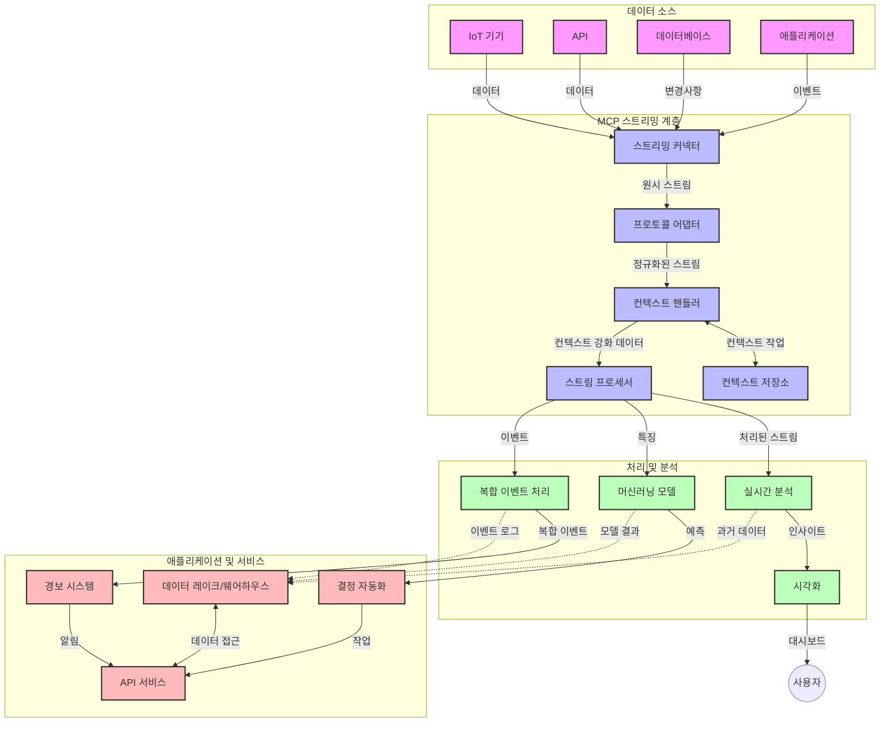

# 실시간 데이터 스트리밍을 위한 모델 컨텍스트 프로토콜

## 개요

실시간 데이터 스트리밍은 오늘날 데이터 중심 세상에서 비즈니스와 애플리케이션이 시기적절한 결정을 내리기 위해 즉각적인 정보 접근이 필수적인 환경에서 매우 중요해졌습니다. 모델 컨텍스트 프로토콜(MCP)은 이러한 실시간 스트리밍 프로세스를 최적화하고, 데이터 처리 효율성을 향상하며, 컨텍스트 무결성을 유지하고, 시스템 전반의 성능을 개선하는 데 있어 중요한 진전을 나타냅니다.

이 모듈은 MCP가 AI 모델, 스트리밍 플랫폼, 애플리케이션 전반에 걸친 컨텍스트 관리를 표준화된 접근법으로 제공함으로써 실시간 데이터 스트리밍을 어떻게 혁신하는지 살펴봅니다.

## 실시간 데이터 스트리밍 소개

실시간 데이터 스트리밍은 데이터가 생성됨과 동시에 지속적으로 전송, 처리 및 분석할 수 있게 하는 기술적 패러다임으로, 시스템이 새로운 정보에 즉시 반응할 수 있도록 합니다. 정적 데이터셋을 대상으로 하는 전통적 배치 처리와 달리, 스트리밍은 이동 중인 데이터를 처리하여 지연 시간을 최소화하며 인사이트와 조치를 제공합니다.

### 실시간 데이터 스트리밍의 핵심 개념:

- **지속적인 데이터 흐름**: 데이터가 계속해서 이벤트나 레코드의 끊임없는 스트림으로 처리됨  
- **저지연 처리**: 데이터 생성과 처리 사이의 시간을 최소화  
- <strong>확장성</strong>: 다양한 데이터 양과 속도를 처리할 수 있는 스트리밍 아키텍처  
- <strong>내결함성</strong>: 데이터 흐름이 중단되지 않도록 장애에 강한 시스템  
- **상태 유지 처리**: 의미 있는 분석을 위해 이벤트 간 컨텍스트 유지 중요  

### 모델 컨텍스트 프로토콜과 실시간 스트리밍

모델 컨텍스트 프로토콜(MCP)은 실시간 스트리밍 환경의 여러 주요 문제를 해결합니다:

1. **컨텍스트 연속성**: MCP는 분산된 스트리밍 구성 요소 간 컨텍스트 유지 방식을 표준화하여 AI 모델과 처리 노드가 관련된 과거 및 환경적 컨텍스트에 접근하도록 보장합니다.

2. **효율적인 상태 관리**: 컨텍스트 전송을 위한 구조화된 메커니즘을 제공하여 스트리밍 파이프라인 내 상태 관리 오버헤드를 감소시킵니다.

3. <strong>상호운용성</strong>: 다양한 스트리밍 기술과 AI 모델 간 컨텍스트 공유를 위한 공통 언어를 만들어 더 유연하고 확장 가능한 아키텍처를 가능하게 합니다.

4. **스트리밍 최적화 컨텍스트**: MCP 구현체는 실시간 의사결정에 가장 관련 있는 컨텍스트 요소를 우선시하여 성능과 정확도 모두를 최적화할 수 있습니다.

5. **적응형 처리**: MCP를 통한 적절한 컨텍스트 관리를 기반으로 스트리밍 시스템이 데이터 내 변화하는 조건과 패턴에 따라 처리 방식을 동적으로 조정할 수 있습니다.

IoT 센서 네트워크부터 금융 거래 플랫폼에 이르기까지, MCP와 스트리밍 기술의 통합은 복잡하고 변화하는 상황에 실시간으로 적절히 반응할 수 있는 더 지능적이고 컨텍스트 인식 처리 방식을 가능하게 합니다.

## 학습 목표

이 수업을 마치면 다음을 할 수 있습니다:

- 실시간 데이터 스트리밍의 기본과 도전 과제 이해
- 모델 컨텍스트 프로토콜(MCP)이 실시간 데이터 스트리밍을 어떻게 향상시키는지 설명
- Kafka 및 Pulsar와 같은 인기 프레임워크를 사용하여 MCP 기반 스트리밍 솔루션 구현
- MCP로 내결함성 및 고성능 스트리밍 아키텍처 설계 및 배포
- IoT, 금융 거래, AI 기반 분석 사례에 MCP 개념 적용
- MCP 기반 스트리밍 기술의 최신 동향과 미래 혁신 평가

### 정의 및 중요성

실시간 데이터 스트리밍이란 최소한의 지연으로 데이터를 지속적으로 생성, 처리, 전달하는 것을 의미합니다. 데이터가 그룹으로 수집되어 처리되는 배치 처리와 달리 스트리밍 데이터는 도착 즉시 점진적으로 처리되어 즉각적인 인사이트와 조치를 가능하게 합니다.

실시간 데이터 스트리밍의 주요 특성:

- <strong>저지연</strong>: 밀리초에서 초 단위 내 데이터 처리 및 분석  
- **지속적 흐름**: 다양한 소스에서 끊임없는 데이터 스트림  
- **즉시 처리**: 배치가 아닌 도착 즉시 데이터 분석  
- **이벤트 기반 아키텍처**: 이벤트 발생 시 즉시 반응  

### 전통적 데이터 스트리밍의 도전 과제

전통적 스트리밍 접근법은 여러 한계가 있습니다:

1. **컨텍스트 손실**: 분산 시스템 전체에서 컨텍스트 유지 어려움  
2. **확장성 문제**: 대용량 및 고속 데이터 처리에서 확장 어려움  
3. **통합 복잡성**: 시스템 간 상호운용성 문제  
4. **지연 관리**: 처리 시간과 처리량의 균형  
5. **데이터 일관성**: 스트림 전반에서 데이터 정확성과 완전성 보장  

## 모델 컨텍스트 프로토콜(MCP) 이해

### MCP란?

모델 컨텍스트 프로토콜(MCP)은 AI 모델과 애플리케이션 간 효율적인 상호작용을 가능하게 하는 표준화된 통신 프로토콜입니다. 실시간 데이터 스트리밍에서 MCP는 다음을 제공합니다:

- 데이터 파이프라인 전반에 걸친 컨텍스트 보존  
- 데이터 교환 포맷 표준화  
- 대용량 데이터 전송 최적화  
- 모델 간 및 모델-애플리케이션 간 통신 강화  

### 핵심 구성 요소 및 아키텍처

실시간 스트리밍용 MCP 아키텍처는 주요 구성 요소로 이루어집니다:

1. **컨텍스트 핸들러**: 스트리밍 파이프라인 전체에서 컨텍스트 정보 관리 및 유지  
2. **스트림 프로세서**: 컨텍스트 인식 기법을 활용해 들어오는 데이터 스트림 처리  
3. **프로토콜 어댑터**: 컨텍스트를 유지하며 다양한 스트리밍 프로토콜 간 변환  
4. **컨텍스트 저장소**: 효과적으로 컨텍스트 정보 저장 및 검색  
5. **스트리밍 커넥터**: Kafka, Pulsar, Kinesis 등 여러 스트리밍 플랫폼과 연결  



### MCP가 실시간 데이터 처리에서 개선하는 점

MCP는 전통적 스트리밍 문제를 다음과 같이 해결합니다:

- **컨텍스트 무결성**: 데이터 포인트 간 관계를 파이프라인 전체에 걸쳐 유지  
- **최적화된 전송**: 지능적 컨텍스트 관리를 통해 데이터 중복 감소  
- **표준화된 인터페이스**: 스트리밍 구성 요소를 위한 일관된 API 제공  
- **지연 감소**: 효율적 컨텍스트 처리로 오버헤드 최소화  
- **확장성 강화**: 컨텍스트 유지와 함께 수평 확장 지원  

## 통합 및 구현

실시간 데이터 스트리밍 시스템은 성능과 컨텍스트 무결성을 모두 유지하기 위해 신중한 아키텍처 설계와 구현이 필요합니다. 모델 컨텍스트 프로토콜은 AI 모델과 스트리밍 기술 통합을 위한 표준화된 접근 방식을 제공하여 더 정교하고 컨텍스트 인식이 가능한 처리 파이프라인을 구축할 수 있게 합니다.

### 스트리밍 아키텍처에서 MCP 통합 개요

실시간 스트리밍 환경에 MCP를 구현할 때 고려할 주요 사항:

1. **컨텍스트 직렬화 및 전송**: MCP는 스트리밍 데이터 패킷 내에 컨텍스트 정보를 효율적으로 인코딩하는 메커니즘을 제공하여 필수 컨텍스트가 데이터와 함께 전체 처리 파이프라인을 따라 이동하도록 보장합니다. 여기에는 스트리밍 전송에 최적화된 표준화된 직렬화 포맷이 포함됩니다.

2. **상태 유지 스트림 처리**: MCP는 처리 노드 전반에 걸쳐 일관된 컨텍스트 표현을 유지하며 더 지능적인 상태 유지 처리를 가능하게 합니다. 이는 전통적으로 상태 관리가 어려운 분산 스트리밍 아키텍처에서 특히 중요합니다.

3. **이벤트 시간 대비 처리 시간**: MCP 구현체는 이벤트 발생 시점과 처리 시점 간의 차이를 다루어야 하는 일반적 문제에 대응할 수 있습니다. 프로토콜은 이벤트 시간 의미를 보존하는 시간 컨텍스트를 포함할 수 있습니다.

4. **백프레셔 관리**: MCP는 컨텍스트 처리를 표준화함으로써 스트리밍 시스템 내 백프레셔를 관리할 수 있도록 돕고, 구성 요소들이 처리 능력을 소통하며 흐름을 조절할 수 있게 합니다.

5. **컨텍스트 윈도잉 및 집계**: MCP는 시간 및 관계적 컨텍스트의 구조화된 표현을 제공하여 이벤트 스트림 간 더 의미 있는 집계를 가능하게 하는 고급 윈도잉 작업을 지원합니다.

6. **정확히 한 번 처리**: 정확히 한 번 처리 의미론이 요구되는 스트리밍 시스템에서는 MCP가 처리 상태 추적 및 검증을 위한 메타데이터를 통합할 수 있습니다.

다양한 스트리밍 기술에 MCP를 구현함으로써 컨텍스트 관리를 위한 통합된 접근법이 만들어지며 맞춤형 통합 코드를 줄이고 데이터가 파이프라인을 통과할 때 의미 있는 컨텍스트를 유지할 수 있는 시스템 능력을 강화합니다.

### 다양한 데이터 스트리밍 프레임워크에서의 MCP

다음 예시는 JSON-RPC 기반 프로토콜과 각기 다른 전송 메커니즘에 중점을 둔 현재 MCP 사양을 따릅니다. 코드는 MCP 프로토콜과 완벽하게 호환되면서 Kafka와 Pulsar 같은 스트리밍 플랫폼을 통합하는 맞춤 전송을 구현하는 방법을 보여줍니다.

이 예시는 MCP 중심의 컨텍스트 인식 기능을 유지하면서 실시간 데이터 처리를 제공하는 스트리밍 플랫폼 통합 방법을 설명합니다. 이 접근법은 2025년 6월 현재 MCP 사양 상태를 정확히 반영합니다.

MCP는 다음의 유명 스트리밍 프레임워크에 통합할 수 있습니다:

#### Apache Kafka 통합

```python
import asyncio
import json
from typing import Dict, Any, Optional
from confluent_kafka import Consumer, Producer, KafkaError
from mcp.client import Client, ClientCapabilities
from mcp.core.message import JsonRpcMessage
from mcp.core.transports import Transport

# MCP와 Kafka를 연결하는 맞춤형 전송 클래스
class KafkaMCPTransport(Transport):
    def __init__(self, bootstrap_servers: str, input_topic: str, output_topic: str):
        self.bootstrap_servers = bootstrap_servers
        self.input_topic = input_topic
        self.output_topic = output_topic
        self.producer = Producer({'bootstrap.servers': bootstrap_servers})
        self.consumer = Consumer({
            'bootstrap.servers': bootstrap_servers,
            'group.id': 'mcp-client-group',
            'auto.offset.reset': 'earliest'
        })
        self.message_queue = asyncio.Queue()
        self.running = False
        self.consumer_task = None
        
    async def connect(self):
        """Connect to Kafka and start consuming messages"""
        self.consumer.subscribe([self.input_topic])
        self.running = True
        self.consumer_task = asyncio.create_task(self._consume_messages())
        return self
        
    async def _consume_messages(self):
        """Background task to consume messages from Kafka and queue them for processing"""
        while self.running:
            try:
                msg = self.consumer.poll(1.0)
                if msg is None:
                    await asyncio.sleep(0.1)
                    continue
                
                if msg.error():
                    if msg.error().code() == KafkaError._PARTITION_EOF:
                        continue
                    print(f"Consumer error: {msg.error()}")
                    continue
                
                # 메시지 값을 JSON-RPC로 파싱
                try:
                    message_str = msg.value().decode('utf-8')
                    message_data = json.loads(message_str)
                    mcp_message = JsonRpcMessage.from_dict(message_data)
                    await self.message_queue.put(mcp_message)
                except Exception as e:
                    print(f"Error parsing message: {e}")
            except Exception as e:
                print(f"Error in consumer loop: {e}")
                await asyncio.sleep(1)
    
    async def read(self) -> Optional[JsonRpcMessage]:
        """Read the next message from the queue"""
        try:
            message = await self.message_queue.get()
            return message
        except Exception as e:
            print(f"Error reading message: {e}")
            return None
    
    async def write(self, message: JsonRpcMessage) -> None:
        """Write a message to the Kafka output topic"""
        try:
            message_json = json.dumps(message.to_dict())
            self.producer.produce(
                self.output_topic,
                message_json.encode('utf-8'),
                callback=self._delivery_report
            )
            self.producer.poll(0)  # 콜백을 트리거
        except Exception as e:
            print(f"Error writing message: {e}")
    
    def _delivery_report(self, err, msg):
        """Kafka producer delivery callback"""
        if err is not None:
            print(f'Message delivery failed: {err}')
        else:
            print(f'Message delivered to {msg.topic()} [{msg.partition()}]')
    
    async def close(self) -> None:
        """Close the transport"""
        self.running = False
        if self.consumer_task:
            self.consumer_task.cancel()
            try:
                await self.consumer_task
            except asyncio.CancelledError:
                pass
        self.consumer.close()
        self.producer.flush()

# Kafka MCP 전송의 사용 예
async def kafka_mcp_example():
    # Kafka 전송으로 MCP 클라이언트 생성
    client = Client(
        {"name": "kafka-mcp-client", "version": "1.0.0"},
        ClientCapabilities({})
    )
    
    # Kafka 전송 생성 및 연결
    transport = KafkaMCPTransport(
        bootstrap_servers="localhost:9092",
        input_topic="mcp-responses",
        output_topic="mcp-requests"
    )
    
    await client.connect(transport)
    
    try:
        # MCP 세션 초기화
        await client.initialize()
        
        # MCP를 통해 도구 실행 예
        response = await client.execute_tool(
            "process_data",
            {
                "data": "sample data",
                "metadata": {
                    "source": "sensor-1",
                    "timestamp": "2025-06-12T10:30:00Z"
                }
            }
        )
        
        print(f"Tool execution response: {response}")
        
        # 정상 종료
        await client.shutdown()
    finally:
        await transport.close()

# 예제 실행
if __name__ == "__main__":
    asyncio.run(kafka_mcp_example())
```

#### Apache Pulsar 구현

```python
import asyncio
import json
import pulsar
from typing import Dict, Any, Optional
from mcp.core.message import JsonRpcMessage
from mcp.core.transports import Transport
from mcp.server import Server, ServerOptions
from mcp.server.tools import Tool, ToolExecutionContext, ToolMetadata

# Pulsar를 사용하는 맞춤형 MCP 전송 생성
class PulsarMCPTransport(Transport):
    def __init__(self, service_url: str, request_topic: str, response_topic: str):
        self.service_url = service_url
        self.request_topic = request_topic
        self.response_topic = response_topic
        self.client = pulsar.Client(service_url)
        self.producer = self.client.create_producer(response_topic)
        self.consumer = self.client.subscribe(
            request_topic,
            "mcp-server-subscription",
            consumer_type=pulsar.ConsumerType.Shared
        )
        self.message_queue = asyncio.Queue()
        self.running = False
        self.consumer_task = None
    
    async def connect(self):
        """Connect to Pulsar and start consuming messages"""
        self.running = True
        self.consumer_task = asyncio.create_task(self._consume_messages())
        return self
    
    async def _consume_messages(self):
        """Background task to consume messages from Pulsar and queue them for processing"""
        while self.running:
            try:
                # 타임아웃이 있는 논블로킹 수신
                msg = self.consumer.receive(timeout_millis=500)
                
                # 메시지 처리
                try:
                    message_str = msg.data().decode('utf-8')
                    message_data = json.loads(message_str)
                    mcp_message = JsonRpcMessage.from_dict(message_data)
                    await self.message_queue.put(mcp_message)
                    
                    # 메시지 승인
                    self.consumer.acknowledge(msg)
                except Exception as e:
                    print(f"Error processing message: {e}")
                    # 오류 발생 시 부정 승인
                    self.consumer.negative_acknowledge(msg)
            except Exception as e:
                # 타임아웃 또는 기타 예외 처리
                await asyncio.sleep(0.1)
    
    async def read(self) -> Optional[JsonRpcMessage]:
        """Read the next message from the queue"""
        try:
            message = await self.message_queue.get()
            return message
        except Exception as e:
            print(f"Error reading message: {e}")
            return None
    
    async def write(self, message: JsonRpcMessage) -> None:
        """Write a message to the Pulsar output topic"""
        try:
            message_json = json.dumps(message.to_dict())
            self.producer.send(message_json.encode('utf-8'))
        except Exception as e:
            print(f"Error writing message: {e}")
    
    async def close(self) -> None:
        """Close the transport"""
        self.running = False
        if self.consumer_task:
            self.consumer_task.cancel()
            try:
                await self.consumer_task
            except asyncio.CancelledError:
                pass
        self.consumer.close()
        self.producer.close()
        self.client.close()

# 스트리밍 데이터를 처리하는 샘플 MCP 도구 정의
@Tool(
    name="process_streaming_data",
    description="Process streaming data with context preservation",
    metadata=ToolMetadata(
        required_capabilities=["streaming"]
    )
)
async def process_streaming_data(
    ctx: ToolExecutionContext,
    data: str,
    source: str,
    priority: str = "medium"
) -> Dict[str, Any]:
    """
    Process streaming data while preserving context
    
    Args:
        ctx: Tool execution context
        data: The data to process
        source: The source of the data
        priority: Priority level (low, medium, high)
        
    Returns:
        Dict containing processed results and context information
    """
    # MCP 컨텍스트를 활용하는 예제 처리
    print(f"Processing data from {source} with priority {priority}")
    
    # MCP에서 대화 컨텍스트 접근
    conversation_id = ctx.conversation_id if hasattr(ctx, 'conversation_id') else "unknown"
    
    # 향상된 컨텍스트와 함께 결과 반환
    return {
        "processed_data": f"Processed: {data}",
        "context": {
            "conversation_id": conversation_id,
            "source": source,
            "priority": priority,
            "processing_timestamp": ctx.get_current_time_iso()
        }
    }

# Pulsar 전송을 사용하는 MCP 서버 구현 예
async def run_mcp_server_with_pulsar():
    # MCP 서버 생성
    server = Server(
        {"name": "pulsar-mcp-server", "version": "1.0.0"},
        ServerOptions(
            capabilities={"streaming": True}
        )
    )
    
    # 도구 등록
    server.register_tool(process_streaming_data)
    
    # Pulsar 전송 생성 및 연결
    transport = PulsarMCPTransport(
        service_url="pulsar://localhost:6650",
        request_topic="mcp-requests",
        response_topic="mcp-responses"
    )
    
    try:
        # Pulsar 전송으로 서버 시작
        await server.run(transport)
    finally:
        await transport.close()

# 서버 실행
if __name__ == "__main__":
    asyncio.run(run_mcp_server_with_pulsar())
```

### 배포를 위한 모범 사례

실시간 스트리밍에 MCP를 구현할 때:

1. **내결함성 설계**:
   - 적절한 오류 처리 구현  
   - 실패한 메시지에 데드레터 큐 사용  
   - 멱등 프로세서 설계  

2. **성능 최적화**:
   - 적절한 버퍼 크기 설정  
   - 상황에 맞는 배칭 사용  
   - 백프레셔 메커니즘 구현  

3. **모니터링 및 관찰**:
   - 스트림 처리 지표 추적  
   - 컨텍스트 전파 모니터링  
   - 이상 징후에 대한 경고 설정  

4. **스트림 보안 강화**:
   - 민감 데이터 암호화 구현  
   - 인증 및 권한 부여 사용  
   - 적절한 접근 제어 적용  

### IoT 및 엣지 컴퓨팅에서의 MCP

MCP는 IoT 스트리밍을 다음과 같이 강화합니다:

- 처리 파이프라인 전반에 걸친 장치 컨텍스트 보존  
- 효율적인 엣지-클라우드 데이터 스트리밍 지원  
- IoT 데이터 스트림에 대한 실시간 분석 지원  
- 컨텍스트 기반 장치 간 통신 촉진  

예시: 스마트 시티 센서 네트워크  
```
Sensors → Edge Gateways → MCP Stream Processors → Real-time Analytics → Automated Responses
```

### 금융 거래 및 고빈도 거래에서의 역할

MCP는 금융 데이터 스트리밍에 다음과 같은 중요한 이점을 제공합니다:

- 거래 결정을 위한 초저지연 처리  
- 처리 전반에 걸친 거래 컨텍스트 유지  
- 컨텍스트 인식 복합 이벤트 처리 지원  
- 분산 거래 시스템 전반의 데이터 일관성 보장  

### AI 기반 데이터 분석 강화

MCP는 스트리밍 분석에 새로운 가능성을 열어줍니다:

- 실시간 모델 훈련 및 추론  
- 스트리밍 데이터 기반 지속적 학습  
- 컨텍스트 인식 특성 추출  
- 보존된 컨텍스트를 활용한 다중 모델 추론 파이프라인  

## 미래 동향 및 혁신

### 실시간 환경에서 MCP의 진화

앞으로 MCP가 다음 문제를 해결하며 진화할 것으로 예상됩니다:

- **양자 컴퓨팅 통합**: 양자 기반 스트리밍 시스템 대비  
- **엣지 네이티브 처리**: 더 많은 컨텍스트 인식 처리를 엣지 디바이스로 이전  
- **자율 스트림 관리**: 스스로 최적화하는 스트리밍 파이프라인  
- **연합 스트리밍**: 프라이버시를 유지하면서 분산 처리  

### 기술의 잠재적 발전

MCP 스트리밍 미래에 영향을 줄 신기술:

1. **AI 최적화 스트리밍 프로토콜**: AI 워크로드에 특화된 맞춤 프로토콜  
2. **신경형 컴퓨팅 통합**: 뇌를 모방한 연산 방식의 스트림 처리  
3. **서버리스 스트리밍**: 인프라 관리 없이 이벤트 기반, 확장형 스트리밍  
4. **분산 컨텍스트 저장소**: 전 세계에 분산되면서도 높은 일관성 유지하는 컨텍스트 관리  

## 실습

### 연습 1: 기본 MCP 스트리밍 파이프라인 설정

이 연습에서 배우는 내용:

- 기본 MCP 스트리밍 환경 구성  
- 스트림 처리를 위한 컨텍스트 핸들러 구현  
- 컨텍스트 유지 테스트 및 검증  

### 연습 2: 실시간 분석 대시보드 구축

완성할 애플리케이션:

- MCP를 사용한 스트리밍 데이터 인제스트  
- 컨텍스트 유지하며 스트림 처리  
- 실시간 결과 시각화  

### 연습 3: MCP로 복합 이벤트 처리 구현

고급 연습 내용:

- 스트림 내 패턴 탐지  
- 여러 스트림 간 컨텍스트 연관성  
- 보존된 컨텍스트로 복합 이벤트 생성  

## 추가 자료

- [Model Context Protocol Specification](https://modelcontextprotocol.io) - 공식 MCP 사양 및 문서  
- [Apache Kafka Documentation](https://kafka.apache.org/documentation/) - Kafka 기반 스트림 처리 학습  
- [Apache Pulsar](https://pulsar.apache.org/) - 통합 메시징 및 스트리밍 플랫폼  
- [Streaming Systems: The What, Where, When, and How of Large-Scale Data Processing](https://www.oreilly.com/library/view/streaming-systems/9781491983867/) - 스트리밍 아키텍처 종합서  
- [Microsoft Azure Event Hubs](https://learn.microsoft.com/azure/event-hubs/event-hubs-about) - 관리형 이벤트 스트리밍 서비스  
- [MLflow Documentation](https://mlflow.org/docs/latest/index.html) - ML 모델 추적 및 배포용  
- [Real-Time Analytics with Apache Storm](https://storm.apache.org/releases/current/index.html) - 실시간 컴퓨팅 처리 프레임워크  
- [Flink ML](https://nightlies.apache.org/flink/flink-ml-docs-master/) - Apache Flink용 머신러닝 라이브러리  
- [LangChain Documentation](https://python.langchain.com/docs/get_started/introduction) - LLM 기반 애플리케이션 구축  

## 학습 성과

이 모듈을 완료하면 다음을 할 수 있습니다:

- 실시간 데이터 스트리밍의 기본과 과제 이해  
- 모델 컨텍스트 프로토콜(MCP)이 실시간 데이터 스트리밍을 어떻게 개선하는지 설명  
- Kafka와 Pulsar 같은 인기 프레임워크를 사용해 MCP 기반 스트리밍 솔루션 구현  
- MCP를 활용한 내결함성 및 고성능 스트리밍 아키텍처 설계 및 배포  
- IoT, 금융 거래, AI 기반 분석 사례에 MCP 개념 적용  
- MCP 기반 스트리밍 기술의 최신 동향과 미래 혁신 평가  

## 다음 단계

- [5.11 Realtime Search](../mcp-realtimesearch/README.md)

---

<!-- CO-OP TRANSLATOR DISCLAIMER START -->
**면책 조항**:
이 문서는 AI 번역 서비스 [Co-op Translator](https://github.com/Azure/co-op-translator)를 사용하여 번역되었습니다. 정확성을 기하기 위해 노력하고 있으나, 자동 번역은 오류나 부정확한 부분이 있을 수 있음을 유의하시기 바랍니다. 원본 문서의 원어본이 권위 있는 자료로 간주되어야 합니다. 중요한 정보의 경우, 전문가의 인간 번역을 권장합니다. 이 번역 사용으로 인해 발생하는 오해나 잘못된 해석에 대해 당사는 책임을 지지 않습니다.
<!-- CO-OP TRANSLATOR DISCLAIMER END -->