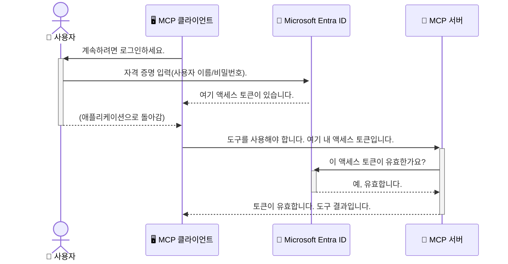

# AI 워크플로 보호: 모델 컨텍스트 프로토콜 서버용 Entra ID 인증

## 소개
모델 컨텍스트 프로토콜(MCP) 서버를 보호하는 것은 집 현관문을 잠그는 것만큼 중요합니다. MCP 서버를 열어두면 도구와 데이터가 무단 액세스에 노출되어 보안 침해가 발생할 수 있습니다. Microsoft Entra ID는 강력한 클라우드 기반 ID 및 액세스 관리 솔루션을 제공하여 권한이 있는 사용자와 애플리케이션만 MCP 서버와 상호 작용할 수 있도록 도와줍니다. 이 섹션에서는 Entra ID 인증을 사용해 AI 워크플로를 보호하는 방법을 배웁니다.

## 학습 목표
이 섹션이 끝나면 다음을 할 수 있습니다:

- MCP 서버 보안의 중요성을 이해합니다.
- Microsoft Entra ID 및 OAuth 2.0 인증의 기본 개념을 설명합니다.
- 퍼블릭 클라이언트와 컨피덴셜 클라이언트의 차이를 인식합니다.
- 로컬(퍼블릭 클라이언트) 및 원격(컨피덴셜 클라이언트) MCP 서버 시나리오에서 Entra ID 인증을 구현합니다.
- AI 워크플로 개발 시 보안 모범 사례를 적용합니다.

## 보안과 MCP

집 현관문을 잠그지 않고 두지 않는 것처럼, MCP 서버를 아무나 접근할 수 있도록 열어두어서는 안 됩니다. AI 워크플로를 보호하는 것은 견고하고 신뢰할 수 있으며 안전한 애플리케이션을 구축하는 데 필수적입니다. 이 장에서는 Microsoft Entra ID를 사용하여 MCP 서버를 보호하는 법을 소개하며, 권한이 있는 사용자와 애플리케이션만 도구와 데이터에 접근할 수 있도록 보장합니다.

## MCP 서버 보안이 중요한 이유

MCP 서버에 이메일 전송이나 고객 데이터베이스 액세스 도구가 있다고 가정해 보십시오. 서버가 보호되어 있지 않으면 아무나 그 도구를 사용해 무단으로 데이터에 접근하거나 스팸을 보내거나 악의적인 활동을 할 수 있습니다.

인증을 구현함으로써 서버에 대한 모든 요청이 확인되어, 해당 요청을 하는 사용자 또는 애플리케이션의 신원이 검증됩니다. 이것이 AI 워크플로를 보호하는 데 있어 가장 첫 번째이자 핵심 단계입니다.

## Microsoft Entra ID 소개

[**Microsoft Entra ID**](https://adoption.microsoft.com/microsoft-security/entra/)는 클라우드 기반 ID 및 액세스 관리 서비스입니다. 애플리케이션을 위한 보편적인 보안 경비원과 같습니다. 사용자 신원 확인(인증)과 사용 권한 결정(인가)의 복잡한 과정을 처리합니다.

Entra ID를 사용하면 다음이 가능합니다:

- 사용자에 대한 안전한 로그인 활성화
- API 및 서비스 보호
- 중앙 위치에서 액세스 정책 관리

MCP 서버의 경우, Entra ID는 누가 서버 기능에 접근할 수 있는지 관리하기 위한 강력하고 신뢰받는 솔루션을 제공합니다.

---

## 마법 이해하기: Entra ID 인증 작동 원리

Entra ID는 <strong>OAuth 2.0</strong>과 같은 오픈 표준을 사용해 인증을 처리합니다. 세부 사항은 복잡할 수 있지만 핵심 개념은 비유를 통해 쉽게 이해할 수 있습니다.

### OAuth 2.0 간단 소개: 밸렛 키

OAuth 2.0을 자동차를 위한 발렛 서비스라고 생각해 보십시오. 식당에 도착했을 때 마스터 키를 발렛에게 주지 않고, 제한된 권한이 있는 <strong>밸렛 키</strong>를 제공합니다. 밸렛 키는 시동 걸기와 문 잠금은 할 수 있지만 트렁크나 글로브 박스는 열 수 없습니다.

이 비유에서:

- <strong>당신</strong>은 <strong>사용자</strong>입니다.
- <strong>당신의 차</strong>는 귀중한 도구와 데이터를 가진 <strong>MCP 서버</strong>입니다.
- <strong>밸렛</strong>은 <strong>Microsoft Entra ID</strong>입니다.
- <strong>주차 안내원</strong>은 **MCP 클라이언트**(서버에 접근하는 애플리케이션)입니다.
- <strong>밸렛 키</strong>는 <strong>액세스 토큰</strong>입니다.

액세스 토큰은 사용자가 로그인한 후 MCP 클라이언트가 Entra ID로부터 받는 안전한 문자열입니다. 클라이언트는 요청 시마다 이 토큰을 MCP 서버에 제시하며, 서버는 토큰을 검증해 요청이 합법적이고 클라이언트가 권한이 있음을 확인합니다. 이 과정에서 실제 자격 증명(비밀번호 등)을 다룰 필요가 없습니다.

### 인증 흐름

작동 과정은 다음과 같습니다:



### Microsoft Authentication Library (MSAL) 소개

코드 설명에 들어가기 전에, 예제에서 보게 될 핵심 구성 요소인 <strong>Microsoft Authentication Library (MSAL)</strong>를 소개합니다.

MSAL은 마이크로소프트가 개발한 라이브러리로, 개발자가 인증을 훨씬 쉽게 처리할 수 있게 도와줍니다. 자체적으로 복잡한 코드를 작성할 필요 없이 MSAL이 보안 토큰 관리, 로그인 처리, 세션 갱신 등의 무거운 일을 처리합니다.

MSAL 사용을 권장하는 이유는 다음과 같습니다:

- **안전함:** 업계 표준 프로토콜과 보안 모범 사례를 구현하여 코드 취약점 위험을 줄입니다.
- **개발 간소화:** OAuth 2.0 및 OpenID Connect 프로토콜의 복잡성을 추상화해서 몇 줄 코드만으로 강력한 인증 기능을 추가할 수 있습니다.
- **유지 관리:** 마이크로소프트가 적극적으로 유지보수하며 최신 보안 위협과 플랫폼 변경에 대응합니다.

MSAL은 .NET, JavaScript/TypeScript, Python, Java, Go, iOS, Android 등 다양한 언어와 프레임워크를 지원해 전체 기술 스택에서 일관된 인증 패턴을 사용할 수 있습니다.

MSAL에 대해 더 배우려면 공식 [MSAL 개요 문서](https://learn.microsoft.com/entra/identity-platform/msal-overview)를 참조하세요.

---

## Entra ID로 MCP 서버 보호하기: 단계별 가이드

이제 Entra ID를 사용해 로컬 MCP 서버(`stdio` 통신)를 보호하는 방법을 살펴봅니다. 이 예제는 사용자의 컴퓨터에서 실행되는 애플리케이션(데스크톱 앱이나 로컬 개발 서버 등)에 적합한 <strong>퍼블릭 클라이언트</strong>를 사용합니다.

### 시나리오 1: 로컬 MCP 서버 보안 (퍼블릭 클라이언트 사용)

이 시나리오에서는 로컬에서 실행되고 `stdio`를 통해 통신하며 사용자를 인증하기 위해 Entra ID를 사용하는 MCP 서버를 살펴봅니다. 서버에는 Microsoft Graph API에서 사용자 프로필 정보를 가져오는 단일 도구가 있습니다.

#### 1. Entra ID에서 애플리케이션 설정

코드를 작성하기 전에 Microsoft Entra ID에 애플리케이션을 등록해야 합니다. 이를 통해 Entra ID에 애플리케이션 정보를 알려 인증 서비스를 사용할 권한을 부여받습니다.

1. <strong>[Microsoft Entra 포털](https://entra.microsoft.com/)</strong>로 이동합니다.
2. <strong>앱 등록(App registrations)</strong>으로 가서 <strong>새 등록(New registration)</strong>을 클릭합니다.
3. 애플리케이션 이름을 입력합니다(예: "My Local MCP Server").
4. <strong>지원되는 계정 유형(Supported account types)</strong>에서 <strong>이 조직 디렉터리 내 계정(Accounts in this organizational directory only)</strong>를 선택합니다.
5. 이번 예제에서는 <strong>리디렉션 URI(Redirect URI)</strong>를 비워둡니다.
6. <strong>등록(Register)</strong>을 클릭합니다.

등록 후 <strong>애플리케이션(클라이언트) ID</strong>와 <strong>디렉터리(테넌트) ID</strong>를 메모해 두세요. 코드에 필요합니다.

#### 2. 코드 주요 내용 분석

인증을 처리하는 핵심 부분을 살펴봅니다. 전체 코드는 [mcp-auth-servers GitHub 저장소](https://github.com/Azure-Samples/mcp-auth-servers)의 [Entra ID - Local - WAM](https://github.com/Azure-Samples/mcp-auth-servers/tree/main/src/entra-id-local-wam) 폴더에서 확인할 수 있습니다.

**`AuthenticationService.cs`**

이 클래스는 Entra ID와의 상호 작용을 담당합니다.

- **`CreateAsync`**: MSAL(Microsoft Authentication Library)의 `PublicClientApplication`을 초기화합니다. 애플리케이션의 `clientId`와 `tenantId`로 구성됩니다.
- **`WithBroker`**: Windows Web Account Manager 같은 브로커 사용을 활성화하여 더 안전하고 원활한 싱글 사인온 경험을 제공합니다.
- **`AcquireTokenAsync`**: 핵심 메서드입니다. 먼저 토큰을 조용히(사용자가 다시 로그인할 필요 없이 세션이 유효하면) 가져오려 하고, 불가능하면 사용자에게 인터랙티브하게 로그인하도록 요청합니다.

```csharp
// Simplified for clarity
public static async Task<AuthenticationService> CreateAsync(ILogger<AuthenticationService> logger)
{
    var msalClient = PublicClientApplicationBuilder
        .Create(_clientId) // Your Application (client) ID
        .WithAuthority(AadAuthorityAudience.AzureAdMyOrg)
        .WithTenantId(_tenantId) // Your Directory (tenant) ID
        .WithBroker(new BrokerOptions(BrokerOptions.OperatingSystems.Windows))
        .Build();

    // ... cache registration ...

    return new AuthenticationService(logger, msalClient);
}

public async Task<string> AcquireTokenAsync()
{
    try
    {
        // Try silent authentication first
        var accounts = await _msalClient.GetAccountsAsync();
        var account = accounts.FirstOrDefault();

        AuthenticationResult? result = null;

        if (account != null)
        {
            result = await _msalClient.AcquireTokenSilent(_scopes, account).ExecuteAsync();
        }
        else
        {
            // If no account, or silent fails, go interactive
            result = await _msalClient.AcquireTokenInteractive(_scopes).ExecuteAsync();
        }

        return result.AccessToken;
    }
    catch (Exception ex)
    {
        _logger.LogError(ex, "An error occurred while acquiring the token.");
        throw; // Optionally rethrow the exception for higher-level handling
    }
}
```

**`Program.cs`**

MCP 서버가 설정되고 인증 서비스가 통합되는 부분입니다.

- **`AddSingleton<AuthenticationService>`**: 인증 서비스를 DI 컨테이너에 등록해 다른 구성 요소(예: 도구)에서 사용할 수 있게 합니다.
- **`GetUserDetailsFromGraph` 도구**: 이 도구는 `AuthenticationService` 인스턴스를 필요로 합니다. 사용하기 전에 `authService.AcquireTokenAsync()`를 호출해 유효한 액세스 토큰을 받아옵니다. 인증이 성공하면 토큰을 이용해 Microsoft Graph API를 호출하여 사용자 정보를 가져옵니다.

```csharp
// Simplified for clarity
[McpServerTool(Name = "GetUserDetailsFromGraph")]
public static async Task<string> GetUserDetailsFromGraph(
    AuthenticationService authService)
{
    try
    {
        // This will trigger the authentication flow
        var accessToken = await authService.AcquireTokenAsync();

        // Use the token to create a GraphServiceClient
        var graphClient = new GraphServiceClient(
            new BaseBearerTokenAuthenticationProvider(new TokenProvider(authService)));

        var user = await graphClient.Me.GetAsync();

        return System.Text.Json.JsonSerializer.Serialize(user);
    }
    catch (Exception ex)
    {
        return $"Error: {ex.Message}";
    }
}
```

#### 3. 전체 작동 과정

1. MCP 클라이언트가 `GetUserDetailsFromGraph` 도구를 사용하려 하면, 도구가 먼저 `AcquireTokenAsync`를 호출합니다.
2. `AcquireTokenAsync`는 MSAL 라이브러리를 통해 유효한 토큰을 확인합니다.
3. 토큰이 없으면 MSAL이 브로커를 통해 사용자가 Entra ID 계정으로 로그인하도록 화면에 띄웁니다.
4. 사용자가 로그인하면 Entra ID가 액세스 토큰을 발급합니다.
5. 도구는 토큰을 받아 Microsoft Graph API를 호출해 사용자 정보를 안전하게 조회합니다.
6. 사용자 정보가 MCP 클라이언트에 반환됩니다.

이 과정은 인증된 사용자만 도구를 사용할 수 있게 하여 로컬 MCP 서버를 효과적으로 보호합니다.

### 시나리오 2: 원격 MCP 서버 보안 (컨피덴셜 클라이언트 사용)

MCP 서버가 원격 머신(예: 클라우드 서버)에서 실행되고 HTTP 스트리밍 같은 프로토콜로 통신할 경우 보안 요구 사항이 다릅니다. 이때는 <strong>컨피덴셜 클라이언트</strong>와 <strong>Authorization Code Flow</strong>를 사용해야 합니다. 이 방식은 애플리케이션의 비밀 정보가 브라우저에 노출되지 않아 더 안전합니다.

이 예제는 Express.js를 사용하는 TypeScript 기반 MCP 서버입니다.

#### 1. Entra ID에서 애플리케이션 설정

설정은 퍼블릭 클라이언트와 유사하지만 주요 차이는 <strong>클라이언트 시크릿</strong>을 생성해야 한다는 점입니다.

1. <strong>[Microsoft Entra 포털](https://entra.microsoft.com/)</strong>로 이동합니다.
2. 앱 등록에서 **인증서 및 비밀(Certificates & secrets)** 탭으로 이동합니다.
3. <strong>새 클라이언트 시크릿(New client secret)</strong>을 클릭하고 설명을 입력한 후 <strong>추가(Add)</strong>를 클릭합니다.
4. **중요:** 이 시크릿 값은 즉시 복사하세요. 이후 다시 볼 수 없습니다.
5. 또한 <strong>리디렉션 URI</strong>를 설정해야 합니다. **인증(Authentication)** 탭에서 <strong>플랫폼 추가(Add a platform)</strong>를 클릭하고 <strong>웹(Web)</strong>을 선택한 뒤 애플리케이션의 리디렉션 URI를 입력합니다(예: `http://localhost:3001/auth/callback`).

> **⚠️ 중요 보안 참고:** 실제 서비스 환경에서는 Microsoft가 클라이언트 시크릿 대신 **Managed Identity(관리되는 ID)** 또는 **Workload Identity Federation** 같은 **비시크릿 인증(secretless authentication)** 방식을 강력히 권장합니다. 클라이언트 시크릿은 노출되거나 탈취될 위험이 있으므로 보안상 취약할 수 있습니다. 관리되는 ID는 코드나 설정 파일에 자격증명을 저장하지 않아 더 안전한 접근법입니다.
>
> 관리되는 ID와 구현 방법에 관한 자세한 내용은 [Azure 리소스용 관리되는 ID 개요](https://learn.microsoft.com/entra/identity/managed-identities-azure-resources/overview)를 참고하세요.

#### 2. 코드 주요 내용 분석

이 예제는 세션 기반 방식을 사용합니다. 사용자가 인증하면 서버가 액세스 토큰과 갱신 토큰을 세션에 저장하고 사용자에게 세션 토큰을 제공합니다. 이후 요청 시 이 세션 토큰을 사용합니다. 전체 코드는 [mcp-auth-servers GitHub 저장소](https://github.com/Azure-Samples/mcp-auth-servers)의 [Entra ID - Confidential client](https://github.com/Azure-Samples/mcp-auth-servers/tree/main/src/entra-id-cca-session) 폴더에서 확인할 수 있습니다.

**`Server.ts`**

Express 서버와 MCP 전송 계층을 설정합니다.

- **`requireBearerAuth`**: `/sse`와 `/message` 엔드포인트를 보호하는 미들웨어입니다. 요청의 `Authorization` 헤더에 유효한 베어러 토큰이 있는지 확인합니다.
- **`EntraIdServerAuthProvider`**: `McpServerAuthorizationProvider` 인터페이스를 구현하는 커스텀 클래스입니다. OAuth 2.0 플로우를 관리합니다.
- **`/auth/callback`**: 사용자가 인증 후 Entra ID로부터 리디렉션될 때 처리하는 엔드포인트입니다. 인증 코드를 액세스 토큰 및 갱신 토큰으로 교환합니다.

```typescript
// 명확성을 위해 단순화됨
const app = express();
const { server } = createServer();
const provider = new EntraIdServerAuthProvider();

// SSE 엔드포인트 보호
app.get("/sse", requireBearerAuth({
  provider,
  requiredScopes: ["User.Read"]
}), async (req, res) => {
  // ... 전송에 연결 ...
});

// 메시지 엔드포인트 보호
app.post("/message", requireBearerAuth({
  provider,
  requiredScopes: ["User.Read"]
}), async (req, res) => {
  // ... 메시지 처리 ...
});

// OAuth 2.0 콜백 처리
app.get("/auth/callback", (req, res) => {
  provider.handleCallback(req.query.code, req.query.state)
    .then(result => {
      // ... 성공 또는 실패 처리 ...
    });
});
```

**`Tools.ts`**

MCP 서버가 제공하는 도구를 정의합니다. `getUserDetails` 도구는 앞선 예제와 비슷하지만 액세스 토큰을 세션에서 가져옵니다.

```typescript
// 명확성을 위해 단순화됨
server.setRequestHandler(CallToolRequestSchema, async (request) => {
  const { name } = request.params;
  const context = request.params?.context as { token?: string } | undefined;
  const sessionToken = context?.token;

  if (name === ToolName.GET_USER_DETAILS) {
    if (!sessionToken) {
      throw new AuthenticationError("Authentication token is missing or invalid. Ensure the token is provided in the request context.");
    }

    // 세션 저장소에서 Entra ID 토큰 가져오기
    const tokenData = tokenStore.getToken(sessionToken);
    const entraIdToken = tokenData.accessToken;

    const graphClient = Client.init({
      authProvider: (done) => {
        done(null, entraIdToken);
      }
    });

    const user = await graphClient.api('/me').get();

    // ... 사용자 세부 정보 반환 ...
  }
});
```

**`auth/EntraIdServerAuthProvider.ts`**

이 클래스는 다음 작업을 처리합니다:

- 사용자에게 Entra ID 로그인 페이지로 리디렉션
- 인증 코드를 액세스 토큰으로 교환
- 토큰을 `tokenStore`에 저장
- 액세스 토큰 만료 시 토큰 갱신

#### 3. 전체 작동 과정

1. 사용자가 처음 MCP 서버에 접속하려 할 때, `requireBearerAuth` 미들웨어는 유효한 세션이 없음을 감지하고 Entra ID 로그인 페이지로 리디렉션합니다.
2. 사용자는 Entra ID 계정으로 로그인합니다.
3. Entra ID는 사용자를 권한 부여 코드와 함께 `/auth/callback` 엔드포인트로 다시 리디렉션합니다.  
4. 서버는 코드를 액세스 토큰과 리프레시 토큰으로 교환하고, 이를 저장하며 클라이언트에 전송할 세션 토큰을 생성합니다.  
5. 클라이언트는 이제 이 세션 토큰을 `Authorization` 헤더에 포함하여 모든 향후 요청을 MCP 서버에 보낼 수 있습니다.  
6. `getUserDetails` 도구가 호출될 때 세션 토큰을 사용하여 Entra ID 액세스 토큰을 조회하고, 이를 사용해 Microsoft Graph API를 호출합니다.

이 흐름은 공개 클라이언트 흐름보다 더 복잡하지만 인터넷에 노출된 엔드포인트에는 필요합니다. 원격 MCP 서버는 공개 인터넷을 통해 접근 가능하므로 무단 접근 및 잠재적 공격으로부터 보호하기 위해 더 강력한 보안 조치가 필요합니다.


## Security Best Practices

- **항상 HTTPS 사용**: 클라이언트와 서버 간 통신을 암호화하여 토큰이 가로채이지 않도록 보호합니다.  
- **역할 기반 액세스 제어(RBAC) 구현**: 단순히 사용자가 인증되었는지 확인하는 것이 아니라, 사용자가 무엇을 할 권한이 있는지 확인합니다. Entra ID에서 역할을 정의하고 MCP 서버에서 이를 확인할 수 있습니다.  
- **모니터링 및 감사**: 모든 인증 이벤트를 기록하여 의심스러운 활동을 감지하고 대응할 수 있도록 합니다.  
- **요청 제한 및 스로틀링 처리**: Microsoft Graph 및 기타 API는 남용 방지를 위해 요청 제한을 구현합니다. MCP 서버에서 지수적 백오프와 재시도 로직을 구현하여 HTTP 429 (요청 과다) 응답을 원활하게 처리하세요. 자주 접근하는 데이터를 캐싱해 API 호출을 줄이는 것도 고려하세요.  
- **안전한 토큰 저장**: 액세스 토큰과 리프레시 토큰을 안전하게 저장하세요. 로컬 애플리케이션의 경우 시스템의 보안 저장 메커니즘을 사용하고, 서버 애플리케이션은 암호화된 저장소나 Azure Key Vault 같은 보안 키 관리 서비스를 사용하는 것을 고려하세요.  
- **토큰 만료 처리**: 액세스 토큰은 제한된 수명을 가집니다. 리프레시 토큰을 사용해 자동 토큰 갱신을 구현하여 재인증 없이도 원활한 사용자 경험을 유지하세요.  
- **Azure API Management 사용 고려**: MCP 서버에 직접 보안을 구현하면 세밀한 제어가 가능하지만, Azure API Management 같은 API 게이트웨이는 인증, 인가, 요청 제한, 모니터링 등 많은 보안 문제를 자동으로 처리할 수 있습니다. 중앙 집중식 보안 계층을 제공하여 클라이언트와 MCP 서버 사이를 보호합니다. MCP와 API 게이트웨이 사용에 대한 자세한 내용은 [Azure API Management Your Auth Gateway For MCP Servers](https://techcommunity.microsoft.com/blog/integrationsonazureblog/azure-api-management-your-auth-gateway-for-mcp-servers/4402690)를 참조하세요.


##  Key Takeaways

- MCP 서버를 보호하는 것은 데이터와 도구를 안전하게 유지하는 데 매우 중요합니다.  
- Microsoft Entra ID는 강력하고 확장 가능한 인증 및 인가 솔루션을 제공합니다.  
- 로컬 애플리케이션에는 **공개 클라이언트**, 원격 서버에는 <strong>비밀 클라이언트</strong>를 사용하세요.  
- <strong>권한 부여 코드 흐름(Authorization Code Flow)</strong>은 웹 애플리케이션에 가장 안전한 옵션입니다.


## Exercise

1. 여러분이 구축할 MCP 서버는 로컬 서버인가 원격 서버인가요?  
2. 답변에 따라 공개 클라이언트와 비밀 클라이언트 중 어느 것을 사용할 것인가요?  
3. MCP 서버가 Microsoft Graph에 대해 작업을 수행할 때 요청할 권한은 무엇인가요?


## Hands-on Exercises

### Exercise 1: Register an Application in Entra ID
Microsoft Entra 포털로 이동하세요.  
MCP 서버용 새 애플리케이션을 등록하세요.  
애플리케이션(클라이언트) ID와 디렉터리(테넌트) ID를 기록하세요.

### Exercise 2: Secure a Local MCP Server (Public Client)
- MSAL (Microsoft Authentication Library)을 사용하여 사용자 인증을 통합하는 코드 예제를 따라하세요.  
- Microsoft Graph에서 사용자 세부 정보를 가져오는 MCP 도구를 호출하여 인증 흐름을 테스트하세요.

### Exercise 3: Secure a Remote MCP Server (Confidential Client)
- Entra ID에서 비밀 클라이언트를 등록하고 클라이언트 비밀을 생성하세요.  
- Express.js MCP 서버를 권한 부여 코드 흐름을 사용하도록 구성하세요.  
- 보호된 엔드포인트를 테스트하고 토큰 기반 접근이 제대로 동작하는지 확인하세요.

### Exercise 4: Apply Security Best Practices
- 로컬 또는 원격 서버에 HTTPS를 활성화하세요.  
- 서버 로직에서 역할 기반 액세스 제어(RBAC)를 구현하세요.  
- 토큰 만료 처리와 안전한 토큰 저장을 추가하세요.

## Resources

1. **MSAL Overview Documentation**  
   Microsoft Authentication Library (MSAL)이 플랫폼 전반에서 어떻게 안전한 토큰 획득을 지원하는지 알아보세요:  
   [MSAL Overview on Microsoft Learn](https://learn.microsoft.com/en-gb/entra/msal/overview)

2. **Azure-Samples/mcp-auth-servers GitHub Repository**  
   인증 흐름을 시연하는 MCP 서버 참조 구현:  
   [Azure-Samples/mcp-auth-servers on GitHub](https://github.com/Azure-Samples/mcp-auth-servers)

3. **Managed Identities for Azure Resources Overview**  
   시스템 할당 또는 사용자 할당 관리 ID를 사용해 비밀을 제거하는 방법 이해하기:  
   [Managed Identities Overview on Microsoft Learn](https://learn.microsoft.com/en-us/entra/identity/managed-identities-azure-resources/)

4. **Azure API Management: Your Auth Gateway for MCP Servers**  
   APIM을 MCP 서버용 안전한 OAuth2 게이트웨이로 활용하는 심층 안내:  
   [Azure API Management Your Auth Gateway For MCP Servers](https://techcommunity.microsoft.com/blog/integrationsonazureblog/azure-api-management-your-auth-gateway-for-mcp-servers/4402690)

5. **Microsoft Graph Permissions Reference**  
   Microsoft Graph의 위임 및 애플리케이션 권한 전체 목록:  
   [Microsoft Graph Permissions Reference](https://learn.microsoft.com/zh-tw/graph/permissions-reference)


## Learning Outcomes
이 섹션을 완료한 후, 다음을 수행할 수 있습니다:

- 인증이 MCP 서버 및 AI 워크플로우에 왜 중요한지 설명할 수 있습니다.  
- 로컬 및 원격 MCP 서버 시나리오에 대해 Entra ID 인증을 설정하고 구성할 수 있습니다.  
- 서버 배포에 따라 적절한 클라이언트 유형(공개 또는 비밀)을 선택할 수 있습니다.  
- 토큰 저장 및 역할 기반 권한 부여 등 보안 코딩 관행을 구현할 수 있습니다.  
- MCP 서버와 도구를 무단 접근으로부터 자신 있게 보호할 수 있습니다.

## What's next 

- [5.13 Model Context Protocol (MCP) Integration with Microsoft Foundry](../mcp-foundry-agent-integration/README.md)

---

<!-- CO-OP TRANSLATOR DISCLAIMER START -->
**면책 조항**:
이 문서는 AI 번역 서비스 [Co-op Translator](https://github.com/Azure/co-op-translator)를 사용하여 번역되었습니다. 정확성을 기하기 위해 노력하고 있으나, 자동 번역은 오류나 부정확한 부분이 있을 수 있음을 유의하시기 바랍니다. 원본 문서의 원어본이 권위 있는 자료로 간주되어야 합니다. 중요한 정보의 경우, 전문가의 인간 번역을 권장합니다. 이 번역 사용으로 인해 발생하는 오해나 잘못된 해석에 대해 당사는 책임을 지지 않습니다.
<!-- CO-OP TRANSLATOR DISCLAIMER END -->